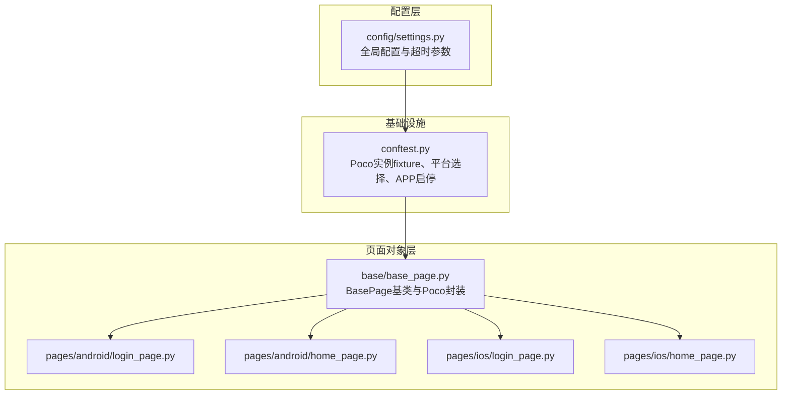
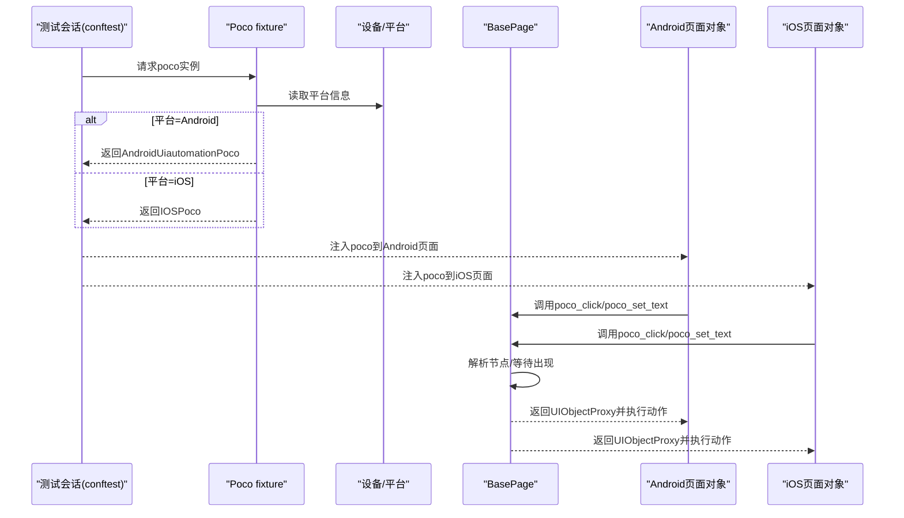
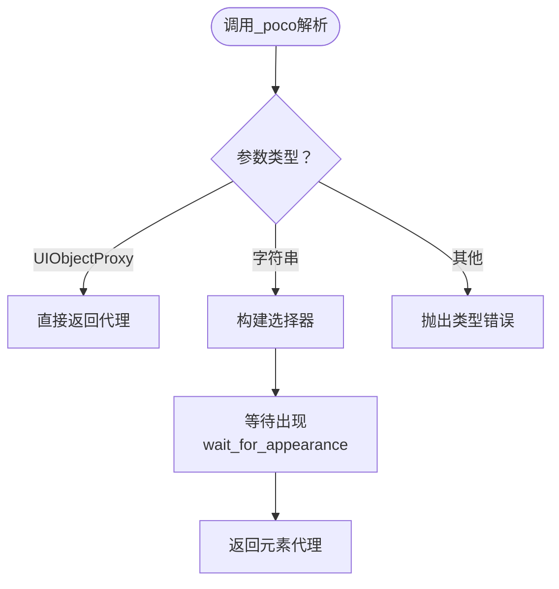
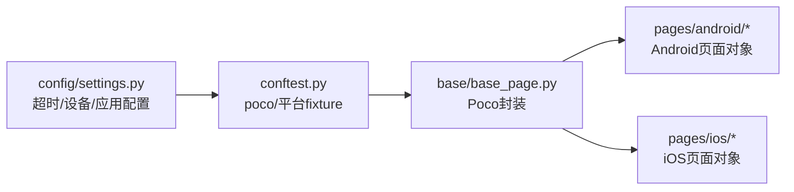

# Poco UI树定位

<cite>
**本文引用的文件**
- [conftest.py](file://conftest.py)
- [base_page.py](file://base/base_page.py)
- [login_page.py（Android）](file://pages/android/login_page.py)
- [home_page.py（Android）](file://pages/android/home_page.py)
- [login_page.py（iOS）](file://pages/ios/login_page.py)
- [home_page.py（iOS）](file://pages/ios/home_page.py)
- [settings.py](file://config/settings.py)
</cite>

## 目录
1. [简介](#简介)
2. [项目结构](#项目结构)
3. [核心组件](#核心组件)
4. [架构总览](#架构总览)
5. [详细组件分析](#详细组件分析)
6. [依赖分析](#依赖分析)
7. [性能考虑](#性能考虑)
8. [故障排查指南](#故障排查指南)
9. [结论](#结论)
10. [附录](#附录)

## 简介
本文件围绕AirTestUI中的Poco UI树定位能力，系统阐述基于Poco引擎的UI树定位原理与实践，包括节点遍历、属性匹配、层级关系等核心概念；详解Poco查询表达式的语法与使用方法（属性选择器、组合选择器、伪类选择器等）；对比Android与iOS平台下的定位差异与适配策略；并给出性能优化建议（节点缓存、查询优化、批量操作等）。文末提供多种应用场景与高级用法的示例路径，帮助读者快速落地。

## 项目结构
AirTestUI采用分层与特性结合的组织方式：测试用例按平台拆分，页面对象按平台拆分，基础能力集中在base目录，配置集中于config目录。Poco定位主要通过页面对象基类与各平台页面对象协作实现。

图表来源
- [conftest.py:185-207](file://conftest.py#L185-L207)
- [base_page.py:287-306](file://base/base_page.py#L287-L306)
- [login_page.py（Android）:14-107](file://pages/android/login_page.py#L14-L107)
- [home_page.py（Android）:14-58](file://pages/android/home_page.py#L14-L58)
- [login_page.py（iOS）:13-65](file://pages/ios/login_page.py#L13-L65)
- [home_page.py（iOS）:12-43](file://pages/ios/home_page.py#L12-L43)

章节来源
- [conftest.py:185-207](file://conftest.py#L185-L207)
- [base_page.py:287-306](file://base/base_page.py#L287-L306)

## 核心组件
- Poco实例化与平台适配：在fixture中根据平台动态选择Android或iOS的Poco驱动，并注入到页面对象。
- BasePage基类：封装Poco常用操作（点击、输入、断言、等待），并提供统一的解析逻辑，支持字符串节点名与UIObjectProxy实例混用。
- 页面对象：Android与iOS分别实现登录页与首页，演示Poco定位与图像识别的混合使用策略。
- 配置系统：提供超时参数与设备/应用配置，影响等待与定位稳定性。

章节来源
- [conftest.py:185-207](file://conftest.py#L185-L207)
- [base_page.py:184-306](file://base/base_page.py#L184-L306)
- [login_page.py（Android）:14-107](file://pages/android/login_page.py#L14-L107)
- [home_page.py（Android）:14-58](file://pages/android/home_page.py#L14-L58)
- [login_page.py（iOS）:13-65](file://pages/ios/login_page.py#L13-L65)
- [home_page.py（iOS）:12-43](file://pages/ios/home_page.py#L12-L43)
- [settings.py:89-91](file://config/settings.py#L89-L91)

## 架构总览
下图展示了从测试会话到页面对象调用Poco定位的整体流程，以及平台差异对Poco实例的影响。

图表来源
- [conftest.py:185-207](file://conftest.py#L185-L207)
- [base_page.py:186-306](file://base/base_page.py#L186-L306)

## 详细组件分析

### Poco实例化与平台适配
- Android：使用AndroidUiautomationPoco，启用Airtest输入与关闭每步截图，降低开销。
- iOS：使用IOSPoco，保持原生输入与交互。
- 异常降级：若初始化失败，返回None，页面对象层自动切换至图像识别兜底。

章节来源
- [conftest.py:185-207](file://conftest.py#L185-L207)

### BasePage中的Poco封装
- 统一入口：poco()提供Poco实例访问。
- 解析逻辑：_resolve_poco_element支持字符串节点名与UIObjectProxy实例，内部调用wait_for_appearance等待节点出现。
- 常用操作：poco_click、poco_set_text、poco_get_text、poco_wait_for_element、poco_assert_exists、poco_assert_text。
- 断言与日志：内置Allure步骤、截图与异常处理，便于问题定位。

图表来源
- [base_page.py:287-306](file://base/base_page.py#L287-L306)

章节来源
- [base_page.py:186-306](file://base/base_page.py#L186-L306)

### 页面对象中的Poco使用示例
- Android登录页：演示用户名/密码输入、登录按钮点击、错误提示获取、登录按钮可用性校验。
- Android首页：演示首页标识存在性校验、标题获取、底部导航点击、搜索入口与输入。
- iOS登录页/首页：与Android类似，强调iOS端Poco定位为主、图像识别为辅的策略。

章节来源
- [login_page.py（Android）:32-107](file://pages/android/login_page.py#L32-L107)
- [home_page.py（Android）:21-58](file://pages/android/home_page.py#L21-L58)
- [login_page.py（iOS）:24-65](file://pages/ios/login_page.py#L24-L65)
- [home_page.py（iOS）:18-43](file://pages/ios/home_page.py#L18-L43)

### Poco查询表达式与语法要点
- 基本选择器
  - 字符串节点名：如“login_button”、“username_input”，由Poco引擎解析为UI树节点。
  - 属性选择器：通过节点属性过滤，如attr("name")、attr("text")、attr("enabled")等。
- 组合选择器
  - 层级关系：父/子、兄弟节点组合，用于限定作用域或提升匹配精度。
  - 多条件组合：AND/OR语义组合多个属性条件，提高唯一性。
- 伪类选择器
  - 存在性：exists()用于断言节点存在。
  - 可用性：attr("enabled")用于判断控件是否可交互。
  - 文本匹配：get_text()获取文本，再进行断言。
- 实战要点
  - 优先使用稳定属性（如name/text）作为选择器主键。
  - 在复杂层级中使用层级限定，避免跨容器误选。
  - 结合等待与断言，确保UI状态稳定后再操作。

（本节为概念性说明，不直接分析具体源码文件）

### 不同平台（Android/iOS）的定位差异与适配策略
- 平台差异
  - Android：Poco驱动为AndroidUiautomationPoco，支持Airtest输入与较低的截图开销。
  - iOS：Poco驱动为IOSPoco，输入与交互更贴近原生。
- 适配策略
  - 通过fixture按平台注入不同Poco实例，页面对象无需感知差异。
  - 当Poco不可用时，页面对象自动回退到图像识别，保证用例连续性。
  - 针对iOS端，建议优先使用稳定的节点属性名；Android端可适当结合层级限定。

章节来源
- [conftest.py:185-207](file://conftest.py#L185-L207)
- [login_page.py（Android）:77-107](file://pages/android/login_page.py#L77-L107)
- [home_page.py（Android）:21-58](file://pages/android/home_page.py#L21-L58)
- [login_page.py（iOS）:56-65](file://pages/ios/login_page.py#L56-L65)
- [home_page.py（iOS）:18-43](file://pages/ios/home_page.py#L18-L43)

## 依赖分析
- BasePage依赖Poco代理UIObjectProxy，通过_poco解析与等待实现健壮的定位。
- 页面对象依赖BasePage提供的Poco封装，减少重复代码。
- conftest提供平台与Poco实例注入，是连接设备与页面对象的关键桥梁。
- 配置settings提供超时参数，影响等待与断言的容忍度。

图表来源
- [settings.py:89-91](file://config/settings.py#L89-L91)
- [conftest.py:185-207](file://conftest.py#L185-L207)
- [base_page.py:186-306](file://base/base_page.py#L186-L306)

章节来源
- [settings.py:89-91](file://config/settings.py#L89-L91)
- [conftest.py:185-207](file://conftest.py#L185-L207)
- [base_page.py:186-306](file://base/base_page.py#L186-L306)

## 性能考虑
- 节点缓存
  - 将频繁使用的UIObjectProxy缓存到页面对象属性，避免重复查询与等待。
  - 在页面切换或状态变化后及时失效缓存，防止脏数据。
- 查询优化
  - 优先使用稳定属性（如name/text）作为主键，减少层级遍历范围。
  - 在复杂层级中使用层级限定，缩小搜索空间。
- 批量操作
  - 合理合并多次点击/输入操作，减少Poco引擎往返次数。
  - 对同一节点的多次属性读取，尽量复用已获取的代理对象。
- 等待策略
  - 使用合适的超时参数，避免过长等待拖慢用例。
  - 对确定性高、加载快的节点可缩短等待时间，对不确定节点适当放宽。

（本节为通用性能建议，不直接分析具体源码文件）

## 故障排查指南
- Poco未初始化
  - 现象：调用poco()时报错。
  - 排查：确认页面对象构造时传入了poco实例；检查fixture注入链路。
- 节点解析失败
  - 现象：_resolve_poco_element抛出类型错误或等待超时。
  - 排查：确认传入的是字符串节点名或UIObjectProxy；检查节点是否存在；适当增加等待时间。
- 平台初始化失败
  - 现象：iOS/Android Poco实例为None。
  - 排查：查看日志输出；确认设备连接与Poco服务可用；必要时回退图像识别。
- 断言失败
  - 现象：文本断言或存在性断言失败。
  - 排查：开启截图并检查页面状态；核对节点属性与选择器；检查页面是否已完全渲染。

章节来源
- [base_page.py:186-190](file://base/base_page.py#L186-L190)
- [base_page.py:287-306](file://base/base_page.py#L287-L306)
- [conftest.py:205-207](file://conftest.py#L205-L207)

## 结论
AirTestUI通过统一的BasePage封装与平台化的Poco实例注入，实现了跨平台、可扩展的UI树定位能力。结合图像识别的兜底策略与完善的断言/日志体系，能够在复杂场景中稳定地完成自动化测试。建议在实践中优先使用稳定属性、合理缓存与等待策略，并针对平台差异制定适配方案，以获得最佳的定位效率与稳定性。

## 附录
- 示例路径（不含代码内容，仅提供定位与操作参考）
  - Android登录页输入用户名与密码并点击登录按钮：[pages/android/login_page.py:62-73](file://pages/android/login_page.py#L62-L73)
  - Android首页点击底部导航进入个人中心：[pages/android/home_page.py:42-47](file://pages/android/home_page.py#L42-L47)
  - Android首页搜索功能：先点击搜索图标，再输入关键词：[pages/android/home_page.py:50-57](file://pages/android/home_page.py#L50-L57)
  - iOS登录页输入用户名/密码并点击登录按钮：[pages/ios/login_page.py:49-54](file://pages/ios/login_page.py#L49-L54)
  - iOS首页验证首页已加载与获取标题：[pages/ios/home_page.py:18-36](file://pages/ios/home_page.py#L18-L36)
  - Poco断言元素存在与文本断言：[base/base_page.py:234-252](file://base/base_page.py#L234-L252)
  - Poco等待元素出现：[base/base_page.py:228-232](file://base/base_page.py#L228-L232)
  - Poco解析节点与等待出现：[base/base_page.py:287-306](file://base/base_page.py#L287-L306)
  - 平台适配与Poco实例注入：[conftest.py:185-207](file://conftest.py#L185-L207)
  - 超时参数配置：[config/settings.py:89-91](file://config/settings.py#L89-L91)