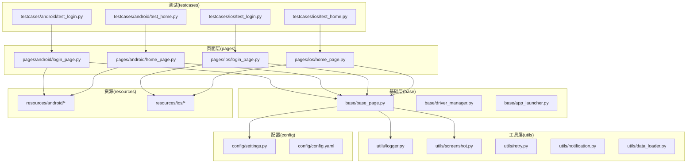
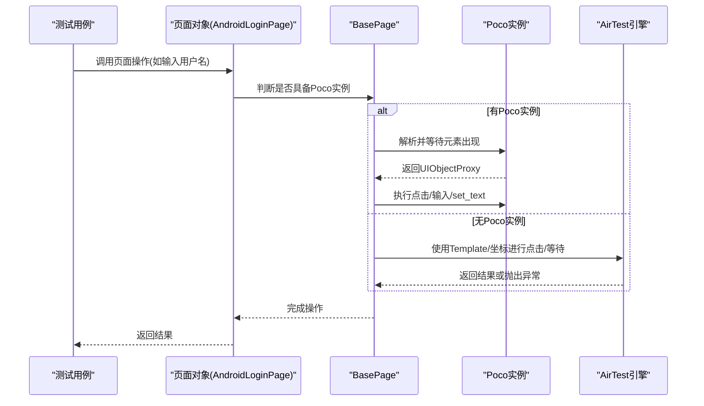
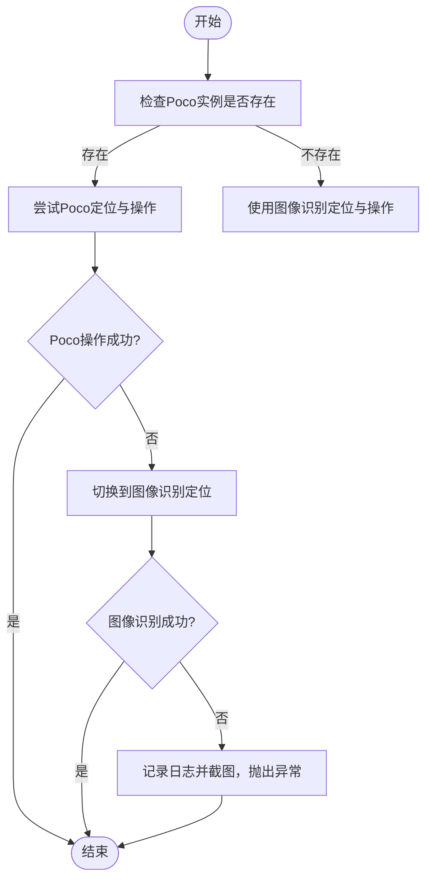
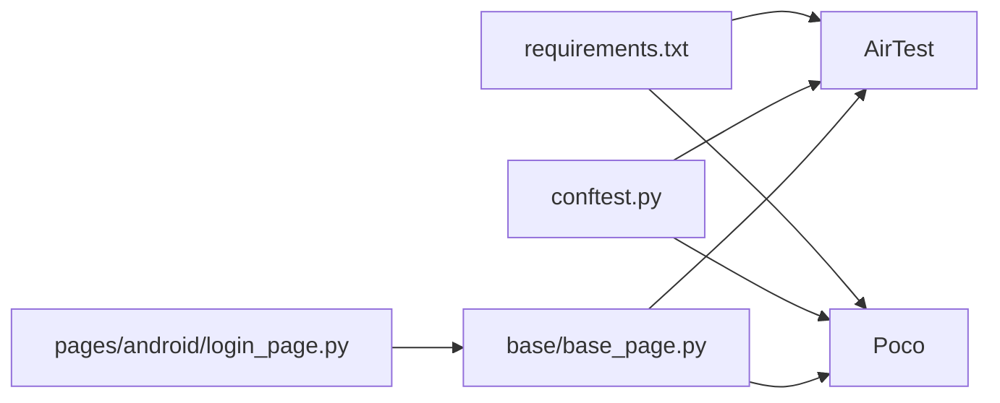

# UI定位技术

<cite>
**本文引用的文件**
- [base/base_page.py](file://base/base_page.py)
- [pages/android/login_page.py](file://pages/android/login_page.py)
- [conftest.py](file://conftest.py)
- [config/settings.py](file://config/settings.py)
- [utils/screenshot.py](file://utils/screenshot.py)
- [utils/logger.py](file://utils/logger.py)
- [requirements.txt](file://requirements.txt)
</cite>

## 目录
1. [简介](#简介)
2. [项目结构](#项目结构)
3. [核心组件](#核心组件)
4. [架构总览](#架构总览)
5. [详细组件分析](#详细组件分析)
6. [依赖关系分析](#依赖关系分析)
7. [性能考量](#性能考量)
8. [故障排查指南](#故障排查指南)
9. [结论](#结论)
10. [附录](#附录)

## 简介
本文件系统性阐述AirTestUI项目的UI定位技术，重点覆盖两类定位能力：图像识别定位与Poco UI树定位，并基于项目现有实现总结双模式定位策略（优先级、失败回退、性能优化）及典型页面元素的定位策略选择（文本、图片、复合控件）。同时给出定位失败的常见原因与解决方案，并通过“代码片段路径”指引读者在仓库中定位具体实现。

## 项目结构
项目采用分层+页面对象组织方式：
- base：基础能力层，包含页面基类、驱动管理等
- pages：页面对象层，按平台划分（android/ios）
- utils：通用工具（日志、截图、重试等）
- config：配置与设置
- testcases：测试用例
- resources：资源文件（图片模板等）

图表来源
- [base/base_page.py](file://base/base_page.py)
- [pages/android/login_page.py](file://pages/android/login_page.py)
- [config/settings.py](file://config/settings.py)
- [utils/logger.py](file://utils/logger.py)
- [utils/screenshot.py](file://utils/screenshot.py)

章节来源
- [base/base_page.py](file://base/base_page.py)
- [pages/android/login_page.py](file://pages/android/login_page.py)
- [config/settings.py](file://config/settings.py)

## 核心组件
- 页面基类 BasePage：封装AirTest与Poco的统一交互接口，提供图像识别与Poco双模式定位能力；内置智能等待、自动截图、日志与Allure步骤记录。
- 平台页面对象：以Android登录页为例，演示两种定位方式的使用与回退策略。
- 测试夹具 conftest：负责Poco实例化、设备与平台初始化、应用启停管理等。

章节来源
- [base/base_page.py](file://base/base_page.py)
- [pages/android/login_page.py](file://pages/android/login_page.py)
- [conftest.py](file://conftest.py)

## 架构总览
下图展示了从测试用例到页面对象、再到定位引擎（AirTest/Poco）的整体调用链路与双模式定位策略：

图表来源
- [pages/android/login_page.py](file://pages/android/login_page.py)
- [base/base_page.py](file://base/base_page.py)
- [conftest.py](file://conftest.py)

## 详细组件分析

### 图像识别定位（AirTest Template）
- 能力概述
  - 基于模板匹配的图像识别，适用于稳定、可复现的图标、按钮、界面元素。
  - 在Poco不可用或不稳定时作为兜底方案。
- 关键实现要点
  - 模板定义：在页面对象中以Template对象声明资源路径，资源位于resources目录。
  - 等待与点击：通过等待元素出现与点击方法完成交互。
  - 截图与日志：失败时自动截图并记录错误日志。
- 适用场景
  - 固定图标、按钮、导航元素
  - Poco节点名缺失或不稳定时的回退
- 不适用场景
  - 动态文本、可变图形、多态控件（易受分辨率、亮度、遮挡影响）

章节来源
- [pages/android/login_page.py](file://pages/android/login_page.py)
- [base/base_page.py](file://base/base_page.py)
- [utils/screenshot.py](file://utils/screenshot.py)
- [utils/logger.py](file://utils/logger.py)

### Poco UI树定位
- 能力概述
  - 基于Poco的UI树查询与操作，适合结构化控件与文本输入。
  - 支持节点名解析、等待出现、点击、设置文本、断言等。
- 关键实现要点
  - 元素解析：统一通过解析器将字符串节点名或UIObjectProxy解析为可操作对象。
  - 超时控制：统一使用配置中的等待超时参数。
  - 断言与等待：提供等待元素出现与断言存在的便捷方法。
- 适用场景
  - 文本输入框、按钮、列表项、菜单等结构化控件
- 不适用场景
  - 非结构化界面元素、纯图片且无节点名

章节来源
- [base/base_page.py](file://base/base_page.py)
- [config/settings.py](file://config/settings.py)

### 双模式定位策略（优先级与回退）
- 策略设计
  - 优先使用Poco定位；若Poco实例为空，则回退到图像识别定位。
  - 在页面对象中通过条件判断决定执行路径。
- 失败回退机制
  - Poco路径失败时，记录日志并触发截图；图像识别路径失败同样记录日志并截图。
- 性能优化建议
  - 减少Poco频繁查询：尽量一次性解析并复用UIObjectProxy。
  - 图像识别阈值与模板质量：提高模板清晰度与匹配阈值，减少误判。
  - 统一超时配置：避免过长等待导致用例耗时增加。

图表来源
- [pages/android/login_page.py](file://pages/android/login_page.py)
- [base/base_page.py](file://base/base_page.py)
- [utils/screenshot.py](file://utils/screenshot.py)
- [utils/logger.py](file://utils/logger.py)

章节来源
- [pages/android/login_page.py](file://pages/android/login_page.py)
- [base/base_page.py](file://base/base_page.py)

### 不同页面元素的定位策略选择
- 文本元素
  - 优先：Poco节点名 + set_text/get_text
  - 回退：图像识别点击输入框后使用AirTest文本输入
- 图片元素
  - 优先：图像识别（Template）
  - 回退：若Poco节点名稳定可用，可结合两者进行二次确认
- 复合控件（含文本与图标）
  - 优先：Poco节点名定位，确保结构化交互
  - 辅助：图像识别用于视觉确认或边界情况兜底

章节来源
- [pages/android/login_page.py](file://pages/android/login_page.py)
- [base/base_page.py](file://base/base_page.py)

### 代码示例（以路径指引为主）
- 在页面对象中使用图像识别定位与回退
  - [pages/android/login_page.py](file://pages/android/login_page.py)
- 在页面基类中封装Poco定位与等待
  - [base/base_page.py](file://base/base_page.py)
- 在测试夹具中初始化Poco实例（Android/IOS）
  - [conftest.py](file://conftest.py)
- 统一超时配置
  - [config/settings.py](file://config/settings.py)
- 截图与日志
  - [utils/screenshot.py](file://utils/screenshot.py)
  - [utils/logger.py](file://utils/logger.py)

## 依赖关系分析
- AirTest与Poco版本要求
  - 通过requirements.txt声明AirTest与Poco相关依赖，确保定位引擎可用性。
- 运行时依赖
  - conftest中根据平台动态导入Poco驱动（Android/IOS），并处理初始化失败回退至图像识别模式。

图表来源
- [requirements.txt](file://requirements.txt)
- [conftest.py](file://conftest.py)
- [base/base_page.py](file://base/base_page.py)
- [pages/android/login_page.py](file://pages/android/login_page.py)

章节来源
- [requirements.txt](file://requirements.txt)
- [conftest.py](file://conftest.py)

## 性能考量
- 统一超时与轮询间隔
  - 通过配置模块集中管理等待超时，避免重复硬编码导致的性能波动。
- 减少无效查询
  - Poco侧尽量一次性解析并复用UIObjectProxy，避免多次等待与查询。
- 图像识别优化
  - 提高模板质量与匹配阈值，减少误判与重试次数。
- 截图与日志
  - 仅在失败时截图，避免过多截图造成磁盘与内存压力。

章节来源
- [config/settings.py](file://config/settings.py)
- [base/base_page.py](file://base/base_page.py)
- [utils/screenshot.py](file://utils/screenshot.py)

## 故障排查指南
- Poco初始化失败
  - 现象：Poco实例为空，自动回退到图像识别。
  - 排查：检查设备连接、Poco驱动安装、平台选择。
  - 参考：[conftest.py](file://conftest.py)
- 图像识别失败
  - 现象：模板匹配不到或误匹配。
  - 排查：确认资源路径、模板清晰度、匹配阈值、分辨率差异。
  - 参考：[pages/android/login_page.py](file://pages/android/login_page.py)
- 元素等待超时
  - 现象：Poco等待元素出现超时或AirTest等待模板出现超时。
  - 排查：适当增大超时时间、检查元素是否可见、网络/渲染延迟。
  - 参考：[base/base_page.py](file://base/base_page.py)、[config/settings.py](file://config/settings.py)
- 屏幕分辨率适配
  - 现象：图像识别在不同分辨率下失效。
  - 解决：使用相对坐标或缩放策略，或准备多分辨率模板。
- 元素稳定性处理
  - 现象：元素名称变化或结构不稳定。
  - 解决：优先使用更稳定的父容器节点名，或结合图像识别进行二次确认。

章节来源
- [conftest.py](file://conftest.py)
- [pages/android/login_page.py](file://pages/android/login_page.py)
- [base/base_page.py](file://base/base_page.py)
- [config/settings.py](file://config/settings.py)

## 结论
AirTestUI通过“Poco优先、图像识别兜底”的双模式定位策略，在保证稳定性的同时兼顾了结构化控件与非结构化界面的覆盖。配合统一的超时配置、日志与截图机制，能够有效提升定位成功率与问题定位效率。后续可在模板质量、Poco节点命名规范、跨分辨率适配等方面持续优化。

## 附录
- 快速定位参考
  - 图像识别模板定义与使用：[pages/android/login_page.py](file://pages/android/login_page.py)
  - Poco元素解析与操作：[base/base_page.py](file://base/base_page.py)
  - Poco实例化与平台选择：[conftest.py](file://conftest.py)
  - 超时与配置：[config/settings.py](file://config/settings.py)
  - 日志与截图：[utils/logger.py](file://utils/logger.py)、[utils/screenshot.py](file://utils/screenshot.py)