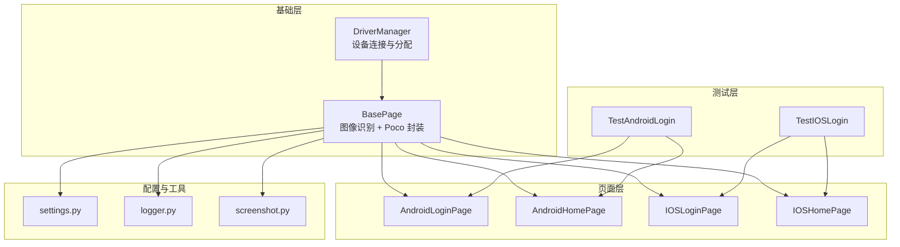
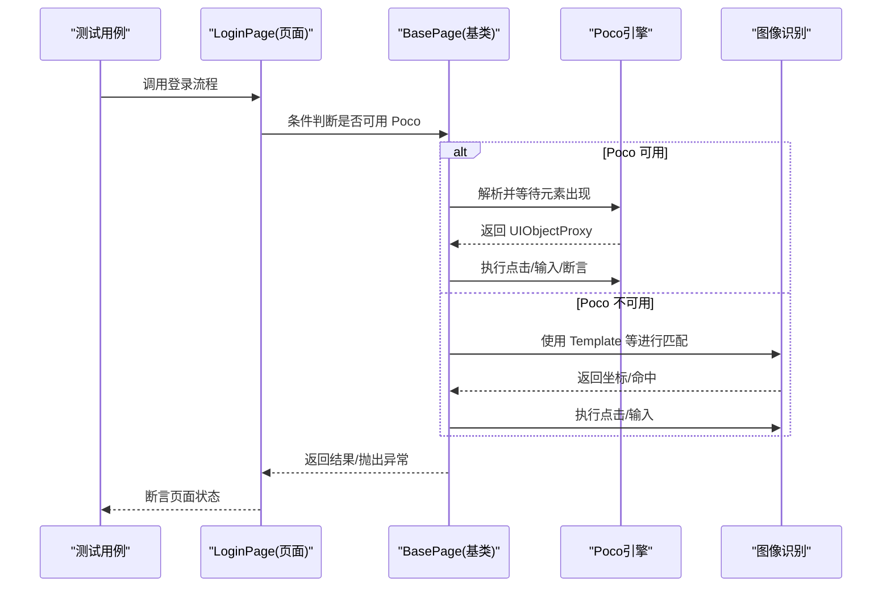
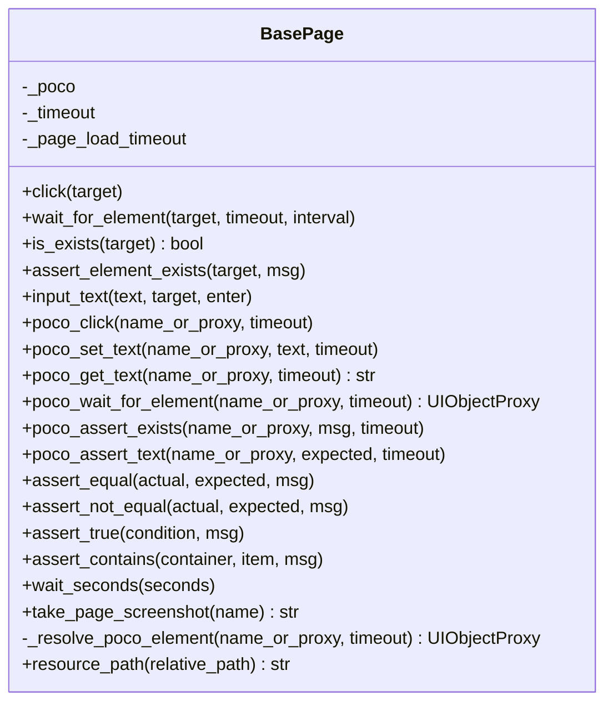
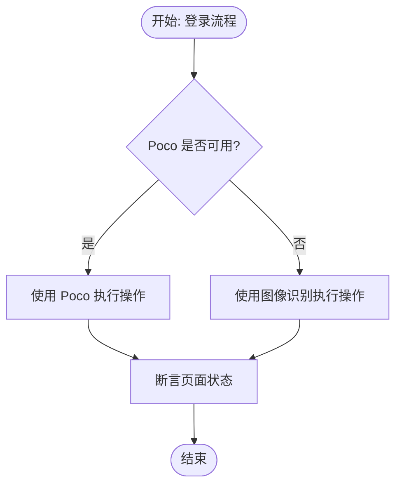
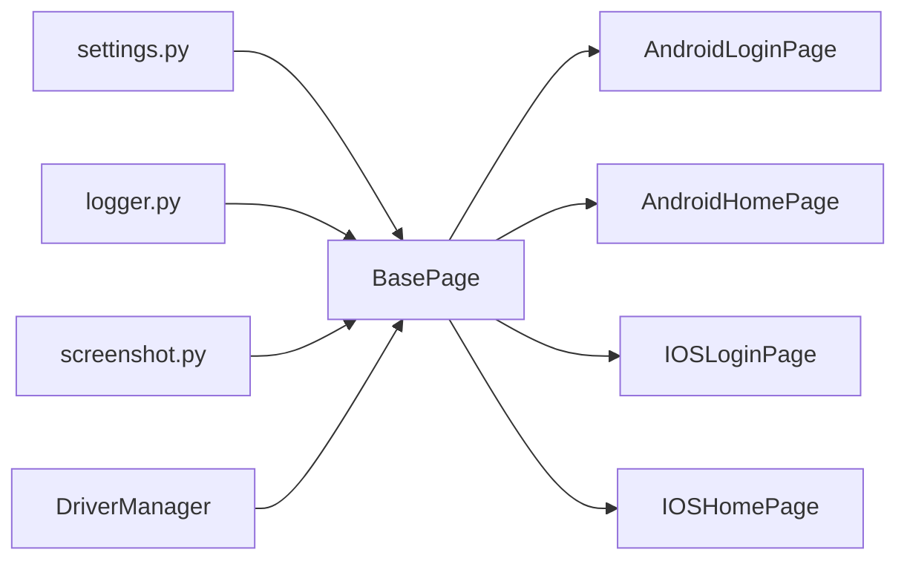

# 双模式定位策略

<cite>
**本文引用的文件**
- [base/base_page.py](file://base/base_page.py)
- [pages/android/home_page.py](file://pages/android/home_page.py)
- [pages/android/login_page.py](file://pages/android/login_page.py)
- [pages/ios/home_page.py](file://pages/ios/home_page.py)
- [pages/ios/login_page.py](file://pages/ios/login_page.py)
- [testcases/android/test_login.py](file://testcases/android/test_login.py)
- [testcases/ios/test_login.py](file://testcases/ios/test_login.py)
- [config/settings.py](file://config/settings.py)
- [utils/screenshot.py](file://utils/screenshot.py)
- [utils/logger.py](file://utils/logger.py)
- [base/driver_manager.py](file://base/driver_manager.py)
</cite>

## 目录
1. [引言](#引言)
2. [项目结构](#项目结构)
3. [核心组件](#核心组件)
4. [架构总览](#架构总览)
5. [详细组件分析](#详细组件分析)
6. [依赖分析](#依赖分析)
7. [性能考量](#性能考量)
8. [故障排查指南](#故障排查指南)
9. [结论](#结论)
10. [附录](#附录)

## 引言
本文件系统性阐述 AirTestUI 的“双模式定位策略”，即图像识别定位与 Poco UI 树定位的协同使用。文档围绕以下主题展开：
- 定位优先级与失败回退机制
- 不同场景下的策略选择（元素稳定性、响应速度、准确性）
- 动态切换机制（自动检测、条件判断、异常处理）
- 最佳实践（混合定位、互补策略、性能监控）
- 双模式定位的实现架构与使用模式

AirTestUI 在页面对象基类中内置了图像识别与 Poco 两套能力，并在具体页面对象中采用“优先 Poco、失败回退图像识别”的策略，既保证高精度与稳定性，又兼顾跨平台与兼容性。

## 项目结构
AirTestUI 采用分层+特性化的组织方式：
- base：基础能力层（页面对象基类、驱动管理器）
- pages：平台化页面对象（android/ios）
- testcases：平台化测试用例
- config：配置管理
- utils：工具模块（日志、截图、重试等）

图表来源
- [base/base_page.py:30-320](file://base/base_page.py#L30-L320)
- [base/driver_manager.py:51-188](file://base/driver_manager.py#L51-L188)
- [pages/android/login_page.py:14-107](file://pages/android/login_page.py#L14-L107)
- [pages/android/home_page.py:14-58](file://pages/android/home_page.py#L14-L58)
- [pages/ios/login_page.py:13-65](file://pages/ios/login_page.py#L13-L65)
- [pages/ios/home_page.py:12-43](file://pages/ios/home_page.py#L12-L43)
- [testcases/android/test_login.py:20-71](file://testcases/android/test_login.py#L20-L71)
- [testcases/ios/test_login.py:18-43](file://testcases/ios/test_login.py#L18-L43)
- [config/settings.py:84-112](file://config/settings.py#L84-L112)
- [utils/logger.py:50-59](file://utils/logger.py#L50-L59)
- [utils/screenshot.py:28-89](file://utils/screenshot.py#L28-L89)

章节来源
- [base/base_page.py:30-320](file://base/base_page.py#L30-L320)
- [base/driver_manager.py:51-188](file://base/driver_manager.py#L51-L188)
- [pages/android/login_page.py:14-107](file://pages/android/login_page.py#L14-L107)
- [pages/android/home_page.py:14-58](file://pages/android/home_page.py#L14-L58)
- [pages/ios/login_page.py:13-65](file://pages/ios/login_page.py#L13-L65)
- [pages/ios/home_page.py:12-43](file://pages/ios/home_page.py#L12-L43)
- [testcases/android/test_login.py:20-71](file://testcases/android/test_login.py#L20-L71)
- [testcases/ios/test_login.py:18-43](file://testcases/ios/test_login.py#L18-L43)
- [config/settings.py:84-112](file://config/settings.py#L84-L112)
- [utils/logger.py:50-59](file://utils/logger.py#L50-L59)
- [utils/screenshot.py:28-89](file://utils/screenshot.py#L28-L89)

## 核心组件
- BasePage：统一的页面对象基类，封装图像识别与 Poco 能力，提供统一的交互接口与日志、截图、断言等能力。
- 各平台页面对象：AndroidLoginPage/AndroidHomePage、IOSLoginPage/IOSHomePage，演示双模式定位策略的实际应用。
- 配置与工具：settings 提供超时、设备、应用等配置；logger 与 screenshot 提供日志与截图能力。

章节来源
- [base/base_page.py:30-320](file://base/base_page.py#L30-L320)
- [pages/android/login_page.py:14-107](file://pages/android/login_page.py#L14-L107)
- [pages/android/home_page.py:14-58](file://pages/android/home_page.py#L14-L58)
- [pages/ios/login_page.py:13-65](file://pages/ios/login_page.py#L13-L65)
- [pages/ios/home_page.py:12-43](file://pages/ios/home_page.py#L12-L43)
- [config/settings.py:84-112](file://config/settings.py#L84-L112)
- [utils/logger.py:50-59](file://utils/logger.py#L50-L59)
- [utils/screenshot.py:28-89](file://utils/screenshot.py#L28-L89)

## 架构总览
双模式定位策略的核心思想是：优先使用 Poco UI 树定位（更稳定、可读性强、可断言属性），当 Poco 不可用或异常时，自动回退到图像识别定位（跨平台、兼容旧应用）。

图表来源
- [pages/android/login_page.py:54-73](file://pages/android/login_page.py#L54-L73)
- [pages/android/home_page.py:41-57](file://pages/android/home_page.py#L41-L57)
- [pages/ios/login_page.py:40-54](file://pages/ios/login_page.py#L40-L54)
- [base/base_page.py:186-306](file://base/base_page.py#L186-L306)

## 详细组件分析

### BasePage：双模式定位的统一入口
- 图像识别能力：click、wait_for_element、is_exists、assert_element_exists、input_text 等，均以 airtest Template 为核心。
- Poco 能力：poco_click、poco_set_text、poco_get_text、poco_wait_for_element、poco_assert_exists、poco_assert_text 等，基于 UIObjectProxy。
- 统一解析：_resolve_poco_element 支持字符串节点名与 UIObjectProxy 实例，统一等待与解析逻辑。
- 超时与日志：统一从配置读取超时，结合日志与截图工具，便于问题定位。

图表来源
- [base/base_page.py:30-320](file://base/base_page.py#L30-L320)

章节来源
- [base/base_page.py:30-320](file://base/base_page.py#L30-L320)

### AndroidLoginPage：双模式定位示例
- 优先使用 Poco：输入用户名/密码、点击登录按钮、断言按钮可点击性等均优先走 Poco。
- 回退到图像识别：当 Poco 不可用时，使用 Template 进行点击与输入。
- 页面验证：is_login_page_displayed 与 is_login_button_enabled 同时尝试 Poco 与图像识别，提升鲁棒性。

图表来源
- [pages/android/login_page.py:54-73](file://pages/android/login_page.py#L54-L73)
- [pages/android/login_page.py:77-107](file://pages/android/login_page.py#L77-L107)

章节来源
- [pages/android/login_page.py:14-107](file://pages/android/login_page.py#L14-L107)

### AndroidHomePage：导航与文本获取的双模式
- 导航到个人中心：优先 Poco 点击 profile_tab，否则回退图像识别。
- 文本获取：优先 Poco 获取 page_title，否则返回空字符串。
- 首页显示校验：优先 Poco 检查 home_tab 存在性，否则使用图像识别。

章节来源
- [pages/android/home_page.py:14-58](file://pages/android/home_page.py#L14-L58)

### IOSLoginPage 与 IOSHomePage：以 Poco 为主，图像识别为辅
- iOS 页面对象主要使用 Poco，图像识别作为补充手段。
- 首页显示校验与标题获取同样遵循“Poco 优先、异常回退”的策略。

章节来源
- [pages/ios/login_page.py:13-65](file://pages/ios/login_page.py#L13-L65)
- [pages/ios/home_page.py:12-43](file://pages/ios/home_page.py#L12-L43)

### 测试用例：双模式策略的落地验证
- Android 登录用例：通过 fixture 注入 poco，页面对象内部根据是否存在 Poco 自动切换策略；断言登录后跳转至首页。
- iOS 登录用例：同理，验证登录流程与失败场景。

章节来源
- [testcases/android/test_login.py:20-71](file://testcases/android/test_login.py#L20-L71)
- [testcases/ios/test_login.py:18-43](file://testcases/ios/test_login.py#L18-L43)

## 依赖分析
- BasePage 依赖配置模块（超时）、日志模块（结构化日志）、截图模块（失败截图与 Allure 附件）。
- 页面对象依赖 BasePage，同时在构造时接收可选的 Poco 实例，决定是否启用双模式。
- DriverManager 为设备连接与分配提供基础设施，间接支撑双模式定位在多设备场景下的稳定性。

图表来源
- [base/base_page.py:23-27](file://base/base_page.py#L23-L27)
- [config/settings.py:84-112](file://config/settings.py#L84-L112)
- [utils/logger.py:50-59](file://utils/logger.py#L50-L59)
- [utils/screenshot.py:28-89](file://utils/screenshot.py#L28-L89)
- [base/driver_manager.py:51-188](file://base/driver_manager.py#L51-L188)

章节来源
- [base/base_page.py:23-27](file://base/base_page.py#L23-L27)
- [config/settings.py:84-112](file://config/settings.py#L84-L112)
- [utils/logger.py:50-59](file://utils/logger.py#L50-L59)
- [utils/screenshot.py:28-89](file://utils/screenshot.py#L28-L89)
- [base/driver_manager.py:51-188](file://base/driver_manager.py#L51-L188)

## 性能考量
- Poco 优势：基于 UI 树，定位稳定、可断言属性、可读性强；适合复杂交互与高准确率场景。
- 图像识别优势：跨平台、兼容旧应用、无需 Poco 支持；但受分辨率、光照、UI 变化影响较大。
- 超时策略：统一从配置读取超时，避免硬编码；在等待元素、断言等关键步骤上合理设置超时，平衡稳定性与响应速度。
- 截图与日志：失败自动截图并附加到 Allure，有助于快速定位问题，减少重复执行成本。

章节来源
- [base/base_page.py:55-56](file://base/base_page.py#L55-L56)
- [config/settings.py:89-91](file://config/settings.py#L89-L91)
- [utils/screenshot.py:28-89](file://utils/screenshot.py#L28-L89)
- [utils/logger.py:50-59](file://utils/logger.py#L50-L59)

## 故障排查指南
- Poco 不可用：在页面对象中捕获异常后自动回退图像识别；若仍失败，检查设备连接、Poco 服务状态与节点名。
- 图像识别失败：检查模板图片质量、分辨率适配、相似度阈值；必要时增加容错与重试。
- 超时问题：适当提高超时配置；结合截图与日志定位卡顿环节。
- 多设备场景：通过 DriverManager 分配设备，确保同一 worker 的设备复用与连接状态一致。

章节来源
- [pages/android/login_page.py:77-107](file://pages/android/login_page.py#L77-L107)
- [pages/android/home_page.py:21-29](file://pages/android/home_page.py#L21-L29)
- [pages/ios/home_page.py:18-26](file://pages/ios/home_page.py#L18-L26)
- [base/driver_manager.py:119-150](file://base/driver_manager.py#L119-L150)
- [utils/screenshot.py:76-89](file://utils/screenshot.py#L76-L89)

## 结论
AirTestUI 的双模式定位策略通过“Poco 优先、异常回退图像识别”实现了高稳定性与高兼容性的平衡。在实际工程中，建议：
- 优先使用 Poco 定位与断言，提升可维护性与准确性；
- 在 Poco 不可用或不稳定时，自动回退图像识别；
- 结合统一超时、日志与截图机制，构建完善的可观测性；
- 在多设备场景下，利用 DriverManager 管理设备连接与分配，保障稳定性。

## 附录
- 关键实现位置参考
  - 双模式调用与回退：[pages/android/login_page.py:54-73](file://pages/android/login_page.py#L54-L73)、[pages/android/home_page.py:41-57](file://pages/android/home_page.py#L41-L57)
  - Poco 解析与断言：[base/base_page.py:186-306](file://base/base_page.py#L186-L306)
  - 超时配置读取：[config/settings.py:89-91](file://config/settings.py#L89-L91)
  - 截图与 Allure 附件：[utils/screenshot.py:28-89](file://utils/screenshot.py#L28-L89)
  - 日志配置：[utils/logger.py:50-59](file://utils/logger.py#L50-L59)
  - 设备分配与连接：[base/driver_manager.py:119-150](file://base/driver_manager.py#L119-L150)