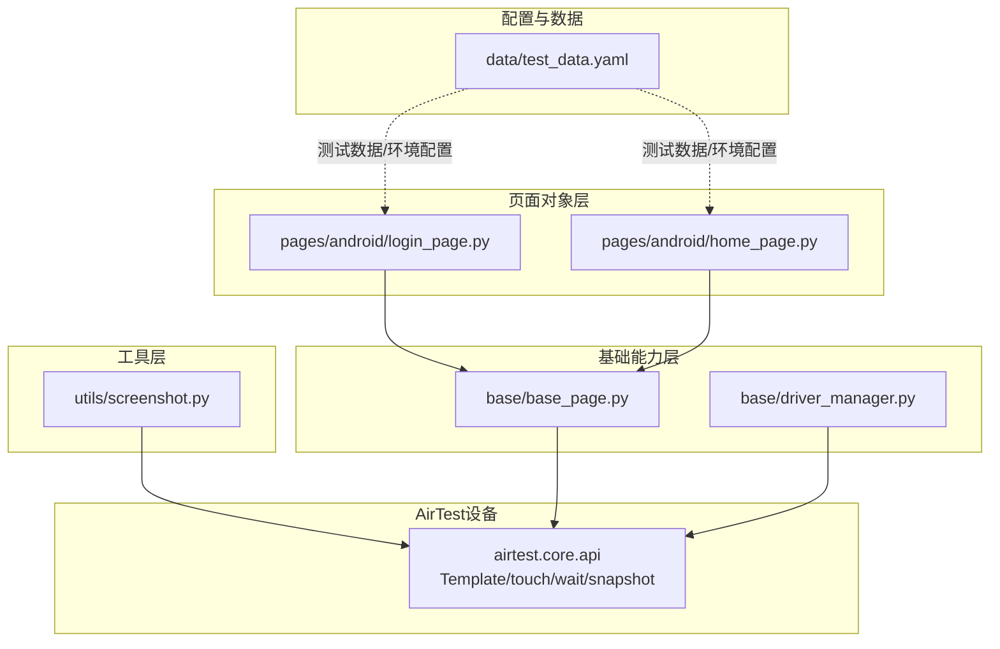
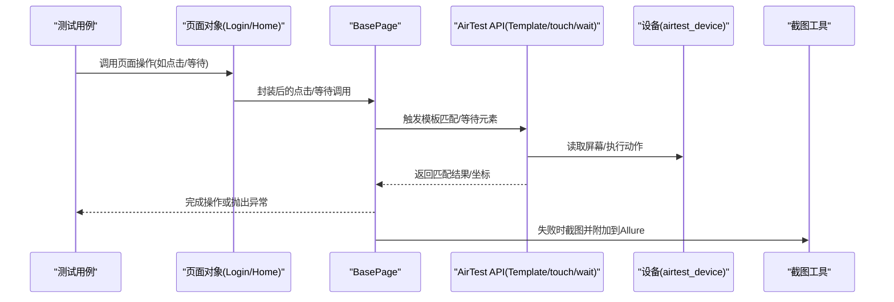
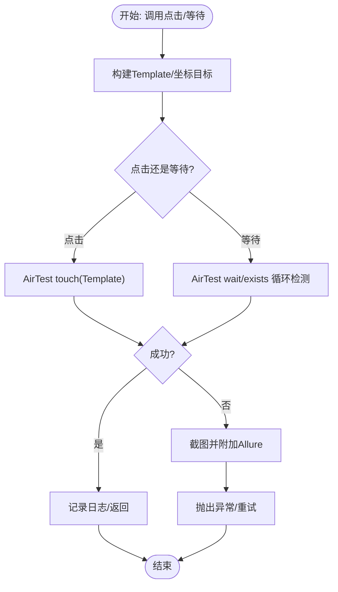
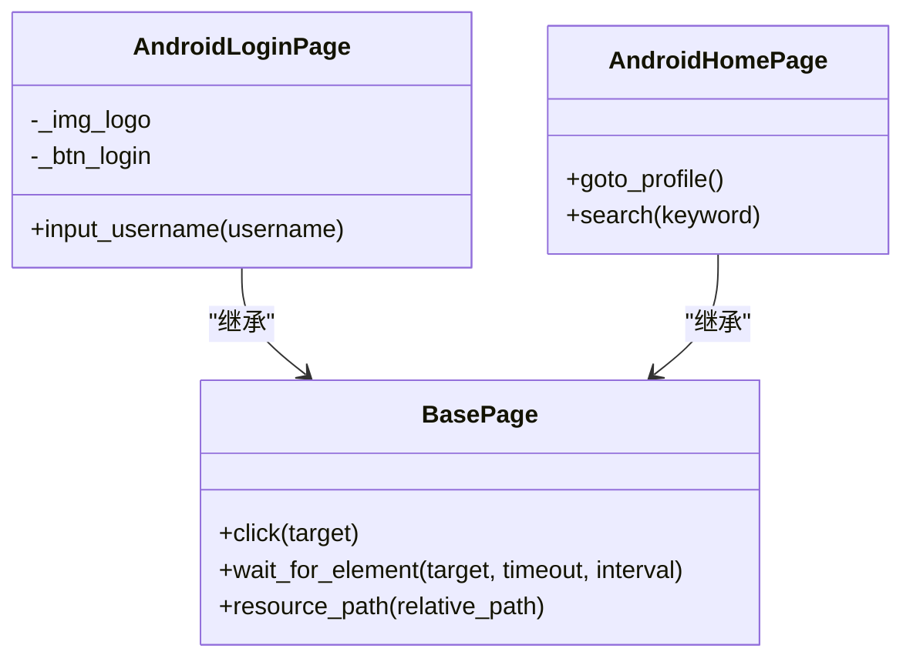
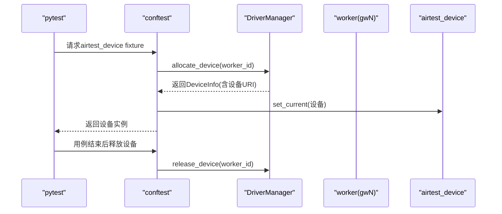
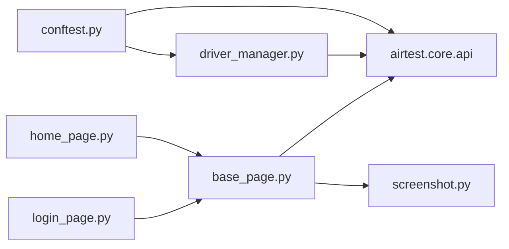

# 图像识别定位

<cite>
**本文引用的文件**
- [base/base_page.py](file://base/base_page.py)
- [pages/android/login_page.py](file://pages/android/login_page.py)
- [pages/android/home_page.py](file://pages/android/home_page.py)
- [utils/screenshot.py](file://utils/screenshot.py)
- [base/driver_manager.py](file://base/driver_manager.py)
- [conftest.py](file://conftest.py)
- [data/test_data.yaml](file://data/test_data.yaml)
</cite>

## 目录
1. [引言](#引言)
2. [项目结构](#项目结构)
3. [核心组件](#核心组件)
4. [架构总览](#架构总览)
5. [详细组件分析](#详细组件分析)
6. [依赖分析](#依赖分析)
7. [性能考虑](#性能考虑)
8. [故障排查指南](#故障排查指南)
9. [结论](#结论)
10. [附录](#附录)

## 引言
本文件围绕AirTestUI的图像识别定位能力展开，系统性阐述基于AirTest的模板匹配定位原理与工程化实践，覆盖模板匹配算法基础、相似度阈值设置、多分辨率适配、模板制作规范与命名规则、稳定性处理策略、性能优化手段（缓存、预处理、批量匹配）以及可复用的最佳实践。文档以仓库现有代码为依据，结合页面对象与测试夹具，给出可落地的实现路径与排障建议。

## 项目结构
AirTestUI采用分层组织：页面对象层（pages）、基础能力层（base）、工具层（utils）、配置与数据层（config/data）。图像识别定位主要由页面对象基类封装AirTest的Template与touch/wait等API，并在页面中以Template对象引用resources目录下的模板图片。

图表来源
- [base/base_page.py:1-319](file://base/base_page.py#L1-L319)
- [pages/android/login_page.py:1-41](file://pages/android/login_page.py#L1-L41)
- [pages/android/home_page.py:45-57](file://pages/android/home_page.py#L45-L57)
- [utils/screenshot.py:1-88](file://utils/screenshot.py#L1-L88)
- [base/driver_manager.py:1-187](file://base/driver_manager.py#L1-L187)
- [data/test_data.yaml:46-69](file://data/test_data.yaml#L46-L69)

章节来源
- [base/base_page.py:1-319](file://base/base_page.py#L1-L319)
- [pages/android/login_page.py:1-41](file://pages/android/login_page.py#L1-L41)
- [pages/android/home_page.py:45-57](file://pages/android/home_page.py#L45-L57)
- [utils/screenshot.py:1-88](file://utils/screenshot.py#L1-L88)
- [base/driver_manager.py:1-187](file://base/driver_manager.py#L1-L187)
- [data/test_data.yaml:46-69](file://data/test_data.yaml#L46-L69)

## 核心组件
- 页面对象基类（BasePage）
  - 提供统一的图像识别点击、等待元素、文本输入等封装，内置超时控制、截图与Allure步骤记录。
  - 支持通过Template对象进行图像识别定位；同时保留Poco定位作为备用方案。
- 页面对象（AndroidLoginPage、AndroidHomePage）
  - 在页面中定义Template对象，引用resources/android下的模板图片，实现登录、搜索等功能。
- 截图工具（Screenshot）
  - 统一截图保存、命名与Allure附件，便于定位失败时快速取证。
- 设备管理（DriverManager）
  - 多设备连接池管理，支持按worker分配设备，保障并行执行稳定性。
- 测试夹具（conftest）
  - 提供airtest_device等fixture，确保用例运行时的设备上下文正确。
- 测试数据（test_data.yaml）
  - 包含测试用例参数与环境配置，支撑不同场景的识别稳定性验证。

章节来源
- [base/base_page.py:30-319](file://base/base_page.py#L30-L319)
- [pages/android/login_page.py:14-41](file://pages/android/login_page.py#L14-L41)
- [pages/android/home_page.py:45-57](file://pages/android/home_page.py#L45-L57)
- [utils/screenshot.py:28-88](file://utils/screenshot.py#L28-L88)
- [base/driver_manager.py:51-187](file://base/driver_manager.py#L51-L187)
- [conftest.py:151-178](file://conftest.py#L151-L178)
- [data/test_data.yaml:46-69](file://data/test_data.yaml#L46-L69)

## 架构总览
下图展示了“页面对象调用AirTest模板匹配”到“设备截图与报告”的完整链路，体现图像识别定位在整体测试框架中的位置与职责边界。

图表来源
- [pages/android/login_page.py:32-41](file://pages/android/login_page.py#L32-L41)
- [pages/android/home_page.py:49-57](file://pages/android/home_page.py#L49-L57)
- [base/base_page.py:60-120](file://base/base_page.py#L60-L120)
- [utils/screenshot.py:55-88](file://utils/screenshot.py#L55-L88)
- [conftest.py:168-178](file://conftest.py#L168-L178)

## 详细组件分析

### 组件A：图像识别定位流程（点击/等待）
- 关键点
  - 点击：通过AirTest的touch对Template进行点击；失败时自动截图并抛出异常。
  - 等待：通过wait_for_element封装AirTest的wait与exists，支持超时与轮询间隔配置。
  - 资源路径：通过BasePage.resource_path拼接resources目录下的模板路径，保证跨平台一致性。
- 最佳实践
  - 明确超时与重试策略，避免因短暂卡顿导致误判。
  - 对易变UI（如动画、进度条）优先使用等待+断言组合，减少误触。
  - 失败时务必截图并附加到Allure，便于回溯。

图表来源
- [base/base_page.py:60-120](file://base/base_page.py#L60-L120)
- [base/base_page.py:76-120](file://base/base_page.py#L76-L120)
- [utils/screenshot.py:55-88](file://utils/screenshot.py#L55-L88)

章节来源
- [base/base_page.py:60-120](file://base/base_page.py#L60-L120)
- [base/base_page.py:76-120](file://base/base_page.py#L76-L120)
- [utils/screenshot.py:55-88](file://utils/screenshot.py#L55-L88)

### 组件B：页面对象中的模板使用
- 关键点
  - 页面对象中以Template(self.resource_path(...))的方式声明元素，模板位于resources/android目录。
  - 登录页与首页分别演示了图标、按钮等元素的识别点击。
- 最佳实践
  - 模板尽量选择稳定、对比度高、边缘清晰的区域。
  - 避免使用动态内容（如倒计时、实时消息数）作为模板主体。

图表来源
- [base/base_page.py:30-319](file://base/base_page.py#L30-L319)
- [pages/android/login_page.py:14-41](file://pages/android/login_page.py#L14-L41)
- [pages/android/home_page.py:45-57](file://pages/android/home_page.py#L45-L57)

章节来源
- [pages/android/login_page.py:14-41](file://pages/android/login_page.py#L14-L41)
- [pages/android/home_page.py:45-57](file://pages/android/home_page.py#L45-L57)
- [base/base_page.py:30-319](file://base/base_page.py#L30-L319)

### 组件C：设备与并行执行
- 关键点
  - DriverManager负责设备池初始化、按worker_id分配与释放设备，保障多设备并行执行。
  - conftest提供airtest_device fixture，确保用例运行时的设备上下文正确。
- 最佳实践
  - 并行执行时，确保每个worker绑定唯一设备，避免跨设备干扰。
  - 合理设置设备超时，避免长时间阻塞。

图表来源
- [base/driver_manager.py:100-172](file://base/driver_manager.py#L100-L172)
- [conftest.py:157-178](file://conftest.py#L157-L178)

章节来源
- [base/driver_manager.py:51-187](file://base/driver_manager.py#L51-L187)
- [conftest.py:151-178](file://conftest.py#L151-L178)

## 依赖分析
- 组件耦合
  - 页面对象依赖BasePage提供的统一API与资源路径工具。
  - BasePage依赖AirTest核心API（Template/touch/wait/snapshot）与截图工具。
  - 设备管理与测试夹具共同保障执行环境的稳定性。
- 外部依赖
  - AirTest：模板匹配、等待、截图、设备上下文切换。
  - Allure：失败时截图附件与失败详情记录。
- 潜在风险
  - 模板质量差导致误匹配或漏匹配。
  - 不同分辨率/密度导致模板缩放失真。
  - 并行执行时设备争用或上下文未正确切换。

图表来源
- [pages/android/login_page.py:14-41](file://pages/android/login_page.py#L14-L41)
- [pages/android/home_page.py:45-57](file://pages/android/home_page.py#L45-L57)
- [base/base_page.py:9-25](file://base/base_page.py#L9-L25)
- [utils/screenshot.py:8-12](file://utils/screenshot.py#L8-L12)
- [base/driver_manager.py:6-14](file://base/driver_manager.py#L6-L14)
- [conftest.py:168-178](file://conftest.py#L168-L178)

章节来源
- [pages/android/login_page.py:14-41](file://pages/android/login_page.py#L14-L41)
- [pages/android/home_page.py:45-57](file://pages/android/home_page.py#L45-L57)
- [base/base_page.py:9-25](file://base/base_page.py#L9-L25)
- [utils/screenshot.py:8-12](file://utils/screenshot.py#L8-L12)
- [base/driver_manager.py:6-14](file://base/driver_manager.py#L6-L14)
- [conftest.py:168-178](file://conftest.py#L168-L178)

## 性能考虑
- 缓存机制
  - 对常用模板进行预加载，减少重复构造开销；在页面对象中复用Template实例。
- 预处理技术
  - 模板图像尽量保持高对比度、边缘清晰；避免反光、阴影、半透明等干扰因素。
  - 在不同分辨率/密度下维护多套模板，或采用缩放策略时保持关键特征不变。
- 批量匹配
  - 将多个相似元素的匹配合并为一次扫描，减少设备交互次数。
  - 使用等待+断言组合替代频繁轮询，降低CPU占用。
- 超时与重试
  - 合理设置等待超时与轮询间隔，避免过短导致误判、过长影响效率。
  - 对不稳定元素增加重试与退避策略，必要时降级为Poco定位。

## 故障排查指南
- 常见问题
  - 模板匹配失败：检查模板质量、相似度阈值、分辨率适配与设备上下文。
  - 并发冲突：确认每个worker绑定唯一设备，避免共享上下文。
  - 截图取证：失败时自动截图并附加Allure，便于定位问题根因。
- 排障步骤
  - 复现问题并截图，核对模板是否与当前界面一致。
  - 调整等待超时与轮询间隔，观察是否由瞬时卡顿导致误判。
  - 在不同设备/分辨率下验证稳定性，补充多套模板或调整匹配策略。

章节来源
- [base/base_page.py:60-120](file://base/base_page.py#L60-L120)
- [utils/screenshot.py:55-88](file://utils/screenshot.py#L55-L88)
- [base/driver_manager.py:100-172](file://base/driver_manager.py#L100-L172)
- [conftest.py:157-178](file://conftest.py#L157-L178)

## 结论
AirTestUI通过BasePage对AirTest模板匹配能力进行了统一封装，结合页面对象与设备管理，形成了可扩展、可并行、可观测的图像识别定位体系。实践中应重视模板质量、多分辨率适配与稳定性策略，并借助截图与Allure实现高效排障。后续可在模板缓存、预处理与批量匹配方面进一步优化，以提升整体性能与鲁棒性。

## 附录

### 图像识别定位最佳实践清单
- 模板制作
  - 选择稳定、对比度高、边缘清晰的区域；避免动态内容与反光。
  - 保持模板尺寸与设备分辨率匹配，必要时提供多套模板。
- 命名与组织
  - 模板命名语义明确（如icon_search、btn_login），并按页面/功能归档至resources/android或ios对应目录。
- 质量要求
  - 模板灰度/二值化处理后仍具备显著特征；避免模糊、过度压缩。
- 多分辨率适配
  - 在不同密度/尺寸设备上验证匹配率；必要时引入缩放策略或多模板集。
- 性能优化
  - 复用Template实例、合并批量匹配、合理设置等待与重试。
- 可靠性保障
  - 失败自动截图并附加Allure；对不稳定元素提供Poco定位降级方案。

### 代码示例路径参考
- 页面对象中使用Template进行点击与等待
  - [pages/android/login_page.py:32-41](file://pages/android/login_page.py#L32-L41)
  - [pages/android/home_page.py:49-57](file://pages/android/home_page.py#L49-L57)
- BasePage封装的点击与等待
  - [base/base_page.py:60-120](file://base/base_page.py#L60-L120)
  - [base/base_page.py:76-120](file://base/base_page.py#L76-L120)
- 资源路径与截图
  - [base/base_page.py:308-319](file://base/base_page.py#L308-L319)
  - [utils/screenshot.py:28-88](file://utils/screenshot.py#L28-L88)
- 设备管理与并行
  - [base/driver_manager.py:100-172](file://base/driver_manager.py#L100-L172)
  - [conftest.py:157-178](file://conftest.py#L157-L178)