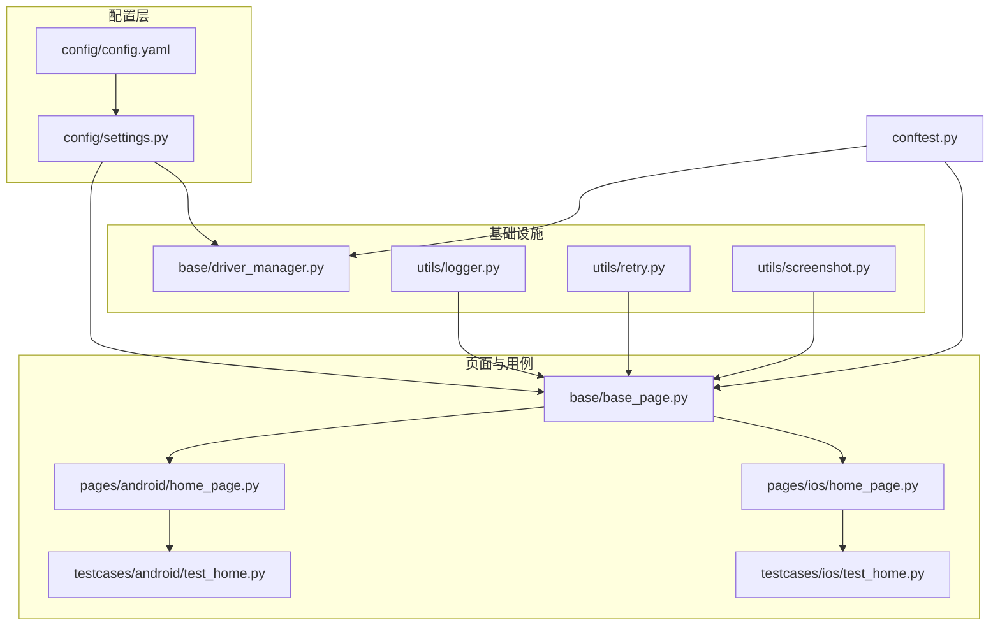
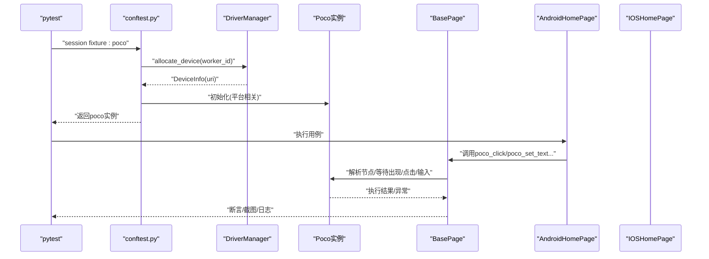
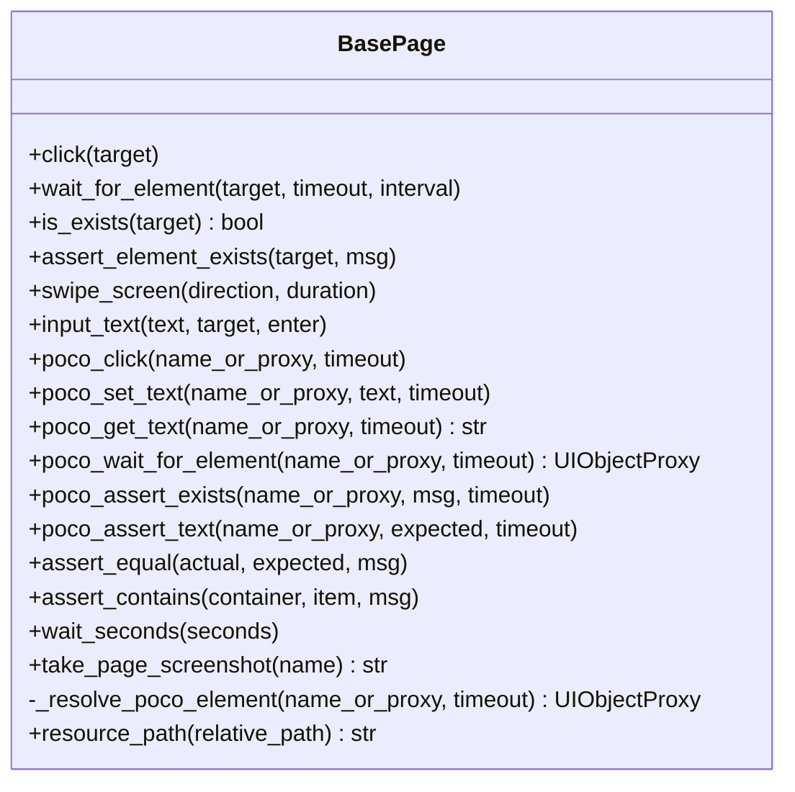
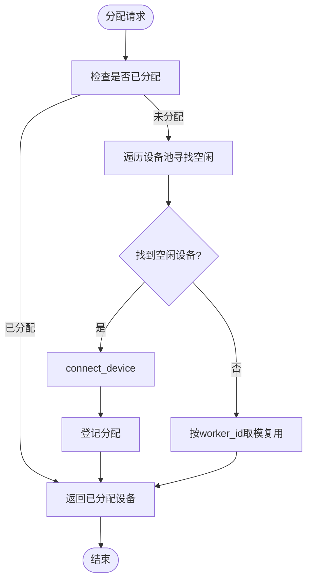
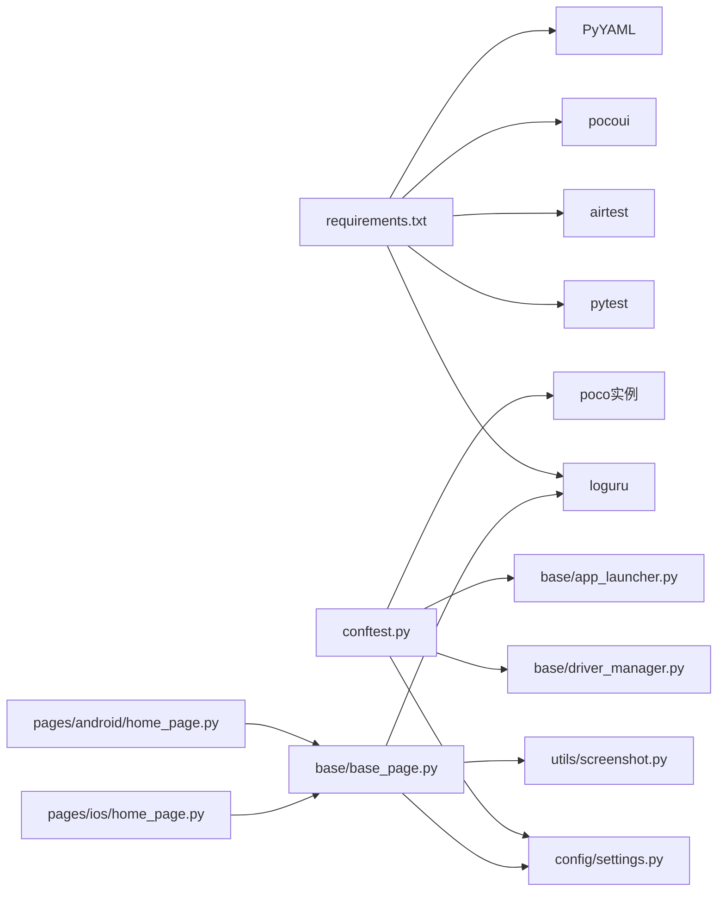
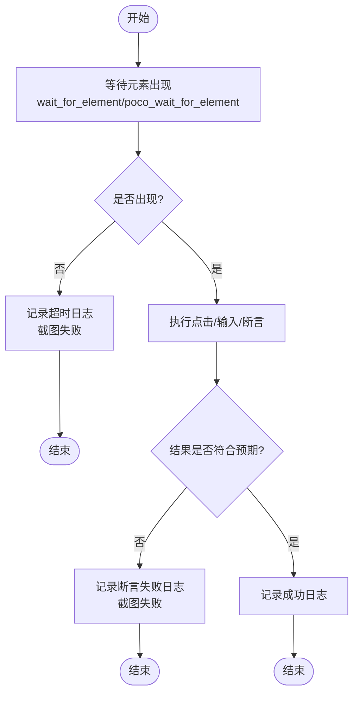
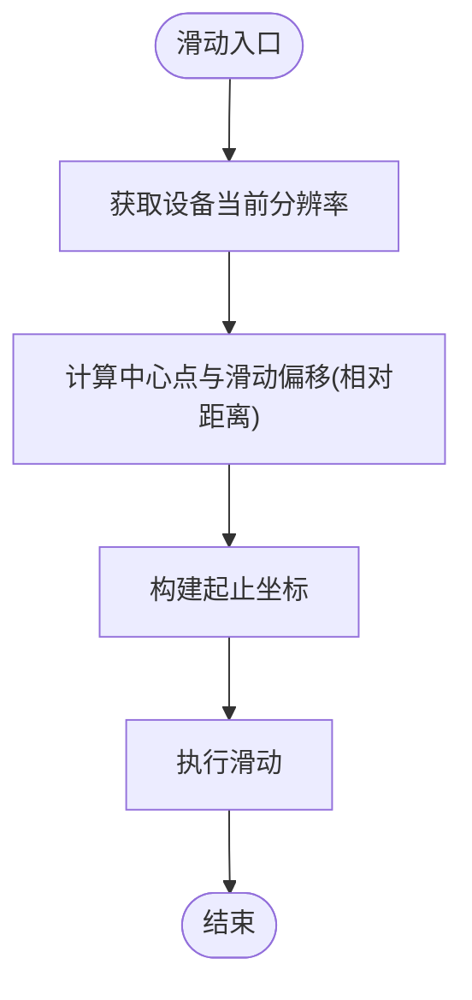

# 定位问题排查

<cite>
**本文引用的文件**
- [base/base_page.py](file://base/base_page.py)
- [base/driver_manager.py](file://base/driver_manager.py)
- [config/settings.py](file://config/settings.py)
- [config/config.yaml](file://config/config.yaml)
- [utils/logger.py](file://utils/logger.py)
- [utils/retry.py](file://utils/retry.py)
- [utils/screenshot.py](file://utils/screenshot.py)
- [pages/android/home_page.py](file://pages/android/home_page.py)
- [pages/ios/home_page.py](file://pages/ios/home_page.py)
- [testcases/android/test_home.py](file://testcases/android/test_home.py)
- [testcases/ios/test_home.py](file://testcases/ios/test_home.py)
- [conftest.py](file://conftest.py)
- [requirements.txt](file://requirements.txt)
</cite>

## 目录
1. [简介](#简介)
2. [项目结构](#项目结构)
3. [核心组件](#核心组件)
4. [架构总览](#架构总览)
5. [详细组件分析](#详细组件分析)
6. [依赖分析](#依赖分析)
7. [性能考虑](#性能考虑)
8. [故障排查指南](#故障排查指南)
9. [结论](#结论)
10. [附录](#附录)

## 简介
本文件面向AirTestUI的UI定位问题排查，系统整理定位失败的常见原因与解决方案，涵盖屏幕分辨率适配、元素稳定性处理、网络/设备延迟影响等；详解定位调试方法与工具（日志分析、截图对比、元素高亮/标注思路等）；给出定位性能优化建议（缓存策略、批量操作、异步处理等）；并分析Android/iOS平台差异与应对策略。最后提供真实用例与故障排除步骤，帮助开发者快速定位与解决问题。

## 项目结构
项目采用分层+页面对象的组织方式：
- base：基础能力（页面基类、设备驱动管理）
- pages：平台化页面对象（android/ios）
- testcases：平台化测试用例（android/ios）
- config：配置与环境（YAML配置、环境变量覆盖）
- utils：工具模块（日志、重试、截图、通知等）
- conftest.py：pytest集成（设备分配、Poco初始化、APP启停、Allure钩子）

图表来源
- [config/config.yaml:1-70](file://config/config.yaml#L1-L70)
- [config/settings.py:1-112](file://config/settings.py#L1-L112)
- [base/driver_manager.py:1-188](file://base/driver_manager.py#L1-L188)
- [utils/logger.py:1-59](file://utils/logger.py#L1-L59)
- [utils/retry.py:1-102](file://utils/retry.py#L1-L102)
- [utils/screenshot.py:1-89](file://utils/screenshot.py#L1-L89)
- [base/base_page.py:1-320](file://base/base_page.py#L1-L320)
- [pages/android/home_page.py:1-58](file://pages/android/home_page.py#L1-L58)
- [pages/ios/home_page.py:1-43](file://pages/ios/home_page.py#L1-L43)
- [testcases/android/test_home.py:1-48](file://testcases/android/test_home.py#L1-L48)
- [testcases/ios/test_home.py:1-38](file://testcases/ios/test_home.py#L1-L38)
- [conftest.py:1-255](file://conftest.py#L1-L255)

章节来源
- [config/config.yaml:1-70](file://config/config.yaml#L1-L70)
- [config/settings.py:1-112](file://config/settings.py#L1-L112)
- [base/driver_manager.py:1-188](file://base/driver_manager.py#L1-L188)
- [utils/logger.py:1-59](file://utils/logger.py#L1-L59)
- [utils/retry.py:1-102](file://utils/retry.py#L1-L102)
- [utils/screenshot.py:1-89](file://utils/screenshot.py#L1-L89)
- [base/base_page.py:1-320](file://base/base_page.py#L1-L320)
- [pages/android/home_page.py:1-58](file://pages/android/home_page.py#L1-L58)
- [pages/ios/home_page.py:1-43](file://pages/ios/home_page.py#L1-L43)
- [testcases/android/test_home.py:1-48](file://testcases/android/test_home.py#L1-L48)
- [testcases/ios/test_home.py:1-38](file://testcases/ios/test_home.py#L1-L38)
- [conftest.py:1-255](file://conftest.py#L1-L255)

## 核心组件
- 页面基类（BasePage）：封装Airtest/Poco常用操作，提供图像识别与UI树双模式定位；内置智能等待、断言、截图、Allure步骤记录。
- 设备驱动管理（DriverManager）：单例设备池，按worker_id分配/复用设备，支持Android/iOS连接与生命周期管理。
- 配置系统（settings + config.yaml）：统一超时、截图、重试、设备与APP配置；支持环境变量覆盖。
- 工具模块：日志（loguru）、重试（装饰器）、截图（本地+Allure附件）。
- 页面对象（android/ios）：基于BasePage封装平台化页面交互。
- pytest集成（conftest）：设备分配、Poco初始化、APP启停、Allure钩子、失败自动截图与通知。

章节来源
- [base/base_page.py:30-320](file://base/base_page.py#L30-L320)
- [base/driver_manager.py:51-188](file://base/driver_manager.py#L51-L188)
- [config/settings.py:51-112](file://config/settings.py#L51-L112)
- [config/config.yaml:1-70](file://config/config.yaml#L1-L70)
- [utils/logger.py:1-59](file://utils/logger.py#L1-L59)
- [utils/retry.py:1-102](file://utils/retry.py#L1-L102)
- [utils/screenshot.py:1-89](file://utils/screenshot.py#L1-L89)
- [pages/android/home_page.py:1-58](file://pages/android/home_page.py#L1-L58)
- [pages/ios/home_page.py:1-43](file://pages/ios/home_page.py#L1-L43)
- [conftest.py:140-255](file://conftest.py#L140-L255)

## 架构总览
AirTestUI通过pytest会话级fixture完成设备与Poco初始化，并在测试用例中以页面对象形式调用统一的定位与交互方法。定位失败时，系统自动截图并记录日志，便于后续分析。

图表来源
- [conftest.py:157-208](file://conftest.py#L157-L208)
- [base/driver_manager.py:119-150](file://base/driver_manager.py#L119-L150)
- [base/base_page.py:186-306](file://base/base_page.py#L186-L306)
- [pages/android/home_page.py:14-58](file://pages/android/home_page.py#L14-L58)
- [pages/ios/home_page.py:12-43](file://pages/ios/home_page.py#L12-L43)

## 详细组件分析

### 页面基类（BasePage）与定位模式
- 图像识别模式：基于Airtest模板匹配，适用于无UI树或UI树不稳定场景；提供等待、点击、输入、断言等封装。
- UI树定位模式：基于Poco节点名/代理对象，适用于稳定UI结构；提供等待出现、点击、设置文本、断言等封装。
- 智能降级：当Poco不可用时，页面对象可回退到图像识别模式，保证可用性。
- 资源路径：统一通过resource_path拼接resources目录，避免硬编码。

图表来源
- [base/base_page.py:30-320](file://base/base_page.py#L30-L320)

章节来源
- [base/base_page.py:30-320](file://base/base_page.py#L30-L320)

### 设备驱动管理（DriverManager）
- 单例模式，线程安全地维护设备池与分配状态。
- 支持Android/iOS设备URI生成与连接。
- 按worker_id分配设备，若设备不足则循环复用。
- 提供清理接口，避免残留连接。

图表来源
- [base/driver_manager.py:119-150](file://base/driver_manager.py#L119-L150)

章节来源
- [base/driver_manager.py:51-188](file://base/driver_manager.py#L51-L188)

### 配置系统（settings + config.yaml）
- 超时配置：元素等待、页面加载、应用启动。
- 截图配置：失败自动截图、步骤截图开关、保存目录。
- 重试配置：最大重试次数与间隔。
- 设备与APP配置：Android/iOS设备列表与应用包名/Bundle ID、启动Activity等。
- 环境变量覆盖：通过前缀覆盖顶层键值，便于CI/CD环境切换。

章节来源
- [config/config.yaml:1-70](file://config/config.yaml#L1-L70)
- [config/settings.py:51-112](file://config/settings.py#L51-L112)

### 日志与截图工具
- 日志：基于loguru，控制台彩色输出+文件轮转，DEBUG/ERROR分离。
- 截图：统一保存目录与命名规则；支持Allure附件；失败自动截图钩子。
- 重试：通用重试装饰器与“直到True”重试装饰器，支持异常类型筛选与回调。

章节来源
- [utils/logger.py:1-59](file://utils/logger.py#L1-L59)
- [utils/screenshot.py:1-89](file://utils/screenshot.py#L1-L89)
- [utils/retry.py:1-102](file://utils/retry.py#L1-L102)
- [conftest.py:62-138](file://conftest.py#L62-L138)

### 页面对象（Android/iOS）
- AndroidHomePage：演示Poco与图像识别双模式的页面交互；提供导航、搜索等典型操作。
- IOSHomePage：iOS页面对象示例，展示相同模式的差异处理。

章节来源
- [pages/android/home_page.py:1-58](file://pages/android/home_page.py#L1-L58)
- [pages/ios/home_page.py:1-43](file://pages/ios/home_page.py#L1-L43)

### 测试用例（Android/iOS）
- AndroidHome：首页加载、标题校验、导航到个人中心等用例。
- IOSHome：iOS首页加载、导航到个人中心等用例。

章节来源
- [testcases/android/test_home.py:1-48](file://testcases/android/test_home.py#L1-L48)
- [testcases/ios/test_home.py:1-38](file://testcases/ios/test_home.py#L1-L38)

## 依赖分析
- 运行时依赖：pytest、pytest-xdist、allure-pytest、airtest、pocoui、loguru、PyYAML等。
- 关键耦合点：
  - BasePage依赖settings（超时）、logger、screenshot。
  - conftest依赖driver_manager、settings、AppLauncher、poco初始化。
  - 页面对象依赖BasePage与资源路径。

图表来源
- [requirements.txt:1-21](file://requirements.txt#L1-L21)
- [conftest.py:14-20](file://conftest.py#L14-L20)
- [base/base_page.py:23-25](file://base/base_page.py#L23-L25)
- [utils/screenshot.py:11-12](file://utils/screenshot.py#L11-L12)

章节来源
- [requirements.txt:1-21](file://requirements.txt#L1-L21)
- [conftest.py:14-20](file://conftest.py#L14-L20)
- [base/base_page.py:23-25](file://base/base_page.py#L23-L25)
- [utils/screenshot.py:11-12](file://utils/screenshot.py#L11-L12)

## 性能考虑
- 超时与重试
  - 合理设置元素等待与页面加载超时，避免过短导致误判、过长导致耗时。
  - 使用重试装饰器对外部不稳定因素（如网络抖动、渲染延迟）进行补偿。
- 截图与日志
  - 关闭每步截图以降低IO开销；仅在失败时自动截图。
  - 日志级别按需调整，避免过多DEBUG日志影响性能。
- 设备与并发
  - 合理规划worker数量与设备数，避免设备争用导致的延迟放大。
  - 在设备不足时启用复用策略，但注意状态隔离与清理。
- 定位策略
  - 优先使用UI树定位（Poco）以减少图像识别成本；在UI树不可用时再回退图像识别。
  - 对高频元素建立缓存（如节点代理对象）以减少重复解析。

章节来源
- [config/config.yaml:8-23](file://config/config.yaml#L8-L23)
- [utils/retry.py:13-64](file://utils/retry.py#L13-L64)
- [utils/logger.py:16-47](file://utils/logger.py#L16-L47)
- [base/driver_manager.py:141-150](file://base/driver_manager.py#L141-L150)
- [base/base_page.py:186-306](file://base/base_page.py#L186-L306)

## 故障排查指南

### 一、常见定位失败原因与对策
- 元素未出现/超时
  - 现象：等待元素超时、断言失败。
  - 排查：确认超时配置是否合理；查看失败截图；检查是否存在遮挡/动画。
  - 对策：适当增加等待超时；使用重试装饰器；先触发页面加载动作再等待。
- 图像识别误匹配/漂移
  - 现象：点击位置偏移、误触其他相似元素。
  - 排查：对比截图与模板；检查分辨率/缩放差异。
  - 对策：使用更高分辨率模板；在高危区域加前置点击/等待；必要时切换UI树定位。
- UI树节点不稳定
  - 现象：节点名变化、层级变动。
  - 排查：对比不同设备/系统版本的UI树；确认节点唯一性。
  - 对策：使用更稳定的属性组合；在页面对象中加入降级逻辑（图像识别兜底）。
- 屏幕分辨率/缩放适配
  - 现象：滑动/点击坐标不一致。
  - 排查：确认设备分辨率与滑动计算；检查设备缩放比例。
  - 对策：使用相对坐标/距离的滑动策略；在滑动前获取实时分辨率。
- 网络/设备延迟
  - 现象：偶发超时、偶发失败。
  - 排查：结合日志时间戳与失败截图；观察设备负载。
  - 对策：增加重试；提升等待超时；错峰执行；减少并发。

章节来源
- [base/base_page.py:76-97](file://base/base_page.py#L76-L97)
- [base/base_page.py:128-160](file://base/base_page.py#L128-L160)
- [config/config.yaml:8-12](file://config/config.yaml#L8-L12)
- [utils/retry.py:13-64](file://utils/retry.py#L13-L64)

### 二、定位调试方法与工具
- 日志分析
  - 使用loguru输出结构化日志，定位具体步骤与异常上下文。
  - 关注“点击失败/等待超时/断言失败”等错误日志。
- 截图对比
  - 失败自动截图并附加到Allure；手动截图辅助比对。
  - 对比模板与实际界面差异，定位识别失败原因。
- 元素高亮/标注（建议）
  - Poco侧：可通过扩展在点击/等待前后进行临时高亮/标注（需自定义实现）。
  - 图像识别侧：在截图中人工标注目标区域，形成对比基准。

章节来源
- [utils/logger.py:16-47](file://utils/logger.py#L16-L47)
- [utils/screenshot.py:76-89](file://utils/screenshot.py#L76-L89)
- [conftest.py:119-138](file://conftest.py#L119-L138)

### 三、平台与设备差异
- Android/iOS差异
  - Poco初始化参数不同；iOS可能更依赖节点稳定性。
  - 滑动/输入行为存在差异，需分别验证。
- 设备差异
  - 不同分辨率/缩放导致坐标/识别差异；建议按机型分治或使用相对策略。
- 并发与复用
  - 多worker共享设备时，注意清理状态与隔离数据。

章节来源
- [conftest.py:186-208](file://conftest.py#L186-L208)
- [base/driver_manager.py:141-150](file://base/driver_manager.py#L141-L150)
- [pages/android/home_page.py:17-47](file://pages/android/home_page.py#L17-L47)
- [pages/ios/home_page.py:15-42](file://pages/ios/home_page.py#L15-L42)

### 四、实际案例与排障步骤
- 案例：Android首页“个人中心”入口点击失败
  - 步骤1：确认页面是否已加载（is_home_page_displayed）。
  - 步骤2：查看等待超时日志与失败截图。
  - 步骤3：若使用Poco，检查节点是否存在；若使用图像识别，检查模板清晰度与分辨率。
  - 步骤4：适当增加等待超时或启用重试。
  - 步骤5：在失败用例上附加截图与日志，便于回归分析。
- 案例：iOS首页标题断言失败
  - 步骤1：确认Poco初始化是否成功（失败时会回退图像识别）。
  - 步骤2：检查节点名是否随版本变化。
  - 步骤3：在页面对象中加入降级逻辑（图像识别兜底）。

章节来源
- [pages/android/home_page.py:21-58](file://pages/android/home_page.py#L21-L58)
- [pages/ios/home_page.py:18-43](file://pages/ios/home_page.py#L18-L43)
- [testcases/android/test_home.py:24-48](file://testcases/android/test_home.py#L24-L48)
- [testcases/ios/test_home.py:24-38](file://testcases/ios/test_home.py#L24-L38)
- [conftest.py:205-207](file://conftest.py#L205-L207)

## 结论
AirTestUI通过统一的页面基类与工具链，提供了图像识别与UI树双模式定位能力，并辅以日志、截图、重试与设备管理等机制，能够有效支撑跨平台的UI自动化测试。针对定位失败问题，建议从超时与重试、模板质量、UI树稳定性、分辨率适配与设备延迟等方面系统排查，并结合日志与截图进行快速定位与修复。

## 附录

### A. 关键流程图：点击/等待/断言

图表来源
- [base/base_page.py:76-127](file://base/base_page.py#L76-L127)
- [base/base_page.py:186-252](file://base/base_page.py#L186-L252)
- [utils/screenshot.py:76-89](file://utils/screenshot.py#L76-L89)

### B. 关键流程图：滑动适配（按分辨率）

图表来源
- [base/base_page.py:128-160](file://base/base_page.py#L128-L160)