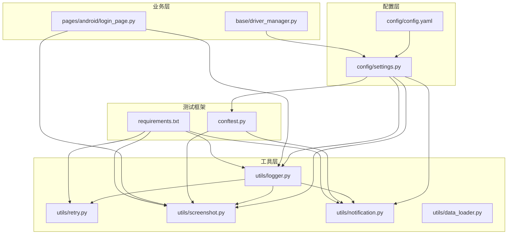
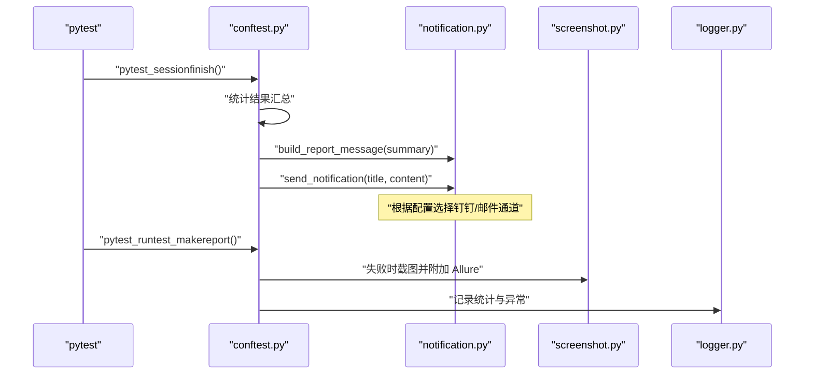
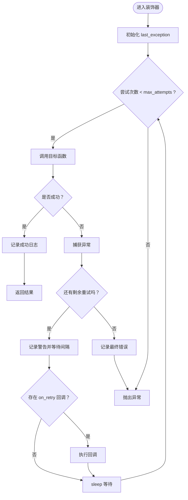
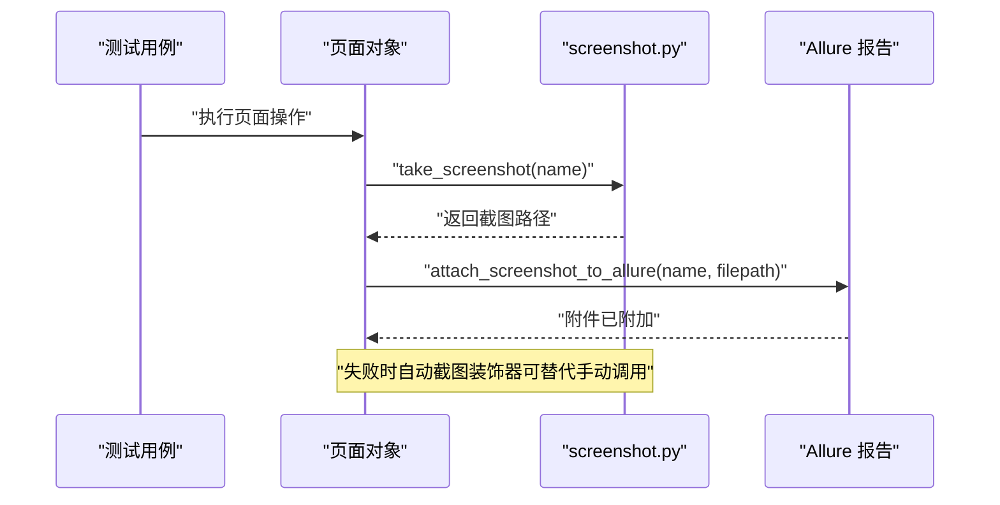
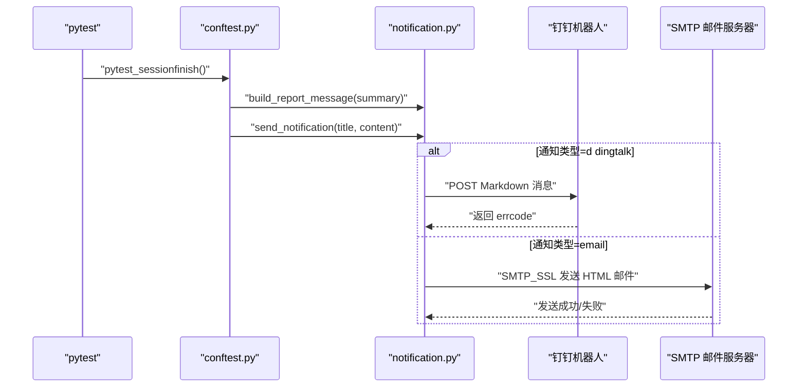
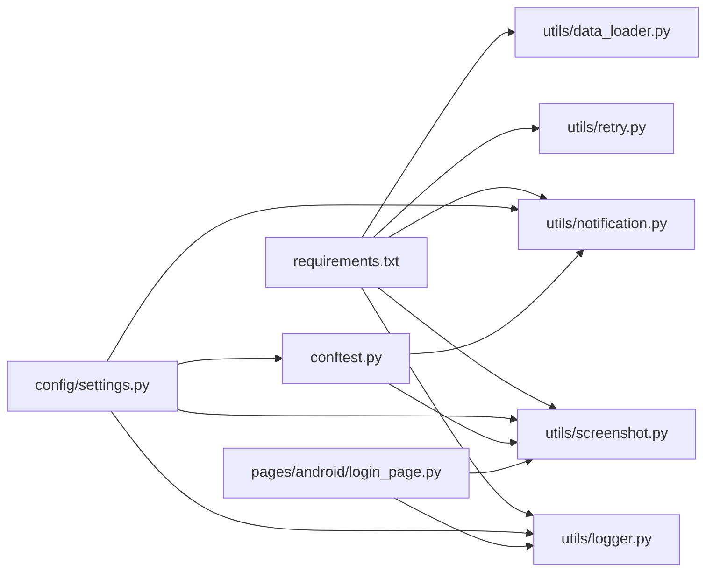

# 工具模块

<cite>
**本文引用的文件**
- [logger.py](file://utils/logger.py)
- [retry.py](file://utils/retry.py)
- [screenshot.py](file://utils/screenshot.py)
- [notification.py](file://utils/notification.py)
- [data_loader.py](file://utils/data_loader.py)
- [settings.py](file://config/settings.py)
- [config.yaml](file://config/config.yaml)
- [conftest.py](file://conftest.py)
- [requirements.txt](file://requirements.txt)
- [login_page.py](file://pages/android/login_page.py)
- [driver_manager.py](file://base/driver_manager.py)
</cite>

## 目录
1. [简介](#简介)
2. [项目结构](#项目结构)
3. [核心组件](#核心组件)
4. [架构总览](#架构总览)
5. [详细组件分析](#详细组件分析)
6. [依赖关系分析](#依赖关系分析)
7. [性能考量](#性能考量)
8. [故障排查指南](#故障排查指南)
9. [结论](#结论)
10. [附录](#附录)

## 简介
本文件面向 AirTestUI 工具模块，系统性梳理并说明以下能力：
- 结构化日志系统：日志级别、格式化输出、日志轮转与归档
- 智能重试机制：重试装饰器策略、异常类型过滤、重试间隔控制
- 截图功能：截图时机、命名规则、存储位置、Allure 附件集成
- 通知系统：通知渠道配置、消息格式与发送流程
- 数据加载：YAML/Excel/JSON 的数据驱动加载与参数化
- 最佳实践与使用示例：结合测试用例与配置文件给出落地建议

## 项目结构
工具模块位于 utils 目录，配合 config 配置、pytest 钩子与页面对象共同工作，形成“配置驱动 + 结构化日志 + 智能重试 + 截图 + 通知”的测试支撑体系。

图表来源
- [config.yaml:1-70](file://config/config.yaml#L1-L70)
- [settings.py:1-112](file://config/settings.py#L1-L112)
- [logger.py:1-59](file://utils/logger.py#L1-L59)
- [retry.py:1-102](file://utils/retry.py#L1-L102)
- [screenshot.py:1-89](file://utils/screenshot.py#L1-L89)
- [notification.py:1-167](file://utils/notification.py#L1-L167)
- [data_loader.py:1-128](file://utils/data_loader.py#L1-L128)
- [conftest.py:1-255](file://conftest.py#L1-L255)
- [requirements.txt:1-21](file://requirements.txt#L1-L21)
- [login_page.py:1-107](file://pages/android/login_page.py#L1-L107)
- [driver_manager.py:1-188](file://base/driver_manager.py#L1-L188)

章节来源
- [config.yaml:1-70](file://config/config.yaml#L1-L70)
- [settings.py:1-112](file://config/settings.py#L1-L112)
- [conftest.py:1-255](file://conftest.py#L1-L255)

## 核心组件
- 结构化日志模块：基于 loguru，提供控制台彩色输出与文件轮转，支持 DEBUG/ERROR 分离落盘与 UTF-8 编码压缩归档
- 重试装饰器：提供通用重试与“条件为真”两类装饰器，支持异常类型过滤、重试间隔、回调钩子
- 截图模块：统一截图保存、命名与 Allure 附件；支持失败自动截图装饰器
- 通知模块：支持钉钉机器人与邮件两种通道，自动构建测试报告消息体
- 数据加载模块：支持 YAML/JSON/Excel，提供参数化数据加载
- 配置系统：YAML 主配置 + 本地覆盖 + 环境变量覆盖，统一暴露 settings 对象

章节来源
- [logger.py:1-59](file://utils/logger.py#L1-L59)
- [retry.py:1-102](file://utils/retry.py#L1-L102)
- [screenshot.py:1-89](file://utils/screenshot.py#L1-L89)
- [notification.py:1-167](file://utils/notification.py#L1-L167)
- [data_loader.py:1-128](file://utils/data_loader.py#L1-L128)
- [settings.py:1-112](file://config/settings.py#L1-L112)

## 架构总览
工具模块围绕“配置驱动 + 日志 + 重试 + 截图 + 通知 + 数据加载”六大支柱协同工作，pytest 钩子在会话前后统一采集统计、失败截图与通知发送，页面对象通过工具模块实现稳健的自动化流程。

图表来源
- [conftest.py:89-138](file://conftest.py#L89-L138)
- [notification.py:22-48](file://utils/notification.py#L22-L48)
- [screenshot.py:119-138](file://utils/screenshot.py#L119-L138)
- [logger.py:50-59](file://utils/logger.py#L50-L59)

## 详细组件分析

### 结构化日志系统（logger）
- 日志目录与轮转
  - 日志根目录由配置 ROOT_DIR 下的 logs 子目录承载，自动创建
  - 全量日志文件按日期轮转，单文件上限 20MB，保留 7 天，并以 zip 压缩归档
  - 错误日志文件仅记录 ERROR 及以上级别，保留 30 天
- 输出格式
  - 控制台输出包含时间、级别、模块名、函数名、行号与消息，彩色高亮
  - 文件输出包含毫秒级时间戳、级别、模块名、函数名、行号与消息
- 日志获取
  - 提供 get_logger(name) 获取带模块标识的 logger，便于区分不同模块日志

最佳实践
- 在各模块中通过 get_logger("模块名") 获取专用 logger，避免混杂
- 重要事件使用 info/warning/error 级别，便于后续检索与告警
- 避免在生产环境开启过细的 DEBUG 日志，以免影响性能

章节来源
- [logger.py:12-59](file://utils/logger.py#L12-L59)
- [settings.py:10-11](file://config/settings.py#L10-L11)

### 智能重试机制（retry）
- 通用重试装饰器
  - 参数：最大重试次数（含首次）、重试间隔（秒）、触发异常类型元组、重试前回调
  - 行为：捕获指定异常类型，在达到最大次数前进行等待与重试；最后一次抛出异常
  - 回调：on_retry(attempt, exception) 可用于统计或打点
- 条件重试装饰器
  - 参数：被装饰函数应返回布尔值，最大检查次数与检查间隔
  - 行为：持续检查直到函数返回 True 或达到最大次数，返回布尔结果

最佳实践
- 对易受网络/设备抖动影响的操作（如元素等待、点击）使用 retry
- 明确异常类型过滤，避免对非瞬时异常盲目重试
- 合理设置重试间隔，避免频繁轮询造成资源浪费

图表来源
- [retry.py:37-64](file://utils/retry.py#L37-L64)

章节来源
- [retry.py:13-102](file://utils/retry.py#L13-L102)

### 截图功能（screenshot）
- 截图目录
  - 优先读取配置 settings.screenshot.save_dir，否则回退到项目根下 screenshots
  - 目录不存在时自动创建
- 截图时机与命名
  - 命名规则：若传入 name 则为 name_YYYYMMDD_HHMMSS.png；否则为 screenshot_YYYYMMDD_HHMMSS.png
  - 失败自动截图装饰器：在页面对象方法失败时自动截图并保留函数名标识
- Allure 附件
  - 支持将截图直接附加到 Allure 报告，便于问题复现
- Airtest 集成
  - 通过 airtest.core.api.snapshot 或设备 snapshot 保存图片

最佳实践
- 在关键步骤与失败节点均进行截图，确保可追溯
- 失败自动截图装饰器适合页面对象方法级保护
- 截图命名尽量包含上下文信息（如用例名、步骤名）

图表来源
- [screenshot.py:28-89](file://utils/screenshot.py#L28-L89)
- [conftest.py:119-138](file://conftest.py#L119-L138)

章节来源
- [screenshot.py:17-89](file://utils/screenshot.py#L17-L89)
- [conftest.py:119-138](file://conftest.py#L119-L138)

### 通知系统（notification）
- 通知开关与类型
  - 通过 settings.notification.enabled 控制是否启用
  - 通过 settings.notification.type 选择 dingtalk 或 email
- 钉钉通知
  - 读取 webhook 与 secret，支持时间戳+签名拼接到 URL
  - 请求超时 10 秒，发送 Markdown 类型消息
- 邮件通知
  - 读取 SMTP 主机、端口、发件人、授权码、收件人列表
  - 使用 HTML 内容发送，UTF-8 编码
- 报告消息构建
  - 自动生成标题与 Markdown 表格，包含环境、耗时、用例总数、通过/失败/跳过数与通过率

最佳实践
- 在 CI/CD 中启用通知，确保失败及时触达
- 钉钉通知建议配置 secret 并开启签名，提升安全性
- 邮件通知需确保凭据正确与网络可达

图表来源
- [notification.py:22-167](file://utils/notification.py#L22-L167)
- [conftest.py:89-117](file://conftest.py#L89-L117)

章节来源
- [notification.py:22-167](file://utils/notification.py#L22-L167)
- [conftest.py:89-117](file://conftest.py#L89-L117)

### 数据加载（data_loader）
- 支持格式
  - YAML：load_yaml(filepath)，支持相对 data/ 目录与绝对路径
  - JSON：load_json(filepath)
  - Excel：load_excel(filepath, sheet_name)，首行作为键名生成字典列表
- 参数化数据
  - parametrize_data(filepath, key)：将 YAML/JSON/XLSX 转换为 pytest.mark.parametrize 可用的参数列表
  - YAML/JSON 可通过 key 提取顶层键值，XLSX 直接返回行数据列表

最佳实践
- 将测试数据集中放在 data/ 目录，便于维护
- 使用 parametrize_data 直接驱动用例，减少重复代码
- Excel 数据注意首行一致性与空行处理

章节来源
- [data_loader.py:18-128](file://utils/data_loader.py#L18-L128)

## 依赖关系分析
- 配置依赖
  - settings.py 读取 config.yaml 并支持本地覆盖与环境变量覆盖，统一暴露 settings 对象
  - 各工具模块通过 settings 获取截图目录、通知配置、超时等参数
- 运行时依赖
  - pytest 钩子在会话结束时汇总统计并发送通知；在测试失败时自动截图并附加 Allure
  - 页面对象通过工具模块实现稳健的交互与可观测性
- 外部库依赖
  - loguru、requests、openpyxl、airtest/poco 等

图表来源
- [requirements.txt:1-21](file://requirements.txt#L1-L21)
- [settings.py:1-112](file://config/settings.py#L1-L112)
- [conftest.py:1-255](file://conftest.py#L1-L255)
- [login_page.py:1-107](file://pages/android/login_page.py#L1-L107)

章节来源
- [requirements.txt:1-21](file://requirements.txt#L1-L21)
- [settings.py:1-112](file://config/settings.py#L1-L112)
- [conftest.py:1-255](file://conftest.py#L1-L255)

## 性能考量
- 日志轮转与压缩：全量日志 20MB 轮转、错误日志 30 天保留，降低磁盘占用与 IO 压力
- 截图频率控制：通过配置项 on_step/on_failure 控制截图频次，避免过度 I/O
- 重试间隔：合理设置 wait_between，避免频繁轮询导致设备/网络压力
- 通知发送：钉钉请求超时 10 秒，邮件使用 SSL 简化握手，保证稳定性

## 故障排查指南
- 日志未输出或格式异常
  - 检查 ROOT_DIR 是否正确，logs 目录权限是否允许写入
  - 确认日志级别设置（控制台默认 INFO，文件 DEBUG），必要时临时提高级别
- 截图失败
  - 检查截图目录是否存在且可写；确认 airtest 设备连接状态
  - 若使用设备 snapshot，请确保设备对象有效
- 通知发送失败
  - 钉钉：核对 webhook 与 secret，检查网络连通性与签名参数
  - 邮件：核对 SMTP 主机、端口、发件人、授权码与收件人列表
- 重试无效
  - 检查 retry_on 异常类型是否匹配；确认 max_attempts 与 wait_between 合理
- 数据加载异常
  - 检查 data/ 目录路径与文件编码；Excel 首行是否为空或重复

章节来源
- [logger.py:12-59](file://utils/logger.py#L12-L59)
- [screenshot.py:28-53](file://utils/screenshot.py#L28-L53)
- [notification.py:50-126](file://utils/notification.py#L50-L126)
- [retry.py:13-64](file://utils/retry.py#L13-L64)
- [data_loader.py:18-82](file://utils/data_loader.py#L18-L82)

## 结论
AirTestUI 工具模块以配置为中心，结合结构化日志、智能重试、截图与通知，形成完整的自动化测试可观测性与可靠性保障体系。通过 pytest 钩子与页面对象的协作，工具模块实现了“开箱即用”的测试支撑能力。建议在团队内统一规范配置项与命名约定，持续优化重试策略与截图策略，以获得更稳定高效的测试体验。

## 附录

### 配置项速览（节选）
- 环境与超时
  - env: 运行环境（dev/staging/production）
  - timeout.element_wait/page_load/app_launch: 各类等待超时（秒）
- 截图
  - screenshot.on_failure/on_step/save_dir: 失败自动截图、每步截图、保存目录
- 重试
  - retry.max_attempts/wait_between: 最大重试次数与间隔（秒）
- 报告
  - report.allure_dir/html_file: Allure 结果目录与 HTML 报告文件
- 通知
  - notification.enabled/type: 开关与通道（dingtalk/email）
  - dingtalk.webhook/secret: 钉钉机器人配置
  - email.smtp_host/smtp_port/sender/password/receivers: 邮件配置
- 设备与 APP
  - android/ios.devices: 设备列表（序列号/UUID、别名）
  - android/ios.app: 包名/Bundle ID、启动 Activity/Bundle、安装路径

章节来源
- [config.yaml:5-70](file://config/config.yaml#L5-L70)
- [settings.py:84-112](file://config/settings.py#L84-L112)

### 使用示例与最佳实践（路径指引）
- 日志使用
  - 在模块中通过 get_logger("模块名") 获取专用 logger，记录关键事件
  - 参考路径：[logger.py:50-59](file://utils/logger.py#L50-L59)
- 重试装饰器
  - 对易抖动操作使用 retry(max_attempts, wait_between, retry_on, on_retry)
  - 对条件等待使用 retry_until_true(max_attempts, interval)
  - 参考路径：[retry.py:13-102](file://utils/retry.py#L13-L102)
- 截图与 Allure
  - 失败自动截图装饰器：在页面对象方法上使用
  - 手动截图：take_screenshot(name) 后 attach_screenshot_to_allure(name, filepath)
  - 参考路径：[screenshot.py:28-89](file://utils/screenshot.py#L28-L89)，[conftest.py:119-138](file://conftest.py#L119-L138)
- 通知
  - 在会话结束时自动发送通知，或手动调用 send_notification(title, content)
  - 参考路径：[notification.py:22-48](file://utils/notification.py#L22-L48)，[conftest.py:89-117](file://conftest.py#L89-L117)
- 数据加载
  - YAML/JSON/Excel 加载与参数化：parametrize_data(filepath, key)
  - 参考路径：[data_loader.py:85-128](file://utils/data_loader.py#L85-L128)