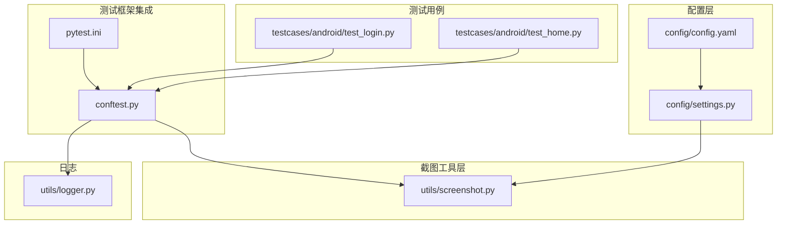
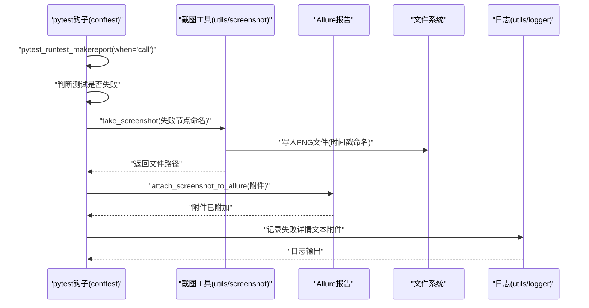
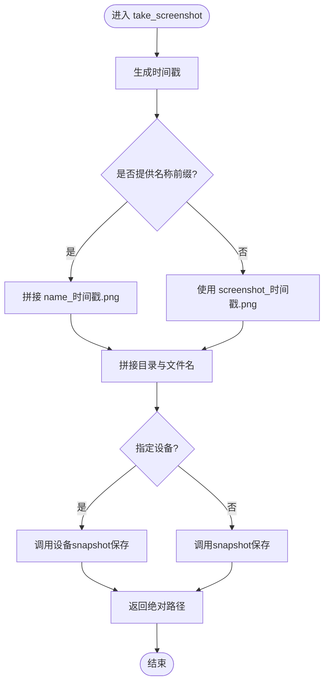
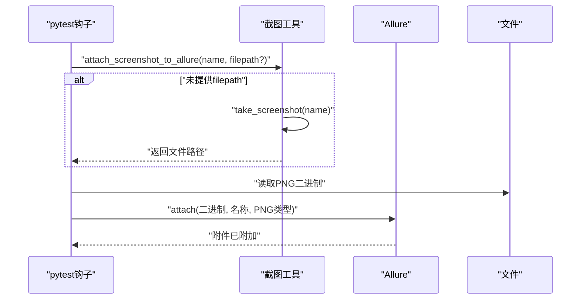
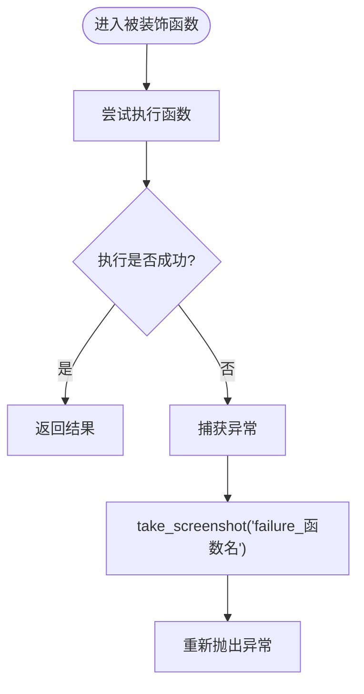
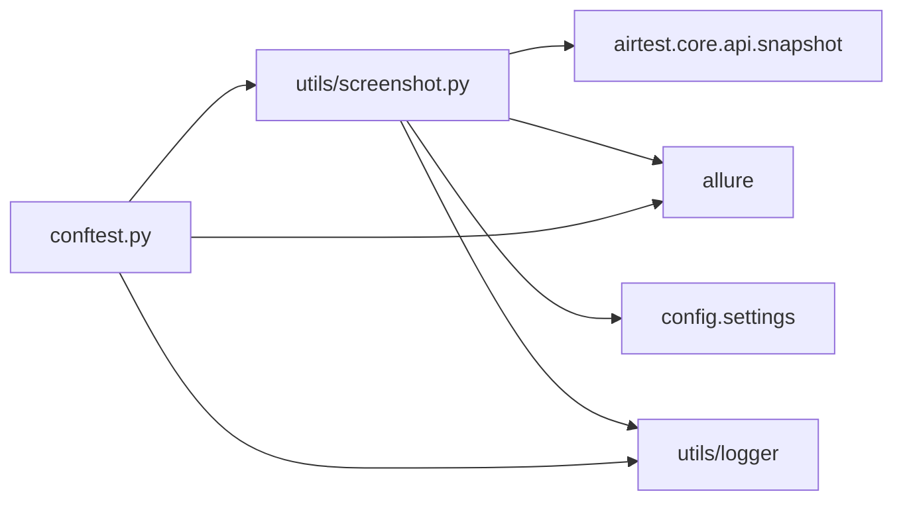

# 截图功能

<cite>
**本文引用的文件**
- [utils/screenshot.py](file://utils/screenshot.py)
- [conftest.py](file://conftest.py)
- [config/settings.py](file://config/settings.py)
- [config/config.yaml](file://config/config.yaml)
- [pytest.ini](file://pytest.ini)
- [utils/logger.py](file://utils/logger.py)
- [testcases/android/test_home.py](file://testcases/android/test_home.py)
- [testcases/android/test_login.py](file://testcases/android/test_login.py)
</cite>

## 目录
1. [简介](#简介)
2. [项目结构](#项目结构)
3. [核心组件](#核心组件)
4. [架构总览](#架构总览)
5. [详细组件分析](#详细组件分析)
6. [依赖分析](#依赖分析)
7. [性能考虑](#性能考虑)
8. [故障排查指南](#故障排查指南)
9. [结论](#结论)
10. [附录](#附录)

## 简介
本章节概述AirTestUI截图功能的目标与范围，重点说明以下方面：
- 截图触发时机：自动失败捕获、手动调用、步骤级截图（可选）
- 命名规则：时间戳命名、失败自动前缀、Allure附件命名
- 存储位置：基于配置的目录策略、默认目录、相对根目录的路径解析
- 文件格式：PNG格式
- 集成能力：Allure报告附件、日志记录、失败详情附加

## 项目结构
截图功能涉及的核心文件与职责如下：
- 截图工具模块：统一的截图、命名、保存与Allure附件封装
- pytest钩子与夹具：在测试生命周期内自动触发失败截图、步骤记录
- 配置系统：读取全局配置，支持环境变量覆盖
- 测试用例：演示如何在用例中使用截图能力
- 日志模块：结构化日志输出，便于定位截图行为

图表来源
- [config/config.yaml:14-18](file://config/config.yaml#L14-L18)
- [config/settings.py:10-11](file://config/settings.py#L10-L11)
- [utils/screenshot.py:17-25](file://utils/screenshot.py#L17-L25)
- [conftest.py:18-18](file://conftest.py#L18-L18)
- [pytest.ini:14-18](file://pytest.ini#L14-L18)
- [testcases/android/test_home.py:1-48](file://testcases/android/test_home.py#L1-L48)
- [testcases/android/test_login.py:1-71](file://testcases/android/test_login.py#L1-L71)

章节来源
- [config/config.yaml:14-18](file://config/config.yaml#L14-L18)
- [config/settings.py:10-11](file://config/settings.py#L10-L11)
- [utils/screenshot.py:17-25](file://utils/screenshot.py#L17-L25)
- [conftest.py:18-18](file://conftest.py#L18-L18)
- [pytest.ini:14-18](file://pytest.ini#L14-L18)
- [testcases/android/test_home.py:1-48](file://testcases/android/test_home.py#L1-L48)
- [testcases/android/test_login.py:1-71](file://testcases/android/test_login.py#L1-L71)

## 核心组件
- 截图目录解析：根据配置返回截图保存目录，不存在则创建
- 截图保存：生成时间戳命名的PNG文件，返回绝对路径
- Allure附件：将截图作为PNG附件附加到报告
- 自动失败截图：装饰器与pytest钩子在失败时自动截图并附加到报告
- 配置驱动：通过settings读取screenshot配置项，支持环境变量覆盖

章节来源
- [utils/screenshot.py:17-25](file://utils/screenshot.py#L17-L25)
- [utils/screenshot.py:28-52](file://utils/screenshot.py#L28-L52)
- [utils/screenshot.py:55-74](file://utils/screenshot.py#L55-L74)
- [utils/screenshot.py:76-88](file://utils/screenshot.py#L76-L88)
- [config/settings.py:35-48](file://config/settings.py#L35-L48)

## 架构总览
下图展示截图功能在测试生命周期中的触发点与数据流：

图表来源
- [conftest.py:62-87](file://conftest.py#L62-L87)
- [conftest.py:119-137](file://conftest.py#L119-L137)
- [utils/screenshot.py:28-52](file://utils/screenshot.py#L28-L52)
- [utils/screenshot.py:55-74](file://utils/screenshot.py#L55-L74)

## 详细组件分析

### 截图目录解析与保存
- 目录解析逻辑：优先读取配置中的screenshot.save_dir；若未配置，则回退到项目根目录下的默认screenshots目录
- 目录创建：确保目录存在，不存在则创建
- 文件命名：若传入name则以“name_时间戳.png”命名；否则以“screenshot_时间戳.png”命名
- 文件格式：PNG
- 返回值：截图文件的绝对路径字符串；失败时返回空字符串并记录错误日志

图表来源
- [utils/screenshot.py:28-52](file://utils/screenshot.py#L28-L52)

章节来源
- [utils/screenshot.py:17-25](file://utils/screenshot.py#L17-L25)
- [utils/screenshot.py:28-52](file://utils/screenshot.py#L28-L52)

### Allure附件与失败详情
- Allure附件：若未提供文件路径，则先截图再读取二进制内容附加为PNG类型
- 失败详情：将longrepr文本附加为文本类型附件，便于问题复现与分析
- 日志输出：对附件操作进行调试日志记录

图表来源
- [utils/screenshot.py:55-74](file://utils/screenshot.py#L55-L74)
- [conftest.py:119-137](file://conftest.py#L119-L137)

章节来源
- [utils/screenshot.py:55-74](file://utils/screenshot.py#L55-L74)
- [conftest.py:119-137](file://conftest.py#L119-L137)

### 自动失败捕获机制
- 装饰器：对页面对象方法使用装饰器，在异常发生时自动截图并抛出原异常
- pytest钩子：在测试执行完成后，若测试失败则自动截图并附加到Allure报告
- 命名策略：失败截图采用“fail_节点ID”命名，节点ID中“::”替换为“_”，避免路径非法字符

图表来源
- [utils/screenshot.py:76-88](file://utils/screenshot.py#L76-L88)
- [conftest.py:119-127](file://conftest.py#L119-L127)

章节来源
- [utils/screenshot.py:76-88](file://utils/screenshot.py#L76-L88)
- [conftest.py:119-127](file://conftest.py#L119-L127)

### 配置与环境变量覆盖
- 配置文件：screenshot节包含on_failure、on_step、save_dir等键
- 环境变量覆盖：以“AIRTESTUI_”为前缀的环境变量可覆盖顶层键
- 读取流程：settings对象提供属性与字典两种访问方式，支持嵌套配置

章节来源
- [config/config.yaml:14-18](file://config/config.yaml#L14-L18)
- [config/settings.py:20-31](file://config/settings.py#L20-L31)
- [config/settings.py:51-76](file://config/settings.py#L51-L76)

### 测试用例中的使用示例
- 用例中可直接调用截图工具进行手动截图，便于在关键步骤或断言前后保留证据
- 示例用例展示了测试用例的基本组织方式，截图可在断言失败或需要定位问题时使用

章节来源
- [testcases/android/test_home.py:28-48](file://testcases/android/test_home.py#L28-L48)
- [testcases/android/test_login.py:32-71](file://testcases/android/test_login.py#L32-L71)

## 依赖分析
- 截图工具依赖：
  - Airtest核心API：调用snapshot进行截图
  - Allure：用于报告附件
  - 配置系统：读取screenshot配置
  - 日志模块：记录截图状态与错误
- pytest钩子依赖：
  - 截图工具：失败时调用截图
  - Allure：附加截图与失败详情
  - 日志模块：记录警告与信息

图表来源
- [utils/screenshot.py:8-12](file://utils/screenshot.py#L8-L12)
- [conftest.py:18-18](file://conftest.py#L18-L18)

章节来源
- [utils/screenshot.py:8-12](file://utils/screenshot.py#L8-L12)
- [conftest.py:18-18](file://conftest.py#L18-L18)

## 性能考虑
- 截图频率：建议仅在失败或关键步骤时截图，避免频繁IO影响测试速度
- 文件大小：PNG为有损压缩，建议在调试阶段开启，日常回归关闭步骤截图
- 存储空间：定期清理旧截图与日志，避免磁盘占用过高

## 故障排查指南
- 截图失败：
  - 检查设备连接与权限
  - 查看日志中“截图失败”的错误信息
  - 确认截图目录可写
- Allure附件缺失：
  - 确认文件路径存在
  - 检查pytest命令行参数是否包含生成Allure结果的选项
- 命名冲突：
  - 时间戳命名通常不会冲突，但请避免手工重复使用相同名称
- 环境变量覆盖：
  - 确认环境变量前缀与键名符合规范

章节来源
- [utils/screenshot.py:50-52](file://utils/screenshot.py#L50-L52)
- [conftest.py:119-137](file://conftest.py#L119-L137)
- [pytest.ini:14-18](file://pytest.ini#L14-L18)
- [utils/logger.py:16-36](file://utils/logger.py#L16-L36)

## 结论
AirTestUI的截图功能通过统一的工具模块与pytest钩子实现了自动化、可配置、可追溯的截图能力。其核心特性包括：
- 自动失败捕获与手动截图相结合
- 基于配置的目录与命名策略
- 与Allure报告无缝集成
- 清晰的日志输出便于问题定位

在实际使用中，建议：
- 在关键断言前后进行手动截图
- 在失败时自动截图并附加到报告
- 根据环境变量灵活覆盖配置
- 定期清理历史截图与日志，保持测试环境整洁

## 附录
- 命名规则速查
  - 失败自动：fail_节点ID（节点ID中的“::”替换为“_”）
  - 方法级失败：failure_函数名
  - 手动截图：screenshot_时间戳 或 name_时间戳
- 存储位置速查
  - 由配置项screenshot.save_dir决定；未配置则使用项目根目录下screenshots
- 文件格式
  - PNG

章节来源
- [conftest.py:122-122](file://conftest.py#L122-L122)
- [utils/screenshot.py:39-40](file://utils/screenshot.py#L39-L40)
- [config/config.yaml:18-18](file://config/config.yaml#L18-L18)