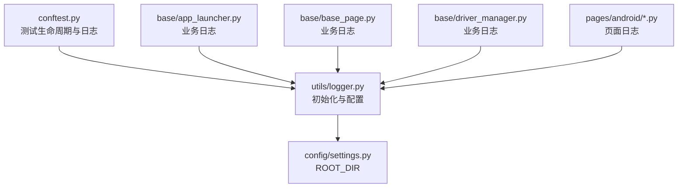
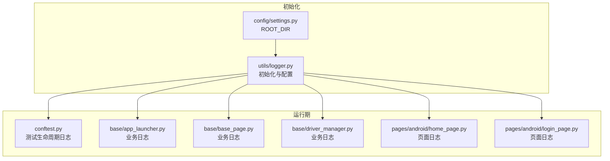
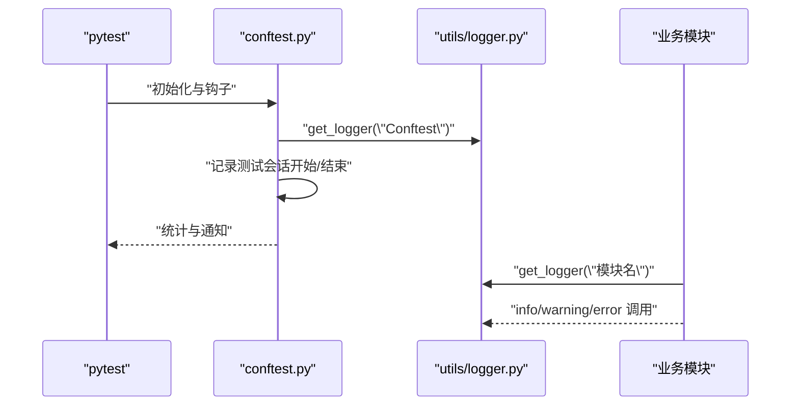
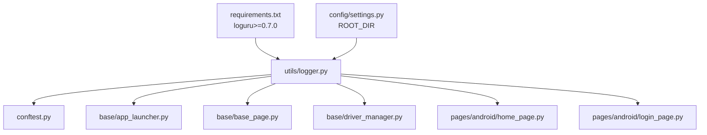

# 日志系统

<cite>
**本文引用的文件**
- [utils/logger.py](file://utils/logger.py)
- [config/settings.py](file://config/settings.py)
- [conftest.py](file://conftest.py)
- [base/app_launcher.py](file://base/app_launcher.py)
- [base/base_page.py](file://base/base_page.py)
- [base/driver_manager.py](file://base/driver_manager.py)
- [pages/android/home_page.py](file://pages/android/home_page.py)
- [pages/android/login_page.py](file://pages/android/login_page.py)
- [requirements.txt](file://requirements.txt)
</cite>

## 目录
1. [简介](#简介)
2. [项目结构](#项目结构)
3. [核心组件](#核心组件)
4. [架构总览](#架构总览)
5. [组件详解](#组件详解)
6. [依赖关系分析](#依赖关系分析)
7. [性能与容量规划](#性能与容量规划)
8. [故障排查指南](#故障排查指南)
9. [结论](#结论)
10. [附录](#附录)

## 简介
本文件系统性梳理 AirTestUI 的结构化日志体系，基于 loguru 实现，覆盖以下主题：
- 日志级别配置与使用场景（DEBUG/INFO/WARNING/ERROR）
- 控制台与文件输出格式差异
- 文件轮转策略（单文件大小、保留天数、压缩格式）
- get_logger 的使用方法与最佳实践
- 在不同模块中统一接入日志的方法

## 项目结构
日志系统主要由以下部分组成：
- 日志初始化与配置：位于 utils/logger.py
- 根目录与日志目录：由 config/settings.py 提供 ROOT_DIR，日志目录为 logs
- 全局入口与测试生命周期：conftest.py 中初始化日志并贯穿测试会话
- 各业务模块的日志使用：base、pages、testcases 等模块均通过 get_logger 获取带模块标识的 logger

图表来源
- [utils/logger.py:12-14](file://utils/logger.py#L12-L14)
- [config/settings.py:10-11](file://config/settings.py#L10-L11)
- [conftest.py:17-21](file://conftest.py#L17-L21)
- [base/app_launcher.py:14-16](file://base/app_launcher.py#L14-L16)
- [base/base_page.py:23-26](file://base/base_page.py#L23-L26)
- [base/driver_manager.py:14-16](file://base/driver_manager.py#L14-L16)
- [pages/android/home_page.py:8-11](file://pages/android/home_page.py#L8-L11)

章节来源
- [utils/logger.py:12-14](file://utils/logger.py#L12-L14)
- [config/settings.py:10-11](file://config/settings.py#L10-L11)
- [conftest.py:17-21](file://conftest.py#L17-L21)

## 核心组件
- 日志目录与根目录
  - 日志目录 LOG_DIR 由 ROOT_DIR 下的 logs 构成，不存在则自动创建
- 默认处理器移除与自定义添加
  - 先移除默认处理器，再按需添加控制台与文件处理器
- 控制台输出
  - 输出到标准错误流，彩色显示，级别为 INFO，包含时间、级别、模块名、函数名、行号与消息
- 全量日志文件
  - DEBUG 级别，按日期命名，单文件最大 20MB，保留 7 天，压缩为 zip
- 错误日志文件
  - 仅 ERROR 及以上，按日期命名，单文件最大 20MB，保留 30 天，压缩为 zip
- get_logger
  - 返回绑定模块名的 logger，便于区分不同模块的输出

章节来源
- [utils/logger.py:12-14](file://utils/logger.py#L12-L14)
- [utils/logger.py:16-25](file://utils/logger.py#L16-L25)
- [utils/logger.py:27-36](file://utils/logger.py#L27-L36)
- [utils/logger.py:38-47](file://utils/logger.py#L38-L47)
- [utils/logger.py:50-58](file://utils/logger.py#L50-L58)

## 架构总览
下图展示日志系统在 AirTestUI 中的整体交互：初始化阶段在 utils/logger.py 完成；各模块通过 get_logger 获取带模块名的 logger；测试生命周期在 conftest.py 中进行；业务模块在各自文件中记录日志。

图表来源
- [utils/logger.py:12-14](file://utils/logger.py#L12-L14)
- [config/settings.py:10-11](file://config/settings.py#L10-L11)
- [conftest.py:17-21](file://conftest.py#L17-L21)
- [base/app_launcher.py:14-16](file://base/app_launcher.py#L14-L16)
- [base/base_page.py:23-26](file://base/base_page.py#L23-L26)
- [base/driver_manager.py:14-16](file://base/driver_manager.py#L14-L16)
- [pages/android/home_page.py:8-11](file://pages/android/home_page.py#L8-L11)
- [pages/android/login_page.py:8-11](file://pages/android/login_page.py#L8-L11)

## 组件详解

### 日志初始化与格式化
- 控制台处理器
  - 输出目标：stderr
  - 格式：包含时间、级别、模块名:函数名:行号、消息，彩色显示
  - 级别：INFO
- 全量文件处理器
  - 文件名：airtestui_{time:YYYY-MM-DD}.log
  - 格式：包含完整时间戳、级别、模块名:函数名:行号、消息
  - 级别：DEBUG
  - 轮转：单文件 20MB
  - 保留：7 天
  - 压缩：zip
  - 编码：utf-8
- 错误文件处理器
  - 文件名：error_{time:YYYY-MM-DD}.log
  - 格式：同上
  - 级别：ERROR
  - 轮转：单文件 20MB
  - 保留：30 天
  - 压缩：zip
  - 编码：utf-8

章节来源
- [utils/logger.py:16-25](file://utils/logger.py#L16-L25)
- [utils/logger.py:27-36](file://utils/logger.py#L27-L36)
- [utils/logger.py:38-47](file://utils/logger.py#L38-L47)

### 日志级别与使用场景
- DEBUG
  - 用途：开发调试、详细流程追踪
  - 示例：元素等待、输入文本、Poco 操作等
- INFO
  - 用途：关键流程与状态变更
  - 示例：APP 启动/关闭、设备连接、测试会话开始/结束
- WARNING
  - 用途：非致命异常或潜在问题
  - 示例：复用设备、不支持平台的操作
- ERROR
  - 用途：异常与失败
  - 示例：启动失败、关闭失败、安装失败、连接失败

章节来源
- [base/base_page.py:60-259](file://base/base_page.py#L60-L259)
- [base/app_launcher.py:45-127](file://base/app_launcher.py#L45-L127)
- [base/driver_manager.py:95-188](file://base/driver_manager.py#L95-L188)
- [conftest.py:103-117](file://conftest.py#L103-L117)

### get_logger 使用方法与最佳实践
- 获取带模块标识的 logger
  - 用法：调用 get_logger("模块名")，返回绑定 name 的 logger
  - 推荐：每个模块/类/文件一个唯一模块名，便于日志聚合与检索
- 在不同模块中的使用
  - 测试夹具与生命周期：conftest.py 中使用 get_logger("Conftest")
  - 业务模块：base/app_launcher.py、base/base_page.py、base/driver_manager.py
  - 页面对象：pages/android/home_page.py、pages/android/login_page.py
- 最佳实践
  - 保持模块名稳定且语义明确
  - 优先使用 info 记录关键事件，error 记录失败
  - 避免在高频循环中打印大量 debug 信息
  - 结合文件轮转参数，确保磁盘空间可控

章节来源
- [utils/logger.py:50-58](file://utils/logger.py#L50-L58)
- [conftest.py:17-21](file://conftest.py#L17-L21)
- [base/app_launcher.py:14-16](file://base/app_launcher.py#L14-L16)
- [base/base_page.py:23-26](file://base/base_page.py#L23-L26)
- [base/driver_manager.py:14-16](file://base/driver_manager.py#L14-L16)
- [pages/android/home_page.py:8-11](file://pages/android/home_page.py#L8-L11)
- [pages/android/login_page.py:8-11](file://pages/android/login_page.py#L8-L11)

### 日志文件轮转机制
- 单文件大小限制
  - 20MB
- 保留天数
  - 全量日志：7 天
  - 错误日志：30 天
- 压缩格式
  - zip
- 编码
  - utf-8
- 生成规则
  - 按日期命名（YYYY-MM-DD），每日生成新文件
- 影响与建议
  - 合理设置保留天数以平衡存储与历史追溯
  - 生产环境建议结合外部日志收集系统集中管理

章节来源
- [utils/logger.py:27-36](file://utils/logger.py#L27-L36)
- [utils/logger.py:38-47](file://utils/logger.py#L38-L47)

### 控制台输出与文件输出格式对比
- 控制台输出
  - 时间：HH:mm:ss
  - 级别：INFO
  - 格式：包含时间、级别、模块名:函数名:行号、消息，彩色显示
- 文件输出
  - 时间：YYYY-MM-DD HH:mm:ss.SSS
  - 级别：DEBUG 或 ERROR
  - 格式：包含完整时间戳、级别、模块名:函数名:行号、消息
- 适用场景
  - 控制台：开发调试、快速观察
  - 文件：归档、审计、问题复现

章节来源
- [utils/logger.py:16-25](file://utils/logger.py#L16-L25)
- [utils/logger.py:27-36](file://utils/logger.py#L27-L36)
- [utils/logger.py:38-47](file://utils/logger.py#L38-L47)

### 日志系统调用时序（以测试会话为例）

图表来源
- [conftest.py:17-21](file://conftest.py#L17-L21)
- [utils/logger.py:50-58](file://utils/logger.py#L50-L58)
- [base/app_launcher.py:14-16](file://base/app_launcher.py#L14-L16)
- [base/base_page.py:23-26](file://base/base_page.py#L23-L26)
- [base/driver_manager.py:14-16](file://base/driver_manager.py#L14-L16)

## 依赖关系分析
- 外部依赖
  - loguru：版本要求 >= 0.7.0
- 内部依赖
  - utils/logger.py 依赖 config/settings.py 提供 ROOT_DIR
  - 各模块通过 from utils.logger import get_logger 使用日志

图表来源
- [requirements.txt:19](file://requirements.txt#L19)
- [config/settings.py:10-11](file://config/settings.py#L10-L11)
- [utils/logger.py:9](file://utils/logger.py#L9)
- [conftest.py:17](file://conftest.py#L17)
- [base/app_launcher.py:14](file://base/app_launcher.py#L14)
- [base/base_page.py:23](file://base/base_page.py#L23)
- [base/driver_manager.py:14](file://base/driver_manager.py#L14)
- [pages/android/home_page.py:8](file://pages/android/home_page.py#L8)
- [pages/android/login_page.py:8](file://pages/android/login_page.py#L8)

章节来源
- [requirements.txt:19](file://requirements.txt#L19)
- [config/settings.py:10-11](file://config/settings.py#L10-L11)
- [utils/logger.py:9](file://utils/logger.py#L9)

## 性能与容量规划
- 日志级别与性能
  - DEBUG 量级较大，建议在开发与问题定位阶段开启，生产环境建议 INFO 或更高
- 文件轮转与磁盘占用
  - 单文件 20MB，按日切割，全量日志保留 7 天，错误日志保留 30 天
  - 建议监控 logs 目录大小，必要时调整保留策略或引入外部日志收集
- I/O 压力
  - 控制台输出为 stderr，通常影响较小；文件写入受磁盘性能影响
  - 建议避免在高频循环中频繁打印日志

## 故障排查指南
- 日志未输出
  - 检查是否在模块内正确导入并使用 get_logger
  - 确认日志级别是否高于控制台/文件处理器的最小级别
- 日志文件未轮转
  - 检查单文件大小阈值与磁盘空间
  - 确认系统时间与文件时间戳一致
- 日志乱码或编码问题
  - 确认文件编码为 utf-8
- 日志目录不存在
  - 确认 ROOT_DIR/logs 目录存在且具备写权限

章节来源
- [utils/logger.py:12-14](file://utils/logger.py#L12-L14)
- [utils/logger.py:27-36](file://utils/logger.py#L27-L36)
- [utils/logger.py:38-47](file://utils/logger.py#L38-L47)

## 结论
AirTestUI 的日志系统以 loguru 为核心，提供了清晰的控制台与文件输出、完善的轮转与保留策略，并通过 get_logger 为各模块提供统一、可追踪的日志接口。遵循本文的最佳实践，可在保证可观测性的同时兼顾性能与存储成本。

## 附录
- 快速参考
  - 获取 logger：get_logger("模块名")
  - 控制台级别：INFO
  - 全量文件级别：DEBUG，单文件 20MB，保留 7 天，压缩 zip
  - 错误文件级别：ERROR，单文件 20MB，保留 30 天，压缩 zip
  - 日志目录：ROOT_DIR/logs