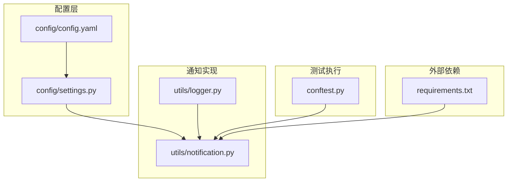
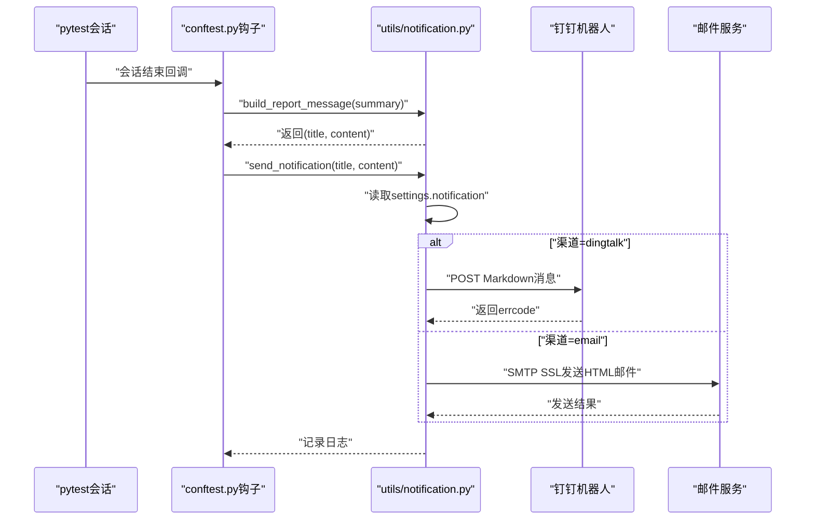
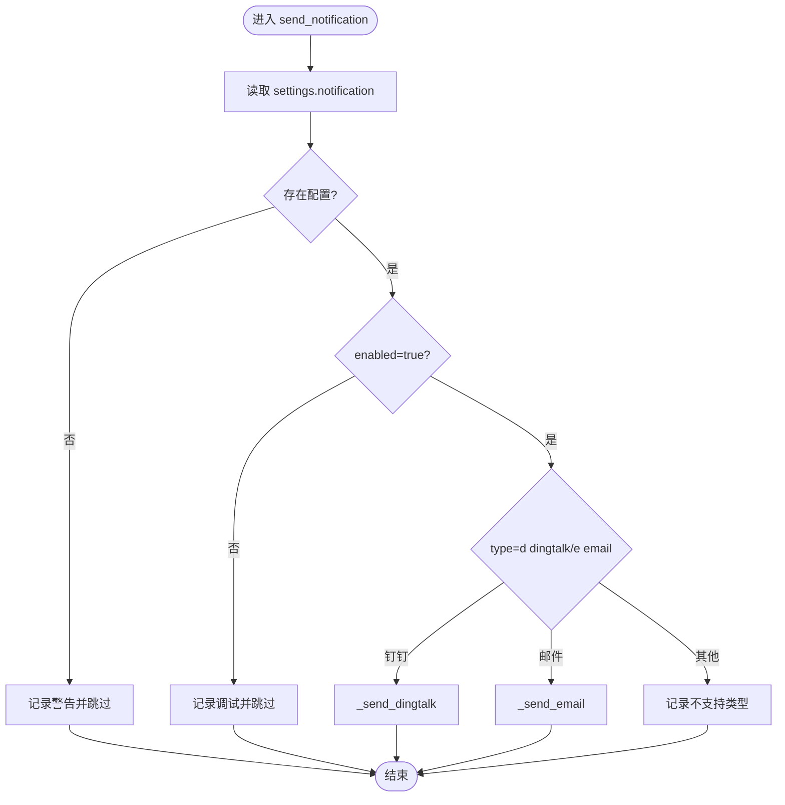
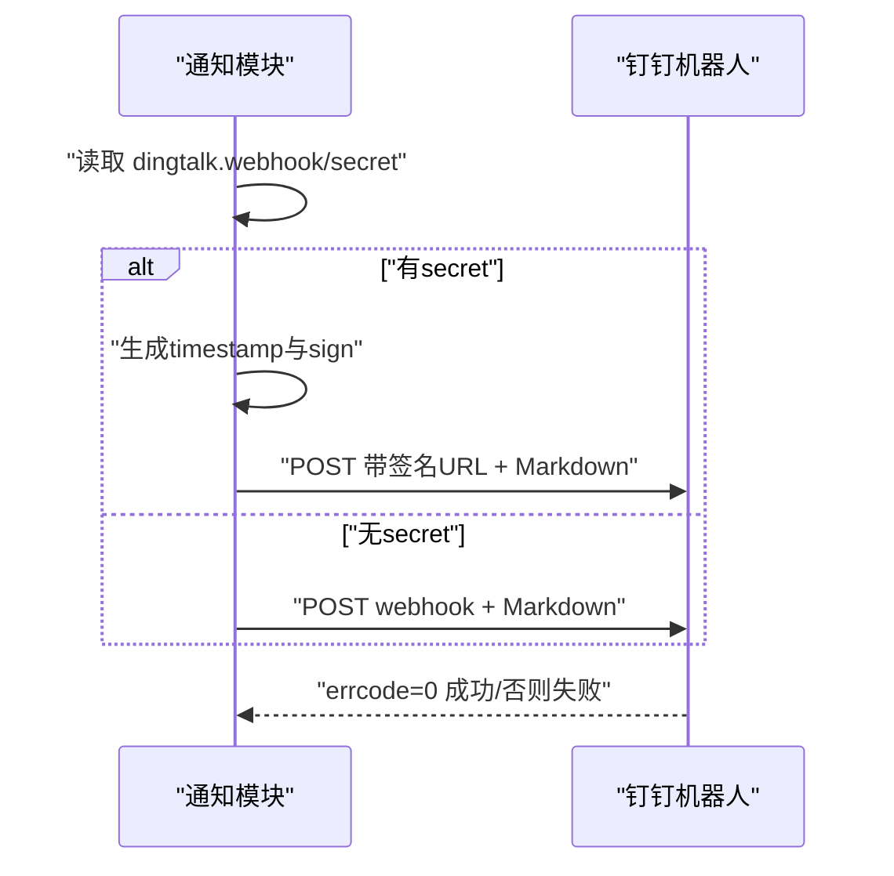
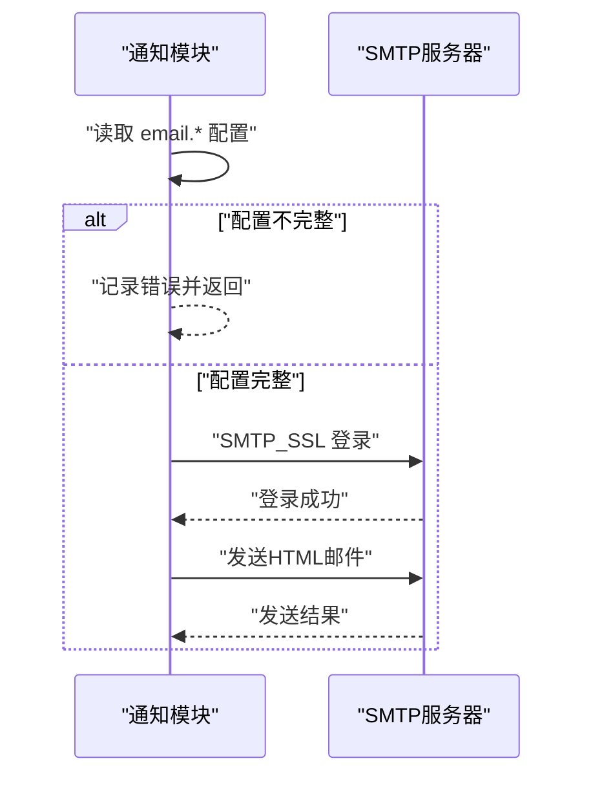
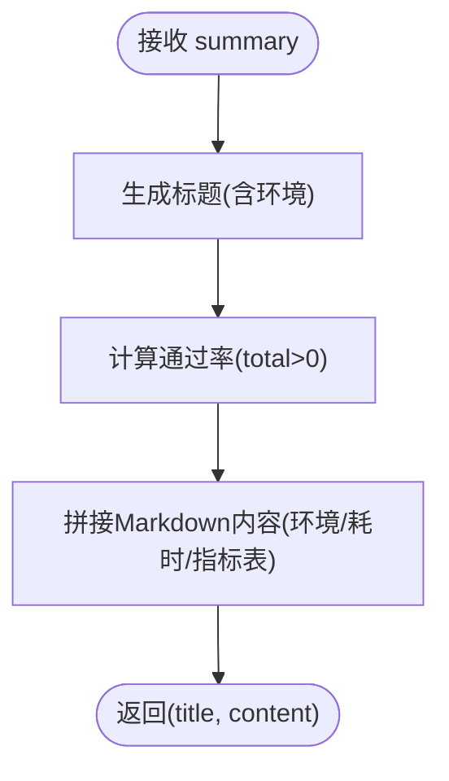
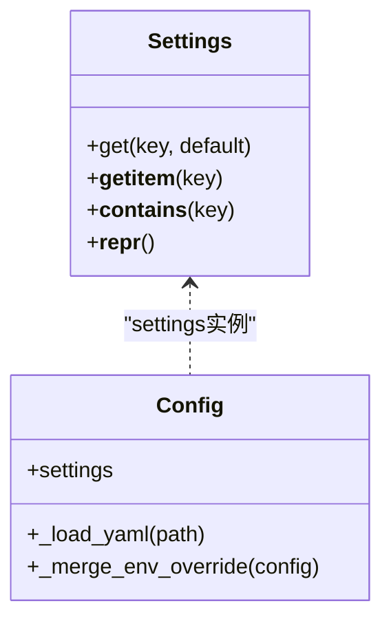
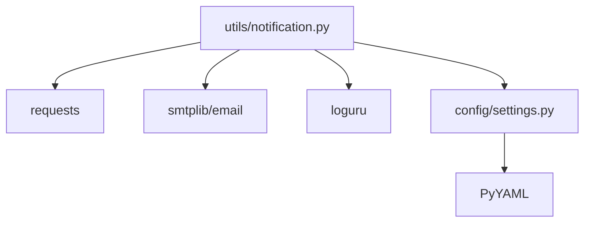

# 通知系统

<cite>
**本文引用的文件**
- [utils/notification.py](file://utils/notification.py)
- [config/config.yaml](file://config/config.yaml)
- [config/settings.py](file://config/settings.py)
- [utils/logger.py](file://utils/logger.py)
- [conftest.py](file://conftest.py)
- [requirements.txt](file://requirements.txt)
</cite>

## 目录
1. [简介](#简介)
2. [项目结构](#项目结构)
3. [核心组件](#核心组件)
4. [架构总览](#架构总览)
5. [详细组件分析](#详细组件分析)
6. [依赖分析](#依赖分析)
7. [性能考虑](#性能考虑)
8. [故障排查指南](#故障排查指南)
9. [结论](#结论)
10. [附录](#附录)

## 简介
本文件面向AirTestUI通知系统，系统性阐述通知模块的实现原理、配置方法与使用实践。通知系统支持两种渠道：钉钉机器人与邮件，并在测试结束后自动构建测试报告并通过选定渠道进行推送。文档涵盖通知渠道配置、消息格式定制、发送策略、触发条件、使用示例与故障排查等内容，帮助开发者快速集成与扩展通知能力。

## 项目结构
通知系统相关文件分布于以下模块：
- 配置层：config/config.yaml（全局配置）、config/settings.py（配置加载与环境变量覆盖）
- 通知实现：utils/notification.py（通知发送、消息模板构建）
- 日志：utils/logger.py（统一日志输出，便于问题定位）
- 测试钩子：conftest.py（pytest会话结束时触发通知）
- 依赖：requirements.txt（第三方库）

图表来源
- [config/config.yaml:30-43](file://config/config.yaml#L30-L43)
- [config/settings.py:34-80](file://config/settings.py#L34-L80)
- [utils/notification.py:22-48](file://utils/notification.py#L22-L48)
- [conftest.py:89-117](file://conftest.py#L89-L117)
- [requirements.txt:17-21](file://requirements.txt#L17-L21)

章节来源
- [config/config.yaml:1-70](file://config/config.yaml#L1-L70)
- [config/settings.py:1-112](file://config/settings.py#L1-L112)
- [utils/notification.py:1-167](file://utils/notification.py#L1-L167)
- [utils/logger.py:1-59](file://utils/logger.py#L1-L59)
- [conftest.py:86-129](file://conftest.py#L86-L129)
- [requirements.txt:1-21](file://requirements.txt#L1-L21)

## 核心组件
- 通知入口函数：send_notification(title, content)，根据配置自动选择钉钉或邮件渠道发送
- 渠道实现：
  - 钉钉机器人：_send_dingtalk，支持签名验证（secret），Markdown消息体
  - 邮件：_send_email，SMTP SSL发送，HTML正文
- 消息模板：build_report_message(summary)，生成测试报告标题与Markdown内容
- 配置加载：settings（config/settings.py）提供notification配置访问
- 触发点：pytest会话结束钩子（conftest.py）收集测试统计并调用通知

章节来源
- [utils/notification.py:22-48](file://utils/notification.py#L22-L48)
- [utils/notification.py:50-94](file://utils/notification.py#L50-L94)
- [utils/notification.py:96-126](file://utils/notification.py#L96-L126)
- [utils/notification.py:128-166](file://utils/notification.py#L128-L166)
- [config/settings.py:51-80](file://config/settings.py#L51-L80)
- [conftest.py:89-117](file://conftest.py#L89-L117)

## 架构总览
通知系统采用“配置驱动 + 插件式渠道”的架构设计：
- 配置层：config/config.yaml定义通知开关、渠道类型及各渠道参数；config/settings.py将配置转为可访问的对象，并支持环境变量覆盖
- 通知层：utils/notification.py根据配置选择渠道，构造消息并发送
- 触发层：pytest钩子在测试会话结束时收集统计信息，调用通知模块
- 日志层：utils/logger.py统一记录通知发送过程中的状态与错误

图表来源
- [conftest.py:89-117](file://conftest.py#L89-L117)
- [utils/notification.py:22-48](file://utils/notification.py#L22-L48)
- [utils/notification.py:50-94](file://utils/notification.py#L50-L94)
- [utils/notification.py:96-126](file://utils/notification.py#L96-L126)

## 详细组件分析

### 通知入口与发送策略
- send_notification(title, content)负责：
  - 读取settings.notification配置
  - 判断enabled开关
  - 根据type选择渠道（默认dingtalk）
  - 分派至具体渠道发送函数
- 发送策略要点：
  - 未配置或未启用则跳过
  - 不支持的type记录警告
  - 渠道内部对必要参数进行校验，缺失时记录错误

图表来源
- [utils/notification.py:22-48](file://utils/notification.py#L22-L48)

章节来源
- [utils/notification.py:22-48](file://utils/notification.py#L22-L48)

### 钉钉机器人通知
- 配置项：webhook、secret（可选）
- 签名机制：当secret存在时，按时间戳与密钥计算签名并拼接到URL
- 消息格式：Markdown，包含标题与文本
- 错误处理：检查errcode，异常捕获并记录

图表来源
- [utils/notification.py:50-94](file://utils/notification.py#L50-L94)
- [config/config.yaml:34-36](file://config/config.yaml#L34-L36)

章节来源
- [utils/notification.py:50-94](file://utils/notification.py#L50-L94)
- [config/config.yaml:34-36](file://config/config.yaml#L34-L36)

### 邮件通知
- 配置项：smtp_host、smtp_port（默认465）、sender、password、receivers（数组）
- 正文格式：HTML
- 认证方式：SMTP SSL登录
- 错误处理：参数不全直接返回，异常捕获并记录

图表来源
- [utils/notification.py:96-126](file://utils/notification.py#L96-L126)
- [config/config.yaml:37-42](file://config/config.yaml#L37-L42)

章节来源
- [utils/notification.py:96-126](file://utils/notification.py#L96-L126)
- [config/config.yaml:37-42](file://config/config.yaml#L37-L42)

### 测试报告消息模板
- 输入：测试统计摘要（总数、通过数、失败数、跳过数、耗时、环境）
- 输出：标题与Markdown内容
- 内容包含：环境、耗时、指标表格、通过率等

图表来源
- [utils/notification.py:128-166](file://utils/notification.py#L128-L166)

章节来源
- [utils/notification.py:128-166](file://utils/notification.py#L128-L166)

### 配置加载与覆盖机制
- config/config.yaml：定义notification.enabled、type、各渠道参数
- config/settings.py：
  - 将YAML解析为嵌套对象，支持属性/字典两种访问
  - 支持环境变量覆盖（前缀AIRTESTUI_）
  - 支持本地覆盖文件（local_config.yaml，不在版本控制内）

图表来源
- [config/settings.py:51-80](file://config/settings.py#L51-L80)
- [config/settings.py:14-31](file://config/settings.py#L14-L31)

章节来源
- [config/config.yaml:30-43](file://config/config.yaml#L30-L43)
- [config/settings.py:34-80](file://config/settings.py#L34-L80)

### 触发条件与使用示例
- 触发条件：pytest会话结束（sessionfinish）
- 触发流程：
  - 统计测试结果（总数、通过、失败、跳过、耗时、环境）
  - 构建报告消息
  - 调用send_notification发送
- 使用示例（步骤说明）：
  - 在config/config.yaml中启用通知并选择渠道
  - 填写对应渠道参数（如钉钉webhook/secret或邮件SMTP信息）
  - 运行测试，pytest会话结束时自动发送通知
  - 可通过环境变量覆盖配置（如设置AIRTESTUI_NOTIFICATION_ENABLED=TRUE）

章节来源
- [conftest.py:89-117](file://conftest.py#L89-L117)
- [utils/notification.py:22-48](file://utils/notification.py#L22-L48)
- [config/config.yaml:30-43](file://config/config.yaml#L30-L43)
- [config/settings.py:20-31](file://config/settings.py#L20-L31)

## 依赖分析
- 第三方库：
  - requests：HTTP请求（钉钉）
  - smtplib/email：SMTP邮件发送
  - loguru：结构化日志
  - PyYAML：YAML解析
- 通知模块依赖：
  - config/settings.py提供的settings对象
  - utils/logger.py提供的日志接口

图表来源
- [utils/notification.py:5-17](file://utils/notification.py#L5-L17)
- [config/settings.py:5-17](file://config/settings.py#L5-L17)
- [requirements.txt:17-21](file://requirements.txt#L17-L21)

章节来源
- [utils/notification.py:5-17](file://utils/notification.py#L5-L17)
- [config/settings.py:5-17](file://config/settings.py#L5-L17)
- [requirements.txt:17-21](file://requirements.txt#L17-L21)

## 性能考虑
- 发送超时：钉钉发送设置超时（约10秒），避免阻塞测试会话
- 异步建议：当前实现为同步发送，若通知延迟影响整体耗时，可在业务侧引入异步队列或延后发送
- 日志开销：日志级别已合理划分，生产环境建议保持INFO及以上级别以减少磁盘占用

## 故障排查指南
- 通知未发送
  - 检查notification.enabled是否为true
  - 检查type是否为dingtalk或email
- 钉钉发送失败
  - 确认webhook填写正确
  - 若使用secret，确认签名计算逻辑（timestamp与sign拼接）
  - 查看返回errcode，核对机器人权限与网络连通性
- 邮件发送失败
  - 确认smtp_host、smtp_port、sender、password、receivers均配置
  - 检查SMTP SSL端口与认证方式
  - 查看异常日志定位具体错误
- 配置未生效
  - 检查是否通过环境变量覆盖（前缀AIRTESTUI_）
  - 确认local_config.yaml未被忽略且覆盖了期望字段

章节来源
- [utils/notification.py:30-47](file://utils/notification.py#L30-L47)
- [utils/notification.py:50-94](file://utils/notification.py#L50-L94)
- [utils/notification.py:96-126](file://utils/notification.py#L96-L126)
- [config/settings.py:20-31](file://config/settings.py#L20-L31)

## 结论
AirTestUI通知系统以简洁的配置驱动模式实现了钉钉与邮件两种渠道的通知能力。通过pytest钩子在测试会话结束时自动推送测试报告，结合灵活的配置覆盖机制，满足不同环境下的通知需求。建议在生产环境中完善凭证管理与异步化策略，进一步提升稳定性与性能。

## 附录
- 配置项参考
  - notification.enabled：布尔，是否启用通知
  - notification.type：字符串，渠道类型（dingtalk或email）
  - notification.dingtalk.webhook：字符串，钉钉机器人Webhook地址
  - notification.dingtalk.secret：字符串，钉钉机器人密钥（可选）
  - notification.email.smtp_host：字符串，SMTP主机
  - notification.email.smtp_port：整数，默认465
  - notification.email.sender：字符串，发件人邮箱
  - notification.email.password：字符串，发件人授权码
  - notification.email.receivers：数组，收件人邮箱列表
- 环境变量覆盖规则
  - 使用前缀AIRTESTUI_，键名转为小写，如AIRTESTUI_NOTIFICATION_ENABLED=TRUE

章节来源
- [config/config.yaml:30-43](file://config/config.yaml#L30-L43)
- [config/settings.py:20-31](file://config/settings.py#L20-L31)