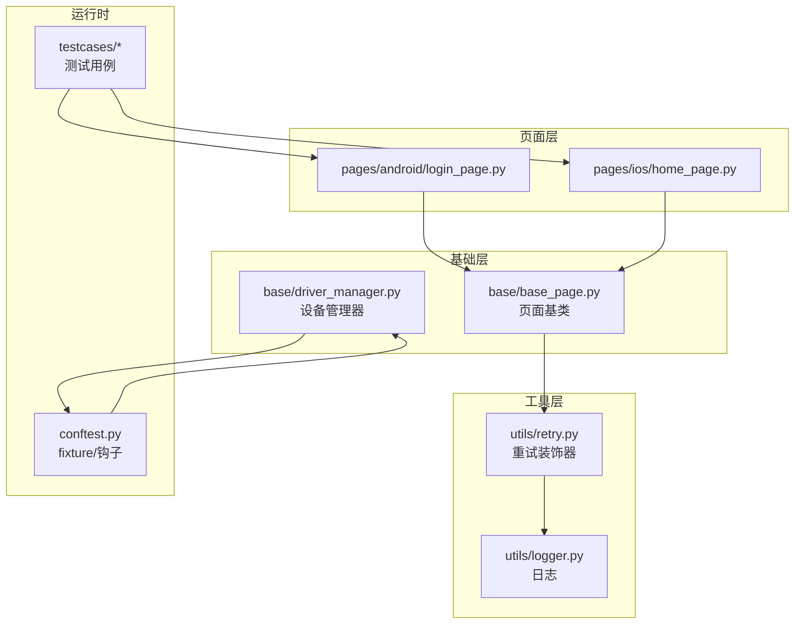
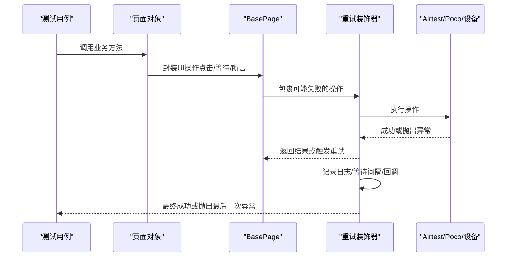
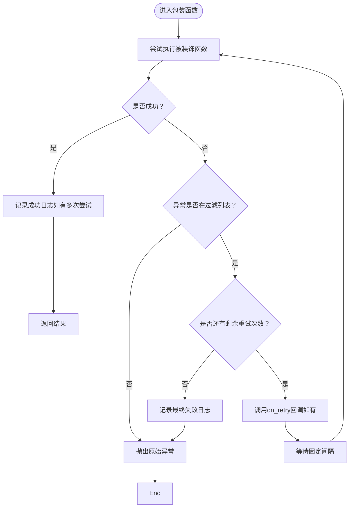
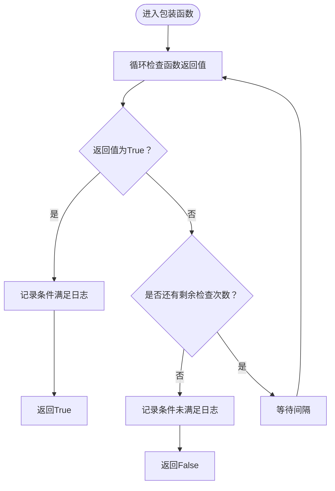
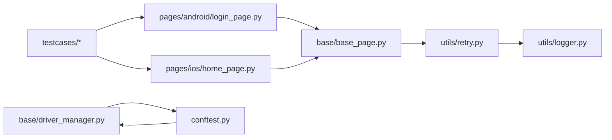

# 重试机制

<cite>
**本文引用的文件**
- [utils/retry.py](file://utils/retry.py)
- [base/base_page.py](file://base/base_page.py)
- [base/driver_manager.py](file://base/driver_manager.py)
- [testcases/android/test_login.py](file://testcases/android/test_login.py)
- [testcases/ios/test_home.py](file://testcases/ios/test_home.py)
- [pages/android/login_page.py](file://pages/android/login_page.py)
- [pages/ios/home_page.py](file://pages/ios/home_page.py)
- [conftest.py](file://conftest.py)
- [utils/logger.py](file://utils/logger.py)
</cite>

## 目录
1. [简介](#简介)
2. [项目结构](#项目结构)
3. [核心组件](#核心组件)
4. [架构总览](#架构总览)
5. [详细组件分析](#详细组件分析)
6. [依赖分析](#依赖分析)
7. [性能考虑](#性能考虑)
8. [故障排查指南](#故障排查指南)
9. [结论](#结论)
10. [附录：使用示例与最佳实践](#附录使用示例与最佳实践)

## 简介
本章节面向AirTestUI的重试机制，系统性阐述retry装饰器的设计与实现、参数配置、异常过滤、重试间隔控制、条件重试、日志与回调等能力，并结合页面操作、设备连接、应用启动等典型场景给出落地建议与最佳实践。同时说明在面对网络波动与系统延迟时的稳定性提升与性能权衡。

## 项目结构
围绕重试机制的关键文件分布如下：
- 重试装饰器：utils/retry.py
- 页面基类与页面对象：base/base_page.py、pages/android/login_page.py、pages/ios/home_page.py
- 设备驱动与连接：base/driver_manager.py、conftest.py
- 日志系统：utils/logger.py
- 测试用例：testcases/android/test_login.py、testcases/ios/test_home.py

图表来源
- [utils/retry.py:1-102](file://utils/retry.py#L1-L102)
- [base/base_page.py:1-320](file://base/base_page.py#L1-L320)
- [base/driver_manager.py:1-188](file://base/driver_manager.py#L1-L188)
- [pages/android/login_page.py:1-107](file://pages/android/login_page.py#L1-L107)
- [pages/ios/home_page.py:1-43](file://pages/ios/home_page.py#L1-L43)
- [conftest.py:1-255](file://conftest.py#L1-L255)
- [utils/logger.py:1-59](file://utils/logger.py#L1-L59)

章节来源
- [utils/retry.py:1-102](file://utils/retry.py#L1-L102)
- [base/base_page.py:1-320](file://base/base_page.py#L1-L320)
- [base/driver_manager.py:1-188](file://base/driver_manager.py#L1-L188)
- [pages/android/login_page.py:1-107](file://pages/android/login_page.py#L1-L107)
- [pages/ios/home_page.py:1-43](file://pages/ios/home_page.py#L1-L43)
- [conftest.py:1-255](file://conftest.py#L1-L255)
- [utils/logger.py:1-59](file://utils/logger.py#L1-L59)

## 核心组件
- 通用重试装饰器：支持最大重试次数、固定间隔、异常类型过滤、重试前回调与日志记录。
- 条件重试装饰器：持续检查函数返回值，直到满足条件或达到最大检查次数。
- 页面基类与页面对象：封装Airtest/Poco操作，便于在点击、等待、断言等环节应用重试。
- 设备驱动管理器与fixture：在多设备并发场景下稳定地建立设备连接，为重试提供稳定的底层环境。
- 日志系统：统一输出重试过程中的信息、警告与错误，便于问题定位。

章节来源
- [utils/retry.py:13-64](file://utils/retry.py#L13-L64)
- [utils/retry.py:67-101](file://utils/retry.py#L67-L101)
- [base/base_page.py:30-320](file://base/base_page.py#L30-L320)
- [base/driver_manager.py:51-187](file://base/driver_manager.py#L51-L187)
- [utils/logger.py:50-59](file://utils/logger.py#L50-L59)

## 架构总览
重试机制在AirTestUI中的位置与交互如下：

图表来源
- [pages/android/login_page.py:62-73](file://pages/android/login_page.py#L62-L73)
- [base/base_page.py:60-127](file://base/base_page.py#L60-L127)
- [utils/retry.py:37-64](file://utils/retry.py#L37-L64)

## 详细组件分析

### 通用重试装饰器（retry）
- 功能要点
  - 最大重试次数：含首次执行，超过次数后抛出最后一次异常。
  - 固定间隔：每次重试前等待固定秒数。
  - 异常过滤：仅对指定异常类型触发重试，避免对非瞬时错误盲目重试。
  - 回调钩子：on_retry(attempt, exception)可在重试前执行自定义逻辑（如上报、降级）。
  - 日志记录：对每次失败与最终失败进行日志输出，便于审计。
- 参数说明
  - max_attempts：整数，默认2；含首次执行。
  - wait_between：浮点数，默认3.0；单位秒。
  - retry_on：异常类型元组，默认(Exception,)；仅命中这些异常才重试。
  - on_retry：可选回调；签名形如on_retry(attempt, exception)。
- 行为流程

图表来源
- [utils/retry.py:37-64](file://utils/retry.py#L37-L64)

章节来源
- [utils/retry.py:13-64](file://utils/retry.py#L13-L64)

### 条件重试装饰器（retry_until_true）
- 功能要点
  - 适用于“等待某个条件成立”的场景，如页面元素出现、状态变为True等。
  - 循环检查函数返回值，直到为True或达到最大检查次数。
  - 支持自定义检查间隔与最大次数。
- 参数说明
  - func：被装饰函数，应返回布尔值。
  - max_attempts：最大检查次数，默认10。
  - interval：检查间隔（秒），默认1.0。
- 行为流程

图表来源
- [utils/retry.py:85-101](file://utils/retry.py#L85-L101)

章节来源
- [utils/retry.py:67-101](file://utils/retry.py#L67-L101)

### 页面基类与页面对象中的重试应用
- BasePage封装了Airtest/Poco常用操作（点击、等待、断言、输入、滑动等），这些操作在复杂UI或弱网环境下可能出现短暂失败，适合在关键步骤上叠加重试装饰器。
- 页面对象（如AndroidLoginPage、IOSHomePage）通过继承BasePage，复用统一的交互接口，便于在不同页面中一致地应用重试策略。

章节来源
- [base/base_page.py:30-320](file://base/base_page.py#L30-L320)
- [pages/android/login_page.py:14-107](file://pages/android/login_page.py#L14-L107)
- [pages/ios/home_page.py:12-43](file://pages/ios/home_page.py#L12-L43)

### 设备连接与重试的关系
- DriverManager负责设备池初始化、分配与回收，确保测试在稳定设备上运行。
- 在设备连接不稳定或多设备并发时，配合retry装饰器可提升连接与初始化成功率，降低因瞬时抖动导致的失败。

章节来源
- [base/driver_manager.py:51-187](file://base/driver_manager.py#L51-L187)
- [conftest.py:157-227](file://conftest.py#L157-L227)

## 依赖分析
- 重试装饰器依赖日志模块输出重试过程信息。
- 页面基类与页面对象依赖Airtest/Poco接口，重试装饰器可作用于这些操作以增强鲁棒性。
- 设备管理器与fixture为重试提供稳定的底层环境，减少因设备连接问题导致的误判。
- 测试用例通过页面对象调用，间接受益于重试带来的稳定性提升。

图表来源
- [utils/retry.py:1-102](file://utils/retry.py#L1-L102)
- [utils/logger.py:1-59](file://utils/logger.py#L1-L59)
- [base/base_page.py:1-320](file://base/base_page.py#L1-L320)
- [pages/android/login_page.py:1-107](file://pages/android/login_page.py#L1-L107)
- [pages/ios/home_page.py:1-43](file://pages/ios/home_page.py#L1-L43)
- [base/driver_manager.py:1-188](file://base/driver_manager.py#L1-L188)
- [conftest.py:1-255](file://conftest.py#L1-L255)

章节来源
- [utils/retry.py:1-102](file://utils/retry.py#L1-L102)
- [utils/logger.py:1-59](file://utils/logger.py#L1-L59)
- [base/base_page.py:1-320](file://base/base_page.py#L1-L320)
- [pages/android/login_page.py:1-107](file://pages/android/login_page.py#L1-L107)
- [pages/ios/home_page.py:1-43](file://pages/ios/home_page.py#L1-L43)
- [base/driver_manager.py:1-188](file://base/driver_manager.py#L1-L188)
- [conftest.py:1-255](file://conftest.py#L1-L255)

## 性能考虑
- 时间成本：重试会增加总耗时，max_attempts与wait_between越大，平均耗时越高。应在稳定性与效率间权衡。
- 资源占用：频繁sleep与重复调用可能增加CPU与IO压力，建议在高并发场景下合理设置间隔与上限。
- 异常过滤：仅对可预期的瞬时异常（如网络抖动、UI渲染延迟）启用重试，避免对致命错误盲目重试。
- 日志开销：重试日志有助于排障，但过多日志会影响I/O性能，建议在CI中按需调整日志级别。

## 故障排查指南
- 症状：重试无效或未触发
  - 检查retry_on是否包含目标异常类型；确认异常被捕获路径正确。
  - 确认max_attempts与wait_between设置是否合理。
- 症状：重试过多导致用例超时
  - 适当降低max_attempts或wait_between；或改用更精准的异常过滤。
- 症状：日志中无重试记录
  - 检查日志级别与输出配置；确认装饰器包裹范围正确。
- 症状：设备连接不稳定
  - 结合DriverManager与fixture，确保设备分配与初始化阶段具备重试能力；必要时在连接逻辑处增加重试装饰器。

章节来源
- [utils/retry.py:13-64](file://utils/retry.py#L13-L64)
- [utils/retry.py:67-101](file://utils/retry.py#L67-L101)
- [utils/logger.py:16-47](file://utils/logger.py#L16-L47)
- [base/driver_manager.py:103-117](file://base/driver_manager.py#L103-L117)
- [conftest.py:157-227](file://conftest.py#L157-L227)

## 结论
AirTestUI的重试机制通过通用装饰器与条件重试装饰器，为页面操作、设备连接、应用启动等关键环节提供了稳健的容错能力。结合异常过滤、固定间隔、回调与日志，既能提升系统在弱网与系统延迟下的稳定性，又能在性能与可靠性之间取得平衡。建议在高频失败场景中谨慎配置重试参数，并优先对可恢复的瞬时异常启用重试。

## 附录：使用示例与最佳实践

### 示例一：在页面点击操作中应用重试
- 场景：登录页点击登录按钮，偶发UI渲染延迟导致点击失败。
- 建议：对点击方法添加重试装饰器，异常过滤为常见UI异常类型，间隔与次数依据实测调整。
- 参考路径
  - [pages/android/login_page.py:54-59](file://pages/android/login_page.py#L54-L59)
  - [utils/retry.py:13-64](file://utils/retry.py#L13-L64)

### 示例二：等待页面元素出现
- 场景：等待登录页元素出现，受渲染与网络影响可能出现短暂不可见。
- 建议：使用条件重试装饰器，设置合理检查次数与间隔，避免硬编码长超时。
- 参考路径
  - [utils/retry.py:67-101](file://utils/retry.py#L67-L101)
  - [pages/android/login_page.py:77-85](file://pages/android/login_page.py#L77-L85)

### 示例三：设备连接稳定性
- 场景：多设备并发时，设备连接偶发失败。
- 建议：在连接逻辑处使用重试装饰器，异常过滤为连接类异常，结合DriverManager的分配策略。
- 参考路径
  - [base/driver_manager.py:103-117](file://base/driver_manager.py#L103-L117)
  - [conftest.py:157-176](file://conftest.py#L157-L176)

### 示例四：应用启动与关闭
- 场景：APP启动不稳定或关闭异常。
- 建议：在AppLauncher的launch/close中对关键步骤加重试，异常过滤为启动/关闭相关异常。
- 参考路径
  - [conftest.py:210-227](file://conftest.py#L210-L227)

### 最佳实践清单
- 明确异常类型：仅对可恢复的瞬时异常启用重试，避免吞掉致命错误。
- 合理设置参数：max_attempts与wait_between应结合用例时延与失败率调优。
- 使用条件重试：对“直到满足条件”的场景优先使用retry_until_true。
- 限制重试范围：仅对关键路径加重试，避免对所有操作无差别重试。
- 关注日志：利用重试日志定位失败根因，必要时在on_retry中加入监控上报。
- 并发与资源：在多设备并发场景下，注意重试对资源与性能的影响，必要时分批或限速。