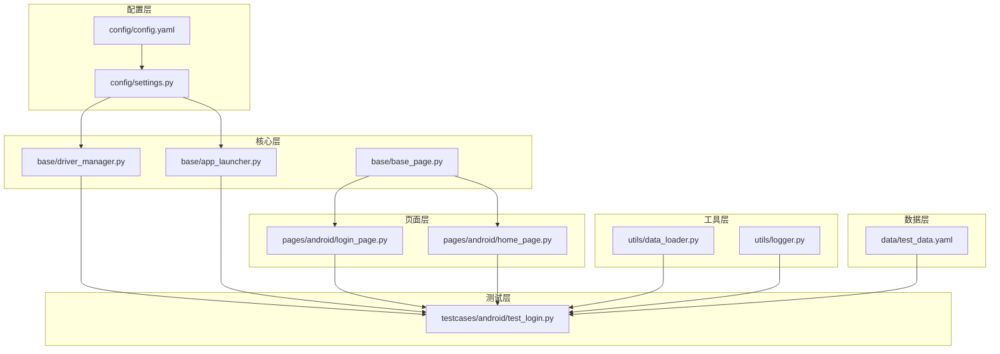
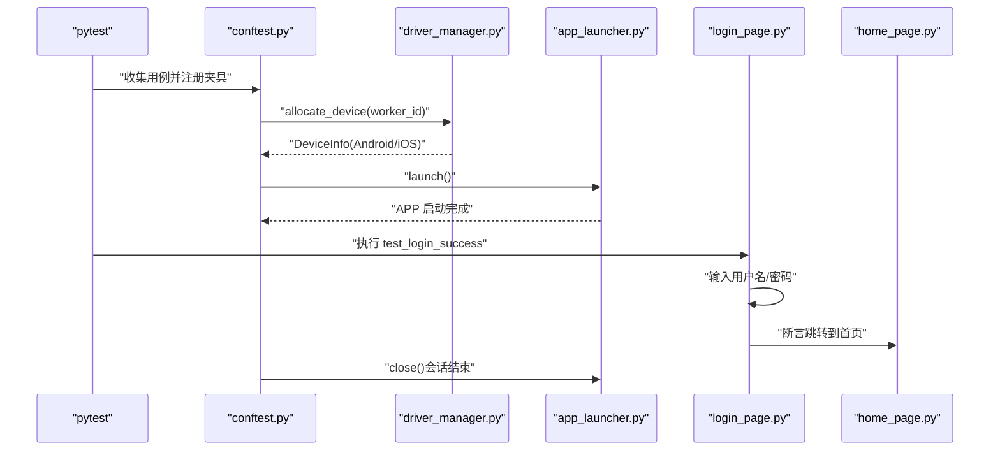
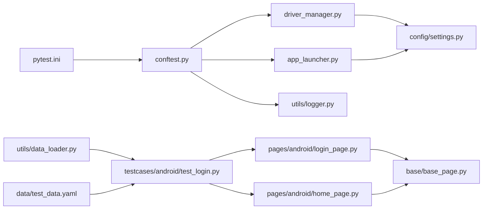

# 快速开始

<cite>
**本文引用的文件**
- [requirements.txt](file://requirements.txt)
- [config.yaml](file://config/config.yaml)
- [settings.py](file://config/settings.py)
- [pytest.ini](file://pytest.ini)
- [conftest.py](file://conftest.py)
- [base_page.py](file://base/base_page.py)
- [driver_manager.py](file://base/driver_manager.py)
- [app_launcher.py](file://base/app_launcher.py)
- [login_page.py](file://pages/android/login_page.py)
- [home_page.py](file://pages/android/home_page.py)
- [test_login.py](file://testcases/android/test_login.py)
- [test_data.yaml](file://data/test_data.yaml)
- [data_loader.py](file://utils/data_loader.py)
- [logger.py](file://utils/logger.py)
</cite>

## 目录
1. [简介](#简介)
2. [项目结构](#项目结构)
3. [核心组件](#核心组件)
4. [架构总览](#架构总览)
5. [详细组件分析](#详细组件分析)
6. [依赖关系分析](#依赖关系分析)
7. [性能与稳定性建议](#性能与稳定性建议)
8. [故障排查指南](#故障排查指南)
9. [结论](#结论)
10. [附录](#附录)

## 简介
本指南面向首次接触 AirTestUI 框架的新用户，帮助你在约 30 分钟内完成环境搭建、设备配置与连接，并运行第一个登录测试用例。文档涵盖：
- Python 版本与依赖安装
- 设备连接参数与 APP 配置
- 首个测试用例的编写与执行
- 常见初始化问题与解决方案

## 项目结构
AirTestUI 采用分层+特性化的组织方式，便于扩展与维护：
- config：全局配置与环境变量覆盖
- base：核心基类与设备/APP 生命周期管理
- pages：页面对象（Android/iOS）
- testcases：测试用例（Android/iOS）
- utils：工具模块（日志、数据加载、截图等）
- data：测试数据
- resources：图像识别资源（图片模板）

图表来源
- [config/config.yaml:1-70](file://config/config.yaml#L1-L70)
- [config/settings.py:1-112](file://config/settings.py#L1-L112)
- [base/driver_manager.py:1-188](file://base/driver_manager.py#L1-L188)
- [base/app_launcher.py:1-127](file://base/app_launcher.py#L1-L127)
- [base/base_page.py:1-320](file://base/base_page.py#L1-L320)
- [pages/android/login_page.py:1-107](file://pages/android/login_page.py#L1-L107)
- [pages/android/home_page.py:1-58](file://pages/android/home_page.py#L1-L58)
- [testcases/android/test_login.py:1-71](file://testcases/android/test_login.py#L1-L71)
- [utils/data_loader.py:1-128](file://utils/data_loader.py#L1-L128)
- [utils/logger.py:1-59](file://utils/logger.py#L1-L59)
- [data/test_data.yaml:1-70](file://data/test_data.yaml#L1-L70)

章节来源
- [config/config.yaml:1-70](file://config/config.yaml#L1-L70)
- [config/settings.py:1-112](file://config/settings.py#L1-L112)
- [base/driver_manager.py:1-188](file://base/driver_manager.py#L1-L188)
- [base/app_launcher.py:1-127](file://base/app_launcher.py#L1-L127)
- [base/base_page.py:1-320](file://base/base_page.py#L1-L320)
- [pages/android/login_page.py:1-107](file://pages/android/login_page.py#L1-L107)
- [pages/android/home_page.py:1-58](file://pages/android/home_page.py#L1-L58)
- [testcases/android/test_login.py:1-71](file://testcases/android/test_login.py#L1-L71)
- [utils/data_loader.py:1-128](file://utils/data_loader.py#L1-L128)
- [utils/logger.py:1-59](file://utils/logger.py#L1-L59)
- [data/test_data.yaml:1-70](file://data/test_data.yaml#L1-L70)

## 核心组件
- 配置系统：集中管理环境、超时、截图、重试、报告、通知、设备与 APP 配置，并支持环境变量覆盖与本地覆盖文件。
- 设备管理：基于 Airtest 的设备连接池，支持多设备并发与复用。
- APP 生命周期：统一的启动、关闭、重启、安装与数据清理。
- 页面对象：封装 Airtest/Poco 的双模式交互，提供统一的断言与等待能力。
- 测试执行：基于 pytest 的夹具体系，自动注入设备、Poco、APP 启停、Allure 步骤与失败截图。

章节来源
- [config/settings.py:1-112](file://config/settings.py#L1-L112)
- [base/driver_manager.py:1-188](file://base/driver_manager.py#L1-L188)
- [base/app_launcher.py:1-127](file://base/app_launcher.py#L1-L127)
- [base/base_page.py:1-320](file://base/base_page.py#L1-L320)
- [conftest.py:1-255](file://conftest.py#L1-L255)

## 架构总览
下图展示了从测试执行到设备连接与 APP 启停的整体流程。

图表来源
- [conftest.py:150-227](file://conftest.py#L150-L227)
- [base/driver_manager.py:119-150](file://base/driver_manager.py#L119-L150)
- [base/app_launcher.py:49-92](file://base/app_launcher.py#L49-L92)
- [pages/android/login_page.py:62-73](file://pages/android/login_page.py#L62-L73)
- [pages/android/home_page.py:21-29](file://pages/android/home_page.py#L21-L29)

## 详细组件分析

### 环境搭建与依赖安装
- Python 版本：请使用 Python 3.8 及以上版本（建议 3.10/3.11）。
- 依赖安装：使用提供的依赖清单一次性安装所需包。
  - 参考路径：[requirements.txt:1-21](file://requirements.txt#L1-L21)
- 安装命令示例（建议先创建虚拟环境）：
  - pip install -r requirements.txt

章节来源
- [requirements.txt:1-21](file://requirements.txt#L1-L21)

### 配置文件 config.yaml 参数详解
- 运行环境 env：dev/staging/production
- 超时配置 timeout：元素等待、页面加载、APP 启动
- 截图配置 screenshot：失败截图开关、每步截图开关、保存目录
- 重试配置 retry：最大重试次数、重试间隔
- 报告配置 report：Allure 结果目录、HTML 报告路径
- 通知配置 notification：钉钉/邮件通知开关与参数
- Android 配置 android.devices/android.app：设备序列号、别名、包名、Activity、APK 安装路径
- iOS 配置 ios.devices/ios.app：设备 UUID、别名、Bundle ID、IPA 安装路径

章节来源
- [config/config.yaml:1-70](file://config/config.yaml#L1-L70)

### 设备连接与 APP 配置
- 设备连接参数：
  - Android：serial（设备序列号）、name（设备别名）
  - iOS：uuid（设备 UUID，auto 表示自动检测）、name（设备别名）
- APP 配置：
  - Android：package（包名）、activity（启动 Activity）、install_path（APK 路径，可选）
  - iOS：bundle_id（Bundle ID）、install_path（IPA 路径，可选）

章节来源
- [config/config.yaml:47-69](file://config/config.yaml#L47-L69)
- [config/settings.py:94-111](file://config/settings.py#L94-L111)

### 第一个测试用例：登录测试
- 用例位置：[test_login.py:1-71](file://testcases/android/test_login.py#L1-L71)
- 页面对象：
  - 登录页：[login_page.py:1-107](file://pages/android/login_page.py#L1-L107)
  - 首页：[home_page.py:1-58](file://pages/android/home_page.py#L1-L58)
- 测试夹具：
  - 设备与平台：由 [conftest.py:157-182](file://conftest.py#L157-L182) 提供
  - Poco 实例：由 [conftest.py:185-207](file://conftest.py#L185-L207) 提供
  - APP 启停：由 [conftest.py:217-227](file://conftest.py#L217-L227) 提供
- 断言与验证：
  - 登录成功后断言跳转到首页
  - 登录失败场景断言仍停留在登录页或错误提示

章节来源
- [testcases/android/test_login.py:1-71](file://testcases/android/test_login.py#L1-L71)
- [pages/android/login_page.py:1-107](file://pages/android/login_page.py#L1-L107)
- [pages/android/home_page.py:1-58](file://pages/android/home_page.py#L1-L58)
- [conftest.py:157-227](file://conftest.py#L157-L227)

### 页面对象与交互封装
- 基类 BasePage：
  - 支持图像识别与 Poco 双模式交互
  - 提供统一的等待、断言、输入、点击、滑动等能力
  - 自动截图与 Allure 步骤记录
- 登录页与首页：
  - 登录页：用户名/密码输入、登录按钮点击、错误提示获取
  - 首页：首页显示验证、标题获取、导航与搜索

章节来源
- [base/base_page.py:1-320](file://base/base_page.py#L1-L320)
- [pages/android/login_page.py:1-107](file://pages/android/login_page.py#L1-L107)
- [pages/android/home_page.py:1-58](file://pages/android/home_page.py#L1-L58)

### 设备与 APP 生命周期管理
- 设备管理：
  - DriverManager：设备池初始化、分配与释放、URI 构造
- APP 管理：
  - AppLauncher：启动/关闭/重启/安装/清除数据、平台区分

章节来源
- [base/driver_manager.py:1-188](file://base/driver_manager.py#L1-L188)
- [base/app_launcher.py:1-127](file://base/app_launcher.py#L1-L127)

### 测试执行与报告
- pytest 配置：
  - 测试路径、文件/类/函数命名规则、默认命令行参数、自定义标记、日志配置、忽略目录
- Allure 报告：
  - 自动收集环境信息、失败截图附加、步骤记录
- 多设备并发：
  - 基于 pytest-xdist 的 worker 分配与设备复用

章节来源
- [pytest.ini:1-47](file://pytest.ini#L1-L47)
- [conftest.py:37-137](file://conftest.py#L37-L137)
- [conftest.py:140-255](file://conftest.py#L140-L255)

## 依赖关系分析

图表来源
- [pytest.ini:1-47](file://pytest.ini#L1-L47)
- [conftest.py:1-255](file://conftest.py#L1-L255)
- [base/driver_manager.py:1-188](file://base/driver_manager.py#L1-L188)
- [base/app_launcher.py:1-127](file://base/app_launcher.py#L1-L127)
- [base/base_page.py:1-320](file://base/base_page.py#L1-L320)
- [pages/android/login_page.py:1-107](file://pages/android/login_page.py#L1-L107)
- [pages/android/home_page.py:1-58](file://pages/android/home_page.py#L1-L58)
- [testcases/android/test_login.py:1-71](file://testcases/android/test_login.py#L1-L71)
- [utils/data_loader.py:1-128](file://utils/data_loader.py#L1-L128)
- [data/test_data.yaml:1-70](file://data/test_data.yaml#L1-L70)
- [config/settings.py:1-112](file://config/settings.py#L1-L112)
- [utils/logger.py:1-59](file://utils/logger.py#L1-L59)

## 性能与稳定性建议
- 合理设置超时：根据设备性能与网络状况调整元素等待与页面加载超时。
- 截图策略：仅在调试阶段开启每步截图，避免产生大量中间文件。
- 重试机制：对不稳定的操作启用重试，但注意避免无限重试导致测试时间过长。
- 日志级别：生产环境建议提升日志级别，减少磁盘占用。
- 多设备并发：合理规划设备数量与 worker 数量，避免设备争用。

## 故障排查指南
- 设备连接失败
  - 检查设备序列号/UUID 是否正确，设备是否在线。
  - 查看日志文件定位具体错误。
  - 参考：[driver_manager.py:103-117](file://base/driver_manager.py#L103-L117)
- APP 启动失败
  - 确认包名/Bundle ID 与 Activity 配置正确。
  - 如需安装，确认安装路径有效。
  - 参考：[app_launcher.py:49-74](file://base/app_launcher.py#L49-L74)
- Poco 初始化失败
  - 若 Poco 初始化失败，框架会降级为图像识别模式。
  - 参考：[conftest.py:191-207](file://conftest.py#L191-L207)
- 测试用例失败截图
  - 失败时自动截图并附加到 Allure 报告。
  - 参考：[conftest.py:119-137](file://conftest.py#L119-L137)
- 日志查看
  - 控制台彩色日志与文件日志分离，便于定位问题。
  - 参考：[logger.py:12-47](file://utils/logger.py#L12-L47)

章节来源
- [base/driver_manager.py:103-117](file://base/driver_manager.py#L103-L117)
- [base/app_launcher.py:49-74](file://base/app_launcher.py#L49-L74)
- [conftest.py:119-137](file://conftest.py#L119-L137)
- [conftest.py:191-207](file://conftest.py#L191-L207)
- [utils/logger.py:12-47](file://utils/logger.py#L12-L47)

## 结论
通过本指南，你可以在 30 分钟内完成 AirTestUI 的环境搭建、设备配置与连接，并成功运行第一个登录测试。建议在正式环境中进一步完善配置与数据驱动，结合 Allure 报告与通知机制，形成稳定的自动化测试体系。

## 附录

### 快速执行步骤
- 安装依赖：pip install -r requirements.txt
- 配置设备与 APP：编辑 config/config.yaml
- 运行测试：pytest testcases/android/test_login.py -v --alluredir=allure-results --html=reports/report.html
- 查看报告：打开 reports/report.html 与 allure-results

章节来源
- [requirements.txt:1-21](file://requirements.txt#L1-L21)
- [config/config.yaml:1-70](file://config/config.yaml#L1-L70)
- [pytest.ini:11-21](file://pytest.ini#L11-L21)
- [testcases/android/test_login.py:1-71](file://testcases/android/test_login.py#L1-L71)