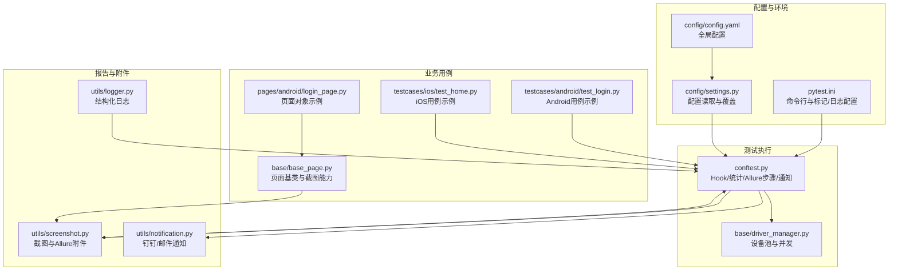
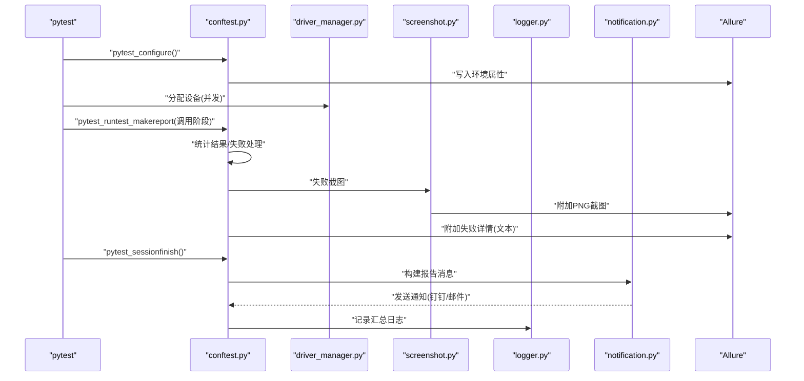
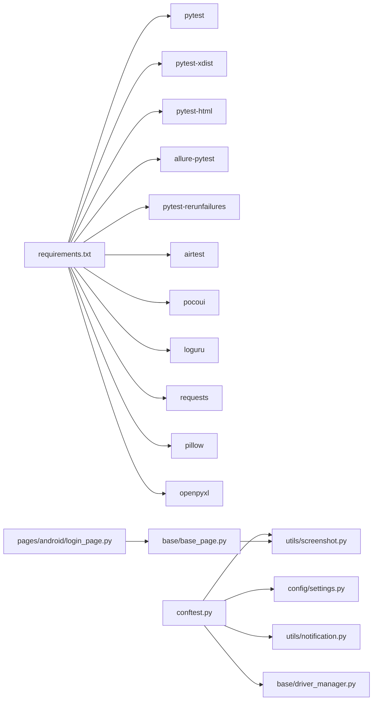

# 报告与监控

<cite>
**本文引用的文件**
- [conftest.py](file://conftest.py)
- [pytest.ini](file://pytest.ini)
- [requirements.txt](file://requirements.txt)
- [config/settings.py](file://config/settings.py)
- [config/config.yaml](file://config/config.yaml)
- [utils/logger.py](file://utils/logger.py)
- [utils/screenshot.py](file://utils/screenshot.py)
- [utils/notification.py](file://utils/notification.py)
- [base/driver_manager.py](file://base/driver_manager.py)
- [utils/data_loader.py](file://utils/data_loader.py)
- [testcases/android/test_login.py](file://testcases/android/test_login.py)
- [testcases/ios/test_home.py](file://testcases/ios/test_home.py)
- [pages/android/login_page.py](file://pages/android/login_page.py)
- [base/base_page.py](file://base/base_page.py)
</cite>

## 目录
1. [简介](#简介)
2. [项目结构](#项目结构)
3. [核心组件](#核心组件)
4. [架构总览](#架构总览)
5. [组件详解](#组件详解)
6. [依赖关系分析](#依赖关系分析)
7. [性能考量](#性能考量)
8. [故障排查指南](#故障排查指南)
9. [结论](#结论)
10. [附录](#附录)

## 简介
本章节面向AirTestUI的报告与监控体系，系统性阐述Allure报告集成、测试结果统计、失败截图与日志收集、通知机制以及报告解读与持续改进方法论，并提供部署与维护建议。目标是帮助团队建立可追溯、可度量、可复盘的质量保障闭环。

## 项目结构
围绕报告与监控的关键文件分布如下：
- 配置层：pytest.ini、config/config.yaml、config/settings.py
- 测试执行与Hook：conftest.py
- 截图与附件：utils/screenshot.py
- 日志：utils/logger.py
- 通知：utils/notification.py
- 设备与并发：base/driver_manager.py
- 数据加载：utils/data_loader.py
- 示例用例与页面对象：testcases/*、pages/*

图表来源
- [pytest.ini:1-47](file://pytest.ini#L1-L47)
- [config/config.yaml:1-70](file://config/config.yaml#L1-L70)
- [config/settings.py:1-112](file://config/settings.py#L1-L112)
- [conftest.py:1-255](file://conftest.py#L1-L255)
- [base/driver_manager.py:1-188](file://base/driver_manager.py#L1-L188)
- [utils/screenshot.py:1-89](file://utils/screenshot.py#L1-L89)
- [utils/logger.py:1-59](file://utils/logger.py#L1-L59)
- [utils/notification.py:1-167](file://utils/notification.py#L1-L167)
- [testcases/android/test_login.py:1-71](file://testcases/android/test_login.py#L1-L71)
- [testcases/ios/test_home.py:1-38](file://testcases/ios/test_home.py#L1-L38)
- [pages/android/login_page.py:1-107](file://pages/android/login_page.py#L1-L107)
- [base/base_page.py:264-305](file://base/base_page.py#L264-L305)

章节来源
- [pytest.ini:1-47](file://pytest.ini#L1-L47)
- [config/config.yaml:1-70](file://config/config.yaml#L1-L70)
- [config/settings.py:1-112](file://config/settings.py#L1-L112)
- [conftest.py:1-255](file://conftest.py#L1-L255)
- [base/driver_manager.py:1-188](file://base/driver_manager.py#L1-L188)
- [utils/screenshot.py:1-89](file://utils/screenshot.py#L1-L89)
- [utils/logger.py:1-59](file://utils/logger.py#L1-L59)
- [utils/notification.py:1-167](file://utils/notification.py#L1-L167)
- [testcases/android/test_login.py:1-71](file://testcases/android/test_login.py#L1-L71)
- [testcases/ios/test_home.py:1-38](file://testcases/ios/test_home.py#L1-L38)
- [pages/android/login_page.py:1-107](file://pages/android/login_page.py#L1-L107)
- [base/base_page.py:264-305](file://base/base_page.py#L264-L305)

## 核心组件
- Allure集成与环境注入：在pytest配置阶段写入环境属性；在用例执行阶段自动记录步骤；失败时附加截图与失败详情。
- 测试统计：全局统计总数、通过、失败、跳过、错误，并在会话结束时汇总。
- 截图与附件：统一截图目录、命名策略；失败时自动截图并附加至Allure；页面对象可主动截图并附加。
- 日志系统：控制台彩色输出+文件轮转，支持DEBUG及以上级别落盘。
- 通知系统：支持钉钉机器人与邮件两种方式，按配置自动选择。
- 设备与并发：设备池管理与多worker并发分配，确保报告中可识别设备信息。
- 数据加载：支持YAML/JSON/Excel，便于参数化用例与报告解读。

章节来源
- [conftest.py:37-138](file://conftest.py#L37-L138)
- [utils/screenshot.py:17-74](file://utils/screenshot.py#L17-L74)
- [utils/logger.py:12-47](file://utils/logger.py#L12-L47)
- [utils/notification.py:22-48](file://utils/notification.py#L22-L48)
- [base/driver_manager.py:51-187](file://base/driver_manager.py#L51-L187)
- [utils/data_loader.py:18-128](file://utils/data_loader.py#L18-L128)

## 架构总览
下图展示从测试执行到报告生成与通知的端到端流程：

图表来源
- [conftest.py:37-117](file://conftest.py#L37-L117)
- [base/driver_manager.py:119-166](file://base/driver_manager.py#L119-L166)
- [utils/screenshot.py:28-74](file://utils/screenshot.py#L28-L74)
- [utils/notification.py:128-166](file://utils/notification.py#L128-L166)
- [utils/logger.py:12-47](file://utils/logger.py#L12-L47)

## 组件详解

### Allure报告集成与配置
- 命令行参数：通过pytest.ini设置Allure输出目录、HTML报告、并发与重试等选项。
- 环境注入：在pytest配置阶段写入环境、平台、框架等信息，便于报告筛选与溯源。
- 步骤记录：每个用例自动包装为Allure步骤，提升可读性。
- 失败附件：失败时自动截图并附加PNG；同时附加失败详情文本，便于快速定位。

章节来源
- [pytest.ini:10-22](file://pytest.ini#L10-L22)
- [conftest.py:37-50](file://conftest.py#L37-L50)
- [conftest.py:230-236](file://conftest.py#L230-L236)
- [conftest.py:119-138](file://conftest.py#L119-L138)

### 测试结果统计与通知
- 全局统计：在“调用阶段”统计总数、通过、失败、跳过；在“setup失败”统计错误数。
- 会话汇总：计算总耗时，构建报告摘要（含通过率），并通过通知模块发送。
- 通知策略：按配置自动选择钉钉或邮件，支持签名与SSL加密。

章节来源
- [conftest.py:23-32](file://conftest.py#L23-L32)
- [conftest.py:62-87](file://conftest.py#L62-L87)
- [conftest.py:89-117](file://conftest.py#L89-L117)
- [utils/notification.py:22-48](file://utils/notification.py#L22-L48)
- [utils/notification.py:128-166](file://utils/notification.py#L128-L166)

### 失败截图与日志收集
- 截图策略：失败时按用例节点ID命名，统一保存至配置目录；可直接附加至Allure。
- 页面截图：页面基类提供截图与附加能力，便于在断言或关键步骤插入。
- 日志级别：控制台INFO级别，文件DEBUG级别，错误单独落地，便于问题回溯。

章节来源
- [conftest.py:119-138](file://conftest.py#L119-L138)
- [utils/screenshot.py:28-74](file://utils/screenshot.py#L28-L74)
- [base/base_page.py:279-285](file://base/base_page.py#L279-L285)
- [utils/logger.py:12-47](file://utils/logger.py#L12-L47)

### 并发与设备管理
- 设备池：根据配置加载Android/iOS设备，支持多worker并发分配。
- 分配策略：首次分配独占，否则循环复用；连接失败时抛出异常，避免静默失败。
- 报告标识：设备名称可在报告中体现，便于定位问题设备。

章节来源
- [base/driver_manager.py:81-101](file://base/driver_manager.py#L81-L101)
- [base/driver_manager.py:119-166](file://base/driver_manager.py#L119-L166)
- [config/config.yaml:47-70](file://config/config.yaml#L47-L70)

### 数据驱动与用例组织
- 数据加载：支持YAML/JSON/Excel，参数化用例便于扩展与复用。
- 用例标记：按平台自动标记，结合自定义标记（冒烟、回归、优先级等）便于分层执行与报告筛选。

章节来源
- [utils/data_loader.py:18-128](file://utils/data_loader.py#L18-L128)
- [pytest.ini:24-32](file://pytest.ini#L24-L32)
- [testcases/android/test_login.py:16-31](file://testcases/android/test_login.py#L16-L31)
- [testcases/ios/test_home.py:13-28](file://testcases/ios/test_home.py#L13-L28)

### 页面对象与断言
- 页面基类：封装常用步骤（输入、点击、断言）、等待、截图与Poco元素解析。
- 登录页面示例：演示图像识别与Poco双引擎降级策略，增强稳定性。

章节来源
- [base/base_page.py:264-305](file://base/base_page.py#L264-L305)
- [pages/android/login_page.py:14-107](file://pages/android/login_page.py#L14-L107)

## 依赖关系分析
- 外部依赖：pytest、pytest-xdist、pytest-html、allure-pytest、pytest-rerunfailures、airtest、pocoui、loguru、requests、pillow、openpyxl等。
- 内部耦合：conftest.py依赖配置、截图、通知、设备管理；页面对象依赖截图与配置；通知依赖配置。

图表来源
- [requirements.txt:1-21](file://requirements.txt#L1-L21)
- [conftest.py:14-19](file://conftest.py#L14-L19)
- [config/settings.py:51-80](file://config/settings.py#L51-L80)
- [utils/screenshot.py:11-14](file://utils/screenshot.py#L11-L14)
- [utils/notification.py:16-17](file://utils/notification.py#L16-L17)
- [base/driver_manager.py:10-15](file://base/driver_manager.py#L10-L15)
- [pages/android/login_page.py:8](file://pages/android/login_page.py#L8)
- [base/base_page.py:279-285](file://base/base_page.py#L279-L285)

章节来源
- [requirements.txt:1-21](file://requirements.txt#L1-L21)
- [conftest.py:14-19](file://conftest.py#L14-L19)
- [config/settings.py:51-80](file://config/settings.py#L51-L80)
- [utils/screenshot.py:11-14](file://utils/screenshot.py#L11-L14)
- [utils/notification.py:16-17](file://utils/notification.py#L16-L17)
- [base/driver_manager.py:10-15](file://base/driver_manager.py#L10-L15)
- [pages/android/login_page.py:8](file://pages/android/login_page.py#L8)
- [base/base_page.py:279-285](file://base/base_page.py#L279-L285)

## 性能考量
- 并发与设备共享：多worker共享设备可能带来竞态风险，建议合理规划并发度与用例粒度。
- 截图成本：频繁截图会增加IO与报告体积，建议仅在失败或关键步骤截图。
- 日志级别：生产环境建议保持INFO级别，避免过多DEBUG日志影响性能。
- 重试策略：适度重试可提升稳定性，但需关注失败原因与重试次数上限。

## 故障排查指南
- Allure报告为空
  - 检查命令行参数是否正确设置Allure输出目录与清理选项。
  - 确认pytest配置阶段已写入环境属性。
- 失败截图未出现
  - 确认失败时已触发截图逻辑；检查截图目录权限与磁盘空间。
  - 核对页面对象截图调用是否正确附加至Allure。
- 通知未送达
  - 检查通知开关与类型配置；核对钉钉Webhook与签名或邮件SMTP配置。
- 设备分配异常
  - 检查设备池配置与可用设备；确认连接URI与序列号/UUID正确。
- 日志缺失
  - 确认日志文件轮转策略与目录权限；必要时临时提高日志级别定位问题。

章节来源
- [pytest.ini:10-22](file://pytest.ini#L10-L22)
- [conftest.py:37-50](file://conftest.py#L37-L50)
- [conftest.py:119-138](file://conftest.py#L119-L138)
- [utils/screenshot.py:28-74](file://utils/screenshot.py#L28-L74)
- [utils/notification.py:22-48](file://utils/notification.py#L22-L48)
- [base/driver_manager.py:119-166](file://base/driver_manager.py#L119-L166)
- [utils/logger.py:12-47](file://utils/logger.py#L12-L47)

## 结论
AirTestUI的报告与监控体系以pytest为核心，结合Allure、截图、日志与通知，形成从执行到可视化的完整闭环。通过设备池与并发管理、参数化数据驱动与用例标记，能够支撑跨平台、多设备的自动化测试质量保障。建议在实践中持续优化截图策略、日志级别与通知范围，以平衡可观测性与性能。

## 附录

### 报告解读与问题分析方法论
- 成功率与趋势：关注通过率变化与失败用例分布，识别回归热点。
- 失败原因分类：结合失败详情与截图，归纳为“元素定位失败”、“网络/超时”、“业务逻辑错误”等类别，沉淀根因库。
- 设备与环境：按设备/环境维度拆分失败率，定位设备差异或环境不稳定因素。
- 关键路径回归：优先保障冒烟/高优先级用例稳定，逐步扩展覆盖。

### 报告系统部署与维护
- 依赖安装：使用requirements.txt安装所需包。
- 配置管理：通过config/config.yaml与环境变量覆盖全局配置；本地覆盖文件可放置于config/local_config.yaml。
- 并发与重试：根据设备资源与稳定性调优并发与重试参数。
- 报告发布：生成Allure与HTML报告后，可结合CI/CD流水线发布静态报告。

章节来源
- [requirements.txt:1-21](file://requirements.txt#L1-L21)
- [config/config.yaml:1-70](file://config/config.yaml#L1-L70)
- [config/settings.py:34-80](file://config/settings.py#L34-L80)
- [pytest.ini:10-22](file://pytest.ini#L10-L22)