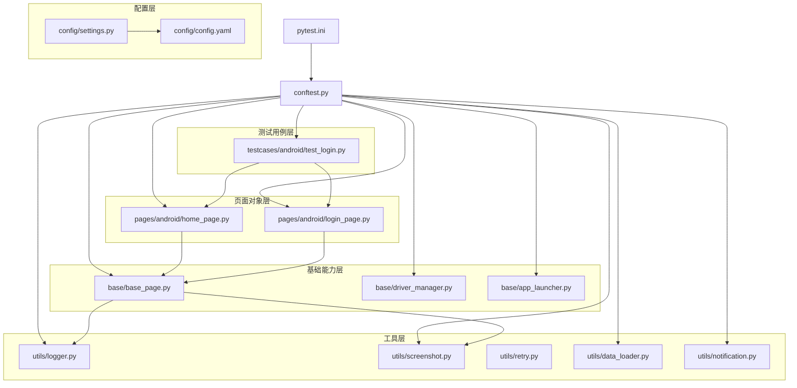
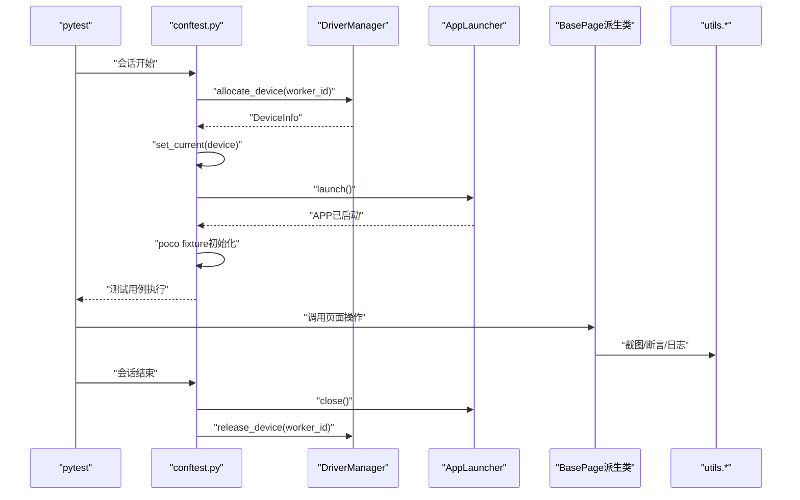
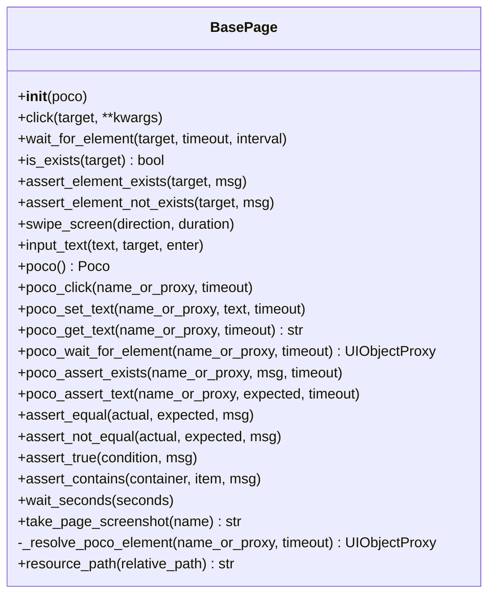
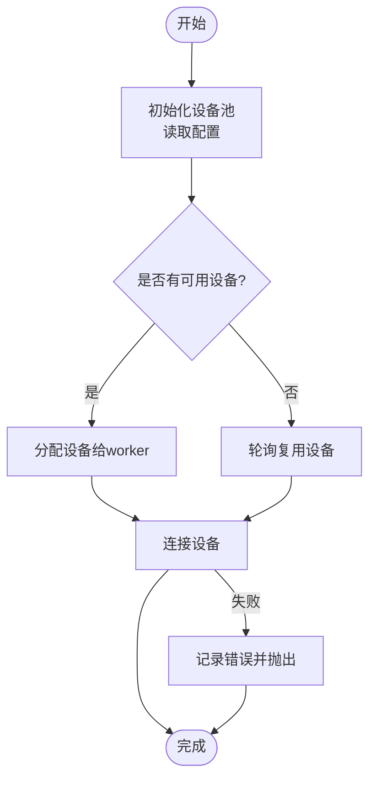
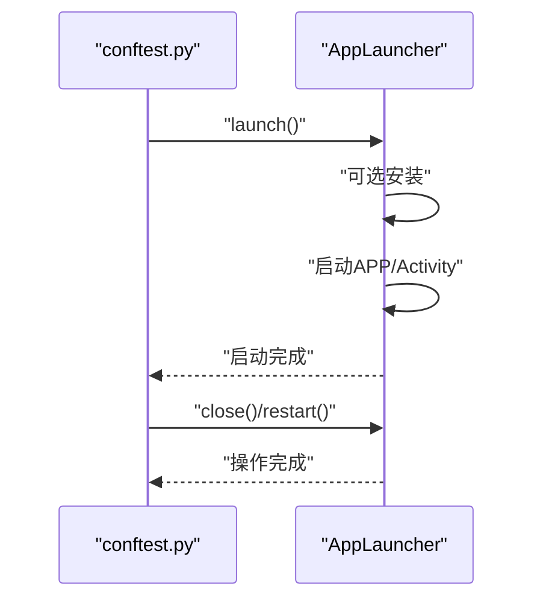
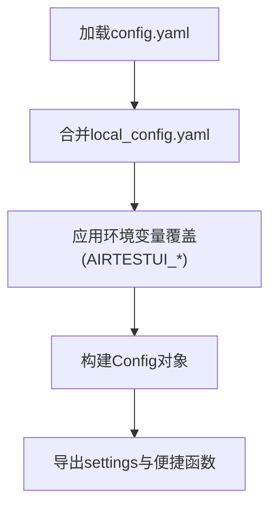
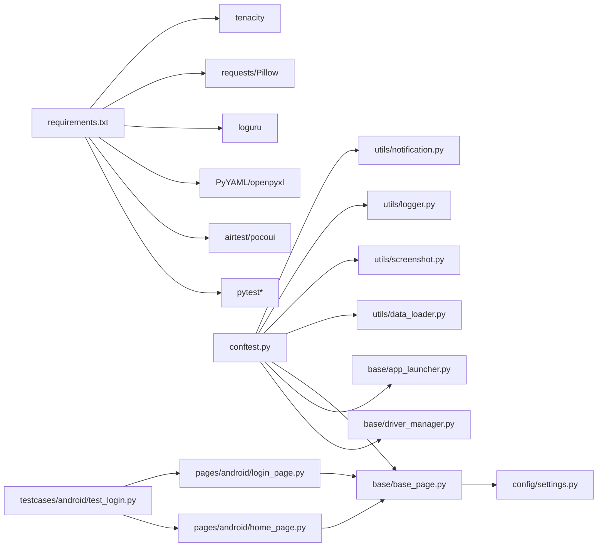

# 最佳实践与常见问题

<cite>
**本文引用的文件**
- [base/base_page.py](file://base/base_page.py)
- [base/driver_manager.py](file://base/driver_manager.py)
- [base/app_launcher.py](file://base/app_launcher.py)
- [config/settings.py](file://config/settings.py)
- [config/config.yaml](file://config/config.yaml)
- [utils/logger.py](file://utils/logger.py)
- [utils/screenshot.py](file://utils/screenshot.py)
- [utils/retry.py](file://utils/retry.py)
- [utils/data_loader.py](file://utils/data_loader.py)
- [utils/notification.py](file://utils/notification.py)
- [conftest.py](file://conftest.py)
- [pytest.ini](file://pytest.ini)
- [pages/android/home_page.py](file://pages/android/home_page.py)
- [pages/android/login_page.py](file://pages/android/login_page.py)
- [testcases/android/test_login.py](file://testcases/android/test_login.py)
- [data/test_data.yaml](file://data/test_data.yaml)
- [requirements.txt](file://requirements.txt)
</cite>

## 目录
1. [简介](#简介)
2. [项目结构](#项目结构)
3. [核心组件](#核心组件)
4. [架构总览](#架构总览)
5. [详细组件分析](#详细组件分析)
6. [依赖分析](#依赖分析)
7. [性能考虑](#性能考虑)
8. [故障排查指南](#故障排查指南)
9. [结论](#结论)
10. [附录](#附录)

## 简介
本文件面向AirTestUI自动化测试框架的使用者与维护者，系统性梳理编码规范与约定、性能优化策略、常见问题与解决方案、迁移与升级指南以及团队协作最佳实践。内容以仓库现有实现为基础，结合测试执行流程、页面对象模型、设备与APP生命周期管理、日志与截图、重试与数据驱动等模块，形成可落地的工程化指南。

## 项目结构
项目采用“分层+特性”混合组织方式：
- base：基础能力层（页面基类、设备驱动、APP启停）
- config：配置与环境变量覆盖
- pages：页面对象层（按平台划分）
- testcases：测试用例层（按平台划分）
- utils：工具模块（日志、截图、重试、数据加载、通知）
- data：测试数据
- 根目录：pytest集成与依赖声明

图表来源
- [pytest.ini:1-47](file://pytest.ini#L1-L47)
- [conftest.py:1-255](file://conftest.py#L1-L255)
- [config/config.yaml:1-70](file://config/config.yaml#L1-L70)
- [config/settings.py:1-112](file://config/settings.py#L1-L112)
- [base/base_page.py:1-320](file://base/base_page.py#L1-L320)
- [base/driver_manager.py:1-188](file://base/driver_manager.py#L1-L188)
- [base/app_launcher.py:1-127](file://base/app_launcher.py#L1-L127)
- [pages/android/home_page.py:1-58](file://pages/android/home_page.py#L1-L58)
- [pages/android/login_page.py:1-107](file://pages/android/login_page.py#L1-L107)
- [testcases/android/test_login.py:1-71](file://testcases/android/test_login.py#L1-L71)
- [utils/logger.py:1-59](file://utils/logger.py#L1-L59)
- [utils/screenshot.py:1-89](file://utils/screenshot.py#L1-L89)
- [utils/retry.py:1-102](file://utils/retry.py#L1-L102)
- [utils/data_loader.py:1-128](file://utils/data_loader.py#L1-L128)
- [utils/notification.py:1-167](file://utils/notification.py#L1-L167)

章节来源
- [pytest.ini:1-47](file://pytest.ini#L1-L47)
- [conftest.py:1-255](file://conftest.py#L1-L255)
- [config/config.yaml:1-70](file://config/config.yaml#L1-L70)
- [config/settings.py:1-112](file://config/settings.py#L1-L112)

## 核心组件
- 页面对象基类：统一封装Airtest/Poco操作，提供图像识别与UI树定位双模式，内置智能等待、断言、截图与Allure步骤。
- 设备驱动管理：单例设备池，按worker分配/复用设备，支持Android/iOS，连接生命周期管理。
- APP启停管理：按平台启动/关闭/重启/清数据，支持可选安装APK/IPA。
- 配置系统：YAML主配置 + 本地覆盖 + 环境变量覆盖，统一超时、设备、APP、截图、重试、报告、通知等配置。
- 工具模块：日志（loguru）、截图（Airtest snapshot + Allure附件）、重试（装饰器）、数据加载（YAML/Excel/JSON）、通知（钉钉/邮件）。
- pytest集成：自动标记平台、设备分配、Poco初始化、APP生命周期、Allure步骤与失败截图、统计与通知。

章节来源
- [base/base_page.py:1-320](file://base/base_page.py#L1-L320)
- [base/driver_manager.py:1-188](file://base/driver_manager.py#L1-L188)
- [base/app_launcher.py:1-127](file://base/app_launcher.py#L1-L127)
- [config/settings.py:1-112](file://config/settings.py#L1-L112)
- [utils/logger.py:1-59](file://utils/logger.py#L1-L59)
- [utils/screenshot.py:1-89](file://utils/screenshot.py#L1-L89)
- [utils/retry.py:1-102](file://utils/retry.py#L1-L102)
- [utils/data_loader.py:1-128](file://utils/data_loader.py#L1-L128)
- [utils/notification.py:1-167](file://utils/notification.py#L1-L167)
- [conftest.py:1-255](file://conftest.py#L1-L255)

## 架构总览
AirTestUI围绕“页面对象 + 设备/APP生命周期 + 配置与工具”的分层架构组织。测试执行通过pytest钩子与fixture完成设备分配、Poco初始化、APP启停、失败截图与Allure步骤记录；页面对象统一抽象UI交互，兼顾图像识别与Poco两种定位策略。

图表来源
- [conftest.py:140-227](file://conftest.py#L140-L227)
- [base/driver_manager.py:119-166](file://base/driver_manager.py#L119-L166)
- [base/app_launcher.py:49-92](file://base/app_launcher.py#L49-L92)
- [base/base_page.py:60-120](file://base/base_page.py#L60-L120)
- [utils/screenshot.py:28-74](file://utils/screenshot.py#L28-L74)

## 详细组件分析

### 页面对象基类（BasePage）
- 设计要点
  - 双模式定位：图像识别Template与Poco UI树定位，自动降级兜底。
  - 统一日志与截图：每个操作均记录日志并可自动截图，失败时附加Allure。
  - 智能等待：统一超时配置，避免硬编码。
  - 断言丰富：元素存在/不存在、文本断言、相等/不相等等。
- 关键流程
  - 点击/等待/输入/滑动等基础操作封装。
  - Poco元素解析与等待出现。
  - 资源路径工具方法。

图表来源
- [base/base_page.py:30-320](file://base/base_page.py#L30-L320)

章节来源
- [base/base_page.py:1-320](file://base/base_page.py#L1-L320)

### 设备驱动管理（DriverManager）
- 设计要点
  - 单例模式，线程安全，设备池按worker分配/复用。
  - 支持Android/iOS，URI生成与连接。
  - 生命周期：分配、连接、释放、清理。
- 关键流程
  - 初始化设备池（读取配置）。
  - 分配设备（优先未占用，否则轮询复用）。
  - 连接设备与异常处理。
  - 释放与清理。

图表来源
- [base/driver_manager.py:81-150](file://base/driver_manager.py#L81-L150)

章节来源
- [base/driver_manager.py:1-188](file://base/driver_manager.py#L1-L188)

### APP启停管理（AppLauncher）
- 设计要点
  - 按平台读取包名/Bundle ID与Activity，支持可选安装。
  - 提供启动、关闭、重启、清数据、运行状态检测。
- 关键流程
  - 启动：可选安装 → 启动APP → 等待启动完成。
  - 关闭/重启/清数据：异常保护与日志记录。

图表来源
- [base/app_launcher.py:49-92](file://base/app_launcher.py#L49-L92)
- [conftest.py:217-227](file://conftest.py#L217-L227)

章节来源
- [base/app_launcher.py:1-127](file://base/app_launcher.py#L1-L127)
- [conftest.py:157-227](file://conftest.py#L157-L227)

### 配置系统（settings + config.yaml）
- 设计要点
  - 主配置config.yaml + 本地覆盖local_config.yaml + 环境变量覆盖。
  - 便捷访问函数：环境、超时、设备、APP配置。
- 关键流程
  - 加载与合并配置 → 构造Config对象 → 暴露全局settings。

图表来源
- [config/settings.py:34-81](file://config/settings.py#L34-L81)
- [config/config.yaml:1-70](file://config/config.yaml#L1-L70)

章节来源
- [config/settings.py:1-112](file://config/settings.py#L1-L112)
- [config/config.yaml:1-70](file://config/config.yaml#L1-L70)

### 工具模块
- 日志（logger.py）：结构化日志，控制台彩色输出与文件轮转。
- 截图（screenshot.py）：统一保存目录、命名、Allure附件与失败自动截图。
- 重试（retry.py）：通用重试装饰器与“直到True”重试。
- 数据加载（data_loader.py）：YAML/Excel/JSON加载与pytest参数化。
- 通知（notification.py）：钉钉机器人与邮件通知，报告汇总消息构建。

章节来源
- [utils/logger.py:1-59](file://utils/logger.py#L1-L59)
- [utils/screenshot.py:1-89](file://utils/screenshot.py#L1-L89)
- [utils/retry.py:1-102](file://utils/retry.py#L1-L102)
- [utils/data_loader.py:1-128](file://utils/data_loader.py#L1-L128)
- [utils/notification.py:1-167](file://utils/notification.py#L1-L167)

### 页面对象示例（AndroidLoginPage/AndroidHomePage）
- LoginPage：演示图像识别与Poco双模式输入、点击、断言。
- HomePage：演示页面验证、导航与搜索流程。

章节来源
- [pages/android/login_page.py:1-107](file://pages/android/login_page.py#L1-L107)
- [pages/android/home_page.py:1-58](file://pages/android/home_page.py#L1-L58)

### 测试用例示例（TestAndroidLogin）
- 使用页面对象与断言，标注平台与严重级别，展示冒烟/回归场景。

章节来源
- [testcases/android/test_login.py:1-71](file://testcases/android/test_login.py#L1-L71)

## 依赖分析
- 运行时依赖集中在requirements.txt，涵盖pytest生态、Airtest/Poco、YAML/Excel、日志、网络与重试等。
- 代码层面依赖清晰：conftest.py作为入口协调各模块；BasePage依赖配置与工具；页面对象依赖BasePage；测试用例依赖页面对象与数据加载。

图表来源
- [requirements.txt:1-21](file://requirements.txt#L1-L21)
- [conftest.py:14-20](file://conftest.py#L14-L20)
- [base/base_page.py:23-25](file://base/base_page.py#L23-L25)
- [pages/android/home_page.py:8](file://pages/android/home_page.py#L8)
- [pages/android/login_page.py:8](file://pages/android/login_page.py#L8)
- [testcases/android/test_login.py:8-9](file://testcases/android/test_login.py#L8-L9)

章节来源
- [requirements.txt:1-21](file://requirements.txt#L1-L21)
- [conftest.py:1-255](file://conftest.py#L1-L255)

## 性能考虑
- 测试执行效率
  - 并发执行：pytest.ini启用n-auto与loadfile分发，减少排队等待。
  - 重试策略：合理设置重试次数与间隔，避免过度重试导致总时长增长。
  - 等待策略：统一超时配置，避免过长等待；对稳定元素使用Poco快速定位。
- 资源使用优化
  - 截图控制：按需开启失败截图与步骤截图，避免过多IO；统一保存目录与轮转策略。
  - 日志级别：生产环境建议INFO级别，避免过多DEBUG日志。
  - 设备复用：DriverManager轮询复用设备，提高利用率。
- 网络请求优化
  - 通知与外部服务：钉钉/邮件发送设置合理超时与异常处理，避免阻塞测试会话。
  - 数据加载：Excel读取使用只读与缓存策略，减少重复解析。

章节来源
- [pytest.ini:10-22](file://pytest.ini#L10-L22)
- [utils/retry.py:13-64](file://utils/retry.py#L13-L64)
- [config/config.yaml:14-24](file://config/config.yaml#L14-L24)
- [utils/logger.py:16-47](file://utils/logger.py#L16-L47)
- [base/driver_manager.py:141-148](file://base/driver_manager.py#L141-L148)
- [utils/notification.py:85-93](file://utils/notification.py#L85-L93)

## 故障排查指南
- 设备连接问题
  - 症状：设备分配失败或连接异常。
  - 排查：确认config.yaml设备配置正确；检查DriverManager日志；必要时清理设备连接。
- 定位失败
  - 症状：元素不存在或等待超时。
  - 排查：切换Poco与图像识别双模式；检查资源路径与模板匹配；增大超时或加重试。
- 测试不稳定
  - 症状：偶发失败。
  - 排查：启用重试装饰器；增加失败截图；检查网络与通知阻塞；优化等待策略。
- APP启动/关闭异常
  - 症状：启动超时或无法关闭。
  - 排查：核对包名/BID与Activity；检查安装路径；查看AppLauncher日志。
- 截图与报告
  - 症状：截图缺失或报告不完整。
  - 排查：确认截图目录权限与配置；检查Allure输出目录；确保失败钩子触发。

章节来源
- [base/driver_manager.py:119-150](file://base/driver_manager.py#L119-L150)
- [base/base_page.py:76-120](file://base/base_page.py#L76-L120)
- [base/app_launcher.py:49-92](file://base/app_launcher.py#L49-L92)
- [utils/screenshot.py:28-74](file://utils/screenshot.py#L28-L74)
- [conftest.py:62-138](file://conftest.py#L62-L138)

## 结论
AirTestUI通过清晰的分层设计与完善的工具链，提供了可扩展、可维护的移动端自动化测试方案。遵循本文的编码规范、性能优化建议与故障排查流程，可显著提升测试稳定性与执行效率，并为团队协作与知识沉淀提供支撑。

## 附录

### 编码规范与约定
- 命名规范
  - 页面对象类：Android/IOS平台前缀 + Page后缀，如AndroidLoginPage。
  - 方法命名：动词短语，描述明确操作；断言方法以assert开头。
  - 资源路径：使用BasePage.resource_path拼接，避免硬编码路径。
- 代码组织
  - 页面对象继承BasePage，统一封装UI交互。
  - 测试用例按平台与功能划分目录，使用pytest标记区分平台与严重级别。
  - 工具模块职责单一，避免跨模块耦合。
- 注释标准
  - 类与方法提供简要说明与参数/返回值说明。
  - 关键流程与异常分支添加注释，便于维护。

章节来源
- [pages/android/login_page.py:14-21](file://pages/android/login_page.py#L14-L21)
- [pages/android/home_page.py:14-19](file://pages/android/home_page.py#L14-L19)
- [base/base_page.py:30-47](file://base/base_page.py#L30-L47)
- [pytest.ini:24-32](file://pytest.ini#L24-L32)

### 迁移与升级指南
- 配置迁移
  - 从旧版config.yaml迁移时，对照新增字段（如screenshot.on_step、retry.*、notification.*）补齐。
  - 使用环境变量覆盖（AIRTESTUI_前缀）进行临时覆盖，避免频繁修改配置文件。
- 依赖升级
  - 升级pytest与插件时，关注pytest.ini标记与钩子兼容性。
  - 升级Airtest/Poco时，注意Poco初始化差异与API变更。
- 页面对象迁移
  - 统一使用BasePage提供的方法，逐步替换自定义封装。
  - 逐步引入Poco定位，降低对图像识别的依赖。

章节来源
- [config/config.yaml:14-43](file://config/config.yaml#L14-L43)
- [config/settings.py:20-31](file://config/settings.py#L20-L31)
- [requirements.txt:2-10](file://requirements.txt#L2-L10)
- [base/base_page.py:186-306](file://base/base_page.py#L186-L306)

### 团队协作最佳实践
- 测试用例管理
  - 使用pytest标记（android/ios/smoke/regression/p0/p1/p2）分类与筛选。
  - 用例命名清晰，步骤明确，配合Allure步骤与失败截图。
- 代码审查
  - 关注页面对象复用与Poco/图像识别策略选择。
  - 关注异常处理与日志记录，确保可追溯性。
- 知识分享
  - 统一配置与资源管理规范，定期回顾与更新。
  - 建立常见问题与解决方案的知识库，沉淀排障经验。

章节来源
- [pytest.ini:24-32](file://pytest.ini#L24-L32)
- [conftest.py:37-138](file://conftest.py#L37-L138)
- [utils/logger.py:50-59](file://utils/logger.py#L50-L59)