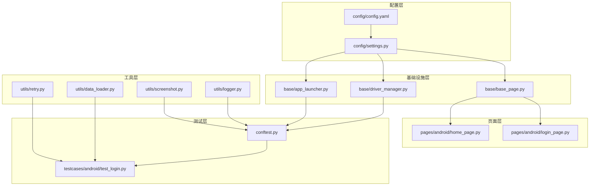
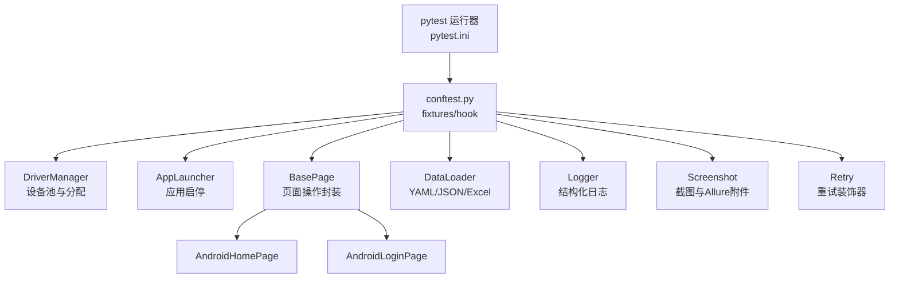
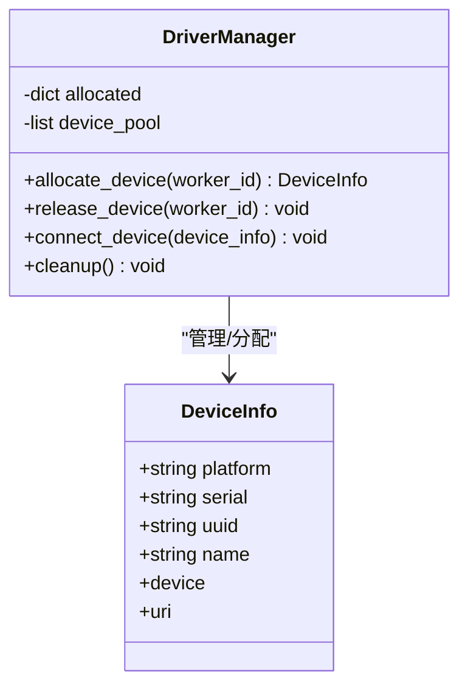
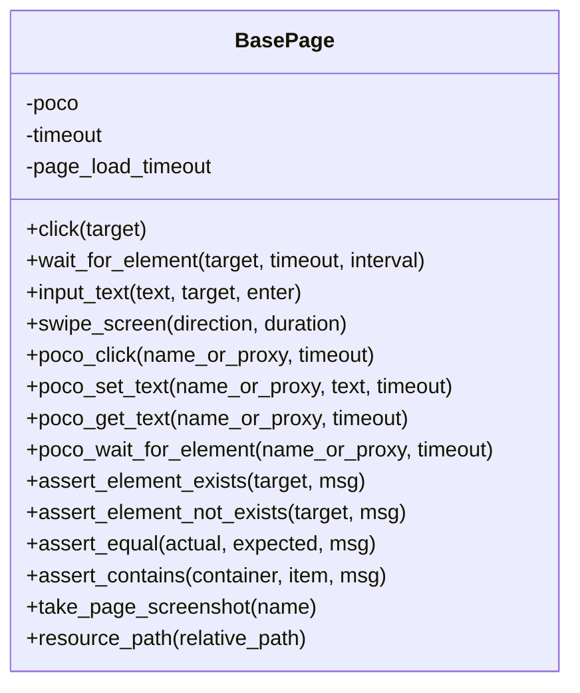
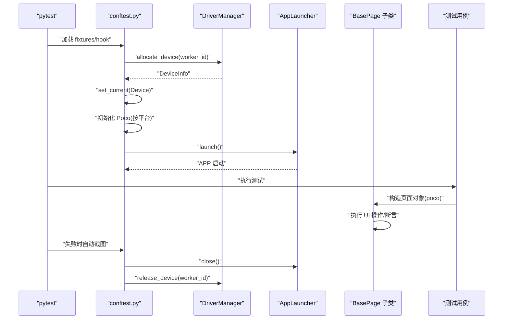
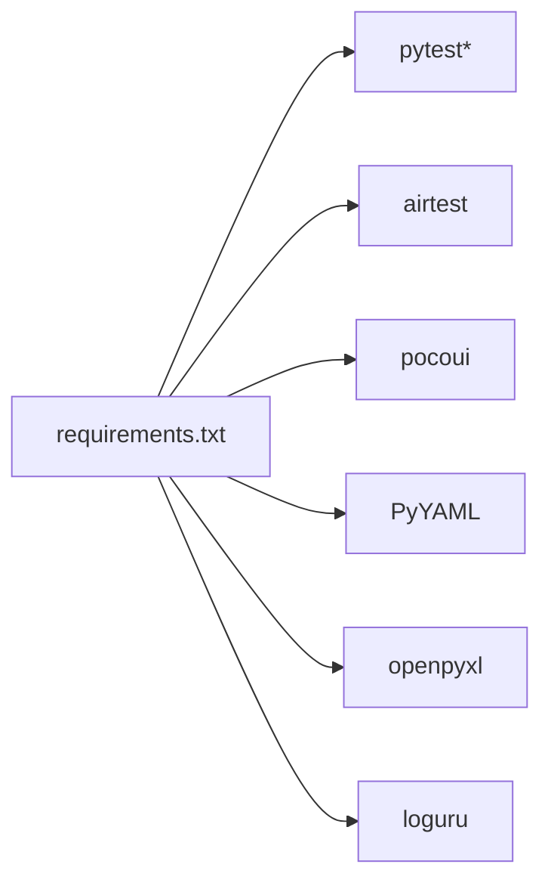

# 架构设计

<cite>
**本文引用的文件**
- [conftest.py](file://conftest.py)
- [config.yaml](file://config/config.yaml)
- [settings.py](file://config/settings.py)
- [driver_manager.py](file://base/driver_manager.py)
- [app_launcher.py](file://base/app_launcher.py)
- [base_page.py](file://base/base_page.py)
- [home_page.py](file://pages/android/home_page.py)
- [login_page.py](file://pages/android/login_page.py)
- [data_loader.py](file://utils/data_loader.py)
- [logger.py](file://utils/logger.py)
- [screenshot.py](file://utils/screenshot.py)
- [retry.py](file://utils/retry.py)
- [test_login.py](file://testcases/android/test_login.py)
- [pytest.ini](file://pytest.ini)
- [requirements.txt](file://requirements.txt)
</cite>

## 目录
1. [引言](#引言)
2. [项目结构](#项目结构)
3. [核心组件](#核心组件)
4. [架构总览](#架构总览)
5. [详细组件分析](#详细组件分析)
6. [依赖分析](#依赖分析)
7. [性能考虑](#性能考虑)
8. [故障排查指南](#故障排查指南)
9. [结论](#结论)
10. [附录](#附录)

## 引言
本文件面向架构师与高级开发者，系统性阐述 AirTestUI 框架的架构设计与实现细节。框架采用分层架构与模块化组织，围绕 pytest 生态构建，结合 AirTest/Poco 实现跨平台移动端自动化测试。核心特性包括：
- 分层架构：配置层、基础设施层、业务页面层、测试用例层清晰分离
- 模块化组织：按功能域拆分模块，职责单一、耦合度低
- 设备与会话管理：通过 DriverManager 与 pytest fixtures 实现多设备并发与生命周期管理
- 页面对象模式：BasePage 封装 AirTest/Poco 操作，统一断言与日志
- 数据驱动：支持 YAML/JSON/Excel，配合 pytest.mark.parametrize 实现参数化测试
- 可靠性增强：重试装饰器、失败截图、Allure 报告与通知集成

## 项目结构
项目采用“按功能域分层 + 按平台分包”的组织方式：
- config：全局配置与环境变量覆盖
- base：核心基础设施（设备管理、应用启停、页面基类）
- pages：页面对象（按平台分包）
- testcases：测试用例（按平台分包）
- utils：工具模块（日志、截图、重试、数据加载、通知等）
- resources：图像识别模板资源
- data：测试数据文件
- 根目录：pytest 配置、依赖声明

图表来源
- [config.yaml:1-70](file://config/config.yaml#L1-L70)
- [settings.py:1-112](file://config/settings.py#L1-L112)
- [driver_manager.py:1-188](file://base/driver_manager.py#L1-L188)
- [app_launcher.py:1-127](file://base/app_launcher.py#L1-L127)
- [base_page.py:1-320](file://base/base_page.py#L1-L320)
- [home_page.py:1-58](file://pages/android/home_page.py#L1-L58)
- [login_page.py:1-107](file://pages/android/login_page.py#L1-L107)
- [data_loader.py:1-128](file://utils/data_loader.py#L1-L128)
- [logger.py:1-59](file://utils/logger.py#L1-L59)
- [screenshot.py:1-89](file://utils/screenshot.py#L1-L89)
- [retry.py:1-102](file://utils/retry.py#L1-L102)
- [conftest.py:1-255](file://conftest.py#L1-L255)
- [test_login.py:1-71](file://testcases/android/test_login.py#L1-L71)

章节来源
- [pytest.ini:1-47](file://pytest.ini#L1-L47)
- [requirements.txt:1-21](file://requirements.txt#L1-L21)

## 核心组件
- 配置与环境管理：settings.py 将 config.yaml 转为可访问的配置对象，并支持环境变量覆盖与本地覆盖配置合并
- 设备管理器：DriverManager 单例负责设备池初始化、分配与释放，支持多 worker 并发
- 应用启停器：AppLauncher 负责按平台启动/关闭/重启/安装/清数据
- 页面对象基类：BasePage 封装 AirTest/Poco 操作，提供统一断言、等待、截图与 Allure 步骤
- pytest fixtures：集中管理设备、Poco、应用启停、测试数据等测试前置与后置逻辑
- 工具模块：日志、截图、重试、数据加载、通知等支撑能力

章节来源
- [settings.py:51-112](file://config/settings.py#L51-L112)
- [driver_manager.py:51-188](file://base/driver_manager.py#L51-L188)
- [app_launcher.py:20-127](file://base/app_launcher.py#L20-L127)
- [base_page.py:30-320](file://base/base_page.py#L30-L320)
- [conftest.py:140-255](file://conftest.py#L140-L255)
- [data_loader.py:18-128](file://utils/data_loader.py#L18-L128)
- [logger.py:50-59](file://utils/logger.py#L50-L59)
- [screenshot.py:28-89](file://utils/screenshot.py#L28-L89)
- [retry.py:13-102](file://utils/retry.py#L13-L102)

## 架构总览
AirTestUI 以 pytest 为核心编排器，通过 fixtures 注入设备、Poco、应用启停与测试数据；页面对象基于 BasePage 统一 UI 操作；配置层提供环境与超时等全局参数；工具层提供日志、截图、重试与数据加载。

图表来源
- [pytest.ini:1-47](file://pytest.ini#L1-L47)
- [conftest.py:1-255](file://conftest.py#L1-L255)
- [driver_manager.py:51-188](file://base/driver_manager.py#L51-L188)
- [app_launcher.py:20-127](file://base/app_launcher.py#L20-L127)
- [base_page.py:30-320](file://base/base_page.py#L30-L320)
- [home_page.py:14-58](file://pages/android/home_page.py#L14-L58)
- [login_page.py:14-107](file://pages/android/login_page.py#L14-L107)
- [data_loader.py:18-128](file://utils/data_loader.py#L18-L128)
- [logger.py:50-59](file://utils/logger.py#L50-L59)
- [screenshot.py:28-89](file://utils/screenshot.py#L28-L89)
- [retry.py:13-102](file://utils/retry.py#L13-L102)

## 详细组件分析

### 配置与环境管理（settings.py）
- 功能要点
  - 加载 config.yaml 并转换为嵌套配置对象
  - 支持本地覆盖文件 local_config.yaml 与环境变量覆盖（前缀 AIRTESTUI_）
  - 提供便捷访问函数：获取环境、超时、设备列表、APP 配置
- 设计模式
  - 配置对象封装：通过动态属性访问实现字典/属性双形态
  - 环境变量覆盖：遵循约定优于配置原则，便于 CI/CD 与多环境部署
- 复杂度
  - 配置加载与合并：O(N)（N 为配置项数）
  - 递归封装：对嵌套字典进行深度封装，便于调用

章节来源
- [settings.py:14-112](file://config/settings.py#L14-L112)
- [config.yaml:5-70](file://config/config.yaml#L5-L70)

### 设备管理器（DriverManager）
- 功能要点
  - 单例模式：确保全局唯一设备池
  - 设备池初始化：读取 Android/iOS 设备配置，生成 DeviceInfo 列表
  - 分配策略：按 worker_id 顺序分配，若设备不足则复用连接
  - 生命周期：分配/释放设备，连接/断开由 AirTest 接口处理
- 设计模式
  - 单例模式：线程安全的双重检查锁
  - 工厂模式：根据平台与序列号/UUID 生成连接 URI
- 并发与可靠性
  - 分配过程加锁，避免竞态
  - 设备复用策略降低资源占用

图表来源
- [driver_manager.py:20-188](file://base/driver_manager.py#L20-L188)

章节来源
- [driver_manager.py:51-188](file://base/driver_manager.py#L51-L188)

### 应用启停器（AppLauncher）
- 功能要点
  - 平台适配：Android/iOS 启动 Activity、安装包、清数据
  - 生命周期：launch/close/restart/clear_data/is_app_running
  - 超时控制：读取配置中的 app_launch 超时
- 设计模式
  - 策略模式：不同平台采用不同启动/检测策略
- 复杂度
  - 启动/关闭：O(1)，依赖 AirTest 接口
  - 清数据：仅 Android 平台可用

章节来源
- [app_launcher.py:20-127](file://base/app_launcher.py#L20-L127)
- [config.yaml:8-12](file://config/config.yaml#L8-L12)

### 页面对象基类（BasePage）
- 功能要点
  - 图像识别操作：click/wait_for_element/input_text/swipe_screen/assert_* 等
  - Poco UI 树操作：poco_click/poco_set_text/poco_get_text/poco_wait_for_element/assert_exists/assert_text
  - 断言与等待：统一超时、Allure 步骤、失败截图
  - 资源路径：resource_path 统一资源定位
- 设计模式
  - Page Object 模式：将页面元素与操作封装为对象
  - 策略模式：图像识别与 Poco 双模式切换
- 复杂度
  - 操作封装：O(1)，内部调用 AirTest/Poco 接口
  - 超时与等待：受配置影响，最长等待 O(T)

图表来源
- [base_page.py:30-320](file://base/base_page.py#L30-L320)

章节来源
- [base_page.py:30-320](file://base/base_page.py#L30-L320)

### pytest fixtures 机制与控制流
- 关键 fixtures
  - worker_id/device_info/airtest_device/platform：设备与平台注入
  - poco：按平台选择 Poco 引擎（AndroidUiautomationPoco 或 IOSPoco）
  - app_launcher/setup_app：会话前后自动启动/关闭 APP
  - step_allure：每个用例自动记录 Allure 步骤
  - test_data：测试数据加载器，支持 YAML/JSON/Excel 与参数化
- 控制流
  - 会话开始：分配设备 → 初始化 Poco → 启动 APP
  - 用例执行：注入页面对象 → 执行测试 → 失败自动截图
  - 会话结束：关闭 APP → 释放设备
- 并发支持
  - 基于 pytest-xdist 的多 worker 并发，worker_id 作为设备分配索引

图表来源
- [conftest.py:140-255](file://conftest.py#L140-L255)
- [driver_manager.py:119-167](file://base/driver_manager.py#L119-L167)
- [app_launcher.py:49-93](file://base/app_launcher.py#L49-L93)
- [base_page.py:30-320](file://base/base_page.py#L30-L320)
- [test_login.py:23-40](file://testcases/android/test_login.py#L23-L40)

章节来源
- [conftest.py:140-255](file://conftest.py#L140-L255)
- [pytest.ini:11-22](file://pytest.ini#L11-L22)

### 页面对象示例（AndroidLoginPage/AndroidHomePage）
- AndroidLoginPage
  - 封装登录页面元素与流程：输入用户名/密码、点击登录、断言页面状态
  - 支持图像识别与 Poco 双模式定位
- AndroidHomePage
  - 封装首页元素与导航：tab 切换、搜索、标题获取
  - 提供页面状态校验与导航动作

章节来源
- [login_page.py:14-107](file://pages/android/login_page.py#L14-L107)
- [home_page.py:14-58](file://pages/android/home_page.py#L14-L58)

### 数据驱动与参数化（data_loader.py）
- 支持格式：YAML/JSON/Excel
- 能力：加载文件、提取键值、格式化为 pytest.mark.parametrize 参数列表
- 用法：在 fixtures 中通过 test_data("xxx.yaml", key) 返回参数化数据

章节来源
- [data_loader.py:18-128](file://utils/data_loader.py#L18-L128)
- [conftest.py:238-255](file://conftest.py#L238-L255)

### 日志、截图与重试（logger/screenshot/retry）
- 日志：基于 loguru，控制台与文件双通道输出，结构化日志
- 截图：统一保存目录、命名规范、Allure 附件
- 重试：通用重试装饰器与 until-true 重试装饰器，支持异常类型过滤与回调

章节来源
- [logger.py:12-59](file://utils/logger.py#L12-L59)
- [screenshot.py:17-89](file://utils/screenshot.py#L17-L89)
- [retry.py:13-102](file://utils/retry.py#L13-L102)

## 依赖分析
- 外部依赖
  - pytest 生态：pytest、pytest-xdist、pytest-html、allure-pytest、pytest-rerunfailures
  - AirTest/Poco：airtest、pocoui
  - 数据与配置：PyYAML、openpyxl
  - 工具：requests、Pillow、loguru、tenacity
- 内部依赖
  - config.settings 为 base/utils 模块提供配置入口
  - conftest.py 依赖 base 与 utils 完成设备、Poco、应用启停与数据注入
  - pages 依赖 base 与 utils 实现页面操作与日志/截图

图表来源
- [requirements.txt:1-21](file://requirements.txt#L1-L21)

章节来源
- [requirements.txt:1-21](file://requirements.txt#L1-L21)

## 性能考虑
- 设备分配与复用
  - 优先按 worker 顺序分配，避免频繁连接/断开
  - 设备不足时复用连接，注意状态隔离与清理
- 超时与等待
  - 元素等待与页面加载超时通过配置统一管理，避免硬编码
  - Poco 等待与 AirTest 等待结合，提升稳定性
- 截图与日志
  - 失败自动截图与 Allure 附件增加磁盘 IO，建议按需开启
  - 日志分级输出，生产环境建议降低文件日志级别
- 并发与资源
  - 多 worker 并发执行时，合理规划设备数量，避免竞争
  - 重试策略避免过度重试导致资源浪费

## 故障排查指南
- 设备连接失败
  - 检查 config.yaml 中设备序列号/UUID 与名称配置
  - 查看 DriverManager 日志与 AirTest 设备连接状态
- Poco 初始化失败
  - 自动降级为图像识别模式，确认平台选择正确
  - 检查设备当前分辨率与 Poco 引擎兼容性
- APP 启动/关闭异常
  - 核对包名/Bundle ID 与 Activity 配置
  - 检查 app_launch 超时设置与设备性能
- 截图与报告
  - 确认截图目录权限与 Allure 输出目录配置
  - 失败用例自动截图，查看 allure-results 与报告 HTML
- 重试与稳定性
  - 合理设置重试次数与间隔，避免掩盖真实问题
  - 使用 until-true 装饰器等待页面状态稳定

章节来源
- [driver_manager.py:103-150](file://base/driver_manager.py#L103-L150)
- [app_launcher.py:49-93](file://base/app_launcher.py#L49-L93)
- [screenshot.py:28-89](file://utils/screenshot.py#L28-L89)
- [retry.py:13-102](file://utils/retry.py#L13-L102)
- [conftest.py:62-138](file://conftest.py#L62-L138)

## 结论
AirTestUI 框架通过清晰的分层与模块化设计，将设备管理、应用启停、页面操作与测试编排解耦，形成高内聚、低耦合的体系。pytest fixtures 与 AirTest/Poco 的结合提供了强大的跨平台自动化能力；配置与工具模块保障了可维护性与可观测性。该架构适合中大型移动端自动化测试团队在多平台、多设备场景下规模化落地。

## 附录
- 系统边界
  - 外部系统：AirTest/Poco、设备端 APP、CI/CD 平台
  - 内部模块：config、base、pages、testcases、utils
- 关键流程
  - 配置加载 → 设备分配 → Poco 初始化 → APP 启动 → 用例执行 → 截图/报告 → APP 关闭 → 设备释放