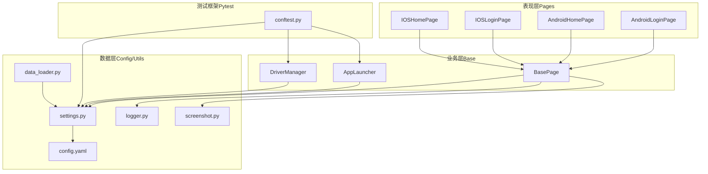
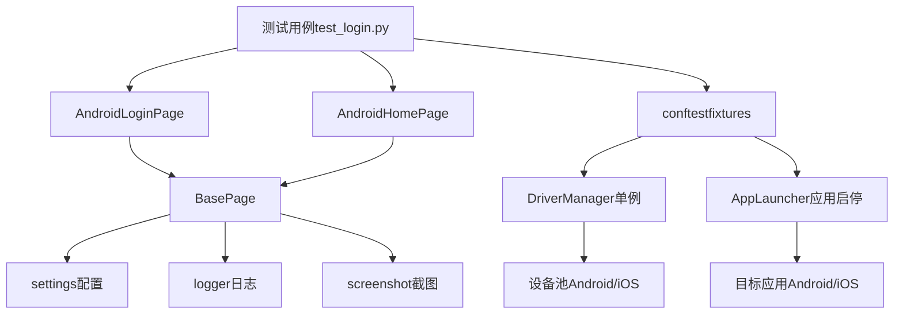
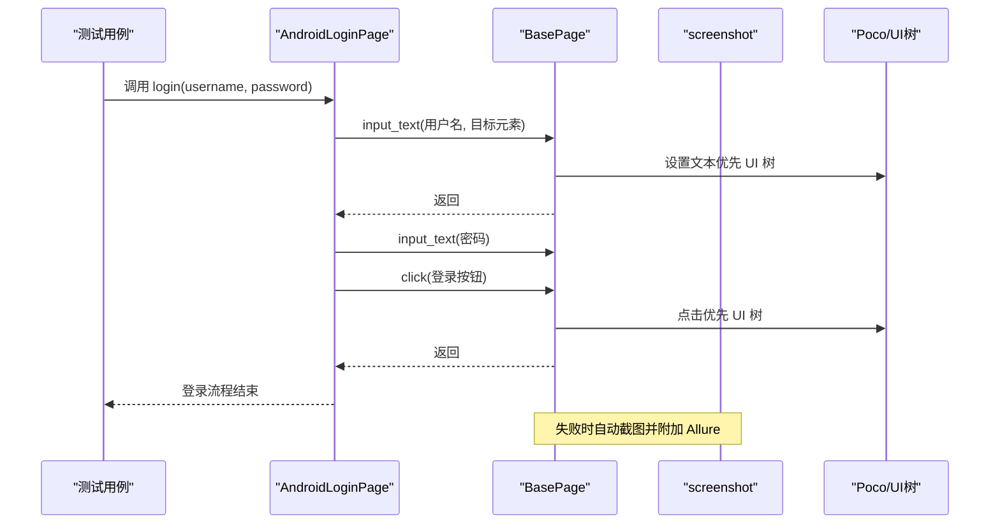
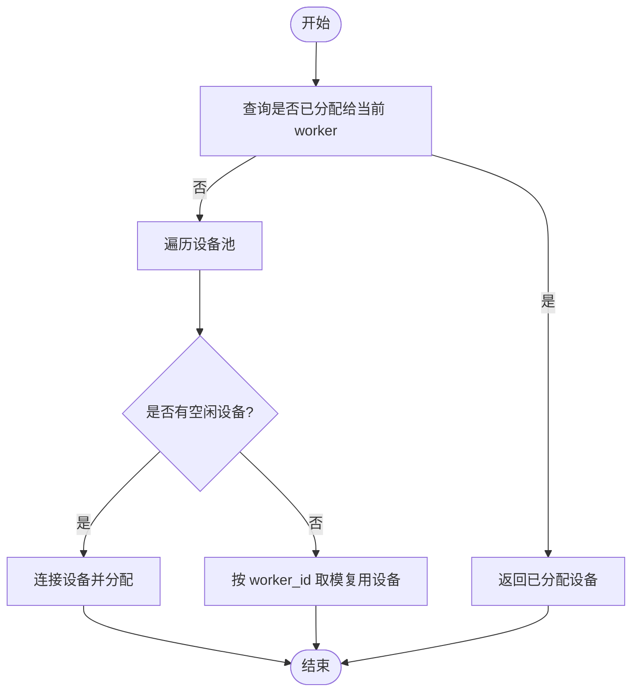
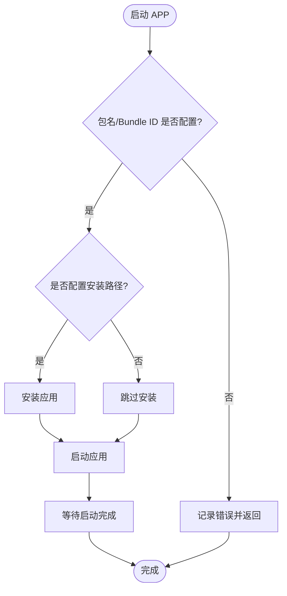
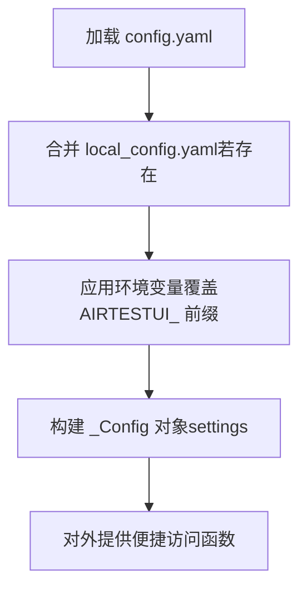
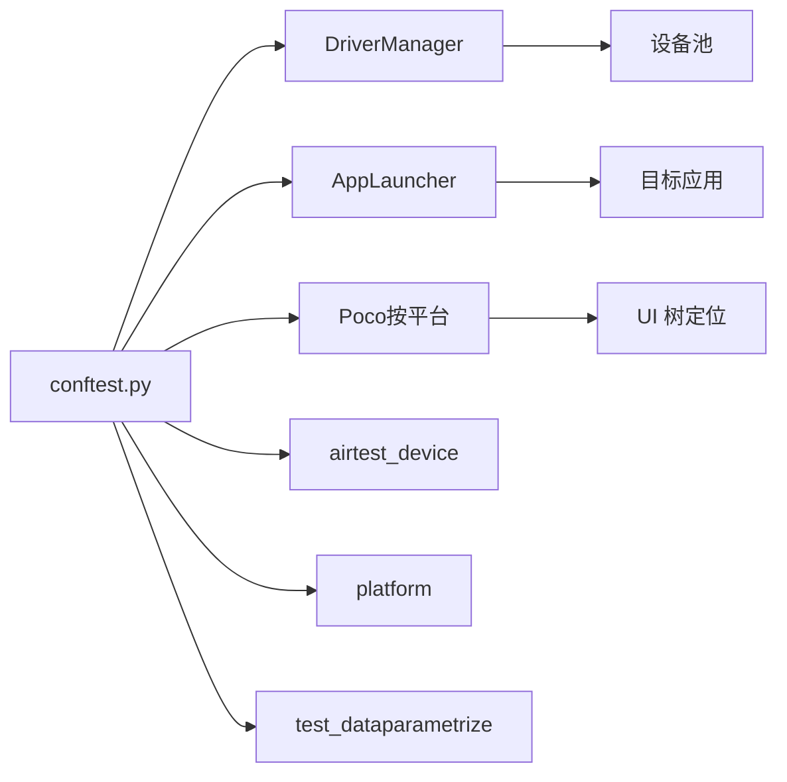
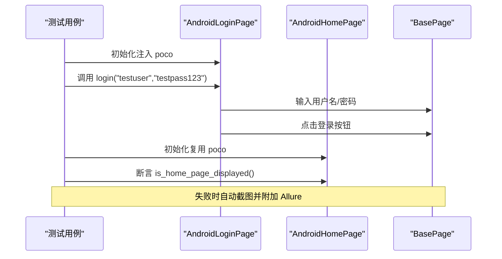
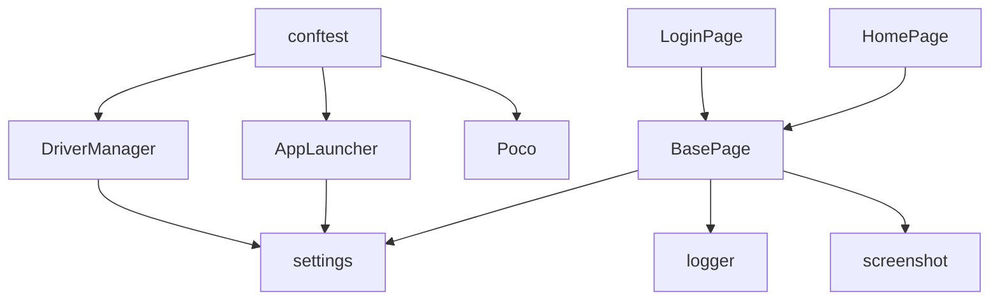

# 核心架构模式

<cite>
**本文引用的文件**
- [base/base_page.py](file://base/base_page.py)
- [base/driver_manager.py](file://base/driver_manager.py)
- [base/app_launcher.py](file://base/app_launcher.py)
- [config/settings.py](file://config/settings.py)
- [config/config.yaml](file://config/config.yaml)
- [pages/android/home_page.py](file://pages/android/home_page.py)
- [pages/android/login_page.py](file://pages/android/login_page.py)
- [pages/ios/home_page.py](file://pages/ios/home_page.py)
- [pages/ios/login_page.py](file://pages/ios/login_page.py)
- [utils/logger.py](file://utils/logger.py)
- [utils/screenshot.py](file://utils/screenshot.py)
- [utils/data_loader.py](file://utils/data_loader.py)
- [conftest.py](file://conftest.py)
- [testcases/android/test_login.py](file://testcases/android/test_login.py)
</cite>

## 目录
1. [引言](#引言)
2. [项目结构](#项目结构)
3. [核心组件](#核心组件)
4. [架构总览](#架构总览)
5. [详细组件分析](#详细组件分析)
6. [依赖分析](#依赖分析)
7. [性能考虑](#性能考虑)
8. [故障排查指南](#故障排查指南)
9. [结论](#结论)
10. [附录](#附录)

## 引言
本文件系统性梳理 AirTestUI 框架的核心架构模式，围绕分层架构设计原则，明确表现层、业务层、数据层的职责边界；深入阐释设计模式的应用，包括 Page Object 模式对页面交互逻辑的封装、工厂模式在设备管理与应用启动中的体现、以及单例模式在配置管理与设备池中的实现；同时说明组件间的解耦机制与依赖注入模式，并给出架构决策的技术考量与权衡分析，帮助架构师形成可落地的设计洞察。

## 项目结构
AirTestUI 采用“按平台+按层次”的混合组织方式：
- base：基础能力层，封装 AirTest/Poco 能力与设备/应用生命周期管理
- config：配置层，集中管理全局配置与环境变量覆盖
- pages：业务层，按平台划分页面对象，复用基础能力
- utils：工具层，日志、截图、数据加载等横切能力
- testcases：测试用例层，按平台组织用例，依赖 fixtures 注入上下文
- resources：资源层，存放各平台图片资源

图表来源
- [pages/android/login_page.py:14-107](file://pages/android/login_page.py#L14-L107)
- [pages/android/home_page.py:14-58](file://pages/android/home_page.py#L14-L58)
- [pages/ios/login_page.py:13-65](file://pages/ios/login_page.py#L13-L65)
- [pages/ios/home_page.py:12-43](file://pages/ios/home_page.py#L12-L43)
- [base/base_page.py:30-320](file://base/base_page.py#L30-L320)
- [base/app_launcher.py:20-127](file://base/app_launcher.py#L20-L127)
- [base/driver_manager.py:51-188](file://base/driver_manager.py#L51-L188)
- [config/settings.py:51-112](file://config/settings.py#L51-L112)
- [config/config.yaml:1-70](file://config/config.yaml#L1-L70)
- [utils/logger.py:50-59](file://utils/logger.py#L50-L59)
- [utils/screenshot.py:28-89](file://utils/screenshot.py#L28-L89)
- [utils/data_loader.py:18-128](file://utils/data_loader.py#L18-L128)
- [conftest.py:140-255](file://conftest.py#L140-L255)

章节来源
- [config/config.yaml:1-70](file://config/config.yaml#L1-L70)
- [config/settings.py:51-112](file://config/settings.py#L51-L112)
- [conftest.py:140-255](file://conftest.py#L140-L255)

## 核心组件
- 表现层（页面对象）：以 Android/iOS 为维度，封装页面交互与断言，统一调用基础能力层提供的交互接口
- 业务层（基础能力）：BasePage 提供统一的 UI 操作与断言；AppLauncher 负责应用启停；DriverManager 管理设备池与分配
- 数据层（配置与资源）：settings 读取 YAML 并支持环境变量覆盖；resources 存放图片资源
- 工具层（横切能力）：logger 结构化日志；screenshot 统一截图与 Allure 附件；data_loader 支持多格式数据加载
- 测试框架（依赖注入）：conftest.py 通过 fixtures 注入设备、Poco、AppLauncher 等上下文

章节来源
- [base/base_page.py:30-320](file://base/base_page.py#L30-L320)
- [base/app_launcher.py:20-127](file://base/app_launcher.py#L20-L127)
- [base/driver_manager.py:51-188](file://base/driver_manager.py#L51-L188)
- [config/settings.py:51-112](file://config/settings.py#L51-L112)
- [utils/logger.py:50-59](file://utils/logger.py#L50-L59)
- [utils/screenshot.py:28-89](file://utils/screenshot.py#L28-L89)
- [utils/data_loader.py:18-128](file://utils/data_loader.py#L18-L128)
- [conftest.py:140-255](file://conftest.py#L140-L255)

## 架构总览
AirTestUI 采用“分层 + 模块化 + 依赖注入”的架构风格：
- 分层清晰：表现层只关心页面交互，业务层抽象设备与应用生命周期，配置与工具层提供横切能力
- 模块化：页面对象按平台拆分，基础能力独立封装，便于扩展与维护
- 依赖注入：通过 pytest fixtures 将设备、Poco、AppLauncher 等注入到用例与页面对象，降低耦合
- 设计模式：Page Object 封装交互；工厂（隐式）在 conftest 中按平台创建 Poco；单例（DriverManager）保障设备池唯一性

图表来源
- [testcases/android/test_login.py:16-71](file://testcases/android/test_login.py#L16-L71)
- [pages/android/login_page.py:14-107](file://pages/android/login_page.py#L14-L107)
- [pages/android/home_page.py:14-58](file://pages/android/home_page.py#L14-L58)
- [base/base_page.py:30-320](file://base/base_page.py#L30-L320)
- [config/settings.py:51-112](file://config/settings.py#L51-L112)
- [utils/logger.py:50-59](file://utils/logger.py#L50-L59)
- [utils/screenshot.py:28-89](file://utils/screenshot.py#L28-L89)
- [conftest.py:140-255](file://conftest.py#L140-L255)
- [base/driver_manager.py:51-188](file://base/driver_manager.py#L51-L188)
- [base/app_launcher.py:20-127](file://base/app_launcher.py#L20-L127)

## 详细组件分析

### Page Object 模式：BasePage 与具体页面
- 设计要点
  - 统一封装 AirTest/Poco 操作，提供 click、input_text、poco_* 系列方法，内置 Allure 步骤与截图
  - 支持图像识别与 UI 树定位双模式，提升跨平台与跨版本稳定性
  - 通过 resource_path 统一资源路径，避免硬编码
- 交互流程（以登录为例）

图表来源
- [pages/android/login_page.py:62-74](file://pages/android/login_page.py#L62-L74)
- [base/base_page.py:162-183](file://base/base_page.py#L162-L183)
- [base/base_page.py:192-204](file://base/base_page.py#L192-L204)
- [utils/screenshot.py:76-89](file://utils/screenshot.py#L76-L89)

章节来源
- [base/base_page.py:30-320](file://base/base_page.py#L30-L320)
- [pages/android/login_page.py:14-107](file://pages/android/login_page.py#L14-L107)
- [pages/android/home_page.py:14-58](file://pages/android/home_page.py#L14-L58)
- [pages/ios/login_page.py:13-65](file://pages/ios/login_page.py#L13-L65)
- [pages/ios/home_page.py:12-43](file://pages/ios/home_page.py#L12-L43)

### 设备管理：DriverManager（单例 + 工厂）
- 设计要点
  - 单例模式：通过线程安全的 new/init 保证全局唯一设备池
  - 工厂思想：按 worker_id 分配设备，支持多 worker 共享与复用
  - 生命周期管理：连接/释放设备，记录日志，异常处理
- 分配流程

图表来源
- [base/driver_manager.py:119-150](file://base/driver_manager.py#L119-L150)

章节来源
- [base/driver_manager.py:51-188](file://base/driver_manager.py#L51-L188)
- [conftest.py:157-177](file://conftest.py#L157-L177)

### 应用启停：AppLauncher（工厂 + 策略）
- 设计要点
  - 工厂思想：根据平台（Android/iOS）选择不同启动策略
  - 策略细节：Android 支持 Activity 启动与可选安装；iOS 使用 Bundle ID
  - 生命周期：launch/close/restart/clear_data/is_app_running
- 启动流程

图表来源
- [base/app_launcher.py:49-75](file://base/app_launcher.py#L49-L75)
- [base/app_launcher.py:105-114](file://base/app_launcher.py#L105-L114)

章节来源
- [base/app_launcher.py:20-127](file://base/app_launcher.py#L20-L127)
- [config/settings.py:104-111](file://config/settings.py#L104-L111)

### 配置管理：settings（单例 + 环境变量覆盖）
- 设计要点
  - 单例配置对象：_Config 类将 YAML 配置转为属性访问
  - 环境变量覆盖：前缀 AIRTESTUI_ 可覆盖顶层键
  - 便捷访问：get_timeout/get_android_devices/get_ios_app 等
- 配置加载顺序

图表来源
- [config/settings.py:35-48](file://config/settings.py#L35-L48)
- [config/settings.py:84-111](file://config/settings.py#L84-L111)
- [config/config.yaml:1-70](file://config/config.yaml#L1-L70)

章节来源
- [config/settings.py:51-112](file://config/settings.py#L51-L112)
- [config/config.yaml:1-70](file://config/config.yaml#L1-L70)

### 依赖注入与解耦机制：conftest.py
- 设计要点
  - fixtures 注入：worker_id/device_info/airtest_device/platform/poco/app_launcher/test_data
  - 自动化生命周期：setup_app 在会话开始前启动 APP，结束后关闭
  - 平台适配：poco 根据平台动态创建 AndroidUiautomationPoco 或 IOSPoco
- 依赖关系

图表来源
- [conftest.py:140-255](file://conftest.py#L140-L255)
- [base/driver_manager.py:51-188](file://base/driver_manager.py#L51-L188)
- [base/app_launcher.py:20-127](file://base/app_launcher.py#L20-L127)

章节来源
- [conftest.py:140-255](file://conftest.py#L140-L255)

### 测试用例与页面对象协作
- 设计要点
  - 用例通过 fixtures 获取页面对象与上下文
  - 页面对象内部复用 BasePage 的统一交互与断言
  - 断言失败自动截图并附加 Allure 报告
- 示例流程（登录成功用例）

图表来源
- [testcases/android/test_login.py:32-40](file://testcases/android/test_login.py#L32-L40)
- [pages/android/login_page.py:62-74](file://pages/android/login_page.py#L62-L74)
- [pages/android/home_page.py:21-29](file://pages/android/home_page.py#L21-L29)
- [utils/screenshot.py:76-89](file://utils/screenshot.py#L76-L89)

章节来源
- [testcases/android/test_login.py:16-71](file://testcases/android/test_login.py#L16-L71)

## 依赖分析
- 组件内聚与耦合
  - BasePage 与 pages：高内聚（页面交互）、低耦合（通过统一接口）
  - BasePage 与 utils：弱耦合（日志/截图），通过函数调用解耦
  - BasePage 与 config：弱耦合（读取超时配置），通过 settings 访问
  - DriverManager 与 config：强耦合（读取设备配置），但通过 settings 抽象
  - conftest 与各模块：通过 fixtures 注入，避免直接 import，降低耦合
- 外部依赖
  - AirTest/Poco：设备连接与 UI 树定位
  - Allure：测试步骤与附件
  - Pytest：fixtures、hooks、并发（xdist）

图表来源
- [base/base_page.py:23-25](file://base/base_page.py#L23-L25)
- [base/driver_manager.py:10-14](file://base/driver_manager.py#L10-L14)
- [base/app_launcher.py:14-15](file://base/app_launcher.py#L14-L15)
- [conftest.py:14-19](file://conftest.py#L14-L19)

章节来源
- [base/base_page.py:23-25](file://base/base_page.py#L23-L25)
- [base/driver_manager.py:10-14](file://base/driver_manager.py#L10-L14)
- [base/app_launcher.py:14-15](file://base/app_launcher.py#L14-L15)
- [conftest.py:14-19](file://conftest.py#L14-L19)

## 性能考虑
- 设备并发与复用
  - DriverManager 支持多 worker 并发，空闲设备优先分配，不足时按 worker_id 取模复用，平衡吞吐与稳定性
- Poco 初始化成本
  - conftest 中按平台创建 Poco，建议在会话级复用，避免频繁重建
- 截图与日志
  - 截图仅在失败时触发，减少 IO 开销；日志分级输出，避免过多 DEBUG 信息影响性能
- 超时与重试
  - 通过 settings.timeout 统一配置等待与启动超时；结合重试策略（如需）提升稳定性

## 故障排查指南
- 设备连接失败
  - 检查 config.yaml 中设备配置与网络连通性；查看 DriverManager 日志
- Poco 初始化失败
  - conftest 中会降级为 None，页面对象自动切换到图像识别模式；确认设备端 Poco 服务可用
- 截图未生成
  - 检查截图目录权限与 settings.screenshot.save_dir；确认异常捕获与 Allure 附件逻辑
- 配置未生效
  - 确认环境变量前缀（AIRTESTUI_）与 config.yaml 键名一致；检查 local_config.yaml 合并逻辑

章节来源
- [base/driver_manager.py:110-117](file://base/driver_manager.py#L110-L117)
- [conftest.py:205-207](file://conftest.py#L205-L207)
- [utils/screenshot.py:28-52](file://utils/screenshot.py#L28-L52)
- [config/settings.py:20-31](file://config/settings.py#L20-L31)

## 结论
AirTestUI 通过清晰的分层与模块化设计，结合 Page Object、工厂与单例等设计模式，在保证跨平台兼容性的同时实现了良好的可维护性与可扩展性。依赖注入与 fixtures 降低了组件耦合，提升了测试执行的可控性。配置层的环境变量覆盖机制增强了部署灵活性。整体架构在稳定性、性能与可运维性之间取得平衡，适合在持续集成场景下大规模运行。

## 附录
- 关键配置项
  - 超时：element_wait/page_load/app_launch
  - 截图：on_failure/on_step/save_dir
  - 设备：android.devices/ios.devices
  - 应用：android.app/ios.app
- 常用访问函数
  - get_timeout(category)、get_android_devices()、get_ios_devices()、get_android_app()、get_ios_app()

章节来源
- [config/config.yaml:8-69](file://config/config.yaml#L8-L69)
- [config/settings.py:89-111](file://config/settings.py#L89-L111)