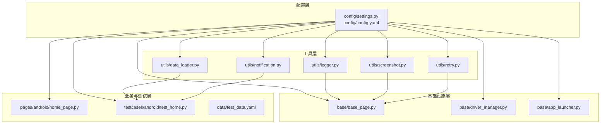
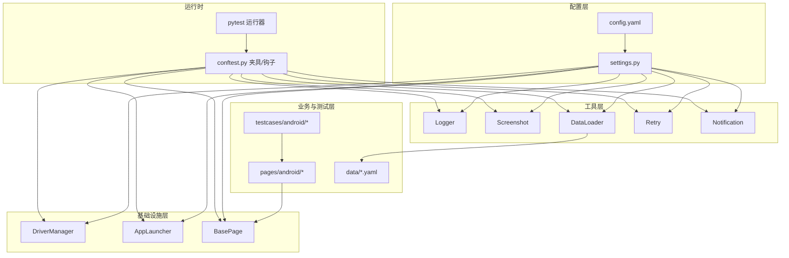
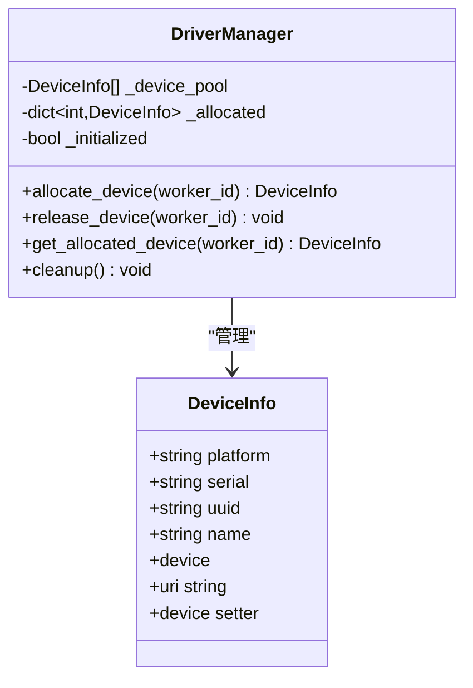
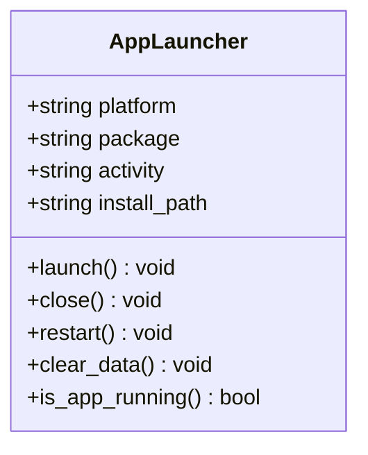
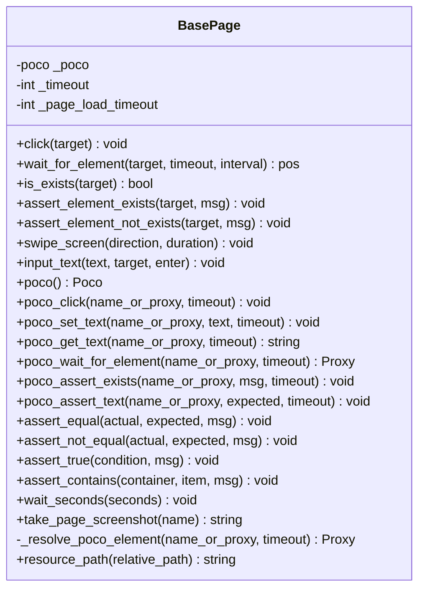
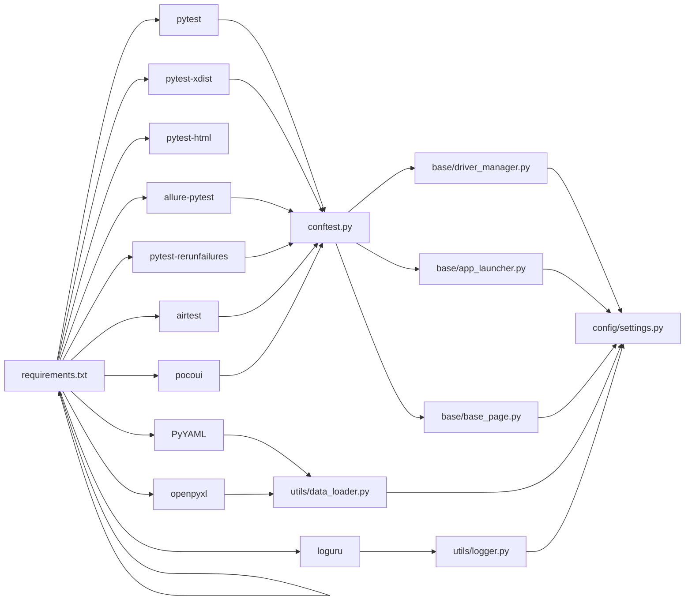

# 模块组织原则

<cite>
**本文引用的文件**
- [base/base_page.py](file://base/base_page.py)
- [base/driver_manager.py](file://base/driver_manager.py)
- [base/app_launcher.py](file://base/app_launcher.py)
- [config/settings.py](file://config/settings.py)
- [config/config.yaml](file://config/config.yaml)
- [utils/logger.py](file://utils/logger.py)
- [utils/screenshot.py](file://utils/screenshot.py)
- [utils/data_loader.py](file://utils/data_loader.py)
- [utils/retry.py](file://utils/retry.py)
- [utils/notification.py](file://utils/notification.py)
- [conftest.py](file://conftest.py)
- [pages/android/home_page.py](file://pages/android/home_page.py)
- [testcases/android/test_home.py](file://testcases/android/test_home.py)
- [data/test_data.yaml](file://data/test_data.yaml)
- [requirements.txt](file://requirements.txt)
</cite>

## 目录
1. [引言](#引言)
2. [项目结构](#项目结构)
3. [核心组件](#核心组件)
4. [架构总览](#架构总览)
5. [详细组件分析](#详细组件分析)
6. [依赖分析](#依赖分析)
7. [性能考虑](#性能考虑)
8. [故障排查指南](#故障排查指南)
9. [结论](#结论)
10. [附录](#附录)

## 引言
本文件系统性阐述 AirTestUI 框架的模块组织原则与最佳实践，聚焦以下目标：
- 明确模块划分的指导原则与命名规范
- 定义模块职责边界、接口设计原则与依赖管理策略
- 详解核心模块（base、config、utils）的组织方式与扩展机制
- 阐述模块间通信协议与数据交换格式
- 提供模块依赖图与接口契约说明，为新模块开发提供标准化框架

AirTestUI 以“分层+领域功能模块”相结合的方式组织代码：config 提供全局配置与环境变量覆盖；base 提供设备、应用、页面对象等基础设施；utils 提供日志、截图、重试、通知等横切能力；pages 与 testcases 体现业务域与测试域的清晰分离。

## 项目结构
项目采用按功能域划分的目录结构，配合 pytest 的约定式组织：
- config：集中管理配置与环境变量覆盖
- base：设备驱动、应用启停、页面对象基类等基础设施
- utils：日志、截图、数据加载、重试、通知等通用工具
- pages：按平台划分的页面对象集合
- testcases：按平台划分的测试用例集合
- data：测试数据文件
- conftest.py：pytest 全局夹具与钩子
- requirements.txt：第三方依赖清单

图表来源
- [config/settings.py:1-112](file://config/settings.py#L1-L112)
- [config/config.yaml:1-70](file://config/config.yaml#L1-L70)
- [base/base_page.py:1-320](file://base/base_page.py#L1-L320)
- [base/driver_manager.py:1-188](file://base/driver_manager.py#L1-L188)
- [base/app_launcher.py:1-127](file://base/app_launcher.py#L1-L127)
- [utils/logger.py:1-59](file://utils/logger.py#L1-L59)
- [utils/screenshot.py:1-89](file://utils/screenshot.py#L1-L89)
- [utils/data_loader.py:1-128](file://utils/data_loader.py#L1-L128)
- [utils/retry.py:1-102](file://utils/retry.py#L1-L102)
- [utils/notification.py:1-167](file://utils/notification.py#L1-L167)
- [pages/android/home_page.py:1-58](file://pages/android/home_page.py#L1-L58)
- [testcases/android/test_home.py:1-48](file://testcases/android/test_home.py#L1-L48)
- [data/test_data.yaml:1-70](file://data/test_data.yaml#L1-L70)

章节来源
- [config/config.yaml:1-70](file://config/config.yaml#L1-L70)
- [requirements.txt:1-21](file://requirements.txt#L1-L21)

## 核心组件
本节聚焦三个核心模块：config、base、utils 的职责、接口与扩展方式。

- config 模块
  - 职责：集中加载与合并配置，支持环境变量覆盖与本地覆盖；提供便捷访问函数（如获取超时、设备列表、APP 配置）
  - 接口设计：通过 settings 对象以属性/字典两种方式访问；提供 get_* 系列函数；支持嵌套字典自动包装为 Config 对象
  - 依赖管理：仅依赖 YAML 解析与环境变量，避免对上层模块耦合
  - 扩展机制：新增配置项时，遵循层级命名与默认值策略；通过环境变量前缀覆盖实现无侵入扩展

- base 模块
  - 职责：提供设备驱动管理、应用启停管理、页面对象基类
  - 接口设计：
    - DriverManager：单例，提供设备池初始化、分配/释放设备、连接生命周期管理
    - AppLauncher：跨平台 APP 生命周期管理，支持安装、启动、关闭、重启、清数据
    - BasePage：统一的页面对象基类，封装图像识别与 Poco 双模式操作，内置断言、等待、截图、Allure 步骤
  - 依赖管理：与 config、utils 低耦合；通过 settings 注入超时与根目录；通过工具模块提供日志、截图
  - 扩展机制：BasePage 支持按平台扩展页面对象；DriverManager 可按需扩展设备类型；AppLauncher 可扩展平台差异逻辑

- utils 模块
  - 职责：提供日志、截图、数据加载、重试、通知等横切能力
  - 接口设计：
    - logger：结构化日志，多输出通道与轮转策略
    - screenshot：统一截图、命名、Allure 附件
    - data_loader：YAML/JSON/Excel 加载与 pytest.param 转换
    - retry：通用重试装饰器与 until-true 重试
    - notification：钉钉/邮件通知与报告消息构建
  - 依赖管理：均依赖 config.settings 获取根目录与配置；彼此独立，避免循环依赖
  - 扩展机制：新增工具函数时遵循单一职责；对 logger 的扩展通过绑定模块名实现

章节来源
- [config/settings.py:1-112](file://config/settings.py#L1-L112)
- [base/driver_manager.py:1-188](file://base/driver_manager.py#L1-L188)
- [base/app_launcher.py:1-127](file://base/app_launcher.py#L1-L127)
- [base/base_page.py:1-320](file://base/base_page.py#L1-L320)
- [utils/logger.py:1-59](file://utils/logger.py#L1-L59)
- [utils/screenshot.py:1-89](file://utils/screenshot.py#L1-L89)
- [utils/data_loader.py:1-128](file://utils/data_loader.py#L1-L128)
- [utils/retry.py:1-102](file://utils/retry.py#L1-L102)
- [utils/notification.py:1-167](file://utils/notification.py#L1-L167)

## 架构总览
下图展示 AirTestUI 的高层架构与模块交互关系，体现“配置驱动、基础设施支撑、工具横切、业务与测试分离”的设计思想。

图表来源
- [conftest.py:1-255](file://conftest.py#L1-L255)
- [config/settings.py:1-112](file://config/settings.py#L1-L112)
- [config/config.yaml:1-70](file://config/config.yaml#L1-L70)
- [base/driver_manager.py:1-188](file://base/driver_manager.py#L1-L188)
- [base/app_launcher.py:1-127](file://base/app_launcher.py#L1-L127)
- [base/base_page.py:1-320](file://base/base_page.py#L1-L320)
- [utils/logger.py:1-59](file://utils/logger.py#L1-L59)
- [utils/screenshot.py:1-89](file://utils/screenshot.py#L1-L89)
- [utils/data_loader.py:1-128](file://utils/data_loader.py#L1-L128)
- [utils/retry.py:1-102](file://utils/retry.py#L1-L102)
- [utils/notification.py:1-167](file://utils/notification.py#L1-L167)
- [pages/android/home_page.py:1-58](file://pages/android/home_page.py#L1-L58)
- [testcases/android/test_home.py:1-48](file://testcases/android/test_home.py#L1-L48)
- [data/test_data.yaml:1-70](file://data/test_data.yaml#L1-L70)

## 详细组件分析

### 配置模块（config）
- 设计要点
  - 优先级：默认配置 → 本地覆盖 → 环境变量覆盖
  - 结构化访问：settings 对象支持属性与字典两种访问方式，便于在不同上下文使用
  - 平台与设备抽象：通过 get_android_devices/get_ios_devices/get_android_app/get_ios_app 提供平台无关的访问接口
- 扩展建议
  - 新增配置键时，保持层级清晰，必要时在 settings 中补充对应的 get_* 方法
  - 使用环境变量前缀覆盖实现无侵入部署差异

章节来源
- [config/settings.py:1-112](file://config/settings.py#L1-L112)
- [config/config.yaml:1-70](file://config/config.yaml#L1-L70)

### 基础设施模块（base）

#### 设备驱动管理（DriverManager）
- 职责边界
  - 设备池初始化与维护
  - worker_id 到设备的分配与释放
  - 设备连接生命周期管理
- 接口契约
  - allocate_device(worker_id)：返回设备信息，必要时建立连接
  - release_device(worker_id)：释放占用
  - get_allocated_device(worker_id)：查询已分配设备
  - cleanup()：会话结束清理
- 扩展机制
  - 可扩展设备类型（如蓝牙、网络设备）时，在 DeviceInfo 中增加字段并在初始化流程中处理
  - 分配策略可替换（轮询、随机、优先级队列）

图表来源
- [base/driver_manager.py:20-188](file://base/driver_manager.py#L20-L188)

章节来源
- [base/driver_manager.py:1-188](file://base/driver_manager.py#L1-L188)

#### 应用启停管理（AppLauncher）
- 职责边界
  - 跨平台 APP 生命周期管理：启动、关闭、重启、清数据
  - 可选安装：当配置提供安装路径时自动安装
  - 平台差异：Android 支持 Activity 启动与清数据，iOS 限制较多
- 接口契约
  - launch/close/restart/clear_data/is_app_running
  - 通过 settings 注入平台与包名/Bundle ID
- 扩展机制
  - 新增平台时在构造函数中处理平台分支
  - 可扩展检测逻辑（如 iOS 的进程状态检测）

图表来源
- [base/app_launcher.py:20-127](file://base/app_launcher.py#L20-L127)

章节来源
- [base/app_launcher.py:1-127](file://base/app_launcher.py#L1-L127)

#### 页面对象基类（BasePage）
- 职责边界
  - 统一的 UI 操作接口：图像识别与 Poco 双模式
  - 断言、等待、截图、Allure 步骤、资源路径解析
- 接口契约
  - 图像识别：click/wait_for_element/is_exists/assert_* 等
  - Poco：poco_click/poco_set_text/poco_get_text/poco_wait_for_element/poco_assert_* 等
  - 通用断言：assert_equal/assert_not_equal/assert_true/assert_contains
  - 工具：wait_seconds/take_page_screenshot/resource_path
- 扩展机制
  - 子类通过继承扩展页面特有元素与动作
  - 可注入 Poco 实例以启用双模式定位

图表来源
- [base/base_page.py:30-320](file://base/base_page.py#L30-L320)

章节来源
- [base/base_page.py:1-320](file://base/base_page.py#L1-L320)

### 工具模块（utils）

#### 日志（logger）
- 职责边界
  - 结构化日志输出，支持控制台彩色输出与文件轮转
- 接口契约
  - get_logger(name) 返回绑定模块名的日志器
- 扩展机制
  - 可通过绑定额外上下文键值增强日志可追踪性

章节来源
- [utils/logger.py:1-59](file://utils/logger.py#L1-L59)

#### 截图（screenshot）
- 职责边界
  - 统一截图保存、命名与 Allure 附件
- 接口契约
  - take_screenshot(name, device) -> filepath
  - attach_screenshot_to_allure(name, filepath)
  - screenshot_on_failure(func) 装饰器
- 扩展机制
  - 可扩展存储介质（云存储、CDN）时，替换保存逻辑

章节来源
- [utils/screenshot.py:1-89](file://utils/screenshot.py#L1-L89)

#### 数据加载（data_loader）
- 职责边界
  - 支持 YAML/JSON/Excel 加载与 pytest.param 转换
- 接口契约
  - load_yaml/load_json/load_excel
  - parametrize_data(filepath, key) -> list
- 扩展机制
  - 新增格式时在 parametrize_data 中扩展分支

章节来源
- [utils/data_loader.py:1-128](file://utils/data_loader.py#L1-L128)

#### 重试（retry）
- 职责边界
  - 提供通用重试装饰器与 until-true 重试
- 接口契约
  - retry(max_attempts, wait_between, retry_on, on_retry)
  - retry_until_true(func=None, max_attempts, interval)
- 扩展机制
  - 可扩展指数退避、抖动等策略

章节来源
- [utils/retry.py:1-102](file://utils/retry.py#L1-L102)

#### 通知（notification）
- 职责边界
  - 支持钉钉机器人与邮件通知，构建测试报告消息
- 接口契约
  - send_notification(title, content)
  - build_report_message(summary) -> (title, content)
- 扩展机制
  - 新增通知渠道时在 send_notification 中扩展分支

章节来源
- [utils/notification.py:1-167](file://utils/notification.py#L1-L167)

### 测试与页面对象（pages/testcases）
- 页面对象
  - 以平台维度组织，继承 BasePage，封装页面特有元素与动作
- 测试用例
  - 以平台维度组织，使用夹具注入 Poco、设备、APP 启停等
- 数据驱动
  - 通过 data_loader 与 pytest.mark.parametrize 实现参数化

章节来源
- [pages/android/home_page.py:1-58](file://pages/android/home_page.py#L1-L58)
- [testcases/android/test_home.py:1-48](file://testcases/android/test_home.py#L1-L48)
- [utils/data_loader.py:85-128](file://utils/data_loader.py#L85-L128)
- [data/test_data.yaml:1-70](file://data/test_data.yaml#L1-L70)

## 依赖分析
- 模块内聚与耦合
  - config 与 settings 为全局单例，被所有模块依赖但不反向依赖其他模块
  - base 依赖 config 与 utils，提供基础设施服务
  - utils 依赖 config，彼此独立，避免循环依赖
  - pages 与 testcases 依赖 base 与 utils，体现业务与测试分离
- 外部依赖
  - pytest、pytest-xdist、allure-pytest、airtest、pocoui、PyYAML、openpyxl、loguru 等
- 依赖图

图表来源
- [requirements.txt:1-21](file://requirements.txt#L1-L21)
- [conftest.py:1-255](file://conftest.py#L1-L255)
- [utils/data_loader.py:1-128](file://utils/data_loader.py#L1-L128)
- [utils/logger.py:1-59](file://utils/logger.py#L1-L59)
- [config/settings.py:1-112](file://config/settings.py#L1-L112)
- [base/driver_manager.py:1-188](file://base/driver_manager.py#L1-L188)
- [base/app_launcher.py:1-127](file://base/app_launcher.py#L1-L127)
- [base/base_page.py:1-320](file://base/base_page.py#L1-L320)

章节来源
- [requirements.txt:1-21](file://requirements.txt#L1-L21)
- [conftest.py:1-255](file://conftest.py#L1-L255)

## 性能考虑
- 截图与日志
  - 截图仅在失败或显式调用时触发，避免频繁 I/O
  - 日志文件轮转与压缩，控制磁盘占用
- 设备与连接
  - DriverManager 采用线程锁保证分配安全；设备复用策略减少连接开销
- 重试策略
  - 合理设置最大重试次数与等待间隔，避免过度重试导致测试时间膨胀
- 数据加载
  - Excel 加载使用只读模式与数据缓存，减少内存压力

## 故障排查指南
- 设备分配失败
  - 检查设备池配置与可用性；确认 allocate_device 调用链路
- APP 启动失败
  - 核对包名/Bundle ID、Activity、安装路径；查看 AppLauncher 日志
- 截图未生成
  - 检查截图目录权限与配置；确认 Allure 附件注入流程
- 通知发送失败
  - 核对通知类型与配置项；检查网络连通性与签名（钉钉）
- 数据加载异常
  - 确认文件路径与格式；检查 parametrize_data 的键名与返回类型

章节来源
- [base/driver_manager.py:119-150](file://base/driver_manager.py#L119-L150)
- [base/app_launcher.py:49-93](file://base/app_launcher.py#L49-L93)
- [utils/screenshot.py:28-53](file://utils/screenshot.py#L28-L53)
- [utils/notification.py:22-48](file://utils/notification.py#L22-L48)
- [utils/data_loader.py:85-128](file://utils/data_loader.py#L85-L128)

## 结论
AirTestUI 的模块组织遵循“配置驱动、基础设施下沉、工具横切、业务与测试分离”的原则。通过明确的职责边界、稳定的接口契约与可扩展的依赖管理，框架能够支持多平台、多设备、多场景的自动化测试需求。建议在新增模块时严格遵循本文的组织原则与接口设计规范，确保整体架构的一致性与可维护性。

## 附录

### 模块职责边界与接口契约清单
- config/settings.py
  - 职责：配置加载与访问
  - 关键接口：settings、get_* 系列函数
- base/driver_manager.py
  - 职责：设备池与连接管理
  - 关键接口：allocate_device/release_device/get_allocated_device/cleanup
- base/app_launcher.py
  - 职责：APP 生命周期管理
  - 关键接口：launch/close/restart/clear_data/is_app_running
- base/base_page.py
  - 职责：页面对象统一接口
  - 关键接口：图像识别与 Poco 操作、断言、工具方法
- utils/logger.py
  - 职责：结构化日志
  - 关键接口：get_logger
- utils/screenshot.py
  - 职责：截图与 Allure 附件
  - 关键接口：take_screenshot/attach_screenshot_to_allure/screenshot_on_failure
- utils/data_loader.py
  - 职责：数据加载与参数化
  - 关键接口：load_yaml/load_json/load_excel/parametrize_data
- utils/retry.py
  - 职责：重试机制
  - 关键接口：retry/retry_until_true
- utils/notification.py
  - 职责：通知与报告
  - 关键接口：send_notification/build_report_message

章节来源
- [config/settings.py:83-112](file://config/settings.py#L83-L112)
- [base/driver_manager.py:119-167](file://base/driver_manager.py#L119-L167)
- [base/app_launcher.py:49-127](file://base/app_launcher.py#L49-L127)
- [base/base_page.py:60-320](file://base/base_page.py#L60-L320)
- [utils/logger.py:50-59](file://utils/logger.py#L50-L59)
- [utils/screenshot.py:28-89](file://utils/screenshot.py#L28-L89)
- [utils/data_loader.py:18-128](file://utils/data_loader.py#L18-L128)
- [utils/retry.py:13-102](file://utils/retry.py#L13-L102)
- [utils/notification.py:22-167](file://utils/notification.py#L22-L167)