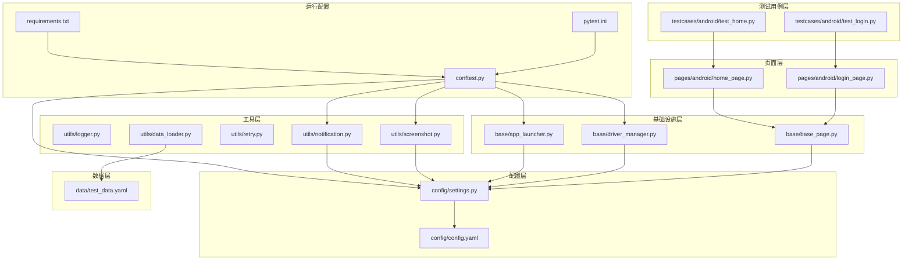
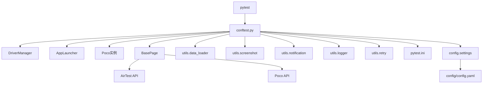
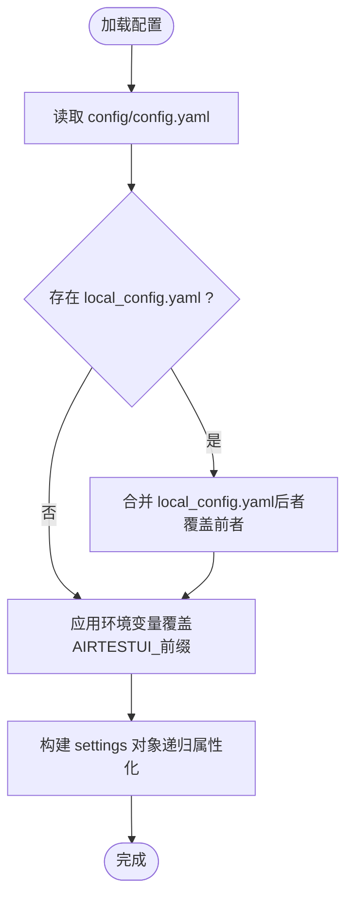
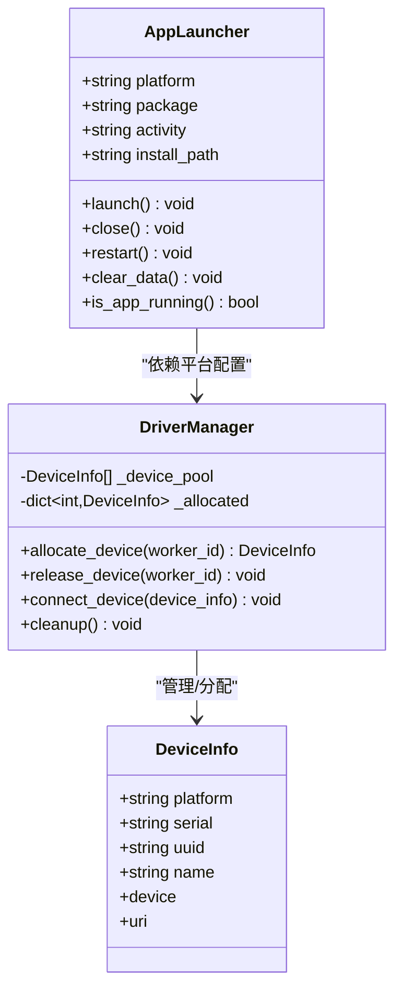
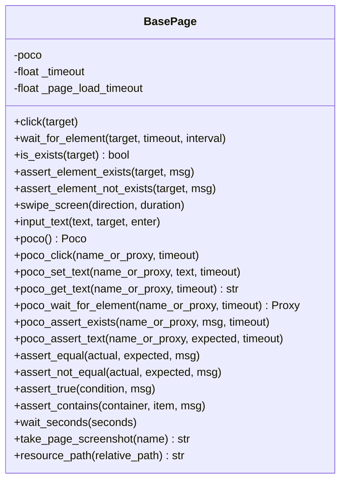
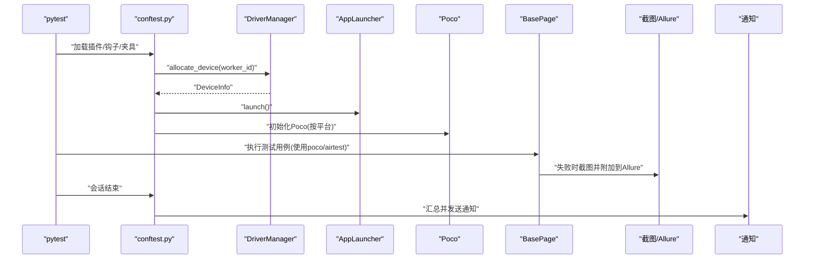
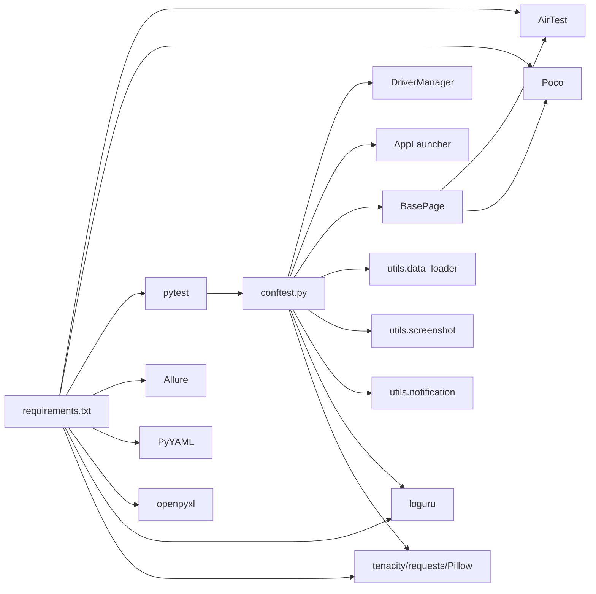

# 系统边界与集成

<cite>
**本文引用的文件**
- [requirements.txt](file://requirements.txt)
- [pytest.ini](file://pytest.ini)
- [conftest.py](file://conftest.py)
- [config/settings.py](file://config/settings.py)
- [config/config.yaml](file://config/config.yaml)
- [base/base_page.py](file://base/base_page.py)
- [base/driver_manager.py](file://base/driver_manager.py)
- [base/app_launcher.py](file://base/app_launcher.py)
- [pages/android/login_page.py](file://pages/android/login_page.py)
- [pages/android/home_page.py](file://pages/android/home_page.py)
- [utils/data_loader.py](file://utils/data_loader.py)
- [utils/logger.py](file://utils/logger.py)
- [utils/screenshot.py](file://utils/screenshot.py)
- [utils/retry.py](file://utils/retry.py)
- [utils/notification.py](file://utils/notification.py)
- [data/test_data.yaml](file://data/test_data.yaml)
- [testcases/android/test_login.py](file://testcases/android/test_login.py)
- [testcases/android/test_home.py](file://testcases/android/test_home.py)
</cite>

## 目录
1. [引言](#引言)
2. [项目结构](#项目结构)
3. [核心组件](#核心组件)
4. [架构总览](#架构总览)
5. [详细组件分析](#详细组件分析)
6. [依赖关系分析](#依赖关系分析)
7. [性能考量](#性能考量)
8. [故障排查指南](#故障排查指南)
9. [结论](#结论)
10. [附录](#附录)

## 引言
本文件面向AirTestUI框架的系统边界与集成，明确框架与AirTest、Poco、pytest等第三方库的集成边界与契约，定义配置系统的边界设计（含环境变量覆盖与配置文件优先级）、扩展点（自定义页面对象与工具函数的集成接口），并提供集成架构图与API契约说明，帮助开发者在既定边界内进行稳定扩展与集成。

## 项目结构
AirTestUI采用“分层+功能域”混合组织方式：
- 配置层：config（YAML配置与全局settings）
- 基础设施层：base（页面基类、设备驱动、应用启停）
- 页面层：pages（按平台划分的页面对象）
- 工具层：utils（日志、截图、重试、通知、数据加载）
- 测试用例层：testcases（按平台划分的用例）
- 数据层：data（测试数据）
- 运行配置：pytest.ini、conftest.py、requirements.txt

图表来源
- [config/config.yaml:1-70](file://config/config.yaml#L1-L70)
- [config/settings.py:1-112](file://config/settings.py#L1-L112)
- [base/base_page.py:1-320](file://base/base_page.py#L1-L320)
- [base/driver_manager.py:1-188](file://base/driver_manager.py#L1-L188)
- [base/app_launcher.py:1-127](file://base/app_launcher.py#L1-L127)
- [pages/android/login_page.py:1-107](file://pages/android/login_page.py#L1-L107)
- [pages/android/home_page.py:1-58](file://pages/android/home_page.py#L1-L58)
- [utils/logger.py:1-59](file://utils/logger.py#L1-L59)
- [utils/screenshot.py:1-89](file://utils/screenshot.py#L1-L89)
- [utils/retry.py:1-102](file://utils/retry.py#L1-L102)
- [utils/notification.py:1-167](file://utils/notification.py#L1-L167)
- [utils/data_loader.py:1-128](file://utils/data_loader.py#L1-L128)
- [data/test_data.yaml:1-70](file://data/test_data.yaml#L1-L70)
- [pytest.ini:1-47](file://pytest.ini#L1-L47)
- [conftest.py:1-255](file://conftest.py#L1-L255)
- [requirements.txt:1-21](file://requirements.txt#L1-L21)

章节来源
- [pytest.ini:1-47](file://pytest.ini#L1-L47)
- [conftest.py:1-255](file://conftest.py#L1-L255)
- [requirements.txt:1-21](file://requirements.txt#L1-L21)

## 核心组件
- 配置系统：以config.yaml为源，settings.py提供全局配置对象与便捷访问函数；支持本地覆盖文件与环境变量覆盖；提供设备、APP、超时、截图、重试、报告、通知等配置项。
- 基础设施：BasePage提供统一的AirTest/Poco操作封装；DriverManager负责设备连接池与并发分配；AppLauncher负责APP生命周期管理。
- 工具集：日志（loguru）、截图（airtest snapshot + allure附件）、重试（装饰器）、通知（钉钉/邮件）、数据加载（YAML/JSON/Excel）。
- 测试运行：pytest.ini定义命令行参数与标记；conftest.py注入fixture与hooks，实现设备分配、Poco初始化、APP启停、失败截图、Allure步骤与通知。

章节来源
- [config/settings.py:1-112](file://config/settings.py#L1-L112)
- [config/config.yaml:1-70](file://config/config.yaml#L1-L70)
- [base/base_page.py:1-320](file://base/base_page.py#L1-L320)
- [base/driver_manager.py:1-188](file://base/driver_manager.py#L1-L188)
- [base/app_launcher.py:1-127](file://base/app_launcher.py#L1-L127)
- [utils/logger.py:1-59](file://utils/logger.py#L1-L59)
- [utils/screenshot.py:1-89](file://utils/screenshot.py#L1-L89)
- [utils/retry.py:1-102](file://utils/retry.py#L1-L102)
- [utils/notification.py:1-167](file://utils/notification.py#L1-L167)
- [utils/data_loader.py:1-128](file://utils/data_loader.py#L1-L128)
- [pytest.ini:1-47](file://pytest.ini#L1-L47)
- [conftest.py:1-255](file://conftest.py#L1-L255)

## 架构总览
AirTestUI围绕“配置—基础设施—页面—工具—测试运行”的层次化架构工作，系统边界如下：
- 外部依赖边界：AirTest（设备连接、图像识别、截图）、Poco（UI树定位）、pytest（测试发现/执行/报告）、Allure（报告）、requests/smtplib（通知）。
- 内部边界：config/settings集中配置；base层封装AirTest/Poco；pages层面向业务场景；utils层提供横切能力；testcases层消费上述能力。
- 集成契约：通过conftest.py的fixture与hooks对接AirTest/Poco/pytest；通过settings暴露配置；通过BasePage统一页面操作API。

图表来源
- [conftest.py:1-255](file://conftest.py#L1-L255)
- [base/base_page.py:1-320](file://base/base_page.py#L1-L320)
- [base/driver_manager.py:1-188](file://base/driver_manager.py#L1-L188)
- [base/app_launcher.py:1-127](file://base/app_launcher.py#L1-L127)
- [utils/data_loader.py:1-128](file://utils/data_loader.py#L1-L128)
- [utils/screenshot.py:1-89](file://utils/screenshot.py#L1-L89)
- [utils/notification.py:1-167](file://utils/notification.py#L1-L167)
- [utils/logger.py:1-59](file://utils/logger.py#L1-L59)
- [utils/retry.py:1-102](file://utils/retry.py#L1-L102)
- [config/settings.py:1-112](file://config/settings.py#L1-L112)
- [config/config.yaml:1-70](file://config/config.yaml#L1-L70)
- [pytest.ini:1-47](file://pytest.ini#L1-L47)

## 详细组件分析

### 配置系统边界与优先级
- 配置源与顺序
  1) 主配置：config/config.yaml
  2) 本地覆盖：config/local_config.yaml（若存在）
  3) 环境变量覆盖：以AIRTESTUI_为前缀的环境变量覆盖顶层键
  4) 便捷访问：settings对象提供属性/字典访问与get方法
- 关键配置项
  - 运行环境env、超时timeout、截图screenshot、重试retry、报告report、通知notification
  - Android/iOS设备与APP配置（devices/app）
- 优先级与覆盖规则
  - local_config.yaml与config.yaml合并（后者同名键覆盖前者）
  - 环境变量覆盖合并后的原始配置（键名转小写）
  - settings对象递归包装为嵌套对象，便于点式访问

图表来源
- [config/settings.py:34-80](file://config/settings.py#L34-L80)
- [config/config.yaml:1-70](file://config/config.yaml#L1-L70)

章节来源
- [config/settings.py:1-112](file://config/settings.py#L1-L112)
- [config/config.yaml:1-70](file://config/config.yaml#L1-L70)

### 设备与APP生命周期管理
- 设备管理
  - DriverManager单例，维护设备池与分配状态
  - 按worker_id分配设备，支持复用；连接失败时抛出异常
  - 提供设备URI生成（Android/iOS）
- APP管理
  - AppLauncher按平台读取包名/Bundle ID与安装路径
  - 支持启动、关闭、重启、清除数据（Android）、安装（可选）

图表来源
- [base/driver_manager.py:20-188](file://base/driver_manager.py#L20-L188)
- [base/app_launcher.py:20-127](file://base/app_launcher.py#L20-L127)

章节来源
- [base/driver_manager.py:1-188](file://base/driver_manager.py#L1-L188)
- [base/app_launcher.py:1-127](file://base/app_launcher.py#L1-L127)

### 页面对象与API契约
- BasePage
  - 图像识别操作：click、wait_for_element、is_exists、assert_*、swipe_screen、input_text
  - Poco操作：poco_click、poco_set_text、poco_get_text、poco_wait_for_element、poco_assert_exists、poco_assert_text
  - 断言：assert_equal、assert_not_equal、assert_true、assert_contains
  - 工具：wait_seconds、take_page_screenshot、resource_path
  - 约束：未初始化poco时禁止Poco操作；超时来自配置；截图与Allure附件自动集成
- 页面对象扩展
  - 继承BasePage，定义模板/节点名，封装业务动作与断言
  - 可同时支持图像识别与Poco定位，增强鲁棒性

图表来源
- [base/base_page.py:30-320](file://base/base_page.py#L30-L320)

章节来源
- [base/base_page.py:1-320](file://base/base_page.py#L1-L320)

### 测试运行与集成契约
- pytest.ini
  - 测试路径、文件/类/函数命名规则、默认命令行参数（Allure、HTML、并行、重跑等）
  - 自定义标记（android/ios/smoke/regression/p等级等）
  - 日志CLI与文件输出
- conftest.py
  - hooks：pytest_configure、pytest_collection_modifyitems、pytest_runtest_makereport、pytest_sessionfinish
  - fixtures：worker_id、device_info、airtest_device、platform、poco、app_launcher、setup_app、step_allure、test_data
  - 与AirTest/Poco/Allure/通知的集成点

图表来源
- [conftest.py:140-255](file://conftest.py#L140-L255)
- [base/driver_manager.py:119-150](file://base/driver_manager.py#L119-L150)
- [base/app_launcher.py:49-74](file://base/app_launcher.py#L49-L74)
- [utils/screenshot.py:28-73](file://utils/screenshot.py#L28-L73)
- [utils/notification.py:22-48](file://utils/notification.py#L22-L48)

章节来源
- [pytest.ini:1-47](file://pytest.ini#L1-L47)
- [conftest.py:1-255](file://conftest.py#L1-L255)

### 工具与扩展点
- 日志：基于loguru，统一输出与文件轮转
- 截图：统一保存目录、命名策略、Allure附件
- 重试：装饰器支持异常类型过滤与回调
- 通知：钉钉Webhook签名与邮件发送
- 数据加载：YAML/JSON/Excel，支持pytest.mark.parametrize参数化

章节来源
- [utils/logger.py:1-59](file://utils/logger.py#L1-L59)
- [utils/screenshot.py:1-89](file://utils/screenshot.py#L1-L89)
- [utils/retry.py:1-102](file://utils/retry.py#L1-L102)
- [utils/notification.py:1-167](file://utils/notification.py#L1-L167)
- [utils/data_loader.py:1-128](file://utils/data_loader.py#L1-L128)

## 依赖关系分析
- 外部依赖
  - AirTest：设备连接、图像识别、截图、断言、输入事件
  - Poco：UI树定位（AndroidUiautomationPoco/IOSPoco）
  - pytest：测试发现、执行、并行、重跑、HTML/Allure报告
  - Allure：报告环境信息、步骤、附件
  - requests/smtplib：通知
  - PyYAML/openpyxl：配置与数据加载
- 内部耦合
  - BasePage依赖AirTest/Poco与配置；DriverManager/AppLauncher依赖配置；conftest.py贯穿各模块；utils模块被广泛使用

图表来源
- [requirements.txt:1-21](file://requirements.txt#L1-L21)
- [conftest.py:1-255](file://conftest.py#L1-L255)
- [base/base_page.py:1-320](file://base/base_page.py#L1-L320)
- [base/driver_manager.py:1-188](file://base/driver_manager.py#L1-L188)
- [base/app_launcher.py:1-127](file://base/app_launcher.py#L1-L127)
- [utils/data_loader.py:1-128](file://utils/data_loader.py#L1-L128)
- [utils/screenshot.py:1-89](file://utils/screenshot.py#L1-L89)
- [utils/notification.py:1-167](file://utils/notification.py#L1-L167)
- [utils/logger.py:1-59](file://utils/logger.py#L1-L59)
- [utils/retry.py:1-102](file://utils/retry.py#L1-L102)

章节来源
- [requirements.txt:1-21](file://requirements.txt#L1-L21)

## 性能考量
- 并发与设备分配：pytest-xdist并行，DriverManager按worker_id分配设备，避免锁竞争；设备不足时允许复用，注意状态隔离
- 超时与重试：通过配置统一管理元素等待、页面加载、APP启动超时；重试装饰器减少偶发失败
- 截图与报告：失败自动截图并附加Allure，建议在非调试场景关闭高频截图
- 日志：文件轮转与压缩，避免磁盘占用过大

## 故障排查指南
- 设备连接失败
  - 检查config.yaml中设备配置与URI；确认AirTest设备可用性
  - 查看DriverManager日志与异常栈
- Poco初始化失败
  - 检查平台分支与设备类型；查看conftest日志
- APP启动失败
  - 检查包名/BID与活动页配置；确认安装路径与权限
- 截图失败
  - 检查截图目录权限与磁盘空间；确认AirTest设备句柄
- 通知发送失败
  - 检查钉钉Webhook/签名或邮件SMTP配置；查看网络与证书

章节来源
- [base/driver_manager.py:103-150](file://base/driver_manager.py#L103-L150)
- [base/app_launcher.py:49-93](file://base/app_launcher.py#L49-L93)
- [utils/screenshot.py:28-52](file://utils/screenshot.py#L28-L52)
- [utils/notification.py:50-125](file://utils/notification.py#L50-L125)
- [conftest.py:186-207](file://conftest.py#L186-L207)

## 结论
AirTestUI通过清晰的系统边界与集成契约，将AirTest/Poco/pytest等第三方能力整合为统一的移动端自动化框架。配置系统提供灵活的覆盖机制与便捷访问；基础设施层抽象设备与APP生命周期；页面层以BasePage为中心实现跨定位模式的统一API；工具层提供横切能力。遵循本文边界与契约，可在不破坏系统稳定性的前提下进行扩展与集成。

## 附录
- 配置文件样例与字段说明参见config/config.yaml
- 测试数据样例参见data/test_data.yaml
- 示例用例参见testcases/android/test_login.py、testcases/android/test_home.py