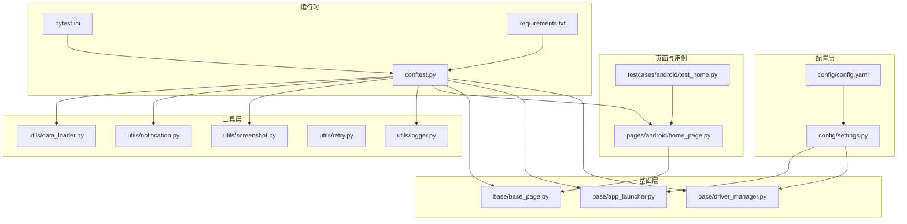
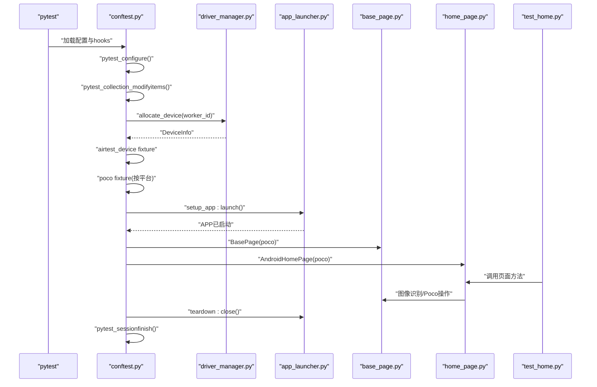
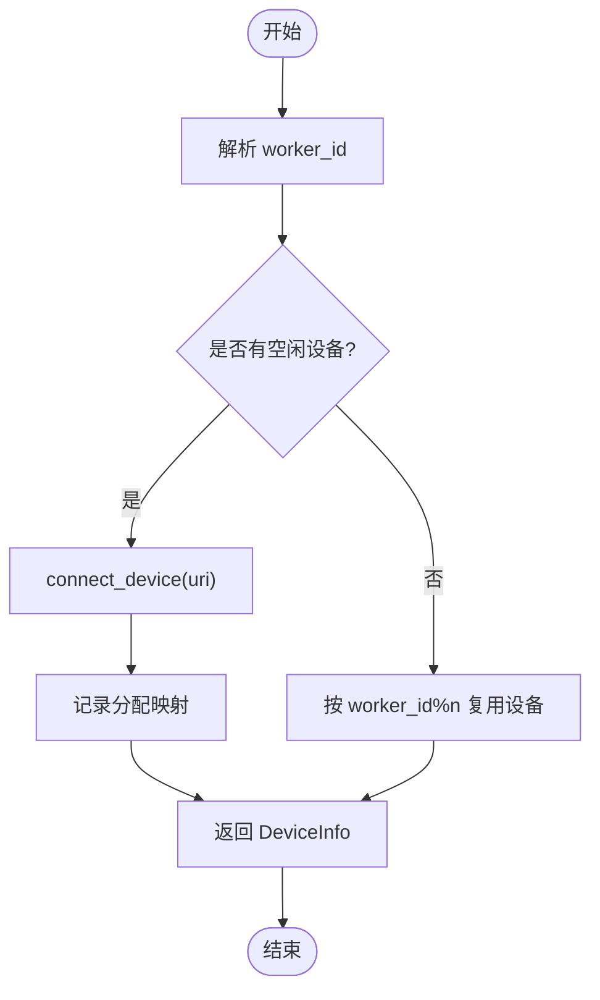
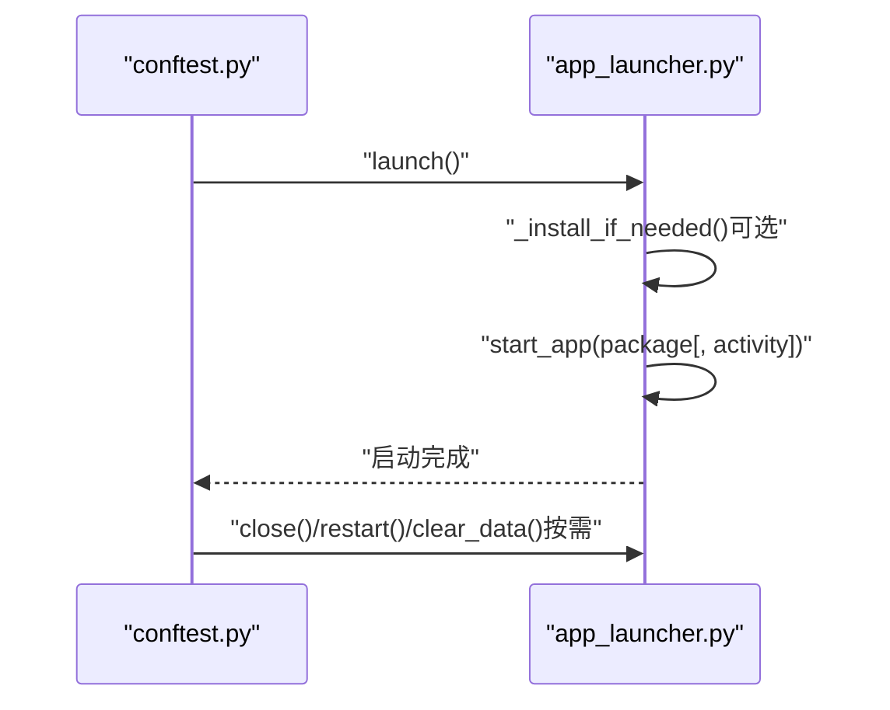
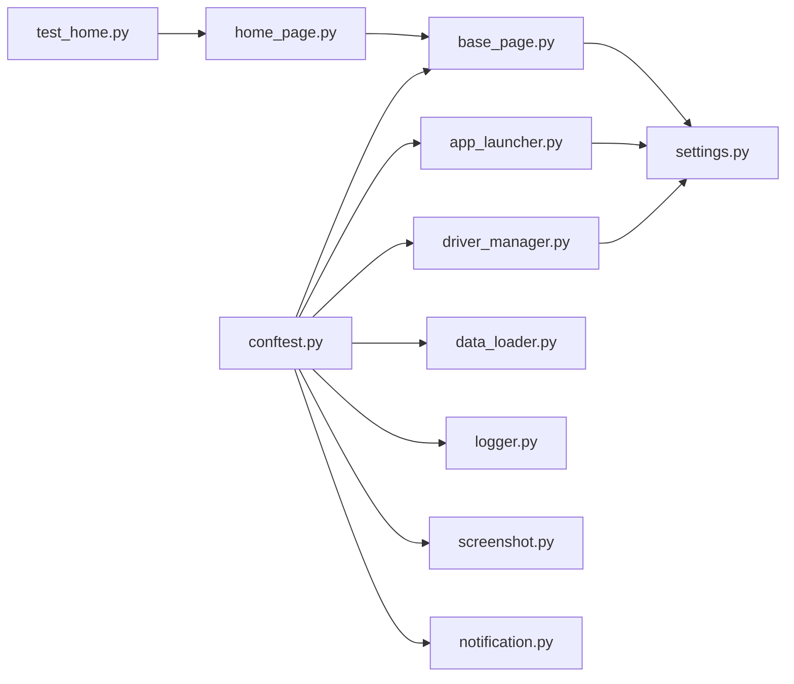

# 组件交互流程

<cite>
**本文引用的文件**
- [conftest.py](file://conftest.py)
- [driver_manager.py](file://base/driver_manager.py)
- [app_launcher.py](file://base/app_launcher.py)
- [base_page.py](file://base/base_page.py)
- [settings.py](file://config/settings.py)
- [config.yaml](file://config/config.yaml)
- [data_loader.py](file://utils/data_loader.py)
- [logger.py](file://utils/logger.py)
- [screenshot.py](file://utils/screenshot.py)
- [notification.py](file://utils/notification.py)
- [retry.py](file://utils/retry.py)
- [pytest.ini](file://pytest.ini)
- [requirements.txt](file://requirements.txt)
- [home_page.py](file://pages/android/home_page.py)
- [test_home.py](file://testcases/android/test_home.py)
</cite>

## 目录
1. [简介](#简介)
2. [项目结构](#项目结构)
3. [核心组件](#核心组件)
4. [架构总览](#架构总览)
5. [详细组件分析](#详细组件分析)
6. [依赖分析](#依赖分析)
7. [性能考虑](#性能考虑)
8. [故障排查指南](#故障排查指南)
9. [结论](#结论)
10. [附录](#附录)

## 简介
本文件面向AirTestUI框架的组件交互流程，系统性梳理从测试启动到执行的完整数据流与控制流，重点覆盖以下方面：
- pytest fixtures的初始化顺序与作用域
- 设备分配流程与并发控制
- Poco实例创建与平台适配
- APP生命周期管理（启动/关闭）
- 各组件间的调用关系与依赖传递
- 关键交互场景的时序图与流程图

目标是帮助开发者快速理解各模块协作方式，明确关键扩展点与优化空间。

## 项目结构
AirTestUI采用“配置-基础层-页面-用例-工具”的分层组织方式，核心入口为pytest配置与conftest.py，基础能力由base目录提供，页面对象位于pages目录，测试用例位于testcases目录，工具模块位于utils目录。

图表来源
- [conftest.py:1-255](file://conftest.py#L1-L255)
- [driver_manager.py:1-188](file://base/driver_manager.py#L1-L188)
- [app_launcher.py:1-127](file://base/app_launcher.py#L1-L127)
- [base_page.py:1-320](file://base/base_page.py#L1-L320)
- [settings.py:1-112](file://config/settings.py#L1-L112)
- [config.yaml:1-70](file://config/config.yaml#L1-L70)
- [data_loader.py:1-128](file://utils/data_loader.py#L1-L128)
- [logger.py:1-59](file://utils/logger.py#L1-L59)
- [screenshot.py:1-89](file://utils/screenshot.py#L1-L89)
- [notification.py:1-167](file://utils/notification.py#L1-L167)
- [retry.py:1-102](file://utils/retry.py#L1-L102)
- [pytest.ini:1-47](file://pytest.ini#L1-L47)
- [requirements.txt:1-21](file://requirements.txt#L1-L21)
- [home_page.py:1-58](file://pages/android/home_page.py#L1-L58)
- [test_home.py:1-48](file://testcases/android/test_home.py#L1-L48)

章节来源
- [pytest.ini:1-47](file://pytest.ini#L1-L47)
- [requirements.txt:1-21](file://requirements.txt#L1-L21)

## 核心组件
- 配置系统：集中管理环境、超时、设备与APP配置，并支持环境变量覆盖与本地覆盖。
- 设备管理器：维护设备池，按worker_id分配/回收设备，支持连接与复用。
- APP启动器：跨平台启动/关闭/重启/清数据，支持可选安装。
- 页面基类：统一封装图像识别与Poco双模式操作，内置断言、等待、截图与Allure步骤。
- conftest：定义pytest hooks与fixtures，串联设备、Poco、APP生命周期与报告集成。
- 工具模块：日志、截图、通知、重试、数据加载。

章节来源
- [settings.py:1-112](file://config/settings.py#L1-L112)
- [config.yaml:1-70](file://config/config.yaml#L1-L70)
- [driver_manager.py:1-188](file://base/driver_manager.py#L1-L188)
- [app_launcher.py:1-127](file://base/app_launcher.py#L1-L127)
- [base_page.py:1-320](file://base/base_page.py#L1-L320)
- [conftest.py:1-255](file://conftest.py#L1-L255)
- [logger.py:1-59](file://utils/logger.py#L1-L59)
- [screenshot.py:1-89](file://utils/screenshot.py#L1-L89)
- [notification.py:1-167](file://utils/notification.py#L1-L167)
- [retry.py:1-102](file://utils/retry.py#L1-L102)
- [data_loader.py:1-128](file://utils/data_loader.py#L1-L128)

## 架构总览
下图展示从pytest启动到测试执行的关键交互链路，涵盖hooks、fixtures、设备分配、Poco创建与APP生命周期管理。

图表来源
- [conftest.py:37-117](file://conftest.py#L37-L117)
- [conftest.py:151-227](file://conftest.py#L151-L227)
- [driver_manager.py:119-150](file://base/driver_manager.py#L119-L150)
- [app_launcher.py:49-93](file://base/app_launcher.py#L49-L93)
- [base_page.py:30-320](file://base/base_page.py#L30-L320)
- [home_page.py:14-58](file://pages/android/home_page.py#L14-L58)
- [test_home.py:17-48](file://testcases/android/test_home.py#L17-L48)

## 详细组件分析

### 1) pytest hooks与全局统计
- 初始化阶段：记录开始时间，注入Allure环境信息。
- 结果钩子：统计总数/通过/失败/跳过/错误，失败时自动截图并附加到Allure。
- 会话结束：汇总时长与环境，构建通知内容并通过配置发送。

章节来源
- [conftest.py:37-117](file://conftest.py#L37-L117)
- [conftest.py:119-138](file://conftest.py#L119-L138)
- [notification.py:128-167](file://utils/notification.py#L128-L167)

### 2) 设备分配与并发控制
- worker_id解析：从环境变量获取当前worker编号，master为0。
- 设备池初始化：读取配置中的Android/iOS设备列表，构建DeviceInfo集合。
- 分配策略：按worker_id顺序分配；若设备不足则循环复用，确保并发可用。
- 连接与回收：分配时建立连接，会话结束释放；支持查询已分配设备。

图表来源
- [conftest.py:142-154](file://conftest.py#L142-L154)
- [driver_manager.py:81-101](file://base/driver_manager.py#L81-L101)
- [driver_manager.py:119-150](file://base/driver_manager.py#L119-L150)
- [driver_manager.py:103-118](file://base/driver_manager.py#L103-L118)

章节来源
- [conftest.py:151-166](file://conftest.py#L151-L166)
- [driver_manager.py:51-188](file://base/driver_manager.py#L51-L188)
- [settings.py:94-112](file://config/settings.py#L94-L112)
- [config.yaml:47-69](file://config/config.yaml#L47-L69)

### 3) Poco实例创建与平台适配
- 依据平台选择不同引擎：Android使用AndroidUiautomationPoco，iOS使用IOSPoco。
- 使用airtest_device作为底层驱动，Android启用use_airtest_input，关闭每次操作截图以提升性能。
- 若初始化失败，降级为None，页面层可选择图像识别模式继续执行。

章节来源
- [conftest.py:185-208](file://conftest.py#L185-L208)

### 4) APP生命周期管理
- 启动：根据平台与配置决定是否先安装，再启动APP并等待基础时延。
- 关闭/重启/清数据：提供统一接口；Android支持清除数据。
- 运行态检测：Android通过shell命令检测前台窗口，iOS默认认为运行。

图表来源
- [conftest.py:217-227](file://conftest.py#L217-L227)
- [app_launcher.py:49-93](file://base/app_launcher.py#L49-L93)
- [app_launcher.py:105-114](file://base/app_launcher.py#L105-L114)

章节来源
- [app_launcher.py:20-127](file://base/app_launcher.py#L20-L127)
- [settings.py:104-112](file://config/settings.py#L104-L112)
- [config.yaml:53-69](file://config/config.yaml#L53-L69)

### 5) 页面对象与操作封装
- 图像识别：基于Template与airtest核心API，提供点击、等待、断言、滑动、输入等。
- Poco模式：通过UIObjectProxy解析节点名或代理，支持等待、点击、输入、断言文本等。
- 统一日志与截图：Allure步骤、失败自动截图、页面截图。
- 资源路径：提供resource_path辅助定位资源文件。

章节来源
- [base_page.py:30-320](file://base/base_page.py#L30-L320)
- [home_page.py:14-58](file://pages/android/home_page.py#L14-L58)

### 6) 测试用例与页面协作
- 用例通过fixture注入poco，构造页面对象并执行业务步骤。
- 页面方法内部可同时支持图像识别与Poco两种定位策略，增强鲁棒性。

章节来源
- [test_home.py:17-48](file://testcases/android/test_home.py#L17-L48)
- [home_page.py:17-58](file://pages/android/home_page.py#L17-L58)

### 7) 配置与数据加载
- 配置加载：支持YAML主配置、本地覆盖与环境变量覆盖，提供便捷访问函数。
- 数据加载：支持YAML/JSON/Excel，提供参数化数据转换。

章节来源
- [settings.py:14-81](file://config/settings.py#L14-L81)
- [config.yaml:1-70](file://config/config.yaml#L1-L70)
- [data_loader.py:18-128](file://utils/data_loader.py#L18-L128)

### 8) 工具模块
- 日志：多通道输出，支持文件轮转与级别过滤。
- 截图：统一命名与保存，支持Allure附件。
- 通知：钉钉/邮件两种方式，支持签名与HTML内容。
- 重试：通用重试与条件重试装饰器，支持回调与指数退避。

章节来源
- [logger.py:12-59](file://utils/logger.py#L12-L59)
- [screenshot.py:17-89](file://utils/screenshot.py#L17-L89)
- [notification.py:22-167](file://utils/notification.py#L22-L167)
- [retry.py:13-102](file://utils/retry.py#L13-L102)

## 依赖分析
- conftest对driver_manager、app_launcher、poco、test_data等进行编排，形成测试生命周期的中枢。
- driver_manager依赖settings读取设备配置，app_launcher依赖settings读取APP配置。
- 页面基类依赖poco与airtest核心API，提供统一操作接口。
- 工具模块被hooks与fixtures广泛使用，贯穿测试全链路。

图表来源
- [conftest.py:14-21](file://conftest.py#L14-L21)
- [driver_manager.py:10-15](file://base/driver_manager.py#L10-L15)
- [app_launcher.py:14-15](file://base/app_launcher.py#L14-L15)
- [base_page.py:23-26](file://base/base_page.py#L23-L26)
- [home_page.py:8-11](file://pages/android/home_page.py#L8-L11)
- [test_home.py:7-10](file://testcases/android/test_home.py#L7-L10)

章节来源
- [conftest.py:14-21](file://conftest.py#L14-L21)
- [driver_manager.py:10-15](file://base/driver_manager.py#L10-L15)
- [app_launcher.py:14-15](file://base/app_launcher.py#L14-L15)
- [base_page.py:23-26](file://base/base_page.py#L23-L26)

## 性能考虑
- Poco初始化：Android启用use_airtest_input并关闭screenshot_each_action，减少截图开销。
- 设备复用：当设备数少于worker数时循环复用，避免阻塞；建议合理配置设备池规模。
- 超时配置：通过settings.timeout统一管理元素等待、页面加载与APP启动超时，避免过长等待。
- 截图策略：按需开启，避免频繁截图影响执行速度。

章节来源
- [conftest.py:192-201](file://conftest.py#L192-L201)
- [driver_manager.py:142-148](file://base/driver_manager.py#L142-L148)
- [settings.py:89-92](file://config/settings.py#L89-L92)
- [config.yaml:8-18](file://config/config.yaml#L8-L18)

## 故障排查指南
- 设备分配失败：检查设备池配置与连接URI，确认设备在线且未被占用。
- Poco初始化失败：查看日志警告，确认平台与驱动匹配；必要时降级为图像识别模式。
- APP启动失败：核对包名/Bundle ID、Activity与安装路径，关注安装与启动超时。
- 截图与报告：失败自动截图与Allure附件已集成，定位问题时优先查看附件。
- 通知发送：核对通知开关与配置项，确保网络可达。

章节来源
- [driver_manager.py:119-150](file://base/driver_manager.py#L119-L150)
- [conftest.py:205-207](file://conftest.py#L205-L207)
- [app_launcher.py:55-74](file://base/app_launcher.py#L55-L74)
- [screenshot.py:28-53](file://utils/screenshot.py#L28-L53)
- [notification.py:22-48](file://utils/notification.py#L22-L48)

## 结论
AirTestUI通过conftest集中编排设备、Poco与APP生命周期，结合配置与工具模块，形成高内聚、低耦合的测试执行框架。建议在团队内统一设备与APP配置，合理设置超时与重试策略，充分利用Allure与通知能力提升可观测性与交付效率。

## 附录
- 运行参数与并发：pytest.ini启用xdist自动并发与reruns，便于多设备并行执行。
- 依赖声明：requirements.txt列出核心依赖，确保环境一致性。

章节来源
- [pytest.ini:11-22](file://pytest.ini#L11-L22)
- [requirements.txt:1-21](file://requirements.txt#L1-21)