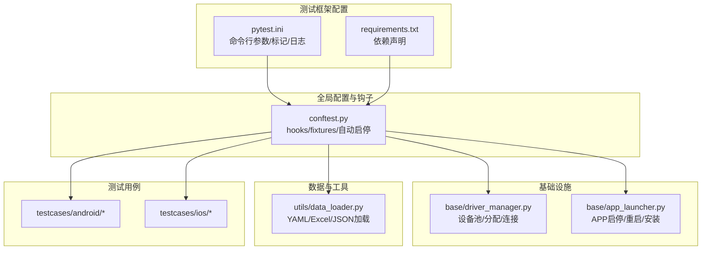
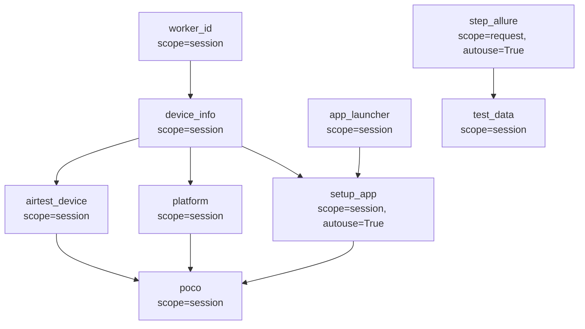
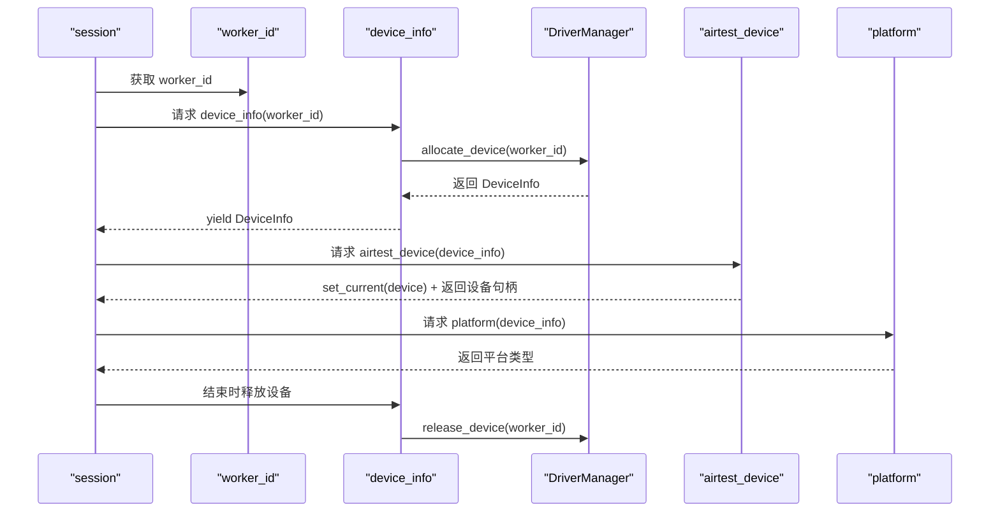
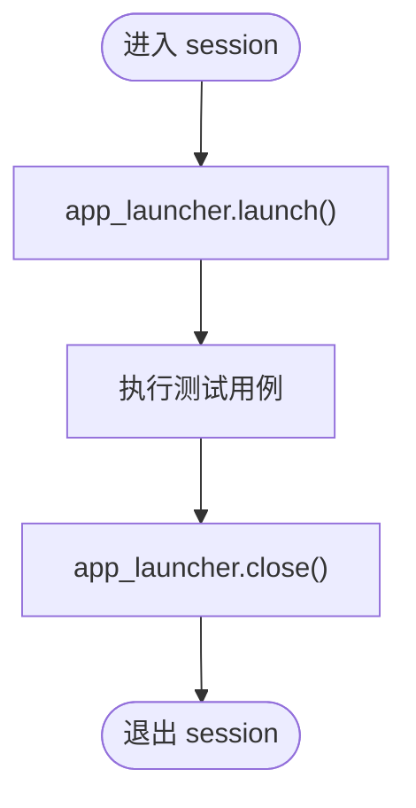
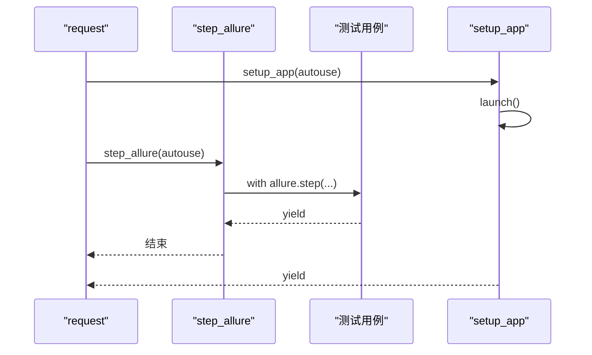
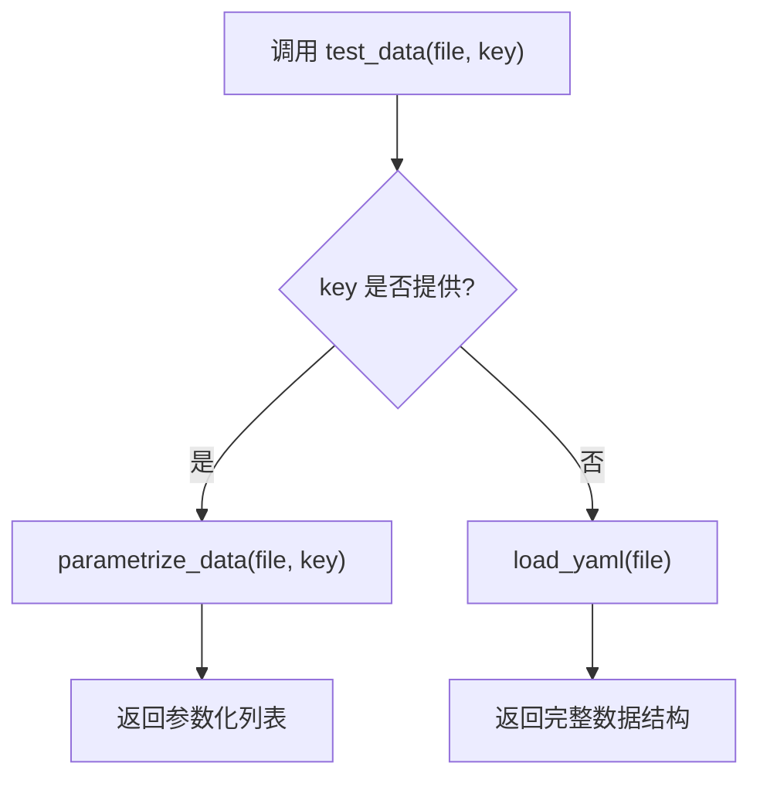
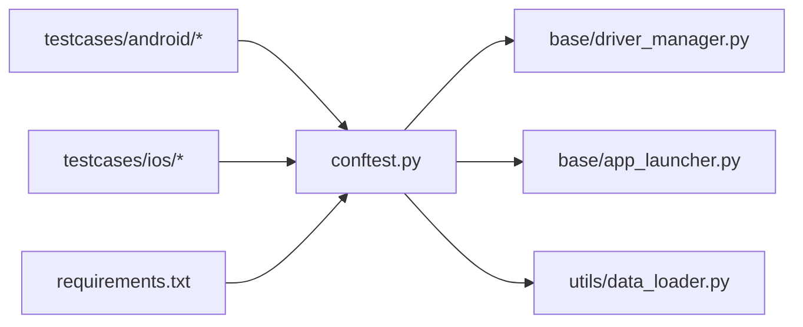

# fixtures机制详解

<cite>
**本文引用的文件**
- [conftest.py](file://conftest.py)
- [pytest.ini](file://pytest.ini)
- [requirements.txt](file://requirements.txt)
- [base/driver_manager.py](file://base/driver_manager.py)
- [base/app_launcher.py](file://base/app_launcher.py)
- [utils/data_loader.py](file://utils/data_loader.py)
- [testcases/android/test_login.py](file://testcases/android/test_login.py)
- [testcases/ios/test_login.py](file://testcases/ios/test_login.py)
- [data/test_data.yaml](file://data/test_data.yaml)
</cite>

## 目录
1. [引言](#引言)
2. [项目结构](#项目结构)
3. [核心组件](#核心组件)
4. [架构总览](#架构总览)
5. [详细组件分析](#详细组件分析)
6. [依赖分析](#依赖分析)
7. [性能考虑](#性能考虑)
8. [故障排查指南](#故障排查指南)
9. [结论](#结论)
10. [附录](#附录)

## 引言
本文件系统性梳理 AirTestUI 项目中的 pytest fixtures 机制，重点覆盖以下方面：
- 各类 fixture 的定义与职责：worker_id、device_info、airtest_device、platform、poco、app_launcher、setup_app、step_allure、test_data
- 生命周期管理：scope 级别、初始化顺序、依赖关系
- 自动 fixture（autouse）的工作原理与使用场景
- 最佳实践：参数化 fixture、条件 fixture、fixture 组合
- 调试与故障排查方法

## 项目结构
AirTestUI 采用分层组织与按平台划分的结构，fixtures 主要在全局 conftest.py 中集中定义，并通过基础模块（设备管理、应用启停、数据加载）实现具体能力。

图表来源
- [pytest.ini:1-47](file://pytest.ini#L1-L47)
- [requirements.txt:1-21](file://requirements.txt#L1-L21)
- [conftest.py:1-255](file://conftest.py#L1-L255)
- [base/driver_manager.py:1-188](file://base/driver_manager.py#L1-L188)
- [base/app_launcher.py:1-127](file://base/app_launcher.py#L1-L127)
- [utils/data_loader.py:1-128](file://utils/data_loader.py#L1-L128)

章节来源
- [pytest.ini:1-47](file://pytest.ini#L1-L47)
- [requirements.txt:1-21](file://requirements.txt#L1-L21)
- [conftest.py:1-255](file://conftest.py#L1-L255)

## 核心组件
本节概述各 fixture 的职责与典型用途，便于快速定位与使用。

- worker_id：标识当前分布式 worker 编号，用于设备分配去重与并发隔离
- device_info：封装设备平台、序列号/UUID、Airtest 设备句柄；负责 session 级别的分配与释放
- airtest_device：设置当前 Airtest 设备上下文并返回设备句柄
- platform：从设备信息中抽取平台类型（android/ios），供其他 fixture 条件分支使用
- poco：根据平台动态创建 Poco 实例，失败时降级为 None
- app_launcher：封装 APP 启动/关闭/重启/安装/清数据等生命周期操作
- setup_app：autouse 的 session 级自动启停，贯穿整个测试会话
- step_allure：autouse 的请求级步骤包装，自动将每个测试用例记录为 Allure 步骤
- test_data：session 级数据加载工厂，支持 YAML/JSON/Excel，可直接返回参数化数据

章节来源
- [conftest.py:142-254](file://conftest.py#L142-L254)
- [base/driver_manager.py:20-49](file://base/driver_manager.py#L20-L49)
- [base/app_launcher.py:20-127](file://base/app_launcher.py#L20-L127)
- [utils/data_loader.py:18-128](file://utils/data_loader.py#L18-L128)

## 架构总览
下图展示 fixtures 的依赖关系与调用链，体现从底层设备到上层 Poco 的装配过程，以及自动启停与 Allure 步骤的横切关注点。

图表来源
- [conftest.py:151-254](file://conftest.py#L151-L254)

## 详细组件分析

### 设备与平台相关 fixtures
- worker_id：从环境变量中解析当前 worker 编号，master 为 0，gwX 对应 X
- device_info：基于 worker_id 从 DriverManager 设备池分配设备；yield 前后分别进行连接与释放
- airtest_device：设置当前 Airtest 设备上下文并返回设备句柄
- platform：从设备信息中读取平台类型

图表来源
- [conftest.py:142-182](file://conftest.py#L142-L182)
- [base/driver_manager.py:119-167](file://base/driver_manager.py#L119-L167)

章节来源
- [conftest.py:142-182](file://conftest.py#L142-L182)
- [base/driver_manager.py:51-187](file://base/driver_manager.py#L51-L187)

### Poco 与 APP 启停相关 fixtures
- poco：根据 platform 动态导入并实例化 AndroidUiautomationPoco 或 IOSPoco；失败时记录警告并返回 None
- app_launcher：根据平台读取包名/Bundle ID 与安装路径，提供启动/关闭/重启/安装/清数据能力
- setup_app：autouse 的 session 级自动启停，贯穿测试会话生命周期

图表来源
- [conftest.py:185-227](file://conftest.py#L185-L227)
- [base/app_launcher.py:49-127](file://base/app_launcher.py#L49-L127)

章节来源
- [conftest.py:185-227](file://conftest.py#L185-L227)
- [base/app_launcher.py:20-127](file://base/app_launcher.py#L20-L127)

### 自动 fixture（autouse）
- step_allure：每个测试请求自动包裹为 Allure 步骤，便于报告可视化
- setup_app：在 session 开始前启动 APP，在 session 结束后关闭 APP

图表来源
- [conftest.py:217-236](file://conftest.py#L217-L236)

章节来源
- [conftest.py:217-236](file://conftest.py#L217-L236)

### 测试数据加载 fixture（test_data）
- 提供 session 级工厂函数，支持加载 YAML/JSON/Excel，并可按 key 提取参数化数据
- 适用于参数化测试与数据驱动场景

图表来源
- [conftest.py:238-254](file://conftest.py#L238-L254)
- [utils/data_loader.py:85-128](file://utils/data_loader.py#L85-L128)

章节来源
- [conftest.py:238-254](file://conftest.py#L238-L254)
- [utils/data_loader.py:18-128](file://utils/data_loader.py#L18-L128)

## 依赖分析
- 外部依赖：pytest、pytest-xdist、airtest、pocoui、allure-pytest、openpyxl、pillow 等
- 内部依赖：conftest.py 依赖 driver_manager 与 app_launcher；test_data 依赖 data_loader；测试用例依赖页面对象与 fixtures

图表来源
- [requirements.txt:1-21](file://requirements.txt#L1-L21)
- [conftest.py:14-20](file://conftest.py#L14-L20)

章节来源
- [requirements.txt:1-21](file://requirements.txt#L1-L21)
- [conftest.py:14-20](file://conftest.py#L14-L20)

## 性能考虑
- 设备分配策略：DriverManager 在多 worker 场景下优先按序分配，若设备不足则轮询复用，注意复用时的连接状态与稳定性
- Poco 初始化：按平台选择引擎，失败降级为 None，避免阻塞测试；建议在 CI 中确保对应平台引擎可用
- APP 启停：setup_app 在 session 级执行一次启动与一次关闭，减少重复开销
- 并发与重试：pytest.ini 启用 n auto 并发与 reruns 重试，结合 fixtures 的 session 级缓存可提升吞吐

## 故障排查指南
- 设备分配失败
  - 现象：RuntimeError“设备池为空”
  - 排查：确认配置中 Android/iOS 设备列表是否正确；检查 DRIVER_MANAGER 的初始化日志
  - 参考
    - [base/driver_manager.py:81-101](file://base/driver_manager.py#L81-L101)
    - [base/driver_manager.py:150](file://base/driver_manager.py#L150)
- Poco 初始化异常
  - 现象：Poco 返回 None 并记录警告
  - 排查：确认平台引擎库是否安装；检查 airtest_device 是否成功 set_current
  - 参考
    - [conftest.py:191-207](file://conftest.py#L191-L207)
- APP 启动失败
  - 现象：启动异常并抛出错误
  - 排查：核对包名/Bundle ID 与安装路径；查看 app_launcher 的日志
  - 参考
    - [base/app_launcher.py:55-74](file://base/app_launcher.py#L55-L74)
- 并发冲突
  - 现象：多 worker 抢占同一设备导致不稳定
  - 排查：确认 pytest.ini 的并发参数与设备数量匹配；观察设备复用警告
  - 参考
    - [pytest.ini:18-21](file://pytest.ini#L18-L21)
    - [base/driver_manager.py:141-148](file://base/driver_manager.py#L141-L148)
- 数据加载问题
  - 现象：参数化数据为空或格式不支持
  - 排查：确认文件扩展名与 key；检查 data_loader 的路径解析
  - 参考
    - [utils/data_loader.py:101-119](file://utils/data_loader.py#L101-L119)
    - [utils/data_loader.py:122-128](file://utils/data_loader.py#L122-L128)

## 结论
AirTestUI 的 fixtures 体系以 session 级设备与平台能力为核心，结合 autouse 的 APP 生命周期管理与 Allure 步骤包装，形成稳定高效的移动端自动化测试基座。通过参数化数据加载与条件化的 Poco 引擎选择，进一步提升了跨平台与数据驱动的灵活性。

## 附录

### fixture 生命周期与初始化顺序速查
- scope 级别
  - session：进程内仅一次，适合设备、平台、Poco、APP 启停
  - request：每个测试请求一次，适合步骤包装
- 初始化顺序
  - worker_id → device_info → airtest_device → platform → poco
  - app_launcher → setup_app（autouse）
  - step_allure（autouse）
  - test_data
- 释放顺序
  - device_info 在 session 结束时释放设备

章节来源
- [conftest.py:151-236](file://conftest.py#L151-L236)

### 使用示例与最佳实践
- 参数化测试
  - 使用 test_data 工厂加载 YAML/Excel 并按 key 提取参数化列表
  - 示例参考
    - [testcases/android/test_login.py:1-70](file://testcases/android/test_login.py#L1-L70)
    - [data/test_data.yaml:1-51](file://data/test_data.yaml#L1-L51)
- 条件 fixture
  - 根据 platform 条件导入不同 Poco 引擎
  - 参考
    - [conftest.py:185-207](file://conftest.py#L185-L207)
- fixture 组合
  - 在页面对象构造中组合使用 poco、platform、airtest_device
  - 参考
    - [testcases/ios/test_login.py:21-24](file://testcases/ios/test_login.py#L21-L24)
    - [testcases/android/test_login.py:23-26](file://testcases/android/test_login.py#L23-L26)