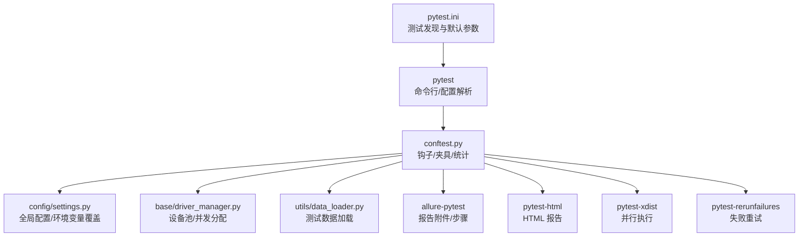
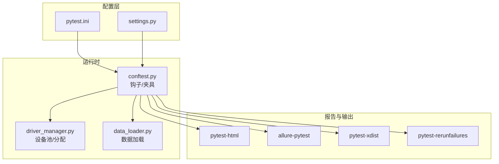
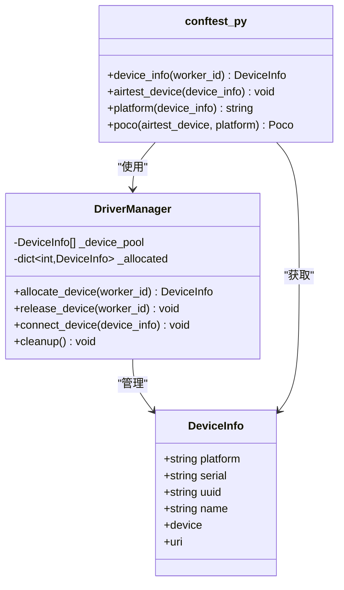
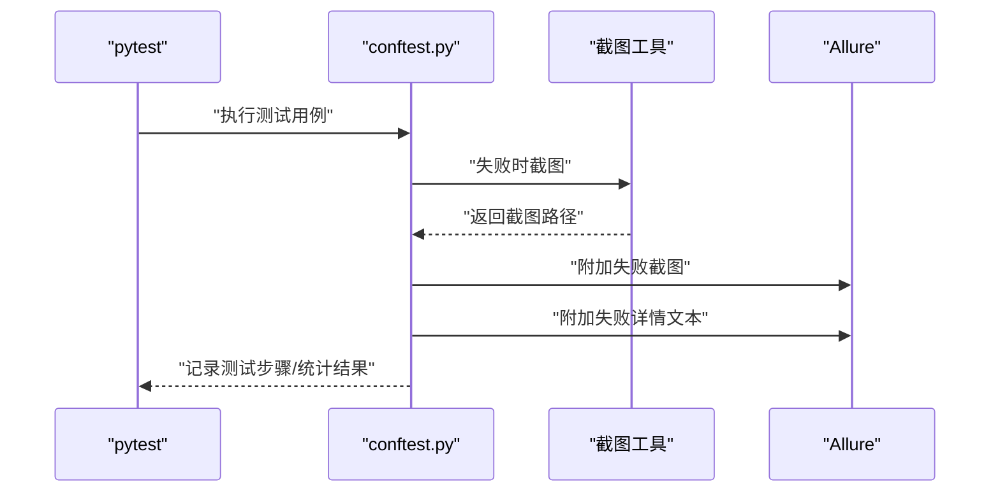
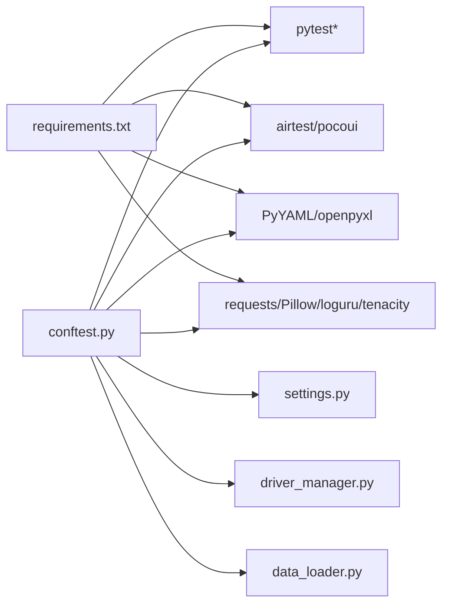

# pytest集成配置

<cite>
**本文引用的文件**
- [pytest.ini](file://pytest.ini)
- [conftest.py](file://conftest.py)
- [requirements.txt](file://requirements.txt)
- [settings.py](file://config/settings.py)
- [driver_manager.py](file://base/driver_manager.py)
- [data_loader.py](file://utils/data_loader.py)
</cite>

## 目录
1. [简介](#简介)
2. [项目结构](#项目结构)
3. [核心组件](#核心组件)
4. [架构总览](#架构总览)
5. [详细组件分析](#详细组件分析)
6. [依赖分析](#依赖分析)
7. [性能考虑](#性能考虑)
8. [故障排查指南](#故障排查指南)
9. [结论](#结论)
10. [附录](#附录)

## 简介
本文件系统性梳理 AirTestUI 项目中的 pytest 集成配置与实现，重点涵盖以下方面：
- pytest 配置文件的各项设置及其作用
- conftest.py 的全局配置、钩子函数、夹具（fixture）与多设备并发机制
- pytest.ini 的配置项说明与默认运行参数
- 命令行参数使用指南（并行执行、测试过滤、输出格式等）
- 常见配置问题的排查与解决方案

## 项目结构
AirTestUI 的测试框架围绕 pytest 构建，核心配置集中在根目录的 pytest.ini 与 conftest.py，配合配置管理模块、设备管理器与工具库，形成完整的移动端自动化测试体系。

图表来源
- [pytest.ini:1-47](file://pytest.ini#L1-L47)
- [conftest.py:1-255](file://conftest.py#L1-L255)
- [settings.py:1-112](file://config/settings.py#L1-L112)
- [driver_manager.py:1-188](file://base/driver_manager.py#L1-L188)
- [data_loader.py:50-127](file://utils/data_loader.py#L50-L127)

章节来源
- [pytest.ini:1-47](file://pytest.ini#L1-L47)
- [conftest.py:1-255](file://conftest.py#L1-L255)

## 核心组件
- pytest.ini：定义测试发现路径、文件/类/函数命名规则、默认命令行参数、自定义标记、日志配置、忽略目录与最小版本要求。
- conftest.py：全局钩子与夹具，负责 Allure 环境注入、测试收集时的平台标记、失败截图与报告、测试会话统计与通知、多设备并发分配与设备生命周期管理、Poco 初始化、应用启停管理、测试数据加载夹具等。
- settings.py：全局配置加载与环境变量覆盖机制，提供便捷访问函数（如环境、超时、设备列表、APP 配置）。
- driver_manager.py：设备池初始化、按 worker 分配设备、连接/断开设备、复用策略与清理。
- data_loader.py：支持 YAML/JSON/XLSX 的测试数据加载与参数化数据格式化。

章节来源
- [pytest.ini:1-47](file://pytest.ini#L1-L47)
- [conftest.py:1-255](file://conftest.py#L1-L255)
- [settings.py:1-112](file://config/settings.py#L1-L112)
- [driver_manager.py:1-188](file://base/driver_manager.py#L1-L188)
- [data_loader.py:50-127](file://utils/data_loader.py#L50-L127)

## 架构总览
下图展示 pytest 集成在 AirTestUI 中的整体架构与交互关系：

图表来源
- [pytest.ini:1-47](file://pytest.ini#L1-L47)
- [conftest.py:1-255](file://conftest.py#L1-L255)
- [settings.py:1-112](file://config/settings.py#L1-L112)
- [driver_manager.py:1-188](file://base/driver_manager.py#L1-L188)
- [data_loader.py:50-127](file://utils/data_loader.py#L50-L127)

## 详细组件分析

### pytest.ini 配置详解
- 测试发现路径与命名规则
  - testpaths：限定测试用例搜索目录为 testcases。
  - python_files/python_classes/python_functions：约束文件/类/函数命名，确保符合约定式发现。
- 默认命令行参数 addopts
  - -v：详细输出。
  - --tb=short：简短回溯信息。
  - --alluredir 与 --clean-alluredir：生成 Allure 结果并清理旧结果。
  - --self-contained-html：HTML 报告内嵌资源。
  - --html：生成 HTML 报告文件路径。
  - -n auto 与 --dist=loadfile：启用并行执行与按文件分发策略。
  - --reruns 与 --reruns-delay：失败重试次数与间隔。
- 自定义标记 markers
  - 平台标记：android、ios
  - 测试类型：smoke（冒烟）、regression（回归）
  - 优先级：p0/p1/p2
  - CI 控制：skip_ci
- 日志配置
  - CLI 日志与文件日志开启、级别与格式。
- 忽略目录 norecursedirs
  - 排除 .git、.idea、__pycache__、venv、resources、data 等目录。
- 最小版本 minversion
  - 限制 pytest 最低版本为 7.0。

章节来源
- [pytest.ini:1-47](file://pytest.ini#L1-L47)

### conftest.py 全局配置与钩子
- pytest_configure
  - 初始化测试开始时间。
  - 当存在 --alluredir 时，写入 Allure 环境属性（环境、平台、框架）。
- pytest_collection_modifyitems
  - 在收集阶段为用例自动添加平台标记（android/ios），依据用例文件路径。
- pytest_runtest_makereport（钩子包装）
  - 统计测试结果（总数、通过、失败、跳过、错误）。
  - 失败时自动截图并附加到 Allure；同时附加失败详情文本。
- pytest_sessionfinish
  - 输出测试汇总信息（总计、通过、失败、跳过、耗时、环境）。
  - 构造报告摘要并发送通知（标题与内容由工具函数生成）。
- 失败截图辅助函数
  - 使用截图工具在失败时捕获屏幕并附加到 Allure 报告。

章节来源
- [conftest.py:37-117](file://conftest.py#L37-L117)
- [conftest.py:119-139](file://conftest.py#L119-L139)

### 夹具（Fixture）体系
- worker_id
  - 获取当前 worker 编号，用于设备分配与日志标识。
- device_info
  - 依据 worker_id 从设备池中分配设备，支持会话级生命周期管理（分配/释放）。
- airtest_device
  - 将当前设备设置为 Airtest 当前设备上下文。
- platform
  - 返回设备平台（android/ios）。
- poco
  - 根据平台选择 Poco 引擎（Android 使用 uiautomation，iOS 使用原生 iOS 引擎），失败时降级为图像识别模式。
- app_launcher
  - APP 启停管理器，用于测试会话前后启动与关闭目标应用。
- setup_app（autouse）
  - 自动在测试会话开始前启动应用，结束后关闭，打印会话开始/结束日志。
- step_allure（autouse）
  - 将每个测试用例自动记录为 Allure 步骤。
- test_data
  - 测试数据加载夹具，支持 YAML/JSON/XLSX，可按键名提取参数化数据。

章节来源
- [conftest.py:142-255](file://conftest.py#L142-L255)

### 多设备并发与设备池
- 设备池初始化
  - 从配置中读取 Android/iOS 设备列表，构建设备池。
- 设备分配策略
  - 按 worker_id 顺序分配；若设备不足，采用轮询复用策略。
  - 支持连接/断开设备，线程安全。
- 生命周期管理
  - 会话开始前分配设备，会话结束后释放设备；支持清理方法。

图表来源
- [driver_manager.py:20-188](file://base/driver_manager.py#L20-L188)
- [conftest.py:151-208](file://conftest.py#L151-L208)

章节来源
- [driver_manager.py:51-188](file://base/driver_manager.py#L51-L188)
- [conftest.py:142-208](file://conftest.py#L142-L208)

### 测试数据加载与参数化
- 支持格式：YAML、JSON、Excel（xlsx/xls）。
- 参数化数据格式化：返回列表以供 @pytest.mark.parametrize 使用。
- 路径解析：支持绝对/相对路径，相对路径基于数据目录。

章节来源
- [data_loader.py:85-127](file://utils/data_loader.py#L85-L127)

### Allure 报告与失败截图流程

图表来源
- [conftest.py:62-87](file://conftest.py#L62-L87)
- [conftest.py:119-139](file://conftest.py#L119-L139)

## 依赖分析
- 插件依赖
  - pytest>=7.4.0、pytest-xdist>=3.3.0、pytest-html>=4.0.0、allure-pytest>=2.13.0、pytest-rerunfailures>=12.0.0。
  - Airtest>=1.3.0、pocoui>=1.0.90。
  - 配置与数据：PyYAML>=6.0、openpyxl>=3.1.0。
  - 工具库：requests>=2.31.0、Pillow>=10.0.0、loguru>=0.7.0、tenacity>=8.2.0。
- 运行时依赖
  - conftest.py 依赖 settings.py 提供的环境与设备配置。
  - driver_manager.py 依赖 settings.py 的设备列表与超时配置。
  - data_loader.py 依赖 openpyxl（Excel）与 PyYAML（YAML/JSON）。

图表来源
- [requirements.txt:1-21](file://requirements.txt#L1-L21)
- [conftest.py:14-19](file://conftest.py#L14-L19)
- [settings.py:10-112](file://config/settings.py#L10-L112)
- [driver_manager.py:10-14](file://base/driver_manager.py#L10-L14)
- [data_loader.py:50-127](file://utils/data_loader.py#L50-L127)

章节来源
- [requirements.txt:1-21](file://requirements.txt#L1-L21)
- [conftest.py:14-19](file://conftest.py#L14-L19)
- [settings.py:10-112](file://config/settings.py#L10-L112)
- [driver_manager.py:10-14](file://base/driver_manager.py#L10-L14)
- [data_loader.py:50-127](file://utils/data_loader.py#L50-L127)

## 性能考虑
- 并行执行
  - -n auto 与 --dist=loadfile 可提升执行效率，建议结合设备池容量合理设置 worker 数量。
- 失败重试
  - --reruns 与 --reruns-delay 可降低偶发失败对结果的影响，但会增加总执行时间。
- 报告生成
  - --self-contained-html 与 --html 会增加磁盘 IO 与内存占用，建议在需要时启用。
- 设备复用
  - 当设备数小于 worker 数时，采用轮询复用策略，可能影响测试隔离性；建议按设备数规划并行度。

## 故障排查指南
- Allure 环境信息未生成
  - 检查是否传入 --alluredir 或是否启用默认 addopts；确认 pytest_configure 钩子执行。
  - 参考路径：[pytest_configure:37-50](file://conftest.py#L37-L50)
- 平台标记缺失导致筛选无效
  - 确认用例文件位于 testcases 目录且路径包含 android/ios；检查 pytest_collection_modifyitems 是否生效。
  - 参考路径：[pytest_collection_modifyitems:52-60](file://conftest.py#L52-L60)
- 并行执行设备冲突或分配失败
  - 检查设备池初始化是否正确（Android/iOS 设备列表）；确认 worker 数量与设备数匹配。
  - 参考路径：[driver_manager 初始化与分配:81-150](file://base/driver_manager.py#L81-L150)
- 失败截图未附加到 Allure
  - 确认失败时调用截图逻辑与附件写入；检查异常捕获与日志提示。
  - 参考路径：[_attach_failure_screenshot:119-139](file://conftest.py#L119-L139)
- 测试数据加载失败
  - 检查文件格式与路径；确认 YAML/JSON 键名或 Excel 表头是否存在。
  - 参考路径：[parametrize_data:85-127](file://utils/data_loader.py#L85-L127)
- 日志输出不符合预期
  - 检查 pytest.ini 中 log_cli/log_file 配置；确认日志级别与格式。
  - 参考路径：[pytest.ini 日志配置:34-40](file://pytest.ini#L34-L40)
- 版本不兼容
  - 确认 pytest 版本满足 minversion；升级至推荐版本范围。
  - 参考路径：[minversion:45-47](file://pytest.ini#L45-L47)

章节来源
- [conftest.py:37-50](file://conftest.py#L37-L50)
- [conftest.py:52-60](file://conftest.py#L52-L60)
- [driver_manager.py:81-150](file://base/driver_manager.py#L81-L150)
- [conftest.py:119-139](file://conftest.py#L119-L139)
- [data_loader.py:85-127](file://utils/data_loader.py#L85-L127)
- [pytest.ini:34-40](file://pytest.ini#L34-L40)
- [pytest.ini:45-47](file://pytest.ini#L45-L47)

## 结论
AirTestUI 的 pytest 集成通过 pytest.ini 的统一配置与 conftest.py 的钩子/夹具体系，实现了：
- 明确的测试发现规则与默认运行参数
- 平台标记与多设备并发分配
- 失败自动截图与 Allure 报告增强
- 测试数据加载与参数化支持
- 会话级统计与通知机制

建议在团队内统一遵循上述配置与最佳实践，确保跨平台、跨设备的稳定执行与可观测性。

## 附录

### 常用命令行参数速查
- 并行执行
  - -n auto：自动根据 CPU 核心数设置 worker 数
  - --dist=loadfile：按文件分发策略
- 测试过滤
  - -k 表达式：按名称过滤
  - -m 标记：按自定义标记过滤（如 android/ios/smoke/regression/p0/p1/p2/skip_ci）
  - --maxfail=N：遇到 N 个失败后停止
- 输出与报告
  - --tb=short/long/line：回溯信息风格
  - --html=reports/report.html：生成 HTML 报告
  - --self-contained-html：内嵌资源
  - --alluredir=results：生成 Allure 结果目录
  - --clean-alluredir：清理旧结果
- 重试与稳定性
  - --reruns N：失败重试次数
  - --reruns-delay M：重试间隔秒数
- 日志
  - -v：详细输出
  - --log-cli-level/--log-file-level：CLI/文件日志级别
  - --log-cli-format/--log-file-format：日志格式

### 配置项对照表
- 测试发现
  - testpaths：testcases
  - python_files：test_*.py
  - python_classes：Test*
  - python_functions：test_*
- 默认参数 addopts
  - -v、--tb=short、--alluredir、--clean-alluredir、--self-contained-html、--html、-n auto、--dist=loadfile、--reruns、--reruns-delay
- 自定义标记
  - android、ios、smoke、regression、p0、p1、p2、skip_ci
- 日志
  - log_cli、log_cli_level、log_cli_format、log_file、log_file_level、log_file_format
- 忽略目录
  - norecursedirs：.git .idea __pycache__ venv resources data
- 最小版本
  - minversion：7.0

章节来源
- [pytest.ini:1-47](file://pytest.ini#L1-L47)