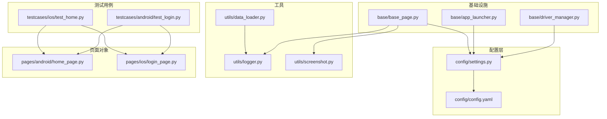
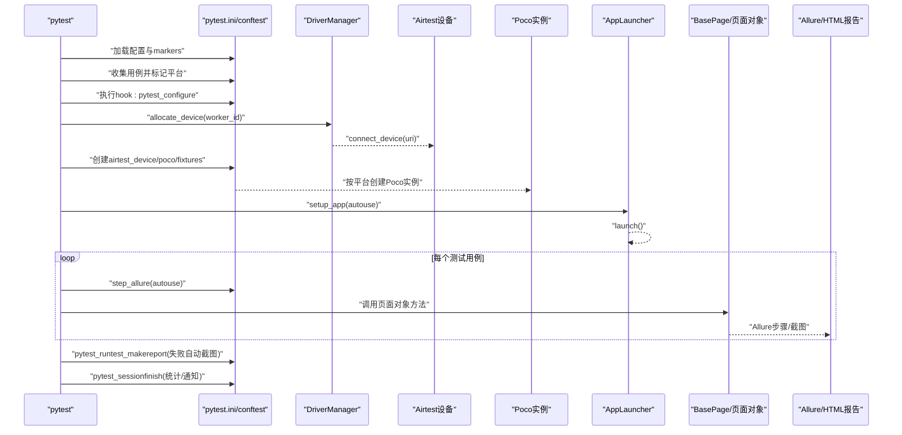
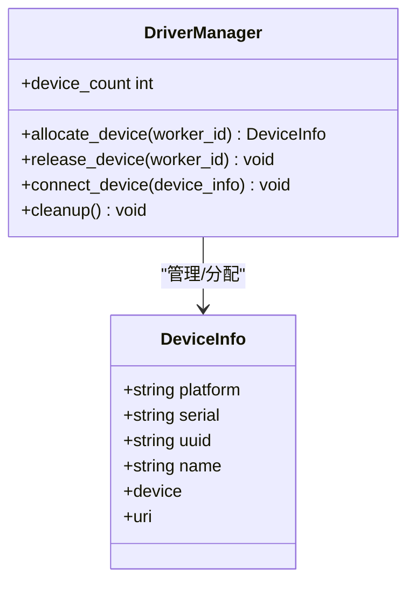
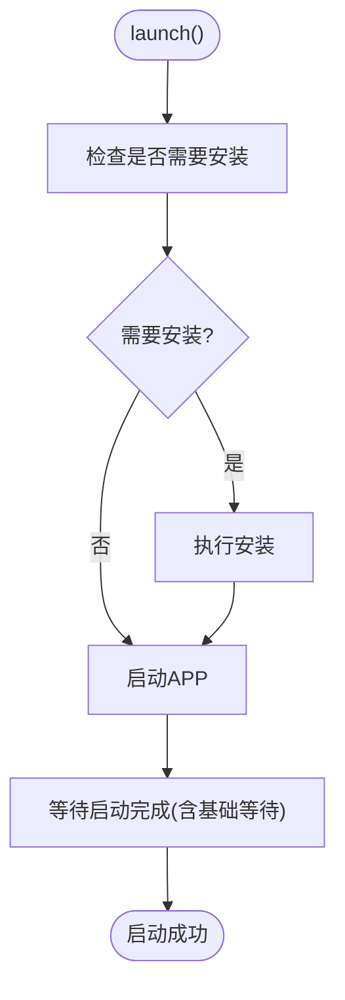
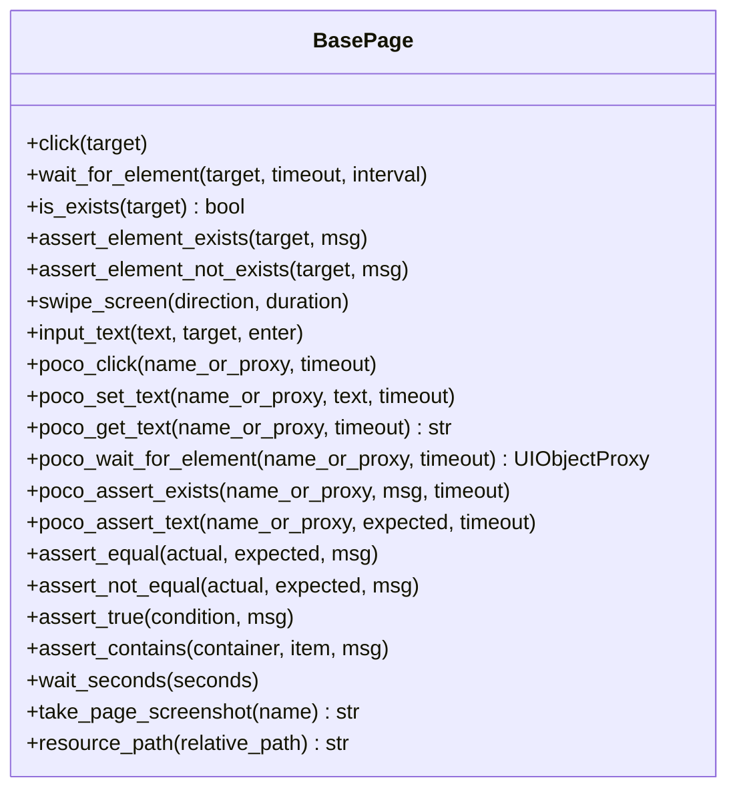
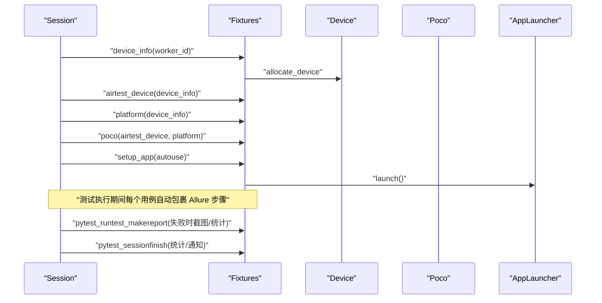
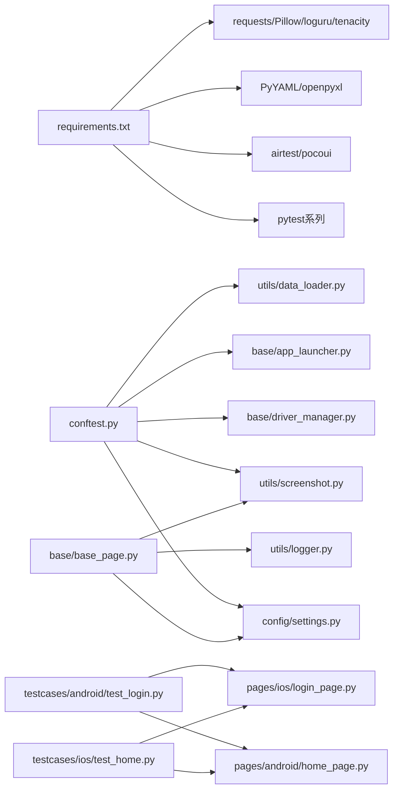

# 测试执行框架

<cite>
**本文引用的文件**
- [conftest.py](file://conftest.py)
- [pytest.ini](file://pytest.ini)
- [config/settings.py](file://config/settings.py)
- [config/config.yaml](file://config/config.yaml)
- [requirements.txt](file://requirements.txt)
- [base/driver_manager.py](file://base/driver_manager.py)
- [base/app_launcher.py](file://base/app_launcher.py)
- [base/base_page.py](file://base/base_page.py)
- [utils/data_loader.py](file://utils/data_loader.py)
- [utils/logger.py](file://utils/logger.py)
- [utils/screenshot.py](file://utils/screenshot.py)
- [testcases/android/test_login.py](file://testcases/android/test_login.py)
- [testcases/ios/test_home.py](file://testcases/ios/test_home.py)
- [pages/android/home_page.py](file://pages/android/home_page.py)
- [pages/ios/login_page.py](file://pages/ios/login_page.py)
</cite>

## 目录
1. [简介](#简介)
2. [项目结构](#项目结构)
3. [核心组件](#核心组件)
4. [架构总览](#架构总览)
5. [详细组件分析](#详细组件分析)
6. [依赖分析](#依赖分析)
7. [性能考虑](#性能考虑)
8. [故障排查指南](#故障排查指南)
9. [结论](#结论)
10. [附录](#附录)

## 简介
本文件系统性梳理 AirTestUI 测试执行框架，重点围绕 pytest 集成配置与 fixtures 机制展开，涵盖设备分配、Poco 实例创建、APP 生命周期管理、测试用例组织与命名规范、执行流程与报告链路、最佳实践（断言策略、数据驱动与参数化）、以及性能优化与并发控制策略。文档面向不同技术背景读者，既提供高层概览也给出代码级映射与可视化图表。

## 项目结构
项目采用“分层+按平台组织”的结构：核心能力集中在 base、config、utils；测试用例按平台划分；页面对象同样按平台组织；资源文件集中于 resources。

**图表来源**
- [config/config.yaml:1-70](file://config/config.yaml#L1-L70)
- [config/settings.py:1-112](file://config/settings.py#L1-L112)
- [base/driver_manager.py:1-188](file://base/driver_manager.py#L1-L188)
- [base/app_launcher.py:1-127](file://base/app_launcher.py#L1-L127)
- [base/base_page.py:1-320](file://base/base_page.py#L1-L320)
- [utils/logger.py:1-59](file://utils/logger.py#L1-L59)
- [utils/screenshot.py:1-89](file://utils/screenshot.py#L1-L89)
- [utils/data_loader.py:1-128](file://utils/data_loader.py#L1-L128)
- [testcases/android/test_login.py:1-71](file://testcases/android/test_login.py#L1-L71)
- [testcases/ios/test_home.py:1-38](file://testcases/ios/test_home.py#L1-L38)
- [pages/android/home_page.py:1-58](file://pages/android/home_page.py#L1-L58)
- [pages/ios/login_page.py:1-65](file://pages/ios/login_page.py#L1-L65)

**章节来源**
- [pytest.ini:1-47](file://pytest.ini#L1-L47)
- [config/config.yaml:1-70](file://config/config.yaml#L1-L70)
- [config/settings.py:1-112](file://config/settings.py#L1-L112)

## 核心组件
- 配置体系：通过 YAML 配置文件与环境变量覆盖机制，集中管理环境、超时、设备、APP、报告、通知等配置项。
- 设备管理：DriverManager 提供设备池初始化、按 worker 分配与复用、连接生命周期管理。
- APP 生命周期：AppLauncher 负责启动、关闭、重启、清数据、安装等。
- 页面对象基类：BasePage 封装 airtest/poco 操作，提供统一断言、等待、截图、Allure 步骤等能力。
- fixtures 与钩子：conftest.py 定义设备、Poco、APP 生命周期、自动 Allure 步骤、失败截图、结果统计与通知。
- 数据驱动：data_loader 支持 YAML/JSON/Excel，parametrize_data 输出 pytest 参数化列表。
- 日志与截图：logger 提供结构化日志；screenshot 提供本地保存与 Allure 附件。

**章节来源**
- [config/settings.py:1-112](file://config/settings.py#L1-L112)
- [config/config.yaml:1-70](file://config/config.yaml#L1-L70)
- [base/driver_manager.py:1-188](file://base/driver_manager.py#L1-L188)
- [base/app_launcher.py:1-127](file://base/app_launcher.py#L1-L127)
- [base/base_page.py:1-320](file://base/base_page.py#L1-L320)
- [conftest.py:1-255](file://conftest.py#L1-L255)
- [utils/data_loader.py:1-128](file://utils/data_loader.py#L1-L128)
- [utils/logger.py:1-59](file://utils/logger.py#L1-L59)
- [utils/screenshot.py:1-89](file://utils/screenshot.py#L1-L89)

## 架构总览
下图展示从测试发现到结果报告的完整链路，映射实际代码文件与调用关系。

**图表来源**
- [pytest.ini:1-47](file://pytest.ini#L1-L47)
- [conftest.py:1-255](file://conftest.py#L1-L255)
- [base/driver_manager.py:1-188](file://base/driver_manager.py#L1-L188)
- [base/app_launcher.py:1-127](file://base/app_launcher.py#L1-L127)
- [base/base_page.py:1-320](file://base/base_page.py#L1-L320)
- [utils/screenshot.py:1-89](file://utils/screenshot.py#L1-L89)

## 详细组件分析

### 配置与环境
- 配置来源与覆盖：config.yaml 为主配置，支持本地 local_config.yaml 合并，环境变量以特定前缀覆盖。
- 便捷函数：提供环境、超时、设备列表、APP 配置等访问函数，贯穿各组件。
- 作用域：settings 在 settings.py 中被全局持有，其他模块通过导入访问。

**章节来源**
- [config/config.yaml:1-70](file://config/config.yaml#L1-L70)
- [config/settings.py:1-112](file://config/settings.py#L1-L112)

### 设备管理与分配
- 设备池：根据配置文件初始化 Android/iOS 设备池，支持多设备并发。
- 分配策略：按 worker_id 顺序分配；若设备不足则循环复用；线程安全。
- 生命周期：连接建立、释放、清理；失败日志与异常处理。

**图表来源**
- [base/driver_manager.py:20-188](file://base/driver_manager.py#L20-L188)

**章节来源**
- [base/driver_manager.py:1-188](file://base/driver_manager.py#L1-L188)
- [config/config.yaml:44-70](file://config/config.yaml#L44-L70)

### APP 生命周期管理
- 功能：启动、关闭、重启、清数据、可选安装。
- 平台差异：Android 支持 Activity 启动与数据清理；iOS 以 Bundle ID 为主。
- 超时与等待：启动后基础等待与超时配置结合。

**图表来源**
- [base/app_launcher.py:49-75](file://base/app_launcher.py#L49-L75)

**章节来源**
- [base/app_launcher.py:1-127](file://base/app_launcher.py#L1-L127)
- [config/config.yaml:53-69](file://config/config.yaml#L53-L69)

### 页面对象基类与断言策略
- 双模式交互：图像识别（airtest）与 UI 树（poco）双通道，自动降级。
- 断言与等待：统一的等待、断言、截图、Allure 步骤封装。
- 资源路径：提供资源文件绝对路径工具，便于模板与图片定位。

**图表来源**
- [base/base_page.py:30-320](file://base/base_page.py#L30-L320)

**章节来源**
- [base/base_page.py:1-320](file://base/base_page.py#L1-L320)

### fixtures 机制与钩子
- 设备与平台：device_info、airtest_device、platform。
- Poco 实例：按平台创建 AndroidUiautomationPoco 或 IOSPoco，失败时降级为空。
- APP 生命周期：setup_app 自动启动与关闭。
- Allure 步骤：step_allure 将每个用例包装为 Allure 步骤。
- 结果统计与通知：pytest_runtest_makereport 统计并通过 notify 发送报告摘要。

**图表来源**
- [conftest.py:151-255](file://conftest.py#L151-L255)
- [base/driver_manager.py:119-150](file://base/driver_manager.py#L119-L150)
- [base/app_launcher.py:49-75](file://base/app_launcher.py#L49-L75)

**章节来源**
- [conftest.py:1-255](file://conftest.py#L1-L255)

### 测试用例组织与命名规范
- 搜索路径与命名：testcases 目录，文件/类/函数命名规则由 pytest.ini 指定。
- 平台标记：pytest_collection_modifyitems 自动为 android/ios 用例添加标记。
- 自定义标记：android、ios、smoke、regression、P0/P1/P2、skip_ci 等。
- 用例组织：按平台分目录（android/ios），类名以 Test* 开头，方法以 test_* 开头。

**章节来源**
- [pytest.ini:1-47](file://pytest.ini#L1-L47)
- [conftest.py:52-60](file://conftest.py#L52-L60)
- [testcases/android/test_login.py:1-71](file://testcases/android/test_login.py#L1-L71)
- [testcases/ios/test_home.py:1-38](file://testcases/ios/test_home.py#L1-L38)

### 数据驱动与参数化
- 数据加载：支持 YAML/JSON/Excel，自动解析路径。
- 参数化：parametrize_data 将数据转换为 pytest.mark.parametrize 可用格式。
- 使用建议：在测试类或函数上使用 @pytest.mark.parametrize 注解，结合 test_data fixture 动态加载。

**章节来源**
- [utils/data_loader.py:1-128](file://utils/data_loader.py#L1-L128)
- [conftest.py:238-255](file://conftest.py#L238-L255)

### 日志与截图
- 日志：基于 loguru，控制台彩色输出与文件轮转，支持 INFO/DEBUG/ERROR 多级别。
- 截图：统一保存目录与命名，失败自动截图并附加到 Allure；支持装饰器级失败截图。

**章节来源**
- [utils/logger.py:1-59](file://utils/logger.py#L1-L59)
- [utils/screenshot.py:1-89](file://utils/screenshot.py#L1-L89)
- [conftest.py:119-138](file://conftest.py#L119-L138)

## 依赖分析
- 外部依赖：pytest、pytest-xdist、pytest-html、allure-pytest、pytest-rerunfailures、airtest、pocoui、PyYAML、openpyxl、requests、Pillow、loguru、tenacity。
- 内部耦合：conftest 依赖 settings、driver_manager、app_launcher、screenshot、notification；base 组件依赖 settings；页面对象依赖 base_page 与资源路径；数据驱动依赖 config 与 openpyxl。

**图表来源**
- [requirements.txt:1-21](file://requirements.txt#L1-L21)
- [conftest.py:1-255](file://conftest.py#L1-L255)
- [config/settings.py:1-112](file://config/settings.py#L1-L112)
- [base/driver_manager.py:1-188](file://base/driver_manager.py#L1-L188)
- [base/app_launcher.py:1-127](file://base/app_launcher.py#L1-L127)
- [base/base_page.py:1-320](file://base/base_page.py#L1-L320)
- [utils/screenshot.py:1-89](file://utils/screenshot.py#L1-L89)
- [utils/data_loader.py:1-128](file://utils/data_loader.py#L1-L128)
- [testcases/android/test_login.py:1-71](file://testcases/android/test_login.py#L1-L71)
- [testcases/ios/test_home.py:1-38](file://testcases/ios/test_home.py#L1-L38)
- [pages/android/home_page.py:1-58](file://pages/android/home_page.py#L1-L58)
- [pages/ios/login_page.py:1-65](file://pages/ios/login_page.py#L1-L65)

**章节来源**
- [requirements.txt:1-21](file://requirements.txt#L1-L21)
- [conftest.py:1-255](file://conftest.py#L1-L255)

## 性能考虑
- 并发与分发：pytest.ini 启用 -n auto 与 --dist=loadfile，结合 pytest-xdist 实现按文件分发，减少锁竞争。
- 设备复用：当 worker 数大于设备数时，DriverManager 循环复用设备，避免空闲等待；建议合理规划设备数量与并发度。
- 超时与重试：通过 config.yaml 的 timeout 与 pytest.ini 的 reruns/reruns-delay 平衡稳定性与速度。
- 截图策略：screenshot.on_step 默认关闭，失败截图 on_failure 开启，避免高频截图影响性能。
- Poco 降级：Poco 初始化失败时降级为空，页面对象自动切换图像识别模式，保证执行连续性。

**章节来源**
- [pytest.ini:10-22](file://pytest.ini#L10-L22)
- [base/driver_manager.py:141-148](file://base/driver_manager.py#L141-L148)
- [config/config.yaml:9-24](file://config/config.yaml#L9-L24)
- [conftest.py:205-207](file://conftest.py#L205-L207)

## 故障排查指南
- 设备连接失败：检查 config.yaml 中设备序列号/UUID 与名称，确认 adb/idevice 支持；查看 DriverManager 的连接日志。
- Poco 初始化失败：确认平台与设备兼容，查看 conftest 中的降级逻辑与日志。
- APP 启动失败：核对包名/Bundle ID、Activity（Android）与安装路径；关注启动超时配置。
- 截图与报告：失败自动截图与 Allure 附件在 makereport 钩子中实现；如未生成，检查截图目录权限与 Allure 输出目录。
- 日志定位：使用 loguru 的文件轮转与 ERROR 级别日志快速定位问题。

**章节来源**
- [base/driver_manager.py:110-118](file://base/driver_manager.py#L110-L118)
- [base/app_launcher.py:55-75](file://base/app_launcher.py#L55-L75)
- [conftest.py:119-138](file://conftest.py#L119-L138)
- [utils/logger.py:1-59](file://utils/logger.py#L1-L59)
- [utils/screenshot.py:28-53](file://utils/screenshot.py#L28-L53)

## 结论
AirTestUI 测试执行框架通过清晰的分层设计与 pytest 生态深度融合，实现了设备与 APP 生命周期的自动化、页面对象的统一抽象、以及测试结果的可视化与可追溯。借助 fixtures 与钩子机制，框架在保证稳定性的同时提供了良好的扩展性与可维护性。建议在实际落地中结合设备资源与业务稳定性需求，合理配置并发度、超时与重试策略，并遵循统一的断言与数据驱动实践。

## 附录
- 测试用例编写要点
  - 使用页面对象封装交互，优先使用 Poco；必要时回退图像识别。
  - 断言尽量具体，结合 Allure 步骤与截图提升可读性。
  - 数据驱动优先使用 YAML/Excel；参数化时注意边界值与异常场景。
- 平台差异注意事项
  - Android：支持 Activity 启动、数据清理；iOS：以 Bundle ID 为主，检测能力有限。
- 报告与通知
  - Allure HTML 报告与 pytest-html 报告同时生成；可选钉钉/邮件通知。