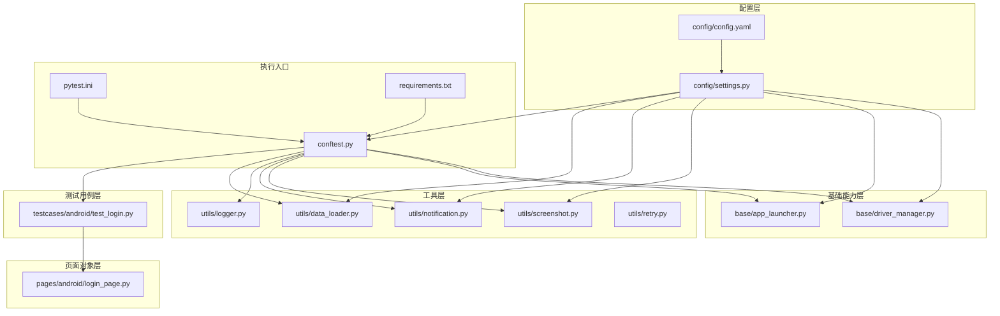
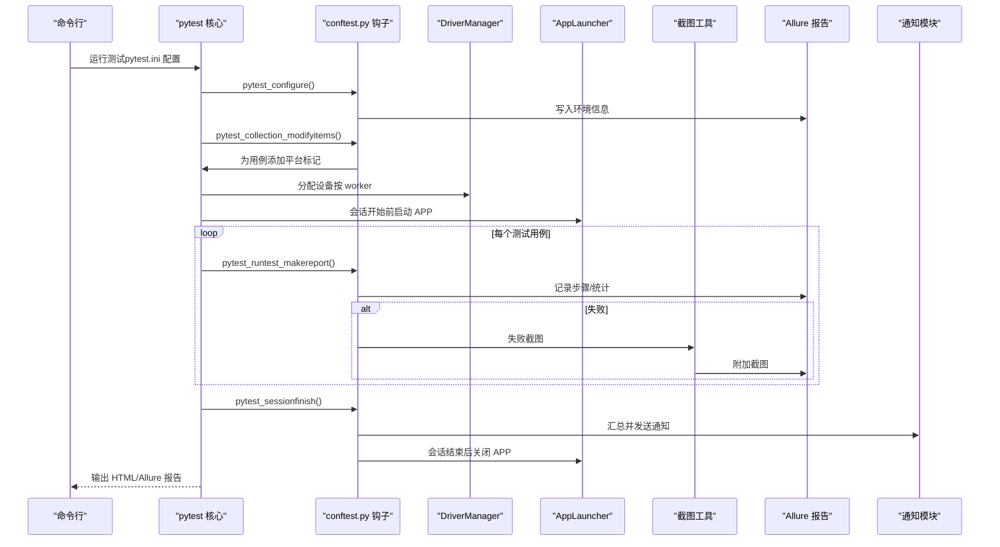
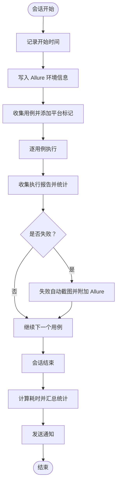
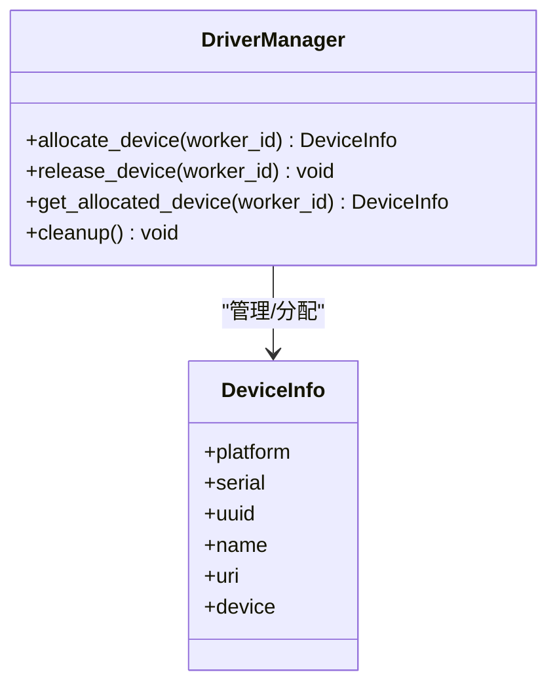
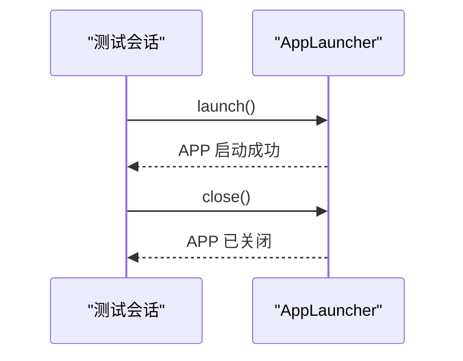
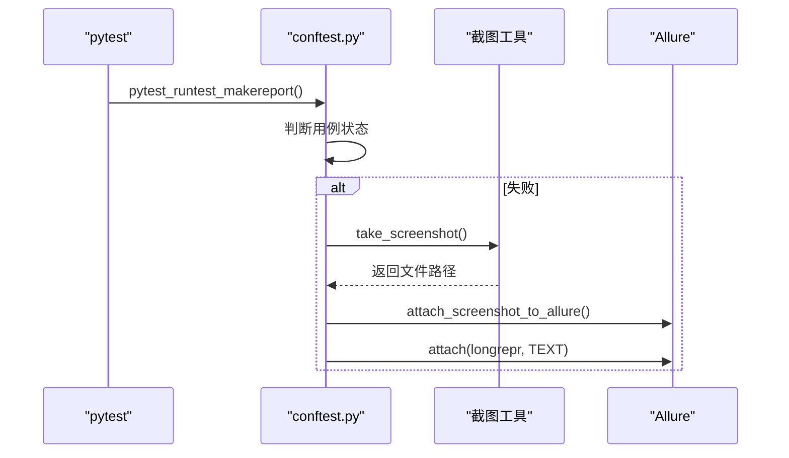
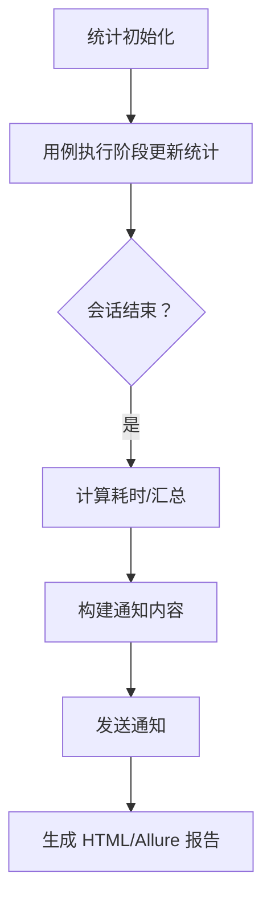
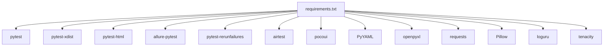

# 测试执行流程

<cite>
**本文引用的文件**
- [conftest.py](file://conftest.py)
- [pytest.ini](file://pytest.ini)
- [requirements.txt](file://requirements.txt)
- [config/settings.py](file://config/settings.py)
- [config/config.yaml](file://config/config.yaml)
- [utils/logger.py](file://utils/logger.py)
- [utils/screenshot.py](file://utils/screenshot.py)
- [utils/notification.py](file://utils/notification.py)
- [utils/data_loader.py](file://utils/data_loader.py)
- [utils/retry.py](file://utils/retry.py)
- [base/driver_manager.py](file://base/driver_manager.py)
- [base/app_launcher.py](file://base/app_launcher.py)
- [pages/android/login_page.py](file://pages/android/login_page.py)
- [testcases/android/test_login.py](file://testcases/android/test_login.py)
</cite>

## 目录
1. [简介](#简介)
2. [项目结构](#项目结构)
3. [核心组件](#核心组件)
4. [架构总览](#架构总览)
5. [详细组件分析](#详细组件分析)
6. [依赖分析](#依赖分析)
7. [性能考虑](#性能考虑)
8. [故障排查指南](#故障排查指南)
9. [结论](#结论)
10. [附录](#附录)

## 简介
本文件系统性梳理 AirTestUI 从“测试发现”到“结果报告”的完整执行链路，重点解释 pytest 钩子工作机制（如 pytest_collection_modifyitems、pytest_runtest_makereport、pytest_sessionfinish），以及测试结果统计、失败自动截图与 Allure 报告集成、通知推送、并发控制与性能优化策略、错误处理与异常恢复等关键环节。目标是帮助读者快速理解 AirTestUI 的测试执行流程，并在实践中高效落地。

## 项目结构
AirTestUI 采用分层组织：配置层（config）、基础能力层（base）、页面对象层（pages）、测试用例层（testcases）、工具层（utils）。核心入口为 pytest 配置与 conftest 钩子，配合设备管理、应用启停、截图与通知等工具模块，形成完整的自动化执行闭环。

图表来源
- [conftest.py:1-255](file://conftest.py#L1-L255)
- [pytest.ini:1-47](file://pytest.ini#L1-L47)
- [requirements.txt:1-21](file://requirements.txt#L1-L21)
- [config/settings.py:1-112](file://config/settings.py#L1-L112)
- [config/config.yaml:1-70](file://config/config.yaml#L1-L70)
- [base/driver_manager.py:1-188](file://base/driver_manager.py#L1-L188)
- [base/app_launcher.py:1-127](file://base/app_launcher.py#L1-L127)
- [utils/logger.py:1-59](file://utils/logger.py#L1-L59)
- [utils/screenshot.py:1-89](file://utils/screenshot.py#L1-L89)
- [utils/notification.py:1-167](file://utils/notification.py#L1-L167)
- [utils/data_loader.py:1-128](file://utils/data_loader.py#L1-L128)
- [utils/retry.py:1-102](file://utils/retry.py#L1-L102)
- [pages/android/login_page.py:1-107](file://pages/android/login_page.py#L1-L107)
- [testcases/android/test_login.py:1-71](file://testcases/android/test_login.py#L1-L71)

章节来源
- [conftest.py:1-255](file://conftest.py#L1-L255)
- [pytest.ini:1-47](file://pytest.ini#L1-L47)
- [requirements.txt:1-21](file://requirements.txt#L1-L21)

## 核心组件
- pytest 钩子与全局统计：在会话开始、用例收集、执行阶段、会话结束等节点进行统计、截图与通知。
- 设备与并发：通过 DriverManager 管理设备池，结合 pytest-xdist 的多 worker 并发，按 worker 分配设备。
- 应用启停：AppLauncher 在会话开始前启动 APP，在会话结束后关闭，确保测试环境一致性。
- 截图与 Allure：失败自动截图并附加到 Allure；每个用例自动记录为 Allure 步骤。
- 通知：会话结束时汇总结果并通过钉钉或邮件推送。
- 数据驱动：统一的数据加载器支持 YAML/JSON/Excel，配合 parametrize 生成多组用例。
- 重试：提供通用重试装饰器与 until-true 类重试，提升稳定性。

章节来源
- [conftest.py:23-138](file://conftest.py#L23-L138)
- [base/driver_manager.py:51-184](file://base/driver_manager.py#L51-L184)
- [base/app_launcher.py:20-127](file://base/app_launcher.py#L20-L127)
- [utils/screenshot.py:28-74](file://utils/screenshot.py#L28-L74)
- [utils/notification.py:22-167](file://utils/notification.py#L22-L167)
- [utils/data_loader.py:18-128](file://utils/data_loader.py#L18-L128)
- [utils/retry.py:13-102](file://utils/retry.py#L13-L102)

## 架构总览
下图展示从测试发现到报告生成的关键交互与数据流。

图表来源
- [conftest.py:37-117](file://conftest.py#L37-L117)
- [base/driver_manager.py:119-166](file://base/driver_manager.py#L119-L166)
- [base/app_launcher.py:49-92](file://base/app_launcher.py#L49-L92)
- [utils/screenshot.py:28-74](file://utils/screenshot.py#L28-L74)
- [utils/notification.py:128-167](file://utils/notification.py#L128-L167)
- [pytest.ini:11-22](file://pytest.ini#L11-L22)

## 详细组件分析

### pytest 钩子与执行阶段
- pytest_configure：会话开始时记录起始时间，并向 Allure 结果目录写入环境信息（环境、平台、框架）。
- pytest_collection_modifyitems：扫描用例文件路径，自动为 Android/iOS 用例打上相应标记，便于后续过滤与并发调度。
- pytest_runtest_makereport：在用例执行完成后收集结果，进行统计（总数/通过/失败/跳过/错误），并在失败时触发失败截图与 Allure 失败详情附件。
- pytest_sessionfinish：会话结束时计算总耗时，汇总统计，记录日志，并调用通知模块发送报告。

图表来源
- [conftest.py:37-117](file://conftest.py#L37-L117)

章节来源
- [conftest.py:37-117](file://conftest.py#L37-L117)

### 设备管理与并发控制
- DriverManager：单例设备池，按 worker_id 分配设备；若设备不足则复用连接；线程安全，支持 Android/iOS 设备。
- worker_id：从环境变量获取当前 worker 编号，master 为 0，gwX 为 X。
- 设备分配与释放：fixture 在 session 生命周期内分配设备并在结束时释放，避免资源泄露。
- 并发策略：pytest.ini 使用 -n auto 与 --dist=loadfile，按文件分发，减少跨设备干扰。

图表来源
- [base/driver_manager.py:51-184](file://base/driver_manager.py#L51-L184)

章节来源
- [base/driver_manager.py:51-184](file://base/driver_manager.py#L51-L184)
- [conftest.py:142-166](file://conftest.py#L142-L166)
- [pytest.ini:18-19](file://pytest.ini#L18-L19)

### 应用启停与会话生命周期
- AppLauncher：根据平台读取配置，支持启动、关闭、重启、清除数据与安装；启动时等待基础时间并记录日志。
- 自动启停：通过 autouse fixture 在会话开始前启动 APP，结束时关闭，保证测试前后环境一致。

图表来源
- [base/app_launcher.py:49-92](file://base/app_launcher.py#L49-L92)
- [conftest.py:217-227](file://conftest.py#L217-L227)

章节来源
- [base/app_launcher.py:20-127](file://base/app_launcher.py#L20-L127)
- [conftest.py:217-227](file://conftest.py#L217-L227)

### 失败自动截图与 Allure 集成
- 失败截图：在 pytest_runtest_makereport 的 call 阶段，若用例失败则调用 take_screenshot 生成 PNG 文件，并通过 attach_screenshot_to_allure 附加到 Allure。
- 失败详情：将 longrepr 文本作为 TEXT 附件写入 Allure。
- 步骤记录：每个用例自动包裹为 Allure 步骤，便于报告可视化。

图表来源
- [conftest.py:62-138](file://conftest.py#L62-L138)
- [utils/screenshot.py:28-74](file://utils/screenshot.py#L28-L74)

章节来源
- [conftest.py:62-138](file://conftest.py#L62-L138)
- [utils/screenshot.py:28-74](file://utils/screenshot.py#L28-L74)

### 测试结果统计与报告生成
- 统计字段：total/passed/failed/skipped/errors、开始/结束时间、环境、耗时。
- 会话结束：计算耗时并记录日志，构建通知标题与内容，调用通知模块发送。
- 报告生成：pytest.ini 指定 --alluredir、--clean-alluredir、--self-contained-html、--html，pytest-html 与 allure-pytest 插件协同生成 HTML 与 Allure 报告。

图表来源
- [conftest.py:23-117](file://conftest.py#L23-L117)
- [pytest.ini:14-18](file://pytest.ini#L14-L18)

章节来源
- [conftest.py:23-117](file://conftest.py#L23-L117)
- [pytest.ini:14-18](file://pytest.ini#L14-L18)

### 数据驱动与页面对象
- 数据加载：支持 YAML/JSON/Excel，parametrize_data 可直接用于 pytest.mark.parametrize。
- 页面对象：以 BasePage 为基础，AndroidLoginPage 展示了图像识别与 Poco 双模式定位，结合 allure.step 提升可读性与报告质量。

章节来源
- [utils/data_loader.py:18-128](file://utils/data_loader.py#L18-L128)
- [pages/android/login_page.py:14-107](file://pages/android/login_page.py#L14-L107)
- [testcases/android/test_login.py:16-71](file://testcases/android/test_login.py#L16-L71)

### 重试与异常恢复
- 通用重试装饰器：支持最大尝试次数、等待间隔、异常类型筛选与重试回调。
- until-true 重试：持续检查直到条件满足或达到最大次数。
- 异常恢复：在截图与通知等关键路径均设置 try/except，避免单点异常导致整体中断。

章节来源
- [utils/retry.py:13-102](file://utils/retry.py#L13-L102)
- [conftest.py:119-138](file://conftest.py#L119-L138)

## 依赖分析
- 测试框架与插件：pytest、pytest-xdist、pytest-html、allure-pytest、pytest-rerunfailures。
- 自动化框架：airtest、pocoui。
- 工具库：PyYAML、openpyxl、requests、Pillow、loguru、tenacity。

图表来源
- [requirements.txt:1-21](file://requirements.txt#L1-L21)

章节来源
- [requirements.txt:1-21](file://requirements.txt#L1-L21)

## 性能考虑
- 并发策略：使用 -n auto 与 --dist=loadfile，按文件分发，降低设备竞争；设备不足时复用连接，但需注意状态隔离。
- 超时与等待：通过 config/settings 与 config.yaml 统一管理元素等待、页面加载、APP 启动等超时，避免长时间阻塞。
- 截图策略：默认关闭每步截图，仅在失败时截图，减少 IO 压力；可按需开启 on_step 调试。
- 重试与退避：合理设置重试次数与间隔，避免频繁重试放大抖动；对网络/设备不稳定场景建议启用 until-true 重试。
- 日志轮转：loguru 自动按大小与时间轮转，避免日志膨胀影响性能。

章节来源
- [pytest.ini:18-21](file://pytest.ini#L18-L21)
- [config/config.yaml:8-23](file://config/config.yaml#L8-L23)
- [utils/logger.py:27-47](file://utils/logger.py#L27-L47)
- [utils/retry.py:13-102](file://utils/retry.py#L13-L102)

## 故障排查指南
- 设备连接失败：检查设备序列号/UUID 与配置一致；查看 DriverManager 的连接日志与异常堆栈。
- APP 启动失败：确认包名/Bundle ID、Activity、安装路径配置正确；查看 AppLauncher 的启动日志。
- 截图失败：确认截图目录存在且有写权限；检查设备快照接口可用性。
- Allure 报告缺失：确认 --alluredir 与 --clean-alluredir 参数；检查 allure-pytest 版本兼容性。
- 通知失败：核对钉钉/邮件配置项是否齐全；查看通知模块日志。
- 用例标记问题：确认用例文件路径包含 android/ios 子串，以便自动标记。

章节来源
- [base/driver_manager.py:103-118](file://base/driver_manager.py#L103-L118)
- [base/app_launcher.py:49-74](file://base/app_launcher.py#L49-L74)
- [utils/screenshot.py:28-53](file://utils/screenshot.py#L28-L53)
- [utils/notification.py:22-48](file://utils/notification.py#L22-L48)
- [conftest.py:52-60](file://conftest.py#L52-L60)

## 结论
AirTestUI 的测试执行流程以 pytest 为核心，通过钩子与 fixtures 实现设备并发、应用启停、失败截图与 Allure 集成、通知推送等关键能力。配合统一的配置与日志体系、数据驱动与重试机制，能够在多平台、多设备环境下稳定高效地执行 UI 自动化测试，并输出高质量的报告与通知。

## 附录
- 命令行示例（基于 pytest.ini）：
  - 运行全部用例：pytest
  - 指定平台：pytest -m android 或 pytest -m ios
  - 指定标记：pytest -m smoke -v
  - 生成报告：pytest --alluredir=allure-results --html=reports/report.html
  - 并发执行：pytest -n auto --dist=loadfile
  - 失败重跑：pytest --reruns 2 --reruns-delay 3

章节来源
- [pytest.ini:11-32](file://pytest.ini#L11-L32)