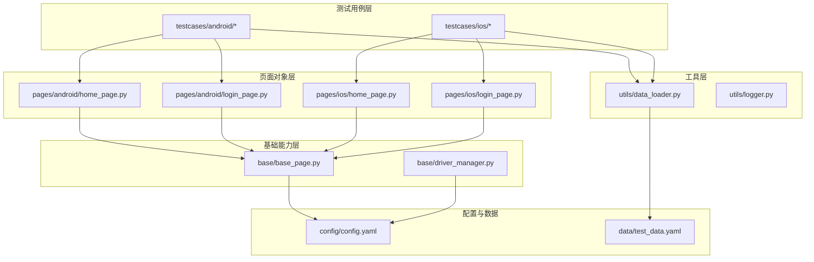
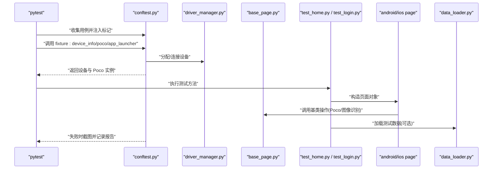
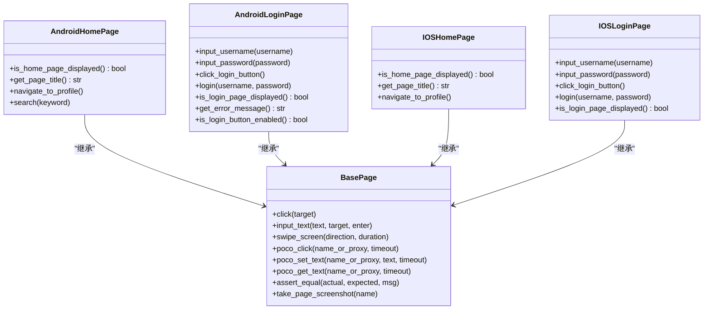
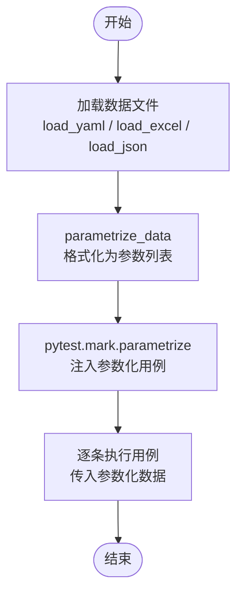
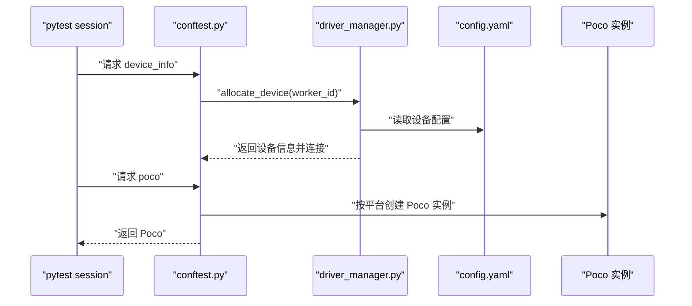

# 测试用例组织结构

<cite>
**本文引用的文件**
- [pytest.ini](file://pytest.ini)
- [conftest.py](file://conftest.py)
- [requirements.txt](file://requirements.txt)
- [config/config.yaml](file://config/config.yaml)
- [data/test_data.yaml](file://data/test_data.yaml)
- [base/base_page.py](file://base/base_page.py)
- [base/driver_manager.py](file://base/driver_manager.py)
- [utils/data_loader.py](file://utils/data_loader.py)
- [utils/logger.py](file://utils/logger.py)
- [testcases/android/test_home.py](file://testcases/android/test_home.py)
- [testcases/android/test_login.py](file://testcases/android/test_login.py)
- [testcases/ios/test_home.py](file://testcases/ios/test_home.py)
- [testcases/ios/test_login.py](file://testcases/ios/test_login.py)
- [pages/android/home_page.py](file://pages/android/home_page.py)
- [pages/android/login_page.py](file://pages/android/login_page.py)
- [pages/ios/home_page.py](file://pages/ios/home_page.py)
- [pages/ios/login_page.py](file://pages/ios/login_page.py)
</cite>

## 目录
1. [简介](#简介)
2. [项目结构](#项目结构)
3. [核心组件](#核心组件)
4. [架构总览](#架构总览)
5. [详细组件分析](#详细组件分析)
6. [依赖分析](#依赖分析)
7. [性能考虑](#性能考虑)
8. [故障排查指南](#故障排查指南)
9. [结论](#结论)
10. [附录](#附录)

## 简介
本文件系统性梳理 AirTestUI 的测试用例组织结构，覆盖目录与命名规范、平台分类原则、标签体系、编写最佳实践以及维护与重构建议。文档以仓库现有实现为依据，结合 pytest、Airtest/Poco、Allure、数据驱动等技术栈，帮助团队建立一致、可维护、可扩展的移动端自动化测试体系。

## 项目结构
AirTestUI 采用“按平台分层 + 功能模块划分”的目录组织方式：
- testcases：按平台划分的测试用例根目录，包含 android 与 ios 子目录，分别对应平台特异化的回归用例。
- pages：页面对象层，同样按平台划分，封装页面交互与断言逻辑，便于跨用例复用。
- base：基础能力层，包含页面基类、设备驱动管理等。
- utils：工具层，提供日志、数据加载、截图、重试等通用能力。
- config：全局配置，含环境、超时、设备与应用信息等。
- data：测试数据，支持 YAML/Excel/JSON，配合数据驱动执行。
- resources：资源文件，如图像模板等，供页面对象使用。

图表来源
- [pytest.ini:1-47](file://pytest.ini#L1-L47)
- [conftest.py:1-255](file://conftest.py#L1-L255)
- [config/config.yaml:1-70](file://config/config.yaml#L1-L70)
- [data/test_data.yaml:1-70](file://data/test_data.yaml#L1-L70)
- [base/base_page.py:1-320](file://base/base_page.py#L1-L320)
- [base/driver_manager.py:1-188](file://base/driver_manager.py#L1-L188)
- [utils/data_loader.py:1-128](file://utils/data_loader.py#L1-L128)

章节来源
- [pytest.ini:1-47](file://pytest.ini#L1-L47)
- [conftest.py:1-255](file://conftest.py#L1-L255)
- [config/config.yaml:1-70](file://config/config.yaml#L1-L70)
- [data/test_data.yaml:1-70](file://data/test_data.yaml#L1-L70)
- [base/base_page.py:1-320](file://base/base_page.py#L1-L320)
- [base/driver_manager.py:1-188](file://base/driver_manager.py#L1-L188)
- [utils/data_loader.py:1-128](file://utils/data_loader.py#L1-L128)

## 核心组件
- 测试用例组织与发现
  - 用例文件命名：遵循 pytest 默认规则，文件以 test_ 开头，类以 Test* 开头，函数以 test_ 开头。
  - 搜索路径：pytest.ini 指定 testcases 为搜索根目录。
- 平台标记与自动注入
  - conftest.py 在收集阶段根据用例路径自动注入 android/ios 标记，避免重复手写。
- 页面对象基类
  - base/base_page.py 提供统一的图像识别与 Poco 操作封装，内置断言、等待、截图、Allure 步骤等能力。
- 设备与 Poco 管理
  - base/driver_manager.py 管理设备池与分配；conftest.py 提供 poco、platform、device_info 等 session 级 fixture。
- 数据驱动
  - utils/data_loader.py 支持 YAML/Excel/JSON，提供 parametrize_data 便捷参数化；pytest.ini 声明 reruns 等运行选项。
- 日志与报告
  - utils/logger.py 提供结构化日志；pytest.ini 配置 Allure 与 HTML 报告输出；conftest.py 注入环境信息与失败截图。

章节来源
- [pytest.ini:1-47](file://pytest.ini#L1-L47)
- [conftest.py:52-60](file://conftest.py#L52-L60)
- [base/base_page.py:1-320](file://base/base_page.py#L1-L320)
- [base/driver_manager.py:1-188](file://base/driver_manager.py#L1-L188)
- [utils/data_loader.py:1-128](file://utils/data_loader.py#L1-L128)
- [utils/logger.py:1-59](file://utils/logger.py#L1-L59)

## 架构总览
下图展示从 pytest 收集到用例执行的关键流程，包括平台标记注入、设备与 Poco 初始化、页面对象调用、数据驱动与报告生成。

图表来源
- [conftest.py:140-255](file://conftest.py#L140-L255)
- [base/driver_manager.py:103-150](file://base/driver_manager.py#L103-L150)
- [base/base_page.py:184-320](file://base/base_page.py#L184-L320)
- [testcases/android/test_home.py:1-48](file://testcases/android/test_home.py#L1-L48)
- [testcases/android/test_login.py:1-71](file://testcases/android/test_login.py#L1-L71)
- [utils/data_loader.py:85-128](file://utils/data_loader.py#L85-L128)

## 详细组件分析

### 测试用例目录与命名规范
- 目录结构
  - testcases/android 与 testcases/ios 下按功能模块组织，如 test_home.py、test_login.py。
- 命名约定
  - 文件：test_*.py
  - 类：Test*
  - 方法：test_*
- 平台分类原则
  - 用例按平台拆分，避免跨平台差异导致的不确定性；同一功能在两个平台保持相似的测试点与断言策略。

章节来源
- [pytest.ini:5-8](file://pytest.ini#L5-L8)
- [testcases/android/test_home.py:1-48](file://testcases/android/test_home.py#L1-L48)
- [testcases/android/test_login.py:1-71](file://testcases/android/test_login.py#L1-L71)
- [testcases/ios/test_home.py:1-38](file://testcases/ios/test_home.py#L1-L38)
- [testcases/ios/test_login.py:1-43](file://testcases/ios/test_login.py#L1-L43)

### 标签系统与使用
- 自定义标记
  - android、ios：平台标记，由 conftest.py 在收集阶段自动注入。
  - smoke、regression：测试类型标记，用于冒烟/回归筛选。
  - p0/p1/p2：严重级别标记，配合 Allure 严重度使用。
  - skip_ci：CI 环境跳过标记。
- 标记注入
  - conftest.py 在 pytest_collection_modifyitems 阶段扫描用例路径，自动添加 android/ios 标记。
- 使用建议
  - 用例同时标注平台与测试类型，便于按平台与类型组合执行。
  - 严重级别与 Allure 严重度联动，统一质量度量口径。

章节来源
- [pytest.ini:24-32](file://pytest.ini#L24-L32)
- [conftest.py:52-60](file://conftest.py#L52-L60)
- [testcases/android/test_home.py:15-16](file://testcases/android/test_home.py#L15-L16)
- [testcases/android/test_login.py:18-19](file://testcases/android/test_login.py#L18-L19)
- [testcases/ios/test_home.py:15-16](file://testcases/ios/test_home.py#L15-L16)
- [testcases/ios/test_login.py:16-17](file://testcases/ios/test_login.py#L16-L17)

### 页面对象与用例协作
- 页面对象基类
  - 提供 click、input_text、swipe、assert_* 等统一封装；支持 Poco 与图像识别双模式。
  - 内置 Allure 步骤、截图与日志，提升可观测性。
- 用例与页面对象
  - 用例通过 @pytest.fixture 初始化页面对象，聚焦业务流程与断言。
  - 示例：Android/iOS 登录用例均通过页面对象封装输入、点击、断言等步骤。

图表来源
- [base/base_page.py:30-320](file://base/base_page.py#L30-L320)
- [pages/android/home_page.py:14-58](file://pages/android/home_page.py#L14-L58)
- [pages/android/login_page.py:14-107](file://pages/android/login_page.py#L14-L107)
- [pages/ios/home_page.py:12-43](file://pages/ios/home_page.py#L12-L43)
- [pages/ios/login_page.py:13-65](file://pages/ios/login_page.py#L13-L65)

章节来源
- [base/base_page.py:1-320](file://base/base_page.py#L1-L320)
- [pages/android/home_page.py:1-58](file://pages/android/home_page.py#L1-L58)
- [pages/android/login_page.py:1-107](file://pages/android/login_page.py#L1-L107)
- [pages/ios/home_page.py:1-43](file://pages/ios/home_page.py#L1-L43)
- [pages/ios/login_page.py:1-65](file://pages/ios/login_page.py#L1-L65)

### 数据驱动与参数化
- 数据源
  - data/test_data.yaml 提供 YAML 格式测试数据，支持多组用例参数。
- 加载与参数化
  - utils/data_loader.py 提供 load_yaml/load_json/load_excel 与 parametrize_data，后者可直接用于 pytest.mark.parametrize。
- 在用例中的使用
  - 用例可通过 fixture 接收 test_data，或直接在方法上使用 parametrize_data 进行参数化执行。

图表来源
- [utils/data_loader.py:18-128](file://utils/data_loader.py#L18-L128)
- [data/test_data.yaml:1-70](file://data/test_data.yaml#L1-L70)
- [testcases/android/test_login.py:10-11](file://testcases/android/test_login.py#L10-L11)

章节来源
- [utils/data_loader.py:1-128](file://utils/data_loader.py#L1-L128)
- [data/test_data.yaml:1-70](file://data/test_data.yaml#L1-L70)
- [testcases/android/test_login.py:1-71](file://testcases/android/test_login.py#L1-L71)

### 设备与 Poco 管理
- 设备池
  - base/driver_manager.py 读取 config 中设备配置，按 worker 分配设备，支持并发复用。
- Poco 初始化
  - conftest.py 根据平台选择 AndroidUiautomationPoco 或 IOSPoco，并在失败时降级为图像识别模式。
- 会话生命周期
  - conftest.py 在 session 级别管理设备连接、APP 启停与日志输出。

图表来源
- [base/driver_manager.py:81-150](file://base/driver_manager.py#L81-L150)
- [config/config.yaml:47-70](file://config/config.yaml#L47-L70)
- [conftest.py:157-208](file://conftest.py#L157-L208)

章节来源
- [base/driver_manager.py:1-188](file://base/driver_manager.py#L1-L188)
- [config/config.yaml:1-70](file://config/config.yaml#L1-L70)
- [conftest.py:157-208](file://conftest.py#L157-L208)

### 用例编写最佳实践
- 设计原则
  - 用例单一职责：每个测试关注一个场景或分支。
  - 平台隔离：Android/iOS 用例分离，避免共享状态影响。
  - 页面对象复用：将页面交互封装到 pages，用例只写断言与流程。
- 断言策略
  - 优先使用页面对象提供的断言方法，确保截图与日志一致。
  - 结合 Allure 严重度与自定义严重级别标记，统一质量度量。
- 数据驱动
  - 使用 parametrize_data 将多组数据参数化执行，减少重复用例。
  - YAML/Excel/JSON 三类数据源按场景选择，保证可维护性。
- 可观测性
  - 使用 @allure.step 记录关键步骤；失败自动截图并附加到 Allure。
  - 通过 pytest.ini 的 reruns 与 reruns-delay 提升稳定性。

章节来源
- [base/base_page.py:184-320](file://base/base_page.py#L184-L320)
- [utils/data_loader.py:85-128](file://utils/data_loader.py#L85-L128)
- [pytest.ini:20-21](file://pytest.ini#L20-L21)
- [conftest.py:119-138](file://conftest.py#L119-L138)

### 维护与重构指南
- 目录与命名
  - 保持 testcases 与 pages 的平台维度一致；新增功能模块同步补齐。
- 标记与筛选
  - 新增用例时明确标注平台、类型与严重级别，便于后续筛选与报告解读。
- 页面对象
  - 将重复交互抽象到基类或公共方法；图像识别与 Poco 双模式并存时，优先 Poco，图像识别作为兜底。
- 数据与配置
  - 测试数据集中管理，避免硬编码；设备与应用配置集中在 config，便于多环境切换。
- 报告与日志
  - 保持 Allure 与日志输出配置稳定；定期清理历史报告与日志文件。

章节来源
- [pytest.ini:1-47](file://pytest.ini#L1-L47)
- [config/config.yaml:1-70](file://config/config.yaml#L1-L70)
- [base/base_page.py:1-320](file://base/base_page.py#L1-L320)
- [utils/logger.py:1-59](file://utils/logger.py#L1-L59)

## 依赖分析
- 测试框架与插件
  - pytest、pytest-xdist、pytest-html、allure-pytest、pytest-rerunfailures。
- UI 自动化
  - airtest、pocoui。
- 数据与配置
  - PyYAML、openpyxl。
- 工具库
  - requests、Pillow、loguru、tenacity。

章节来源
- [requirements.txt:1-21](file://requirements.txt#L1-L21)

## 性能考虑
- 并发与设备复用
  - 使用 pytest-xdist 与 driver_manager 的设备池，合理分配 worker 与设备，避免争抢。
- 重试与稳定性
  - 通过 pytest.ini 的 reruns 与 reruns-delay 提升偶发失败的通过率。
- 截图与日志
  - 关闭每步截图以降低 IO 压力；仅在失败时截图并附加到报告。

章节来源
- [pytest.ini:18-21](file://pytest.ini#L18-L21)
- [config/config.yaml:14-23](file://config/config.yaml#L14-L23)
- [conftest.py:119-138](file://conftest.py#L119-L138)

## 故障排查指南
- 设备连接失败
  - 检查 config 中设备配置与连接 URI；确认设备在线与权限。
- Poco 初始化异常
  - 观察日志输出，必要时降级为图像识别模式；检查 APP 是否正常启动。
- 用例失败截图
  - conftest.py 在失败时自动截图并附加到 Allure；查看报告附件定位问题。
- 日志定位
  - 使用 utils/logger.py 输出结构化日志，结合控制台与文件日志快速定位。

章节来源
- [base/driver_manager.py:103-150](file://base/driver_manager.py#L103-L150)
- [conftest.py:119-138](file://conftest.py#L119-L138)
- [utils/logger.py:1-59](file://utils/logger.py#L1-L59)

## 结论
AirTestUI 的测试用例组织以“平台分层 + 功能模块”为核心，结合页面对象基类、设备与 Poco 管理、数据驱动与 Allure 报告，形成可维护、可扩展的自动化测试体系。遵循本文的目录与命名规范、标签体系与最佳实践，可显著提升用例质量与执行效率。

## 附录
- 常用命令
  - 运行全部用例：pytest
  - 按平台运行：pytest -m android 或 pytest -m ios
  - 按类型运行：pytest -m smoke 或 pytest -m regression
  - 指定严重级别：pytest -m p0
  - 生成报告：pytest --alluredir=allure-results --html=reports/report.html

章节来源
- [pytest.ini:11-32](file://pytest.ini#L11-L32)
- [conftest.py:37-50](file://conftest.py#L37-L50)