# Android平台测试用例

<cite>
**本文档引用的文件**
- [base/app_launcher.py](file://base/app_launcher.py)
- [base/base_page.py](file://base/base_page.py)
- [base/driver_manager.py](file://base/driver_manager.py)
- [pages/android/home_page.py](file://pages/android/home_page.py)
- [pages/android/login_page.py](file://pages/android/login_page.py)
- [testcases/android/test_home.py](file://testcases/android/test_home.py)
- [testcases/android/test_login.py](file://testcases/android/test_login.py)
- [config/settings.py](file://config/settings.py)
- [config/config.yaml](file://config/config.yaml)
- [conftest.py](file://conftest.py)
- [utils/logger.py](file://utils/logger.py)
- [utils/screenshot.py](file://utils/screenshot.py)
- [utils/data_loader.py](file://utils/data_loader.py)
- [requirements.txt](file://requirements.txt)
</cite>

## 目录
1. [简介](#简介)
2. [项目结构](#项目结构)
3. [核心组件](#核心组件)
4. [架构概览](#架构概览)
5. [详细组件分析](#详细组件分析)
6. [依赖关系分析](#依赖关系分析)
7. [性能考虑](#性能考虑)
8. [故障排除指南](#故障排除指南)
9. [结论](#结论)
10. [附录](#附录)

## 简介

本指南基于AirTestUI自动化测试框架，详细介绍Android平台测试用例的编写方法。该框架采用Page Object设计模式，结合AirTest的图像识别技术和Poco的UI树定位技术，提供了完整的Android应用测试解决方案。

框架的核心特性包括：
- **双模式定位**：支持图像识别和Poco UI树定位两种元素操作方式
- **多设备管理**：支持Android/iOS设备池管理和并发测试
- **智能等待机制**：内置超时控制和自动重试功能
- **可视化报告**：集成Allure测试报告和实时截图功能
- **数据驱动**：支持YAML、JSON、Excel等多种数据源

## 项目结构

该项目采用分层架构设计，主要分为以下层次：

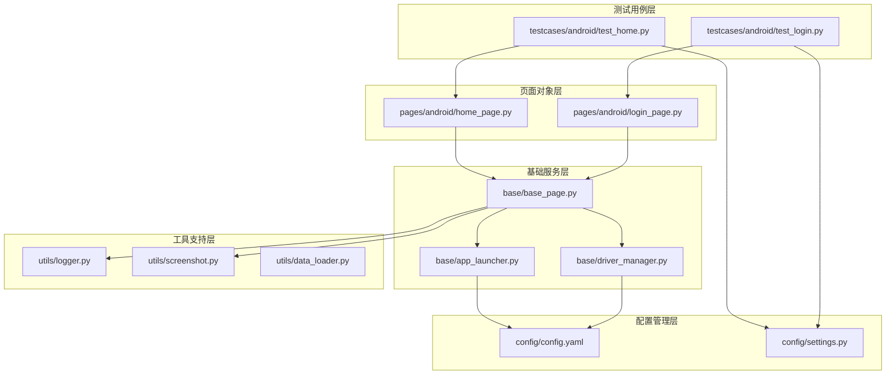

**图表来源**
- [testcases/android/test_home.py:1-48](file://testcases/android/test_home.py#L1-L48)
- [pages/android/home_page.py:1-58](file://pages/android/home_page.py#L1-L58)
- [base/base_page.py:1-320](file://base/base_page.py#L1-L320)

**章节来源**
- [config/config.yaml:1-70](file://config/config.yaml#L1-L70)
- [config/settings.py:1-112](file://config/settings.py#L1-L112)

## 核心组件

### AppLauncher应用启动器

AppLauncher负责Android应用的生命周期管理，提供启动、关闭、重启、数据清除等功能。

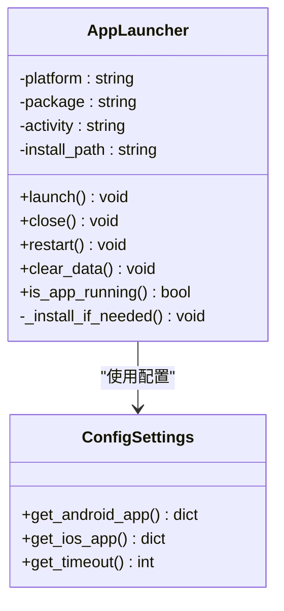

**图表来源**
- [base/app_launcher.py:20-127](file://base/app_launcher.py#L20-L127)
- [config/settings.py:104-112](file://config/settings.py#L104-L112)

### BasePage页面基类

BasePage是所有页面对象的基类，封装了AirTest和Poco的核心操作方法。

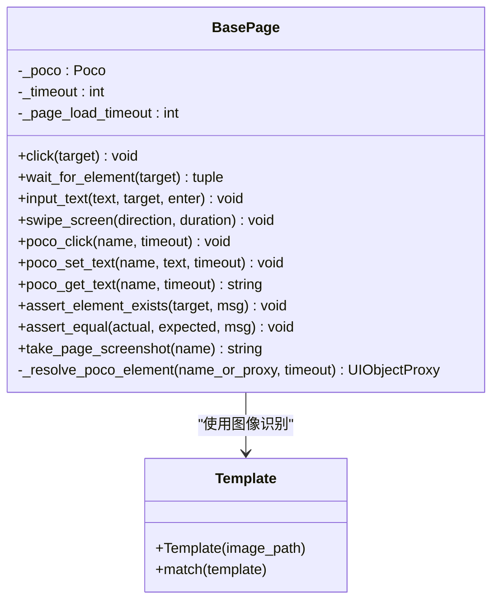

**图表来源**
- [base/base_page.py:30-320](file://base/base_page.py#L30-L320)

### DriverManager设备管理器

DriverManager管理设备连接池，支持多设备并发测试。

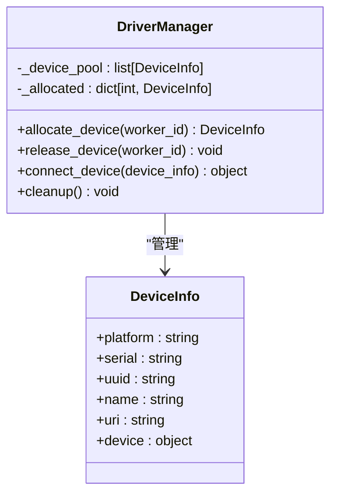

**图表来源**
- [base/driver_manager.py:20-188](file://base/driver_manager.py#L20-L188)

**章节来源**
- [base/app_launcher.py:1-127](file://base/app_launcher.py#L1-L127)
- [base/base_page.py:1-320](file://base/base_page.py#L1-L320)
- [base/driver_manager.py:1-188](file://base/driver_manager.py#L1-L188)

## 架构概览

整个测试框架采用分层架构，各层职责明确：

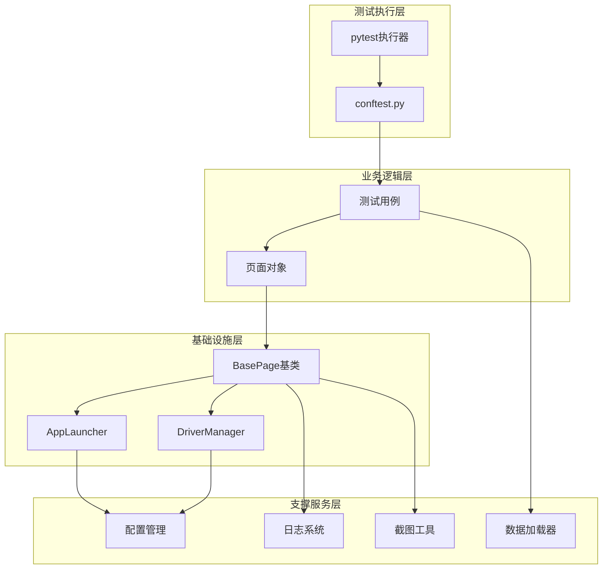

**图表来源**
- [conftest.py:140-255](file://conftest.py#L140-L255)
- [testcases/android/test_login.py:16-71](file://testcases/android/test_login.py#L16-L71)

## 详细组件分析

### Android登录页面测试用例

AndroidLoginPage演示了双模式定位的实际应用：

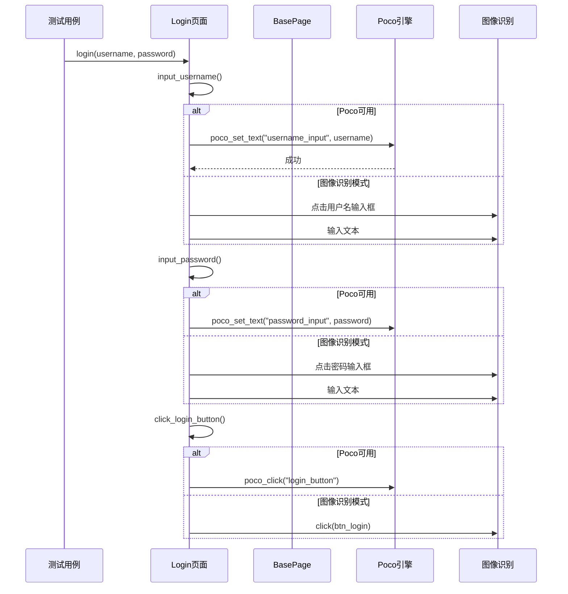

**图表来源**
- [pages/android/login_page.py:32-74](file://pages/android/login_page.py#L32-L74)
- [base/base_page.py:186-253](file://base/base_page.py#L186-L253)

### Android首页页面测试用例

AndroidHomePage展示了页面导航和元素验证的实现：

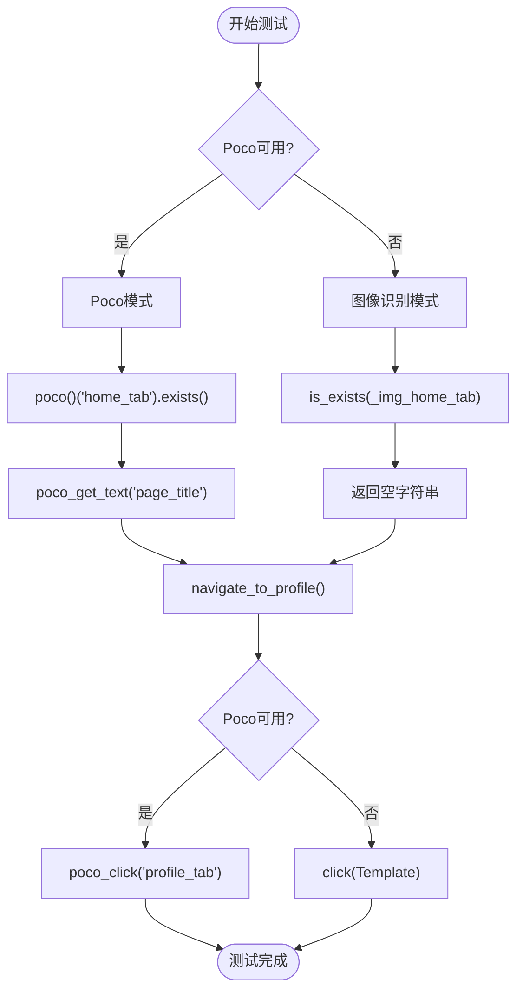

**图表来源**
- [pages/android/home_page.py:21-58](file://pages/android/home_page.py#L21-L58)
- [base/base_page.py:128-183](file://base/base_page.py#L128-L183)

**章节来源**
- [pages/android/login_page.py:1-107](file://pages/android/login_page.py#L1-L107)
- [pages/android/home_page.py:1-58](file://pages/android/home_page.py#L1-L58)

### 测试用例模板

以下是完整的Android测试用例编写模板：

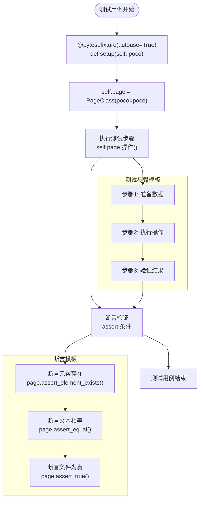

**图表来源**
- [testcases/android/test_login.py:23-71](file://testcases/android/test_login.py#L23-L71)
- [testcases/android/test_home.py:20-48](file://testcases/android/test_home.py#L20-L48)

**章节来源**
- [testcases/android/test_login.py:1-71](file://testcases/android/test_login.py#L1-L71)
- [testcases/android/test_home.py:1-48](file://testcases/android/test_home.py#L1-L48)

## 依赖关系分析

### 核心依赖关系

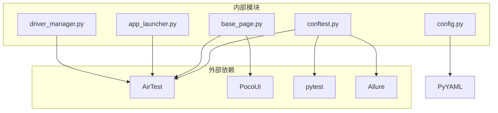

**图表来源**
- [requirements.txt:1-21](file://requirements.txt#L1-L21)
- [conftest.py:12-20](file://conftest.py#L12-L20)

### 配置依赖关系

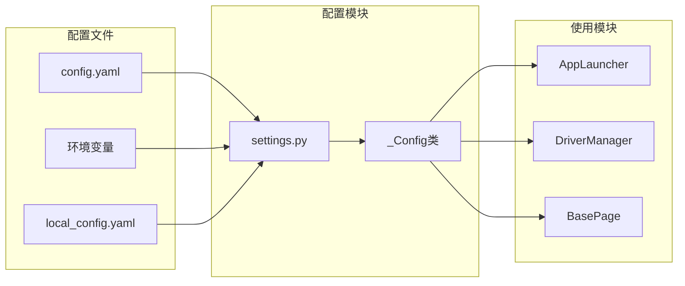

**图表来源**
- [config/settings.py:34-81](file://config/settings.py#L34-L81)
- [config/config.yaml:44-70](file://config/config.yaml#L44-L70)

**章节来源**
- [requirements.txt:1-21](file://requirements.txt#L1-L21)
- [config/settings.py:1-112](file://config/settings.py#L1-L112)

## 性能考虑

### 超时配置优化

框架提供了多层次的超时配置：

| 配置类别 | 默认值 | 用途 | 优化建议 |
|---------|--------|------|----------|
| element_wait | 10秒 | 元素等待超时 | 根据页面复杂度调整，避免过长影响测试效率 |
| page_load | 30秒 | 页面加载超时 | 对于复杂页面可适当增加 |
| app_launch | 60秒 | 应用启动超时 | 真机测试时建议增加 |

### 设备并发策略

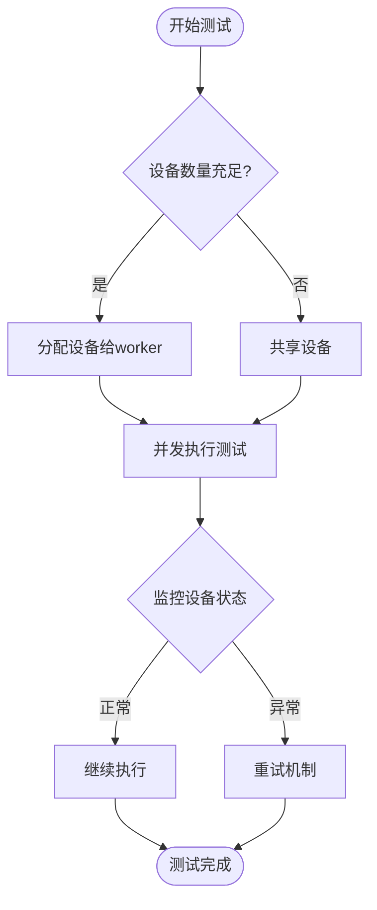

**图表来源**
- [base/driver_manager.py:119-150](file://base/driver_manager.py#L119-L150)

### 截图策略优化

- **失败时自动截图**：配置项`on_failure: true`确保问题可重现
- **步骤级截图**：配置项`on_step: false`避免过多截图影响性能
- **智能命名**：使用时间戳和测试用例名称组合

**章节来源**
- [config/config.yaml:8-24](file://config/config.yaml#L8-L24)
- [base/driver_manager.py:1-188](file://base/driver_manager.py#L1-L188)

## 故障排除指南

### 常见问题及解决方案

#### 1. Poco初始化失败

**问题现象**：Poco引擎初始化异常，测试降级为图像识别模式

**解决方案**：
- 检查应用是否支持Poco引擎
- 确认设备连接状态
- 验证应用权限设置

#### 2. 元素定位失败

**问题现象**：click、wait_for_element等方法抛出异常

**解决方案**：
- 检查元素是否在当前页面显示
- 调整超时时间配置
- 验证图像模板文件完整性

#### 3. 设备连接问题

**问题现象**：设备分配失败或连接超时

**解决方案**：
- 确认设备序列号配置正确
- 检查USB调试和开发者选项
- 验证网络连接（ADB连接）

### 调试技巧

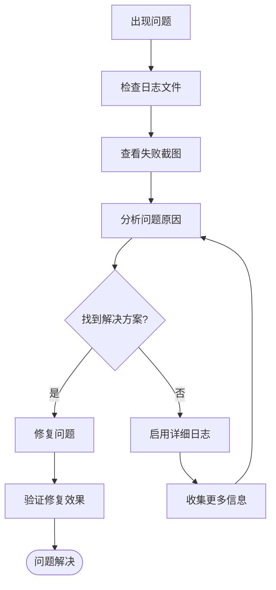

**图表来源**
- [utils/logger.py:12-48](file://utils/logger.py#L12-L48)
- [utils/screenshot.py:28-53](file://utils/screenshot.py#L28-L53)

**章节来源**
- [utils/logger.py:1-59](file://utils/logger.py#L1-L59)
- [utils/screenshot.py:1-89](file://utils/screenshot.py#L1-L89)

## 结论

AirTestUI框架为Android平台测试提供了完整的解决方案，具有以下优势：

1. **双模式定位**：结合图像识别和Poco UI树定位，提高测试稳定性
2. **多设备支持**：设备池管理和并发执行，提升测试效率
3. **智能配置**：灵活的配置管理，支持环境变量覆盖
4. **可视化报告**：集成Allure，提供丰富的测试报告
5. **易扩展性**：清晰的分层架构，便于功能扩展

建议在实际项目中：
- 根据应用特点选择合适的定位模式
- 合理配置超时时间和重试机制
- 建立完善的错误处理和日志记录体系
- 定期更新设备配置和测试数据

## 附录

### 测试用例编写最佳实践

#### 1. 页面对象设计原则
- 每个页面创建独立的Page Object类
- 封装页面特定的操作方法
- 提供清晰的断言接口

#### 2. 元素定位策略
- 优先使用Poco UI树定位
- 图像识别作为备用方案
- 建立稳定的元素标识体系

#### 3. 测试数据管理
- 使用数据驱动测试
- 支持多种数据格式
- 建立测试数据字典

#### 4. 错误处理机制
- 统一的异常处理策略
- 失败时自动截图
- 详细的日志记录

**章节来源**
- [pages/android/login_page.py:14-107](file://pages/android/login_page.py#L14-L107)
- [pages/android/home_page.py:14-58](file://pages/android/home_page.py#L14-L58)
- [utils/data_loader.py:18-128](file://utils/data_loader.py#L18-L128)