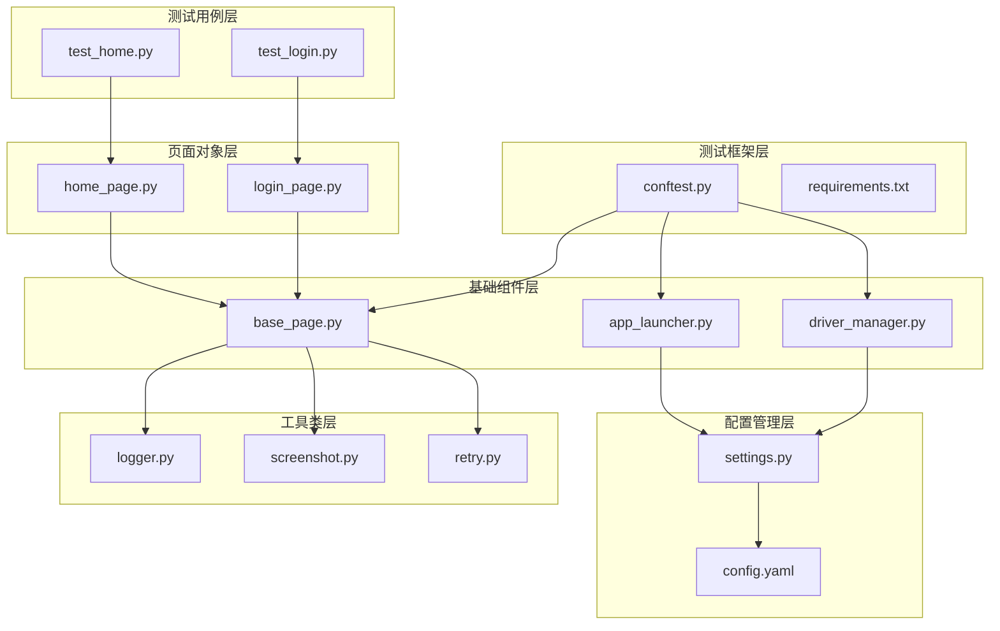
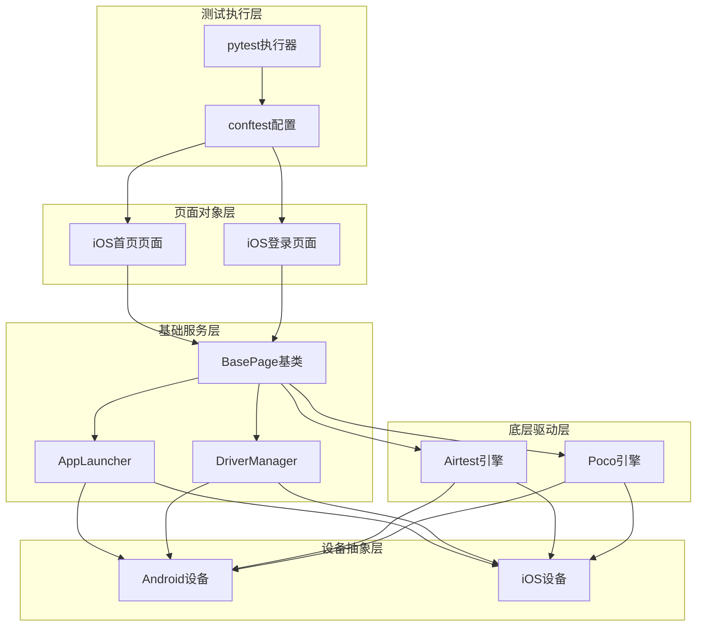
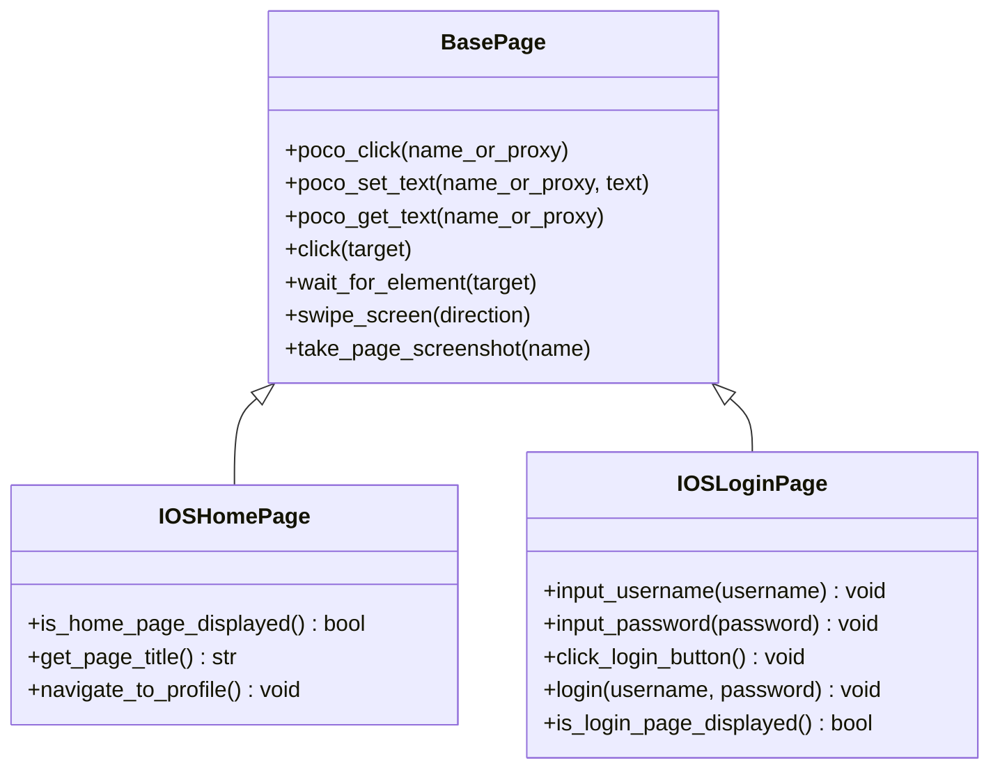
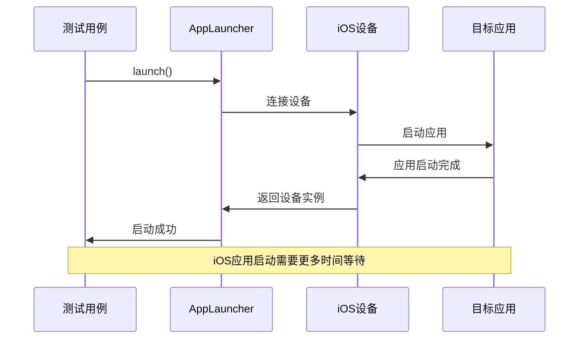
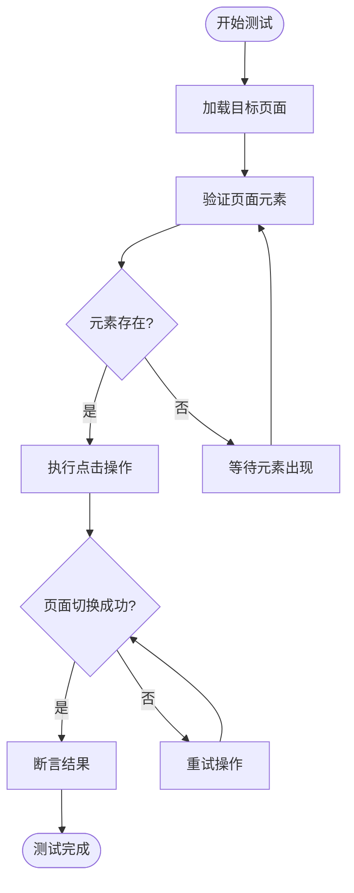
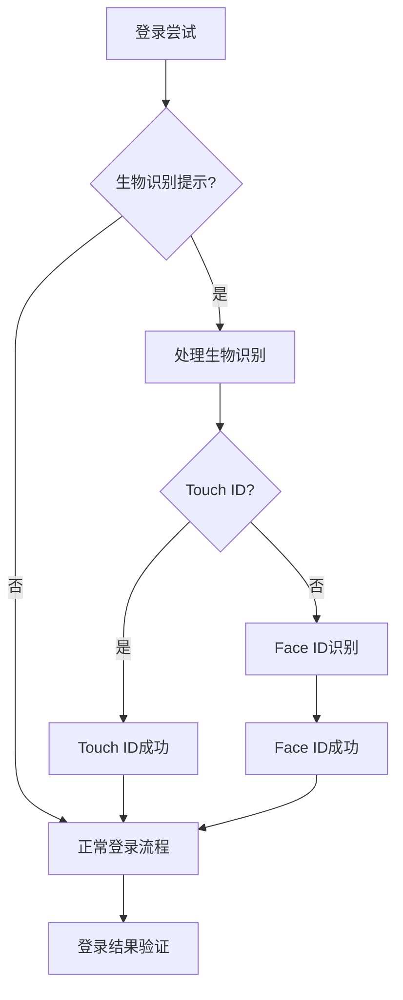
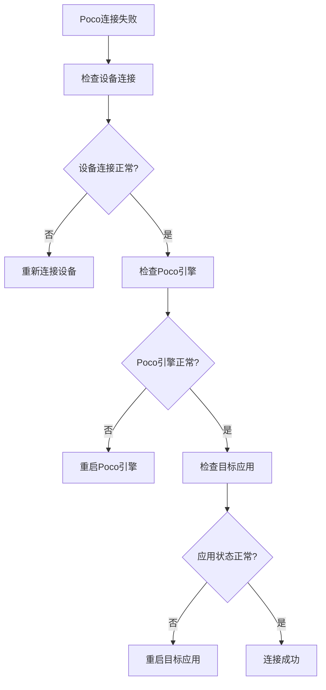

# iOS平台测试用例

<cite>
**本文档引用的文件**
- [test_home.py](file://testcases/ios/test_home.py)
- [test_login.py](file://testcases/ios/test_login.py)
- [home_page.py](file://pages/ios/home_page.py)
- [login_page.py](file://pages/ios/login_page.py)
- [base_page.py](file://base/base_page.py)
- [app_launcher.py](file://base/app_launcher.py)
- [driver_manager.py](file://base/driver_manager.py)
- [conftest.py](file://conftest.py)
- [settings.py](file://config/settings.py)
- [config.yaml](file://config/config.yaml)
- [logger.py](file://utils/logger.py)
- [screenshot.py](file://utils/screenshot.py)
- [retry.py](file://utils/retry.py)
- [requirements.txt](file://requirements.txt)
</cite>

## 目录
1. [简介](#简介)
2. [项目结构](#项目结构)
3. [核心组件](#核心组件)
4. [架构概览](#架构概览)
5. [详细组件分析](#详细组件分析)
6. [iOS平台测试场景实现](#ios平台测试场景实现)
7. [UI定位差异与处理](#ui定位差异与处理)
8. [最佳实践](#最佳实践)
9. [常见问题与解决方案](#常见问题与解决方案)
10. [性能考虑](#性能考虑)
11. [故障排除指南](#故障排除指南)
12. [结论](#结论)

## 简介

本指南基于AirTestUI自动化测试框架，详细介绍iOS平台测试用例的编写方法。该框架采用Airtest + Poco技术栈，支持iOS和Android双平台测试，提供了完整的测试基础设施、页面对象模式和丰富的工具类。

AirTestUI框架的核心优势包括：
- **统一的页面对象模式**：通过BasePage基类封装Airtest和Poco操作
- **多平台支持**：同一套代码同时支持iOS和Android测试
- **完善的工具链**：包含日志、截图、重试、通知等辅助功能
- **灵活的配置管理**：支持YAML配置文件和环境变量覆盖

## 项目结构

该项目采用分层架构设计，主要分为以下层次：



**图表来源**
- [test_home.py:1-38](file://testcases/ios/test_home.py#L1-L38)
- [home_page.py:1-43](file://pages/ios/home_page.py#L1-L43)
- [base_page.py:1-320](file://base/base_page.py#L1-L320)

**章节来源**
- [test_home.py:1-38](file://testcases/ios/test_home.py#L1-L38)
- [test_login.py:1-43](file://testcases/ios/test_login.py#L1-L43)
- [home_page.py:1-43](file://pages/ios/home_page.py#L1-L43)
- [login_page.py:1-65](file://pages/ios/login_page.py#L1-L65)

## 核心组件

### BasePage基类
BasePage是所有页面对象的基类，提供了统一的UI操作接口：

**核心功能特性：**
- **双模式定位**：支持Airtest图像识别和Poco UI树定位
- **智能等待**：内置元素等待和页面加载超时机制
- **自动截图**：失败时自动截图并附加到Allure报告
- **Allure集成**：完整的步骤记录和测试报告支持
- **异常处理**：完善的错误捕获和日志记录

**关键方法分类：**
- 图像识别操作：click、wait_for_element、input_text
- Poco UI树操作：poco_click、poco_set_text、poco_get_text
- 断言方法：assert_equal、assert_true、poco_assert_text
- 工具方法：截图、等待、资源路径解析

**章节来源**
- [base_page.py:30-320](file://base/base_page.py#L30-L320)

### AppLauncher应用启动器
负责应用程序的生命周期管理：

**主要功能：**
- **跨平台启动**：自动区分Android和iOS平台
- **应用管理**：启动、关闭、重启、清除数据
- **自动安装**：支持APK/IPA文件的自动安装
- **状态监控**：检查应用运行状态

**平台差异处理：**
- Android使用包名+Activity启动
- iOS使用Bundle ID启动
- iOS支持自动安装IPA文件

**章节来源**
- [app_launcher.py:20-127](file://base/app_launcher.py#L20-L127)

### DriverManager设备管理器
管理多设备连接和分配：

**核心能力：**
- **设备池管理**：维护Android和iOS设备列表
- **设备分配**：支持多worker并发测试
- **连接管理**：自动建立和断开设备连接
- **资源回收**：测试完成后自动清理设备连接

**分配策略：**
- 优先分配未使用的设备
- 支持设备复用（多个worker共享设备）
- 线程安全的设备分配机制

**章节来源**
- [driver_manager.py:51-188](file://base/driver_manager.py#L51-L188)

## 架构概览

AirTestUI框架采用分层架构，各层职责明确：



**图表来源**
- [conftest.py:151-228](file://conftest.py#L151-L228)
- [base_page.py:186-204](file://base/base_page.py#L186-L204)
- [driver_manager.py:103-117](file://base/driver_manager.py#L103-L117)

## 详细组件分析

### iOS首页页面对象

IOSHomePage继承自BasePage，专门处理iOS首页相关的UI操作：



**图表来源**
- [base_page.py:30-320](file://base/base_page.py#L30-L320)
- [home_page.py:12-43](file://pages/ios/home_page.py#L12-L43)
- [login_page.py:13-65](file://pages/ios/login_page.py#L13-L65)

**关键特性：**
- **Poco定位**：使用UI树节点名进行元素定位
- **智能等待**：自动等待元素出现和页面加载
- **异常处理**：Poco调用失败时优雅降级
- **步骤记录**：Allure步骤级别的操作记录

**章节来源**
- [home_page.py:12-43](file://pages/ios/home_page.py#L12-L43)
- [login_page.py:13-65](file://pages/ios/login_page.py#L13-L65)

### iOS登录页面对象

IOSLoginPage实现了完整的登录流程：

**登录流程步骤：**
1. 输入用户名
2. 输入密码  
3. 点击登录按钮
4. 验证登录结果

**错误处理机制：**
- 登录失败时保持在登录页面
- 使用断言确保页面状态正确
- 提供详细的错误信息和截图

**章节来源**
- [login_page.py:48-65](file://pages/ios/login_page.py#L48-L65)

## iOS平台测试场景实现

### 应用启动测试

iOS应用启动测试需要考虑以下特殊场景：



**图表来源**
- [app_launcher.py:49-74](file://base/app_launcher.py#L49-L74)
- [conftest.py:217-227](file://conftest.py#L217-L227)

**实现要点：**
- iOS应用启动时间通常比Android更长
- 需要适当的等待策略
- 支持应用自动安装功能

### 页面切换测试

iOS页面切换测试的关键在于正确的元素定位：



**图表来源**
- [base_page.py:192-204](file://base/base_page.py#L192-L204)
- [home_page.py:38-43](file://pages/ios/home_page.py#L38-L43)

**测试模式：**
- **直接定位**：使用Poco UI树直接定位元素
- **间接验证**：通过页面特征判断切换结果
- **重试机制**：网络延迟或动画导致的临时失败

### 手势操作测试

iOS手势操作测试需要考虑系统手势和应用内手势的区别：

**常用手势操作：**
- **滑动**：上下左右滑动，支持自定义持续时间
- **长按**：长按特定元素进行操作
- **拖拽**：从一个位置拖拽到另一个位置
- **缩放**：双指缩放操作

**章节来源**
- [base_page.py:128-161](file://base/base_page.py#L128-L161)

## UI定位差异与处理

### iOS与Android定位差异

| 方面 | iOS特点 | Android特点 |
|------|---------|-------------|
| **定位方式** | Poco UI树为主 | 图像识别为主 |
| **元素属性** | accessibility_id, label, name | resource-id, text, class |
| **交互方式** | Touch ID/Face ID | 指纹识别 |
| **系统权限** | 生物识别权限 | 指纹权限 |
| **手势差异** | 系统手势丰富 | 应用内手势 |

### iOS特有的元素属性

**Poco UI树属性：**
- **name**：元素的唯一标识符
- **type**：元素类型（Button, Text, Image等）
- **visible**：可见性状态
- **text**：元素文本内容
- **children**：子元素列表

**定位策略：**
1. **优先使用name属性**：最稳定可靠的定位方式
2. **组合属性定位**：结合type和text属性提高准确性
3. **层级定位**：通过父元素定位子元素
4. **相对定位**：基于相邻元素的位置关系

### 处理iOS特有问题

**生物识别处理：**


**图表来源**
- [login_page.py:48-54](file://pages/ios/login_page.py#L48-L54)

**权限弹窗处理：**
- **首次权限请求**：自动允许或拒绝权限
- **权限被拒绝**：引导用户手动开启权限
- **权限状态检查**：定期检查权限状态

**章节来源**
- [base_page.py:186-252](file://base/base_page.py#L186-L252)

## 最佳实践

### 测试用例编写规范

**用例组织结构：**
```python
@pytest.mark.ios
@pytest.mark.regression
class TestIOSHome:
    """iOS首页功能回归测试"""
    
    @pytest.fixture(autouse=True)
    def setup(self, poco):
        self.home_page = IOSHomePage(poco=poco)
    
    @allure.title("iOS 首页加载验证")
    @allure.severity(allure.severity_level.CRITICAL)
    @pytest.mark.p0
    @pytest.mark.smoke
    def test_home_page_loaded(self):
        """验证 iOS 首页正常加载"""
        assert self.home_page.is_home_page_displayed(), "首页应正常显示"
```

**关键实践要点：**
- **标记分类**：使用pytest.mark标注平台和严重级别
- **Allure集成**：完整的测试步骤和结果记录
- **断言清晰**：提供明确的错误信息
- **资源清理**：测试完成后恢复初始状态

### 页面对象设计原则

**设计模式：**
1. **单一职责**：每个页面对象只负责一个页面
2. **封装性**：内部实现细节对外部透明
3. **可重用性**：公共操作提取为通用方法
4. **可扩展性**：支持新功能的平滑扩展

**方法命名规范：**
- **验证方法**：is_*、has_*、can_*形式
- **操作方法**：perform_*、execute_*、do_*形式
- **获取方法**：get_*、fetch_*、retrieve_*形式

### 配置管理最佳实践

**配置文件结构：**
```yaml
ios:
  devices:
    - uuid: "auto"
      name: "iPhone-14"
  app:
    bundle_id: "com.example.app"
    install_path: ""
```

**环境配置：**
- **开发环境**：使用测试服务器和测试账号
- **预发布环境**：接近生产环境的配置
- **生产环境**：严格的权限控制和监控

**章节来源**
- [config.yaml:59-70](file://config/config.yaml#L59-L70)
- [settings.py:109-112](file://config/settings.py#L109-L112)

## 常见问题与解决方案

### Touch ID/Face ID处理

**问题场景：**
- 生物识别权限未授权
- 生物识别设备不可用
- 用户取消生物识别

**解决方案：**
1. **权限预处理**：在测试前检查并授权生物识别权限
2. **降级处理**：当生物识别失败时使用传统登录方式
3. **模拟环境**：在CI环境中禁用生物识别功能

**实现参考：**
```python
def handle_biometric_auth(self):
    """处理生物识别认证"""
    try:
        # 等待生物识别提示出现
        self.wait_for_element(BIOMETRIC_PROMPT)
        # 执行生物识别
        self.perform_biometric_recognition()
    except TimeoutError:
        # 切换到传统登录
        self.switch_to_password_login()
```

### 系统权限弹窗

**常见权限类型：**
- **相机权限**：拍照功能需要
- **相册权限**：选择图片需要
- **位置权限**：GPS定位需要
- **通知权限**：推送消息需要

**处理策略：**
1. **自动授权**：在测试环境中自动授权
2. **手动处理**：提供用户手动授权的指导
3. **状态检查**：定期检查权限状态

### 设备兼容性问题

**iOS版本差异：**
- **iOS 13-14**：手势操作略有不同
- **iOS 15+**：新的系统UI和交互方式
- **不同设备**：iPhone、iPad的界面差异

**适配方案：**
1. **版本检测**：根据iOS版本调整测试策略
2. **设备适配**：针对不同设备类型优化定位
3. **弹性布局**：支持不同屏幕尺寸的适配

### 网络和性能问题

**常见问题：**
- **页面加载缓慢**：网络延迟影响测试稳定性
- **元素定位失败**：UI树更新延迟
- **手势操作不稳定**：系统响应时间变化

**优化措施：**
1. **智能等待**：根据元素复杂度调整等待时间
2. **重试机制**：对易失败的操作实施重试
3. **超时配置**：合理设置各种超时参数

**章节来源**
- [retry.py:13-64](file://utils/retry.py#L13-L64)
- [settings.py:89-92](file://config/settings.py#L89-L92)

## 性能考虑

### 测试执行性能优化

**并发测试：**
- **多设备并发**：利用DriverManager实现多设备并行测试
- **资源池管理**：合理分配和回收设备资源
- **负载均衡**：避免单个设备过载

**执行效率：**
- **批量操作**：合并多个小操作减少通信开销
- **缓存策略**：缓存常用的元素引用
- **异步处理**：对非关键操作采用异步执行

### 内存和资源管理

**内存优化：**
- **及时释放**：测试完成后及时释放Poco实例
- **资源清理**：定期清理临时文件和截图
- **连接管理**：合理管理设备连接状态

**存储优化：**
- **截图压缩**：控制截图质量和数量
- **日志轮转**：定期清理旧的日志文件
- **临时文件**：及时清理测试产生的临时文件

## 故障排除指南

### 常见错误诊断

**Poco连接失败：**


**图表来源**
- [conftest.py:185-208](file://conftest.py#L185-L208)

**诊断步骤：**
1. **设备状态检查**：确认设备连接正常
2. **Poco引擎检查**：验证Poco实例可用性
3. **应用状态检查**：确认目标应用正在运行
4. **权限检查**：验证必要的系统权限

### 日志分析技巧

**日志级别：**
- **DEBUG**：详细的操作日志和调试信息
- **INFO**：关键操作和状态信息
- **WARNING**：潜在问题和警告信息
- **ERROR**：错误和异常信息

**分析方法：**
1. **时间线分析**：按时间顺序查看操作记录
2. **错误定位**：查找ERROR级别的日志
3. **性能分析**：分析操作耗时和成功率
4. **趋势分析**：观察长期运行趋势

### 回归测试策略

**测试金字塔：**
- **单元测试**：页面对象方法的单元测试
- **集成测试**：页面间的流程测试
- **端到端测试**：完整的业务场景测试

**测试数据管理：**
- **测试数据隔离**：使用独立的测试数据环境
- **数据清理**：测试完成后清理测试数据
- **数据备份**：重要测试数据的备份策略

**章节来源**
- [logger.py:50-59](file://utils/logger.py#L50-L59)
- [screenshot.py:28-53](file://utils/screenshot.py#L28-L53)

## 结论

AirTestUI框架为iOS平台测试提供了完整的解决方案。通过统一的页面对象模式、强大的工具类支持和灵活的配置管理，开发者可以高效地编写高质量的iOS测试用例。

**核心优势总结：**
1. **统一的测试框架**：一套代码支持iOS和Android双平台
2. **完善的工具链**：从设备管理到报告生成的全栈支持
3. **灵活的配置**：支持多种环境和设备配置
4. **强大的扩展性**：易于添加新的测试场景和功能

**未来发展方向：**
- **AI辅助测试**：集成机器学习提升测试智能化水平
- **云测试平台**：支持大规模云端并发测试
- **可视化测试**：提供图形化的测试用例编辑器
- **性能监控**：集成应用性能监控和分析

通过遵循本文档的最佳实践和设计原则，开发者可以构建稳定、可维护、高效的iOS测试自动化体系，为移动应用的质量保障提供强有力的技术支撑。