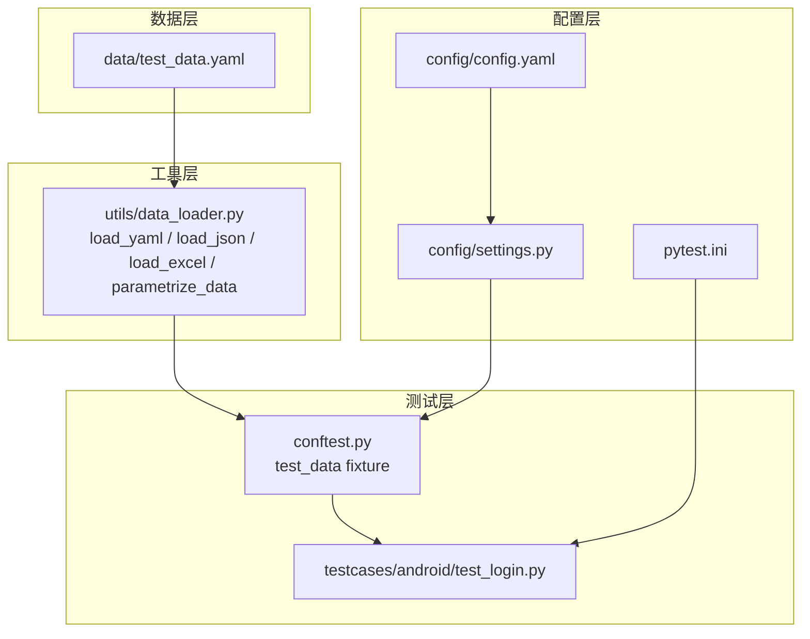
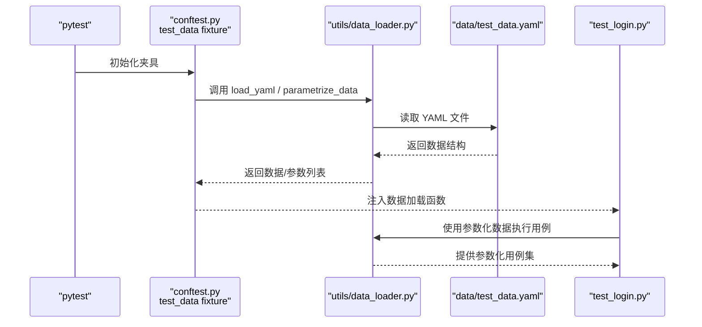
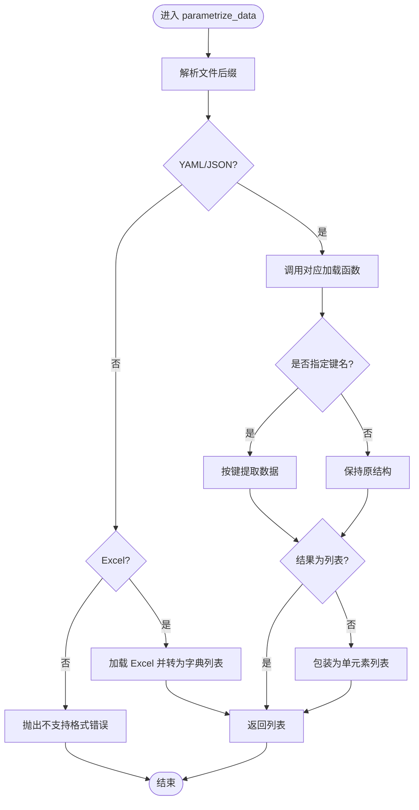
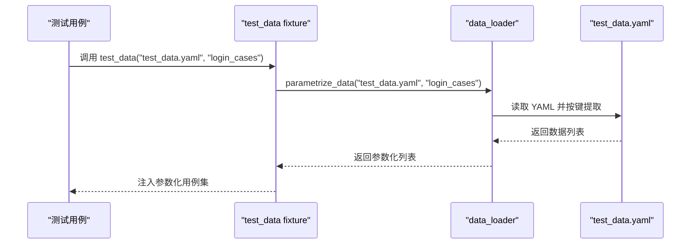
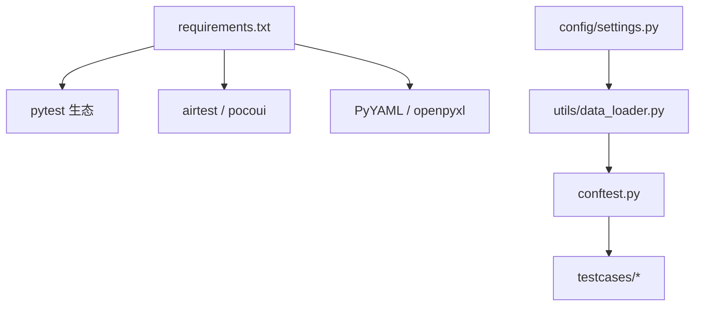

# 测试数据管理

<cite>
**本文引用的文件**
- [data/test_data.yaml](file://data/test_data.yaml)
- [utils/data_loader.py](file://utils/data_loader.py)
- [conftest.py](file://conftest.py)
- [config/config.yaml](file://config/config.yaml)
- [config/settings.py](file://config/settings.py)
- [pytest.ini](file://pytest.ini)
- [requirements.txt](file://requirements.txt)
- [testcases/android/test_login.py](file://testcases/android/test_login.py)
</cite>

## 目录
1. [简介](#简介)
2. [项目结构](#项目结构)
3. [核心组件](#核心组件)
4. [架构总览](#架构总览)
5. [详细组件分析](#详细组件分析)
6. [依赖分析](#依赖分析)
7. [性能考虑](#性能考虑)
8. [故障排查指南](#故障排查指南)
9. [结论](#结论)
10. [附录](#附录)

## 简介
本指南围绕 AirTestUI 框架中的测试数据管理展开，目标是帮助测试工程师高效地设计、组织与维护测试数据，实现参数化与数据驱动测试。文档以 test_data.yaml 为例，系统讲解外部数据文件的结构设计、加载与使用方法；结合 data_loader 工具模块，说明如何在测试用例中加载与使用外部数据；并提供参数化测试的实现方式、维护策略（更新、版本控制、隔离）以及不同场景下的数据管理方案（用户凭证、环境配置、动态数据等）。

## 项目结构
AirTestUI 的测试数据管理采用“配置文件 + 工具模块 + fixture”的分层设计：
- 数据文件：位于 data/ 目录，采用 YAML 结构，便于人类阅读与维护。
- 工具模块：utils/data_loader 提供 YAML/JSON/Excel 的统一加载接口与参数化转换能力。
- 测试夹具：conftest.py 定义 test_data fixture，使测试用例可直接注入数据。
- 运行配置：pytest.ini、config/config.yaml、config/settings.py 提供运行参数、环境与超时等基础设置。

图表来源
- [data/test_data.yaml:1-70](file://data/test_data.yaml#L1-L70)
- [utils/data_loader.py:18-127](file://utils/data_loader.py#L18-L127)
- [conftest.py:238-254](file://conftest.py#L238-L254)
- [pytest.ini:1-47](file://pytest.ini#L1-L47)
- [config/config.yaml:1-70](file://config/config.yaml#L1-L70)
- [config/settings.py:1-112](file://config/settings.py#L1-L112)

章节来源
- [data/test_data.yaml:1-70](file://data/test_data.yaml#L1-L70)
- [utils/data_loader.py:1-128](file://utils/data_loader.py#L1-L128)
- [conftest.py:1-255](file://conftest.py#L1-L255)
- [pytest.ini:1-47](file://pytest.ini#L1-L47)
- [config/config.yaml:1-70](file://config/config.yaml#L1-L70)
- [config/settings.py:1-112](file://config/settings.py#L1-L112)

## 核心组件
- 测试数据文件：以 YAML 为主，支持分组键（如 login_cases、search_cases），便于按场景拆分与参数化。
- data_loader 工具模块：提供统一的文件加载与参数化转换接口，支持 YAML/JSON/Excel，内部自动解析相对路径至 data/ 目录。
- test_data fixture：在 conftest.py 中定义，向测试用例注入数据加载能力，支持按键提取与参数化返回。

章节来源
- [data/test_data.yaml:7-70](file://data/test_data.yaml#L7-L70)
- [utils/data_loader.py:18-127](file://utils/data_loader.py#L18-L127)
- [conftest.py:238-254](file://conftest.py#L238-L254)

## 架构总览
下图展示了从数据文件到测试用例的完整调用链路，体现数据驱动测试的端到端流程。

图表来源
- [conftest.py:238-254](file://conftest.py#L238-L254)
- [utils/data_loader.py:18-127](file://utils/data_loader.py#L18-L127)
- [data/test_data.yaml:1-70](file://data/test_data.yaml#L1-L70)
- [testcases/android/test_login.py:1-71](file://testcases/android/test_login.py#L1-L71)

## 详细组件分析

### 测试数据文件结构与使用
- 结构设计要点
  - 分组键：login_cases、search_cases 等，便于按业务模块划分数据集。
  - 字段命名：建议统一语义化命名（如 case_name、username、password、expected_result、severity 等），提升可读性与可维护性。
  - 优先级字段：severity 支持 P0/P1/P2 等分级，便于筛选与报告。
- 使用方法
  - 直接加载：使用 test_data fixture 或 data_loader.load_yaml 获取整份数据。
  - 参数化：使用 data_loader.parametrize_data 指定键名，返回参数列表供 pytest.mark.parametrize 使用。

章节来源
- [data/test_data.yaml:7-70](file://data/test_data.yaml#L7-L70)
- [utils/data_loader.py:85-119](file://utils/data_loader.py#L85-L119)
- [conftest.py:238-254](file://conftest.py#L238-L254)

### data_loader 工具模块
- 功能概览
  - load_yaml：安全加载 YAML，支持相对路径与绝对路径，自动定位 data/ 目录。
  - load_json：加载 JSON 数据。
  - load_excel：只读解析 Excel，首行作为键名，逐行生成字典列表。
  - parametrize_data：根据文件类型与键名提取数据，统一输出为 pytest 参数列表。
- 路径解析
  - 若传入绝对路径则直接使用；否则拼接至 data/ 目录，保证数据文件集中管理与一致性。

图表来源
- [utils/data_loader.py:85-119](file://utils/data_loader.py#L85-L119)

章节来源
- [utils/data_loader.py:18-127](file://utils/data_loader.py#L18-L127)

### test_data fixture 与参数化测试
- test_data fixture
  - 在 conftest.py 中定义，返回一个可调用对象，支持两种用法：
    - 不带键名：直接返回 YAML/JSON/Excel 的原始数据结构。
    - 带键名：返回参数化列表，供 pytest.mark.parametrize 使用。
- 参数化测试示例思路
  - 在测试类或函数中注入 test_data，按需传入键名进行参数化。
  - 使用 pytest.mark.p0/p1/p2 等标记配合 severity 字段，实现优先级筛选与报告。

图表来源
- [conftest.py:238-254](file://conftest.py#L238-L254)
- [utils/data_loader.py:85-119](file://utils/data_loader.py#L85-L119)
- [data/test_data.yaml:7-41](file://data/test_data.yaml#L7-L41)

章节来源
- [conftest.py:238-254](file://conftest.py#L238-L254)
- [utils/data_loader.py:85-119](file://utils/data_loader.py#L85-L119)
- [testcases/android/test_login.py:1-71](file://testcases/android/test_login.py#L1-L71)

### 不同类型测试数据的管理方案
- 用户凭证
  - 建议将敏感信息放入受控的本地配置或环境变量，避免提交到版本库。
  - 在 YAML 中保留占位符或示例值，实际值由环境变量或本地覆盖配置注入。
- 测试环境配置
  - environments 分组用于区分 dev/staging/production 等环境，结合 config/settings 的环境变量覆盖机制，实现环境切换。
- 动态数据
  - 对于需要动态生成的数据（如随机字符串、时间戳），可在测试用例中生成并注入，或通过工具函数统一生成。

章节来源
- [data/test_data.yaml:60-70](file://data/test_data.yaml#L60-L70)
- [config/config.yaml:5-6](file://config/config.yaml#L5-L6)
- [config/settings.py:20-31](file://config/settings.py#L20-L31)

## 依赖分析
- 外部依赖
  - pytest 生态：pytest、pytest-xdist、pytest-html、allure-pytest、pytest-rerunfailures。
  - AirTest/Poco：airtest、pocoui。
  - 配置与数据：PyYAML、openpyxl。
- 内部依赖
  - utils/data_loader 依赖 config/settings 的 ROOT_DIR，确保 data/ 目录解析一致。
  - conftest.py 依赖 utils/data_loader 提供的加载与参数化能力。

图表来源
- [requirements.txt:1-21](file://requirements.txt#L1-L21)
- [config/settings.py:10-11](file://config/settings.py#L10-L11)
- [utils/data_loader.py:9-15](file://utils/data_loader.py#L9-L15)
- [conftest.py:1-255](file://conftest.py#L1-L255)

章节来源
- [requirements.txt:1-21](file://requirements.txt#L1-L21)
- [config/settings.py:1-112](file://config/settings.py#L1-L112)
- [utils/data_loader.py:1-128](file://utils/data_loader.py#L1-L128)
- [conftest.py:1-255](file://conftest.py#L1-L255)

## 性能考虑
- 数据文件大小与加载频率
  - 将大型数据拆分为多个文件或按场景分组，减少单次加载体积。
- 参数化规模控制
  - 合理控制参数化用例数量，避免单次测试会话压力过大；必要时分批执行。
- 路径解析与 I/O
  - data_loader 统一解析 data/ 目录，减少重复 I/O 与路径拼接开销。

## 故障排查指南
- 数据文件格式不支持
  - 现象：抛出不支持的数据文件格式错误。
  - 排查：确认文件扩展名为 .yaml/.yml/.json/.xlsx/.xls 之一。
- 键名不存在
  - 现象：参数化返回空列表。
  - 排查：核对 YAML 中顶层键名是否正确，或检查 JSON/Excel 的结构是否匹配预期。
- 路径解析问题
  - 现象：找不到数据文件。
  - 排查：确认传入的是相对路径还是绝对路径；相对路径将被拼接到 data/ 目录。
- 环境变量覆盖未生效
  - 现象：期望的配置未被覆盖。
  - 排查：确认环境变量前缀与键名符合 config/settings 的覆盖规则。

章节来源
- [utils/data_loader.py:104-115](file://utils/data_loader.py#L104-L115)
- [utils/data_loader.py:122-127](file://utils/data_loader.py#L122-L127)
- [config/settings.py:20-31](file://config/settings.py#L20-L31)

## 结论
通过将测试数据集中于 data/ 目录、以 YAML/JSON/Excel 统一管理，并借助 data_loader 与 test_data fixture，AirTestUI 实现了清晰、可维护、可扩展的数据驱动测试体系。结合合理的分组与优先级标注、严格的维护策略与环境隔离，可显著提升测试效率与质量。

## 附录
- 命令行与标记
  - pytest.ini 中定义了默认命令行参数与自定义标记，便于按平台、优先级与测试类型筛选执行。
- 运行环境与超时
  - config/config.yaml 与 config/settings.py 提供环境、超时、设备与应用配置，支持环境变量覆盖与本地覆盖配置。

章节来源
- [pytest.ini:10-32](file://pytest.ini#L10-L32)
- [config/config.yaml:5-6](file://config/config.yaml#L5-L6)
- [config/settings.py:84-91](file://config/settings.py#L84-L91)