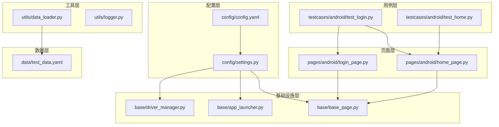
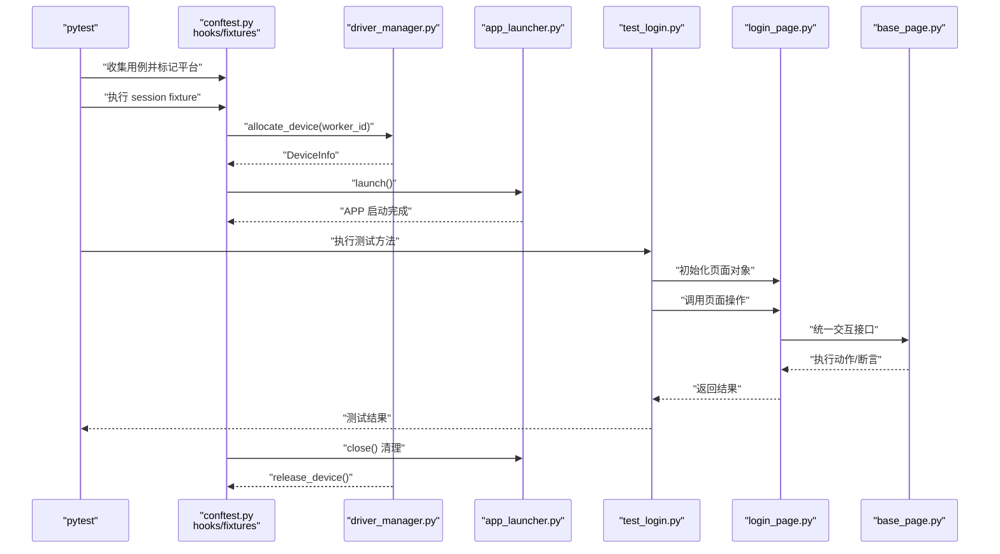
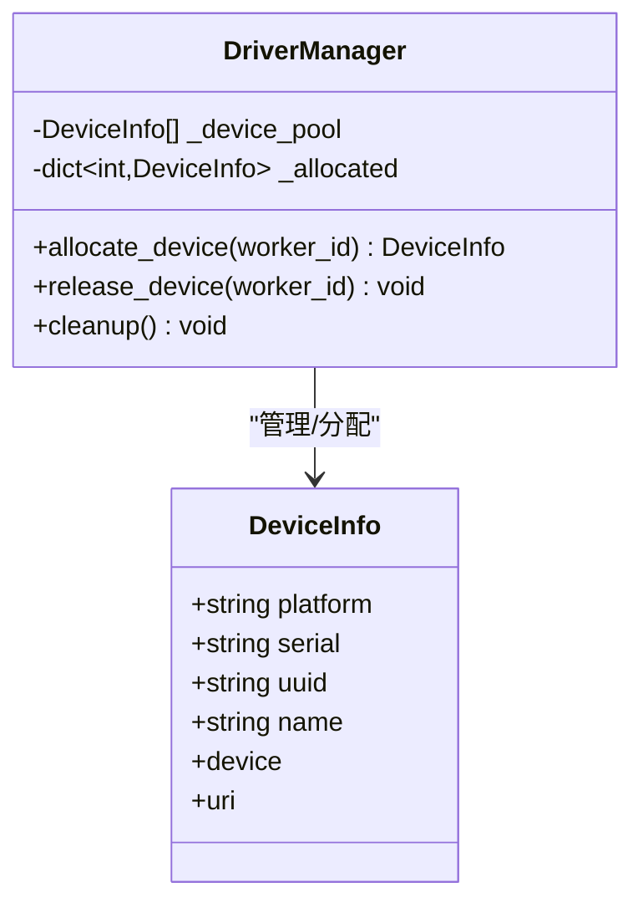
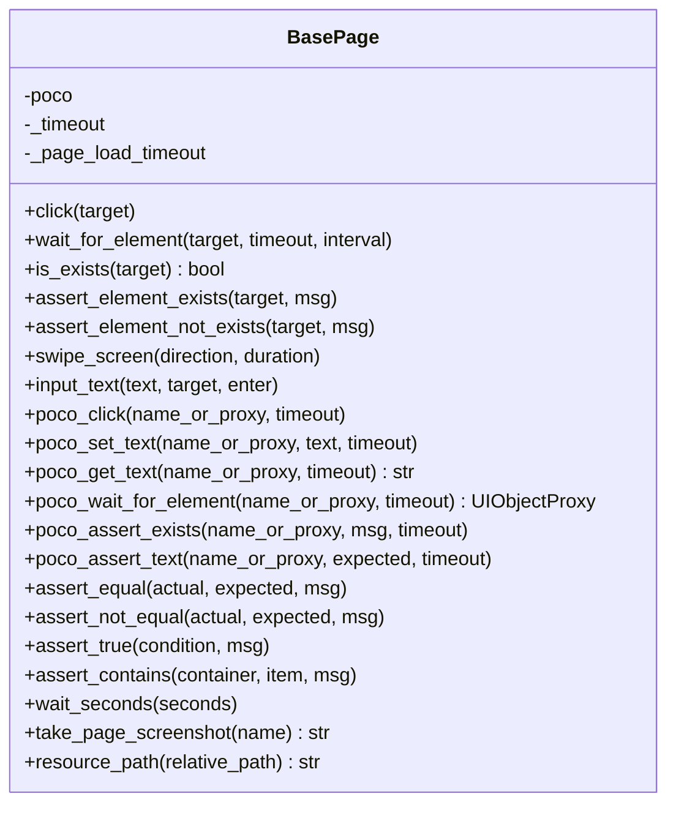
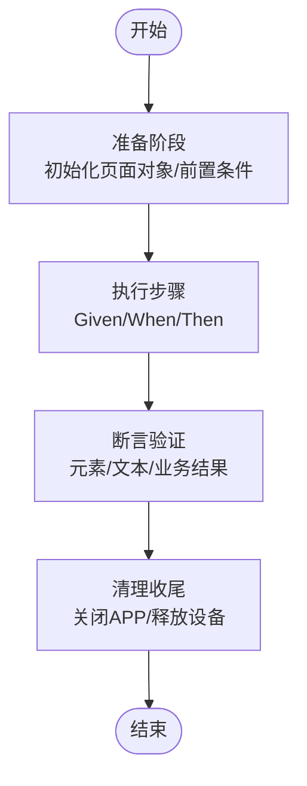
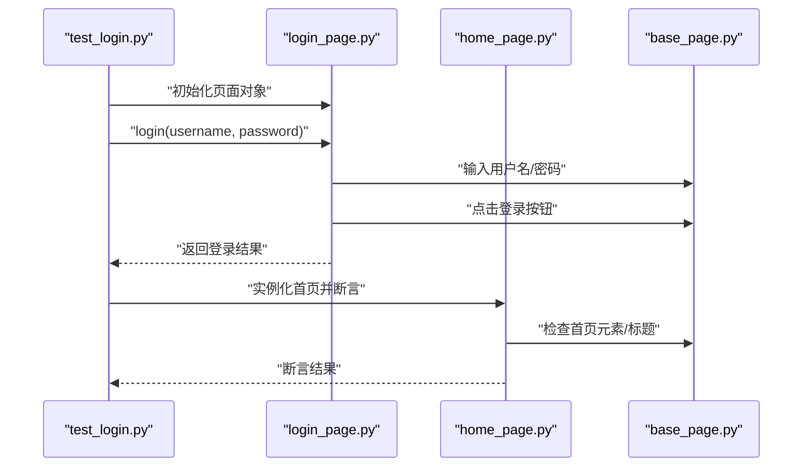
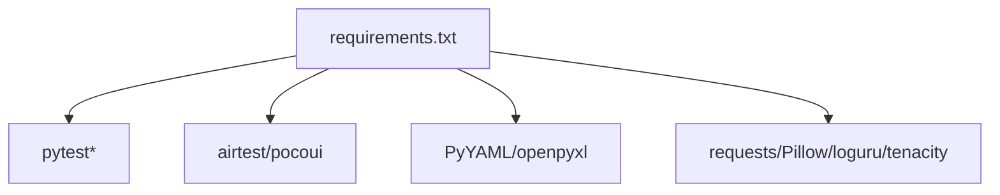

# 测试用例编写指南

<cite>
**本文引用的文件**
- [conftest.py](file://conftest.py)
- [pytest.ini](file://pytest.ini)
- [requirements.txt](file://requirements.txt)
- [config/config.yaml](file://config/config.yaml)
- [config/settings.py](file://config/settings.py)
- [base/driver_manager.py](file://base/driver_manager.py)
- [base/app_launcher.py](file://base/app_launcher.py)
- [base/base_page.py](file://base/base_page.py)
- [data/test_data.yaml](file://data/test_data.yaml)
- [utils/data_loader.py](file://utils/data_loader.py)
- [utils/logger.py](file://utils/logger.py)
- [testcases/android/test_login.py](file://testcases/android/test_login.py)
- [testcases/android/test_home.py](file://testcases/android/test_home.py)
- [pages/android/login_page.py](file://pages/android/login_page.py)
- [pages/android/home_page.py](file://pages/android/home_page.py)
</cite>

## 目录
1. [简介](#简介)
2. [项目结构](#项目结构)
3. [核心组件](#核心组件)
4. [架构总览](#架构总览)
5. [详细组件分析](#详细组件分析)
6. [依赖分析](#依赖分析)
7. [性能考虑](#性能考虑)
8. [故障排查指南](#故障排查指南)
9. [结论](#结论)
10. [附录](#附录)

## 简介
本指南面向使用 AirTestUI 框架进行移动端自动化测试的工程师，系统讲解如何在 Android 与 iOS 平台上编写高质量的测试用例，涵盖测试结构设计、执行步骤、断言验证、清理收尾、测试数据管理、参数化与模板化、调试技巧与常见问题处理。文档以仓库现有实现为基础，结合最佳实践，帮助读者快速上手并规范化测试用例编写。

## 项目结构
AirTestUI 采用分层清晰的组织方式：
- 配置层：集中管理环境、超时、设备、应用与通知等配置
- 基础设施层：设备驱动管理、APP 生命周期管理、Page Object 基类
- 工具层：日志、数据加载、截图、通知、重试等
- 页面层：各平台页面对象（Android/iOS）
- 用例层：按平台划分的测试用例集合
- 数据层：测试数据文件（YAML/Excel/JSON）

**图表来源**
- [config/config.yaml:1-70](file://config/config.yaml#L1-L70)
- [config/settings.py:1-112](file://config/settings.py#L1-L112)
- [base/driver_manager.py:1-188](file://base/driver_manager.py#L1-L188)
- [base/app_launcher.py:1-127](file://base/app_launcher.py#L1-L127)
- [base/base_page.py:1-320](file://base/base_page.py#L1-L320)
- [utils/data_loader.py:1-128](file://utils/data_loader.py#L1-L128)
- [pages/android/login_page.py:1-107](file://pages/android/login_page.py#L1-L107)
- [pages/android/home_page.py:1-58](file://pages/android/home_page.py#L1-L58)
- [testcases/android/test_login.py:1-71](file://testcases/android/test_login.py#L1-L71)
- [testcases/android/test_home.py:1-48](file://testcases/android/test_home.py#L1-L48)
- [data/test_data.yaml:1-70](file://data/test_data.yaml#L1-L70)

**章节来源**
- [config/config.yaml:1-70](file://config/config.yaml#L1-L70)
- [config/settings.py:1-112](file://config/settings.py#L1-L112)
- [base/driver_manager.py:1-188](file://base/driver_manager.py#L1-L188)
- [base/app_launcher.py:1-127](file://base/app_launcher.py#L1-L127)
- [base/base_page.py:1-320](file://base/base_page.py#L1-L320)
- [utils/data_loader.py:1-128](file://utils/data_loader.py#L1-L128)
- [pages/android/login_page.py:1-107](file://pages/android/login_page.py#L1-L107)
- [pages/android/home_page.py:1-58](file://pages/android/home_page.py#L1-L58)
- [testcases/android/test_login.py:1-71](file://testcases/android/test_login.py#L1-L71)
- [testcases/android/test_home.py:1-48](file://testcases/android/test_home.py#L1-L48)
- [data/test_data.yaml:1-70](file://data/test_data.yaml#L1-L70)

## 核心组件
- 配置与环境
  - 通过 YAML 集中管理环境、超时、设备、应用与通知配置，并支持环境变量覆盖
- 设备与并发
  - 设备驱动管理器负责设备池初始化、分配与释放，支持多 worker 并发
- APP 生命周期
  - APP 启停管理器负责启动、关闭、重启、清除数据与可选安装
- Page Object 基类
  - 提供图像识别与 Poco 双模式的统一交互接口，内置智能等待、截图、断言与 Allure 步骤
- 数据加载
  - 支持 YAML/JSON/Excel，提供参数化数据格式化能力
- 日志与报告
  - 结构化日志、Allure 报告、失败自动截图与通知

**章节来源**
- [config/config.yaml:1-70](file://config/config.yaml#L1-L70)
- [config/settings.py:1-112](file://config/settings.py#L1-L112)
- [base/driver_manager.py:1-188](file://base/driver_manager.py#L1-L188)
- [base/app_launcher.py:1-127](file://base/app_launcher.py#L1-L127)
- [base/base_page.py:1-320](file://base/base_page.py#L1-L320)
- [utils/data_loader.py:1-128](file://utils/data_loader.py#L1-L128)
- [utils/logger.py:1-59](file://utils/logger.py#L1-L59)

## 架构总览
下图展示测试执行的关键流程：pytest hooks 与 fixtures 初始化设备与 APP，用例通过页面对象调用基础能力，失败时自动截图并记录 Allure 步骤。

**图表来源**
- [conftest.py:1-255](file://conftest.py#L1-L255)
- [base/driver_manager.py:1-188](file://base/driver_manager.py#L1-L188)
- [base/app_launcher.py:1-127](file://base/app_launcher.py#L1-L127)
- [testcases/android/test_login.py:1-71](file://testcases/android/test_login.py#L1-L71)
- [pages/android/login_page.py:1-107](file://pages/android/login_page.py#L1-L107)
- [base/base_page.py:1-320](file://base/base_page.py#L1-L320)

## 详细组件分析

### 配置与环境管理
- 配置来源与覆盖
  - 主配置来自 YAML，支持本地覆盖文件与环境变量覆盖
  - 通过便捷函数获取环境、超时、设备与应用配置
- 关键配置项
  - 环境、超时（元素等待/页面加载/APP 启动）、截图策略、重试策略、报告与通知
  - Android/iOS 设备与应用配置（序列号/UUID、包名/BID、安装路径、Activity）

最佳实践
- 使用环境变量覆盖生产敏感信息
- 将设备与应用配置拆分为不同环境文件，避免硬编码

**章节来源**
- [config/config.yaml:1-70](file://config/config.yaml#L1-L70)
- [config/settings.py:1-112](file://config/settings.py#L1-L112)

### 设备驱动管理器
职责
- 初始化设备池（Android/iOS）
- 按 worker 分配设备，支持复用
- 管理设备连接生命周期与清理

并发与稳定性
- 线程安全的分配与释放
- 设备不足时的复用策略与警告日志

**图表来源**
- [base/driver_manager.py:20-188](file://base/driver_manager.py#L20-L188)

**章节来源**
- [base/driver_manager.py:1-188](file://base/driver_manager.py#L1-L188)

### APP 启停管理器
能力
- 启动/关闭/重启/清除数据（Android）
- 可选安装应用（APK/IPA）
- 基于平台差异的启动参数

使用建议
- 在会话级 fixture 中自动启动与关闭，确保用例间状态隔离
- 对于需要安装的应用，提前配置安装路径

**章节来源**
- [base/app_launcher.py:1-127](file://base/app_launcher.py#L1-L127)

### Page Object 基类
统一接口
- 图像识别：点击、等待、存在性断言、滑动、输入
- Poco 模式：点击、输入、获取文本、等待出现、断言存在/文本
- 通用断言：相等、不相等、为真、包含
- 工具：显式等待、截图并附加到 Allure、资源路径解析

错误处理
- 失败时自动截图并记录日志
- Allure 步骤化记录，便于报告追踪

**图表来源**
- [base/base_page.py:30-320](file://base/base_page.py#L30-L320)

**章节来源**
- [base/base_page.py:1-320](file://base/base_page.py#L1-L320)

### 数据加载与参数化
- YAML/JSON/Excel 加载
- 参数化数据格式化，适配 pytest.mark.parametrize
- 支持相对路径与绝对路径

测试数据示例
- 登录用例、搜索用例、环境配置等

**章节来源**
- [utils/data_loader.py:1-128](file://utils/data_loader.py#L1-L128)
- [data/test_data.yaml:1-70](file://data/test_data.yaml#L1-L70)

### 测试用例结构设计
推荐结构
- 准备阶段：fixture 初始化页面对象与前置条件
- 执行步骤：按 Given/When/Then 或 Setup/Action/Assert 组织
- 断言验证：页面元素存在性、文本一致性、业务结果校验
- 清理收尾：会话结束自动关闭 APP，设备释放

[此图为概念性流程图，无需图表来源]

### Android 登录用例示例
- 功能测试：有效账号登录、错误密码登录、空用户名登录
- 回归测试：登录页面 UI 元素完整性
- 标记与严重级别：平台标记、冒烟/回归标记、优先级标记

**图表来源**
- [testcases/android/test_login.py:1-71](file://testcases/android/test_login.py#L1-L71)
- [pages/android/login_page.py:1-107](file://pages/android/login_page.py#L1-L107)
- [pages/android/home_page.py:1-58](file://pages/android/home_page.py#L1-L58)
- [base/base_page.py:1-320](file://base/base_page.py#L1-L320)

**章节来源**
- [testcases/android/test_login.py:1-71](file://testcases/android/test_login.py#L1-L71)
- [pages/android/login_page.py:1-107](file://pages/android/login_page.py#L1-L107)
- [pages/android/home_page.py:1-58](file://pages/android/home_page.py#L1-L58)

### Android 首页用例示例
- 首页加载与标题断言
- 导航到个人中心与搜索功能

**章节来源**
- [testcases/android/test_home.py:1-48](file://testcases/android/test_home.py#L1-L48)
- [pages/android/home_page.py:1-58](file://pages/android/home_page.py#L1-L58)

### iOS 平台适配
- iOS 页面对象与 Android 类似，遵循相同结构
- Poco 引擎按平台自动选择
- 设备配置使用 UUID

**章节来源**
- [conftest.py:185-208](file://conftest.py#L185-L208)
- [config/config.yaml:61-69](file://config/config.yaml#L61-L69)

## 依赖分析
- 测试框架与插件
  - pytest、pytest-xdist、pytest-html、allure-pytest、pytest-rerunfailures
- Airtest/Poco
  - airtest、pocoui
- 数据与工具
  - PyYAML、openpyxl、requests、Pillow、loguru、tenacity

**图表来源**
- [requirements.txt:1-21](file://requirements.txt#L1-L21)

**章节来源**
- [requirements.txt:1-21](file://requirements.txt#L1-L21)

## 性能考虑
- 超时配置
  - 元素等待、页面加载、APP 启动超时可通过配置统一管理
- 截图策略
  - 失败自动截图与按需开启每步截图，平衡诊断信息与性能
- 并发与设备复用
  - 多 worker 并发执行，设备不足时复用，注意状态隔离
- 重试机制
  - 失败重试次数与间隔可配置，避免瞬时波动导致误判

**章节来源**
- [config/config.yaml:8-30](file://config/config.yaml#L8-L30)
- [base/driver_manager.py:119-150](file://base/driver_manager.py#L119-L150)

## 故障排查指南
- 设备连接失败
  - 检查设备配置（序列号/UUID）、驱动与权限
  - 查看日志与错误堆栈，确认连接 URI 与平台匹配
- APP 启动失败
  - 校验包名/BID、Activity、安装路径
  - 增加启动等待时间或检查应用白名单/权限
- 元素定位失败
  - 图像识别：确保资源图片清晰、对比度高
  - Poco：确认节点名正确，等待元素出现后再断言
- 截图与报告
  - 失败自动截图与 Allure 步骤已在 hooks 中启用
  - 检查报告目录与附件是否生成
- 日志定位
  - 使用结构化日志，关注关键模块日志级别与文件轮转

**章节来源**
- [conftest.py:119-138](file://conftest.py#L119-L138)
- [utils/logger.py:1-59](file://utils/logger.py#L1-L59)
- [base/base_page.py:60-127](file://base/base_page.py#L60-L127)

## 结论
通过统一的配置、设备与 APP 生命周期管理、Page Object 基类以及完善的工具链，AirTestUI 为 Android 与 iOS 平台提供了可扩展、可维护的自动化测试框架。遵循本文的结构设计、数据管理策略与调试方法，能够高效产出高质量的测试用例，并在团队内形成一致的实践标准。

## 附录

### 测试用例编写模板
- 功能测试模板
  - Given：前置条件（登录/页面加载）
  - When：执行操作（点击/输入/滑动）
  - Then：断言结果（元素存在/文本一致/跳转验证）
- 回归测试模板
  - 覆盖关键路径与边界条件，使用参数化数据驱动
- 兼容性测试模板
  - 多设备/多版本并行执行，关注平台差异与 UI 行为

[本节为概念性模板说明，无需章节来源]

### 标记与严重级别
- 平台标记：android、ios
- 测试类型：smoke、regression
- 优先级：p0/p1/p2
- CI 跳过：skip_ci

**章节来源**
- [pytest.ini:24-32](file://pytest.ini#L24-L32)