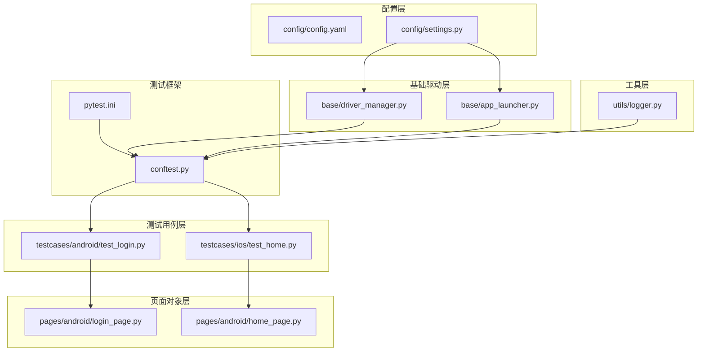
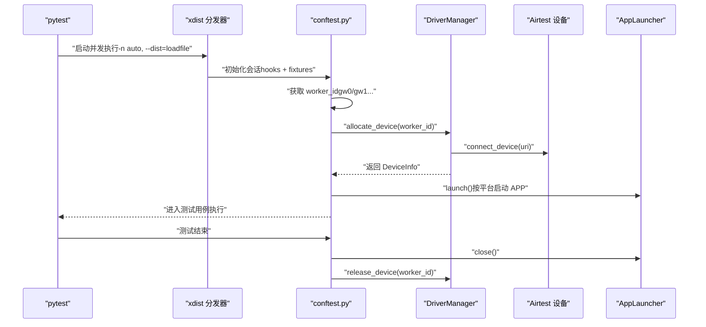
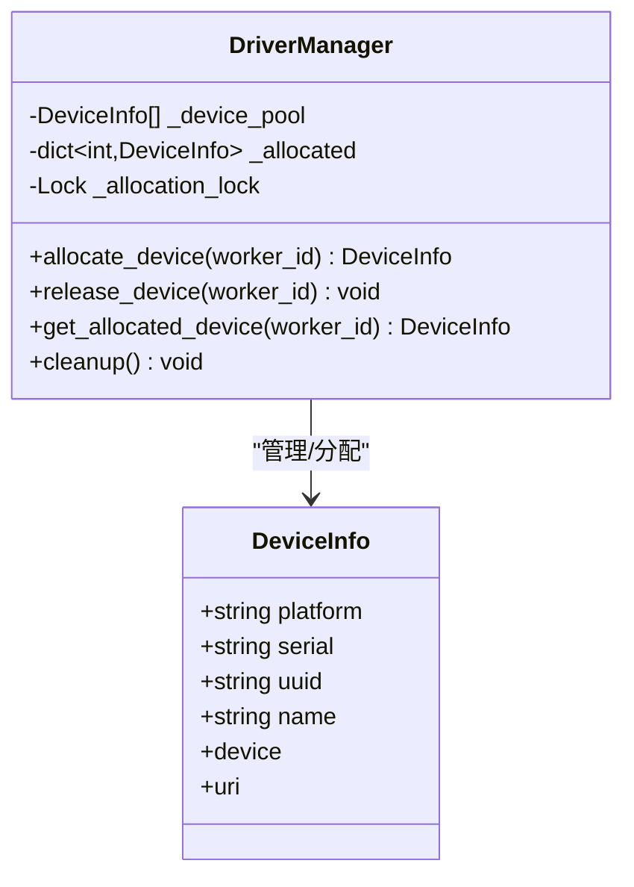
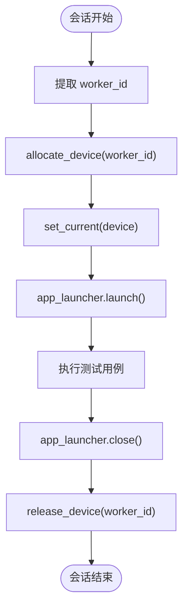
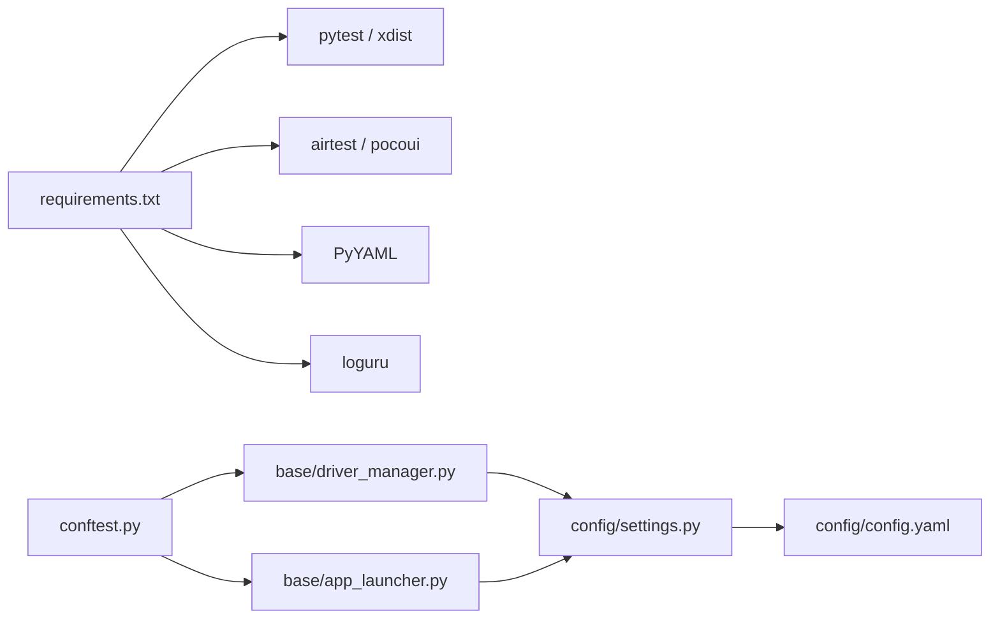

# 多设备并发管理

<cite>
**本文引用的文件**
- [conftest.py](file://conftest.py)
- [pytest.ini](file://pytest.ini)
- [config/settings.py](file://config/settings.py)
- [config/config.yaml](file://config/config.yaml)
- [base/driver_manager.py](file://base/driver_manager.py)
- [base/app_launcher.py](file://base/app_launcher.py)
- [utils/logger.py](file://utils/logger.py)
- [testcases/android/test_login.py](file://testcases/android/test_login.py)
- [testcases/ios/test_home.py](file://testcases/ios/test_home.py)
- [pages/android/login_page.py](file://pages/android/login_page.py)
- [pages/android/home_page.py](file://pages/android/home_page.py)
- [requirements.txt](file://requirements.txt)
</cite>

## 目录
1. [引言](#引言)
2. [项目结构](#项目结构)
3. [核心组件](#核心组件)
4. [架构总览](#架构总览)
5. [详细组件分析](#详细组件分析)
6. [依赖分析](#依赖分析)
7. [性能考虑](#性能考虑)
8. [故障排查指南](#故障排查指南)
9. [结论](#结论)
10. [附录](#附录)

## 引言
本文件围绕 AirTestUI 的多设备并发测试能力，系统性阐述其在 pytest-xdist 并发执行场景下的设备分配、隔离与资源管理机制。重点包括：
- 设备池初始化与分配策略（一对一与复用）
- worker 进程间设备隔离与状态同步
- 设备锁定、冲突处理与清理
- pytest 并发执行时的 fixture 生命周期与设备上下文设置
- 实战最佳实践与性能调优建议
- 结合真实用例展示配置与执行流程

## 项目结构
AirTestUI 采用分层组织：配置层（config）、基础驱动层（base）、页面对象层（pages）、测试用例层（testcases）、工具层（utils），并通过 pytest 插件与 hooks 完成并发与设备生命周期管理。

**图表来源**
- [pytest.ini:1-47](file://pytest.ini#L1-L47)
- [conftest.py:1-255](file://conftest.py#L1-L255)
- [config/settings.py:1-112](file://config/settings.py#L1-L112)
- [config/config.yaml:1-70](file://config/config.yaml#L1-L70)
- [base/driver_manager.py:1-188](file://base/driver_manager.py#L1-L188)
- [base/app_launcher.py:1-127](file://base/app_launcher.py#L1-L127)
- [utils/logger.py:1-59](file://utils/logger.py#L1-L59)
- [testcases/android/test_login.py:1-71](file://testcases/android/test_login.py#L1-L71)
- [testcases/ios/test_home.py:1-38](file://testcases/ios/test_home.py#L1-L38)
- [pages/android/login_page.py:1-107](file://pages/android/login_page.py#L1-L107)
- [pages/android/home_page.py:1-58](file://pages/android/home_page.py#L1-L58)

**章节来源**
- [pytest.ini:1-47](file://pytest.ini#L1-L47)
- [conftest.py:1-255](file://conftest.py#L1-L255)
- [config/settings.py:1-112](file://config/settings.py#L1-L112)
- [config/config.yaml:1-70](file://config/config.yaml#L1-L70)
- [base/driver_manager.py:1-188](file://base/driver_manager.py#L1-L188)
- [base/app_launcher.py:1-127](file://base/app_launcher.py#L1-L127)
- [utils/logger.py:1-59](file://utils/logger.py#L1-L59)
- [testcases/android/test_login.py:1-71](file://testcases/android/test_login.py#L1-L71)
- [testcases/ios/test_home.py:1-38](file://testcases/ios/test_home.py#L1-L38)
- [pages/android/login_page.py:1-107](file://pages/android/login_page.py#L1-L107)
- [pages/android/home_page.py:1-58](file://pages/android/home_page.py#L1-L58)

## 核心组件
- 设备驱动管理器（DriverManager）：负责设备池初始化、分配与释放，确保多 worker 并发下的线程安全与设备唯一占用。
- 设备信息（DeviceInfo）：封装平台、序列号/UUID、名称与 airtest 设备句柄，提供连接 URI 生成。
- APP 启停管理器（AppLauncher）：按平台启动/关闭应用，支持可选安装与数据清理。
- pytest fixtures：提供 worker_id、device_info、airtest_device、platform、poco、app_launcher 等，贯穿会话生命周期。
- 配置系统：从 config.yaml 与环境变量加载设备与超时等配置；支持本地覆盖文件。

**章节来源**
- [base/driver_manager.py:20-49](file://base/driver_manager.py#L20-L49)
- [base/driver_manager.py:51-188](file://base/driver_manager.py#L51-L188)
- [base/app_launcher.py:20-127](file://base/app_launcher.py#L20-L127)
- [conftest.py:140-255](file://conftest.py#L140-L255)
- [config/settings.py:51-112](file://config/settings.py#L51-L112)
- [config/config.yaml:44-70](file://config/config.yaml#L44-L70)

## 架构总览
AirTestUI 的多设备并发架构以 pytest-xdist 为执行引擎，通过自定义 hooks 与 fixtures 实现设备分配与上下文绑定。核心流程如下：

**图表来源**
- [pytest.ini:11-22](file://pytest.ini#L11-L22)
- [conftest.py:140-255](file://conftest.py#L140-L255)
- [base/driver_manager.py:119-151](file://base/driver_manager.py#L119-L151)
- [base/app_launcher.py:49-93](file://base/app_launcher.py#L49-L93)

## 详细组件分析

### 设备驱动管理器（DriverManager）
- 单例模式与线程安全：通过锁保护设备池与分配映射，避免并发冲突。
- 设备池初始化：读取配置中的 Android/iOS 设备列表，构建 DeviceInfo 列表。
- 分配策略：
  - 优先一对一：遍历设备池，选择未被占用的设备分配给当前 worker。
  - 设备不足时复用：按 worker_id 对设备数取模，复用设备；若未连接则先连接。
- 释放与清理：会话结束释放设备；全局清理方法记录并清空分配映射。

**图表来源**
- [base/driver_manager.py:20-49](file://base/driver_manager.py#L20-L49)
- [base/driver_manager.py:51-188](file://base/driver_manager.py#L51-L188)

**章节来源**
- [base/driver_manager.py:51-188](file://base/driver_manager.py#L51-L188)

### 设备分配与 fixture 生命周期（conftest.py）
- worker_id 提取：从环境变量 PYTEST_XDIST_WORKER 解析当前 worker 编号。
- device_info：调用 driver_manager.allocate_device(worker_id)，在会话作用域内持有设备，并在会话结束时释放。
- airtest_device：将 airtest 设备设置为当前设备上下文，供后续步骤使用。
- platform：标注当前平台（android/ios），用于选择不同 Poco 引擎。
- poco：根据平台动态创建 Poco 实例，失败时降级为图像识别模式。
- app_launcher：按平台启动/关闭应用，贯穿会话生命周期。
- 自动 Allure 步骤与失败截图：每个用例自动记录步骤并在失败时截图。

**图表来源**
- [conftest.py:140-255](file://conftest.py#L140-L255)
- [base/driver_manager.py:119-151](file://base/driver_manager.py#L119-L151)
- [base/app_launcher.py:49-93](file://base/app_launcher.py#L49-L93)

**章节来源**
- [conftest.py:140-255](file://conftest.py#L140-L255)

### APP 启停管理器（AppLauncher）
- 平台适配：Android 使用包名+Activity 启动，iOS 使用 Bundle ID。
- 可选安装：若配置了安装路径，则在启动前安装。
- 启动等待：内置基础等待时间与超时配置。
- 关闭与重启：提供关闭与重启接口，便于用例间隔离。
- 数据清理：Android 支持清除应用数据。

**章节来源**
- [base/app_launcher.py:20-127](file://base/app_launcher.py#L20-L127)
- [config/settings.py:94-112](file://config/settings.py#L94-L112)
- [config/config.yaml:44-70](file://config/config.yaml#L44-L70)

### 配置系统（settings 与 config.yaml）
- 配置加载顺序：config.yaml → local_config.yaml（可选）→ 环境变量覆盖。
- 设备配置：android.devices 与 ios.devices 定义设备列表；android.app/ios.app 定义应用信息。
- 超时与重试：统一的超时与重试配置，影响设备连接与 APP 启动行为。
- 环境变量覆盖：以 AIRTESTUI_ 前缀覆盖 config.yaml 顶层键。

**章节来源**
- [config/settings.py:14-112](file://config/settings.py#L14-L112)
- [config/config.yaml:1-70](file://config/config.yaml#L1-L70)

### 测试用例与页面对象（示例）
- Android 登录用例：演示如何使用 poco 与图像识别混合定位，断言登录后跳转首页。
- iOS 首页用例：演示 iOS 平台首页加载与导航。
- 页面对象：login_page、home_page 封装元素定位与交互，降低用例复杂度。

**章节来源**
- [testcases/android/test_login.py:1-71](file://testcases/android/test_login.py#L1-L71)
- [testcases/ios/test_home.py:1-38](file://testcases/ios/test_home.py#L1-L38)
- [pages/android/login_page.py:1-107](file://pages/android/login_page.py#L1-L107)
- [pages/android/home_page.py:1-58](file://pages/android/home_page.py#L1-L58)

## 依赖分析
- 外部依赖：pytest、pytest-xdist、pytest-html、allure-pytest、airtest、pocoui、PyYAML、loguru 等。
- 内部耦合：conftest 依赖 driver_manager 与 app_launcher；driver_manager 依赖 settings；页面对象依赖 base.base_page 与 utils。

**图表来源**
- [requirements.txt:1-21](file://requirements.txt#L1-L21)
- [conftest.py:1-255](file://conftest.py#L1-L255)
- [base/driver_manager.py:1-188](file://base/driver_manager.py#L1-L188)
- [base/app_launcher.py:1-127](file://base/app_launcher.py#L1-L127)
- [config/settings.py:1-112](file://config/settings.py#L1-L112)
- [config/config.yaml:1-70](file://config/config.yaml#L1-L70)

**章节来源**
- [requirements.txt:1-21](file://requirements.txt#L1-L21)
- [conftest.py:1-255](file://conftest.py#L1-L255)

## 性能考虑
- 并发策略：pytest.ini 使用 --dist=loadfile 保证用例按文件分发，减少跨设备竞争；-n auto 自动根据 CPU 核心数启动 worker。
- 设备连接成本：尽量减少重复连接，DriverManager 在复用场景下延迟连接；合理规划设备数量以避免频繁复用。
- Poco 初始化：按平台选择引擎，失败时降级图像识别，避免阻塞主线程。
- 截图与报告：失败自动截图与 Allure 步骤会增加 IO，建议在并发环境中控制截图频率或仅在失败时开启。
- 超时与重试：合理设置 app_launch 与 element_wait，避免长尾用例拖慢整体进度。

[本节为通用性能建议，无需特定文件引用]

## 故障排查指南
- 设备连接失败：检查 config.yaml 中设备 URI 与序列号/UUID 是否正确；确认设备在线与授权状态。
- 设备池为空：当 worker 数大于设备数且未复用时会抛出异常；可通过增加设备或允许复用来解决。
- worker 冲突：同一设备被多个 worker 占用；确认分配逻辑与释放逻辑是否正确执行。
- APP 启动失败：检查包名/Bundle ID 与 Activity 配置；确认安装路径与权限。
- 日志定位：使用 utils/logger 的结构化日志，结合 logs 目录下的文件进行问题回溯。

**章节来源**
- [base/driver_manager.py:103-151](file://base/driver_manager.py#L103-L151)
- [base/app_launcher.py:49-93](file://base/app_launcher.py#L49-L93)
- [utils/logger.py:1-59](file://utils/logger.py#L1-L59)

## 结论
AirTestUI 通过 pytest-xdist 与自定义 fixtures 实现了稳定的多设备并发测试能力。DriverManager 提供线程安全的设备池与分配策略，conftest 将设备上下文与 APP 生命周期无缝集成，配合配置系统与日志体系，形成可扩展、可观测的自动化测试框架。实践中建议按设备数量合理规划并发度，优化 Poco 初始化与截图策略，确保稳定性与性能平衡。

[本节为总结性内容，无需特定文件引用]

## 附录

### 并发执行与设备分配最佳实践
- 明确设备清单：在 config.yaml 中维护稳定可用的设备列表，避免频繁变更。
- 平衡并发度：根据设备数量与性能选择 -n 参数，必要时允许复用但注意用例间隔离。
- 用例粒度：将强依赖设备状态的用例拆分为独立文件，配合 --dist=loadfile 提升均衡性。
- 资源清理：确保 app_launcher 在会话结束时关闭应用，避免残留状态影响其他 worker。
- 监控与告警：结合 Allure 报告与通知配置，及时发现异常。

[本节为通用实践建议，无需特定文件引用]

### 实际用例执行流程（示例）
以下为一次典型执行流程的步骤说明（不包含具体代码内容）：
- 启动：pytest 读取 pytest.ini，启用 xdist 与报告插件。
- 分发：按文件分发用例至各 worker。
- 初始化：每个 worker 在 conftest 中解析 worker_id，分配设备并连接。
- 上下文：设置 airtest 当前设备，启动对应平台 APP。
- 执行：用例使用 poco 或图像识别进行交互与断言。
- 清理：关闭 APP，释放设备，生成报告与截图。

**章节来源**
- [pytest.ini:11-22](file://pytest.ini#L11-L22)
- [conftest.py:140-255](file://conftest.py#L140-L255)
- [base/driver_manager.py:119-151](file://base/driver_manager.py#L119-L151)
- [base/app_launcher.py:49-93](file://base/app_launcher.py#L49-L93)
- [testcases/android/test_login.py:1-71](file://testcases/android/test_login.py#L1-L71)
- [testcases/ios/test_home.py:1-38](file://testcases/ios/test_home.py#L1-L38)