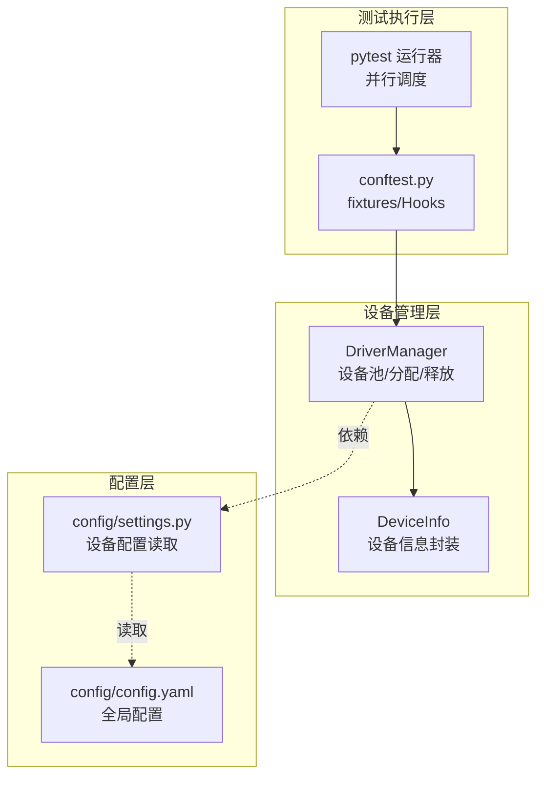
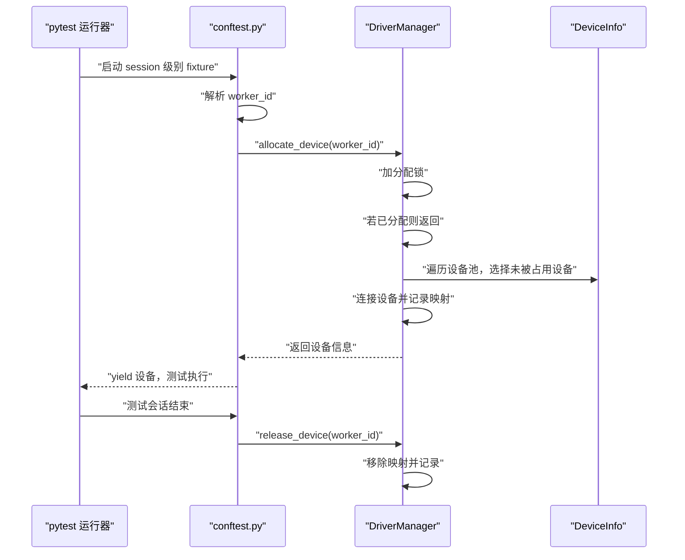
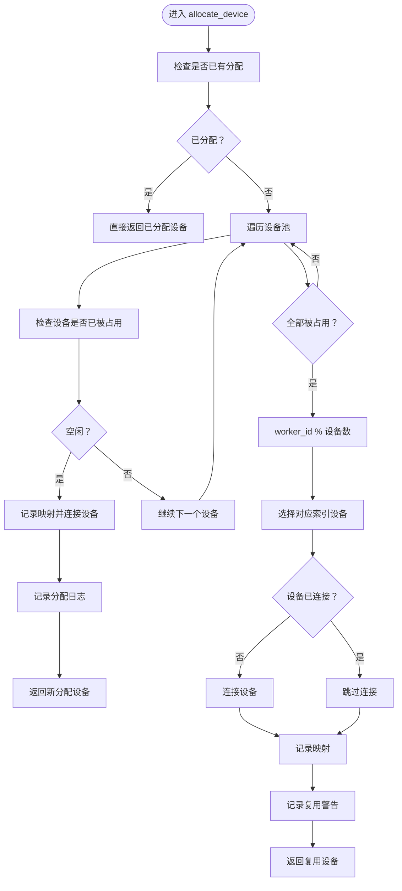
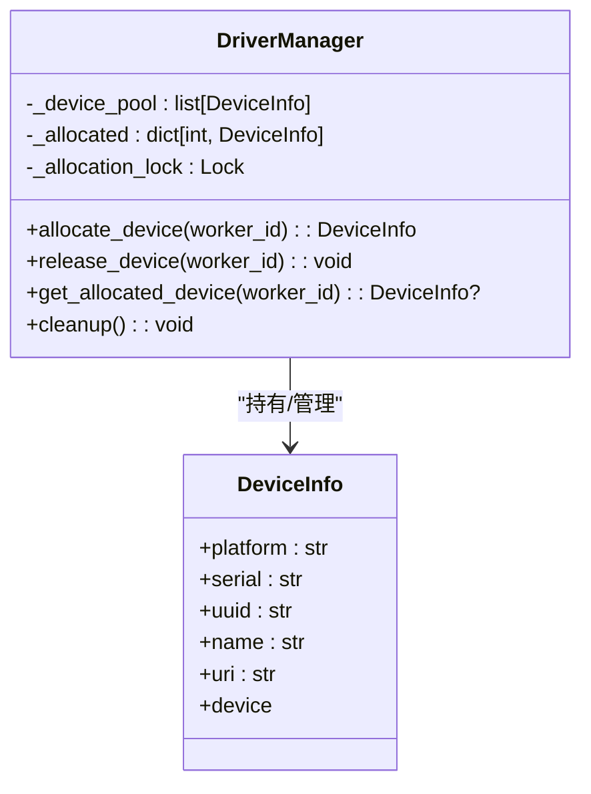
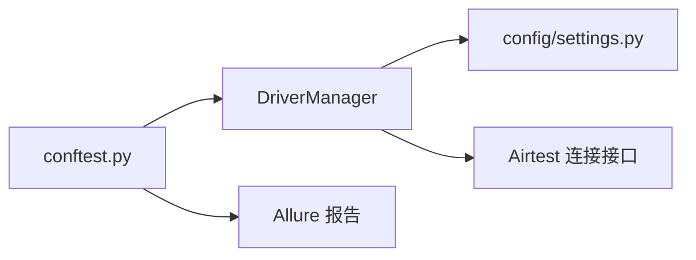

# 设备分配策略

<cite>
**本文引用的文件**
- [base/driver_manager.py](file://base/driver_manager.py)
- [conftest.py](file://conftest.py)
- [config/settings.py](file://config/settings.py)
- [config/config.yaml](file://config/config.yaml)
- [data/test_data.yaml](file://data/test_data.yaml)
- [pytest.ini](file://pytest.ini)
</cite>

## 目录
1. [引言](#引言)
2. [项目结构](#项目结构)
3. [核心组件](#核心组件)
4. [架构总览](#架构总览)
5. [详细组件分析](#详细组件分析)
6. [依赖分析](#依赖分析)
7. [性能考量](#性能考量)
8. [故障排查指南](#故障排查指南)
9. [结论](#结论)
10. [附录](#附录)

## 引言
本文件围绕 AirTestUI 的设备分配策略进行系统化说明，重点覆盖以下内容：
- 设备分配算法：按序分配、循环分配、并发分配的实现原理与行为特征
- worker_id 与设备映射关系：分配键值、复用机制、线程安全与锁策略
- 优先级策略：空闲设备优先、负载均衡、设备隔离等考虑
- 最佳实践与性能优化建议
- 使用场景与效果对比的示例路径指引

## 项目结构
AirTestUI 通过 pytest 扩展与自研驱动管理器协同工作，形成“多 worker 并发 + 设备池分配”的测试执行框架。关键文件与职责如下：
- base/driver_manager.py：设备池初始化、设备连接、按序/循环分配、释放与清理
- conftest.py：pytest 钩子与 fixtures，负责从环境变量提取 worker_id，并调用驱动管理器进行设备分配
- config/settings.py：设备配置读取（Android/iOS），供驱动管理器初始化设备池
- config/config.yaml：全局配置入口（如并行参数）
- data/test_data.yaml：测试数据加载
- pytest.ini：pytest 运行配置（含 xdist 并行）

图表来源
- [base/driver_manager.py:51-187](file://base/driver_manager.py#L51-L187)
- [conftest.py:140-178](file://conftest.py#L140-L178)
- [config/settings.py:93-100](file://config/settings.py#L93-L100)
- [config/config.yaml](file://config/config.yaml)

章节来源
- [base/driver_manager.py:51-187](file://base/driver_manager.py#L51-L187)
- [conftest.py:140-178](file://conftest.py#L140-L178)
- [config/settings.py:93-100](file://config/settings.py#L93-L100)
- [config/config.yaml](file://config/config.yaml)

## 核心组件
- DriverManager（单例）：维护设备池、分配/释放设备、连接生命周期管理
- DeviceInfo：封装设备标识（平台、序列号/UUID、名称）与 Airtest 设备实例
- conftest.py 中的 fixtures：从环境变量解析 worker_id，调用 DriverManager 完成分配与释放
- 配置模块：从 settings 读取设备列表，初始化设备池

章节来源
- [base/driver_manager.py:20-48](file://base/driver_manager.py#L20-L48)
- [base/driver_manager.py:51-187](file://base/driver_manager.py#L51-L187)
- [conftest.py:142-166](file://conftest.py#L142-L166)
- [config/settings.py:93-100](file://config/settings.py#L93-L100)

## 架构总览
下图展示了从 pytest 并行调度到设备分配与释放的完整流程。

图表来源
- [conftest.py:157-166](file://conftest.py#L157-L166)
- [base/driver_manager.py:119-151](file://base/driver_manager.py#L119-L151)

## 详细组件分析

### DriverManager 分配算法与策略
DriverManager 提供按序分配与循环分配两种策略，并在并发场景下保证线程安全。

- 按序分配（首次分配）
  - 若 worker_id 尚未分配设备，则遍历设备池，选择第一个未被占用的设备进行分配
  - 成功分配后建立设备连接并记录映射
- 循环分配（资源紧张时复用）
  - 当所有设备均被占用时，使用 worker_id 对设备池长度取模的方式进行复用
  - 若复用设备尚未连接，则先建立连接
- 线程安全
  - 使用分配锁保护分配/释放过程，避免竞态条件
  - 单例模式确保全局唯一实例，减少重复初始化成本
- 释放与清理
  - 释放时移除映射并记录日志
  - 清理阶段对已分配设备进行连接状态记录（Airtest 无显式断开接口）

图表来源
- [base/driver_manager.py:119-151](file://base/driver_manager.py#L119-L151)

章节来源
- [base/driver_manager.py:51-187](file://base/driver_manager.py#L51-L187)

### worker_id 与设备映射关系
- worker_id 来源
  - 通过环境变量 PYTEST_XDIST_WORKER 推导：master -> 0；gw0 -> 0；gw1 -> 1；以此类推
- 映射结构
  - DriverManager 内部以字典保存 worker_id 到 DeviceInfo 的映射
  - 分配锁保护该映射的写入与读取
- 生命周期
  - 分配：在 session 级别的 fixture 中调用 allocate_device
  - 释放：在同一作用域结束时调用 release_device

图表来源
- [base/driver_manager.py:20-48](file://base/driver_manager.py#L20-L48)
- [base/driver_manager.py:51-187](file://base/driver_manager.py#L51-L187)

章节来源
- [conftest.py:142-166](file://conftest.py#L142-L166)
- [base/driver_manager.py:76-79](file://base/driver_manager.py#L76-L79)

### 并发分配与线程安全
- 并发模型
  - pytest 使用 xdist 进行分布式并行，每个 worker 拥有独立进程与独立的 DriverManager 实例
  - 由于 DriverManager 是单例，且在进程内初始化一次，因此每个 worker 的分配互不影响
- 锁策略
  - 分配/释放均在分配锁保护下执行，避免多线程竞争导致的数据不一致
- 资源复用
  - 当设备不足时采用循环分配，多个 worker 可能共享同一设备，需注意测试间隔离与状态清理

章节来源
- [conftest.py:142-148](file://conftest.py#L142-L148)
- [base/driver_manager.py:61-70](file://base/driver_manager.py#L61-L70)
- [base/driver_manager.py:78](file://base/driver_manager.py#L78)
- [base/driver_manager.py:119-151](file://base/driver_manager.py#L119-L151)

### 优先级策略与负载均衡
- 空闲设备优先
  - 分配时优先选择未被占用的设备，确保新分配尽可能独占
- 负载均衡
  - 在设备不足时，采用 worker_id % 设备数 的方式均匀分布到设备池
- 设备隔离
  - 建议在测试间做好应用状态清理与 UI 状态重置，避免跨 worker 干扰
  - 若需要严格隔离，可考虑为不同 worker 预留独立设备或使用容器化设备

章节来源
- [base/driver_manager.py:133-148](file://base/driver_manager.py#L133-L148)

### 设备池初始化与配置
- 设备池来源
  - 通过 settings 读取 Android/iOS 设备配置，构造 DeviceInfo 列表
- 初始化流程
  - 在 DriverManager.__init__ 中完成设备池构建与日志输出
- 配置文件
  - config/config.yaml 提供全局运行参数（如并行度）
  - config/settings.py 提供设备读取函数

章节来源
- [base/driver_manager.py:81-101](file://base/driver_manager.py#L81-L101)
- [config/settings.py:93-100](file://config/settings.py#L93-L100)
- [config/config.yaml](file://config/config.yaml)

### 使用示例与效果对比（示例路径）
以下示例不展示具体代码，仅给出可参考的实现位置与运行方式，便于对照不同策略的效果：

- 示例一：按序分配（设备充足）
  - 触发点：首次分配且设备池中有空闲设备
  - 行为特征：每个 worker 依次获得一台新设备，无复用
  - 参考路径
    - [base/driver_manager.py:133-139](file://base/driver_manager.py#L133-L139)
    - [conftest.py:157-166](file://conftest.py#L157-L166)

- 示例二：循环分配（设备不足）
  - 触发点：设备池中所有设备均被占用
  - 行为特征：多个 worker 共享设备，出现复用并打印警告
  - 参考路径
    - [base/driver_manager.py:141-148](file://base/driver_manager.py#L141-L148)
    - [conftest.py:157-166](file://conftest.py#L157-L166)

- 示例三：并发执行与 worker_id 解析
  - 触发点：pytest 使用 xdist 并行运行
  - 行为特征：每个 worker 获取独立的 worker_id 并进行分配
  - 参考路径
    - [conftest.py:142-148](file://conftest.py#L142-L148)
    - [pytest.ini](file://pytest.ini)

## 依赖分析
- 组件耦合
  - conftest.py 依赖 DriverManager 与配置模块
  - DriverManager 依赖配置模块提供的设备列表
- 外部依赖
  - Airtest 连接接口用于建立设备连接
  - Allure 用于测试报告与截图集成
- 潜在风险
  - 设备复用可能导致测试间状态污染
  - Airtest 无显式断开接口，清理阶段仅记录日志

图表来源
- [conftest.py:15-19](file://conftest.py#L15-L19)
- [base/driver_manager.py:10-14](file://base/driver_manager.py#L10-L14)

章节来源
- [conftest.py:15-19](file://conftest.py#L15-L19)
- [base/driver_manager.py:10-14](file://base/driver_manager.py#L10-L14)

## 性能考量
- 并行度设置
  - 通过 pytest.ini 控制 xdist 并行 worker 数量，避免超过可用设备数
- 设备连接成本
  - 首次分配会建立设备连接，后续复用可避免重复连接
- 日志与可观测性
  - 分配/释放/复用均有日志输出，便于定位问题与评估策略效果
- 资源回收
  - 会话结束后释放设备映射，避免资源泄露

[本节为通用指导，无需特定文件引用]

## 故障排查指南
- 现象：设备池为空
  - 可能原因：配置未正确读取设备列表
  - 处理建议：检查 config/config.yaml 与 config/settings.py 的设备配置项
  - 参考路径
    - [base/driver_manager.py:81-101](file://base/driver_manager.py#L81-L101)
    - [config/settings.py:93-100](file://config/settings.py#L93-L100)

- 现象：频繁复用设备并出现警告
  - 可能原因：worker 数量超过设备数量
  - 处理建议：增加设备或降低并行度；必要时为不同 worker 预留独立设备
  - 参考路径
    - [base/driver_manager.py:141-148](file://base/driver_manager.py#L141-L148)

- 现象：测试间状态污染
  - 可能原因：复用设备未清理应用状态
  - 处理建议：在 setup_app 或测试用例中加入应用重启/清理逻辑
  - 参考路径
    - [conftest.py:217-227](file://conftest.py#L217-L227)

- 现象：连接失败
  - 可能原因：设备不可用或连接参数错误
  - 处理建议：检查设备状态与 URI 生成逻辑
  - 参考路径
    - [base/driver_manager.py:103-117](file://base/driver_manager.py#L103-L117)

章节来源
- [base/driver_manager.py:81-117](file://base/driver_manager.py#L81-L117)
- [conftest.py:217-227](file://conftest.py#L217-L227)

## 结论
AirTestUI 的设备分配策略以 DriverManager 为核心，结合 pytest 的 xdist 并行能力，实现了按序优先、循环复用的分配机制。通过 worker_id 与设备池的映射以及分配锁的保护，系统在多 worker 场景下具备基本的线程安全与可扩展性。实践中应根据设备数量合理设置并行度，配合应用状态清理与隔离策略，以获得稳定高效的测试执行体验。

[本节为总结性内容，无需特定文件引用]

## 附录
- 关键实现位置速查
  - 设备池初始化与连接：[base/driver_manager.py:81-117](file://base/driver_manager.py#L81-L117)
  - 分配与复用逻辑：[base/driver_manager.py:119-151](file://base/driver_manager.py#L119-L151)
  - 释放与清理：[base/driver_manager.py:152-183](file://base/driver_manager.py#L152-L183)
  - worker_id 解析与 fixture：[conftest.py:142-166](file://conftest.py#L142-L166)
  - 配置读取：[config/settings.py:93-100](file://config/settings.py#L93-L100)
  - 并行配置：[pytest.ini](file://pytest.ini)

[本节为导航性内容，无需特定文件引用]