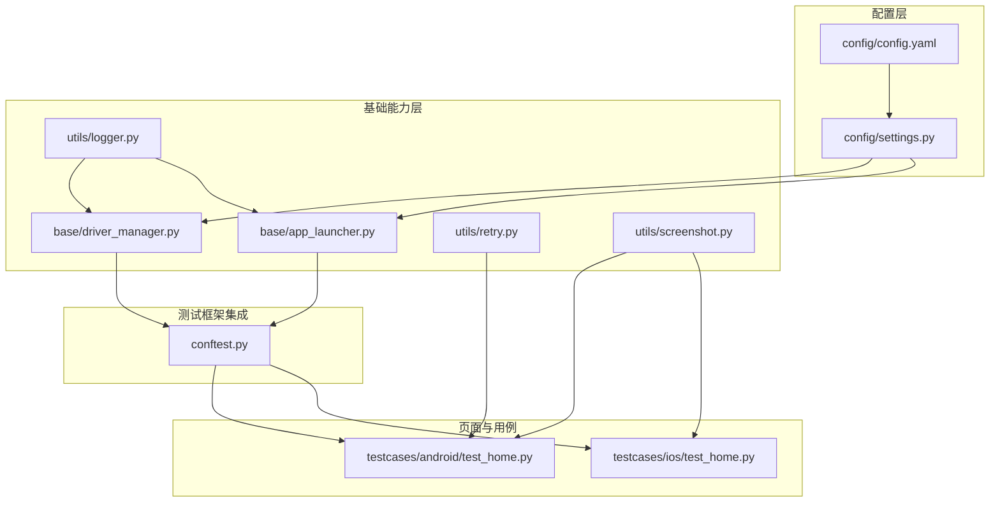
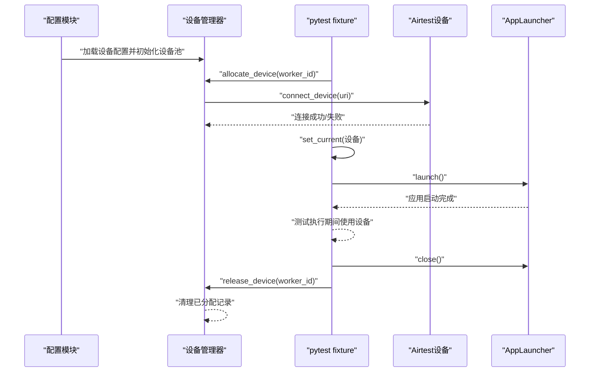
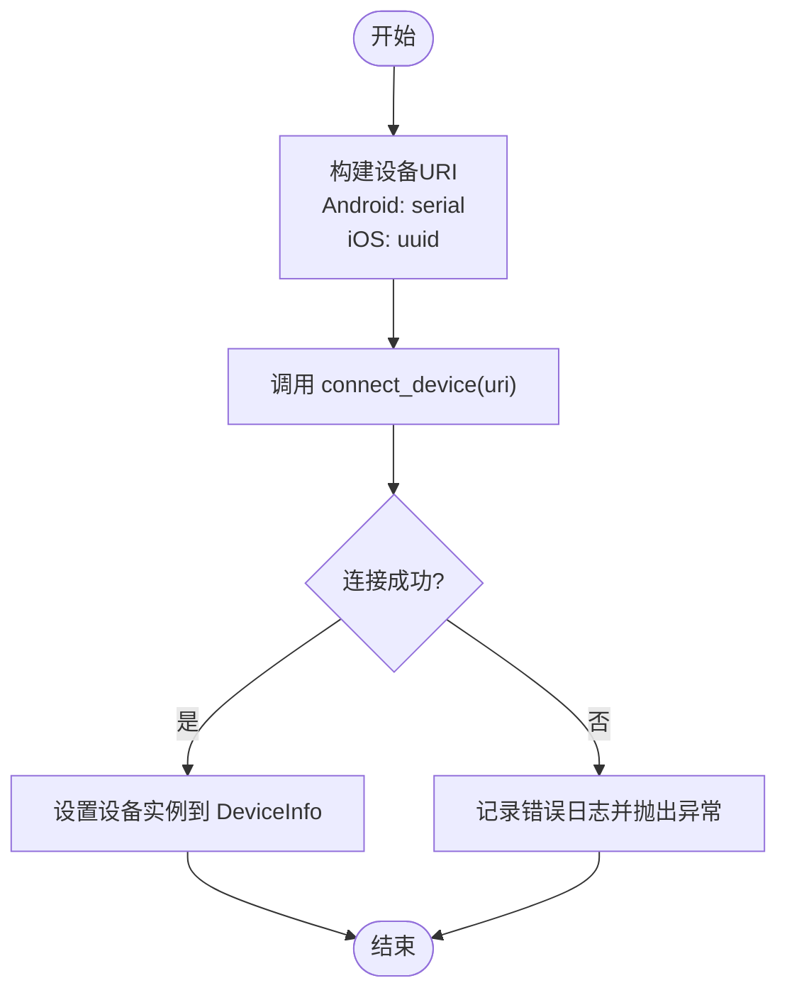
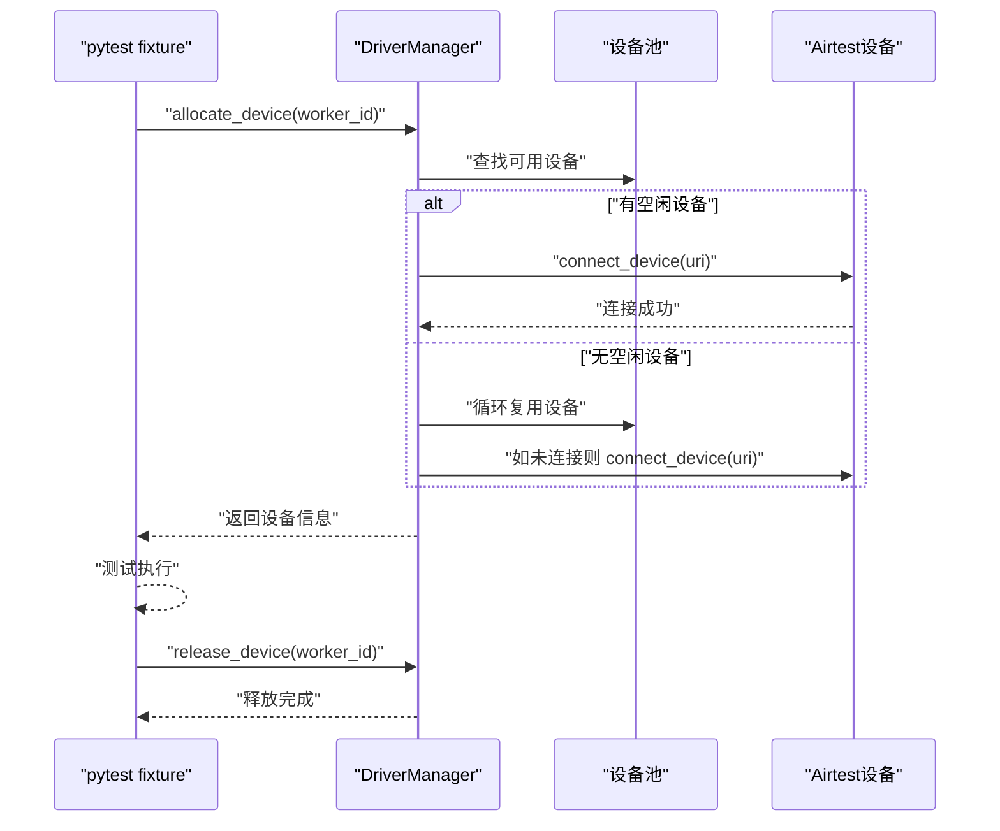
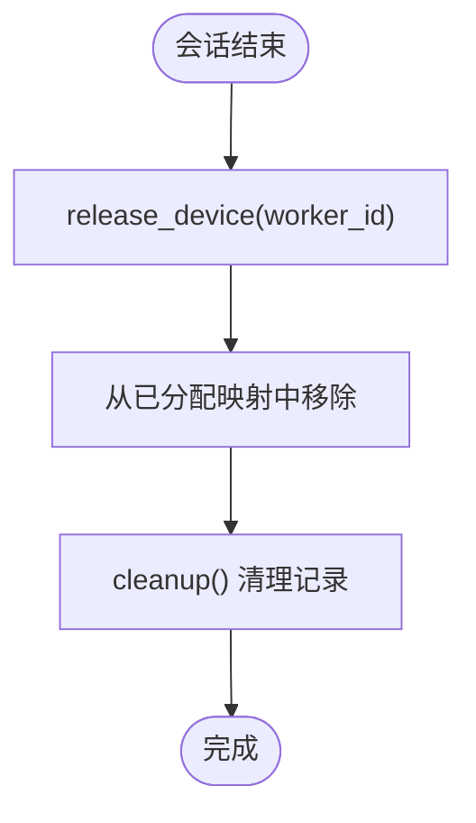
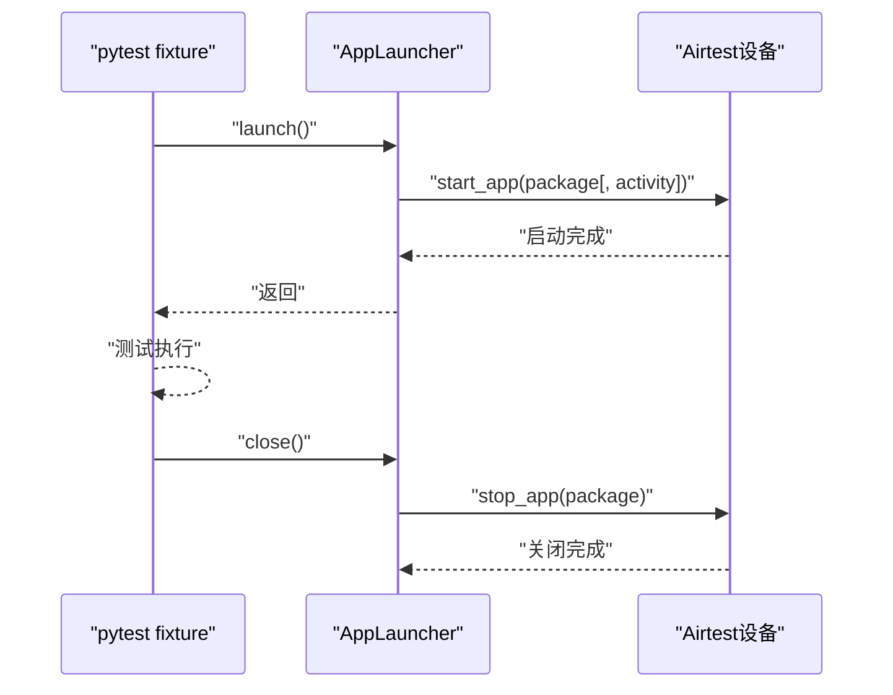
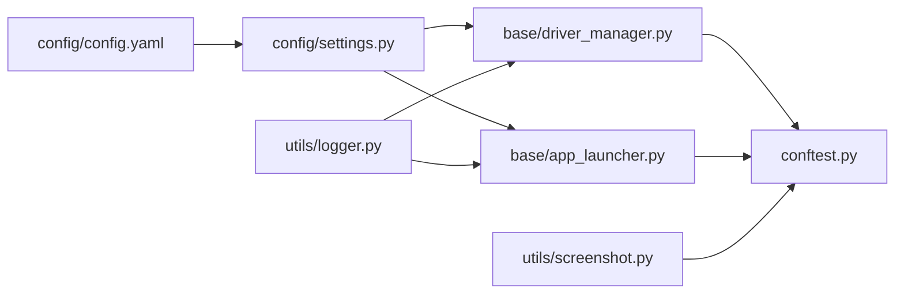

# 设备生命周期管理

<cite>
**本文引用的文件**
- [base/driver_manager.py](file://base/driver_manager.py)
- [conftest.py](file://conftest.py)
- [config/settings.py](file://config/settings.py)
- [config/config.yaml](file://config/config.yaml)
- [base/app_launcher.py](file://base/app_launcher.py)
- [utils/logger.py](file://utils/logger.py)
- [utils/retry.py](file://utils/retry.py)
- [utils/screenshot.py](file://utils/screenshot.py)
- [testcases/android/test_home.py](file://testcases/android/test_home.py)
- [testcases/ios/test_home.py](file://testcases/ios/test_home.py)
</cite>

## 目录
1. [简介](#简介)
2. [项目结构](#项目结构)
3. [核心组件](#核心组件)
4. [架构总览](#架构总览)
5. [详细组件分析](#详细组件分析)
6. [依赖分析](#依赖分析)
7. [性能考虑](#性能考虑)
8. [故障排查指南](#故障排查指南)
9. [结论](#结论)
10. [附录](#附录)

## 简介
本文件围绕 AirTestUI 的设备生命周期管理进行系统化说明，涵盖设备连接、使用中、释放与清理的完整流程；重点解释设备连接建立过程（URI 解析、连接建立、异常处理、重试策略）、设备释放与清理机制（手动释放、自动清理、资源回收），并提供状态监控与故障处理的最佳实践。文末给出基于仓库现有代码的流程图与最佳实践建议，帮助读者快速落地。

## 项目结构
AirTestUI 采用分层组织：配置层（config）、基础能力层（base、utils）、页面层（pages）、用例层（testcases）。设备生命周期管理主要由配置与驱动管理器协作完成，并通过 pytest fixture 在会话级自动注入与释放设备。

图表来源
- [config/config.yaml:1-70](file://config/config.yaml#L1-L70)
- [config/settings.py:1-112](file://config/settings.py#L1-L112)
- [base/driver_manager.py:1-188](file://base/driver_manager.py#L1-L188)
- [base/app_launcher.py:1-127](file://base/app_launcher.py#L1-L127)
- [conftest.py:1-255](file://conftest.py#L1-L255)
- [testcases/android/test_home.py:1-48](file://testcases/android/test_home.py#L1-L48)
- [testcases/ios/test_home.py:1-38](file://testcases/ios/test_home.py#L1-L38)

章节来源
- [config/config.yaml:1-70](file://config/config.yaml#L1-L70)
- [config/settings.py:1-112](file://config/settings.py#L1-L112)
- [base/driver_manager.py:1-188](file://base/driver_manager.py#L1-L188)
- [base/app_launcher.py:1-127](file://base/app_launcher.py#L1-L127)
- [conftest.py:1-255](file://conftest.py#L1-L255)
- [testcases/android/test_home.py:1-48](file://testcases/android/test_home.py#L1-L48)
- [testcases/ios/test_home.py:1-38](file://testcases/ios/test_home.py#L1-L38)

## 核心组件
- 设备信息与连接管理
  - 设备信息封装 DeviceInfo：负责平台、序列号/UUID、名称与 airtest 设备实例的持有与 URI 生成。
  - 设备管理器 DriverManager：单例模式，负责设备池初始化、按 worker 分配设备、连接建立、释放与清理。
- 测试框架集成
  - pytest fixture：在会话级自动分配设备、设置当前设备上下文、注入 Poco、自动启动/关闭应用。
- 应用启停管理
  - AppLauncher：按平台启动/关闭/重启应用，支持可选安装与数据清理。
- 日志与截图
  - logger：统一结构化日志输出，便于设备生命周期事件追踪。
  - screenshot：失败时自动截图并附加到 Allure 报告，辅助故障定位。

章节来源
- [base/driver_manager.py:20-188](file://base/driver_manager.py#L20-L188)
- [conftest.py:140-227](file://conftest.py#L140-L227)
- [base/app_launcher.py:20-127](file://base/app_launcher.py#L20-L127)
- [utils/logger.py:1-59](file://utils/logger.py#L1-L59)
- [utils/screenshot.py:1-89](file://utils/screenshot.py#L1-L89)

## 架构总览
下图展示了设备生命周期在 AirTestUI 中的端到端流转：配置加载 → 设备池初始化 → 设备分配与连接 → 会话期间使用 → 会话结束释放与清理。

图表来源
- [config/settings.py:94-112](file://config/settings.py#L94-L112)
- [base/driver_manager.py:81-150](file://base/driver_manager.py#L81-L150)
- [conftest.py:157-177](file://conftest.py#L157-L177)
- [base/app_launcher.py:49-93](file://base/app_launcher.py#L49-L93)

## 详细组件分析

### 设备信息与连接建立
- URI 解析
  - Android 使用序列号拼接 URI；iOS 使用 UUID 拼接 URI。该逻辑位于 DeviceInfo.uri 属性中，确保不同平台的连接字符串格式正确。
- 连接建立
  - DriverManager.connect_device 接收 DeviceInfo，调用 airtest 的 connect_device 方法建立连接，并将设备实例赋值到 DeviceInfo。
- 异常处理
  - 连接失败时记录错误日志并向上抛出异常，避免静默失败导致后续步骤不可控。
- 重连机制
  - 仓库未提供自动重连实现。可在业务侧结合重试装饰器对关键连接步骤进行重试包装，以提升稳定性。

图表来源
- [base/driver_manager.py:30-118](file://base/driver_manager.py#L30-L118)

章节来源
- [base/driver_manager.py:30-118](file://base/driver_manager.py#L30-L118)

### 设备分配与释放（会话级）
- 分配策略
  - 按 worker_id 顺序分配，若设备池不足则循环复用设备；若设备未连接则先连接再复用。
- 释放策略
  - 会话结束时通过 fixture 自动释放，移除分配映射并记录日志。
- 线程安全
  - 分配与释放均使用锁保护，避免并发冲突。

图表来源
- [base/driver_manager.py:119-150](file://base/driver_manager.py#L119-L150)
- [conftest.py:157-166](file://conftest.py#L157-L166)

章节来源
- [base/driver_manager.py:119-150](file://base/driver_manager.py#L119-L150)
- [conftest.py:157-166](file://conftest.py#L157-L166)

### 设备清理与资源回收
- 手动清理
  - DriverManager.cleanup 清理所有已分配设备的记录（日志记录），便于会话结束后的资源回收。
- 自动清理
  - 通过 pytest session 级别的 fixture，在测试会话结束后自动释放设备，避免资源泄漏。
- 资源回收
  - 释放后移除分配映射，确保后续 worker 可重新分配同一设备。

图表来源
- [base/driver_manager.py:152-183](file://base/driver_manager.py#L152-L183)
- [conftest.py:165-166](file://conftest.py#L165-L166)

章节来源
- [base/driver_manager.py:152-183](file://base/driver_manager.py#L152-L183)
- [conftest.py:165-166](file://conftest.py#L165-L166)

### APP 生命周期与设备状态联动
- 启动/关闭
  - AppLauncher.launch/close 根据平台读取配置并执行启动/关闭，配合设备分配确保测试环境一致。
- 状态监控
  - is_app_running 提供基础运行状态检测（Android 通过 shell 检测，iOS 默认返回 True），可用于简单监控与重试策略。

图表来源
- [base/app_launcher.py:49-93](file://base/app_launcher.py#L49-L93)
- [conftest.py:217-227](file://conftest.py#L217-L227)

章节来源
- [base/app_launcher.py:49-93](file://base/app_launcher.py#L49-L93)
- [conftest.py:217-227](file://conftest.py#L217-L227)

### 日志与截图在设备生命周期中的作用
- 日志
  - DriverManager 与 AppLauncher 在关键节点记录 INFO/WARNING/ERROR 日志，便于追踪设备连接、分配、释放与 APP 启停状态。
- 截图
  - 失败时自动截图并附加到 Allure 报告，辅助定位设备连接或操作失败原因。

章节来源
- [utils/logger.py:1-59](file://utils/logger.py#L1-L59)
- [utils/screenshot.py:1-89](file://utils/screenshot.py#L1-L89)
- [conftest.py:119-138](file://conftest.py#L119-L138)

### 实际用例中的设备生命周期体现
- Android 与 iOS 用例均通过 fixture 注入 Poco 与设备上下文，测试执行期间直接使用设备与页面对象方法。
- 用例中未直接展示设备连接/释放代码，但其生命周期完全由 conftest.py 的 fixture 生命周期管理。

章节来源
- [testcases/android/test_home.py:1-48](file://testcases/android/test_home.py#L1-L48)
- [testcases/ios/test_home.py:1-38](file://testcases/ios/test_home.py#L1-L38)
- [conftest.py:157-207](file://conftest.py#L157-L207)

## 依赖分析
- 配置依赖
  - config/config.yaml 提供设备与 APP 配置；config/settings.py 将其加载为可访问对象，并提供便捷函数（如 get_android_devices/get_ios_devices）。
- 运行时依赖
  - base/driver_manager.py 依赖 settings 获取设备列表；conftest.py 依赖 driver_manager 进行设备分配与释放。
- 日志与截图
  - 所有关键流程均通过 utils/logger.py 输出日志；失败时通过 utils/screenshot.py 截图并附加到 Allure。

图表来源
- [config/config.yaml:1-70](file://config/config.yaml#L1-L70)
- [config/settings.py:1-112](file://config/settings.py#L1-L112)
- [base/driver_manager.py:1-188](file://base/driver_manager.py#L1-L188)
- [base/app_launcher.py:1-127](file://base/app_launcher.py#L1-L127)
- [conftest.py:1-255](file://conftest.py#L1-L255)
- [utils/logger.py:1-59](file://utils/logger.py#L1-L59)
- [utils/screenshot.py:1-89](file://utils/screenshot.py#L1-L89)

章节来源
- [config/config.yaml:1-70](file://config/config.yaml#L1-L70)
- [config/settings.py:1-112](file://config/settings.py#L1-L112)
- [base/driver_manager.py:1-188](file://base/driver_manager.py#L1-L188)
- [base/app_launcher.py:1-127](file://base/app_launcher.py#L1-L127)
- [conftest.py:1-255](file://conftest.py#L1-L255)
- [utils/logger.py:1-59](file://utils/logger.py#L1-L59)
- [utils/screenshot.py:1-89](file://utils/screenshot.py#L1-L89)

## 性能考虑
- 设备复用策略
  - 当设备池小于并发 worker 数时，DriverManager 采用循环复用策略，减少设备连接次数，提高吞吐。
- 连接建立成本
  - 连接建立涉及底层设备通信，建议在设备池充足时优先避免频繁复用，降低上下文切换带来的抖动。
- 日志与截图
  - 日志与截图均为 I/O 操作，建议在调试阶段开启，稳定期关闭不必要的截图以降低磁盘压力。

## 故障排查指南
- 设备连接失败
  - 现象：连接异常日志并抛出异常。
  - 排查：确认 config.yaml 中设备配置（Android 序列号/ iOS UUID）正确；检查设备在线状态与权限；查看日志定位具体异常。
- 设备分配冲突
  - 现象：并发场景下分配异常或重复占用。
  - 排查：确认 pytest xdist worker 数与设备池大小匹配；检查分配/释放逻辑是否被提前中断。
- APP 启动失败
  - 现象：launch 抛错或启动超时。
  - 排查：核对包名/Bundle ID、Activity 配置；确认安装路径有效；适当增加超时配置。
- 会话结束后资源未释放
  - 现象：后续测试无法分配设备或设备占用。
  - 排查：确认 fixture 未被覆盖；检查 cleanup 是否被调用；查看日志中 release_device 记录。

章节来源
- [base/driver_manager.py:103-118](file://base/driver_manager.py#L103-L118)
- [base/driver_manager.py:152-183](file://base/driver_manager.py#L152-L183)
- [base/app_launcher.py:49-93](file://base/app_launcher.py#L49-L93)
- [conftest.py:157-166](file://conftest.py#L157-L166)

## 结论
AirTestUI 的设备生命周期管理通过“配置驱动 + fixture 管理”的方式实现了稳定的设备分配、连接与释放闭环。结合日志与截图能力，能够有效支撑设备连接与操作的可观测性与可追溯性。建议在生产环境中：
- 明确设备池规模与并发上限，避免过度复用；
- 对关键连接与启动步骤引入重试策略；
- 建立设备与 APP 状态的监控指标，及时发现异常；
- 在 CI 场景中规范会话级资源回收，确保环境一致性。

## 附录
- 配置项参考
  - 设备与 APP 配置位于 config/config.yaml，包含设备列表、APP 包名/Bundle ID、Activity、安装路径等。
- 重试与断言
  - 可结合 utils/retry.py 对关键步骤进行重试包装，提升鲁棒性；页面断言与等待在页面基类中已有封装，便于复用。

章节来源
- [config/config.yaml:47-70](file://config/config.yaml#L47-L70)
- [utils/retry.py:1-102](file://utils/retry.py#L1-L102)
- [base/base_page.py:1-320](file://base/base_page.py#L1-L320)