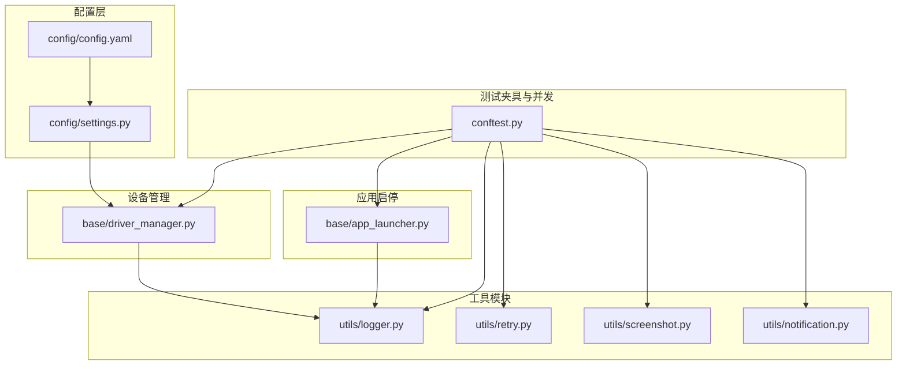
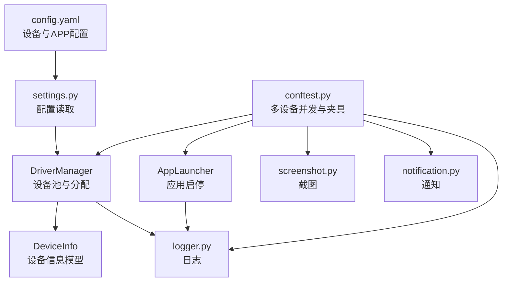
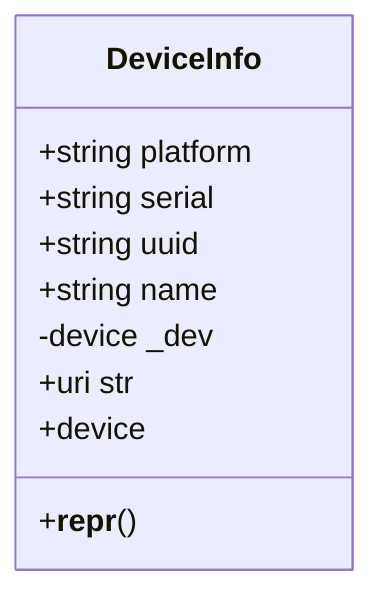
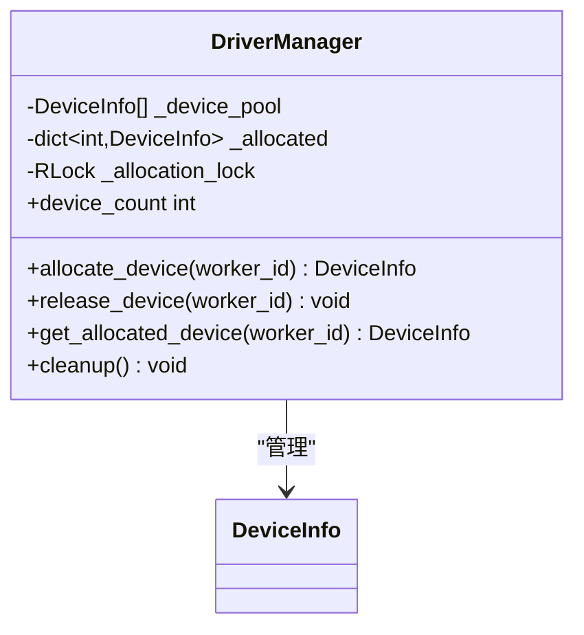
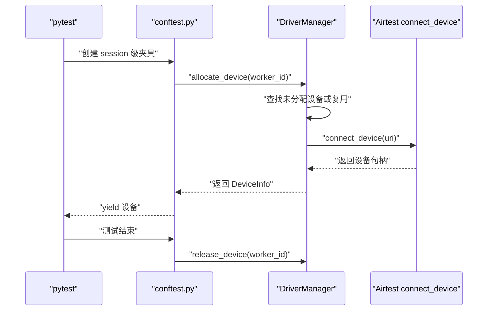
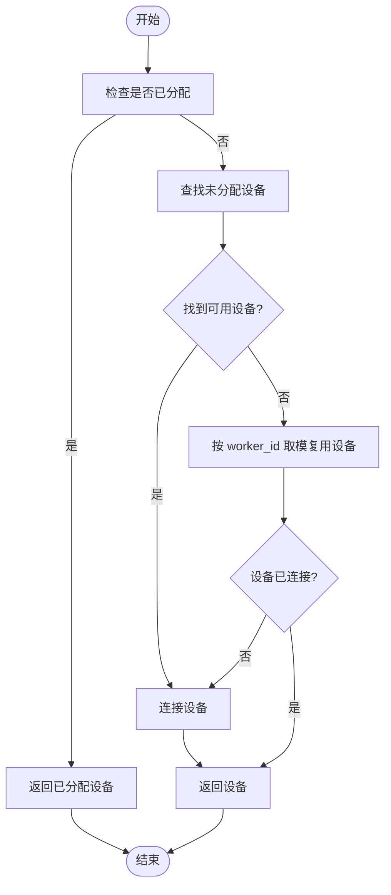
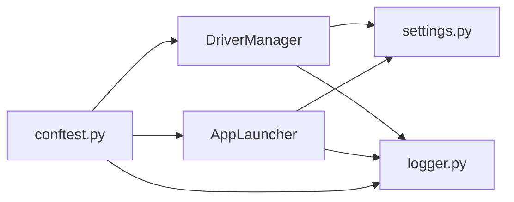

# 设备管理

<cite>
**本文引用的文件**
- [conftest.py](file://conftest.py)
- [driver_manager.py](file://base/driver_manager.py)
- [settings.py](file://config/settings.py)
- [config.yaml](file://config/config.yaml)
- [app_launcher.py](file://base/app_launcher.py)
- [logger.py](file://utils/logger.py)
- [retry.py](file://utils/retry.py)
- [screenshot.py](file://utils/screenshot.py)
- [notification.py](file://utils/notification.py)
</cite>

## 目录
1. [简介](#简介)
2. [项目结构](#项目结构)
3. [核心组件](#核心组件)
4. [架构总览](#架构总览)
5. [详细组件分析](#详细组件分析)
6. [依赖分析](#依赖分析)
7. [性能考虑](#性能考虑)
8. [故障排查指南](#故障排查指南)
9. [结论](#结论)
10. [附录](#附录)

## 简介
本文件系统性阐述 AirTestUI 的设备管理系统，重点覆盖以下方面：
- 设备连接池的实现原理：设备发现、连接建立、连接池管理、设备分配策略
- 多设备并发测试机制：设备 ID 分配、worker_id 映射、设备隔离
- 设备生命周期管理：连接状态监控、异常处理、自动重连策略
- 设备配置最佳实践与故障排查
- 提供实际代码示例的“使用路径”以指导读者快速上手

## 项目结构
AirTestUI 的设备管理相关代码主要分布在以下模块：
- 配置层：config/settings.py、config/config.yaml
- 设备管理：base/driver_manager.py
- 测试夹具与并发：conftest.py
- 应用启停：base/app_launcher.py
- 工具模块：utils/logger.py、utils/retry.py、utils/screenshot.py、utils/notification.py

图表来源
- [config/config.yaml:1-70](file://config/config.yaml#L1-L70)
- [config/settings.py:1-112](file://config/settings.py#L1-L112)
- [base/driver_manager.py:1-188](file://base/driver_manager.py#L1-L188)
- [conftest.py:1-255](file://conftest.py#L1-L255)
- [base/app_launcher.py:1-127](file://base/app_launcher.py#L1-L127)
- [utils/logger.py:1-59](file://utils/logger.py#L1-L59)
- [utils/retry.py:1-102](file://utils/retry.py#L1-L102)
- [utils/screenshot.py:1-89](file://utils/screenshot.py#L1-L89)
- [utils/notification.py:1-167](file://utils/notification.py#L1-L167)

章节来源
- [config/config.yaml:1-70](file://config/config.yaml#L1-L70)
- [config/settings.py:1-112](file://config/settings.py#L1-L112)
- [base/driver_manager.py:1-188](file://base/driver_manager.py#L1-L188)
- [conftest.py:1-255](file://conftest.py#L1-L255)
- [base/app_launcher.py:1-127](file://base/app_launcher.py#L1-L127)
- [utils/logger.py:1-59](file://utils/logger.py#L1-L59)
- [utils/retry.py:1-102](file://utils/retry.py#L1-L102)
- [utils/screenshot.py:1-89](file://utils/screenshot.py#L1-L89)
- [utils/notification.py:1-167](file://utils/notification.py#L1-L167)

## 核心组件
- 设备信息模型 DeviceInfo：封装平台、序列号/UUID、名称与 Airtest 设备句柄，并提供连接 URI 生成逻辑
- 设备管理器 DriverManager：单例，负责设备池初始化、连接、分配与回收；提供线程安全的分配策略
- 测试夹具 conftest.py：提供 worker_id、device_info、airtest_device、poco、app_launcher 等 session 级夹具，支撑多设备并发
- 配置 settings：集中读取 config.yaml，支持本地覆盖与环境变量覆盖，提供设备与 APP 配置访问
- 应用启停 AppLauncher：跨平台启动/关闭/重启/清除数据，支持可选安装
- 工具模块：日志、重试、截图、通知

章节来源
- [base/driver_manager.py:20-49](file://base/driver_manager.py#L20-L49)
- [base/driver_manager.py:51-187](file://base/driver_manager.py#L51-L187)
- [conftest.py:140-228](file://conftest.py#L140-L228)
- [config/settings.py:51-112](file://config/settings.py#L51-L112)
- [base/app_launcher.py:20-127](file://base/app_launcher.py#L20-L127)
- [utils/logger.py:1-59](file://utils/logger.py#L1-L59)
- [utils/retry.py:1-102](file://utils/retry.py#L1-L102)
- [utils/screenshot.py:1-89](file://utils/screenshot.py#L1-L89)
- [utils/notification.py:1-167](file://utils/notification.py#L1-L167)

## 架构总览
下图展示了设备管理在 AirTestUI 中的整体交互关系。

图表来源
- [conftest.py:140-228](file://conftest.py#L140-L228)
- [base/driver_manager.py:51-187](file://base/driver_manager.py#L51-L187)
- [base/driver_manager.py:20-49](file://base/driver_manager.py#L20-L49)
- [config/settings.py:51-112](file://config/settings.py#L51-L112)
- [config/config.yaml:44-70](file://config/config.yaml#L44-L70)
- [base/app_launcher.py:20-127](file://base/app_launcher.py#L20-L127)
- [utils/logger.py:1-59](file://utils/logger.py#L1-L59)
- [utils/screenshot.py:1-89](file://utils/screenshot.py#L1-L89)
- [utils/notification.py:1-167](file://utils/notification.py#L1-L167)

## 详细组件分析

### 设备信息模型 DeviceInfo
- 职责：封装设备平台、序列号/UUID、名称与 Airtest 设备句柄；提供连接 URI 生成
- 关键点：
  - Android 使用 serial 作为连接参数，iOS 使用 uuid
  - 设备句柄 lazy 初始化，首次使用时由 DriverManager 连接并注入
- 复杂度：构造与属性访问 O(1)

图表来源
- [base/driver_manager.py:20-49](file://base/driver_manager.py#L20-L49)

章节来源
- [base/driver_manager.py:20-49](file://base/driver_manager.py#L20-L49)

### 设备管理器 DriverManager
- 单例模式：确保全局唯一设备池与分配策略
- 设备池初始化：读取 config.yaml 中的 android/ios devices 列表，构建 DeviceInfo 列表
- 连接策略：
  - 首次分配：优先从未分配设备中按顺序选取并连接
  - 资源紧张：当设备不足时，按 worker_id 对设备数取模进行复用
- 线程安全：使用锁保护分配与释放过程
- 生命周期管理：提供 release_device 与 cleanup，便于测试会话结束后的资源回收

图表来源
- [base/driver_manager.py:51-187](file://base/driver_manager.py#L51-L187)

章节来源
- [base/driver_manager.py:51-187](file://base/driver_manager.py#L51-L187)

### 多设备并发与设备分配策略
- worker_id 来源：通过 pytest-xdist 的 PYTEST_XDIST_WORKER 环境变量解析，master 为 0，gw0/gw1 等依次递增
- 设备分配流程：
  - session 级夹具 device_info 调用 driver_manager.allocate_device(worker_id)
  - 若设备未连接则立即连接
  - 测试结束后通过 release_device 归还设备
- 设备隔离：
  - 每个 worker 绑定一个设备实例，避免跨用例干扰
  - 通过 airtest 的 set_current 将当前设备设置为该 worker 的设备

图表来源
- [conftest.py:140-177](file://conftest.py#L140-L177)
- [base/driver_manager.py:119-151](file://base/driver_manager.py#L119-L151)

章节来源
- [conftest.py:140-177](file://conftest.py#L140-L177)
- [base/driver_manager.py:119-151](file://base/driver_manager.py#L119-L151)

### 设备生命周期管理
- 连接建立：首次分配时调用 connect_device(uri)，并将句柄写入 DeviceInfo
- 连接状态监控：日志模块记录连接/断开/复用等事件，便于问题定位
- 异常处理：连接失败抛出异常；释放与清理过程捕获异常并记录错误
- 自动重连：当前实现采用“按需连接”，若设备未连接则在分配时连接；未实现后台心跳与自动重连机制

图表来源
- [base/driver_manager.py:119-151](file://base/driver_manager.py#L119-L151)

章节来源
- [base/driver_manager.py:103-151](file://base/driver_manager.py#L103-L151)
- [utils/logger.py:1-59](file://utils/logger.py#L1-L59)

### 配置与最佳实践
- 设备配置
  - Android：使用 serial 与 name；name 用于报告标识
  - iOS：使用 uuid 与 name；uuid 为 auto 表示自动检测
- APP 配置
  - Android：package、activity、install_path
  - iOS：bundle_id、install_path
- 环境变量覆盖
  - 支持 AIRTESTUI_<KEY> 覆盖 config.yaml 顶层键
  - 支持 local_config.yaml 本地覆盖
- 最佳实践
  - 在 config.yaml 中明确列出所有可用设备，确保设备池初始化正确
  - 为每台设备设置清晰的 name，便于日志与报告识别
  - 为不同环境准备独立的 local_config.yaml，避免污染共享配置
  - 合理规划 worker 数量，避免设备不足导致频繁复用

章节来源
- [config/config.yaml:44-70](file://config/config.yaml#L44-L70)
- [config/settings.py:34-81](file://config/settings.py#L34-L81)
- [config/settings.py:94-112](file://config/settings.py#L94-L112)

### 应用启停管理 AppLauncher
- 功能：启动、关闭、重启、清除数据、可选安装
- 平台差异：
  - Android：支持 activity 启动与数据清除
  - iOS：受限检测，提供占位能力
- 超时控制：通过 settings.timeout.app_launch 控制启动等待时间

章节来源
- [base/app_launcher.py:20-127](file://base/app_launcher.py#L20-L127)
- [config/settings.py:89-92](file://config/settings.py#L89-L92)

### 日志、重试、截图与通知
- 日志：统一结构化日志，支持文件轮转与多级别输出
- 重试：通用重试装饰器与 until-true 类重试，支持指数退避与回调
- 截图：失败自动截图并附加到 Allure
- 通知：支持钉钉与邮件，支持签名与认证

章节来源
- [utils/logger.py:1-59](file://utils/logger.py#L1-L59)
- [utils/retry.py:1-102](file://utils/retry.py#L1-L102)
- [utils/screenshot.py:1-89](file://utils/screenshot.py#L1-L89)
- [utils/notification.py:1-167](file://utils/notification.py#L1-L167)

## 依赖分析
- DriverManager 依赖 settings 提供设备列表与超时配置
- conftest.py 依赖 DriverManager 与 AppLauncher 提供夹具
- AppLauncher 依赖 settings 提供 APP 配置
- 所有模块依赖 utils/logger 进行日志输出

图表来源
- [conftest.py:14-21](file://conftest.py#L14-L21)
- [base/driver_manager.py:10-16](file://base/driver_manager.py#L10-L16)
- [base/app_launcher.py:14-16](file://base/app_launcher.py#L14-L16)
- [config/settings.py:51-81](file://config/settings.py#L51-L81)
- [utils/logger.py:1-59](file://utils/logger.py#L1-L59)

章节来源
- [conftest.py:14-21](file://conftest.py#L14-L21)
- [base/driver_manager.py:10-16](file://base/driver_manager.py#L10-L16)
- [base/app_launcher.py:14-16](file://base/app_launcher.py#L14-L16)
- [config/settings.py:51-81](file://config/settings.py#L51-L81)
- [utils/logger.py:1-59](file://utils/logger.py#L1-L59)

## 性能考虑
- 设备连接成本：首次分配时进行连接，建议合理规划 worker 数量，避免过多并发导致连接抖动
- 分配策略：顺序分配优先，设备不足时按 worker_id 取模复用，可能带来状态污染风险，建议在用例间做好数据隔离
- 日志与截图：开启失败截图与全量日志会增加 IO 压力，建议在 CI 环境按需开启
- 重试策略：合理设置重试次数与间隔，避免对设备与网络造成额外压力

## 故障排查指南
- 设备无法连接
  - 检查 config.yaml 中设备配置是否正确（Android serial 或 iOS uuid）
  - 查看日志中“设备连接失败”的错误信息，确认 Airtest URI 与设备可达性
  - 确认设备已授权（Android 开启调试、iOS 授权信任）
- 设备被占用或复用冲突
  - 查看日志中“复用设备”的警告，评估是否需要增加设备数量
  - 确保测试会话结束时正确释放设备（release_device）
- APP 启动失败
  - 检查 package/bundle_id 与 activity 配置
  - 查看 app_launch 超时设置是否合理
- 截图与报告
  - 确认截图目录存在且可写
  - Allure 报告需在测试结束后生成，确保失败截图已附加
- 通知失败
  - 检查通知配置（webhook/secret 或 SMTP 参数），确认网络可达

章节来源
- [base/driver_manager.py:103-151](file://base/driver_manager.py#L103-L151)
- [base/app_launcher.py:49-93](file://base/app_launcher.py#L49-L93)
- [utils/screenshot.py:28-53](file://utils/screenshot.py#L28-L53)
- [utils/notification.py:22-48](file://utils/notification.py#L22-L48)

## 结论
AirTestUI 的设备管理系统以 DriverManager 为核心，结合 conftest 的多设备并发夹具，实现了设备池化、按序分配与复用、生命周期管理与日志监控。通过配置层与工具模块的协同，系统具备良好的可维护性与可观测性。建议在生产环境中进一步完善自动重连、设备健康检查与更细粒度的状态隔离策略。

## 附录

### 使用路径示例（无代码片段）
- 在测试用例中直接使用设备与 Poco
  - 参考路径：[conftest.py:168-208](file://conftest.py#L168-L208)
- 使用设备信息与平台
  - 参考路径：[conftest.py:157-183](file://conftest.py#L157-L183)
- 使用 APP 启停管理器
  - 参考路径：[base/app_launcher.py:49-93](file://base/app_launcher.py#L49-L93)
- 读取配置与设备列表
  - 参考路径：[config/settings.py:94-112](file://config/settings.py#L94-L112)
- 截图与失败处理
  - 参考路径：[utils/screenshot.py:28-53](file://utils/screenshot.py#L28-L53)
- 通知与报告
  - 参考路径：[utils/notification.py:128-167](file://utils/notification.py#L128-L167)