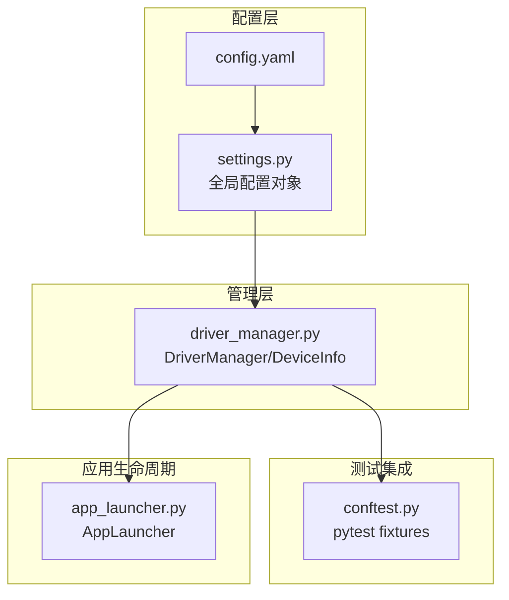
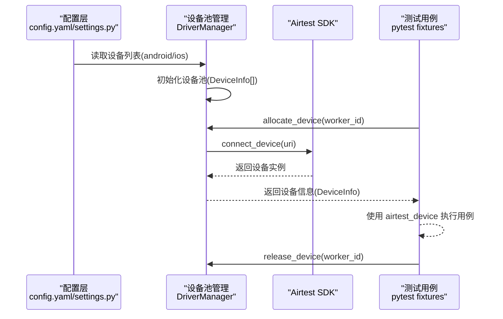
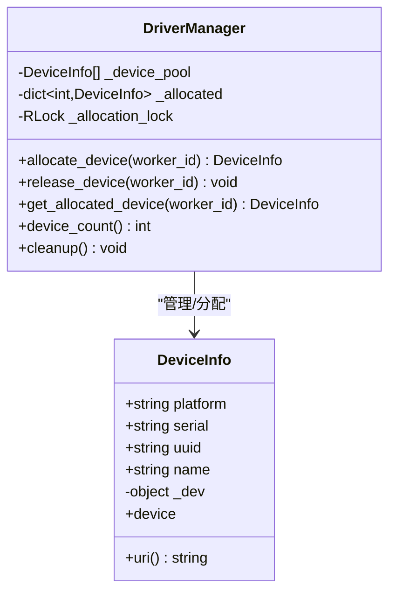
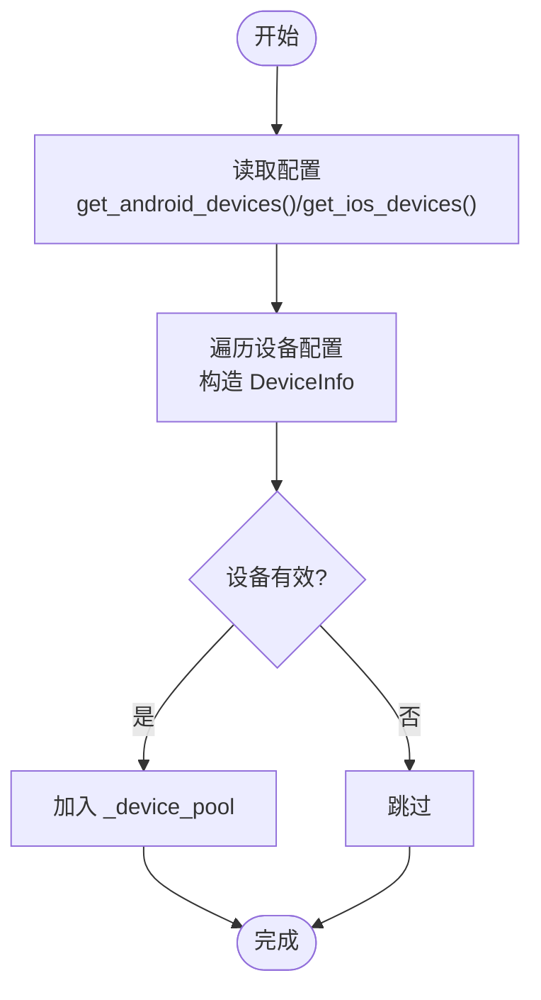
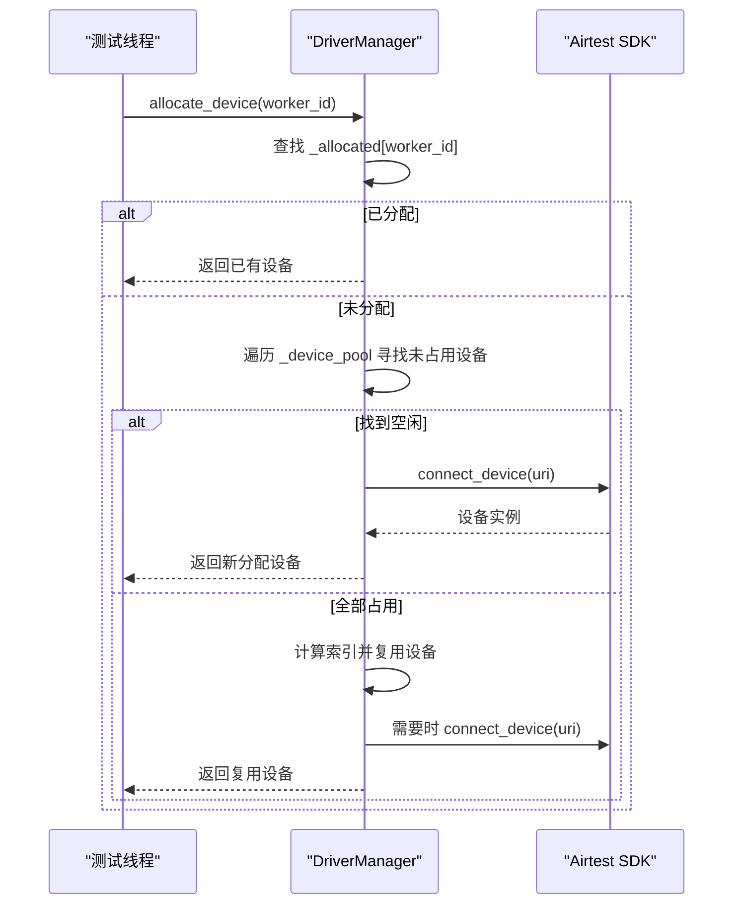
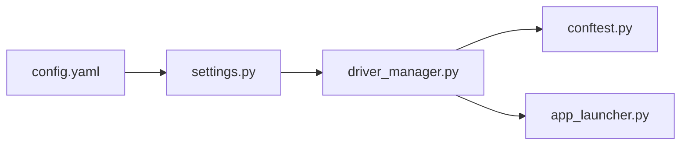

# 设备连接池管理

<cite>
**本文引用的文件**
- [driver_manager.py](file://base/driver_manager.py)
- [settings.py](file://config/settings.py)
- [config.yaml](file://config/config.yaml)
- [conftest.py](file://conftest.py)
- [app_launcher.py](file://base/app_launcher.py)
</cite>

## 目录
1. [简介](#简介)
2. [项目结构](#项目结构)
3. [核心组件](#核心组件)
4. [架构总览](#架构总览)
5. [详细组件分析](#详细组件分析)
6. [依赖关系分析](#依赖关系分析)
7. [性能考量](#性能考量)
8. [故障排查指南](#故障排查指南)
9. [结论](#结论)
10. [附录：最佳实践与示例路径](#附录最佳实践与示例路径)

## 简介
本文件系统性阐述 AirTestUI 的“设备连接池管理”能力，围绕以下目标展开：
- 设备池初始化流程：从配置文件读取设备信息、识别设备类型（Android/iOS）、构建设备 URI。
- 数据结构设计：DeviceInfo 类职责、设备池列表管理、设备连接状态跟踪。
- 生命周期管理：初始化、连接建立、状态监控、资源回收。
- 最佳实践与故障排查：配置规范、常见问题定位与处理建议。
- 使用示例：通过代码片段路径展示如何创建与使用设备池。

## 项目结构
与设备连接池直接相关的模块分布如下：
- 配置层：config.yaml 提供设备与应用配置；settings.py 将其解析为可访问的全局配置对象。
- 管理层：base/driver_manager.py 实现设备池的初始化、分配、连接与清理。
- 测试集成：conftest.py 基于 pytest-xdist 的 worker 分配设备，注入 airtest_device、platform 等 fixture。
- 应用生命周期：base/app_launcher.py 基于平台配置进行 APP 启停与安装。

**图表来源**
- [config.yaml:44-69](file://config/config.yaml#L44-L69)
- [settings.py:94-111](file://config/settings.py#L94-L111)
- [driver_manager.py:51-187](file://base/driver_manager.py#L51-L187)
- [conftest.py:140-220](file://conftest.py#L140-L220)
- [app_launcher.py:20-46](file://base/app_launcher.py#L20-L46)

**章节来源**
- [config.yaml:1-69](file://config/config.yaml#L1-L69)
- [settings.py:1-111](file://config/settings.py#L1-L111)
- [driver_manager.py:1-187](file://base/driver_manager.py#L1-L187)
- [conftest.py:140-220](file://conftest.py#L140-L220)
- [app_launcher.py:1-46](file://base/app_launcher.py#L1-L46)

## 核心组件
- 配置读取与设备列表
  - 通过 settings.py 的 get_android_devices()/get_ios_devices() 获取设备列表。
  - config.yaml 中分别定义 android.devices 与 ios.devices，字段包括 serial/uuid/name 等。
- 设备信息封装 DeviceInfo
  - 字段：platform、serial、uuid、name、_dev。
  - 方法：uri 属性生成 airtest 连接 URI；device 属性存取 airtest 设备实例。
- 设备池管理 DriverManager
  - 单例模式，线程安全。
  - 初始化：遍历设备列表构造 DeviceInfo 并加入池。
  - 分配：按 worker_id 顺序分配，若无空闲设备则轮询复用。
  - 连接：调用 airtest.connect_device 构建连接并缓存实例。
  - 释放与清理：按 worker 归还设备，退出时清理已分配设备。

**章节来源**
- [settings.py:94-111](file://config/settings.py#L94-L111)
- [config.yaml:44-69](file://config/config.yaml#L44-L69)
- [driver_manager.py:20-187](file://base/driver_manager.py#L20-L187)

## 架构总览
下图展示了从配置到设备连接池再到测试执行的整体流程：

**图表来源**
- [config.yaml:44-69](file://config/config.yaml#L44-L69)
- [settings.py:94-111](file://config/settings.py#L94-L111)
- [driver_manager.py:81-150](file://base/driver_manager.py#L81-L150)
- [conftest.py:157-176](file://conftest.py#L157-L176)

## 详细组件分析

### 配置与设备类型识别
- Android 设备
  - 来源：config.yaml 中 android.devices 列表，每项包含 serial 与 name。
  - 识别：DeviceInfo.platform = "android"，URI 以 Android:/// 开头。
- iOS 设备
  - 来源：config.yaml 中 ios.devices 列表，每项包含 uuid 与 name。
  - 识别：DeviceInfo.platform = "ios"，URI 以 iOS:/// 开头。
- 设备名称回退策略
  - 若未设置 name，则回退到 serial 或 uuid，确保日志与报告可读性。

**章节来源**
- [config.yaml:44-69](file://config/config.yaml#L44-L69)
- [settings.py:94-111](file://config/settings.py#L94-L111)
- [driver_manager.py:30-48](file://base/driver_manager.py#L30-L48)

### 设备池数据结构设计
- DeviceInfo
  - 作用：封装单个设备的元信息与 airtest 设备实例，提供统一的 URI 生成与设备句柄缓存。
  - 关键属性：platform、serial、uuid、name、device。
- DriverManager
  - 设备池：_device_pool 存放可用设备。
  - 分配映射：_allocated 维护 worker_id 到设备的映射。
  - 线程安全：_allocation_lock 保护分配与释放逻辑。
  - 生命周期：初始化、连接、分配、释放、清理。

**图表来源**
- [driver_manager.py:20-187](file://base/driver_manager.py#L20-L187)

**章节来源**
- [driver_manager.py:20-187](file://base/driver_manager.py#L20-L187)

### 设备池初始化流程
- 读取配置
  - 通过 settings.get_android_devices()/get_ios_devices() 获取设备列表。
- 构造 DeviceInfo
  - Android：填充 serial 与 name；iOS：填充 uuid 与 name。
- 加入池
  - 有效设备被追加至 _device_pool。
- 日志输出
  - 输出设备总数与设备清单，便于核验。

**图表来源**
- [settings.py:94-111](file://config/settings.py#L94-L111)
- [driver_manager.py:81-101](file://base/driver_manager.py#L81-L101)

**章节来源**
- [settings.py:94-111](file://config/settings.py#L94-L111)
- [driver_manager.py:81-101](file://base/driver_manager.py#L81-L101)

### 设备连接与分配策略
- 分配策略
  - 若该 worker 已有设备，直接返回。
  - 否则优先分配未占用设备；若全部占用，按 worker_id%n 轮询复用。
- 连接策略
  - 首次分配或复用但未连接时，调用 airtest.connect_device 构建连接。
- 线程安全
  - 使用 _allocation_lock 保护分配/释放过程，避免竞态。

**图表来源**
- [driver_manager.py:119-150](file://base/driver_manager.py#L119-L150)

**章节来源**
- [driver_manager.py:119-150](file://base/driver_manager.py#L119-L150)

### 生命周期管理
- 初始化
  - 仅在首次访问时执行，保证单例与惰性初始化。
- 运行期
  - allocate_device/release_device 管理设备占用与归还。
- 退出清理
  - cleanup 清空分配映射，记录清理动作（airtest 无显式断开接口）。

**章节来源**
- [driver_manager.py:64-80](file://base/driver_manager.py#L64-L80)
- [driver_manager.py:173-183](file://base/driver_manager.py#L173-L183)

### 与测试框架的集成
- worker_id 生成
  - 从 PYTEST_XDIST_WORKER 环境变量推导，master 对应 0，gwN 对应 N。
- 设备 fixture
  - device_info：按 worker 分配/释放设备。
  - airtest_device：设置当前设备上下文。
  - platform：平台标识，用于选择 Poco 引擎。
- APP 生命周期
  - setup_app：结合 AppLauncher 在用例前后启停应用。

**章节来源**
- [conftest.py:140-220](file://conftest.py#L140-L220)
- [app_launcher.py:20-46](file://base/app_launcher.py#L20-L46)

## 依赖关系分析
- 配置依赖
  - settings.py 依赖 config.yaml；提供 get_android_devices/get_ios_devices。
- 管理器依赖
  - DriverManager 依赖 settings 提供的设备列表；依赖 airtest.connect_device 建立连接。
- 测试依赖
  - conftest.py 依赖 DriverManager 的分配/释放；依赖 AppLauncher 管理应用生命周期。

**图表来源**
- [config.yaml:44-69](file://config/config.yaml#L44-L69)
- [settings.py:94-111](file://config/settings.py#L94-L111)
- [driver_manager.py:51-187](file://base/driver_manager.py#L51-L187)
- [conftest.py:157-176](file://conftest.py#L157-L176)
- [app_launcher.py:20-46](file://base/app_launcher.py#L20-L46)

**章节来源**
- [config.yaml:44-69](file://config/config.yaml#L44-L69)
- [settings.py:94-111](file://config/settings.py#L94-L111)
- [driver_manager.py:51-187](file://base/driver_manager.py#L51-L187)
- [conftest.py:157-176](file://conftest.py#L157-L176)
- [app_launcher.py:20-46](file://base/app_launcher.py#L20-L46)

## 性能考量
- 并发与锁
  - 分配/释放使用 RLock，避免频繁加锁带来的竞争；建议在高并发场景下合理规划 worker 数量。
- 设备复用
  - 当设备不足时采用轮询复用，可能带来状态干扰；建议为不同业务场景隔离 worker 或增加互斥策略。
- 连接成本
  - connect_device 为 IO 密集操作，建议在分配阶段一次性连接，减少重复连接开销。
- 日志与可观测性
  - 管理器记录连接/分配/释放日志，便于定位性能瓶颈与异常。

[本节为通用指导，无需列出具体文件来源]

## 故障排查指南
- 设备池为空
  - 现象：抛出“设备池为空，无法分配设备”。
  - 排查：确认 config.yaml 中 android.devices/ios.devices 是否正确配置；检查 settings 是否加载到预期值。
- 连接失败
  - 现象：connect_device 抛错，日志记录错误信息。
  - 排查：核对 Android URI（serial）或 iOS URI（uuid）是否正确；确认设备在线且允许自动化。
- 设备复用导致状态污染
  - 现象：不同 worker 使用同一设备产生状态冲突。
  - 排查：为每个 worker 固定分配独立设备；或在用例间清理应用状态（如 clear_app/start_app/stop_app）。
- 线程安全问题
  - 现象：并发分配出现竞态。
  - 排查：确认使用 pytest-xdist 的 worker 模式；确保每个 worker 仅持有唯一设备句柄。
- 环境变量覆盖
  - 现象：配置未生效。
  - 排查：检查 AIRTESTUI_* 环境变量命名与大小写；确认其覆盖优先级。

**章节来源**
- [driver_manager.py:110-117](file://base/driver_manager.py#L110-L117)
- [driver_manager.py](file://base/driver_manager.py#L150)
- [settings.py:20-31](file://config/settings.py#L20-L31)

## 结论
AirTestUI 的设备连接池管理以“配置驱动 + 单例管理 + 线程安全分配”为核心，实现了跨平台（Android/iOS）的设备统一接入与并发调度。通过清晰的数据结构（DeviceInfo）与严格的生命周期管理（初始化/分配/释放/清理），在 pytest-xdist 的加持下，能够稳定支撑多设备并行测试。建议在生产环境中遵循“一对一分配 + 明确清理”的策略，配合完善的日志与监控，持续优化设备利用率与稳定性。

[本节为总结性内容，无需列出具体文件来源]

## 附录：最佳实践与示例路径
- 配置最佳实践
  - Android：确保 serial 正确且设备在线；为每台设备提供易读的 name。
  - iOS：uuid 建议使用 auto 自动检测，或手动填写；name 保持唯一。
  - 环境变量：通过 AIRTESTUI_ENV/AIRTESTUI_TIMEOUT.* 等覆盖默认配置。
- 示例路径（展示如何创建与使用设备池）
  - 创建设备池：参考 [driver_manager.py:81-101](file://base/driver_manager.py#L81-L101)
  - 分配设备：参考 [driver_manager.py:119-150](file://base/driver_manager.py#L119-L150)
  - 设置当前设备上下文：参考 [conftest.py:168-176](file://conftest.py#L168-L176)
  - 平台选择与 Poco 初始化：参考 [conftest.py:185-207](file://conftest.py#L185-L207)
  - APP 启停与安装：参考 [app_launcher.py:20-46](file://base/app_launcher.py#L20-L46)
  - 配置读取：参考 [settings.py:94-111](file://config/settings.py#L94-L111)，[config.yaml:44-69](file://config/config.yaml#L44-L69)

**章节来源**
- [driver_manager.py:81-150](file://base/driver_manager.py#L81-L150)
- [conftest.py:168-207](file://conftest.py#L168-L207)
- [app_launcher.py:20-46](file://base/app_launcher.py#L20-L46)
- [settings.py:94-111](file://config/settings.py#L94-L111)
- [config.yaml:44-69](file://config/config.yaml#L44-L69)