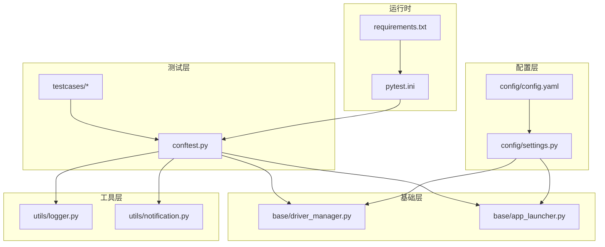
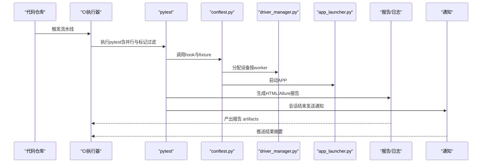
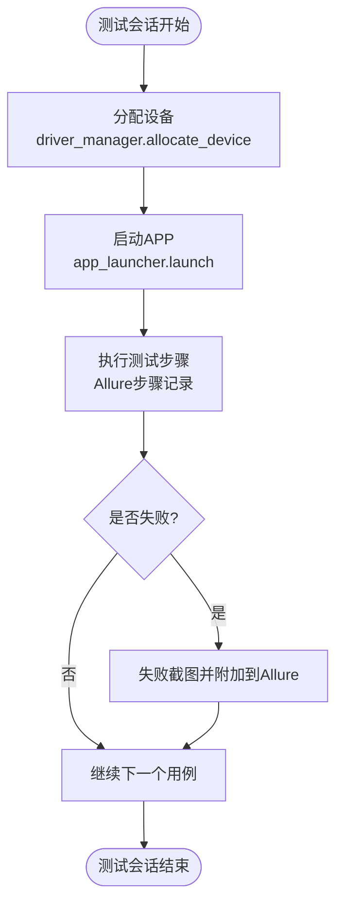
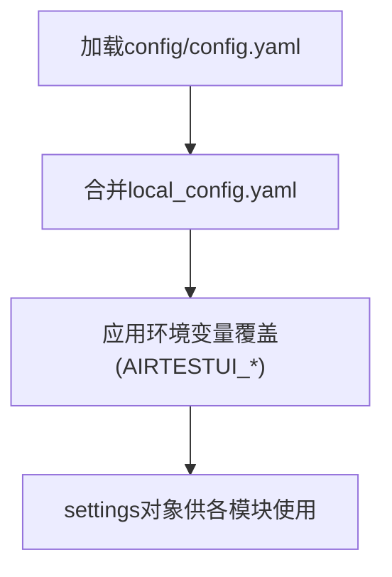
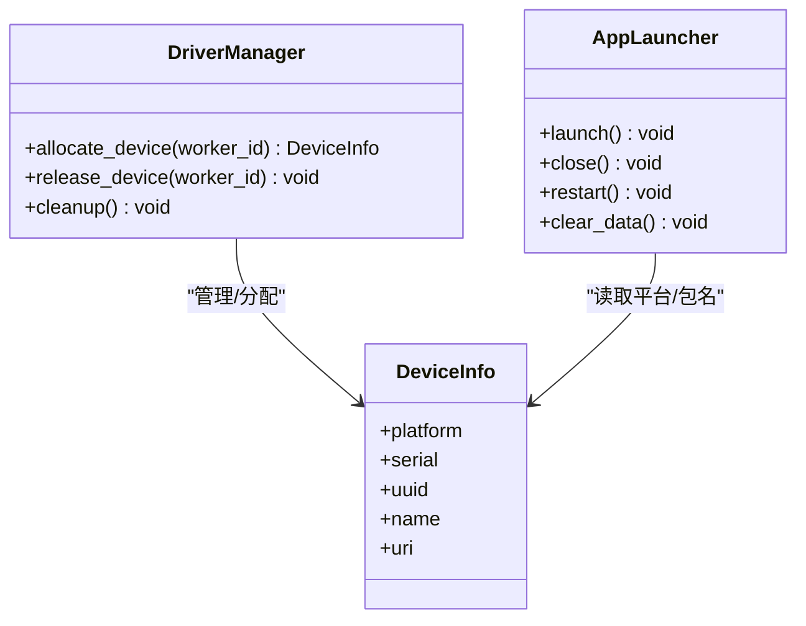
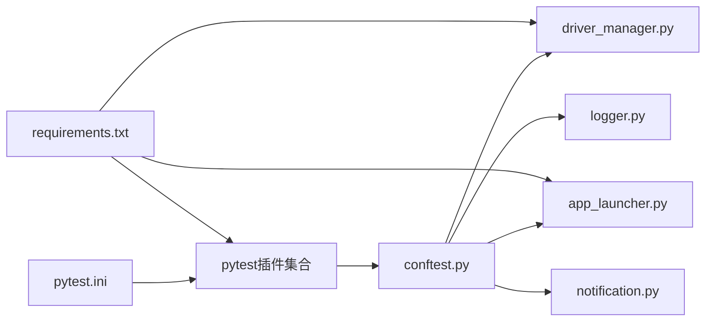

# CI/CD集成

<cite>
**本文引用的文件**
- [pytest.ini](file://pytest.ini)
- [conftest.py](file://conftest.py)
- [requirements.txt](file://requirements.txt)
- [config/settings.py](file://config/settings.py)
- [config/config.yaml](file://config/config.yaml)
- [base/driver_manager.py](file://base/driver_manager.py)
- [base/app_launcher.py](file://base/app_launcher.py)
- [utils/logger.py](file://utils/logger.py)
- [utils/notification.py](file://utils/notification.py)
- [README.md](file://README.md)
</cite>

## 目录
1. [简介](#简介)
2. [项目结构](#项目结构)
3. [核心组件](#核心组件)
4. [架构总览](#架构总览)
5. [详细组件分析](#详细组件分析)
6. [依赖分析](#依赖分析)
7. [性能考虑](#性能考虑)
8. [故障排查指南](#故障排查指南)
9. [结论](#结论)
10. [附录](#附录)

## 简介
本指南面向AirTestUI的CI/CD集成，围绕在Jenkins、GitLab CI、GitHub Actions等主流平台配置自动化测试流水线展开，结合项目现有的pytest配置、并行执行、测试分组、报告生成、设备与APP生命周期管理、日志与通知等能力，给出可落地的实施建议与最佳实践。同时提供Docker容器化部署思路与环境变量/密钥管理策略，并覆盖测试结果聚合、代码覆盖率统计与质量门禁建议。

## 项目结构
AirTestUI采用分层架构：配置层、基础层（设备与APP生命周期）、页面对象层、测试用例层、工具层；配合pytest插件生态实现并行执行、报告生成、重试与通知等能力。

图表来源
- [pytest.ini:1-47](file://pytest.ini#L1-L47)
- [conftest.py:1-255](file://conftest.py#L1-L255)
- [requirements.txt:1-21](file://requirements.txt#L1-L21)
- [config/config.yaml:1-70](file://config/config.yaml#L1-L70)
- [config/settings.py:1-112](file://config/settings.py#L1-L112)
- [base/driver_manager.py:1-188](file://base/driver_manager.py#L1-L188)
- [base/app_launcher.py:1-127](file://base/app_launcher.py#L1-L127)
- [utils/logger.py:1-59](file://utils/logger.py#L1-L59)
- [utils/notification.py:1-88](file://utils/notification.py#L1-L88)

章节来源
- [README.md:23-53](file://README.md#L23-L53)
- [pytest.ini:1-47](file://pytest.ini#L1-L47)
- [requirements.txt:1-21](file://requirements.txt#L1-L21)

## 核心组件
- pytest配置与并行执行
  - 使用pytest.ini集中配置测试发现路径、命名规则、默认命令行参数、自定义标记、日志与忽略目录等。
  - 默认启用并行执行与按文件分发，结合重试与HTML/Allure报告输出，满足CI流水线快速反馈需求。
- 全局fixture与hooks
  - conftest.py提供设备分配、APP启停、Poco初始化、失败截图与Allure步骤记录、测试结果统计与通知等能力。
- 配置系统
  - config/config.yaml提供环境、超时、截图、重试、报告、通知、Android/iOS设备与APP配置；config/settings.py支持本地覆盖与环境变量覆盖，便于CI中注入敏感信息。
- 设备与APP生命周期
  - driver_manager.py负责设备池初始化、并发分配与连接；app_launcher.py负责APP启动/关闭/重启/安装/数据清理等。
- 日志与通知
  - utils/logger.py提供结构化日志输出；utils/notification.py支持钉钉/邮件通知，便于CI中推送结果摘要。

章节来源
- [pytest.ini:1-47](file://pytest.ini#L1-L47)
- [conftest.py:1-255](file://conftest.py#L1-L255)
- [config/config.yaml:1-70](file://config/config.yaml#L1-L70)
- [config/settings.py:1-112](file://config/settings.py#L1-L112)
- [base/driver_manager.py:1-188](file://base/driver_manager.py#L1-L188)
- [base/app_launcher.py:1-127](file://base/app_launcher.py#L1-L127)
- [utils/logger.py:1-59](file://utils/logger.py#L1-L59)
- [utils/notification.py:1-88](file://utils/notification.py#L1-L88)

## 架构总览
下图展示CI流水线中各组件的交互关系，以及pytest并行执行、设备分配、报告生成与通知的关键节点。

图表来源
- [pytest.ini:11-21](file://pytest.ini#L11-L21)
- [conftest.py:37-117](file://conftest.py#L37-L117)
- [base/driver_manager.py:119-150](file://base/driver_manager.py#L119-L150)
- [base/app_launcher.py:49-92](file://base/app_launcher.py#L49-L92)
- [utils/notification.py:22-48](file://utils/notification.py#L22-L48)

## 详细组件分析

### pytest配置与并行执行
- 测试发现与命名
  - testpaths、python_files/classes/functions确保扫描testcases目录并匹配测试命名规范。
- 并行与分发
  - -n auto与--dist=loadfile实现按文件分发，减少跨worker状态干扰，提升稳定性。
- 报告与清理
  - --alluredir/--clean-alluredir/--self-contained-html与--html输出Allure与HTML报告，便于CI聚合。
- 重试与日志
  - --reruns与--reruns-delay提升偶发失败的稳定性；日志配置统一输出至控制台与文件。
- 标记体系
  - android/ios/smoke/regression/p0/p1/p2/skip_ci等标记便于CI按平台/范围/优先级筛选执行。

章节来源
- [pytest.ini:1-47](file://pytest.ini#L1-L47)
- [README.md:274-298](file://README.md#L274-L298)

### conftest.py：设备分配、APP启停与报告增强
- Hook与统计
  - pytest_configure写入Allure环境信息；pytest_collection_modifyitems自动标记平台；pytest_runtest_makereport统计结果并在失败时截图与附加失败详情。
- Fixture链路
  - worker_id/device_info/airtest_device/platform/poco/app_launcher/setup_app/test_data等fixture构成完整的测试上下文，支持多设备并发与平台差异化。
- 失败截图与Allure步骤
  - 自动失败截图并附加到Allure；每个测试自动记录为Allure步骤，提升可追溯性。
- 通知与收尾
  - 会话结束汇总统计并通过通知模块推送摘要。

图表来源
- [conftest.py:62-138](file://conftest.py#L62-L138)
- [base/driver_manager.py:119-150](file://base/driver_manager.py#L119-L150)
- [base/app_launcher.py:49-92](file://base/app_launcher.py#L49-L92)

章节来源
- [conftest.py:1-255](file://conftest.py#L1-L255)

### 配置系统：环境变量与本地覆盖
- 主配置与覆盖机制
  - config/config.yaml提供默认配置；config/settings.py支持local_config.yaml与环境变量覆盖，CI中推荐通过环境变量注入敏感信息与动态配置。
- 环境变量覆盖规则
  - 以AIRTESTUI_为前缀的环境变量可覆盖config.yaml顶层键，如AIRTESTUI_ENV=production覆盖env字段。
- 设备与APP配置
  - android/ios.devices与android/ios.app分别配置设备序列号/UUID与包名/Bundle ID，支持APK/IPA安装路径。

图表来源
- [config/settings.py:35-48](file://config/settings.py#L35-L48)
- [config/config.yaml:5-70](file://config/config.yaml#L5-L70)

章节来源
- [config/settings.py:1-112](file://config/settings.py#L1-L112)
- [config/config.yaml:1-70](file://config/config.yaml#L1-L70)
- [README.md:240-247](file://README.md#L240-L247)

### 设备管理与APP生命周期
- 设备池与分配
  - DriverManager单例维护设备池，按worker_id分配或复用设备，支持Android/iOS URI连接。
- APP启停
  - AppLauncher根据平台自动选择启动方式，支持可选安装与数据清理，启动后等待固定时间以保证稳定。

图表来源
- [base/driver_manager.py:51-188](file://base/driver_manager.py#L51-L188)
- [base/app_launcher.py:20-127](file://base/app_launcher.py#L20-L127)

章节来源
- [base/driver_manager.py:1-188](file://base/driver_manager.py#L1-L188)
- [base/app_launcher.py:1-127](file://base/app_launcher.py#L1-L127)

### 日志与通知
- 日志
  - utils/logger.py基于loguru输出到控制台与文件，支持DEBUG级别全量日志与ERROR级别错误日志，便于CI中收集与归档。
- 通知
  - utils/notification.py支持钉钉机器人与邮件通知，CI中可配置webhook/凭据，测试结束后推送结果摘要。

章节来源
- [utils/logger.py:1-59](file://utils/logger.py#L1-L59)
- [utils/notification.py:1-88](file://utils/notification.py#L1-L88)

## 依赖分析
- 运行时依赖
  - pytest及其插件（xdist、html、allure、rerunfailures）提供并行、报告与重试能力；airtest/pocoui提供UI自动化与UI树定位；PyYAML/openpyxl处理数据；requests/Pillow/loguru/tenacity提供网络、图像、日志与重试工具。
- 组件耦合
  - conftest.py依赖settings与driver_manager/app_launcher，形成测试上下文；driver_manager依赖settings的设备配置；notification依赖settings的配置项。

图表来源
- [requirements.txt:1-21](file://requirements.txt#L1-L21)
- [pytest.ini:11-21](file://pytest.ini#L11-L21)
- [conftest.py:14-21](file://conftest.py#L14-L21)

章节来源
- [requirements.txt:1-21](file://requirements.txt#L1-L21)
- [pytest.ini:11-21](file://pytest.ini#L11-L21)
- [conftest.py:1-255](file://conftest.py#L1-L255)

## 性能考虑
- 并行策略
  - 使用--dist=loadfile按文件分发，避免跨worker共享状态导致的竞态；-n auto自动根据CPU核数选择worker数。
- 资源隔离
  - 每个worker绑定唯一设备，减少锁竞争；APP启停在会话级进行，避免用例间相互影响。
- 报告与日志
  - Allure与HTML报告并存，CI中仅归档Allure结果，减少存储压力；日志按级别与大小轮转，避免磁盘膨胀。
- 重试与稳定性
  - --reruns与--reruns-delay降低偶发失败对吞吐的影响；Poco初始化失败回退到图像识别模式，提升鲁棒性。

## 故障排查指南
- 设备连接失败
  - 检查config/config.yaml中设备配置与URI格式；确认driver_manager的日志输出；必要时在CI中临时开启每步截图定位问题。
- APP启动异常
  - 核对包名/Bundle ID与安装路径；查看app_launcher的日志；适当增加app_launch超时。
- 并行冲突
  - 若出现竞态或资源占用，尝试使用-n 0关闭并行，或调整--dist策略。
- 报告缺失
  - 确认--alluredir与--html输出路径存在且可写；检查pytest.ini中的addopts是否被覆盖。
- 通知未发送
  - 检查config/config.yaml中notification.enabled/type配置与凭据；查看notification日志。

章节来源
- [base/driver_manager.py:103-118](file://base/driver_manager.py#L103-L118)
- [base/app_launcher.py:55-74](file://base/app_launcher.py#L55-L74)
- [utils/notification.py:22-48](file://utils/notification.py#L22-L48)

## 结论
AirTestUI在pytest生态与Airtest/Poco基础上，提供了完善的并行执行、报告生成、设备与APP生命周期管理、日志与通知能力。结合本文的CI/CD配置建议与最佳实践，可在Jenkins、GitLab CI、GitHub Actions等平台快速搭建稳定高效的自动化测试流水线，并通过环境变量与本地覆盖机制实现灵活的配置管理与密钥保护。

## 附录

### CI/CD平台配置要点与示例思路
- Jenkins
  - 使用Pipeline或Job触发器；在构建步骤中安装依赖、执行pytest并生成报告；使用Artifacts归档Allure结果；在Post-build中触发通知。
- GitLab CI
  - 在.gitlab-ci.yml中定义作业矩阵（平台/设备），使用缓存加速依赖安装；执行pytest并上传Allure报告作为CI构件。
- GitHub Actions
  - 参考项目README中的示例工作流，使用actions/checkout与setup-python；安装依赖后执行pytest并生成Allure报告；可使用simple-elf/allure-report-action发布报告。

章节来源
- [README.md:274-298](file://README.md#L274-L298)

### pytest配置文件关键参数说明
- 测试发现与命名
  - testpaths、python_files/classes/functions控制用例发现范围与命名。
- 并行与分发
  - -n auto与--dist=loadfile提升吞吐并降低跨worker干扰。
- 报告与清理
  - --alluredir/--clean-alluredir/--self-contained-html与--html输出Allure与HTML报告。
- 重试与日志
  - --reruns与--reruns-delay提升稳定性；日志配置统一输出。
- 标记体系
  - android/ios/smoke/regression/p0/p1/p2/skip_ci便于CI筛选。

章节来源
- [pytest.ini:1-47](file://pytest.ini#L1-L47)

### Docker容器化部署方案（思路）
- Dockerfile编写
  - 基于Python官方镜像；安装系统依赖（ADB/iOS-USB工具等）；复制requirements.txt与依赖安装；复制项目代码；设置工作目录与入口命令。
- 镜像构建
  - 在CI中使用缓存层优化依赖安装；按平台构建不同镜像（Android/iOS）。
- 容器编排
  - 使用docker-compose或Kubernetes Job/Workflow管理测试任务；挂载设备（Android ADB/iOS USB）与报告输出目录；通过环境变量注入配置与密钥。
- 注意事项
  - 设备权限与USB直连；日志与报告目录持久化；网络代理与证书配置。

### 环境变量与密钥管理策略
- 配置覆盖
  - 使用AIRTESTUI_前缀的环境变量覆盖config/config.yaml顶层键；本地覆盖文件local_config.yaml不纳入版本控制。
- 密钥注入
  - 在CI中通过受控的密钥管理服务注入敏感信息（如钉钉Webhook、SMTP密码等）；避免硬编码在仓库中。
- 最佳实践
  - 为不同环境（dev/staging/production）设置独立的环境变量；最小权限原则与轮换策略。

章节来源
- [config/settings.py:20-31](file://config/settings.py#L20-L31)
- [config/config.yaml:31-42](file://config/config.yaml#L31-L42)
- [README.md:240-247](file://README.md#L240-L247)

### 测试结果聚合、覆盖率统计与质量门禁
- 结果聚合
  - 使用Allure报告聚合多worker结果；在CI中归档allure-results并发布报告；结合通知模块推送汇总摘要。
- 覆盖率统计
  - 可引入pytest-cov或coverage.py在CI中统计Python代码覆盖率，并将结果上传至覆盖率平台或作为制品。
- 质量门禁
  - 基于通过率、失败数、告警级别等指标设置质量门禁；失败或覆盖率不达标时阻止合并或发布。