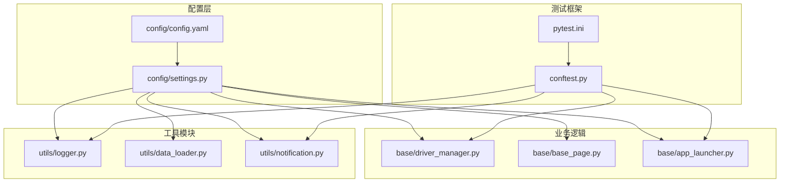
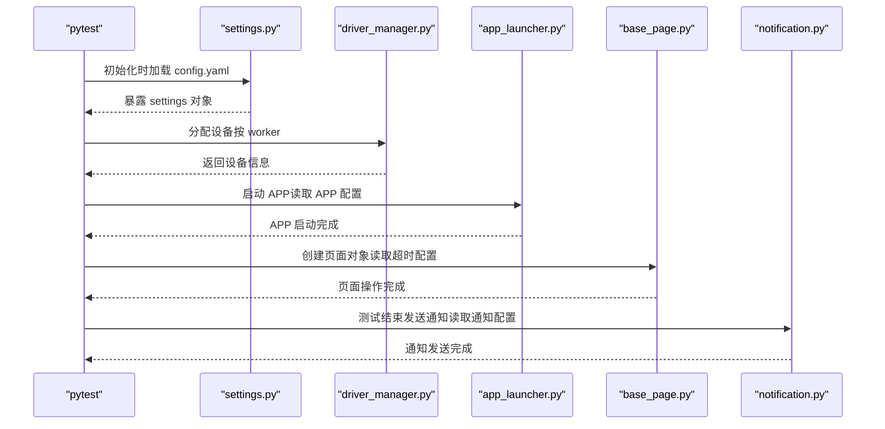
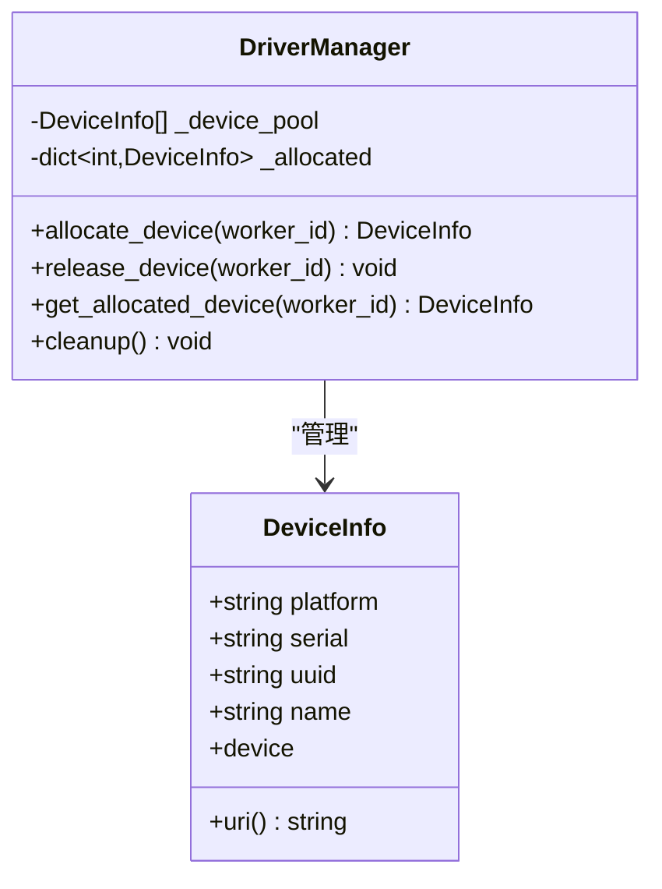
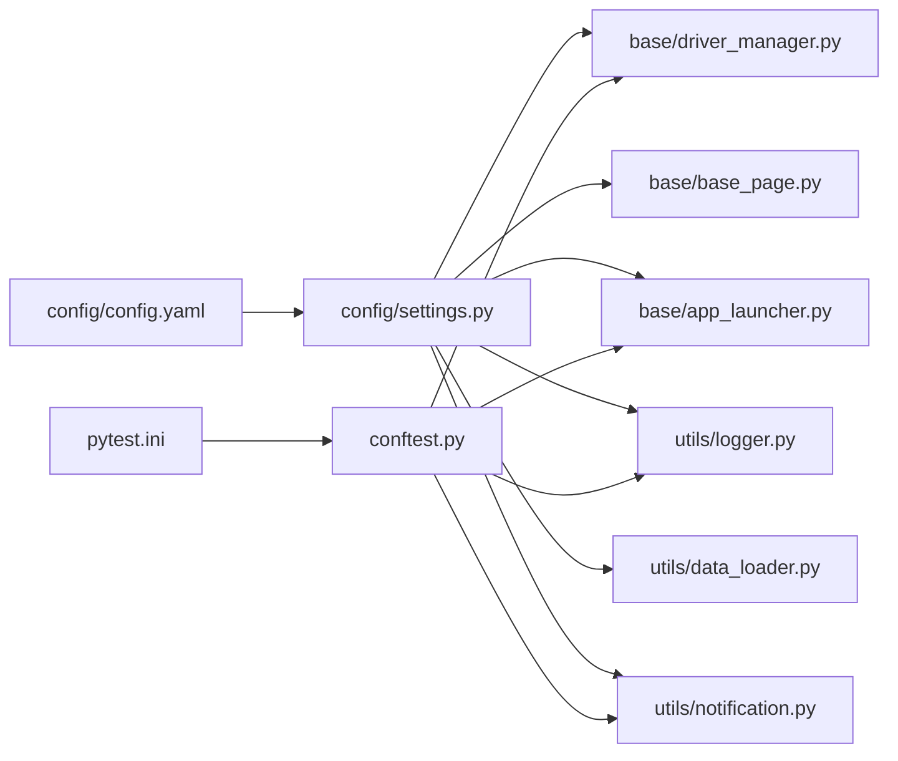

# 环境配置

<cite>
**本文引用的文件**
- [config.yaml](file://config/config.yaml)
- [settings.py](file://config/settings.py)
- [requirements.txt](file://requirements.txt)
- [pytest.ini](file://pytest.ini)
- [conftest.py](file://conftest.py)
- [driver_manager.py](file://base/driver_manager.py)
- [base_page.py](file://base/base_page.py)
- [app_launcher.py](file://base/app_launcher.py)
- [logger.py](file://utils/logger.py)
- [data_loader.py](file://utils/data_loader.py)
- [notification.py](file://utils/notification.py)
- [test_home.py](file://testcases/android/test_home.py)
- [home_page.py](file://pages/android/home_page.py)
</cite>

## 目录
1. [简介](#简介)
2. [项目结构](#项目结构)
3. [核心组件](#核心组件)
4. [架构总览](#架构总览)
5. [详细组件分析](#详细组件分析)
6. [依赖分析](#依赖分析)
7. [性能考虑](#性能考虑)
8. [故障排查指南](#故障排查指南)
9. [结论](#结论)
10. [附录](#附录)

## 简介
本指南面向 AirTestUI 的环境配置与管理，覆盖开发、测试、生产三类环境的配置差异与最佳实践；详解 config.yaml 的参数语义（设备连接、超时、截图、重试、报告、通知等）；说明 settings.py 的配置加载、环境变量覆盖、本地覆盖文件、便捷访问函数等；给出 requirements.txt 的依赖管理策略（版本锁定、安全更新、兼容性检查）；并介绍环境隔离、配置热更新、配置验证等高级特性与落地建议。

## 项目结构
AirTestUI 的配置体系围绕 config 目录展开，配合 pytest.ini、conftest.py、utils 与 base 子模块共同实现：
- config/config.yaml：全局 YAML 配置文件，定义运行环境、超时、截图、重试、报告、通知、Android/iOS 设备与 APP 配置等。
- config/settings.py：配置加载与访问层，支持环境变量覆盖、本地覆盖文件合并、便捷访问函数。
- pytest.ini：pytest 默认配置，含命令行参数、日志级别、Allure 报告目录、rerun 等。
- conftest.py：pytest 钩子与 fixtures，负责设备分配、Poco 初始化、APP 生命周期、失败截图、通知等。
- base/*：设备驱动、页面基类、APP 启停等核心业务逻辑，均通过 settings 读取配置。
- utils/*：日志、数据加载、通知等工具模块，同样依赖 settings 提供的配置。

图表来源
- [config/config.yaml:1-70](file://config/config.yaml#L1-L70)
- [config/settings.py:1-112](file://config/settings.py#L1-L112)
- [pytest.ini:1-47](file://pytest.ini#L1-L47)
- [conftest.py:1-255](file://conftest.py#L1-L255)
- [base/driver_manager.py:1-188](file://base/driver_manager.py#L1-L188)
- [base/base_page.py:1-320](file://base/base_page.py#L1-L320)
- [base/app_launcher.py:1-126](file://base/app_launcher.py#L1-L126)
- [utils/logger.py:1-59](file://utils/logger.py#L1-L59)
- [utils/data_loader.py:1-128](file://utils/data_loader.py#L1-L128)
- [utils/notification.py:1-119](file://utils/notification.py#L1-L119)

章节来源
- [config/config.yaml:1-70](file://config/config.yaml#L1-L70)
- [config/settings.py:1-112](file://config/settings.py#L1-L112)
- [pytest.ini:1-47](file://pytest.ini#L1-L47)
- [conftest.py:1-255](file://conftest.py#L1-L255)

## 核心组件
- 配置加载与访问：settings.py 将 config.yaml 加载为 settings 对象，并支持本地覆盖文件与环境变量覆盖，提供便捷访问函数如 get_env、get_timeout、get_android_devices、get_ios_devices、get_android_app、get_ios_app。
- 设备驱动管理：driver_manager.py 依据 settings 中的设备列表初始化设备池，按 worker 分配设备并建立连接。
- 页面基类：base_page.py 在构造时读取超时配置，封装 Airtest/Poco 操作，内置智能等待、截图、断言与 Allure 步骤。
- APP 启停：app_launcher.py 依据平台读取 APP 配置，支持启动、关闭、重启、清除数据与可选安装。
- 日志系统：logger.py 基于 loguru 输出到控制台与文件，支持轮转与保留策略。
- 数据加载：data_loader.py 支持 YAML/JSON/Excel，提供 parametrize_data 以 pytest.mark.parametrize 使用。
- 通知系统：notification.py 根据配置选择钉钉或邮件通知。

章节来源
- [config/settings.py:1-112](file://config/settings.py#L1-L112)
- [base/driver_manager.py:1-188](file://base/driver_manager.py#L1-L188)
- [base/base_page.py:1-320](file://base/base_page.py#L1-L320)
- [base/app_launcher.py:1-126](file://base/app_launcher.py#L1-L126)
- [utils/logger.py:1-59](file://utils/logger.py#L1-L59)
- [utils/data_loader.py:1-128](file://utils/data_loader.py#L1-L128)
- [utils/notification.py:1-119](file://utils/notification.py#L1-L119)

## 架构总览
AirTestUI 的配置架构采用“YAML 配置 + settings 访问 + pytest 集成”的分层设计：
- config.yaml 定义环境、超时、截图、重试、报告、通知、设备与 APP 等配置项。
- settings.py 负责加载、合并与暴露配置，支持本地覆盖文件与环境变量覆盖。
- conftest.py 在 pytest 生命周期内注入设备、Poco、APP 启停、失败截图与通知。
- base/* 与 utils/* 通过 settings 读取配置，形成统一的配置消费面。

图表来源
- [config/settings.py:1-112](file://config/settings.py#L1-L112)
- [base/driver_manager.py:1-188](file://base/driver_manager.py#L1-L188)
- [base/app_launcher.py:1-126](file://base/app_launcher.py#L1-L126)
- [base/base_page.py:1-320](file://base/base_page.py#L1-L320)
- [utils/notification.py:1-119](file://utils/notification.py#L1-L119)

## 详细组件分析

### config.yaml 配置项详解
- 运行环境 env：dev/staging/production，影响日志、报告与通知等行为。
- 超时配置 timeout：
  - element_wait：元素等待超时（秒）
  - page_load：页面加载超时（秒）
  - app_launch：APP 启动超时（秒）
- 截图配置 screenshot：
  - on_failure：失败时自动截图
  - on_step：每步操作截图（调试用）
  - save_dir：截图保存目录
- 重试配置 retry：
  - max_attempts：失败重试次数
  - wait_between：重试间隔（秒）
- 报告配置 report：
  - allure_dir：Allure 结果目录
  - html_file：HTML 报告文件路径
- 通知配置 notification：
  - enabled：是否启用通知
  - type：通知类型（dingtalk/email）
  - dingtalk：webhook、secret
  - email：smtp_host、smtp_port、sender、password、receivers
- Android 配置 android：
  - devices：设备列表（serial、name）
  - app：package、activity、install_path
- iOS 配置 ios：
  - devices：设备列表（uuid、name）
  - app：bundle_id、install_path

章节来源
- [config/config.yaml:1-70](file://config/config.yaml#L1-L70)

### settings.py 配置管理与扩展
- 配置加载流程：
  - 读取主配置文件（可通过 AIRTESTUI_CONFIG_PATH 覆盖）
  - 若存在 local_config.yaml，则合并到主配置
  - 应用环境变量覆盖（前缀 AIRTESTUI_，键名大小写转换为小写）
- 配置对象化：settings 为 _Config 实例，支持属性与字典两种访问方式
- 便捷访问函数：
  - get_env()：获取当前环境
  - get_timeout(category)：按类别获取超时
  - get_android_devices()/get_ios_devices()：获取设备列表
  - get_android_app()/get_ios_app()：获取 APP 配置
- 扩展建议：
  - 新增配置项时，在 config.yaml 添加默认值
  - 在 settings.py 中新增对应的便捷函数，保持访问一致性
  - 通过环境变量覆盖实现环境隔离，避免硬编码

章节来源
- [config/settings.py:1-112](file://config/settings.py#L1-L112)

### requirements.txt 依赖管理策略
- 版本锁定：使用 >= 约束，确保最低版本满足功能需求
- 安全更新：定期使用 pip-audit 或类似工具扫描漏洞
- 兼容性检查：在 CI 中使用不同 Python 版本矩阵测试，确保依赖兼容
- 依赖分类：
  - 测试框架：pytest、pytest-xdist、pytest-html、allure-pytest、pytest-rerunfailures
  - Airtest/Poco：airtest、pocoui
  - 配置与数据：PyYAML、openpyxl
  - 工具：requests、Pillow、loguru、tenacity
- 建议：
  - 使用 pip-tools 或 Poetry 管理锁定文件
  - 在 CI 中执行 pip-audit 与安全扫描
  - 对关键依赖（airtest、pocoui、PyYAML）关注上游变更

章节来源
- [requirements.txt:1-21](file://requirements.txt#L1-L21)

### pytest.ini 配置与环境隔离
- 测试发现与命名规则：testpaths、python_files/classes/functions
- 默认命令行参数：-v、--tb=short、--alluredir、--clean-alluredir、--self-contained-html、--html、-n auto、--dist=loadfile、--reruns、--reruns-delay
- 自定义标记：android、ios、smoke、regression、p0/p1/p2、skip_ci
- 日志配置：控制台与文件日志级别、格式与输出路径
- 忽略目录：.git、.idea、__pycache__、venv、resources、data
- 最小版本：minversion
- 环境隔离建议：
  - 通过命令行参数或环境变量切换环境（如 --env=production）
  - 使用 pytest.ini 的 addopts 作为默认开关，结合 AIRTESTUI_* 环境变量覆盖

章节来源
- [pytest.ini:1-47](file://pytest.ini#L1-L47)

### conftest.py 与配置集成
- pytest_configure：写入 Allure 环境信息（Environment、Platform、Framework）
- pytest_collection_modifyitems：根据路径自动标记 android/ios
- pytest_runtest_makereport：统计结果、失败截图、附加失败日志
- pytest_sessionfinish：汇总统计、发送通知
- fixtures：
  - worker_id/device_info/airtest_device/platform：设备分配与连接
  - poco：按平台初始化 Poco
  - app_launcher/setup_app：APP 生命周期管理
  - step_allure：每个用例自动记录 Allure 步骤
  - test_data：数据驱动加载

章节来源
- [conftest.py:1-255](file://conftest.py#L1-L255)

### 设备驱动管理与配置消费
- 设备池初始化：读取 settings 中的 android/ios devices 列表，构建 DeviceInfo 池
- 设备分配：按 worker_id 分配或复用设备，连接成功后记录日志
- 超时配置：通过 get_timeout 读取 element_wait/page_load/app_launch
- 释放设备：会话结束时释放占用设备

图表来源
- [base/driver_manager.py:20-188](file://base/driver_manager.py#L20-L188)

章节来源
- [base/driver_manager.py:1-188](file://base/driver_manager.py#L1-L188)

### 页面基类与超时配置
- 构造时读取 element_wait 与 page_load 超时
- 封装 Airtest/Poco 操作，内置智能等待、截图、断言与 Allure 步骤
- 资源路径统一通过 resource_path 获取

章节来源
- [base/base_page.py:1-320](file://base/base_page.py#L1-L320)

### APP 启停与配置
- 依据平台读取 APP 配置（Android 包名+Activity，iOS Bundle ID）
- 支持安装、启动、关闭、重启、清除数据
- 启动后等待 app_launch 超时

章节来源
- [base/app_launcher.py:1-126](file://base/app_launcher.py#L1-L126)

### 日志与通知
- 日志：控制台彩色输出、DEBUG 文件轮转、ERROR 文件轮转
- 通知：钉钉机器人或邮件，支持签名与认证

章节来源
- [utils/logger.py:1-59](file://utils/logger.py#L1-L59)
- [utils/notification.py:1-119](file://utils/notification.py#L1-L119)

## 依赖分析
- 配置依赖链：
  - config.yaml ← settings.py（加载与覆盖）
  - settings.py ← driver_manager.py、base_page.py、app_launcher.py、logger.py、data_loader.py、notification.py（消费配置）
  - pytest.ini ← conftest.py（测试框架默认配置）
  - conftest.py ← driver_manager.py、app_launcher.py、logger.py、notification.py（集成配置）
- 耦合与内聚：
  - settings.py 作为单一配置入口，降低各模块对具体配置文件的耦合
  - 通过便捷访问函数抽象配置读取，提升内聚性
- 外部依赖：
  - PyYAML 用于配置解析
  - loguru 用于日志
  - requests/Pillow/tenacity 等工具库

图表来源
- [config/config.yaml:1-70](file://config/config.yaml#L1-L70)
- [config/settings.py:1-112](file://config/settings.py#L1-L112)
- [pytest.ini:1-47](file://pytest.ini#L1-L47)
- [conftest.py:1-255](file://conftest.py#L1-L255)
- [base/driver_manager.py:1-188](file://base/driver_manager.py#L1-L188)
- [base/base_page.py:1-320](file://base/base_page.py#L1-L320)
- [base/app_launcher.py:1-126](file://base/app_launcher.py#L1-L126)
- [utils/logger.py:1-59](file://utils/logger.py#L1-L59)
- [utils/data_loader.py:1-128](file://utils/data_loader.py#L1-L128)
- [utils/notification.py:1-119](file://utils/notification.py#L1-L119)

章节来源
- [config/settings.py:1-112](file://config/settings.py#L1-L112)
- [conftest.py:1-255](file://conftest.py#L1-L255)

## 性能考虑
- 并发与设备分配：pytest-xdist 的 -n auto 与 --dist=loadfile 可提升执行效率；driver_manager 的设备池与分配策略避免重复连接开销。
- 超时设置：合理设置 element_wait/page_load/app_launch，避免过长导致 CI 时间过长，过短导致不稳定。
- 截图与重试：on_failure/on_step 与 retry.max_attempts/wait_between 需平衡稳定性与性能。
- 日志级别：pytest.ini 的 log_cli_level/log_file_level 控制输出量，减少磁盘 IO 压力。
- 通知频率：通知开关与类型选择，避免频繁网络请求影响性能。

## 故障排查指南
- 配置未生效：
  - 检查 AIRTESTUI_CONFIG_PATH 是否指向正确路径
  - 确认本地覆盖文件 local_config.yaml 是否存在且格式正确
  - 确认环境变量前缀与键名大小写是否符合规则
- 设备连接失败：
  - 检查 devices 配置（Android serial 或 iOS uuid）是否正确
  - 查看 driver_manager 的错误日志与异常堆栈
- APP 启动失败：
  - 检查 package/bundle_id/activity/install_path 配置
  - 查看 app_launcher 的错误日志
- 截图与报告问题：
  - 检查 screenshot.save_dir 与 report.allure_dir/html_file 路径权限
  - 确认 Allure 插件与 pytest-html 安装版本
- 通知失败：
  - 检查 notification.enabled/type 配置
  - 钉钉：确认 webhook/secret；邮件：确认 SMTP 主机、端口、发件人、密码、收件人

章节来源
- [config/settings.py:1-112](file://config/settings.py#L1-L112)
- [base/driver_manager.py:1-188](file://base/driver_manager.py#L1-L188)
- [base/app_launcher.py:1-126](file://base/app_launcher.py#L1-L126)
- [utils/logger.py:1-59](file://utils/logger.py#L1-L59)
- [utils/notification.py:1-119](file://utils/notification.py#L1-L119)

## 结论
AirTestUI 的配置体系以 YAML 为核心，通过 settings.py 提供统一访问与覆盖能力，配合 pytest 钩子与 fixtures 实现环境隔离与自动化。建议在团队内规范配置命名、覆盖策略与环境变量约定，结合 CI 的安全扫描与兼容性测试，持续优化超时与并发策略，确保在开发、测试、生产三类环境中稳定高效运行。

## 附录

### 开发/测试/生产环境配置差异与最佳实践
- 开发环境（dev）：
  - 截图 on_step 建议开启，便于调试
  - 重试 max_attempts/wait_between 可适当放宽
  - 日志级别设为 DEBUG，Allure 报告保留期短
- 测试环境（staging）：
  - 截图 on_failure 开启，on_step 关闭
  - 重试适度，避免掩盖真实问题
  - 日志级别 INFO，报告保留期适中
- 生产环境（production）：
  - 截图 on_failure 开启，on_step 关闭
  - 重试最小化，提高稳定性
  - 日志级别 WARNING/ERROR，报告保留期较长

### 配置热更新与验证建议
- 热更新：
  - settings.py 支持环境变量覆盖，可在不重启进程的情况下动态调整部分配置
  - 建议将敏感配置放入环境变量，避免硬编码
- 验证：
  - 在 CI 中增加配置校验步骤，检查必填字段与格式
  - 对设备连接与 APP 启动增加预检脚本
  - 对通知配置进行连通性测试

### 使用示例与参考路径
- 读取环境：参见 [settings.py:84-86](file://config/settings.py#L84-L86)
- 读取超时：参见 [settings.py:89-91](file://config/settings.py#L89-L91)
- 获取设备列表：参见 [settings.py:94-101](file://config/settings.py#L94-L101)
- 获取 APP 配置：参见 [settings.py:104-111](file://config/settings.py#L104-L111)
- 页面基类超时使用：参见 [base_page.py:49-57](file://base/base_page.py#L49-L57)
- APP 启动超时使用：参见 [app_launcher.py:67-69](file://base/app_launcher.py#L67-L69)
- 设备分配与连接：参见 [driver_manager.py:119-150](file://base/driver_manager.py#L119-L150)
- 测试用例中使用页面对象：参见 [test_home.py:20-22](file://testcases/android/test_home.py#L20-L22)
- 页面对象示例：参见 [home_page.py:14-58](file://pages/android/home_page.py#L14-L58)