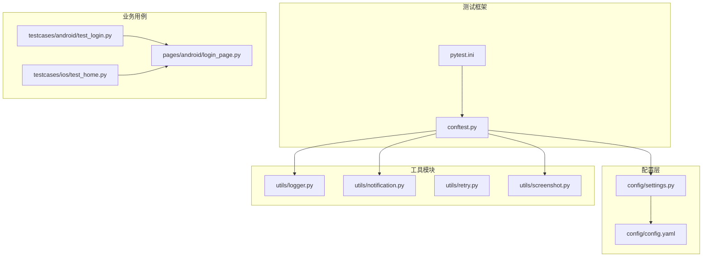
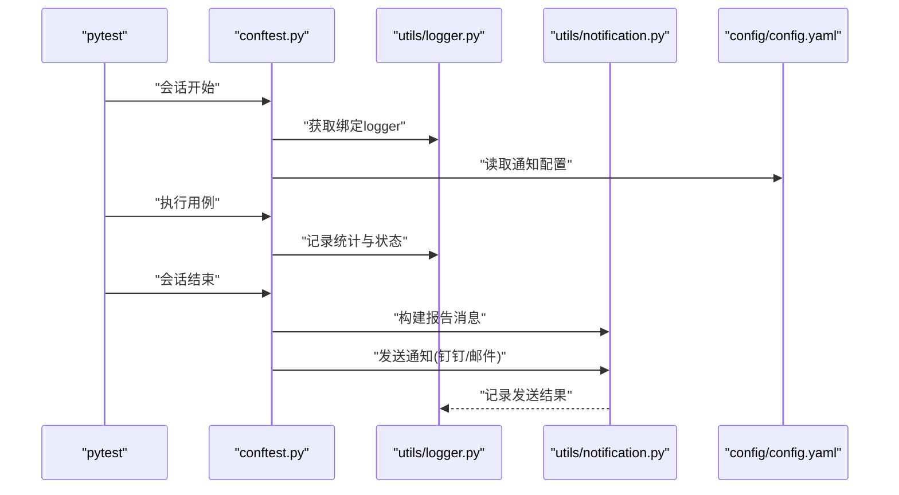
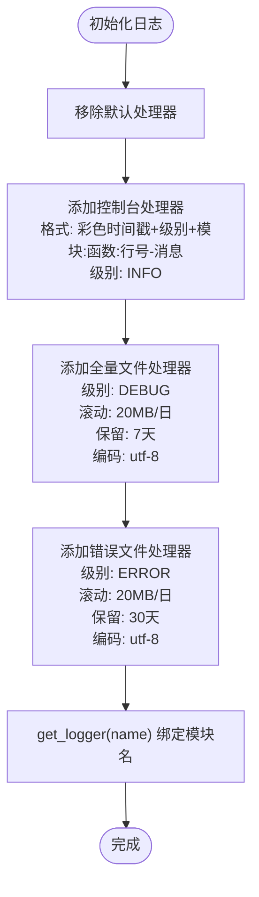
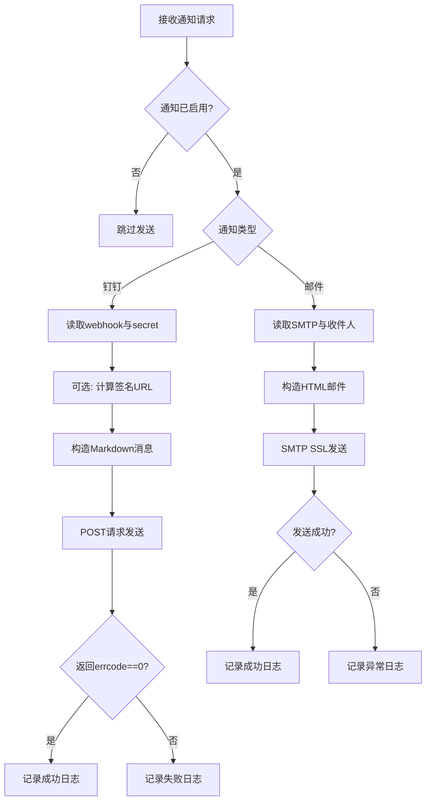
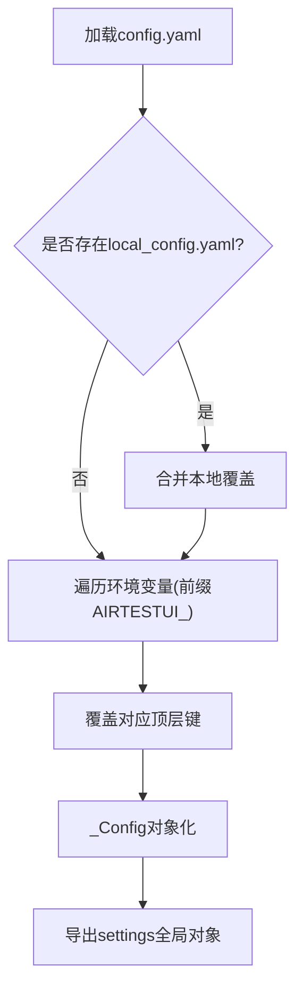
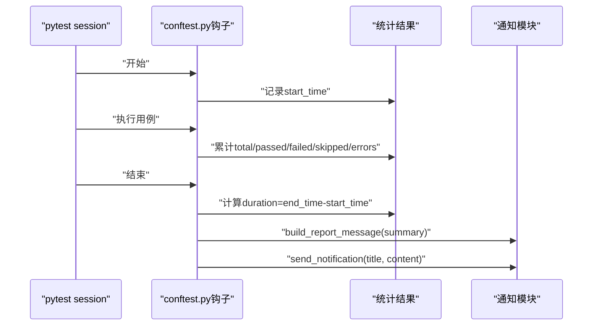
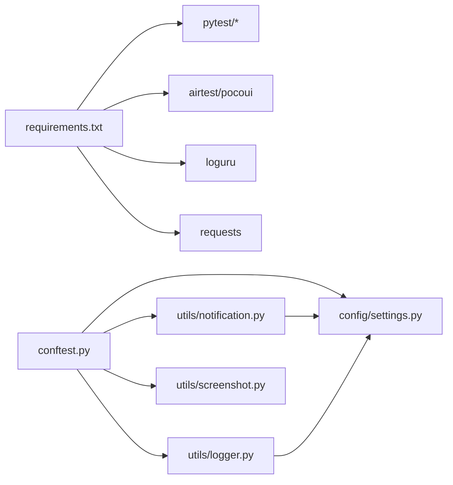

# 监控告警

<cite>
**本文引用的文件**
- [utils/logger.py](file://utils/logger.py)
- [utils/notification.py](file://utils/notification.py)
- [config/settings.py](file://config/settings.py)
- [config/config.yaml](file://config/config.yaml)
- [conftest.py](file://conftest.py)
- [pytest.ini](file://pytest.ini)
- [requirements.txt](file://requirements.txt)
- [testcases/android/test_login.py](file://testcases/android/test_login.py)
- [testcases/ios/test_home.py](file://testcases/ios/test_home.py)
- [pages/android/login_page.py](file://pages/android/login_page.py)
</cite>

## 目录
1. [简介](#简介)
2. [项目结构](#项目结构)
3. [核心组件](#核心组件)
4. [架构总览](#架构总览)
5. [详细组件分析](#详细组件分析)
6. [依赖分析](#依赖分析)
7. [性能考虑](#性能考虑)
8. [故障排查指南](#故障排查指南)
9. [结论](#结论)
10. [附录](#附录)

## 简介
本实施指南面向AirTestUI的监控告警体系，围绕日志系统、通知系统、性能指标采集与告警规则、以及监控仪表板搭建进行系统性说明。文档以仓库现有实现为基础，结合配置文件与钩子机制，给出可落地的部署与运维建议，并提供可视化与告警升级/抑制策略的实践思路。

## 项目结构
项目采用分层组织：配置层（config）、基础能力（base）、页面对象（pages）、测试用例（testcases）、工具模块（utils），并通过pytest钩子在会话生命周期内完成统计与通知。

图表来源
- [config/config.yaml:1-70](file://config/config.yaml#L1-L70)
- [config/settings.py:1-112](file://config/settings.py#L1-L112)
- [utils/logger.py:1-59](file://utils/logger.py#L1-L59)
- [utils/notification.py:1-167](file://utils/notification.py#L1-L167)
- [utils/retry.py:1-102](file://utils/retry.py#L1-L102)
- [utils/screenshot.py:1-89](file://utils/screenshot.py#L1-L89)
- [conftest.py:1-255](file://conftest.py#L1-L255)
- [pytest.ini:1-46](file://pytest.ini#L1-L46)
- [testcases/android/test_login.py:1-71](file://testcases/android/test_login.py#L1-L71)
- [testcases/ios/test_home.py:1-38](file://testcases/ios/test_home.py#L1-L38)
- [pages/android/login_page.py:1-107](file://pages/android/login_page.py#L1-L107)

章节来源
- [config/config.yaml:1-70](file://config/config.yaml#L1-L70)
- [config/settings.py:1-112](file://config/settings.py#L1-L112)
- [conftest.py:1-255](file://conftest.py#L1-L255)
- [pytest.ini:1-46](file://pytest.ini#L1-L46)

## 核心组件
- 日志系统：基于loguru，提供控制台彩色输出与文件轮转，分别输出全量日志与错误日志，支持结构化绑定模块名。
- 通知系统：支持钉钉机器人与邮件两种通道，自动构建测试报告Markdown消息体，按配置开关与类型路由。
- 配置系统：集中式YAML配置，支持本地覆盖与环境变量覆盖，提供便捷访问函数。
- 测试钩子：在会话结束时汇总统计、生成报告、触发通知；失败用例自动截图并附加到Allure。
- 性能指标：在会话结束时计算总耗时、通过/失败/跳过数量与通过率，作为告警与看板的核心指标。

章节来源
- [utils/logger.py:1-59](file://utils/logger.py#L1-L59)
- [utils/notification.py:1-167](file://utils/notification.py#L1-L167)
- [config/settings.py:1-112](file://config/settings.py#L1-L112)
- [conftest.py:89-117](file://conftest.py#L89-L117)

## 架构总览
下图展示了从测试执行到通知告警的关键流程，以及日志与配置的交互关系。

图表来源
- [conftest.py:89-117](file://conftest.py#L89-L117)
- [utils/logger.py:50-59](file://utils/logger.py#L50-L59)
- [utils/notification.py:22-48](file://utils/notification.py#L22-L48)
- [config/config.yaml:30-43](file://config/config.yaml#L30-L43)

## 详细组件分析

### 日志系统（loguru）
- 日志目录与轮转
  - 全量日志：DEBUG级别，按日期滚动，单文件上限20MB，保留7天，压缩存储。
  - 错误日志：仅ERROR及以上，按日期滚动，保留30天，压缩存储。
- 输出格式
  - 控制台：彩色时间戳+级别+模块名:函数:行号-消息。
  - 文件：标准时间戳+级别+模块名:函数:行号-消息。
- 结构化绑定
  - 通过绑定模块名，便于在不同模块中区分来源，利于问题定位与审计。

图表来源
- [utils/logger.py:16-47](file://utils/logger.py#L16-L47)
- [utils/logger.py:50-59](file://utils/logger.py#L50-L59)

章节来源
- [utils/logger.py:1-59](file://utils/logger.py#L1-L59)

### 通知系统（钉钉/邮件）
- 通知开关与类型
  - 通过配置项开启/关闭通知，并指定通知类型（钉钉/邮件）。
- 钉钉机器人
  - 支持签名URL（timestamp+secret），发送Markdown消息，包含标题与表格化指标。
- 邮件通知
  - 基于SMTP SSL，支持主题、收件人列表与HTML正文。
- 报告消息构建
  - 自动生成标题与Markdown表格，包含环境、耗时、总数、通过/失败/跳过、通过率。

图表来源
- [utils/notification.py:22-48](file://utils/notification.py#L22-L48)
- [utils/notification.py:50-94](file://utils/notification.py#L50-L94)
- [utils/notification.py:96-126](file://utils/notification.py#L96-L126)
- [utils/notification.py:128-166](file://utils/notification.py#L128-L166)
- [config/config.yaml:30-43](file://config/config.yaml#L30-L43)

章节来源
- [utils/notification.py:1-167](file://utils/notification.py#L1-L167)
- [config/config.yaml:30-43](file://config/config.yaml#L30-L43)

### 配置系统（YAML + 环境变量覆盖）
- 配置来源
  - 主配置：config/config.yaml。
  - 本地覆盖：config/local_config.yaml（存在时合并）。
  - 环境变量覆盖：前缀AIRTESTUI_覆盖顶层键。
- 全局配置对象
  - settings提供属性与字典两种访问方式，支持嵌套结构。
- 便捷函数
  - 获取运行环境、超时配置、设备与应用配置等。

图表来源
- [config/settings.py:34-80](file://config/settings.py#L34-L80)
- [config/config.yaml:1-70](file://config/config.yaml#L1-L70)

章节来源
- [config/settings.py:1-112](file://config/settings.py#L1-L112)
- [config/config.yaml:1-70](file://config/config.yaml#L1-L70)

### 测试钩子与性能指标采集
- 会话统计
  - 在会话开始记录起始时间，在会话结束计算总耗时，并统计总数、通过、失败、跳过、错误数。
- 报告与通知
  - 生成测试报告标题与Markdown内容，调用通知模块发送。
- 失败处理
  - 失败用例自动截图并附加到Allure；同时记录失败详情文本附件。

图表来源
- [conftest.py:37-50](file://conftest.py#L37-L50)
- [conftest.py:62-87](file://conftest.py#L62-L87)
- [conftest.py:89-117](file://conftest.py#L89-L117)
- [utils/notification.py:128-166](file://utils/notification.py#L128-L166)

章节来源
- [conftest.py:1-255](file://conftest.py#L1-L255)
- [utils/notification.py:128-166](file://utils/notification.py#L128-L166)

### 重试与截图（辅助监控）
- 重试机制
  - 提供通用重试装饰器与“直到True”的持续重试装饰器，支持异常类型过滤、回调与间隔控制。
- 截图能力
  - 统一截图保存目录、命名与Allure附件，失败时自动截图并附加。

章节来源
- [utils/retry.py:1-102](file://utils/retry.py#L1-L102)
- [utils/screenshot.py:1-89](file://utils/screenshot.py#L1-L89)

## 依赖分析
- 外部依赖
  - pytest系列、Airtest/Poco、requests、loguru、tenacity等。
- 内部耦合
  - conftest.py依赖utils/logger、utils/notification、config/settings与截图工具。
  - 通知模块依赖配置settings与logger。
  - 日志模块依赖配置settings中的根目录。

图表来源
- [requirements.txt:1-21](file://requirements.txt#L1-L21)
- [conftest.py:14-19](file://conftest.py#L14-L19)
- [utils/notification.py:16-17](file://utils/notification.py#L16-L17)
- [utils/logger.py:9](file://utils/logger.py#L9)

章节来源
- [requirements.txt:1-21](file://requirements.txt#L1-L21)
- [conftest.py:1-255](file://conftest.py#L1-L255)

## 性能考虑
- 日志轮转与保留
  - 全量日志20MB/日+7天，错误日志20MB/日+30天，兼顾磁盘占用与历史追溯。
- 通知发送
  - 钉钉与邮件均设置超时，避免阻塞测试会话；失败时记录错误日志以便后续重试或人工干预。
- 指标计算
  - 仅在会话结束一次性计算，避免在用例执行过程中引入额外开销。
- 并发与稳定性
  - 通过pytest-xdist并发执行，配合重试与失败截图提升整体稳定性。

[本节为通用性能讨论，无需特定文件引用]

## 故障排查指南
- 通知未发送
  - 检查配置项notification.enabled与type是否正确；确认钉钉webhook或邮件SMTP配置完整。
  - 查看通知模块日志，关注“通知未配置”“通知功能未启用”“不支持的通知类型”等提示。
- 钉钉签名失败
  - 确认secret与时间戳计算逻辑一致；检查网络连通性与超时设置。
- 邮件发送异常
  - 校验SMTP主机、端口、发件人、授权码与收件人列表；确认SMTP_SSL连接可用。
- 日志未输出或路径异常
  - 确认loguru处理器已正确添加；检查日志目录权限与磁盘空间。
- 会话统计不准确
  - 检查pytest钩子是否被覆盖或禁用；确认会话结束钩子执行顺序。

章节来源
- [utils/notification.py:30-48](file://utils/notification.py#L30-L48)
- [utils/notification.py:52-94](file://utils/notification.py#L52-L94)
- [utils/notification.py:98-126](file://utils/notification.py#L98-L126)
- [utils/logger.py:16-47](file://utils/logger.py#L16-L47)
- [conftest.py:89-117](file://conftest.py#L89-L117)

## 结论
AirTestUI的监控告警体系以pytest钩子为核心，结合loguru日志与通知模块，实现了从测试执行到结果通知的闭环。通过YAML配置与环境变量覆盖，系统具备良好的可运维性与可扩展性。建议在CI/CD流水线中启用通知开关，并结合外部监控平台建立仪表板与告警规则，形成多层次的质量保障体系。

[本节为总结性内容，无需特定文件引用]

## 附录

### A. 日志系统配置要点
- 控制台输出：INFO级别，彩色格式，便于快速审阅。
- 文件输出：DEBUG与ERROR双通道，按日期滚动，保留策略明确。
- 模块绑定：get_logger(name)确保日志来源清晰。

章节来源
- [utils/logger.py:16-47](file://utils/logger.py#L16-L47)
- [utils/logger.py:50-59](file://utils/logger.py#L50-L59)

### B. 通知系统集成步骤
- 启用通知：在配置中设置enabled=true与type=dingtalk或email。
- 钉钉：填写webhook与可选secret，自动计算签名URL。
- 邮件：填写SMTP主机、端口、发件人、授权码与收件人列表。
- 触发时机：pytest会话结束时自动发送测试报告。

章节来源
- [config/config.yaml:30-43](file://config/config.yaml#L30-L43)
- [utils/notification.py:22-48](file://utils/notification.py#L22-L48)
- [utils/notification.py:50-94](file://utils/notification.py#L50-L94)
- [utils/notification.py:96-126](file://utils/notification.py#L96-L126)
- [conftest.py:111-117](file://conftest.py#L111-L117)

### C. 性能监控指标定义与采集
- 关键指标
  - 总用例数、通过数、失败数、跳过数、错误数、总耗时、通过率。
- 采集位置
  - pytest会话结束钩子中一次性统计并计算。
- 建议
  - 将上述指标持久化至外部监控系统（如Prometheus/Grafana），并设置阈值与告警规则。

章节来源
- [conftest.py:94-101](file://conftest.py#L94-L101)
- [utils/notification.py:128-166](file://utils/notification.py#L128-L166)

### D. 告警规则与阈值建议
- 基于通过率
  - 通过率低于阈值（如95%）触发预警；连续多次低于阈值触发严重告警。
- 基于失败数/失败率
  - 失败数超过阈值（如>0）或失败率超过阈值（如>5%）触发告警。
- 基于耗时
  - 单次执行耗时超过阈值（如>预估值+2σ）触发慢响应告警。
- 告警升级与抑制
  - 初次告警静默周期内抑制重复通知；连续告警按等级升级（预警→警告→严重）。

[本节为通用告警策略建议，无需特定文件引用]

### E. 监控仪表板搭建与可视化
- 指标来源
  - 通过conftest统计的指标与通知模块生成的Markdown内容，可作为看板数据源。
- 可视化建议
  - 指标面板：通过率趋势、失败率、平均耗时、设备利用率。
  - 事件面板：失败截图附件、失败详情文本、通知记录。
- 平台对接
  - 将统计结果导出至外部监控平台（如Grafana+Prometheus），并配置告警规则与通知通道。

[本节为通用可视化建议，无需特定文件引用]