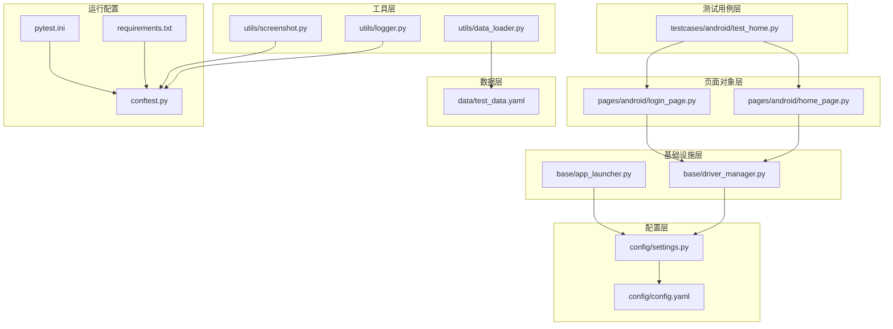
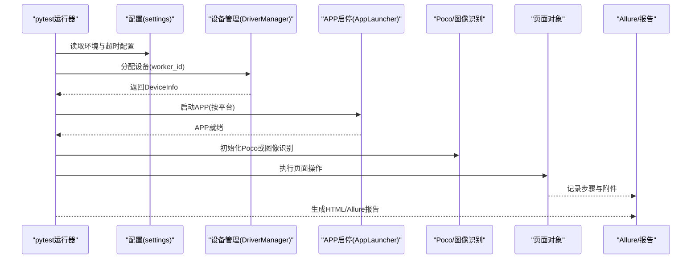
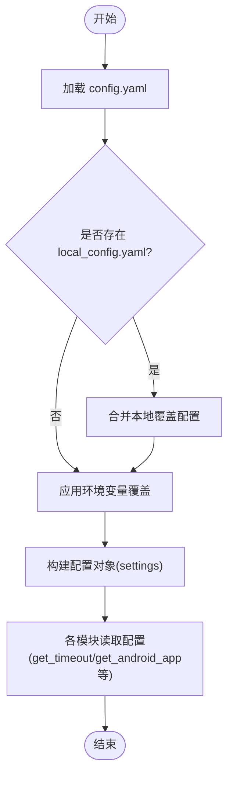
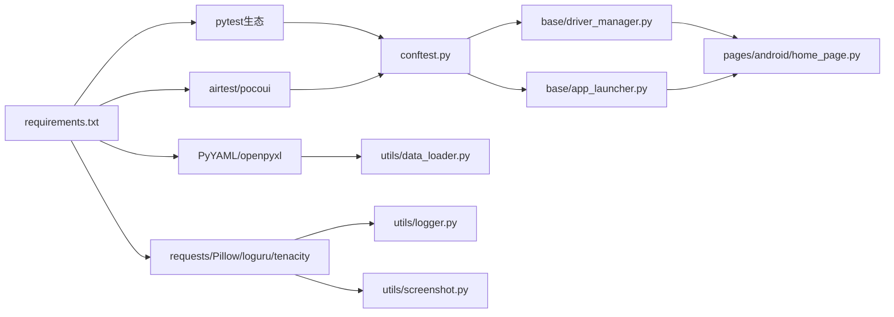
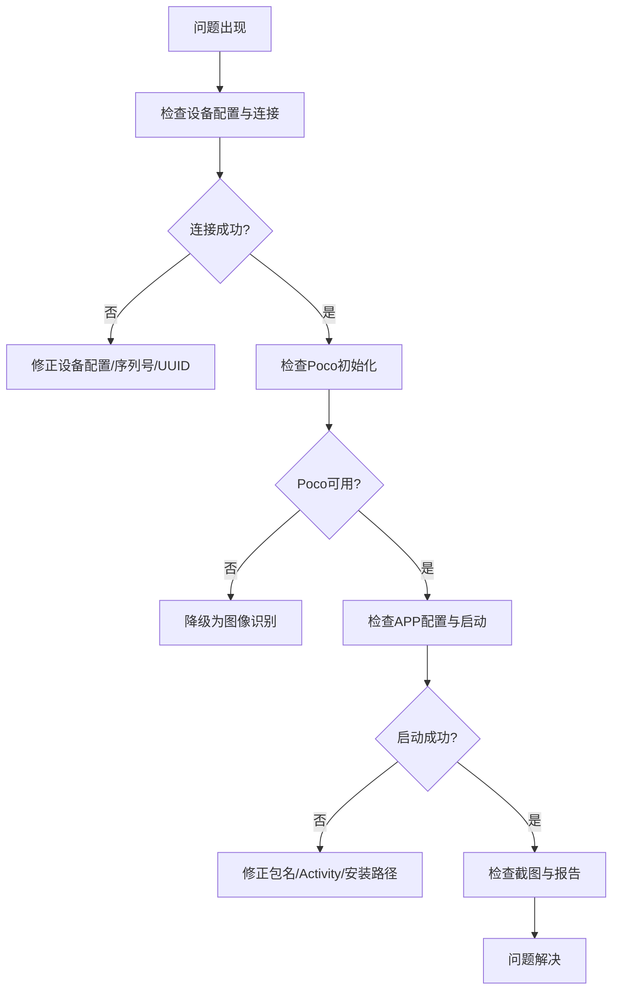

# 维护升级

<cite>
**本文引用的文件**
- [requirements.txt](file://requirements.txt)
- [pytest.ini](file://pytest.ini)
- [conftest.py](file://conftest.py)
- [config/config.yaml](file://config/config.yaml)
- [config/settings.py](file://config/settings.py)
- [base/driver_manager.py](file://base/driver_manager.py)
- [base/app_launcher.py](file://base/app_launcher.py)
- [utils/data_loader.py](file://utils/data_loader.py)
- [utils/logger.py](file://utils/logger.py)
- [utils/screenshot.py](file://utils/screenshot.py)
- [pages/android/home_page.py](file://pages/android/home_page.py)
- [pages/android/login_page.py](file://pages/android/login_page.py)
- [testcases/android/test_home.py](file://testcases/android/test_home.py)
- [data/test_data.yaml](file://data/test_data.yaml)
</cite>

## 目录
1. [简介](#简介)
2. [项目结构](#项目结构)
3. [核心组件](#核心组件)
4. [架构总览](#架构总览)
5. [详细组件分析](#详细组件分析)
6. [依赖分析](#依赖分析)
7. [性能考虑](#性能考虑)
8. [故障排查指南](#故障排查指南)
9. [结论](#结论)
10. [附录](#附录)

## 简介
本指南面向AirTestUI的维护与升级工作，围绕版本管理策略（语义化版本、发布周期、变更日志）、依赖升级最佳实践（airtest、pocoui、pytest等）、配置迁移方案（config.yaml新增/删除/修改）、回滚机制（版本回退、配置恢复、数据迁移）以及故障排查与应急响应进行系统化说明。文档同时提供架构视图、流程图与时序图，帮助不同技术背景的读者快速理解与落地。

## 项目结构
AirTestUI采用分层+特性混合的组织方式：
- 配置层：集中于config目录，提供环境变量覆盖与本地覆盖能力
- 基础设施层：base目录封装设备驱动与APP启停
- 工具层：utils目录提供日志、截图、数据加载等通用能力
- 页面对象层：pages目录按平台划分页面对象
- 测试用例层：testcases目录按平台划分用例
- 数据层：data目录存放测试数据
- 运行配置：requirements.txt、pytest.ini、conftest.py定义依赖与测试框架行为

图表来源
- [config/config.yaml:1-70](file://config/config.yaml#L1-L70)
- [config/settings.py:1-112](file://config/settings.py#L1-L112)
- [base/driver_manager.py:1-188](file://base/driver_manager.py#L1-L188)
- [base/app_launcher.py:1-127](file://base/app_launcher.py#L1-L127)
- [utils/data_loader.py:1-128](file://utils/data_loader.py#L1-L128)
- [utils/logger.py:1-59](file://utils/logger.py#L1-L59)
- [utils/screenshot.py:1-89](file://utils/screenshot.py#L1-L89)
- [pages/android/home_page.py:1-58](file://pages/android/home_page.py#L1-L58)
- [pages/android/login_page.py:1-107](file://pages/android/login_page.py#L1-L107)
- [testcases/android/test_home.py:1-48](file://testcases/android/test_home.py#L1-L48)
- [data/test_data.yaml:1-70](file://data/test_data.yaml#L1-L70)
- [requirements.txt:1-21](file://requirements.txt#L1-L21)
- [pytest.ini:1-47](file://pytest.ini#L1-L47)
- [conftest.py:1-255](file://conftest.py#L1-L255)

章节来源
- [requirements.txt:1-21](file://requirements.txt#L1-L21)
- [pytest.ini:1-47](file://pytest.ini#L1-L47)
- [conftest.py:1-255](file://conftest.py#L1-L255)
- [config/config.yaml:1-70](file://config/config.yaml#L1-L70)
- [config/settings.py:1-112](file://config/settings.py#L1-L112)

## 核心组件
- 配置系统：settings模块负责加载config.yaml，支持本地覆盖与环境变量覆盖；提供便捷访问函数（如获取环境、超时、设备与APP配置）
- 设备驱动管理：DriverManager单例管理设备池，支持多worker并发分配与复用，负责设备连接生命周期
- APP启停管理：AppLauncher负责按平台启动/关闭/重启/清除数据/安装，结合配置超时
- 日志系统：基于loguru，提供控制台与文件双通道，支持结构化输出与轮转
- 截图与报告：统一截图接口与Allure附件集成，失败自动截图
- 数据驱动：支持YAML/JSON/Excel，提供参数化数据加载
- 测试框架：pytest + xdist并行 + allure + rerunfailures，conftest集中fixture与hooks

章节来源
- [config/settings.py:1-112](file://config/settings.py#L1-L112)
- [base/driver_manager.py:1-188](file://base/driver_manager.py#L1-L188)
- [base/app_launcher.py:1-127](file://base/app_launcher.py#L1-L127)
- [utils/logger.py:1-59](file://utils/logger.py#L1-L59)
- [utils/screenshot.py:1-89](file://utils/screenshot.py#L1-L89)
- [utils/data_loader.py:1-128](file://utils/data_loader.py#L1-L128)
- [conftest.py:1-255](file://conftest.py#L1-L255)

## 架构总览
AirTestUI以“配置驱动 + 设备驱动 + 页面对象 + 测试用例”为主线，通过pytest生态实现并行执行与报告生成。整体交互如下：

图表来源
- [conftest.py:140-255](file://conftest.py#L140-L255)
- [base/driver_manager.py:119-187](file://base/driver_manager.py#L119-L187)
- [base/app_launcher.py:49-93](file://base/app_launcher.py#L49-L93)
- [utils/screenshot.py:55-74](file://utils/screenshot.py#L55-L74)
- [pytest.ini:11-22](file://pytest.ini#L11-L22)

## 详细组件分析

### 版本管理策略
- 语义化版本控制
  - 主版本号：破坏性变更（如airtest/poco重大API变更、配置结构重构）
  - 次版本号：新增功能或向后兼容的变更（如新增配置项、新增平台支持）
  - 修订号：修复与优化（如bug修复、性能改进、依赖升级）
- 发布周期
  - 建议采用“月度稳定版 + 紧急热修复”的节奏；稳定版在月末发布，热修复按需随时发布
- 变更日志维护
  - 采用Markdown格式，按版本分节，记录新增、删除、修改、修复、废弃等条目
  - 对破坏性变更提供迁移指引与兼容性说明
- 版本标签与分支
  - 使用语义化标签（vX.Y.Z），稳定版打tag并建立对应分支
  - 开发分支合并前需通过CI与冒烟测试

### 依赖升级最佳实践
- airtest/pocoui
  - 升级步骤
    - 在requirements.txt中提升最低版本要求，并在本地与Staging验证
    - 若存在API变更，更新conftest.py与base/driver_manager.py中设备连接与Poco初始化逻辑
    - 更新pages与testcases中对旧API的调用
  - 兼容性检查
    - 验证Android/iOS设备连接、Poco初始化、截图与日志输出
    - 运行冒烟用例与关键回归用例
- pytest系列
  - 升级步骤
    - 提升pytest与插件版本，确保pytest.ini与conftest.py无冲突
    - 验证并行执行(-n auto)、rerun、allure参数与报告生成
  - 兼容性检查
    - 检查markers、hooks、fixture生命周期与报告附件
- requests/Pillow/loguru/tenacity
  - 升级步骤
    - 逐个升级并运行单元测试与端到端用例
  - 兼容性检查
    - 检查网络请求、图片处理、日志输出、重试策略

章节来源
- [requirements.txt:1-21](file://requirements.txt#L1-L21)
- [pytest.ini:11-22](file://pytest.ini#L11-L22)
- [conftest.py:37-117](file://conftest.py#L37-L117)
- [base/driver_manager.py:103-118](file://base/driver_manager.py#L103-L118)
- [pages/android/login_page.py:186-208](file://pages/android/login_page.py#L186-L208)

### 配置迁移方案
- 新增配置项
  - 在config/config.yaml中添加新字段，并在config/settings.py中提供默认值与访问函数
  - 如需环境变量覆盖，遵循现有规则（AIRTESTUI_<大写键名>）
- 删除配置项
  - 逐步迁移至新字段，保留过渡期的兼容读取逻辑
  - 在变更日志中标注弃用与移除时间点
- 修改配置项
  - 保持向后兼容：读取旧键名的同时写入新键名，提示弃用警告
  - 在settings中提供兼容层，避免一次性破坏
- 本地覆盖
  - local_config.yaml用于本地开发覆盖，不在版本控制中，注意与主配置的合并顺序

图表来源
- [config/settings.py:34-81](file://config/settings.py#L34-L81)
- [config/config.yaml:1-70](file://config/config.yaml#L1-L70)

章节来源
- [config/config.yaml:1-70](file://config/config.yaml#L1-L70)
- [config/settings.py:20-81](file://config/settings.py#L20-L81)

### 回滚机制
- 版本回退
  - 通过版本标签与分支进行回退；回退前备份当前config与local_config
  - 回退后重新安装依赖（requirements.txt），确保airtest/poco/pytest版本与回退版本匹配
- 配置恢复
  - 从备份恢复config/config.yaml与config/local_config.yaml
  - 验证环境变量覆盖与本地覆盖生效
- 数据迁移
  - allure-results与reports目录为运行产物，回滚后可直接复用报告
  - logs目录为日志文件，回滚不影响历史日志
  - screenshots目录为截图文件，回滚不影响历史截图
- 回滚验证
  - 运行关键冒烟用例，验证设备连接、Poco初始化、APP启停、截图与报告生成

章节来源
- [config/config.yaml:1-70](file://config/config.yaml#L1-L70)
- [config/settings.py:42-48](file://config/settings.py#L42-L48)
- [utils/screenshot.py:17-25](file://utils/screenshot.py#L17-L25)
- [pytest.ini:14-18](file://pytest.ini#L14-L18)

### 依赖分析
- 直接依赖
  - pytest系列：pytest、xdist、html、allure、rerunfailures
  - airtest/poco：airtest、pocoui
  - 配置与数据：PyYAML、openpyxl
  - 工具：requests、Pillow、loguru、tenacity
- 间接依赖
  - airtest依赖底层设备驱动；pocoui依赖平台UI自动化引擎
  - allure依赖报告渲染；loguru依赖日志轮转
- 耦合关系
  - conftest.py耦合settings、driver_manager、app_launcher、utils
  - pages与base通过poco/Template交互
  - utils模块被多处引用，需谨慎变更

图表来源
- [requirements.txt:1-21](file://requirements.txt#L1-L21)
- [conftest.py:12-20](file://conftest.py#L12-L20)
- [utils/data_loader.py:8-10](file://utils/data_loader.py#L8-L10)
- [utils/logger.py:7-9](file://utils/logger.py#L7-L9)
- [utils/screenshot.py:9-12](file://utils/screenshot.py#L9-L12)
- [base/driver_manager.py:6-14](file://base/driver_manager.py#L6-L14)
- [base/app_launcher.py:5-12](file://base/app_launcher.py#L5-L12)
- [pages/android/home_page.py:6-9](file://pages/android/home_page.py#L6-L9)

章节来源
- [requirements.txt:1-21](file://requirements.txt#L1-L21)
- [conftest.py:1-255](file://conftest.py#L1-L255)

### 性能考虑
- 并行执行
  - 使用pytest-xdist的-n auto与--dist=loadfile，合理分配worker与设备，避免设备争用
- 超时与重试
  - 合理设置元素等待、页面加载、APP启动超时；重试次数与间隔需平衡稳定性与执行时长
- 截图与报告
  - on_step开关用于调试，生产环境建议关闭；Allure与HTML报告生成会增加IO开销
- 日志级别
  - 控制台INFO、文件DEBUG，避免过多DEBUG日志影响性能

章节来源
- [pytest.ini:11-22](file://pytest.ini#L11-L22)
- [config/config.yaml:8-28](file://config/config.yaml#L8-L28)
- [utils/logger.py:16-47](file://utils/logger.py#L16-L47)

### 故障排查指南
- 设备连接失败
  - 检查config/config.yaml中的设备序列号/UUID与名称；确认DriverManager连接URI构造
  - 查看日志与错误堆栈，必要时降低并行度或限制设备数
- Poco初始化失败
  - 检查airtest与pocoui版本兼容性；若Poco不可用，系统降级为图像识别模式
- APP启动失败
  - 检查包名/Bundle ID、Activity、安装路径；查看AppLauncher日志与超时配置
- 截图失败
  - 检查截图目录权限与磁盘空间；确认snapshot调用与Allure附件写入
- 报告缺失
  - 检查--alluredir与--html参数；确认pytest.ini与conftest.py配置一致
- 数据加载异常
  - 检查data目录下文件路径与格式；确认YAML/JSON/Excel解析逻辑

图表来源
- [base/driver_manager.py:103-118](file://base/driver_manager.py#L103-L118)
- [base/app_launcher.py:49-74](file://base/app_launcher.py#L49-L74)
- [utils/screenshot.py:28-53](file://utils/screenshot.py#L28-L53)
- [conftest.py:186-208](file://conftest.py#L186-L208)

章节来源
- [base/driver_manager.py:103-118](file://base/driver_manager.py#L103-L118)
- [base/app_launcher.py:49-74](file://base/app_launcher.py#L49-L74)
- [utils/screenshot.py:28-53](file://utils/screenshot.py#L28-L53)
- [conftest.py:186-208](file://conftest.py#L186-L208)

## 结论
通过规范的版本管理、严格的依赖升级流程、完善的配置迁移与回滚机制，以及系统化的故障排查与应急响应，AirTestUI能够在持续演进中保持稳定性与可维护性。建议在每次升级前制定升级清单与回滚计划，并在Staging充分验证后再推进到生产。

## 附录
- 关键配置项速览
  - 运行环境：env
  - 超时：timeout.element_wait/page_load/app_launch
  - 截图：screenshot.on_failure/on_step/save_dir
  - 重试：retry.max_attempts/wait_between
  - 报告：report.allure_dir/html_file
  - 通知：notification.enabled/type/dingtalk/email
  - Android设备与APP：android.devices[].serial/name, android.app.package/activity/install_path
  - iOS设备与APP：ios.devices[].uuid/name, ios.app.bundle_id/install_path
- 常用访问函数
  - settings.get_env()/get_timeout()/get_android_devices()/get_ios_devices()/get_android_app()/get_ios_app()

章节来源
- [config/config.yaml:5-70](file://config/config.yaml#L5-L70)
- [config/settings.py:84-112](file://config/settings.py#L84-L112)