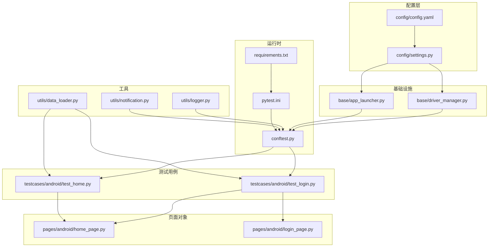
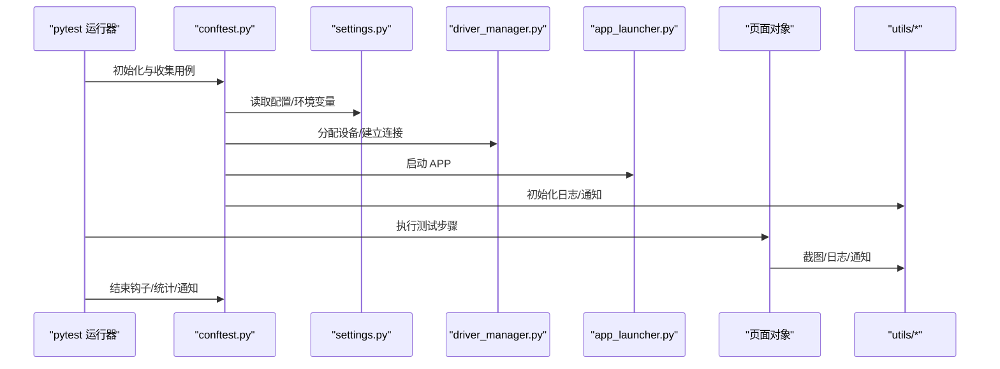
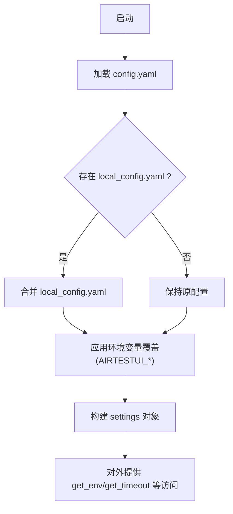
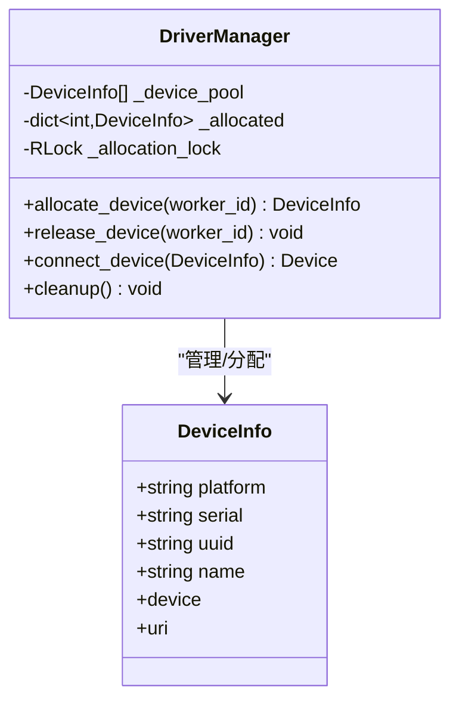
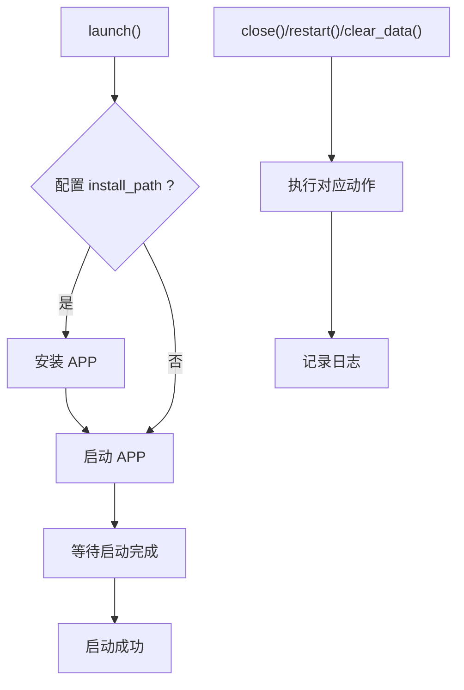
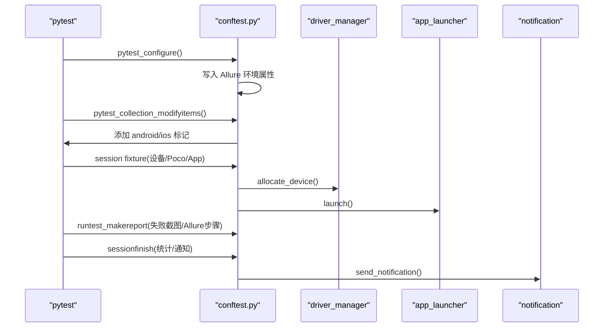
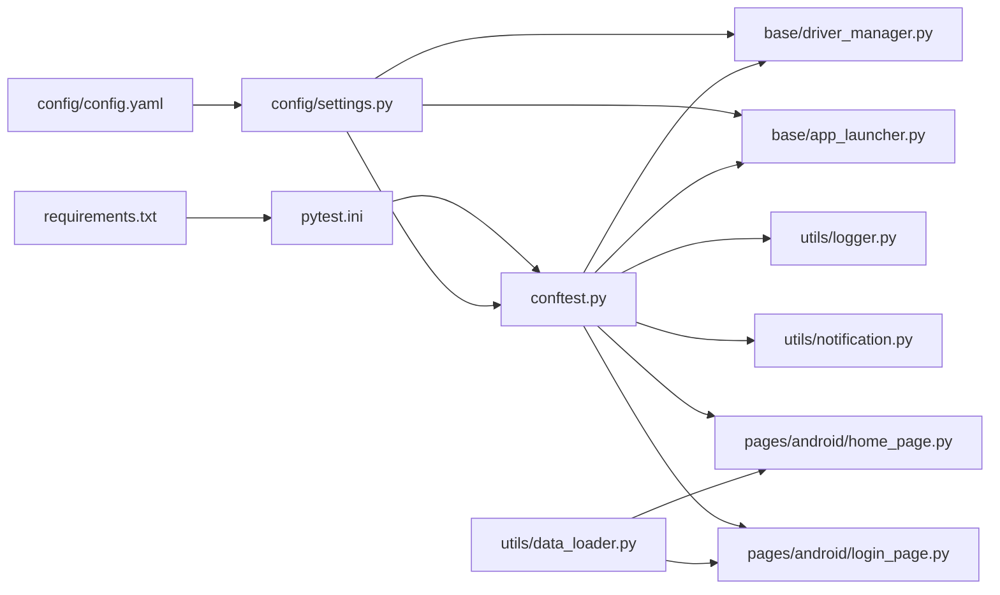

# 部署与运维

<cite>
**本文引用的文件**
- [requirements.txt](file://requirements.txt)
- [pytest.ini](file://pytest.ini)
- [config/config.yaml](file://config/config.yaml)
- [config/settings.py](file://config/settings.py)
- [conftest.py](file://conftest.py)
- [utils/logger.py](file://utils/logger.py)
- [utils/notification.py](file://utils/notification.py)
- [base/driver_manager.py](file://base/driver_manager.py)
- [base/app_launcher.py](file://base/app_launcher.py)
- [utils/data_loader.py](file://utils/data_loader.py)
- [pages/android/home_page.py](file://pages/android/home_page.py)
- [pages/android/login_page.py](file://pages/android/login_page.py)
- [testcases/android/test_login.py](file://testcases/android/test_login.py)
- [testcases/android/test_home.py](file://testcases/android/test_home.py)
</cite>

## 目录
1. [简介](#简介)
2. [项目结构](#项目结构)
3. [核心组件](#核心组件)
4. [架构总览](#架构总览)
5. [详细组件分析](#详细组件分析)
6. [依赖关系分析](#依赖关系分析)
7. [性能考虑](#性能考虑)
8. [运维监控配置](#运维监控配置)
9. [CI/CD 集成方案](#cicd-集成方案)
10. [版本管理与升级策略](#版本管理与升级策略)
11. [故障排查指南](#故障排查指南)
12. [结论](#结论)

## 简介
本指南面向 AirTestUI 的部署与运维团队，围绕以下目标展开：
- CI/CD 集成方案：覆盖 Jenkins、GitLab CI 等主流平台的流水线设计与优化建议
- 生产环境部署策略：依赖管理、环境配置、服务监控与可观测性
- 运维监控配置：日志收集、性能监控、告警设置
- 版本管理与升级策略：向后兼容性、迁移与回滚机制
- 常见运维问题排查与解决

AirTestUI 基于 pytest + Airtest + Poco，采用配置驱动与多设备并发执行，结合 Allure 报告与钉钉/邮件通知，形成可扩展的移动端自动化测试体系。

## 项目结构
项目采用“分层+特性”混合组织方式：
- config：全局配置与环境变量覆盖
- base：设备驱动与应用启停管理
- pages：页面对象（Android/iOS）
- testcases：测试用例（Android/iOS）
- utils：工具模块（日志、通知、数据加载等）
- resources：资源文件（图像模板等）

图表来源
- [config/config.yaml:1-70](file://config/config.yaml#L1-L70)
- [config/settings.py:1-112](file://config/settings.py#L1-L112)
- [base/driver_manager.py:1-188](file://base/driver_manager.py#L1-L188)
- [base/app_launcher.py:1-127](file://base/app_launcher.py#L1-L127)
- [pages/android/home_page.py:1-58](file://pages/android/home_page.py#L1-L58)
- [pages/android/login_page.py:1-107](file://pages/android/login_page.py#L1-L107)
- [testcases/android/test_login.py:1-71](file://testcases/android/test_login.py#L1-L71)
- [testcases/android/test_home.py:1-48](file://testcases/android/test_home.py#L1-L48)
- [utils/logger.py:1-59](file://utils/logger.py#L1-L59)
- [utils/notification.py:1-167](file://utils/notification.py#L1-L167)
- [utils/data_loader.py:1-128](file://utils/data_loader.py#L1-L128)
- [conftest.py:1-255](file://conftest.py#L1-L255)
- [pytest.ini:1-47](file://pytest.ini#L1-L47)
- [requirements.txt:1-21](file://requirements.txt#L1-L21)

章节来源
- [pytest.ini:1-47](file://pytest.ini#L1-L47)
- [requirements.txt:1-21](file://requirements.txt#L1-L21)

## 核心组件
- 配置系统：集中式 YAML + 环境变量覆盖 + 本地覆盖文件，统一暴露为 settings 对象
- 设备驱动管理：多设备并发分配、连接与生命周期管理
- 应用启停管理：跨平台 APP 启动/关闭/重启/安装/数据清理
- 日志系统：结构化日志、文件轮转、多级别输出
- 通知系统：钉钉机器人/邮件通知，测试结果汇总
- 数据加载：YAML/JSON/Excel 多格式数据驱动
- pytest 钩子与夹具：Allure 环境注入、失败截图、结果统计、设备分配、Poco 初始化、数据装载

章节来源
- [config/config.yaml:1-70](file://config/config.yaml#L1-L70)
- [config/settings.py:1-112](file://config/settings.py#L1-L112)
- [base/driver_manager.py:1-188](file://base/driver_manager.py#L1-L188)
- [base/app_launcher.py:1-127](file://base/app_launcher.py#L1-L127)
- [utils/logger.py:1-59](file://utils/logger.py#L1-L59)
- [utils/notification.py:1-167](file://utils/notification.py#L1-L167)
- [utils/data_loader.py:1-128](file://utils/data_loader.py#L1-L128)
- [conftest.py:1-255](file://conftest.py#L1-L255)

## 架构总览
AirTestUI 的运行时由 pytest 驱动，通过 conftest 注入设备、Poco、应用启停、数据与通知；配置由 settings 提供，日志与通知贯穿全链路。

图表来源
- [conftest.py:1-255](file://conftest.py#L1-L255)
- [config/settings.py:1-112](file://config/settings.py#L1-L112)
- [base/driver_manager.py:1-188](file://base/driver_manager.py#L1-L188)
- [base/app_launcher.py:1-127](file://base/app_launcher.py#L1-L127)
- [utils/logger.py:1-59](file://utils/logger.py#L1-L59)
- [utils/notification.py:1-167](file://utils/notification.py#L1-L167)

## 详细组件分析

### 配置系统（config/settings）
- 支持 config.yaml 主配置 + local_config.yaml 本地覆盖 + 环境变量覆盖（前缀 AIRTESTUI_）
- 暴露便捷访问函数：环境、超时、设备列表、APP 配置
- 适用于不同环境（dev/staging/production）与 CI 变量注入

图表来源
- [config/config.yaml:1-70](file://config/config.yaml#L1-L70)
- [config/settings.py:1-112](file://config/settings.py#L1-L112)

章节来源
- [config/config.yaml:1-70](file://config/config.yaml#L1-L70)
- [config/settings.py:1-112](file://config/settings.py#L1-L112)

### 设备驱动管理（driver_manager）
- 单例模式，线程安全地维护设备池与分配状态
- 支持 Android/iOS 设备，按 worker_id 分配或复用
- 连接失败时记录错误并抛出异常，便于上层处理

图表来源
- [base/driver_manager.py:1-188](file://base/driver_manager.py#L1-L188)

章节来源
- [base/driver_manager.py:1-188](file://base/driver_manager.py#L1-L188)

### 应用启停管理（app_launcher）
- 跨平台启动/关闭/重启/安装/清理数据
- 自动等待与超时控制，异常时记录并抛出
- 与配置联动，支持按需安装与 Activity 启动

图表来源
- [base/app_launcher.py:1-127](file://base/app_launcher.py#L1-L127)

章节来源
- [base/app_launcher.py:1-127](file://base/app_launcher.py#L1-L127)

### 日志系统（logger）
- 控制台彩色输出 + 全量/错误日志文件轮转（大小+时间+压缩+保留期）
- 通过绑定模块名实现结构化日志，便于检索与聚合

章节来源
- [utils/logger.py:1-59](file://utils/logger.py#L1-L59)

### 通知系统（notification）
- 支持钉钉机器人与邮件两种方式
- 支持签名 URL（钉钉）与 SSL SMTP
- 生成测试报告摘要并发送

章节来源
- [utils/notification.py:1-167](file://utils/notification.py#L1-L167)

### 数据加载（data_loader）
- 支持 YAML/JSON/Excel，提供 parametrize_data 适配 pytest 参数化
- 统一数据目录与路径解析

章节来源
- [utils/data_loader.py:1-128](file://utils/data_loader.py#L1-L128)

### pytest 钩子与夹具（conftest）
- 初始化 Allure 环境信息（环境、平台、框架）
- 自动标记平台（android/ios），失败截图并附加到 Allure
- 设备分配与 Poco 初始化，APP 生命周期管理
- 测试结果统计与通知发送

图表来源
- [conftest.py:1-255](file://conftest.py#L1-L255)
- [base/driver_manager.py:1-188](file://base/driver_manager.py#L1-L188)
- [base/app_launcher.py:1-127](file://base/app_launcher.py#L1-L127)
- [utils/notification.py:1-167](file://utils/notification.py#L1-L167)

章节来源
- [conftest.py:1-255](file://conftest.py#L1-L255)

## 依赖关系分析
- 运行时依赖集中在 requirements.txt，涵盖 pytest 生态、Airtest/Poco、YAML/Excel、日志与重试等
- pytest.ini 控制测试发现、并行、报告与日志输出
- 配置与工具模块被 conftest 与各页面对象广泛依赖

图表来源
- [requirements.txt:1-21](file://requirements.txt#L1-L21)
- [pytest.ini:1-47](file://pytest.ini#L1-L47)
- [config/config.yaml:1-70](file://config/config.yaml#L1-L70)
- [config/settings.py:1-112](file://config/settings.py#L1-L112)
- [conftest.py:1-255](file://conftest.py#L1-L255)
- [base/driver_manager.py:1-188](file://base/driver_manager.py#L1-L188)
- [base/app_launcher.py:1-127](file://base/app_launcher.py#L1-L127)
- [utils/logger.py:1-59](file://utils/logger.py#L1-L59)
- [utils/notification.py:1-167](file://utils/notification.py#L1-L167)
- [utils/data_loader.py:1-128](file://utils/data_loader.py#L1-L128)
- [pages/android/home_page.py:1-58](file://pages/android/home_page.py#L1-L58)
- [pages/android/login_page.py:1-107](file://pages/android/login_page.py#L1-L107)

章节来源
- [requirements.txt:1-21](file://requirements.txt#L1-L21)
- [pytest.ini:1-47](file://pytest.ini#L1-L47)

## 性能考虑
- 并行执行：pytest.ini 使用 xdist 并行与按文件分发，提升吞吐
- 超时与重试：配置层提供元素等待、页面加载、APP 启动超时与失败重试
- 截图与报告：按需开启失败截图，避免过度 IO；Allure 报告清理与自包含 HTML
- 日志轮转：按大小与时间轮转，减少磁盘占用

章节来源
- [pytest.ini:1-47](file://pytest.ini#L1-L47)
- [config/config.yaml:1-70](file://config/config.yaml#L1-L70)
- [utils/logger.py:1-59](file://utils/logger.py#L1-L59)

## 运维监控配置
- 日志
  - 控制台：INFO 级别，彩色输出
  - 文件：全量 DEBUG 与错误 ERROR 分离，按 20MB 轮转、保留策略与压缩
  - 建议：接入集中式日志系统（如 ELK/Splunk），按模块名过滤
- 告警
  - 通知：钉钉机器人/邮件，支持签名 URL 与 SSL
  - 建议：失败率阈值、超时告警、设备连接失败告警
- 监控
  - 建议：采集测试时长、用例通过率、设备利用率、报告生成耗时等指标
  - 可结合 Allure 服务器与测试结果存储进行可视化

章节来源
- [utils/logger.py:1-59](file://utils/logger.py#L1-L59)
- [utils/notification.py:1-167](file://utils/notification.py#L1-L167)
- [conftest.py:1-255](file://conftest.py#L1-L255)

## CI/CD 集成方案

### Jenkins
- 推荐插件
  - Allure Jenkins Plugin、Slack Notification、JUnit Attachments
- 流水线要点
  - 环境变量注入：通过环境变量覆盖 config.yaml（前缀 AIRTESTUI_）
  - 并行执行：利用 pytest-xdist 与 --dist=loadfile
  - 报告与附件：Allure 报告目录与 HTML 报告路径
  - 通知：在流水线阶段末尾触发通知
- 示例步骤（概念性）
  - 安装依赖与环境准备
  - 执行 pytest（含并行与重试）
  - 生成 Allure 报告并发布
  - 发送通知（钉钉/邮件）

### GitLab CI
- .gitlab-ci.yml 建议结构
  - stages: install, test, report, notify
  - 使用缓存 pip 与依赖
  - 并行矩阵：按平台（android/ios）与设备维度
  - Allure 报告 artifacts 与通知
- 环境变量
  - 通过 CI 环境变量覆盖 settings（如 AIRTESTUI_ENV、设备串号/UUID）
- 重试与稳定性
  - 利用 reruns/reruns-delay 与设备复用策略

### GitHub Actions
- 工作流建议
  - 使用 actions/cache 缓存依赖
  - 并行作业矩阵（平台/设备）
  - Allure 报告与测试结果归档
  - 通知集成（Webhook/邮件）

### 通用优化建议
- 依赖锁定：使用 requirements.txt 或 lock 文件
- 设备池管理：在 CI 中动态注册设备，避免冲突
- 报告与附件：Allure 与 HTML 报告持久化
- 失败重试：结合 --reruns 与 --reruns-delay
- 日志与告警：统一输出与集中化收集

## 版本管理与升级策略
- 向后兼容
  - 配置字段变更：保留旧字段并在加载时映射或提供默认值
  - API 变更：在 settings 与夹具中提供兼容层
- 迁移指南
  - 升级前备份 config.yaml 与 local_config.yaml
  - 逐步替换环境变量覆盖项，验证 Allure 报告与通知
- 回滚机制
  - 依赖回滚：锁定 requirements.txt 版本
  - 配置回滚：保留历史配置快照
  - 通知与日志：确保回滚后仍可接收告警与查看日志

## 故障排查指南
- 设备连接失败
  - 检查设备序列号/UUID 与配置一致性
  - 查看日志中连接失败记录，确认权限与端口
- APP 启动失败
  - 校验包名/Bundle ID、Activity 与安装路径
  - 检查启动超时配置与设备性能
- 失败截图未生成
  - 确认失败时自动截图逻辑与 Allure 附件写入
- 通知未送达
  - 校验钉钉 Webhook/签名或邮件 SMTP 配置
- 并行冲突
  - 检查设备池大小与 worker 数量，必要时降低并行度或增加设备
- 日志过大
  - 调整轮转大小与保留期，或切换到集中式日志系统

章节来源
- [base/driver_manager.py:1-188](file://base/driver_manager.py#L1-L188)
- [base/app_launcher.py:1-127](file://base/app_launcher.py#L1-L127)
- [utils/notification.py:1-167](file://utils/notification.py#L1-L167)
- [utils/logger.py:1-59](file://utils/logger.py#L1-L59)
- [conftest.py:1-255](file://conftest.py#L1-L255)

## 结论
AirTestUI 的部署与运维以“配置驱动 + pytest 钩子 + 多设备并发”为核心，结合 Allure 报告与通知系统，形成可扩展、可观测的移动端自动化测试体系。通过合理的 CI/CD 集成、日志与告警配置、版本管理与回滚策略，可在生产环境中稳定运行并持续迭代。