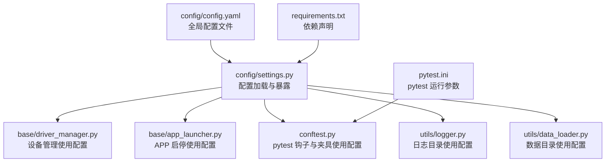
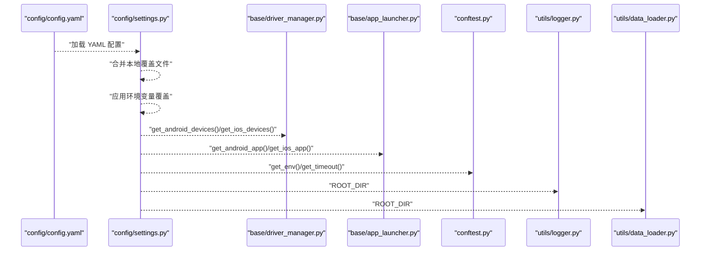
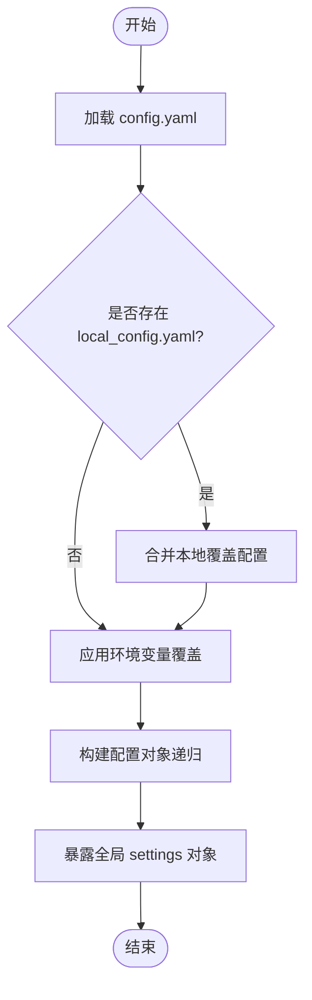
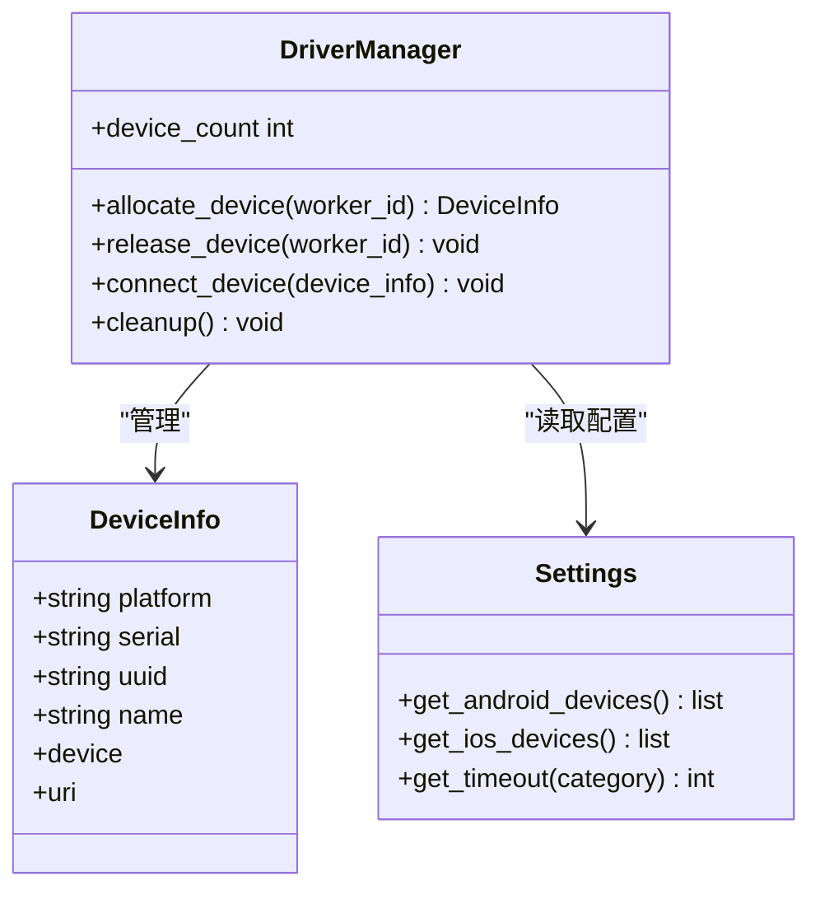
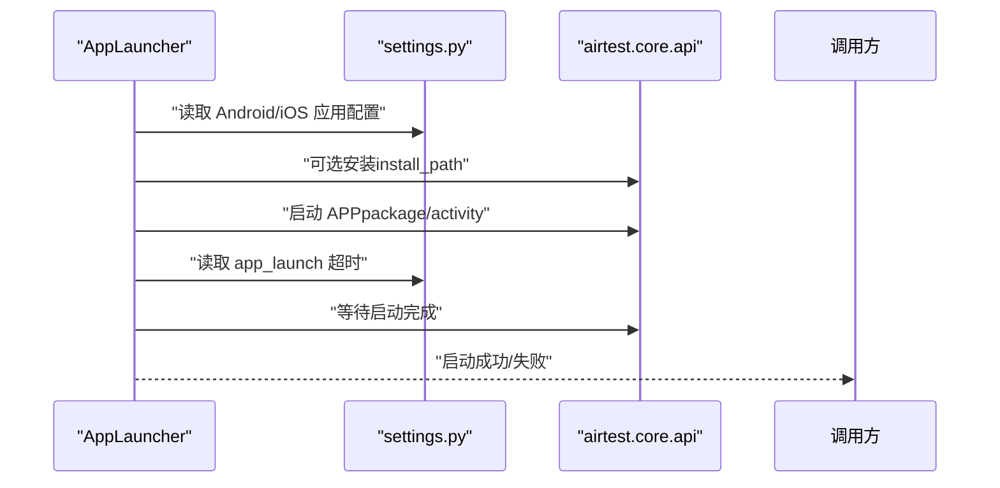
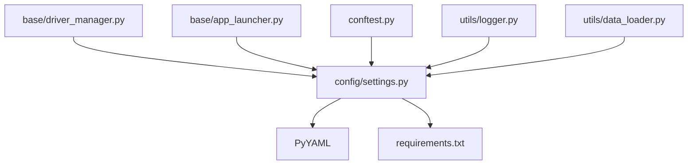

# 配置管理

<cite>
**本文引用的文件**
- [config.yaml](file://config/config.yaml)
- [settings.py](file://config/settings.py)
- [conftest.py](file://conftest.py)
- [pytest.ini](file://pytest.ini)
- [driver_manager.py](file://base/driver_manager.py)
- [app_launcher.py](file://base/app_launcher.py)
- [logger.py](file://utils/logger.py)
- [data_loader.py](file://utils/data_loader.py)
- [requirements.txt](file://requirements.txt)
</cite>

## 目录
1. [简介](#简介)
2. [项目结构](#项目结构)
3. [核心组件](#核心组件)
4. [架构总览](#架构总览)
5. [详细组件分析](#详细组件分析)
6. [依赖分析](#依赖分析)
7. [性能考虑](#性能考虑)
8. [故障排查指南](#故障排查指南)
9. [结论](#结论)
10. [附录](#附录)

## 简介
本文件系统性阐述 AirTestUI 的配置管理体系，重点围绕以下目标展开：
- 深入解析 config.yaml 的结构与参数语义，涵盖设备配置、应用设置、测试环境参数等。
- 详解 settings.py 如何加载与管理配置，包括默认值、环境变量覆盖、本地覆盖文件合并、便捷访问接口等。
- 提供多场景配置示例：单设备测试、多设备并发、CI/CD 环境等。
- 总结配置最佳实践与常见错误排查方法，帮助团队快速落地与稳定运行。

## 项目结构
AirTestUI 的配置体系由“配置文件 + 配置加载器 + 使用方”三层组成：
- 配置文件：config/config.yaml 提供全局配置项。
- 配置加载器：config/settings.py 负责加载、合并、暴露配置。
- 使用方：各业务模块（如设备管理、APP 启停、日志、数据加载）通过 settings.py 获取所需配置。

图表来源
- [config/config.yaml:1-70](file://config/config.yaml#L1-L70)
- [config/settings.py:1-112](file://config/settings.py#L1-L112)
- [base/driver_manager.py:1-188](file://base/driver_manager.py#L1-L188)
- [base/app_launcher.py:1-127](file://base/app_launcher.py#L1-L127)
- [conftest.py:1-255](file://conftest.py#L1-L255)
- [utils/logger.py:1-59](file://utils/logger.py#L1-L59)
- [utils/data_loader.py:1-128](file://utils/data_loader.py#L1-L128)
- [pytest.ini:1-47](file://pytest.ini#L1-L47)
- [requirements.txt:1-21](file://requirements.txt#L1-L21)

章节来源
- [config/config.yaml:1-70](file://config/config.yaml#L1-L70)
- [config/settings.py:1-112](file://config/settings.py#L1-L112)
- [conftest.py:1-255](file://conftest.py#L1-L255)
- [pytest.ini:1-47](file://pytest.ini#L1-L47)

## 核心组件
- 配置文件 config.yaml：集中定义运行环境、超时、截图、重试、报告、通知、Android/iOS 设备与应用等配置。
- 配置加载器 settings.py：负责加载 YAML、合并本地覆盖、应用环境变量覆盖、构建可访问的配置对象，并提供便捷查询函数。
- 使用方模块：设备管理、APP 启停、pytest 钩子与夹具、日志与数据加载等均通过 settings.py 获取配置。

章节来源
- [config/config.yaml:1-70](file://config/config.yaml#L1-L70)
- [config/settings.py:1-112](file://config/settings.py#L1-L112)
- [base/driver_manager.py:1-188](file://base/driver_manager.py#L1-L188)
- [base/app_launcher.py:1-127](file://base/app_launcher.py#L1-L127)
- [conftest.py:1-255](file://conftest.py#L1-L255)
- [utils/logger.py:1-59](file://utils/logger.py#L1-L59)
- [utils/data_loader.py:1-128](file://utils/data_loader.py#L1-L128)

## 架构总览
配置加载与使用的端到端流程如下：
- settings.py 读取 config.yaml，支持本地覆盖文件合并与环境变量覆盖。
- 将原始配置转换为可访问的配置对象，提供 get/env/timeout 等便捷接口。
- 各模块通过 settings.py 获取配置，驱动设备连接、APP 启停、日志与报告等行为。

图表来源
- [config/config.yaml:1-70](file://config/config.yaml#L1-L70)
- [config/settings.py:1-112](file://config/settings.py#L1-L112)
- [base/driver_manager.py:1-188](file://base/driver_manager.py#L1-L188)
- [base/app_launcher.py:1-127](file://base/app_launcher.py#L1-L127)
- [conftest.py:1-255](file://conftest.py#L1-L255)
- [utils/logger.py:1-59](file://utils/logger.py#L1-L59)
- [utils/data_loader.py:1-128](file://utils/data_loader.py#L1-L128)

## 详细组件分析

### 配置文件 config.yaml 结构与参数说明
- 运行环境 env：当前运行环境枚举（dev/staging/production），用于报告与日志环境标注。
- 超时配置 timeout：
  - element_wait：元素等待超时（秒）
  - page_load：页面加载超时（秒）
  - app_launch：APP 启动超时（秒）
- 截图配置 screenshot：
  - on_failure：失败时自动截图
  - on_step：每步操作截图（调试用）
  - save_dir：截图保存目录
- 重试配置 retry：
  - max_attempts：失败重试次数
  - wait_between：重试间隔（秒）
- 报告配置 report：
  - allure_dir：Allure 结果目录
  - html_file：HTML 报告输出路径
- 通知配置 notification：
  - enabled：是否启用通知
  - type：通知类型（dingtalk/email）
  - dingtalk：钉钉通知配置（webhook/secret）
  - email：邮件通知配置（smtp_host/port/sender/password/receivers）
- Android 配置 android：
  - devices：设备列表，每台设备包含 serial（序列号）、name（设备别名）
  - app：应用配置，包含 package（包名）、activity（启动 Activity）、install_path（APK 安装路径）
- iOS 配置 ios：
  - devices：设备列表，每台设备包含 uuid（设备 UUID，auto 表示自动检测）、name（设备别名）
  - app：应用配置，包含 bundle_id（Bundle ID）、install_path（IPA 安装路径）

章节来源
- [config/config.yaml:1-70](file://config/config.yaml#L1-L70)

### settings.py 配置加载与管理机制
- 根目录定位：通过相对路径定位 config/config.yaml。
- YAML 加载：使用安全解析，避免任意代码注入。
- 本地覆盖文件：若存在 config/local_config.yaml，则与主配置合并，后者优先覆盖前者。
- 环境变量覆盖：以 AIRTESTUI_ 前缀的环境变量覆盖 config.yaml 的顶层键（键名转为小写）。
- 配置对象化：将字典递归包装为可访问对象，支持属性与字典两种访问方式。
- 便捷接口：
  - get_env()：获取当前运行环境
  - get_timeout(category)：按类别获取超时配置
  - get_android_devices()/get_ios_devices()：获取设备列表
  - get_android_app()/get_ios_app()：获取应用配置

图表来源
- [config/settings.py:1-112](file://config/settings.py#L1-L112)

章节来源
- [config/settings.py:1-112](file://config/settings.py#L1-L112)

### 设备管理与配置联动
- 设备池初始化：从 settings 中读取 Android/iOS 设备列表，构造 DeviceInfo 并加入设备池。
- 设备分配：按 worker_id 顺序分配设备；若设备不足，采用循环复用策略。
- 连接与断开：连接成功后缓存设备实例；会话结束时释放设备。
- 超时与等待：设备连接与 APP 启动过程遵循 settings 的超时配置。

图表来源
- [base/driver_manager.py:1-188](file://base/driver_manager.py#L1-L188)
- [config/settings.py:1-112](file://config/settings.py#L1-L112)

章节来源
- [base/driver_manager.py:1-188](file://base/driver_manager.py#L1-L188)
- [config/settings.py:1-112](file://config/settings.py#L1-L112)

### APP 启停与配置联动
- 应用配置读取：根据平台读取 Android/iOS 应用配置（包名/Bundle ID、Activity、安装路径）。
- 启动逻辑：可选安装、启动 APP、等待启动完成；启动超时来自 settings。
- 关闭与重启：提供关闭与重启能力，便于用例间隔离。
- 数据清理：Android 平台支持清除应用数据。

图表来源
- [base/app_launcher.py:1-127](file://base/app_launcher.py#L1-L127)
- [config/settings.py:1-112](file://config/settings.py#L1-L112)

章节来源
- [base/app_launcher.py:1-127](file://base/app_launcher.py#L1-L127)
- [config/settings.py:1-112](file://config/settings.py#L1-L112)

### pytest 集成与配置联动
- 环境信息注入：在 Allure 环境属性中写入 Environment、Platform、Framework 等信息。
- 平台标记：根据用例路径自动标记 android/ios。
- 失败截图与通知：失败时自动截图并附加到 Allure，同时按配置发送通知。
- 多设备并发：通过 worker_id 与设备池实现多设备并发执行。
- 重试与 reruns：结合 pytest.ini 的重试参数与 settings 的 retry 配置协同工作。

章节来源
- [conftest.py:1-255](file://conftest.py#L1-L255)
- [pytest.ini:1-47](file://pytest.ini#L1-L47)

### 日志与数据加载对配置的使用
- 日志目录：使用 settings.ROOT_DIR 构建日志目录，确保日志落盘路径一致。
- 数据目录：使用 settings.ROOT_DIR 构建 data 目录，统一测试数据加载路径。

章节来源
- [utils/logger.py:1-59](file://utils/logger.py#L1-L59)
- [utils/data_loader.py:1-128](file://utils/data_loader.py#L1-L128)
- [config/settings.py:1-112](file://config/settings.py#L1-L112)

## 依赖分析
- 配置文件依赖 PyYAML 进行安全解析。
- 运行时依赖 pytest、pytest-xdist、allure-pytest、airtest、pocoui 等框架与工具。
- 配置加载器对环境变量与本地覆盖文件的处理，确保了灵活的部署与覆盖能力。

图表来源
- [config/settings.py:1-112](file://config/settings.py#L1-L112)
- [requirements.txt:1-21](file://requirements.txt#L1-L21)
- [base/driver_manager.py:1-188](file://base/driver_manager.py#L1-L188)
- [base/app_launcher.py:1-127](file://base/app_launcher.py#L1-L127)
- [conftest.py:1-255](file://conftest.py#L1-L255)
- [utils/logger.py:1-59](file://utils/logger.py#L1-L59)
- [utils/data_loader.py:1-128](file://utils/data_loader.py#L1-L128)

章节来源
- [requirements.txt:1-21](file://requirements.txt#L1-L21)
- [config/settings.py:1-112](file://config/settings.py#L1-L112)

## 性能考虑
- 配置加载仅在进程启动时进行一次，后续通过全局对象访问，避免重复 IO。
- 本地覆盖与环境变量覆盖在加载阶段一次性完成，减少运行时判断成本。
- 多设备并发场景下，设备连接与 APP 启动遵循超时配置，避免长时间阻塞。
- 建议在 CI/CD 环境中通过环境变量覆盖关键参数，避免频繁修改主配置文件。

## 故障排查指南
- 配置文件加载失败
  - 检查 config/config.yaml 语法与编码，确保为 UTF-8。
  - 确认 AIRTESTUI_CONFIG_PATH 环境变量指向正确路径（如需要）。
- 环境变量覆盖无效
  - 确保环境变量名以 AIRTESTUI_ 开头，且键名为 config.yaml 顶层键的小写形式。
  - 注意本地覆盖文件的存在会覆盖环境变量覆盖，必要时删除或调整。
- 设备连接失败
  - 检查 Android/iOS 设备配置（serial/uuid/name）是否正确。
  - 确认设备已连接且可被 adb/idevice 支持的工具识别。
- APP 启动失败
  - 检查包名/Bundle ID、Activity、安装路径配置是否正确。
  - 调整 app_launch 超时时间，确保足够长以容纳冷启动。
- 截图与报告问题
  - 检查 screenshot.save_dir 与 report.allure_dir/html_file 的目录权限与路径。
  - 确认 Allure 插件与 pytest-html 插件版本兼容。
- 通知配置问题
  - 检查 notification.enabled 与通知类型配置（dingtalk/email）是否启用。
  - 确认网络连通性与凭据正确性。

章节来源
- [config/config.yaml:1-70](file://config/config.yaml#L1-L70)
- [config/settings.py:1-112](file://config/settings.py#L1-L112)
- [base/driver_manager.py:1-188](file://base/driver_manager.py#L1-L188)
- [base/app_launcher.py:1-127](file://base/app_launcher.py#L1-L127)
- [conftest.py:1-255](file://conftest.py#L1-L255)

## 结论
AirTestUI 的配置管理以 config.yaml 为核心，配合 settings.py 的加载、合并与暴露机制，实现了灵活、可维护、可扩展的配置体系。通过环境变量与本地覆盖文件，满足多环境部署需求；通过便捷接口与 pytest 集成，使配置贯穿测试生命周期。建议在团队内统一配置规范与覆盖策略，持续优化超时与重试参数，提升稳定性与效率。

## 附录

### 不同场景下的配置示例与最佳实践
- 单设备测试
  - 在 devices 列表中仅保留一台设备，确保 serial/uuid 与 name 正确。
  - 适当降低 screenshot.on_step 与 retry.max_attempts，减少资源消耗。
- 多设备并发
  - 在 devices 列表中配置多台设备，确保每台设备唯一标识。
  - 使用 pytest-xdist 的 -n auto 或指定 worker 数量，结合 driver_manager 的循环复用策略。
  - 为每台设备配置独立的 name，便于报告与日志识别。
- CI/CD 环境
  - 通过环境变量覆盖关键参数（如 env、screenshot.save_dir、report.allure_dir/html_file）。
  - 使用 local_config.yaml 存放敏感信息（如通知凭据），并将其加入 .gitignore。
  - 在流水线中预装设备驱动与 APP，缩短启动与安装时间。
- 跨平台测试
  - 同时配置 android 与 ios 的 devices 与 app，确保包名/Bundle ID 与安装路径正确。
  - 为不同平台设置不同的超时与重试策略，适配平台差异。

### 配置参数速查表
- 运行环境
  - env：dev/staging/production
- 超时配置
  - timeout.element_wait：元素等待超时（秒）
  - timeout.page_load：页面加载超时（秒）
  - timeout.app_launch：APP 启动超时（秒）
- 截图配置
  - screenshot.on_failure：失败时自动截图
  - screenshot.on_step：每步操作截图
  - screenshot.save_dir：截图保存目录
- 重试配置
  - retry.max_attempts：失败重试次数
  - retry.wait_between：重试间隔（秒）
- 报告配置
  - report.allure_dir：Allure 结果目录
  - report.html_file：HTML 报告输出路径
- 通知配置
  - notification.enabled：是否启用通知
  - notification.type：通知类型（dingtalk/email）
  - notification.dingtalk.webhook/secret：钉钉通知配置
  - notification.email.smtp_host/port/sender/password/receivers：邮件通知配置
- Android 配置
  - android.devices[].serial/name：设备序列号与别名
  - android.app.package/activity/install_path：包名、启动 Activity、APK 安装路径
- iOS 配置
  - ios.devices[].uuid/name：设备 UUID 与别名
  - ios.app.bundle_id/install_path：Bundle ID、IPA 安装路径