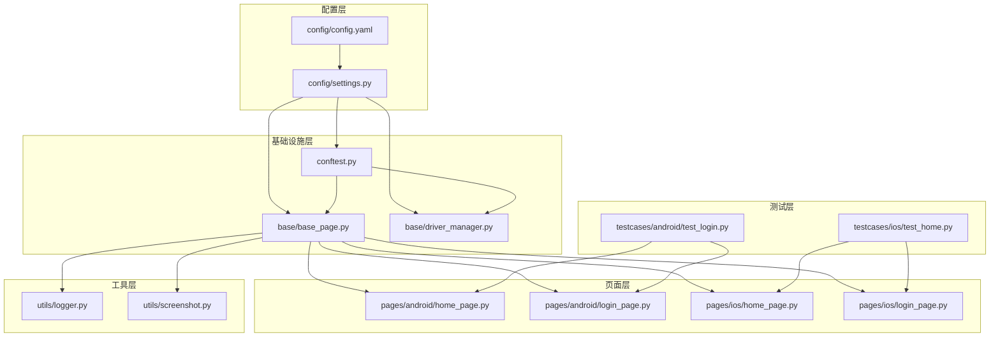
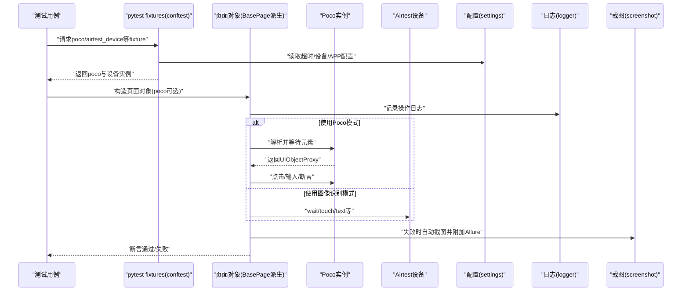
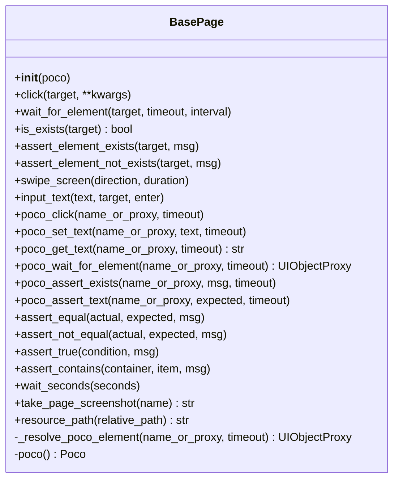
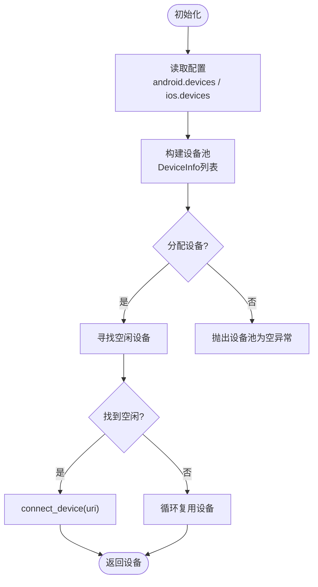
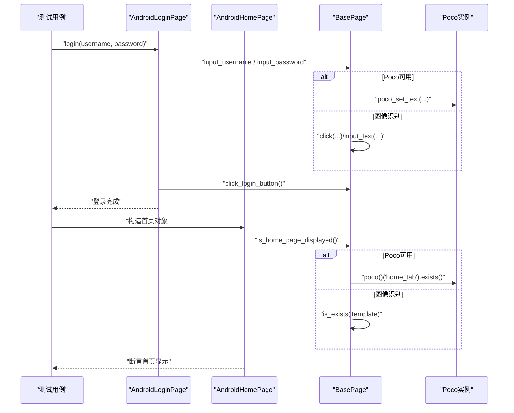
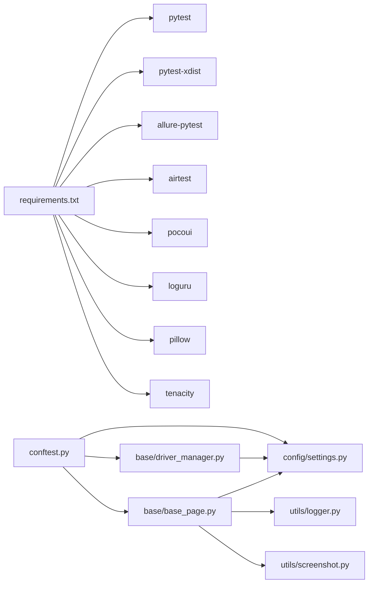

# 基础页面类设计

<cite>
**本文引用的文件**
- [base/base_page.py](file://base/base_page.py)
- [base/driver_manager.py](file://base/driver_manager.py)
- [pages/android/home_page.py](file://pages/android/home_page.py)
- [pages/android/login_page.py](file://pages/android/login_page.py)
- [pages/ios/home_page.py](file://pages/ios/home_page.py)
- [pages/ios/login_page.py](file://pages/ios/login_page.py)
- [config/settings.py](file://config/settings.py)
- [config/config.yaml](file://config/config.yaml)
- [utils/logger.py](file://utils/logger.py)
- [utils/screenshot.py](file://utils/screenshot.py)
- [conftest.py](file://conftest.py)
- [requirements.txt](file://requirements.txt)
- [testcases/android/test_login.py](file://testcases/android/test_login.py)
- [testcases/ios/test_home.py](file://testcases/ios/test_home.py)
</cite>

## 目录
1. [简介](#简介)
2. [项目结构](#项目结构)
3. [核心组件](#核心组件)
4. [架构总览](#架构总览)
5. [详细组件分析](#详细组件分析)
6. [依赖分析](#依赖分析)
7. [性能考虑](#性能考虑)
8. [故障排查指南](#故障排查指南)
9. [结论](#结论)
10. [附录](#附录)

## 简介
本文件系统性阐述AirTestUI基础页面类设计，重点围绕BasePage基类的Page Object模式实现、图像识别与Poco UI树定位双模式支持、统一UI操作接口、智能等待与自动截图、Allure步骤记录、异常处理与超时配置、资源路径解析等关键技术点。文档同时结合具体页面对象与测试用例，给出最佳实践与排障建议，帮助读者快速掌握移动端自动化测试页面层的设计与落地。

## 项目结构
项目采用“分层+按平台组织”的结构：
- base：核心基础设施（基类、驱动管理）
- pages：页面对象（按平台划分）
- config：配置管理（YAML + 环境变量覆盖）
- utils：工具模块（日志、截图、重试等）
- testcases：测试用例（按平台划分）
- resources：资源文件（图像模板等）

图表来源
- [config/config.yaml:1-70](file://config/config.yaml#L1-L70)
- [config/settings.py:1-112](file://config/settings.py#L1-L112)
- [base/base_page.py:1-320](file://base/base_page.py#L1-L320)
- [base/driver_manager.py:1-188](file://base/driver_manager.py#L1-L188)
- [pages/android/home_page.py:1-58](file://pages/android/home_page.py#L1-L58)
- [pages/android/login_page.py:1-107](file://pages/android/login_page.py#L1-L107)
- [pages/ios/home_page.py:1-43](file://pages/ios/home_page.py#L1-L43)
- [pages/ios/login_page.py:1-65](file://pages/ios/login_page.py#L1-L65)
- [utils/logger.py:1-59](file://utils/logger.py#L1-L59)
- [utils/screenshot.py:1-89](file://utils/screenshot.py#L1-L89)
- [conftest.py:1-255](file://conftest.py#L1-L255)
- [testcases/android/test_login.py:1-71](file://testcases/android/test_login.py#L1-L71)
- [testcases/ios/test_home.py:1-38](file://testcases/ios/test_home.py#L1-L38)

章节来源
- [config/config.yaml:1-70](file://config/config.yaml#L1-L70)
- [config/settings.py:1-112](file://config/settings.py#L1-L112)
- [base/base_page.py:1-320](file://base/base_page.py#L1-L320)
- [base/driver_manager.py:1-188](file://base/driver_manager.py#L1-L188)
- [pages/android/home_page.py:1-58](file://pages/android/home_page.py#L1-L58)
- [pages/android/login_page.py:1-107](file://pages/android/login_page.py#L1-L107)
- [pages/ios/home_page.py:1-43](file://pages/ios/home_page.py#L1-L43)
- [pages/ios/login_page.py:1-65](file://pages/ios/login_page.py#L1-L65)
- [utils/logger.py:1-59](file://utils/logger.py#L1-L59)
- [utils/screenshot.py:1-89](file://utils/screenshot.py#L1-L89)
- [conftest.py:1-255](file://conftest.py#L1-L255)
- [testcases/android/test_login.py:1-71](file://testcases/android/test_login.py#L1-L71)
- [testcases/ios/test_home.py:1-38](file://testcases/ios/test_home.py#L1-L38)

## 核心组件
- BasePage：统一的页面对象基类，封装Airtest/Poco核心操作，提供图像识别与Poco双模式接口，内置智能等待、自动截图、Allure步骤记录、断言与工具方法。
- DriverManager：设备驱动管理器，负责设备池初始化、分配与回收，支持多设备并发。
- 页面对象：Android/iOS各页面对象继承BasePage，按平台实现业务逻辑。
- 配置系统：YAML配置 + 环境变量覆盖，集中管理超时、设备、APP、截图、重试、报告等参数。
- 工具模块：日志（loguru）、截图（Allure附件）、通知等。

章节来源
- [base/base_page.py:30-320](file://base/base_page.py#L30-L320)
- [base/driver_manager.py:51-188](file://base/driver_manager.py#L51-L188)
- [config/settings.py:89-112](file://config/settings.py#L89-L112)
- [utils/logger.py:50-59](file://utils/logger.py#L50-L59)
- [utils/screenshot.py:28-89](file://utils/screenshot.py#L28-L89)

## 架构总览
下图展示从测试用例到页面对象、再到Airtest/Poco与设备的调用链路，以及配置与工具模块的支撑作用。

图表来源
- [conftest.py:151-227](file://conftest.py#L151-L227)
- [base/base_page.py:49-320](file://base/base_page.py#L49-L320)
- [config/settings.py:89-112](file://config/settings.py#L89-L112)
- [utils/screenshot.py:28-89](file://utils/screenshot.py#L28-L89)
- [utils/logger.py:50-59](file://utils/logger.py#L50-L59)

## 详细组件分析

### BasePage：统一页面对象基类
设计理念
- Page Object模式：将页面元素与操作封装在页面对象中，隔离业务与技术细节，提升可维护性与复用性。
- 双模式支持：同时支持Airtest图像识别与Poco UI树定位，通过构造函数注入poco实例决定模式；若未提供poco，则退化为图像识别模式。
- 统一接口：提供click、input_text、swipe_screen、assert_*、poco_*等统一方法，屏蔽底层差异。
- 智能等待：内置等待超时与检查间隔，结合全局配置与方法级参数，避免硬编码。
- 异常处理：捕获异常、自动截图、记录日志，并在必要时抛出，便于定位问题。
- Allure集成：使用@allure.step装饰器自动记录步骤，截图作为附件嵌入报告。
- 资源路径：提供resource_path统一解析resources目录下的资源文件路径。

关键实现要点
- 超时配置：通过settings.get_timeout(category)读取全局超时，支持element_wait/page_load等分类。
- Poco解析：_resolve_poco_element支持字符串节点名与UIObjectProxy实例，自动等待出现并返回代理对象。
- 截图与日志：take_page_screenshot统一截图并附加Allure；异常时自动截图并记录错误日志。
- 屏幕滑动：根据设备分辨率计算滑动起点与终点，支持上下左右四个方向。
- 断言：提供assert_equal、assert_not_equal、assert_true、assert_contains等常用断言。

图表来源
- [base/base_page.py:30-320](file://base/base_page.py#L30-L320)

章节来源
- [base/base_page.py:30-320](file://base/base_page.py#L30-L320)
- [config/settings.py:89-91](file://config/settings.py#L89-L91)
- [utils/screenshot.py:28-89](file://utils/screenshot.py#L28-L89)
- [utils/logger.py:50-59](file://utils/logger.py#L50-L59)

### DriverManager：设备驱动管理器
职责
- 单例模式：确保全局唯一设备池。
- 设备池：从配置读取Android/iOS设备列表，构建DeviceInfo对象。
- 分配策略：按worker_id分配设备，支持首次连接与复用；设备不足时循环分配。
- 生命周期：提供allocate_device/release_device/cleanup，管理设备连接与释放。

图表来源
- [base/driver_manager.py:81-150](file://base/driver_manager.py#L81-L150)

章节来源
- [base/driver_manager.py:51-188](file://base/driver_manager.py#L51-L188)
- [config/settings.py:94-101](file://config/settings.py#L94-L101)

### 页面对象示例：AndroidLoginPage与AndroidHomePage
- AndroidLoginPage：演示图像识别与Poco双模式切换，封装输入用户名/密码、点击登录、登录流程与页面验证。
- AndroidHomePage：演示首页元素判断、标题获取、导航到个人中心、搜索等操作，同样支持双模式。

图表来源
- [pages/android/login_page.py:32-74](file://pages/android/login_page.py#L32-L74)
- [pages/android/home_page.py:21-48](file://pages/android/home_page.py#L21-L48)
- [base/base_page.py:186-306](file://base/base_page.py#L186-L306)

章节来源
- [pages/android/login_page.py:14-107](file://pages/android/login_page.py#L14-L107)
- [pages/android/home_page.py:14-58](file://pages/android/home_page.py#L14-L58)
- [pages/ios/login_page.py:13-65](file://pages/ios/login_page.py#L13-L65)
- [pages/ios/home_page.py:12-43](file://pages/ios/home_page.py#L12-L43)

### 配置与超时管理
- 配置加载：支持config.yaml + local_config.yaml + 环境变量覆盖（前缀AIRTESTUI_）。
- 超时配置：get_timeout(category)统一读取element_wait/page_load/app_launch等分类超时。
- 截图配置：on_failure/on_step/save_dir等控制失败自动截图与保存目录。
- 设备与APP配置：android/ios.devices与app字段，支持包名/Bundle ID、Activity/启动路径等。

章节来源
- [config/config.yaml:1-70](file://config/config.yaml#L1-L70)
- [config/settings.py:14-112](file://config/settings.py#L14-L112)

### 日志与截图
- 日志：loguru结构化日志，控制台彩色输出与文件轮转，按级别分离日志文件。
- 截图：统一take_screenshot与attach_screenshot_to_allure，失败自动截图并附加Allure报告。
- Allure集成：@allure.step装饰器自动记录步骤，conftest中makereport钩子在失败时附加截图与错误详情。

章节来源
- [utils/logger.py:12-59](file://utils/logger.py#L12-L59)
- [utils/screenshot.py:28-89](file://utils/screenshot.py#L28-L89)
- [conftest.py:62-138](file://conftest.py#L62-L138)

### 测试用例与最佳实践
- 测试用例：Android登录用例与iOS首页用例展示了页面对象的使用方式、断言与Allure标注。
- 最佳实践：
  - 在setup中注入poco，页面对象构造时传入，实现双模式无缝切换。
  - 使用BasePage.resource_path统一资源路径，避免相对路径问题。
  - 使用断言方法与智能等待，减少显式sleep。
  - 失败自动截图与Allure步骤记录，便于问题定位与报告生成。

章节来源
- [testcases/android/test_login.py:16-71](file://testcases/android/test_login.py#L16-L71)
- [testcases/ios/test_home.py:13-38](file://testcases/ios/test_home.py#L13-L38)
- [base/base_page.py:309-320](file://base/base_page.py#L309-L320)

## 依赖分析
- 外部依赖：pytest、pytest-xdist、allure-pytest、airtest、pocoui、loguru、pillow、tenacity等。
- 内部依赖：BasePage依赖settings、logger、screenshot；DriverManager依赖settings；conftest依赖settings、driver_manager、app_launcher等。

图表来源
- [requirements.txt:1-21](file://requirements.txt#L1-L21)
- [base/base_page.py:23-25](file://base/base_page.py#L23-L25)
- [base/driver_manager.py:10-14](file://base/driver_manager.py#L10-L14)
- [conftest.py:14-18](file://conftest.py#L14-L18)

章节来源
- [requirements.txt:1-21](file://requirements.txt#L1-L21)
- [base/base_page.py:23-25](file://base/base_page.py#L23-L25)
- [base/driver_manager.py:10-14](file://base/driver_manager.py#L10-L14)
- [conftest.py:14-18](file://conftest.py#L14-L18)

## 性能考虑
- 等待策略：合理设置element_wait与page_load，避免过长导致测试时间膨胀；在高频操作中可考虑批量等待与合并断言。
- 截图策略：on_step建议关闭以减少I/O开销；仅在失败时自动截图，降低磁盘压力。
- 设备并发：通过pytest-xdist与DriverManager实现多设备并发，注意设备资源竞争与稳定性。
- Poco性能：在Android/iOS平台分别选择合适的Poco驱动，避免频繁初始化；必要时开启screenshot_each_action=false以减少截图开销。

## 故障排查指南
常见问题与解决思路
- Poco未初始化：构造BasePage时未传入poco实例，调用poco_*方法会抛出运行时错误。请在fixture中注入poco并传入页面对象。
- 超时异常：等待元素超时或页面加载超时。检查element_wait/page_load配置，确认元素定位是否正确，必要时增加超时或优化等待策略。
- 截图失败：截图目录权限或路径异常。检查screenshot.save_dir配置与目录权限。
- 设备分配冲突：设备池为空或被占用。检查config.yaml中的设备配置与DriverManager分配逻辑。
- Allure报告缺失：未启用Allure或未正确附加附件。确认pytest-allure插件与conftest中钩子配置。

章节来源
- [base/base_page.py:186-190](file://base/base_page.py#L186-L190)
- [config/settings.py:89-91](file://config/settings.py#L89-L91)
- [utils/screenshot.py:17-53](file://utils/screenshot.py#L17-L53)
- [base/driver_manager.py:141-150](file://base/driver_manager.py#L141-L150)
- [conftest.py:62-138](file://conftest.py#L62-L138)

## 结论
BasePage通过统一的Page Object模式与双模式支持，有效降低了移动端自动化测试的复杂度与维护成本。结合配置化超时、智能等待、自动截图与Allure步骤记录，形成了完整的测试可观测性闭环。配合DriverManager的设备池管理与conftest的fixture体系，项目具备良好的扩展性与可维护性。建议在实际项目中遵循资源路径统一、断言与等待策略、失败自动截图与Allure步骤记录的最佳实践，持续优化测试效率与质量。

## 附录
- 代码片段路径参考
  - [BasePage.click:60-75](file://base/base_page.py#L60-L75)
  - [BasePage.wait_for_element:76-98](file://base/base_page.py#L76-L98)
  - [BasePage.swipe_screen:128-161](file://base/base_page.py#L128-L161)
  - [BasePage.input_text:162-183](file://base/base_page.py#L162-L183)
  - [BasePage.poco_click:192-205](file://base/base_page.py#L192-L205)
  - [BasePage.poco_set_text:206-219](file://base/base_page.py#L206-L219)
  - [BasePage.poco_wait_for_element:228-233](file://base/base_page.py#L228-L233)
  - [BasePage.take_page_screenshot:279-285](file://base/base_page.py#L279-L285)
  - [BasePage.resource_path:309-320](file://base/base_page.py#L309-L320)
  - [DriverManager.allocate_device:119-150](file://base/driver_manager.py#L119-L150)
  - [AndroidLoginPage.login:61-74](file://pages/android/login_page.py#L61-L74)
  - [AndroidHomePage.navigate_to_profile:41-48](file://pages/android/home_page.py#L41-L48)
  - [conftest.poco fixture:185-208](file://conftest.py#L185-L208)
  - [conftest.makereport钩子:62-138](file://conftest.py#L62-L138)
  - [配置项timeout与screenshot:8-19](file://config/config.yaml#L8-L19)