# 平台特定页面实现

<cite>
**本文档引用的文件**
- [base/base_page.py](file://base/base_page.py)
- [pages/android/login_page.py](file://pages/android/login_page.py)
- [pages/android/home_page.py](file://pages/android/home_page.py)
- [pages/ios/login_page.py](file://pages/ios/login_page.py)
- [pages/ios/home_page.py](file://pages/ios/home_page.py)
- [config/settings.py](file://config/settings.py)
- [config/config.yaml](file://config/config.yaml)
- [conftest.py](file://conftest.py)
- [base/driver_manager.py](file://base/driver_manager.py)
- [base/app_launcher.py](file://base/app_launcher.py)
- [utils/logger.py](file://utils/logger.py)
- [utils/screenshot.py](file://utils/screenshot.py)
- [utils/data_loader.py](file://utils/data_loader.py)
- [testcases/android/test_login.py](file://testcases/android/test_login.py)
- [testcases/ios/test_login.py](file://testcases/ios/test_login.py)
- [requirements.txt](file://requirements.txt)
</cite>

## 目录
1. [简介](#简介)
2. [项目结构](#项目结构)
3. [核心组件](#核心组件)
4. [架构总览](#架构总览)
5. [详细组件分析](#详细组件分析)
6. [依赖关系分析](#依赖关系分析)
7. [性能考虑](#性能考虑)
8. [故障排查指南](#故障排查指南)
9. [结论](#结论)
10. [附录](#附录)

## 简介
本文件面向Android与iOS平台的页面对象实现，系统性对比分析两类平台页面对象在UI元素处理、定位策略选择与交互方式上的差异，深入解释各平台页面类的元素定义、操作方法与业务逻辑封装。同时总结平台适配的技术方案与最佳实践，包括资源文件管理、平台差异化配置与兼容性处理，并提供平台迁移与扩展的指导原则。

## 项目结构
项目采用分层+按平台拆分的组织方式：
- base：基础能力层（页面基类、驱动管理、应用启停）
- pages：页面对象层（按平台拆分，android/ios）
- config：配置层（YAML配置与环境变量覆盖）
- utils：工具层（日志、截图、数据加载等）
- testcases：测试用例层（按平台拆分）
- resources：资源文件（按平台拆分）

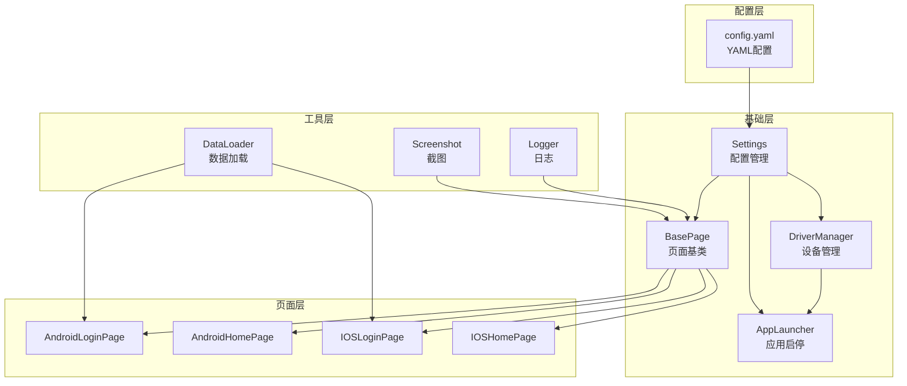

**图表来源**
- [base/base_page.py:30-320](file://base/base_page.py#L30-L320)
- [base/driver_manager.py:51-188](file://base/driver_manager.py#L51-L188)
- [base/app_launcher.py:20-127](file://base/app_launcher.py#L20-L127)
- [config/settings.py:51-112](file://config/settings.py#L51-L112)
- [config/config.yaml:1-70](file://config/config.yaml#L1-L70)

**章节来源**
- [config/config.yaml:1-70](file://config/config.yaml#L1-L70)
- [config/settings.py:1-112](file://config/settings.py#L1-L112)

## 核心组件
- BasePage：统一的页面对象基类，封装airtest/poco核心操作，提供图像识别与UI树定位双模式，内置智能等待、自动截图、Allure步骤记录与断言工具。
- 平台页面对象：Android与iOS分别实现登录页与首页，均继承BasePage，内部通过Poco节点名或airtest Template进行元素定位与交互。
- 配置系统：config.yaml集中管理环境、超时、设备与APP信息；settings.py提供便捷访问与环境变量覆盖。
- 设备与应用管理：DriverManager负责设备连接池与分配；AppLauncher负责APP启动/关闭/重启与安装。
- 工具模块：logger提供结构化日志；screenshot提供截图与Allure附件；data_loader支持YAML/Excel/JSON数据加载。

**章节来源**
- [base/base_page.py:30-320](file://base/base_page.py#L30-L320)
- [pages/android/login_page.py:14-107](file://pages/android/login_page.py#L14-L107)
- [pages/android/home_page.py:14-58](file://pages/android/home_page.py#L14-L58)
- [pages/ios/login_page.py:13-65](file://pages/ios/login_page.py#L13-L65)
- [pages/ios/home_page.py:12-43](file://pages/ios/home_page.py#L12-L43)
- [config/settings.py:51-112](file://config/settings.py#L51-L112)
- [base/driver_manager.py:51-188](file://base/driver_manager.py#L51-L188)
- [base/app_launcher.py:20-127](file://base/app_launcher.py#L20-L127)
- [utils/logger.py:50-59](file://utils/logger.py#L50-L59)
- [utils/screenshot.py:28-89](file://utils/screenshot.py#L28-L89)
- [utils/data_loader.py:18-128](file://utils/data_loader.py#L18-L128)

## 架构总览
整体架构围绕“页面对象基类 + 平台页面对象 + 配置与工具”的分层设计，通过pytest fixtures注入Poco实例与设备信息，实现跨平台自动化测试。

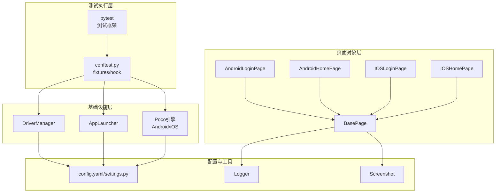

**图表来源**
- [conftest.py:185-208](file://conftest.py#L185-L208)
- [base/base_page.py:30-320](file://base/base_page.py#L30-L320)
- [base/driver_manager.py:51-188](file://base/driver_manager.py#L51-L188)
- [base/app_launcher.py:20-127](file://base/app_launcher.py#L20-L127)
- [config/settings.py:51-112](file://config/settings.py#L51-L112)

## 详细组件分析

### BasePage 页面基类
- 双模式定位：图像识别（airtest Template + touch/text/swipe）与Poco UI树定位（poco_click/poco_set_text/poco_get_text）。
- 统一断言与等待：is_exists、assert_element_exists、poco_assert_exists、poco_assert_text等。
- 工具方法：滑动屏幕、输入文本、截图并附加Allure、显式等待。
- 资源路径：resource_path统一拼接resources目录下的平台资源文件。

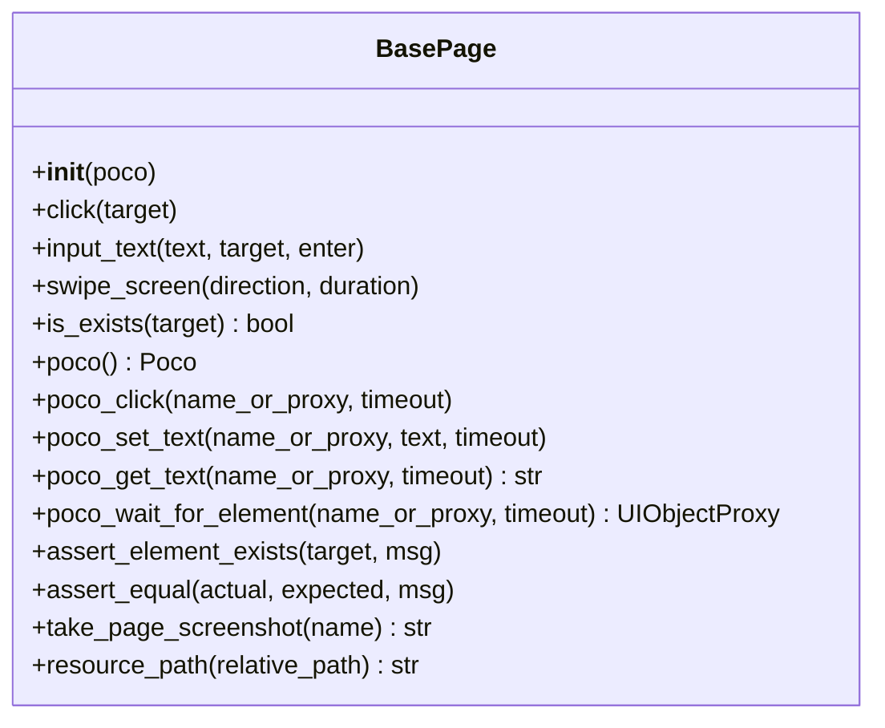

**图表来源**
- [base/base_page.py:30-320](file://base/base_page.py#L30-L320)

**章节来源**
- [base/base_page.py:30-320](file://base/base_page.py#L30-L320)

### Android 页面对象

#### AndroidLoginPage 登录页
- 元素定义：使用airtest Template定义图像识别元素（如logo、登录按钮）。
- 操作方法：输入用户名/密码（优先Poco，否则记录日志）、点击登录按钮（Poco或Template）、完整登录流程封装。
- 验证方法：页面显示校验（Poco节点存在或图像识别）、错误提示文本获取、登录按钮可用性校验。
- 平台特性：同时演示图像识别与Poco两种定位策略，增强稳定性。

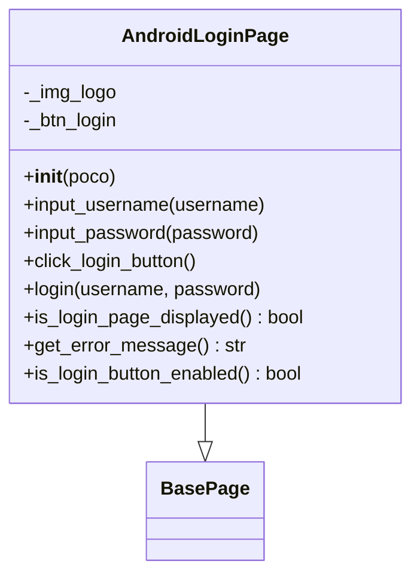

**图表来源**
- [pages/android/login_page.py:14-107](file://pages/android/login_page.py#L14-L107)
- [base/base_page.py:30-320](file://base/base_page.py#L30-L320)

**章节来源**
- [pages/android/login_page.py:14-107](file://pages/android/login_page.py#L14-L107)

#### AndroidHomePage 首页
- 元素定义：使用airtest Template定义Tab图标（如首页、个人中心）。
- 操作方法：首页显示校验（Poco或图像识别）、获取页面标题（Poco）、导航至个人中心（Poco或图像识别）、搜索功能（Poco或图像识别）。
- 平台特性：在Poco不可用时回退到图像识别，提升健壮性。

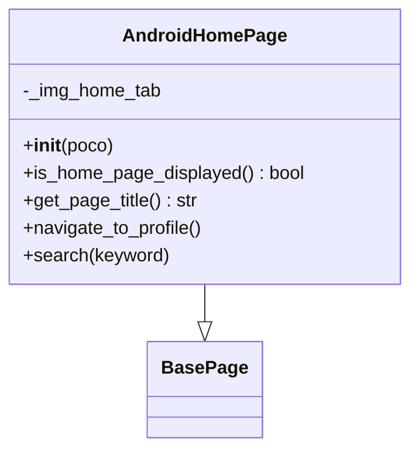

**图表来源**
- [pages/android/home_page.py:14-58](file://pages/android/home_page.py#L14-L58)
- [base/base_page.py:30-320](file://base/base_page.py#L30-L320)

**章节来源**
- [pages/android/home_page.py:14-58](file://pages/android/home_page.py#L14-L58)

### iOS 页面对象

#### IOSLoginPage 登录页
- 元素定义：主要使用Poco节点名进行定位。
- 操作方法：输入用户名/密码（Poco）、点击登录按钮（Poco）、完整登录流程封装。
- 验证方法：页面显示校验（Poco节点存在）。
- 平台特性：iOS页面对象更偏向Poco定位，图像识别作为补充。

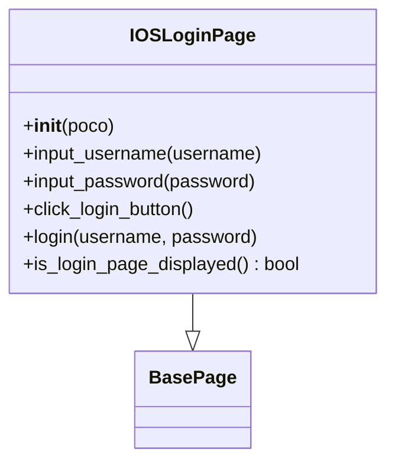

**图表来源**
- [pages/ios/login_page.py:13-65](file://pages/ios/login_page.py#L13-L65)
- [base/base_page.py:30-320](file://base/base_page.py#L30-L320)

**章节来源**
- [pages/ios/login_page.py:13-65](file://pages/ios/login_page.py#L13-L65)

#### IOSHomePage 首页
- 元素定义：使用Poco节点名进行定位。
- 操作方法：首页显示校验（Poco）、获取页面标题（Poco）、导航至个人中心（Poco）。
- 平台特性：iOS页面对象对Poco依赖度更高，图像识别使用较少。

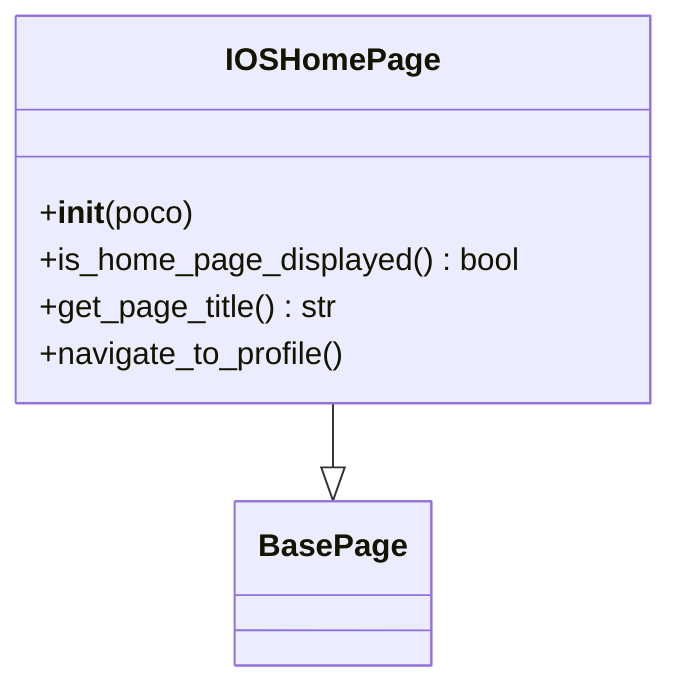

**图表来源**
- [pages/ios/home_page.py:12-43](file://pages/ios/home_page.py#L12-L43)
- [base/base_page.py:30-320](file://base/base_page.py#L30-L320)

**章节来源**
- [pages/ios/home_page.py:12-43](file://pages/ios/home_page.py#L12-L43)

### 配置与平台适配

#### 配置系统
- config.yaml集中管理环境、超时、设备与APP信息；settings.py提供便捷访问与环境变量覆盖（前缀AIRTESTUI_）。
- 通过get_android_app/get_ios_app获取平台特定的APP配置（包名/Bundle ID、Activity、安装路径等）。

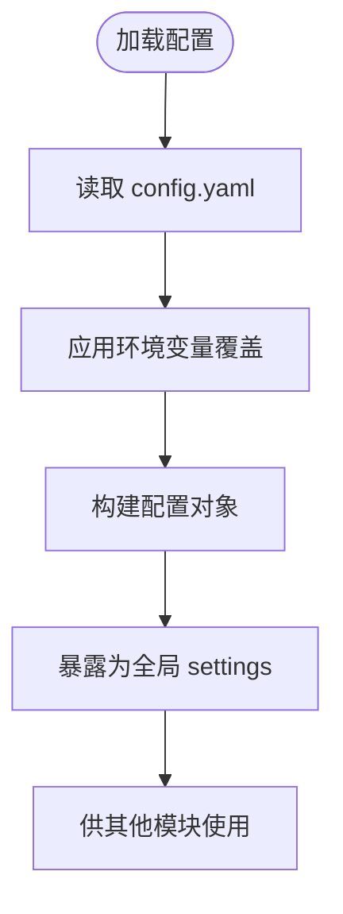

**图表来源**
- [config/config.yaml:1-70](file://config/config.yaml#L1-L70)
- [config/settings.py:34-81](file://config/settings.py#L34-L81)

**章节来源**
- [config/config.yaml:1-70](file://config/config.yaml#L1-L70)
- [config/settings.py:51-112](file://config/settings.py#L51-L112)

#### 设备与应用管理
- DriverManager：按worker_id分配设备，支持Android/iOS设备池，连接/复用/释放设备。
- AppLauncher：根据平台选择启动方式（Android Activity或iOS Bundle ID），支持安装、关闭、重启、清空数据。

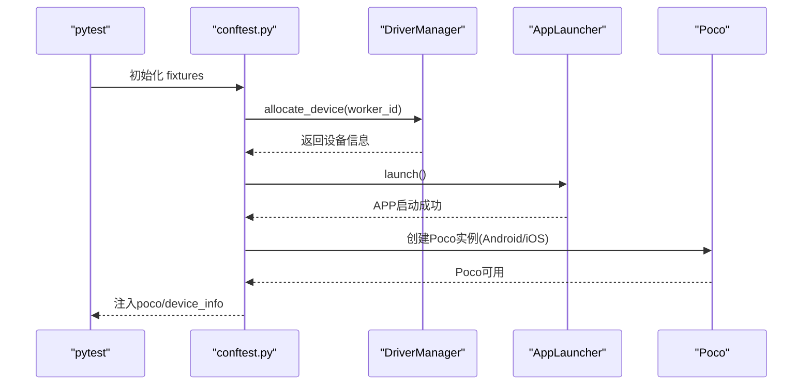

**图表来源**
- [conftest.py:157-227](file://conftest.py#L157-L227)
- [base/driver_manager.py:119-150](file://base/driver_manager.py#L119-L150)
- [base/app_launcher.py:49-93](file://base/app_launcher.py#L49-L93)

**章节来源**
- [base/driver_manager.py:51-188](file://base/driver_manager.py#L51-L188)
- [base/app_launcher.py:20-127](file://base/app_launcher.py#L20-L127)
- [conftest.py:157-227](file://conftest.py#L157-L227)

### 测试用例与平台差异

#### Android 登录测试
- 用例覆盖：正常登录、错误密码、空用户名、UI元素验证。
- 断言：登录后跳转首页、仍在登录页、登录按钮状态。

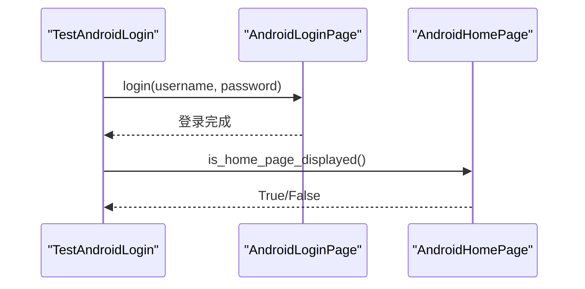

**图表来源**
- [testcases/android/test_login.py:32-40](file://testcases/android/test_login.py#L32-L40)

**章节来源**
- [testcases/android/test_login.py:16-71](file://testcases/android/test_login.py#L16-L71)

#### iOS 登录测试
- 用例覆盖：正常登录、错误密码。
- 断言：登录后跳转首页、仍在登录页。

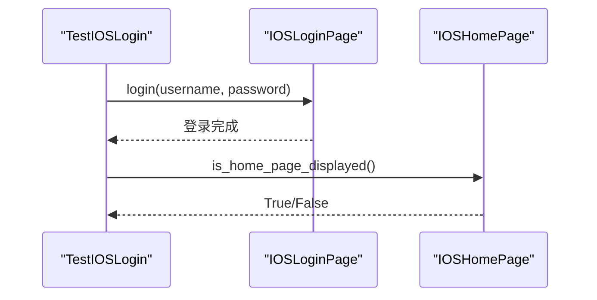

**图表来源**
- [testcases/ios/test_login.py:29-34](file://testcases/ios/test_login.py#L29-L34)

**章节来源**
- [testcases/ios/test_login.py:14-43](file://testcases/ios/test_login.py#L14-L43)

## 依赖关系分析

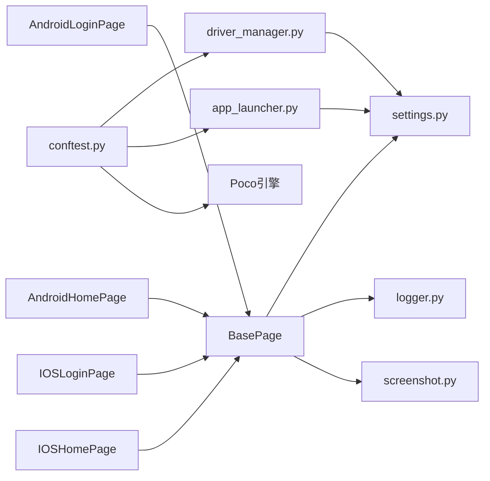

**图表来源**
- [pages/android/login_page.py:8-11](file://pages/android/login_page.py#L8-L11)
- [pages/android/home_page.py:8-11](file://pages/android/home_page.py#L8-L11)
- [pages/ios/login_page.py:7-10](file://pages/ios/login_page.py#L7-L10)
- [pages/ios/home_page.py:6-9](file://pages/ios/home_page.py#L6-L9)
- [base/base_page.py:23-25](file://base/base_page.py#L23-L25)
- [base/driver_manager.py:10-14](file://base/driver_manager.py#L10-L14)
- [base/app_launcher.py:14-15](file://base/app_launcher.py#L14-L15)
- [conftest.py:14-19](file://conftest.py#L14-L19)

**章节来源**
- [pages/android/login_page.py:8-11](file://pages/android/login_page.py#L8-L11)
- [pages/android/home_page.py:8-11](file://pages/android/home_page.py#L8-L11)
- [pages/ios/login_page.py:7-10](file://pages/ios/login_page.py#L7-L10)
- [pages/ios/home_page.py:6-9](file://pages/ios/home_page.py#L6-L9)
- [base/base_page.py:23-25](file://base/base_page.py#L23-L25)
- [base/driver_manager.py:10-14](file://base/driver_manager.py#L10-L14)
- [base/app_launcher.py:14-15](file://base/app_launcher.py#L14-L15)
- [conftest.py:14-19](file://conftest.py#L14-L19)

## 性能考虑
- 超时配置：通过config.yaml的timeout配置元素等待与页面加载超时，settings.py提供统一访问。
- 截图策略：screenshot模块支持失败自动截图与Allure附件，避免过多截图影响性能。
- 设备并发：DriverManager支持多设备并发，合理分配设备可提升执行效率。
- Poco回退：当Poco不可用时自动回退图像识别，保证稳定性但可能牺牲部分性能。

**章节来源**
- [config/config.yaml:8-13](file://config/config.yaml#L8-L13)
- [config/settings.py:89-91](file://config/settings.py#L89-L91)
- [utils/screenshot.py:28-89](file://utils/screenshot.py#L28-L89)
- [base/driver_manager.py:119-150](file://base/driver_manager.py#L119-L150)
- [base/base_page.py:287-320](file://base/base_page.py#L287-L320)

## 故障排查指南
- 日志：使用get_logger获取结构化日志，便于定位问题。
- 截图：失败自动截图并附加Allure，结合日志快速定位。
- Poco初始化失败：conftest中若Poco初始化失败，将降级为图像识别模式，检查设备连接与平台引擎。
- 资源路径：确保resources/android或resources/ios下存在对应图片资源，使用BasePage.resource_path统一拼接。
- 配置覆盖：可通过环境变量（AIRTESTUI_前缀）覆盖config.yaml配置项。

**章节来源**
- [utils/logger.py:50-59](file://utils/logger.py#L50-L59)
- [utils/screenshot.py:76-89](file://utils/screenshot.py#L76-L89)
- [conftest.py:205-207](file://conftest.py#L205-L207)
- [base/base_page.py:309-320](file://base/base_page.py#L309-L320)
- [config/settings.py:20-31](file://config/settings.py#L20-L31)

## 结论
该代码库通过BasePage统一抽象，实现了Android与iOS平台页面对象的清晰分离与一致交互体验。Android端更强调图像识别与Poco双模式的稳健性，iOS端更偏向Poco定位。配合完善的配置系统、设备与应用管理、日志与截图工具，形成了一套可扩展、可维护的跨平台自动化测试体系。

## 附录

### 平台差异对比表
- 定位策略
  - Android：同时支持Poco节点名与airtest Template，增强健壮性。
  - iOS：主要使用Poco节点名，图像识别作为补充。
- 元素定义
  - Android：通过Template定义图像识别元素，如登录按钮、Tab图标。
  - iOS：以Poco节点名为主，减少对图像资源的依赖。
- 交互方式
  - Android：在Poco不可用时回退到图像识别，如点击、输入文本。
  - iOS：更多依赖Poco进行点击、输入与断言。
- 验证方法
  - Android：页面显示校验可同时使用Poco与图像识别；错误提示与按钮可用性校验。
  - iOS：页面显示校验依赖Poco节点存在性。

**章节来源**
- [pages/android/login_page.py:14-107](file://pages/android/login_page.py#L14-L107)
- [pages/android/home_page.py:14-58](file://pages/android/home_page.py#L14-L58)
- [pages/ios/login_page.py:13-65](file://pages/ios/login_page.py#L13-L65)
- [pages/ios/home_page.py:12-43](file://pages/ios/home_page.py#L12-L43)

### 平台适配最佳实践
- 资源文件管理
  - 将平台特定资源置于resources/android或resources/ios，使用BasePage.resource_path统一拼接。
- 平台差异化配置
  - 在config.yaml中分别配置Android与iOS设备与APP信息，通过settings.py读取。
- 兼容性处理
  - 在页面对象中优先使用Poco，若不可用则回退图像识别；对关键断言增加异常捕获与截图。
- 测试数据驱动
  - 使用utils/data_loader加载YAML/Excel/JSON数据，支持参数化测试。

**章节来源**
- [base/base_page.py:309-320](file://base/base_page.py#L309-L320)
- [config/config.yaml:45-70](file://config/config.yaml#L45-L70)
- [config/settings.py:94-112](file://config/settings.py#L94-L112)
- [utils/data_loader.py:85-128](file://utils/data_loader.py#L85-L128)

### 平台迁移与扩展指导
- 新增平台
  - 在pages目录新增平台子目录，创建对应页面对象，继承BasePage。
  - 在config/config.yaml中添加平台设备与APP配置。
  - 在conftest.py中完善Poco引擎选择逻辑。
- 扩展页面对象
  - 在现有页面类基础上增加方法，遵循“Poco优先、图像识别兜底”的原则。
  - 使用BasePage提供的断言与截图工具，保持测试报告质量。
- 依赖与工具
  - requirements.txt中包含pytest、airtest、pocoui等核心依赖，确保环境一致性。

**章节来源**
- [requirements.txt:1-21](file://requirements.txt#L1-L21)
- [conftest.py:192-207](file://conftest.py#L192-L207)
- [config/config.yaml:45-70](file://config/config.yaml#L45-L70)