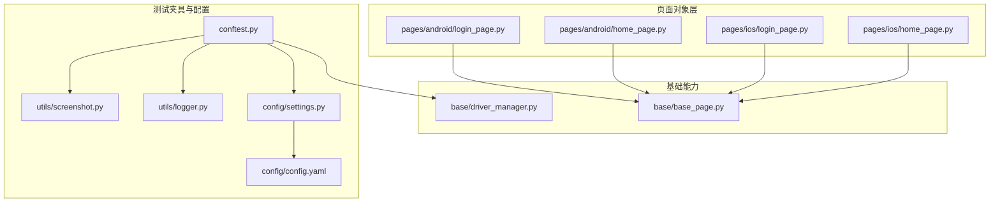
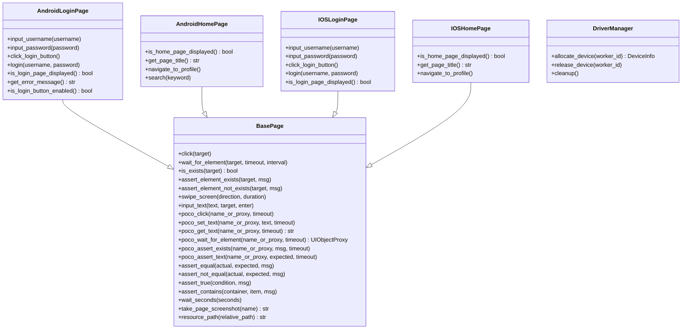
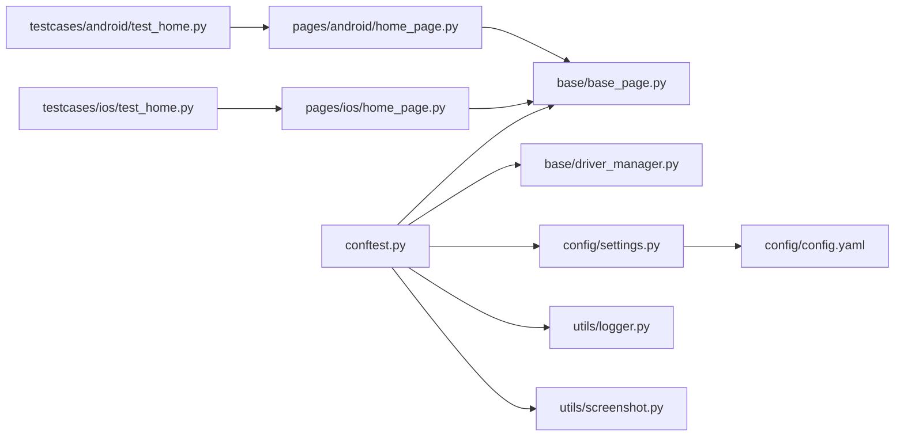

# 页面对象层

<cite>
**本文引用的文件**
- [base/base_page.py](file://base/base_page.py)
- [pages/android/home_page.py](file://pages/android/home_page.py)
- [pages/android/login_page.py](file://pages/android/login_page.py)
- [pages/ios/home_page.py](file://pages/ios/home_page.py)
- [pages/ios/login_page.py](file://pages/ios/login_page.py)
- [base/driver_manager.py](file://base/driver_manager.py)
- [conftest.py](file://conftest.py)
- [config/settings.py](file://config/settings.py)
- [config/config.yaml](file://config/config.yaml)
- [utils/logger.py](file://utils/logger.py)
- [utils/screenshot.py](file://utils/screenshot.py)
- [data/test_data.yaml](file://data/test_data.yaml)
- [testcases/android/test_home.py](file://testcases/android/test_home.py)
- [testcases/ios/test_home.py](file://testcases/ios/test_home.py)
</cite>

## 目录
1. [引言](#引言)
2. [项目结构](#项目结构)
3. [核心组件](#核心组件)
4. [架构总览](#架构总览)
5. [组件详解](#组件详解)
6. [依赖关系分析](#依赖关系分析)
7. [性能考量](#性能考量)
8. [故障排查指南](#故障排查指南)
9. [结论](#结论)
10. [附录](#附录)

## 引言
本文件系统性梳理 AirTestUI 的页面对象层设计与实现，重点围绕 Page Object 设计模式在移动端自动化中的落地实践，涵盖：
- 页面元素封装与操作方法抽象
- 图像识别与 UI 树定位双模式的统一接口
- 平台差异化处理（Android 与 iOS）
- 基类 BasePage 的设计理念、API 接口与异常处理机制
- 页面对象开发最佳实践与代码示例路径

## 项目结构
页面对象层位于 pages 目录下，按平台拆分，每个平台包含若干页面对象类；基础能力由 base 目录提供，测试夹具与设备管理由 conftest.py 与 base/driver_manager.py 提供。

图表来源
- [pages/android/login_page.py:1-107](file://pages/android/login_page.py#L1-L107)
- [pages/android/home_page.py:1-58](file://pages/android/home_page.py#L1-L58)
- [pages/ios/login_page.py:1-65](file://pages/ios/login_page.py#L1-L65)
- [pages/ios/home_page.py:1-43](file://pages/ios/home_page.py#L1-L43)
- [base/base_page.py:1-320](file://base/base_page.py#L1-L320)
- [base/driver_manager.py:1-188](file://base/driver_manager.py#L1-L188)
- [conftest.py:1-255](file://conftest.py#L1-L255)
- [config/settings.py:1-112](file://config/settings.py#L1-L112)
- [config/config.yaml:1-70](file://config/config.yaml#L1-L70)
- [utils/logger.py:1-59](file://utils/logger.py#L1-L59)
- [utils/screenshot.py:1-89](file://utils/screenshot.py#L1-L89)

章节来源
- [pages/android/login_page.py:1-107](file://pages/android/login_page.py#L1-L107)
- [pages/android/home_page.py:1-58](file://pages/android/home_page.py#L1-L58)
- [pages/ios/login_page.py:1-65](file://pages/ios/login_page.py#L1-L65)
- [pages/ios/home_page.py:1-43](file://pages/ios/home_page.py#L1-L43)
- [base/base_page.py:1-320](file://base/base_page.py#L1-L320)
- [base/driver_manager.py:1-188](file://base/driver_manager.py#L1-L188)
- [conftest.py:1-255](file://conftest.py#L1-L255)
- [config/settings.py:1-112](file://config/settings.py#L1-L112)
- [config/config.yaml:1-70](file://config/config.yaml#L1-L70)
- [utils/logger.py:1-59](file://utils/logger.py#L1-L59)
- [utils/screenshot.py:1-89](file://utils/screenshot.py#L1-L89)

## 核心组件
- BasePage：统一的页面对象基类，提供图像识别与 Poco UI 树定位两类操作接口，内置智能等待、自动截图、Allure 步骤记录与断言工具。
- 平台页面对象：Android 与 iOS 各自的页面对象类，继承 BasePage，按平台特性封装元素与流程。
- DriverManager：设备驱动管理器，负责设备池初始化、分配与释放，支持多设备并发。
- conftest：pytest 夹具与钩子，提供设备、Poco 实例、APP 生命周期管理与 Allure 报告集成。
- 配置体系：config.yaml 与 settings.py 提供环境、超时、设备与 APP 配置，支持环境变量覆盖。

章节来源
- [base/base_page.py:30-320](file://base/base_page.py#L30-L320)
- [pages/android/login_page.py:14-107](file://pages/android/login_page.py#L14-L107)
- [pages/ios/login_page.py:13-65](file://pages/ios/login_page.py#L13-L65)
- [base/driver_manager.py:51-188](file://base/driver_manager.py#L51-L188)
- [conftest.py:140-255](file://conftest.py#L140-L255)
- [config/settings.py:89-112](file://config/settings.py#L89-L112)
- [config/config.yaml:8-70](file://config/config.yaml#L8-L70)

## 架构总览
页面对象层采用“基类 + 平台特化”的分层设计：
- 基类 BasePage 封装统一的 UI 操作与断言，屏蔽底层 Airtest 与 Poco 的差异。
- 平台页面对象在基类之上，按平台元素命名与交互习惯进行适配。
- conftest 通过夹具注入设备与 Poco 实例，确保页面对象在不同平台下的一致行为。
- DriverManager 保障多设备并发场景下的设备分配与生命周期管理。

图表来源
- [base/base_page.py:30-320](file://base/base_page.py#L30-L320)
- [pages/android/login_page.py:14-107](file://pages/android/login_page.py#L14-L107)
- [pages/android/home_page.py:14-58](file://pages/android/home_page.py#L14-L58)
- [pages/ios/login_page.py:13-65](file://pages/ios/login_page.py#L13-L65)
- [pages/ios/home_page.py:12-43](file://pages/ios/home_page.py#L12-L43)
- [base/driver_manager.py:51-188](file://base/driver_manager.py#L51-L188)

## 组件详解

### BasePage 基类设计与 API
- 统一入口：构造函数接收可选 Poco 实例，若为空则仅使用图像识别模式。
- 图像识别操作：点击、等待元素出现、存在性断言、滑动、输入文本等，均带有 Allure 步骤与异常截图。
- Poco UI 树操作：提供点击、设置文本、获取文本、等待元素、存在性断言与文本断言等，内部通过解析器统一处理字符串节点名与 UIObjectProxy。
- 断言工具：提供相等、不相等、为真、包含等断言方法，便于页面验证。
- 工具方法：显式等待、截图并附加 Allure、资源路径解析。
- 异常处理：对关键操作捕获异常并截图，提升问题定位效率。

章节来源
- [base/base_page.py:49-320](file://base/base_page.py#L49-L320)

### Android 页面对象
- AndroidLoginPage：演示图像识别与 Poco 双模式结合的页面封装，提供用户名/密码输入、登录按钮点击与登录流程封装，并包含页面加载验证、错误信息获取与按钮可用性校验。
- AndroidHomePage：封装首页展示验证、标题获取、导航至个人中心与搜索功能，优先使用 Poco，图像识别作为兜底。

章节来源
- [pages/android/login_page.py:14-107](file://pages/android/login_page.py#L14-L107)
- [pages/android/home_page.py:14-58](file://pages/android/home_page.py#L14-L58)

### iOS 页面对象
- IOSLoginPage：以 Poco 为主、图像识别为辅的页面封装，提供用户名/密码输入、登录按钮点击与登录流程封装，并包含页面加载验证。
- IOSHomePage：封装首页展示验证、标题获取与导航至个人中心。

章节来源
- [pages/ios/login_page.py:13-65](file://pages/ios/login_page.py#L13-L65)
- [pages/ios/home_page.py:12-43](file://pages/ios/home_page.py#L12-L43)

### 设备与 Poco 管理
- DriverManager：单例设备管理器，按 worker_id 分配设备，支持 Android/iOS 设备池初始化、连接与复用，提供清理接口。
- conftest：提供设备、Poco 实例、平台信息与 APP 生命周期夹具；根据平台动态选择 Poco 引擎；失败自动截图并附加 Allure；统计测试结果并发送通知。

章节来源
- [base/driver_manager.py:51-188](file://base/driver_manager.py#L51-L188)
- [conftest.py:157-227](file://conftest.py#L157-L227)

### 配置与日志
- config/config.yaml：定义环境、超时、设备与 APP 配置，支持环境变量覆盖。
- config/settings.py：加载 YAML 并暴露为全局配置对象，提供便捷访问函数。
- utils/logger.py：基于 loguru 的结构化日志，支持文件轮转与多级别输出。
- utils/screenshot.py：统一截图保存、命名与 Allure 附件功能。

章节来源
- [config/config.yaml:1-70](file://config/config.yaml#L1-L70)
- [config/settings.py:89-112](file://config/settings.py#L89-L112)
- [utils/logger.py:50-59](file://utils/logger.py#L50-L59)
- [utils/screenshot.py:28-89](file://utils/screenshot.py#L28-L89)

### 测试用例与参数化
- test_home.py（Android/iOS）：演示页面对象在测试中的使用，包含页面加载验证、导航流程等。
- data/test_data.yaml：提供测试数据与参数化用例模板，便于数据驱动测试。

章节来源
- [testcases/android/test_home.py:13-48](file://testcases/android/test_home.py#L13-L48)
- [testcases/ios/test_home.py:13-38](file://testcases/ios/test_home.py#L13-L38)
- [data/test_data.yaml:1-70](file://data/test_data.yaml#L1-L70)

## 依赖关系分析
- 页面对象依赖 BasePage 的统一 API，从而实现跨平台一致性。
- conftest 通过夹具注入设备与 Poco 实例，使页面对象无需关心底层连接细节。
- DriverManager 为多设备并发提供支撑，避免页面对象直接管理设备生命周期。
- 配置模块为超时、设备与 APP 行为提供集中化管理。

图表来源
- [testcases/android/test_home.py:1-48](file://testcases/android/test_home.py#L1-L48)
- [testcases/ios/test_home.py:1-38](file://testcases/ios/test_home.py#L1-L38)
- [pages/android/home_page.py:1-58](file://pages/android/home_page.py#L1-L58)
- [pages/ios/home_page.py:1-43](file://pages/ios/home_page.py#L1-L43)
- [base/base_page.py:1-320](file://base/base_page.py#L1-L320)
- [base/driver_manager.py:1-188](file://base/driver_manager.py#L1-L188)
- [conftest.py:1-255](file://conftest.py#L1-L255)
- [config/settings.py:1-112](file://config/settings.py#L1-L112)
- [config/config.yaml:1-70](file://config/config.yaml#L1-L70)
- [utils/logger.py:1-59](file://utils/logger.py#L1-L59)
- [utils/screenshot.py:1-89](file://utils/screenshot.py#L1-L89)

章节来源
- [testcases/android/test_home.py:1-48](file://testcases/android/test_home.py#L1-L48)
- [testcases/ios/test_home.py:1-38](file://testcases/ios/test_home.py#L1-L38)
- [pages/android/home_page.py:1-58](file://pages/android/home_page.py#L1-L58)
- [pages/ios/home_page.py:1-43](file://pages/ios/home_page.py#L1-L43)
- [base/base_page.py:1-320](file://base/base_page.py#L1-L320)
- [base/driver_manager.py:1-188](file://base/driver_manager.py#L1-L188)
- [conftest.py:1-255](file://conftest.py#L1-L255)
- [config/settings.py:1-112](file://config/settings.py#L1-L112)
- [config/config.yaml:1-70](file://config/config.yaml#L1-L70)
- [utils/logger.py:1-59](file://utils/logger.py#L1-L59)
- [utils/screenshot.py:1-89](file://utils/screenshot.py#L1-L89)

## 性能考量
- 超时配置：通过 config/config.yaml 与 config/settings.py 的 get_timeout 提供统一超时管理，建议针对不同场景（元素等待、页面加载、APP 启动）分别调优。
- 截图策略：建议仅在失败时截图，避免过多截图影响执行速度；可通过配置项控制。
- Poco 与图像识别混合使用：优先使用 Poco 提升稳定性与性能，图像识别作为兜底策略，减少误判与重试。
- 多设备并发：DriverManager 支持设备池与复用，合理规划 worker 数量与设备数量，避免资源争用。

## 故障排查指南
- Poco 未初始化：当 poco 参数为空时，部分 Poco 方法会抛出运行时错误；请确认 conftest 中的 poco 夹具是否正确初始化。
- 设备分配失败：检查设备池配置与连接状态；必要时清理设备占用并重新分配。
- 截图失败：检查截图目录权限与磁盘空间；确认 Allure 报告目录配置。
- 日志定位：利用 utils/logger 的结构化日志，结合 Allure 步骤与失败截图快速定位问题。

章节来源
- [base/base_page.py:186-190](file://base/base_page.py#L186-L190)
- [base/driver_manager.py:119-150](file://base/driver_manager.py#L119-L150)
- [utils/screenshot.py:28-53](file://utils/screenshot.py#L28-L53)
- [utils/logger.py:50-59](file://utils/logger.py#L50-L59)

## 结论
AirTestUI 的页面对象层通过 BasePage 提供统一的 UI 操作与断言能力，结合 conftest 的设备与 Poco 管理，实现了跨平台（Android/iOS）的一致体验。平台页面对象在基类之上进行差异化封装，既保证了可维护性，又兼顾了平台特性。建议在实际项目中遵循统一的命名规范、断言策略与异常处理流程，持续优化超时与截图策略，以获得更稳定高效的自动化测试体验。

## 附录

### 平台差异化适配要点
- Android：常用图像识别作为兜底，Poco 节点命名以实际 APP 为准；注意分辨率与坐标偏移。
- iOS：主要使用 Poco UI 树定位，节点命名与属性需与实际 APP 匹配；注意键盘弹起与输入焦点。

章节来源
- [pages/android/login_page.py:35-59](file://pages/android/login_page.py#L35-L59)
- [pages/android/home_page.py:44-47](file://pages/android/home_page.py#L44-L47)
- [pages/ios/login_page.py:27-44](file://pages/ios/login_page.py#L27-L44)
- [pages/ios/home_page.py:41-42](file://pages/ios/home_page.py#L41-L42)

### 最佳实践清单
- 在页面对象中优先使用 Poco，图像识别仅作为兜底。
- 统一使用 BasePage 的断言与等待方法，避免在页面对象中直接调用 Airtest 原生 API。
- 为每个页面对象提供页面加载验证方法，确保后续操作的前置条件满足。
- 使用 Allure 步骤装饰器标注关键操作，提升报告可读性。
- 在失败时自动截图并附加到 Allure，便于问题复现。
- 通过配置文件集中管理超时、设备与 APP 信息，支持环境变量覆盖。

章节来源
- [base/base_page.py:60-127](file://base/base_page.py#L60-L127)
- [conftest.py:230-236](file://conftest.py#L230-L236)
- [utils/screenshot.py:55-89](file://utils/screenshot.py#L55-L89)
- [config/config.yaml:8-24](file://config/config.yaml#L8-L24)