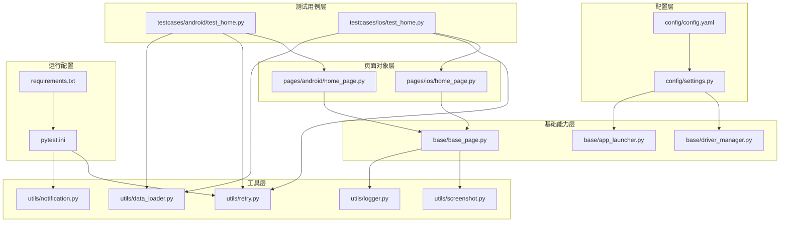
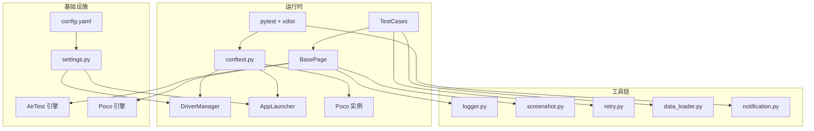
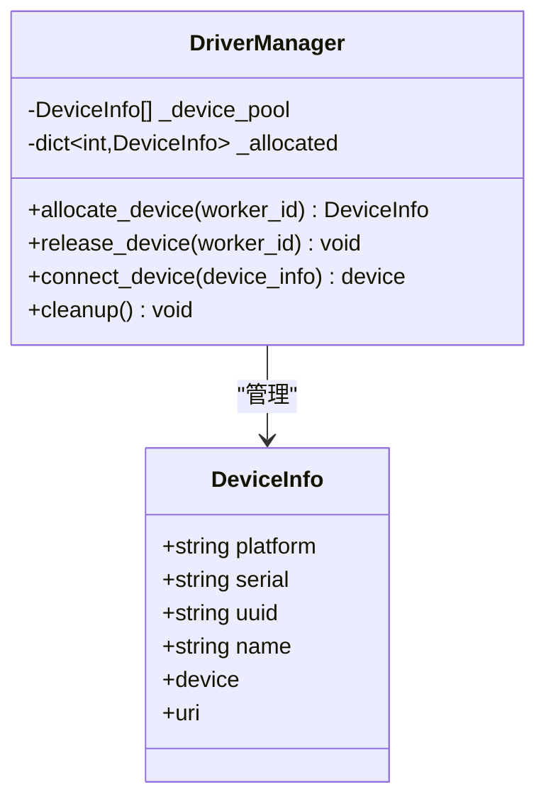
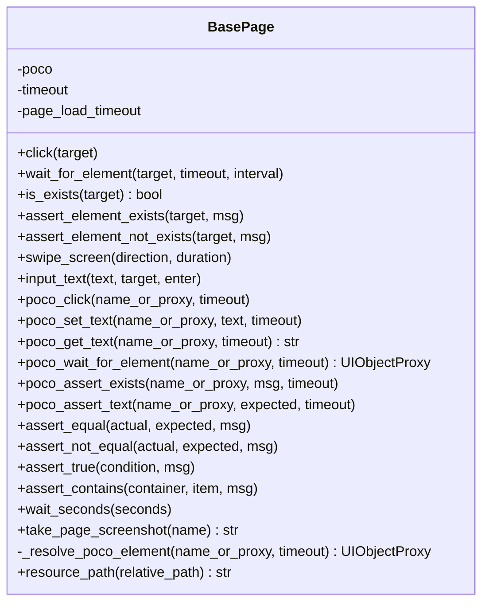
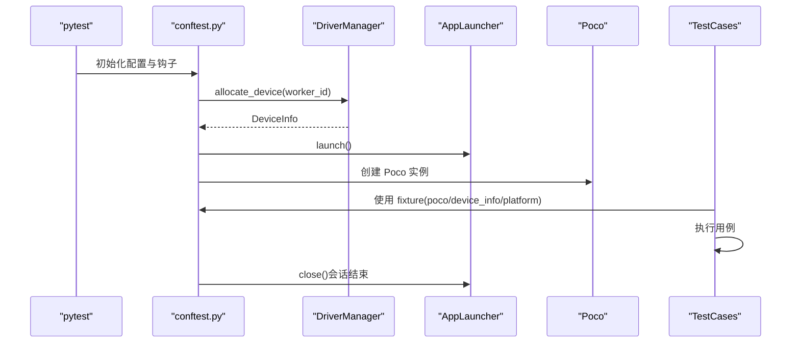
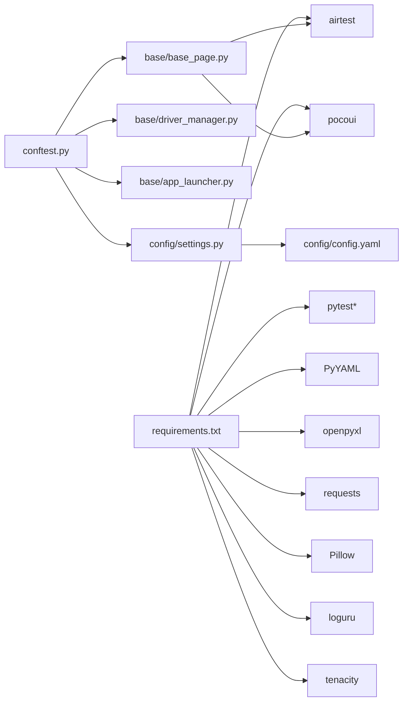

# 项目概述

<cite>
**本文引用的文件**
- [requirements.txt](file://requirements.txt)
- [pytest.ini](file://pytest.ini)
- [conftest.py](file://conftest.py)
- [config/config.yaml](file://config/config.yaml)
- [config/settings.py](file://config/settings.py)
- [base/base_page.py](file://base/base_page.py)
- [base/driver_manager.py](file://base/driver_manager.py)
- [base/app_launcher.py](file://base/app_launcher.py)
- [pages/android/home_page.py](file://pages/android/home_page.py)
- [pages/ios/home_page.py](file://pages/ios/home_page.py)
- [testcases/android/test_home.py](file://testcases/android/test_home.py)
- [testcases/ios/test_home.py](file://testcases/ios/test_home.py)
- [utils/retry.py](file://utils/retry.py)
- [utils/logger.py](file://utils/logger.py)
- [utils/screenshot.py](file://utils/screenshot.py)
- [utils/data_loader.py](file://utils/data_loader.py)
- [utils/notification.py](file://utils/notification.py)
</cite>

## 目录
1. [引言](#引言)
2. [项目结构](#项目结构)
3. [核心组件](#核心组件)
4. [架构总览](#架构总览)
5. [详细组件分析](#详细组件分析)
6. [依赖关系分析](#依赖关系分析)
7. [性能考虑](#性能考虑)
8. [故障排查指南](#故障排查指南)
9. [结论](#结论)
10. [附录](#附录)

## 引言
AirTestUI 是一个面向移动端（Android/iOS）的跨平台自动化测试框架，以“AirTest + Poco”双引擎为核心，提供图像识别与 UI 树定位相结合的双重技术方案，支持多设备并发、智能重试、全链路日志与报告集成，帮助团队高效构建稳定可靠的移动端自动化测试体系。该框架通过统一的 Page Object 基类、设备驱动管理、APP 生命周期管理、数据驱动与通知机制，形成从测试用例到执行、报告与反馈的完整闭环。

## 项目结构
项目采用按功能域分层与按平台拆分的组织方式：
- base：基础能力层，包含页面基类、设备驱动管理、APP 启停管理
- config：配置层，集中管理全局配置与环境变量覆盖
- pages：页面对象层，按平台划分（android/ios）
- testcases：测试用例层，按平台划分（android/ios），配合 pytest 标记与并发策略
- utils：工具层，提供日志、截图、重试、数据加载、通知等通用能力
- resources：资源层，存放图像模板等资源文件
- data：测试数据层，支持 YAML/Excel/JSON 等格式
- 根目录：测试运行配置（pytest.ini）、依赖声明（requirements.txt）

图表来源
- [config/config.yaml:1-70](file://config/config.yaml#L1-L70)
- [config/settings.py:1-112](file://config/settings.py#L1-L112)
- [base/base_page.py:1-320](file://base/base_page.py#L1-L320)
- [base/driver_manager.py:1-188](file://base/driver_manager.py#L1-L188)
- [base/app_launcher.py:1-127](file://base/app_launcher.py#L1-L127)
- [pages/android/home_page.py:1-58](file://pages/android/home_page.py#L1-L58)
- [pages/ios/home_page.py:1-43](file://pages/ios/home_page.py#L1-L43)
- [testcases/android/test_home.py:1-48](file://testcases/android/test_home.py#L1-L48)
- [testcases/ios/test_home.py:1-38](file://testcases/ios/test_home.py#L1-L38)
- [utils/retry.py:1-102](file://utils/retry.py#L1-L102)
- [utils/logger.py:1-59](file://utils/logger.py#L1-L59)
- [utils/screenshot.py:1-89](file://utils/screenshot.py#L1-L89)
- [utils/data_loader.py:1-128](file://utils/data_loader.py#L1-L128)
- [utils/notification.py:1-167](file://utils/notification.py#L1-L167)
- [pytest.ini:1-47](file://pytest.ini#L1-L47)
- [requirements.txt:1-21](file://requirements.txt#L1-L21)

章节来源
- [pytest.ini:1-47](file://pytest.ini#L1-L47)
- [requirements.txt:1-21](file://requirements.txt#L1-L21)

## 核心组件
- 配置系统：集中管理环境、超时、设备、APP、截图、重试、报告与通知等配置，支持环境变量覆盖与本地覆盖文件
- 设备驱动管理：统一管理 Android/iOS 设备连接、分配与生命周期，支持多设备并发与复用
- APP 启停管理：按平台启动/关闭/重启应用，支持安装与数据清理
- 页面对象基类：封装 AirTest 图像识别与 Poco UI 树定位，提供统一的断言、等待、截图与 Allure 步骤记录
- 测试执行与并发：基于 pytest + xdist 的多设备并发执行，结合 reruns 实现智能重试
- 工具链：日志、截图、重试装饰器、数据加载、通知（钉钉/邮件）

章节来源
- [config/config.yaml:1-70](file://config/config.yaml#L1-L70)
- [config/settings.py:1-112](file://config/settings.py#L1-L112)
- [base/driver_manager.py:1-188](file://base/driver_manager.py#L1-L188)
- [base/app_launcher.py:1-127](file://base/app_launcher.py#L1-L127)
- [base/base_page.py:1-320](file://base/base_page.py#L1-L320)
- [pytest.ini:1-47](file://pytest.ini#L1-L47)
- [utils/retry.py:1-102](file://utils/retry.py#L1-L102)
- [utils/logger.py:1-59](file://utils/logger.py#L1-L59)
- [utils/screenshot.py:1-89](file://utils/screenshot.py#L1-L89)
- [utils/data_loader.py:1-128](file://utils/data_loader.py#L1-L128)
- [utils/notification.py:1-167](file://utils/notification.py#L1-L167)

## 架构总览
AirTestUI 的整体架构围绕“配置 → 基础设施 → 页面对象 → 测试用例 → 工具链”的层次展开，核心在于：
- 双引擎融合：AirTest 提供稳定的图像识别与设备交互能力；Poco 提供基于 UI 树的精准定位与文本断言，二者互补，提升稳定性与可维护性
- 多设备并发：通过 pytest-xdist 与自研设备池实现多 worker 并发调度，最大化硬件利用率
- 智能重试：结合 pytest-rerunfailures 与自定义重试装饰器，降低偶发失败对测试结果的影响
- 全链路可观测：Allure 报告、结构化日志、失败截图与通知联动，快速定位问题

图表来源
- [conftest.py:1-255](file://conftest.py#L1-L255)
- [base/driver_manager.py:1-188](file://base/driver_manager.py#L1-L188)
- [base/app_launcher.py:1-127](file://base/app_launcher.py#L1-L127)
- [base/base_page.py:1-320](file://base/base_page.py#L1-L320)
- [config/config.yaml:1-70](file://config/config.yaml#L1-L70)
- [config/settings.py:1-112](file://config/settings.py#L1-L112)
- [utils/logger.py:1-59](file://utils/logger.py#L1-L59)
- [utils/screenshot.py:1-89](file://utils/screenshot.py#L1-L89)
- [utils/retry.py:1-102](file://utils/retry.py#L1-L102)
- [utils/data_loader.py:1-128](file://utils/data_loader.py#L1-L128)
- [utils/notification.py:1-167](file://utils/notification.py#L1-L167)

## 详细组件分析

### 配置系统（config）
- 功能要点
  - 读取 config.yaml，支持环境变量覆盖与本地覆盖文件合并
  - 暴露便捷访问函数：环境、超时、设备列表、APP 配置等
  - 支持 Android/iOS 双平台设备与 APP 的独立配置
- 关键配置项
  - 运行环境、超时（元素等待、页面加载、APP 启动）
  - 截图策略（失败时截图、保存目录）
  - 重试策略（最大次数、间隔）
  - 报告与通知（Allure 目录、HTML 报告、通知开关与类型）

章节来源
- [config/config.yaml:1-70](file://config/config.yaml#L1-L70)
- [config/settings.py:1-112](file://config/settings.py#L1-L112)

### 设备驱动管理（base/driver_manager.py）
- 功能要点
  - 单例设备池：按 worker 分配/释放设备，支持复用
  - 设备连接：根据平台生成 URI 并建立连接
  - 线程安全：分配与释放加锁，避免竞态
- 关键类与方法
  - DeviceInfo：封装平台、序列号/UUID、名称与设备实例
  - DriverManager：初始化设备池、分配/释放设备、连接/断开生命周期管理

图表来源
- [base/driver_manager.py:20-188](file://base/driver_manager.py#L20-L188)

章节来源
- [base/driver_manager.py:1-188](file://base/driver_manager.py#L1-L188)

### APP 启停管理（base/app_launcher.py）
- 功能要点
  - 自动区分 Android/iOS 启动方式与 Activity
  - 可选安装、关闭、重启、清除数据
  - 启动后等待与状态检测
- 关键方法
  - launch/close/restart/clear_data/_install_if_needed/is_app_running

章节来源
- [base/app_launcher.py:1-127](file://base/app_launcher.py#L1-L127)

### 页面对象基类（base/base_page.py）
- 功能要点
  - 图像识别：点击、等待、存在性断言、滑动、输入文本
  - Poco UI 树：点击、设置文本、获取文本、等待、断言
  - 通用断言与工具：相等/不相等、包含、显式等待、截图并附加 Allure
  - 资源路径：统一资源文件绝对路径生成
- 双引擎协同
  - 若未提供 Poco 实例，则回退至图像识别模式
  - 在 Poco 可用时优先使用 UI 树定位，增强稳定性与可维护性

图表来源
- [base/base_page.py:30-320](file://base/base_page.py#L30-L320)

章节来源
- [base/base_page.py:1-320](file://base/base_page.py#L1-L320)

### 测试执行与并发（conftest.py + pytest.ini）
- 功能要点
  - 自动标记平台（android/ios），注入设备与 Poco 实例
  - 多设备并发：基于 worker_id 分配设备，支持复用
  - 自动 APP 生命周期：会话开始前启动，结束后关闭
  - Allure 步骤记录、失败截图、测试结果统计与通知
- 关键特性
  - 使用 pytest-xdist + loadfile 分发策略
  - 结合 reruns 实现失败重跑
  - 自定义标记：冒烟/回归/P0-P2/跳过CI等

图表来源
- [conftest.py:140-255](file://conftest.py#L140-L255)
- [base/driver_manager.py:119-150](file://base/driver_manager.py#L119-L150)
- [base/app_launcher.py:49-93](file://base/app_launcher.py#L49-L93)

章节来源
- [conftest.py:1-255](file://conftest.py#L1-L255)
- [pytest.ini:1-47](file://pytest.ini#L1-L47)

### 工具链
- 日志（utils/logger.py）
  - 基于 loguru，控制台彩色输出与文件轮转，支持 DEBUG/ERROR 多级别
- 截图（utils/screenshot.py）
  - 统一截图保存目录与命名，失败自动截图并附加 Allure
- 重试（utils/retry.py）
  - 通用重试装饰器与“直到为真”重试，支持异常类型过滤与回调
- 数据加载（utils/data_loader.py）
  - 支持 YAML/JSON/Excel，提供 parametrize 数据格式化
- 通知（utils/notification.py）
  - 钉钉机器人与邮件通知，支持签名与 HTML 内容

章节来源
- [utils/logger.py:1-59](file://utils/logger.py#L1-L59)
- [utils/screenshot.py:1-89](file://utils/screenshot.py#L1-L89)
- [utils/retry.py:1-102](file://utils/retry.py#L1-L102)
- [utils/data_loader.py:1-128](file://utils/data_loader.py#L1-L128)
- [utils/notification.py:1-167](file://utils/notification.py#L1-L167)

## 依赖关系分析
- 运行时依赖
  - pytest 及扩展：pytest-xdist、pytest-html、allure-pytest、pytest-rerunfailures
  - AirTest 与 Poco：移动端设备连接与 UI 树定位
  - 数据与工具：PyYAML、openpyxl、requests、Pillow、loguru、tenacity
- 代码耦合
  - conftest.py 与 DriverManager/AppLauncher/Page 强耦合，是执行入口
  - BasePage 同时依赖 AirTest 与 Poco，体现双引擎设计
  - 配置模块被各层广泛依赖，形成中心化配置

图表来源
- [requirements.txt:1-21](file://requirements.txt#L1-L21)
- [conftest.py:1-255](file://conftest.py#L1-L255)
- [base/driver_manager.py:1-188](file://base/driver_manager.py#L1-L188)
- [base/app_launcher.py:1-127](file://base/app_launcher.py#L1-L127)
- [base/base_page.py:1-320](file://base/base_page.py#L1-L320)
- [config/settings.py:1-112](file://config/settings.py#L1-L112)
- [config/config.yaml:1-70](file://config/config.yaml#L1-L70)

章节来源
- [requirements.txt:1-21](file://requirements.txt#L1-L21)

## 性能考虑
- 多设备并发
  - 使用 pytest-xdist 的 loadfile 分发策略，按文件粒度均衡任务
  - 设备池按 worker 分配，必要时复用设备，减少连接/启动成本
- 重试与稳定性
  - 结合 pytest-rerunfailures 与自定义重试装饰器，降低偶发失败影响
  - Poco 优先策略在 UI 树可用时减少图像误差
- I/O 与存储
  - 截图目录与日志轮转配置，避免磁盘占用过大
  - 数据加载支持流式读取 Excel，减少内存峰值

## 故障排查指南
- 设备连接失败
  - 检查 config.yaml 中设备序列号/UUID 与名称配置
  - 查看 DriverManager 的连接日志与错误堆栈
- Poco 初始化失败
  - conftest 中会降级为图像识别模式，确认平台与设备兼容性
- 截图与报告
  - 失败自动截图并附加 Allure；检查截图目录权限与空间
  - Allure 报告目录由 pytest.ini 配置，确保 clean 选项与输出路径正确
- 通知失败
  - 钉钉/邮件配置需完整，检查网络连通性与凭据
- 数据加载异常
  - 确认数据文件路径与格式，查看 DataLoader 的日志提示

章节来源
- [base/driver_manager.py:103-150](file://base/driver_manager.py#L103-L150)
- [conftest.py:185-208](file://conftest.py#L185-L208)
- [utils/screenshot.py:28-53](file://utils/screenshot.py#L28-L53)
- [utils/notification.py:22-48](file://utils/notification.py#L22-L48)
- [utils/data_loader.py:18-37](file://utils/data_loader.py#L18-L37)

## 结论
AirTestUI 通过 AirTest 与 Poco 的深度融合，结合多设备并发、智能重试、全链路日志与报告、通知与数据驱动等能力，形成了高可用、易维护、可扩展的移动端自动化测试解决方案。对于初学者，框架提供了清晰的 Page Object 与平台化目录结构；对于有经验的开发者，框架在并发、稳定性与可观测性方面提供了完善的工程化支撑。

## 附录
- 实际使用场景与价值主张示例
  - 跨平台回归测试：同一套用例同时覆盖 Android 与 iOS，显著降低维护成本
  - 多设备并行：在 CI 中利用多设备并行缩短测试周期
  - 智能重试：降低因网络抖动或系统弹窗导致的误报
  - 可视化报告：Allure 报告与失败截图帮助快速定位问题
  - 通知联动：测试完成后自动推送结果，提升协作效率