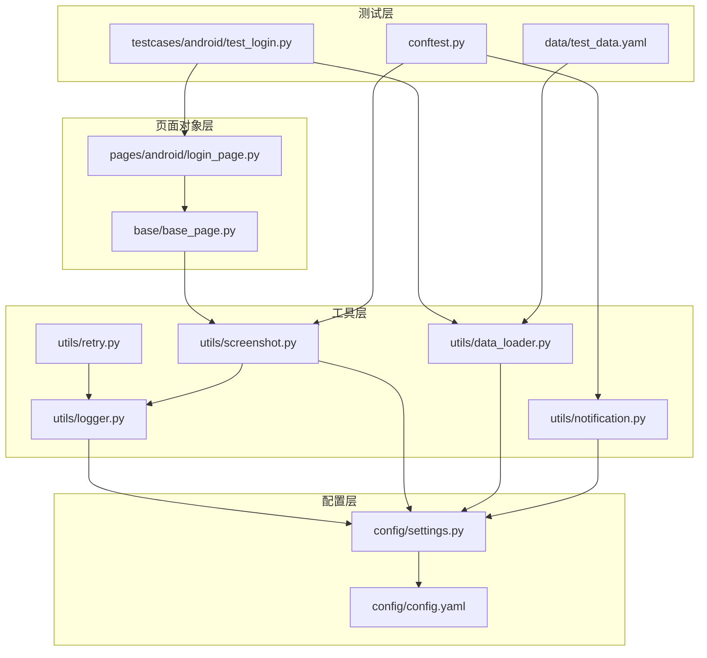
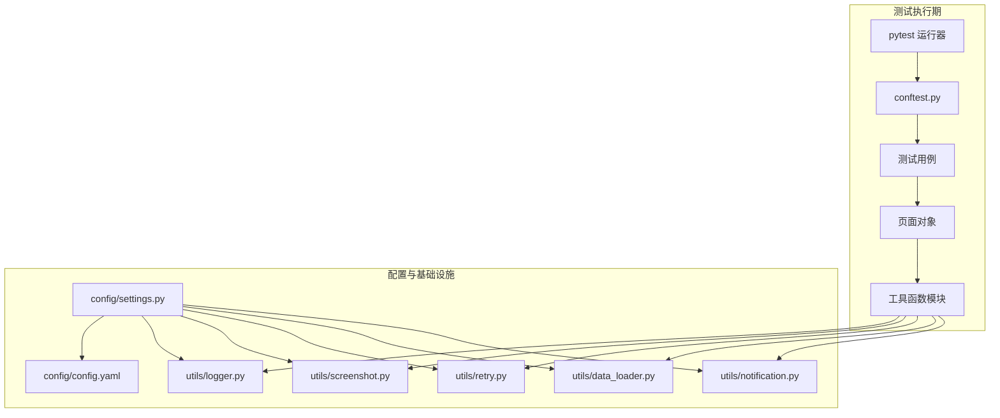
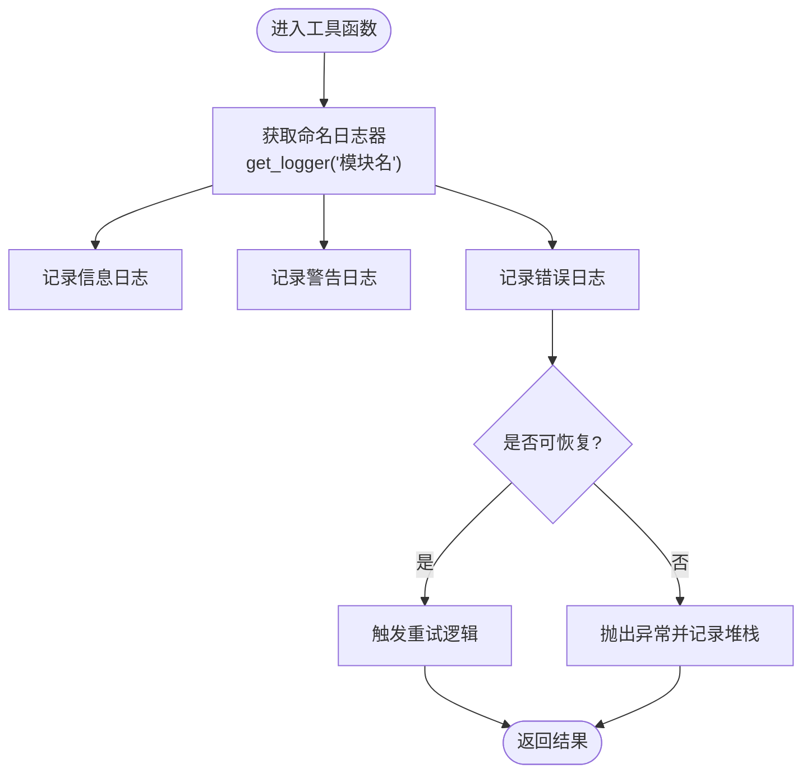
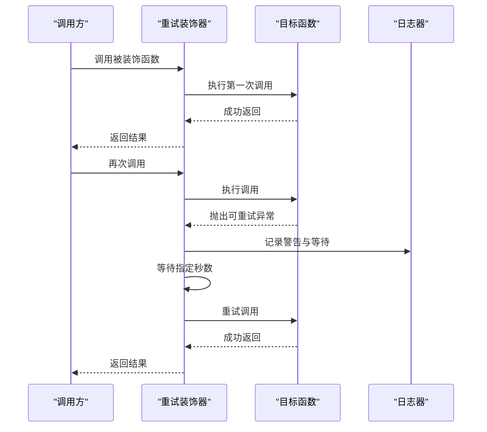
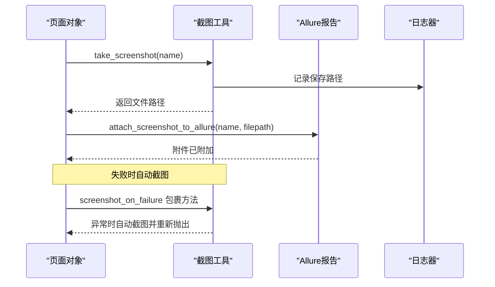
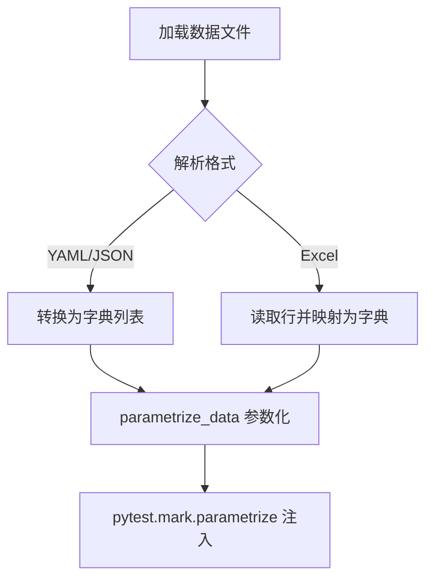
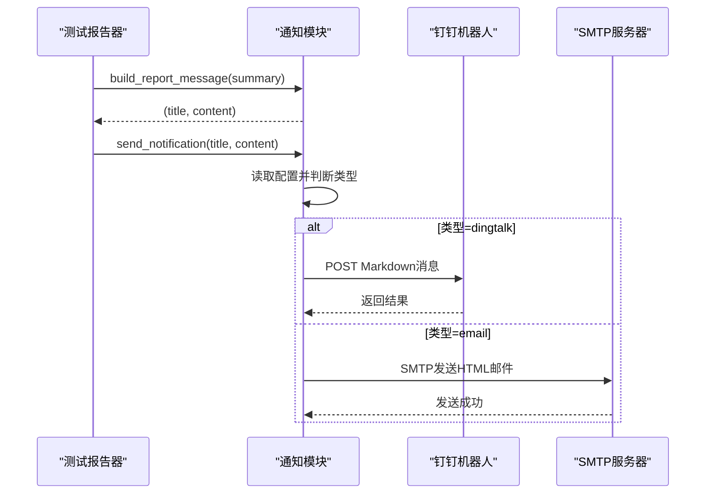
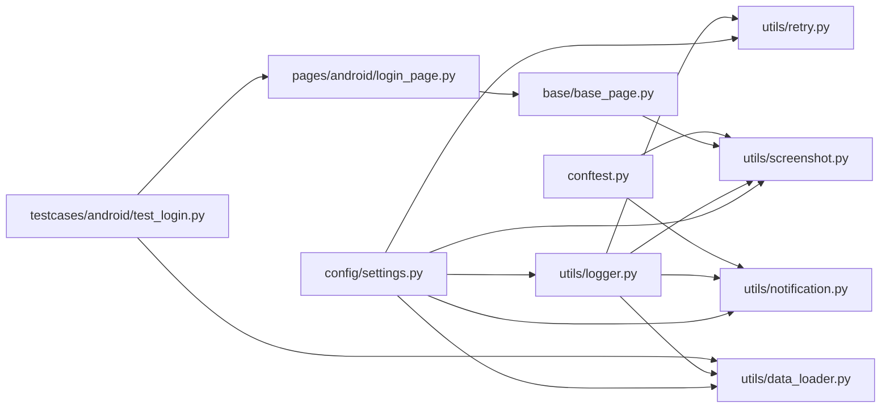

# 工具函数扩展开发

<cite>
**本文档引用的文件**
- [logger.py](file://utils/logger.py)
- [retry.py](file://utils/retry.py)
- [screenshot.py](file://utils/screenshot.py)
- [data_loader.py](file://utils/data_loader.py)
- [notification.py](file://utils/notification.py)
- [settings.py](file://config/settings.py)
- [config.yaml](file://config/config.yaml)
- [conftest.py](file://conftest.py)
- [base_page.py](file://base/base_page.py)
- [login_page.py](file://pages/android/login_page.py)
- [test_login.py](file://testcases/android/test_login.py)
- [test_data.yaml](file://data/test_data.yaml)
- [requirements.txt](file://requirements.txt)
</cite>

## 目录
1. [简介](#简介)
2. [项目结构](#项目结构)
3. [核心组件](#核心组件)
4. [架构概览](#架构概览)
5. [详细组件分析](#详细组件分析)
6. [依赖分析](#依赖分析)
7. [性能考虑](#性能考虑)
8. [故障排除指南](#故障排除指南)
9. [结论](#结论)
10. [附录](#附录)

## 简介
本文件面向在 AirTestUI 项目上进行工具函数扩展开发的工程师，系统性阐述如何在现有工具模块基础上开发自定义工具函数，涵盖以下主题：
- 日志系统的扩展与自定义格式化
- 特殊重试策略的实现与智能重试算法
- 定制化截图功能的开发与批量截图能力
- 工具函数的设计原则与编码规范（函数签名、异常处理、性能优化）
- 扩展示例与最佳实践
- 工具函数的测试方法与质量保证措施

AirTestUI 是一个基于 AirTest/Poco 的跨平台自动化测试框架，采用分层架构：配置层、工具层、页面对象层、测试用例层。工具层提供日志、重试、截图、数据加载、通知等通用能力，是扩展开发的重点。

## 项目结构
项目采用按功能域划分的目录组织方式，核心工具模块位于 utils/ 目录，配置由 config/ 提供，页面对象位于 base/ 与 pages/，测试用例位于 testcases/，测试数据位于 data/。

**图表来源**
- [settings.py:1-112](file://config/settings.py#L1-L112)
- [config.yaml:1-70](file://config/config.yaml#L1-L70)
- [logger.py:1-59](file://utils/logger.py#L1-L59)
- [retry.py:1-102](file://utils/retry.py#L1-L102)
- [screenshot.py:1-89](file://utils/screenshot.py#L1-L89)
- [data_loader.py:1-128](file://utils/data_loader.py#L1-L128)
- [notification.py:1-167](file://utils/notification.py#L1-L167)
- [base_page.py:1-320](file://base/base_page.py#L1-L320)
- [login_page.py:1-107](file://pages/android/login_page.py#L1-L107)
- [conftest.py:1-255](file://conftest.py#L1-L255)
- [test_login.py:1-71](file://testcases/android/test_login.py#L1-L71)
- [test_data.yaml:1-70](file://data/test_data.yaml#L1-L70)

**章节来源**
- [settings.py:1-112](file://config/settings.py#L1-L112)
- [config.yaml:1-70](file://config/config.yaml#L1-L70)
- [conftest.py:1-255](file://conftest.py#L1-L255)

## 核心组件
本节对工具层五大核心模块进行深入分析，包括职责边界、关键函数、异常处理与性能特征，并给出扩展建议。

- 日志模块（utils/logger.py）
  - 职责：基于 loguru 提供结构化日志，支持控制台彩色输出与文件轮转，按级别分离全量与错误日志。
  - 关键点：通过 get_logger(name) 返回绑定模块名的 logger；日志目录由配置 ROOT_DIR 决定；格式化字符串可按需扩展。
  - 扩展建议：新增自定义字段（如设备序列号、工作线程 ID）、动态级别切换、异步写入等。

- 重试模块（utils/retry.py）
  - 职责：提供通用重试装饰器与“条件满足即停止”的重试装饰器，支持指数退避与回调钩子。
  - 关键点：retry(max_attempts, wait_between, retry_on, on_retry)；retry_until_true(max_attempts, interval)。
  - 扩展建议：引入抖动、指数退避上限、条件重试（基于异常类型或业务状态）、并发安全的重试计数。

- 截图模块（utils/screenshot.py）
  - 职责：统一截图保存、命名与 Allure 附件；提供失败自动截图装饰器。
  - 关键点：take_screenshot(name, device)、attach_screenshot_to_allure(name, filepath)、screenshot_on_failure。
  - 扩展建议：批量截图（按步骤或时间窗口）、高分辨率/缩略图、多设备并行截图、截图压缩与去重。

- 数据加载模块（utils/data_loader.py）
  - 职责：支持 YAML/Excel/JSON 的测试数据加载与 pytest.mark.parametrize 参数化。
  - 关键点：load_yaml/load_json/load_excel、parametrize_data、路径解析与容错。
  - 扩展建议：支持 CSV、数据库直连、远程配置中心、缓存与增量更新。

- 通知模块（utils/notification.py）
  - 职责：支持钉钉机器人与邮件通知，构建测试报告消息模板。
  - 关键点：send_notification(title, content)、build_report_message(summary)。
  - 扩展建议：增加企业微信、飞书、Webhook 等通知渠道；支持富文本与图片附件。

**章节来源**
- [logger.py:1-59](file://utils/logger.py#L1-L59)
- [retry.py:1-102](file://utils/retry.py#L1-L102)
- [screenshot.py:1-89](file://utils/screenshot.py#L1-L89)
- [data_loader.py:1-128](file://utils/data_loader.py#L1-L128)
- [notification.py:1-167](file://utils/notification.py#L1-L167)

## 架构概览
下图展示了工具函数在测试生命周期中的交互关系，以及与配置、页面对象、测试用例的集成方式。

**图表来源**
- [conftest.py:1-255](file://conftest.py#L1-L255)
- [settings.py:1-112](file://config/settings.py#L1-L112)
- [config.yaml:1-70](file://config/config.yaml#L1-L70)
- [logger.py:1-59](file://utils/logger.py#L1-L59)
- [screenshot.py:1-89](file://utils/screenshot.py#L1-L89)
- [retry.py:1-102](file://utils/retry.py#L1-L102)
- [data_loader.py:1-128](file://utils/data_loader.py#L1-L128)
- [notification.py:1-167](file://utils/notification.py#L1-L167)

## 详细组件分析

### 日志系统扩展开发
- 设计原则
  - 结构化：统一字段（时间、级别、模块、函数、行号、消息），便于检索与聚合。
  - 分级：区分 INFO/DEBUG/WARNING/ERROR，不同输出介质与保留策略。
  - 可配置：通过 config.yaml 与环境变量覆盖，支持多环境差异化。
- 编码规范
  - 使用 get_logger("模块名") 创建命名空间隔离的日志器。
  - 在工具函数内部统一调用日志器，避免直接 print。
  - 异常场景记录上下文信息（如设备序列号、请求 ID、重试次数）。
- 扩展示例思路
  - 自定义格式：在 logger.py 中新增 format 字段，添加设备 ID、线程 ID、会话 ID 等。
  - 动态级别：根据环境变量或配置项动态调整日志级别。
  - 异步写入：结合 loguru 的 sink 回调，实现异步落盘以降低阻塞。

**图表来源**
- [logger.py:50-59](file://utils/logger.py#L50-L59)

**章节来源**
- [logger.py:1-59](file://utils/logger.py#L1-L59)
- [settings.py:1-112](file://config/settings.py#L1-L112)
- [config.yaml:1-70](file://config/config.yaml#L1-L70)

### 特殊重试策略实现
- 设计原则
  - 明确重试边界：仅对幂等或可安全重试的操作使用重试。
  - 可观测性：记录每次重试的原因、等待时间、回调状态。
  - 可配置：最大次数、等待间隔、触发异常类型、回调钩子。
- 编码规范
  - 使用 retry 装饰器包装易波动的操作（网络请求、元素等待、设备连接）。
  - 使用 retry_until_true 包装条件型任务（页面加载完成、元素出现）。
  - 在 on_retry 回调中上报状态、记录上下文，便于问题定位。
- 扩展示例思路
  - 智能重试：根据异常类型与响应状态动态调整等待时间（如 502/503 增加等待，超时减少等待）。
  - 并发安全：在多线程/多进程场景下，确保重试计数与状态隔离。
  - 指数退避上限：防止无限增长导致总耗时过长。

**图表来源**
- [retry.py:13-65](file://utils/retry.py#L13-L65)

**章节来源**
- [retry.py:1-102](file://utils/retry.py#L1-L102)

### 定制化截图功能开发
- 设计原则
  - 统一命名与存储：按模块/用例/时间戳命名，目录可配置。
  - Allure 集成：自动附加到报告，便于回溯。
  - 失败自动截图：在异常时快速定位问题。
- 编码规范
  - 使用 take_screenshot(name, device) 生成截图并返回路径。
  - 使用 attach_screenshot_to_allure(name, filepath) 附加到 Allure。
  - 使用 screenshot_on_failure 装饰器在方法失败时自动截图。
- 扩展示例思路
  - 批量截图：在关键步骤间自动截图，形成“操作轨迹”。
  - 多分辨率适配：根据设备分辨率生成不同尺寸的截图。
  - 压缩与去重：对重复内容进行去重，压缩存储以节省空间。

**图表来源**
- [screenshot.py:28-89](file://utils/screenshot.py#L28-L89)

**章节来源**
- [screenshot.py:1-89](file://utils/screenshot.py#L1-L89)
- [base_page.py:279-285](file://base/base_page.py#L279-L285)
- [conftest.py:119-138](file://conftest.py#L119-L138)

### 数据驱动与参数化
- 设计原则
  - 支持多种格式：YAML/JSON/Excel，满足不同团队习惯。
  - 参数化：直接对接 pytest.mark.parametrize，简化用例组合。
  - 容错与校验：对空数据、缺失键、类型不匹配进行处理。
- 编码规范
  - 使用 parametrize_data(filepath, key) 获取参数列表。
  - 使用 load_yaml/load_json/load_excel 单独加载数据。
  - 在测试用例中通过 fixture 注入数据加载器。
- 扩展示例思路
  - 增量更新：监听数据文件变化，热更新参数。
  - 远程配置：从配置中心拉取数据，支持加密与签名。
  - 多维参数化：支持笛卡尔积与组合参数，生成大规模用例集。

**图表来源**
- [data_loader.py:85-120](file://utils/data_loader.py#L85-L120)

**章节来源**
- [data_loader.py:1-128](file://utils/data_loader.py#L1-L128)
- [test_data.yaml:1-70](file://data/test_data.yaml#L1-L70)
- [conftest.py:238-255](file://conftest.py#L238-L255)
- [test_login.py:1-71](file://testcases/android/test_login.py#L1-L71)

### 通知系统扩展
- 设计原则
  - 可插拔：支持多种通知渠道，按配置启用。
  - 模板化：统一报告格式，便于阅读与传播。
  - 容错：网络异常不影响主流程，记录失败原因。
- 编码规范
  - 通过 settings.notification 配置开关、类型与凭据。
  - 使用 send_notification(title, content) 发送通知。
  - 使用 build_report_message(summary) 生成报告内容。
- 扩展示例思路
  - 多渠道并行：同时向钉钉、邮件、企业微信发送。
  - 条件通知：仅在失败或通过率低于阈值时发送。
  - 富媒体：支持 Markdown、图片、链接等。

**图表来源**
- [notification.py:22-167](file://utils/notification.py#L22-L167)

**章节来源**
- [notification.py:1-167](file://utils/notification.py#L1-L167)
- [config.yaml:30-43](file://config/config.yaml#L30-L43)
- [conftest.py:89-117](file://conftest.py#L89-L117)

## 依赖分析
工具模块之间的依赖关系清晰，遵循“低耦合、高内聚”的原则。logger 作为基础设施被多个模块复用；retry/screenshot/dataloader/notification 作为独立工具模块，彼此无直接依赖，通过配置与日志协同工作。

**图表来源**
- [settings.py:1-112](file://config/settings.py#L1-L112)
- [logger.py:1-59](file://utils/logger.py#L1-L59)
- [retry.py:1-102](file://utils/retry.py#L1-L102)
- [screenshot.py:1-89](file://utils/screenshot.py#L1-L89)
- [data_loader.py:1-128](file://utils/data_loader.py#L1-L128)
- [notification.py:1-167](file://utils/notification.py#L1-L167)
- [base_page.py:1-320](file://base/base_page.py#L1-L320)
- [login_page.py:1-107](file://pages/android/login_page.py#L1-L107)
- [conftest.py:1-255](file://conftest.py#L1-L255)
- [test_login.py:1-71](file://testcases/android/test_login.py#L1-L71)

**章节来源**
- [requirements.txt:1-21](file://requirements.txt#L1-L21)

## 性能考虑
- 日志性能
  - 使用结构化字段与格式化字符串，避免频繁字符串拼接。
  - 文件轮转与压缩降低磁盘占用与 IO 压力。
- 重试性能
  - 合理设置等待间隔与最大次数，避免过度重试造成总耗时过长。
  - 在 on_retry 中尽量轻量操作，避免阻塞主线程。
- 截图性能
  - 控制截图频率，仅在关键节点或失败时截图。
  - 使用异步写入与压缩，减少主线程阻塞。
- 数据加载性能
  - 对大文件使用流式读取（如 Excel），避免一次性加载。
  - 缓存常用数据，减少重复 IO。
- 通知性能
  - 异步发送通知，避免阻塞测试主线程。
  - 对外网请求设置合理超时与重试。

## 故障排除指南
- 日志不输出或格式异常
  - 检查 ROOT_DIR 是否正确，日志目录是否存在。
  - 确认配置文件中日志级别与格式化字符串。
- 重试无效或过度重试
  - 核对 retry_on 异常类型是否匹配。
  - 检查 wait_between 与 max_attempts 配置是否合理。
- 截图失败或路径为空
  - 确认设备连接状态与权限。
  - 检查截图目录权限与磁盘空间。
- 数据加载报错
  - 检查文件路径与格式，确认编码一致。
  - 对于 Excel，确认工作表名称与首行键名。
- 通知发送失败
  - 核对 webhook/凭据配置，检查网络连通性。
  - 查看日志中错误码与返回信息。

**章节来源**
- [logger.py:12-47](file://utils/logger.py#L12-L47)
- [retry.py:13-65](file://utils/retry.py#L13-L65)
- [screenshot.py:28-53](file://utils/screenshot.py#L28-L53)
- [data_loader.py:18-82](file://utils/data_loader.py#L18-L82)
- [notification.py:50-126](file://utils/notification.py#L50-L126)

## 结论
通过对 AirTestUI 工具层的深入分析，我们明确了日志、重试、截图、数据加载与通知五大模块的职责与扩展点。在进行工具函数扩展开发时，应坚持结构化、可配置、可观测与高性能的原则，结合现有模块的接口与约定，快速实现高质量的自定义工具函数，并通过统一的测试与质量保障流程确保稳定性与可维护性。

## 附录
- 扩展清单
  - 日志：自定义字段、动态级别、异步写入
  - 重试：智能退避、条件重试、并发安全
  - 截图：批量截图、多分辨率、压缩去重
  - 数据：远程配置、CSV/DB、参数化增强
  - 通知：多渠道并行、条件通知、富媒体
- 测试建议
  - 单元测试：针对工具函数的关键分支与异常路径。
  - 集成测试：在 conftest.py 的钩子与 fixture 下验证端到端行为。
  - 回归测试：在真实设备/模拟器上验证截图、重试、通知的实际效果。
- 质量度量
  - 日志覆盖率：关键路径均应有日志记录。
  - 重试成功率：在波动环境中提升成功率与稳定性。
  - 截图命中率：失败用例的截图应能辅助定位问题。
  - 数据加载准确率：参数化用例应稳定通过。
  - 通知送达率：在配置正确的前提下 100% 送达。