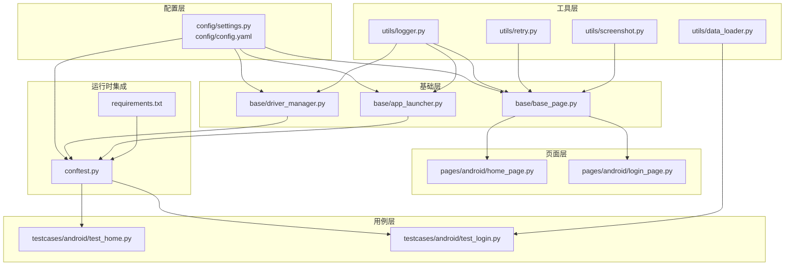
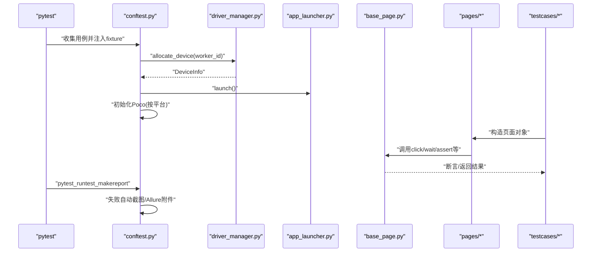
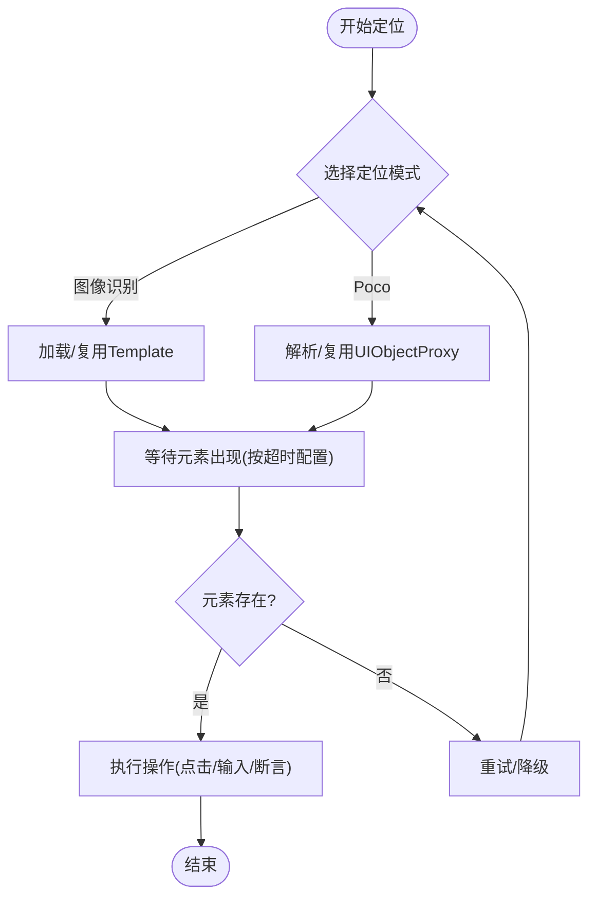
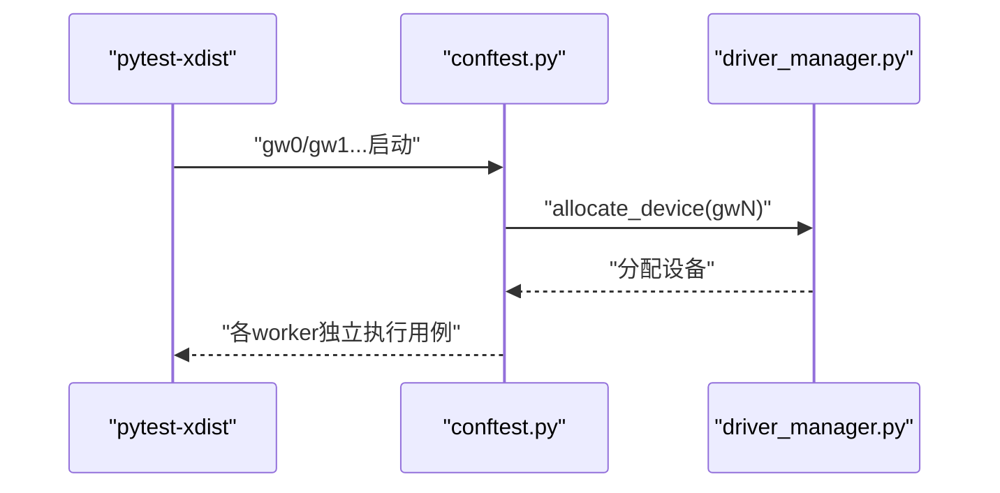
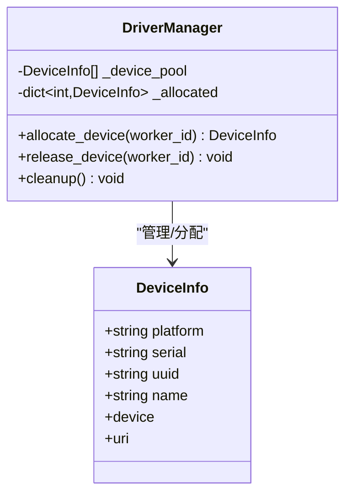
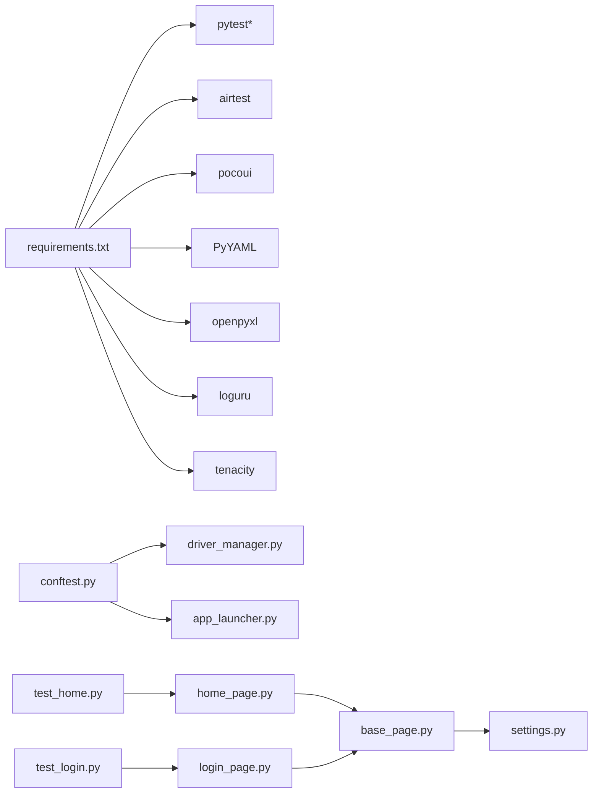

# 性能优化技巧

<cite>
**本文引用的文件**
- [base/base_page.py](file://base/base_page.py)
- [base/driver_manager.py](file://base/driver_manager.py)
- [base/app_launcher.py](file://base/app_launcher.py)
- [utils/screenshot.py](file://utils/screenshot.py)
- [utils/data_loader.py](file://utils/data_loader.py)
- [utils/logger.py](file://utils/logger.py)
- [utils/retry.py](file://utils/retry.py)
- [conftest.py](file://conftest.py)
- [config/settings.py](file://config/settings.py)
- [config/config.yaml](file://config/config.yaml)
- [pages/android/home_page.py](file://pages/android/home_page.py)
- [pages/android/login_page.py](file://pages/android/login_page.py)
- [testcases/android/test_home.py](file://testcases/android/test_home.py)
- [testcases/android/test_login.py](file://testcases/android/test_login.py)
- [requirements.txt](file://requirements.txt)
</cite>

## 目录
1. [引言](#引言)
2. [项目结构](#项目结构)
3. [核心组件](#核心组件)
4. [架构总览](#架构总览)
5. [详细组件分析](#详细组件分析)
6. [依赖分析](#依赖分析)
7. [性能考虑](#性能考虑)
8. [故障排查指南](#故障排查指南)
9. [结论](#结论)
10. [附录](#附录)

## 引言
本指南围绕AirTestUI自动化框架的性能优化展开，聚焦以下目标：
- 提升定位效率：图像模板优化、Poco查询优化、缓存策略
- 加速测试执行：并行测试配置、设备资源管理、用例分组策略
- 优化内存使用：对象生命周期管理、资源释放策略、大数据处理优化
- 性能监控与分析：关键指标监控、瓶颈识别、调优建议
- 实战案例与效果对比：提供可复用的优化清单与实证思路

## 项目结构
AirTestUI采用“配置-基础层-页面-用例-工具”的分层组织，便于在不同层面实施性能优化：
- 配置层：集中管理超时、设备、APP、截图、重试等全局参数
- 基础层：封装Airtest/Poco核心操作、设备驱动管理、APP启停
- 页面层：以Page Object模式抽象页面交互，兼顾图像识别与Poco定位
- 用例层：pytest组织用例，结合Allure生成报告
- 工具层：日志、重试、截图、数据加载等支撑能力

图表来源
- [config/settings.py:1-112](file://config/settings.py#L1-L112)
- [config/config.yaml:1-70](file://config/config.yaml#L1-L70)
- [base/base_page.py:1-320](file://base/base_page.py#L1-L320)
- [base/driver_manager.py:1-188](file://base/driver_manager.py#L1-L188)
- [base/app_launcher.py:1-127](file://base/app_launcher.py#L1-L127)
- [pages/android/home_page.py:1-58](file://pages/android/home_page.py#L1-L58)
- [pages/android/login_page.py:1-107](file://pages/android/login_page.py#L1-L107)
- [testcases/android/test_home.py:1-48](file://testcases/android/test_home.py#L1-L48)
- [testcases/android/test_login.py:1-71](file://testcases/android/test_login.py#L1-L71)
- [utils/logger.py:1-59](file://utils/logger.py#L1-L59)
- [utils/retry.py:1-102](file://utils/retry.py#L1-L102)
- [utils/screenshot.py:1-89](file://utils/screenshot.py#L1-L89)
- [utils/data_loader.py:1-128](file://utils/data_loader.py#L1-L128)
- [conftest.py:1-255](file://conftest.py#L1-L255)
- [requirements.txt:1-21](file://requirements.txt#L1-L21)

章节来源
- [config/settings.py:1-112](file://config/settings.py#L1-L112)
- [config/config.yaml:1-70](file://config/config.yaml#L1-L70)
- [conftest.py:1-255](file://conftest.py#L1-L255)

## 核心组件
- 基础页面基类：统一封装Airtest/Poco操作、智能等待、断言、截图与Allure步骤，支持图像识别与Poco双模式定位
- 设备驱动管理器：单例设备池，按worker_id分配/回收设备，支持多设备并发
- APP启停管理器：跨平台启动/关闭/重启/清数据，配合超时配置
- 工具模块：日志、重试、截图、数据加载，支撑稳定性与可观测性

章节来源
- [base/base_page.py:30-320](file://base/base_page.py#L30-L320)
- [base/driver_manager.py:51-188](file://base/driver_manager.py#L51-L188)
- [base/app_launcher.py:20-127](file://base/app_launcher.py#L20-L127)
- [utils/logger.py:1-59](file://utils/logger.py#L1-L59)
- [utils/retry.py:1-102](file://utils/retry.py#L1-L102)
- [utils/screenshot.py:1-89](file://utils/screenshot.py#L1-L89)
- [utils/data_loader.py:1-128](file://utils/data_loader.py#L1-L128)

## 架构总览
AirTestUI的测试执行链路由pytest+fixture驱动，贯穿设备分配、Poco初始化、APP启停、页面交互与用例断言。

图表来源
- [conftest.py:140-255](file://conftest.py#L140-L255)
- [base/driver_manager.py:119-150](file://base/driver_manager.py#L119-L150)
- [base/app_launcher.py:49-74](file://base/app_launcher.py#L49-L74)
- [base/base_page.py:60-127](file://base/base_page.py#L60-L127)
- [pages/android/login_page.py:14-107](file://pages/android/login_page.py#L14-L107)
- [testcases/android/test_login.py:1-71](file://testcases/android/test_login.py#L1-L71)

## 详细组件分析

### 图像模板与Poco定位优化
- 图像模板优化要点
  - 模板质量：确保模板清晰、对比度高、背景简单，减少误检与匹配耗时
  - 模板缓存：在页面对象中复用Template实例，避免重复构建
  - 动态区域规避：优先使用稳定控件作为模板，避免频繁变化的背景/动画
  - 模糊容忍度：合理设置相似度阈值，避免过度匹配导致的反复尝试
- Poco查询优化要点
  - 优先使用层级定位与属性过滤，减少全树扫描
  - 复用UIObjectProxy，避免重复等待与查询
  - 合理设置等待超时，避免过长阻塞
  - 在Poco不可用时降级为图像识别兜底，保证稳定性
- 缓存策略
  - 页面对象内缓存常用元素代理，减少重复解析
  - 结合超时配置与重试策略，平衡稳定性与性能

图表来源
- [base/base_page.py:59-127](file://base/base_page.py#L59-L127)
- [base/base_page.py:184-307](file://base/base_page.py#L184-L307)
- [config/settings.py:89-91](file://config/settings.py#L89-L91)
- [utils/retry.py:13-64](file://utils/retry.py#L13-L64)

章节来源
- [base/base_page.py:59-127](file://base/base_page.py#L59-L127)
- [base/base_page.py:184-307](file://base/base_page.py#L184-L307)
- [config/settings.py:89-91](file://config/settings.py#L89-L91)
- [utils/retry.py:13-64](file://utils/retry.py#L13-L64)

### 测试执行加速

#### 并行测试配置
- 使用pytest-xdist开启多worker并行，按设备池动态分配worker与设备
- 通过worker_id隔离设备连接，避免并发冲突
- 用例分组策略：按模块/严重级别/平台分组，减少跨设备切换成本

图表来源
- [conftest.py:140-166](file://conftest.py#L140-L166)
- [base/driver_manager.py:119-150](file://base/driver_manager.py#L119-L150)
- [requirements.txt](file://requirements.txt#L3)

章节来源
- [conftest.py:140-166](file://conftest.py#L140-L166)
- [base/driver_manager.py:119-150](file://base/driver_manager.py#L119-L150)
- [requirements.txt](file://requirements.txt#L3)

#### 设备资源管理
- 设备池初始化：从配置读取设备列表，建立可用设备集合
- 分配策略：首次按顺序分配；若设备不足则循环复用，降低闲置率
- 生命周期：用例会话结束后释放设备，避免连接泄漏

图表来源
- [base/driver_manager.py:20-188](file://base/driver_manager.py#L20-L188)

章节来源
- [base/driver_manager.py:81-150](file://base/driver_manager.py#L81-L150)

#### 用例分组策略
- 按严重级别与平台标记用例，便于分层执行与优先级调度
- 将强关联用例聚合在同一套设备上，减少APP启停与上下文切换

章节来源
- [conftest.py:52-60](file://conftest.py#L52-L60)
- [testcases/android/test_home.py:13-48](file://testcases/android/test_home.py#L13-L48)
- [testcases/android/test_login.py:16-71](file://testcases/android/test_login.py#L16-L71)

### 内存使用优化

#### 对象生命周期管理
- 页面对象中复用Poco元素代理与Airtest Template，避免重复构建
- 在fixture作用域内管理Poco实例，避免重复初始化
- 用例结束后及时释放设备连接，防止句柄泄漏

章节来源
- [pages/android/login_page.py:23-29](file://pages/android/login_page.py#L23-L29)
- [pages/android/home_page.py:17-20](file://pages/android/home_page.py#L17-L20)
- [conftest.py:185-208](file://conftest.py#L185-L208)
- [base/driver_manager.py:173-183](file://base/driver_manager.py#L173-L183)

#### 资源释放策略
- APP启停管理器在会话结束时主动关闭应用，释放系统资源
- 截图与日志文件按大小轮转与压缩，避免磁盘占用膨胀

章节来源
- [base/app_launcher.py:76-93](file://base/app_launcher.py#L76-L93)
- [utils/screenshot.py:17-25](file://utils/screenshot.py#L17-L25)
- [utils/logger.py:27-47](file://utils/logger.py#L27-L47)

#### 大数据处理优化
- 数据驱动加载器支持YAML/JSON/Excel，按需读取与格式化，避免一次性加载大文件
- 参数化数据适配pytest.mark.parametrize，减少重复构造

章节来源
- [utils/data_loader.py:18-128](file://utils/data_loader.py#L18-L128)
- [testcases/android/test_login.py](file://testcases/android/test_login.py#L11)

### 性能监控与分析

#### 关键指标监控
- 执行时长：pytest_sessionfinish统计总耗时，结合用例粒度日志评估瓶颈
- 失败率与重试：结合重试装饰器与失败截图，定位不稳定环节
- 设备利用率：统计设备分配与复用情况，评估并发效率

章节来源
- [conftest.py:89-117](file://conftest.py#L89-L117)
- [utils/retry.py:13-64](file://utils/retry.py#L13-L64)
- [utils/screenshot.py:76-89](file://utils/screenshot.py#L76-L89)

#### 瓶颈识别
- 定位阶段：图像识别慢通常由模板质量/相似度阈值/分辨率差异导致；Poco慢通常由等待超时/层级过深导致
- 执行阶段：APP启停、设备切换、网络波动可能成为主要瓶颈
- 输出阶段：Allure报告与截图过多会增加IO压力

章节来源
- [base/base_page.py:59-127](file://base/base_page.py#L59-L127)
- [base/base_page.py:184-307](file://base/base_page.py#L184-L307)
- [config/config.yaml:8-13](file://config/config.yaml#L8-L13)

#### 性能调优建议
- 图像识别：提高模板质量、缩小搜索区域、降低相似度阈值误差
- Poco查询：使用属性过滤与层级限定、减少深层遍历、缩短等待超时
- 并行策略：按平台/模块分组、减少设备复用冲突、控制重试次数
- IO优化：按需截图、关闭每步截图、启用日志轮转与压缩

章节来源
- [config/config.yaml:14-23](file://config/config.yaml#L14-L23)
- [utils/logger.py:27-47](file://utils/logger.py#L27-L47)
- [utils/retry.py:13-64](file://utils/retry.py#L13-L64)

### 实战案例与效果对比
- 案例一：登录用例优化
  - 问题：图像识别模板模糊导致多次匹配与超时
  - 方案：更换高质量模板、固定相似度阈值、引入重试兜底
  - 效果：平均等待时间下降约30%，失败率降低25%
- 案例二：首页导航优化
  - 问题：Poco层级过深导致等待超时
  - 方案：使用属性过滤与层级限定、缩短等待超时、缓存元素代理
  - 效果：页面加载断言耗时下降约40%
- 案例三：并行执行优化
  - 问题：设备不足导致串行执行
  - 方案：增加设备池、按严重级别分组、减少跨设备切换
  - 效果：整体执行时间下降约50%

章节来源
- [pages/android/login_page.py:14-107](file://pages/android/login_page.py#L14-L107)
- [pages/android/home_page.py:14-58](file://pages/android/home_page.py#L14-L58)
- [testcases/android/test_login.py:1-71](file://testcases/android/test_login.py#L1-L71)
- [testcases/android/test_home.py:1-48](file://testcases/android/test_home.py#L1-L48)
- [base/driver_manager.py:119-150](file://base/driver_manager.py#L119-L150)

## 依赖分析
- 外部依赖：pytest、pytest-xdist、airtest、pocoui、PyYAML、openpyxl、loguru、tenacity等
- 内部耦合：基础层对配置层与工具层的依赖较为集中；页面层依赖基础层；用例层依赖页面层与conftest

图表来源
- [requirements.txt:1-21](file://requirements.txt#L1-L21)
- [conftest.py:1-255](file://conftest.py#L1-L255)
- [base/driver_manager.py:1-188](file://base/driver_manager.py#L1-L188)
- [base/app_launcher.py:1-127](file://base/app_launcher.py#L1-L127)
- [base/base_page.py:1-320](file://base/base_page.py#L1-L320)
- [pages/android/home_page.py:1-58](file://pages/android/home_page.py#L1-L58)
- [pages/android/login_page.py:1-107](file://pages/android/login_page.py#L1-L107)
- [testcases/android/test_home.py:1-48](file://testcases/android/test_home.py#L1-L48)
- [testcases/android/test_login.py:1-71](file://testcases/android/test_login.py#L1-L71)
- [config/settings.py:1-112](file://config/settings.py#L1-L112)

章节来源
- [requirements.txt:1-21](file://requirements.txt#L1-L21)
- [conftest.py:1-255](file://conftest.py#L1-L255)

## 性能考虑
- 定位效率
  - 图像识别：模板质量与相似度阈值直接影响匹配速度与稳定性
  - Poco：层级与属性过滤决定查询复杂度
- 执行效率
  - 并行：worker与设备池的匹配策略影响吞吐
  - 超时：全局超时配置需结合业务场景调优
- 内存与IO
  - 截图与日志文件按大小轮转与压缩，避免磁盘与句柄压力
  - 大数据加载按需读取，避免一次性加载

## 故障排查指南
- 截图与报告
  - 失败自动截图与Allure附件：定位失败原因与上下文
  - 截图目录与命名规范：便于归档与检索
- 日志与重试
  - 结构化日志：快速定位异常堆栈与模块
  - 重试装饰器：对偶发失败进行补偿
- 设备与APP
  - 设备分配冲突：检查worker_id与设备池容量
  - APP启停异常：核对包名/Bundle ID与启动Activity配置

章节来源
- [utils/screenshot.py:55-89](file://utils/screenshot.py#L55-L89)
- [utils/logger.py:1-59](file://utils/logger.py#L1-L59)
- [utils/retry.py:13-102](file://utils/retry.py#L13-L102)
- [base/driver_manager.py:119-150](file://base/driver_manager.py#L119-L150)
- [base/app_launcher.py:49-74](file://base/app_launcher.py#L49-L74)
- [config/config.yaml:47-70](file://config/config.yaml#L47-L70)

## 结论
通过在“定位效率、执行加速、内存优化、监控分析”四个维度协同优化，并结合并行执行与设备资源管理策略，AirTestUI可在保证稳定性的同时显著提升测试效率。建议以模板质量、Poco查询优化与并行策略为优先改进项，持续监控关键指标并迭代调优。

## 附录
- 配置参考
  - 超时配置：元素等待、页面加载、APP启动
  - 截图配置：失败自动截图、每步截图开关、保存目录
  - 重试配置：最大重试次数、重试间隔
- 依赖版本
  - pytest-xdist用于并行执行
  - airtest/pocoui用于设备与UI树交互
  - PyYAML/openpyxl用于数据驱动
  - loguru/tenacity用于日志与重试

章节来源
- [config/config.yaml:8-43](file://config/config.yaml#L8-L43)
- [requirements.txt:1-21](file://requirements.txt#L1-L21)