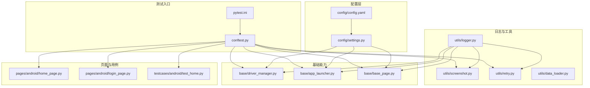
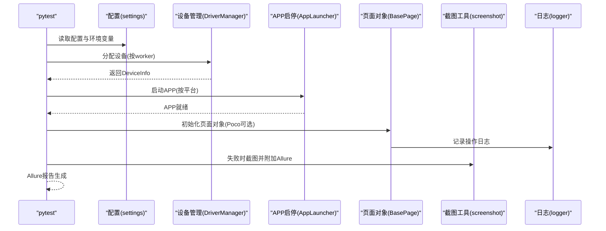
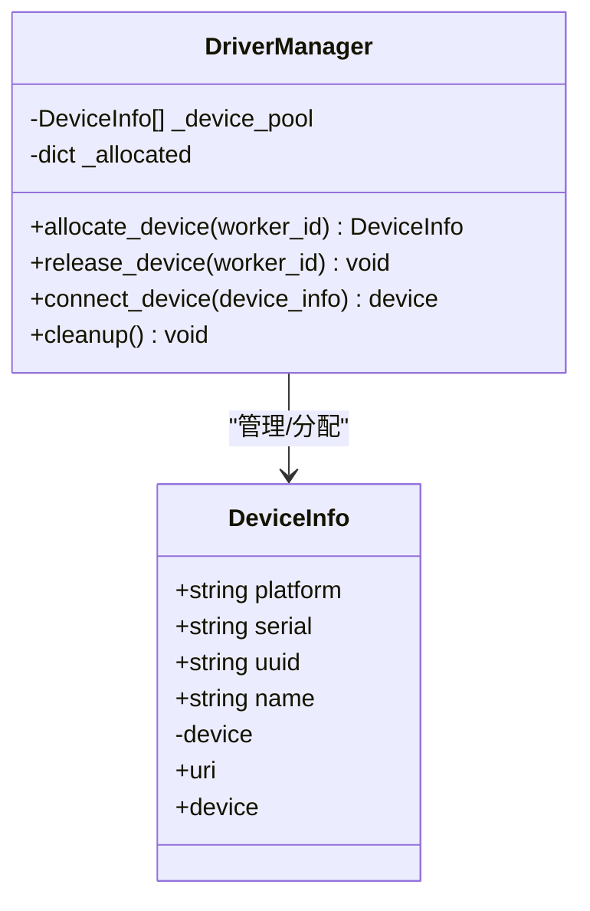
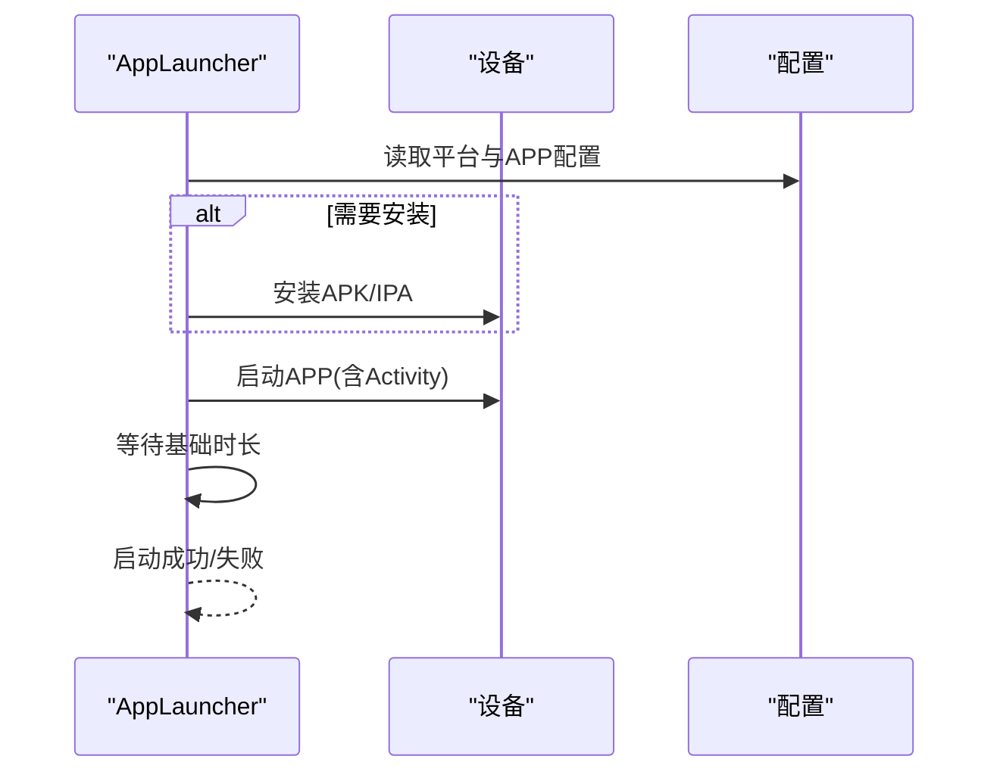
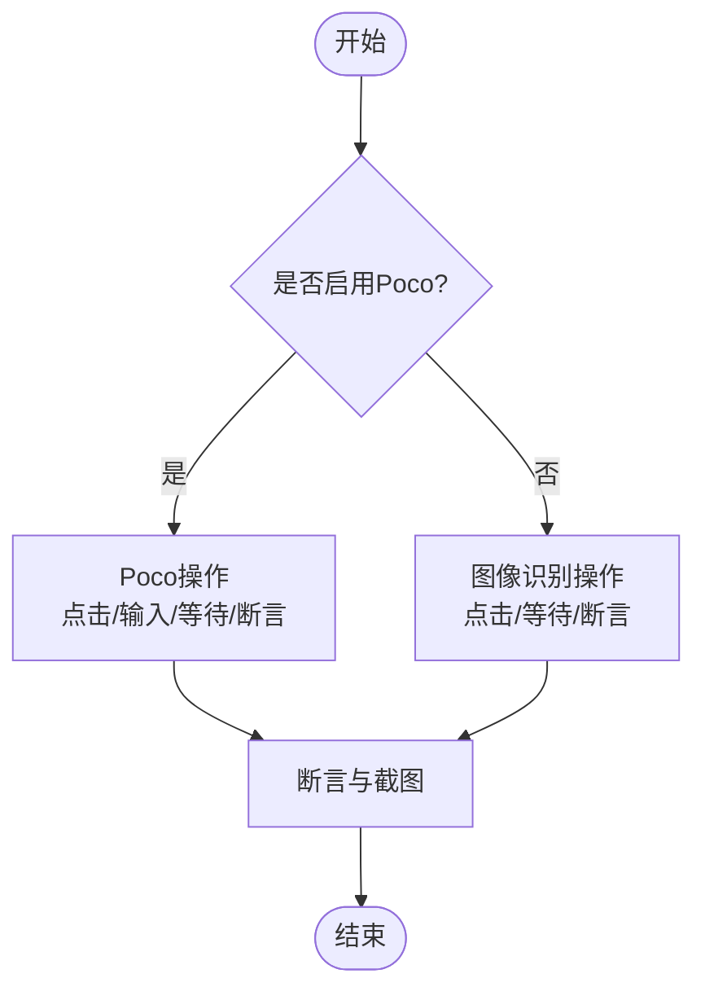
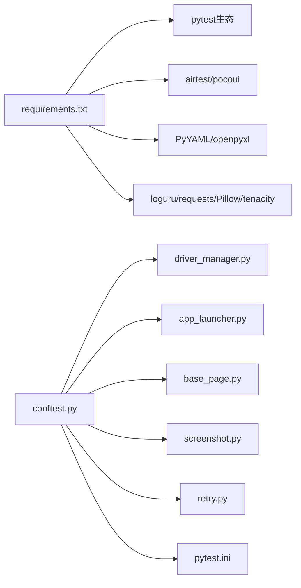
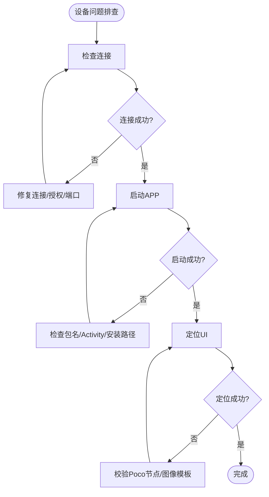

# 故障排查指南

<cite>
**本文引用的文件**
- [config.yaml](file://config/config.yaml)
- [settings.py](file://config/settings.py)
- [logger.py](file://utils/logger.py)
- [driver_manager.py](file://base/driver_manager.py)
- [app_launcher.py](file://base/app_launcher.py)
- [base_page.py](file://base/base_page.py)
- [conftest.py](file://conftest.py)
- [screenshot.py](file://utils/screenshot.py)
- [retry.py](file://utils/retry.py)
- [data_loader.py](file://utils/data_loader.py)
- [pytest.ini](file://pytest.ini)
- [requirements.txt](file://requirements.txt)
- [android\home_page.py](file://pages/android/home_page.py)
- [android\login_page.py](file://pages/android/login_page.py)
- [android\test_home.py](file://testcases/android/test_home.py)
</cite>

## 目录
1. [简介](#简介)
2. [项目结构](#项目结构)
3. [核心组件](#核心组件)
4. [架构总览](#架构总览)
5. [详细组件分析](#详细组件分析)
6. [依赖分析](#依赖分析)
7. [性能考虑](#性能考虑)
8. [故障排查指南](#故障排查指南)
9. [结论](#结论)
10. [附录](#附录)

## 简介
本指南面向AirTestUI自动化测试框架使用者，提供系统化的故障排查方法与实践建议。内容涵盖日志分析、设备问题诊断、网络环境检查、调试工具使用以及常见问题的解决方案与预防措施。文档以仓库现有代码为依据，结合配置、日志、设备管理、APP启停、页面对象、截图与重试等模块，帮助快速定位问题并恢复稳定运行。

## 项目结构
AirTestUI采用分层与职责分离的设计：配置层（config）、日志与工具层（utils）、基础能力层（base）、页面对象层（pages）、用例层（testcases）、测试入口（conftest.py、pytest.ini）。整体结构清晰，便于按模块定位问题。

图表来源
- [config.yaml:1-70](file://config/config.yaml#L1-L70)
- [settings.py:1-112](file://config/settings.py#L1-L112)
- [logger.py:1-59](file://utils/logger.py#L1-L59)
- [driver_manager.py:1-188](file://base/driver_manager.py#L1-L188)
- [app_launcher.py:1-127](file://base/app_launcher.py#L1-L127)
- [base_page.py:1-320](file://base/base_page.py#L1-L320)
- [conftest.py:1-255](file://conftest.py#L1-L255)
- [screenshot.py:1-89](file://utils/screenshot.py#L1-L89)
- [retry.py:1-102](file://utils/retry.py#L1-L102)
- [data_loader.py:1-128](file://utils/data_loader.py#L1-L128)
- [pytest.ini:1-47](file://pytest.ini#L1-L47)

章节来源
- [config.yaml:1-70](file://config/config.yaml#L1-L70)
- [settings.py:1-112](file://config/settings.py#L1-L112)
- [conftest.py:1-255](file://conftest.py#L1-L255)
- [pytest.ini:1-47](file://pytest.ini#L1-L47)

## 核心组件
- 配置与环境
  - 通过配置文件集中管理环境、超时、截图、重试、报告、通知、设备与APP信息；支持环境变量覆盖与本地覆盖文件。
- 日志系统
  - 基于loguru实现，控制台彩色输出与文件轮转，分别记录全量日志与错误日志，便于快速定位问题。
- 设备管理
  - DriverManager负责设备池初始化、分配与连接，支持Android/iOS设备并发与复用。
- APP启停
  - AppLauncher封装启动、关闭、重启、清数据与可选安装流程，并集成超时等待。
- 页面对象基类
  - BasePage提供图像识别与Poco双模式的统一操作接口，内置智能等待、自动截图与断言。
- 截图与重试
  - 截图工具在失败时自动保存并附加到Allure；重试装饰器支持固定次数与条件重试。
- 测试入口与夹具
  - conftest.py定义设备分配、Poco初始化、APP启停、失败截图、Allure步骤与通知等。

章节来源
- [config.yaml:1-70](file://config/config.yaml#L1-L70)
- [settings.py:1-112](file://config/settings.py#L1-L112)
- [logger.py:1-59](file://utils/logger.py#L1-L59)
- [driver_manager.py:1-188](file://base/driver_manager.py#L1-L188)
- [app_launcher.py:1-127](file://base/app_launcher.py#L1-L127)
- [base_page.py:1-320](file://base/base_page.py#L1-L320)
- [screenshot.py:1-89](file://utils/screenshot.py#L1-L89)
- [retry.py:1-102](file://utils/retry.py#L1-L102)
- [conftest.py:1-255](file://conftest.py#L1-L255)

## 架构总览
下图展示AirTestUI从配置到执行的关键交互路径，突出日志、设备、APP、页面对象与截图/重试模块的协作关系。

图表来源
- [settings.py:1-112](file://config/settings.py#L1-L112)
- [driver_manager.py:1-188](file://base/driver_manager.py#L1-L188)
- [app_launcher.py:1-127](file://base/app_launcher.py#L1-L127)
- [base_page.py:1-320](file://base/base_page.py#L1-L320)
- [screenshot.py:1-89](file://utils/screenshot.py#L1-L89)
- [logger.py:1-59](file://utils/logger.py#L1-L59)

## 详细组件分析

### 日志系统（loguru）
- 输出策略
  - 控制台：彩色、简洁格式，级别默认INFO。
  - 文件：全量DEBUG日志按日期轮转，错误日志仅ERROR及以上，均支持压缩与保留期。
- 使用建议
  - 问题定位优先查看错误日志文件；调试阶段可临时提升控制台级别。
  - 在关键路径调用日志记录器，确保上下文信息完整（模块名、函数名、行号）。

章节来源
- [logger.py:1-59](file://utils/logger.py#L1-L59)

### 设备管理（DriverManager）
- 功能要点
  - 单例模式，线程安全；从配置加载设备池，按worker分配或复用设备；连接失败时记录错误并抛出异常。
- 常见问题
  - 设备URI格式错误、设备离线或被占用、连接超时。
- 排查步骤
  - 检查配置中的设备序列号/UUID与名称；确认设备已连接且可用；查看日志中“设备连接成功/失败”记录。

图表来源
- [driver_manager.py:20-188](file://base/driver_manager.py#L20-L188)

章节来源
- [driver_manager.py:1-188](file://base/driver_manager.py#L1-L188)

### APP启停（AppLauncher）
- 功能要点
  - 自动区分Android/iOS；支持可选安装APK/IPA；启动后等待基础时长；提供关闭、重启、清数据（Android）。
- 常见问题
  - 包名/Bundle ID未配置、安装路径无效、启动超时、APP未在前台。
- 排查步骤
  - 核对配置文件中app段落；检查安装路径是否存在；查看启动日志与等待超时；确认APP已在前台。

图表来源
- [app_launcher.py:1-127](file://base/app_launcher.py#L1-L127)
- [config.yaml:44-70](file://config/config.yaml#L44-L70)

章节来源
- [app_launcher.py:1-127](file://base/app_launcher.py#L1-L127)
- [config.yaml:44-70](file://config/config.yaml#L44-L70)

### 页面对象基类（BasePage）
- 功能要点
  - 提供click、wait、input、swipe等图像识别操作；提供poco_*系列Poco操作；内置断言与Allure步骤；统一超时配置。
- 常见问题
  - 元素等待超时、Poco节点名不匹配、文本断言失败、滑动方向错误。
- 排查步骤
  - 检查超时配置；核对Poco节点名与图像模板；在失败处查看自动截图；必要时开启每步截图。

图表来源
- [base_page.py:1-320](file://base/base_page.py#L1-L320)

章节来源
- [base_page.py:1-320](file://base/base_page.py#L1-L320)

### 截图与失败处理（screenshot）
- 功能要点
  - 统一截图保存目录与命名；失败时自动截图并附加到Allure；支持装饰器级自动截图。
- 常见问题
  - 截图目录权限不足、设备快照失败、Allure附件未显示。
- 排查步骤
  - 检查截图目录是否存在并可写；确认设备快照接口可用；查看Allure报告附件。

章节来源
- [screenshot.py:1-89](file://utils/screenshot.py#L1-L89)

### 重试机制（retry）
- 功能要点
  - 支持固定次数重试与条件重试；可自定义触发异常类型与重试间隔；记录每次尝试结果。
- 常见问题
  - 重试次数过少导致误判、重试间隔过短造成压力。
- 排查步骤
  - 根据业务稳定性调整最大重试次数与间隔；针对特定异常类型启用重试。

章节来源
- [retry.py:1-102](file://utils/retry.py#L1-L102)

### 测试入口与夹具（conftest）
- 功能要点
  - 设备分配与Poco初始化；APP启停；失败自动截图与Allure步骤；通知发送；测试结果统计。
- 常见问题
  - 设备分配冲突、Poco初始化失败、APP启停异常、Allure报告缺失。
- 排查步骤
  - 查看设备分配日志；确认Poco引擎与平台匹配；检查APP启停流程；验证Allure输出目录。

章节来源
- [conftest.py:1-255](file://conftest.py#L1-L255)

### 配置与环境（settings）
- 功能要点
  - 加载主配置与本地覆盖；支持环境变量覆盖；提供便捷访问函数（环境、超时、设备、APP）。
- 常见问题
  - 配置项缺失、环境变量覆盖顺序、路径解析错误。
- 排查步骤
  - 检查配置文件与本地覆盖文件；确认环境变量前缀；验证路径拼接逻辑。

章节来源
- [settings.py:1-112](file://config/settings.py#L1-L112)
- [config.yaml:1-70](file://config/config.yaml#L1-L70)

## 依赖分析
- 外部依赖
  - 测试框架：pytest、pytest-xdist、pytest-html、allure-pytest、pytest-rerunfailures。
  - 自动化：airtest、pocoui。
  - 数据与配置：PyYAML、openpyxl。
  - 工具：requests、Pillow、loguru、tenacity。
- 内部耦合
  - conftest依赖各模块；DriverManager与AppLauncher依赖配置；BasePage依赖日志与截图；重试与数据加载贯穿测试层。

图表来源
- [requirements.txt:1-21](file://requirements.txt#L1-L21)
- [conftest.py:1-255](file://conftest.py#L1-L255)

章节来源
- [requirements.txt:1-21](file://requirements.txt#L1-L21)
- [conftest.py:1-255](file://conftest.py#L1-L255)

## 性能考虑
- 日志级别与文件轮转
  - 生产环境建议保持DEBUG级别，但注意磁盘空间与压缩策略；错误日志单独文件便于检索。
- 截图策略
  - 失败时截图即可，避免开启每步截图；如需调试可临时开启，注意I/O开销。
- 重试策略
  - 合理设置最大重试次数与间隔，避免对设备与网络造成过大压力。
- 设备与并发
  - 使用xdist并发时，确保设备充足；若设备不足，DriverManager会复用设备，需关注状态一致性。

## 故障排查指南

### 一、日志分析方法与技巧
- 日志级别设置
  - 控制台默认INFO，文件DEBUG；可通过pytest.ini调整；生产建议保留DEBUG以便问题溯源。
- 关键信息提取
  - 关注“设备连接成功/失败”、“APP启动成功/失败”、“等待元素超时/断言失败”、“截图已保存/失败”等关键句。
- 错误模式识别
  - 设备连接失败：检查设备URI、端口、ADB/IDEvice服务；查看错误日志文件。
  - APP启动失败：检查包名/Bundle ID、Activity/IPA路径、安装状态；查看启动日志。
  - 元素等待超时：核对Poco节点名或图像模板；适当增加超时；开启失败截图辅助定位。
- 日志位置
  - 控制台：pytest运行时输出；文件：logs目录下的按日志文件与错误日志文件。

章节来源
- [logger.py:1-59](file://utils/logger.py#L1-L59)
- [pytest.ini:34-41](file://pytest.ini#L34-L41)

### 二、设备问题诊断流程
- 设备连接问题
  - 真机/模拟器：确认序列号/端口；检查adb/idevice服务；查看“设备连接失败”日志。
  - iOS：确认UUID与信任关系；检查开发者模式与授权。
  - 并发场景：确认设备池大小与worker分配；避免重复占用。
- 应用启动失败
  - 检查包名/Bundle ID与Activity/IPA路径；确认安装路径存在；查看启动日志与等待超时。
  - 若多次失败，启用重试装饰器或增加等待时长。
- UI定位异常
  - Poco节点名不匹配：在Poco编辑器校验；切换到图像识别作为兜底。
  - 图像模板不匹配：更新模板或调整阈值；确保分辨率一致。

图表来源
- [driver_manager.py:103-150](file://base/driver_manager.py#L103-L150)
- [app_launcher.py:49-93](file://base/app_launcher.py#L49-L93)
- [base_page.py:184-253](file://base/base_page.py#L184-L253)

章节来源
- [driver_manager.py:1-188](file://base/driver_manager.py#L1-L188)
- [app_launcher.py:1-127](file://base/app_launcher.py#L1-L127)
- [base_page.py:1-320](file://base/base_page.py#L1-L320)

### 三、网络环境检查
- 网络延迟测试
  - 在设备所在网络环境中ping目标服务器，观察丢包率与RTT；必要时抓包分析。
- 代理配置验证
  - 确认设备代理设置与主机一致；若使用企业代理，检查认证与白名单。
- 防火墙规则检查
  - 开放ADB/IDEvice端口；检查本地防火墙策略；确保测试机与设备在同一网段或路由可达。

[本节为通用指导，无需源码引用]

### 四、调试工具使用指南
- AirTest IDE
  - 使用Poco编辑器预览UI树与节点属性；导出节点名；校验图像模板。
- Poco编辑器
  - 在IDE中打开设备，实时查看UI树；复制节点名到页面对象；验证点击/输入效果。
- 设备管理工具
  - Android：使用adb devices、logcat、dumpsys等；iOS：使用instruments、deviceconsole。
- Allure报告
  - 结合失败截图与日志，定位失败步骤；利用环境信息与标签筛选用例。

章节来源
- [conftest.py:185-208](file://conftest.py#L185-L208)
- [screenshot.py:55-74](file://utils/screenshot.py#L55-L74)

### 五、常见问题与解决方案
- 设备连接失败
  - 现象：日志显示连接异常。
  - 处理：检查设备序列号/UUID、端口、授权；重启adb/idevice服务；更换USB/网络。
- APP启动超时
  - 现象：启动日志后仍无响应。
  - 处理：确认包名/Bundle ID与Activity/IPA路径；增加启动等待；检查设备性能。
- 元素等待超时
  - 现象：等待元素超时并截图。
  - 处理：核对Poco节点名或图像模板；增大超时；开启失败截图辅助分析。
- Poco初始化失败
  - 现象：日志提示Poco初始化失败，回落图像识别。
  - 处理：检查平台与引擎匹配；升级pocoui；在Poco编辑器验证设备连通性。
- 多设备并发冲突
  - 现象：设备被占用或复用导致状态不一致。
  - 处理：增加设备池大小；优化用例执行顺序；避免长时间持有设备。

章节来源
- [driver_manager.py:119-150](file://base/driver_manager.py#L119-L150)
- [app_launcher.py:49-93](file://base/app_launcher.py#L49-L93)
- [base_page.py:77-98](file://base/base_page.py#L77-L98)
- [conftest.py:205-207](file://conftest.py#L205-L207)

### 六、预防措施
- 配置管理
  - 使用本地覆盖文件隔离环境差异；通过环境变量覆盖关键参数。
- 日志与监控
  - 保持DEBUG级别；定期清理日志；建立错误日志告警。
- 资源与模板
  - 统一管理图像模板；定期更新Poco节点名；适配不同分辨率。
- 并发与稳定性
  - 合理设置重试与等待；避免长时占用设备；在CI中限制并发度。

章节来源
- [settings.py:20-48](file://config/settings.py#L20-L48)
- [logger.py:27-47](file://utils/logger.py#L27-L47)
- [retry.py:13-64](file://utils/retry.py#L13-L64)

## 结论
通过规范的日志记录、完善的设备与APP生命周期管理、统一的页面对象接口与失败处理机制，AirTestUI能够有效支撑跨平台移动端自动化测试。建议在日常维护中重点关注设备连接、APP启动与UI定位三大环节，结合Allure报告与失败截图，形成闭环的问题定位与解决流程。

## 附录
- 快速检查清单
  - 配置文件：环境、设备、APP、超时、截图、重试。
  - 日志：控制台与文件日志是否正常输出。
  - 设备：序列号/UUID、端口、授权、ADB/IDEvice服务。
  - APP：包名/BID、Activity/IPA路径、安装状态。
  - UI：Poco节点名、图像模板、分辨率适配。
  - 并发：设备池大小、worker分配、复用策略。
  - 报告：Allure输出、失败截图、通知。

[本节为通用指导，无需源码引用]