# 自定义页面对象开发

<cite>
**本文档引用的文件**
- [base_page.py](file://base/base_page.py)
- [home_page.py](file://pages/android/home_page.py)
- [login_page.py](file://pages/android/login_page.py)
- [home_page.py](file://pages/ios/home_page.py)
- [login_page.py](file://pages/ios/login_page.py)
- [driver_manager.py](file://base/driver_manager.py)
- [settings.py](file://config/settings.py)
- [logger.py](file://utils/logger.py)
- [screenshot.py](file://utils/screenshot.py)
- [conftest.py](file://conftest.py)
- [config.yaml](file://config/config.yaml)
- [test_login.py](file://testcases/android/test_login.py)
- [test_home.py](file://testcases/ios/test_home.py)
</cite>

## 目录
1. [简介](#简介)
2. [项目结构](#项目结构)
3. [核心组件](#核心组件)
4. [架构概览](#架构概览)
5. [详细组件分析](#详细组件分析)
6. [依赖关系分析](#依赖关系分析)
7. [性能考虑](#性能考虑)
8. [故障排除指南](#故障排除指南)
9. [结论](#结论)

## 简介

AirTestUI 是一个基于 Airtest 和 Poco 的跨平台移动端自动化测试框架。本指南专注于自定义页面对象开发，深入解释如何继承 BasePage 类创建自定义页面对象，包括复杂页面元素的封装方法、业务流程的抽象设计、平台特定功能的实现策略。文档详细说明了页面元素定位的最佳实践，包括图像识别和 Poco 定位的组合使用、动态元素的处理方法、页面切换的管理等，并提供了完整的页面对象开发示例。

## 项目结构

AirTestUI 采用分层架构设计，主要包含以下核心目录：

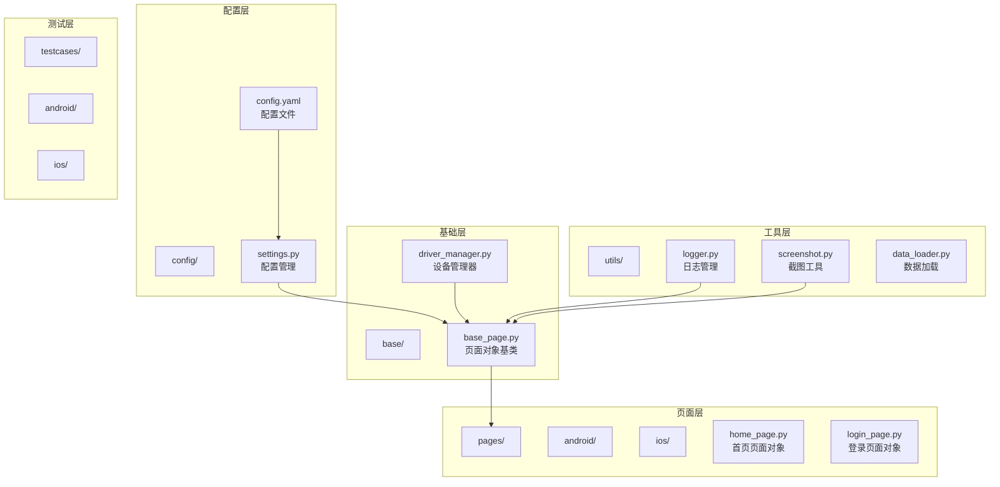

**图表来源**
- [base_page.py:1-320](file://base/base_page.py#L1-L320)
- [settings.py:1-112](file://config/settings.py#L1-L112)
- [driver_manager.py:1-188](file://base/driver_manager.py#L1-L188)

**章节来源**
- [base_page.py:1-320](file://base/base_page.py#L1-L320)
- [settings.py:1-112](file://config/settings.py#L1-L112)
- [driver_manager.py:1-188](file://base/driver_manager.py#L1-L188)

## 核心组件

### BasePage 基类

BasePage 是整个页面对象体系的核心基类，提供了统一的页面操作接口和最佳实践：

#### 主要功能特性

1. **双模式定位支持**：同时支持图像识别和 Poco UI 树定位
2. **智能等待机制**：内置超时管理和自动重试
3. **统一日志记录**：基于 loguru 的结构化日志系统
4. **Allure 集成**：完整的测试报告步骤记录
5. **自动截图功能**：失败时自动截图并附加到报告

#### 关键方法分类

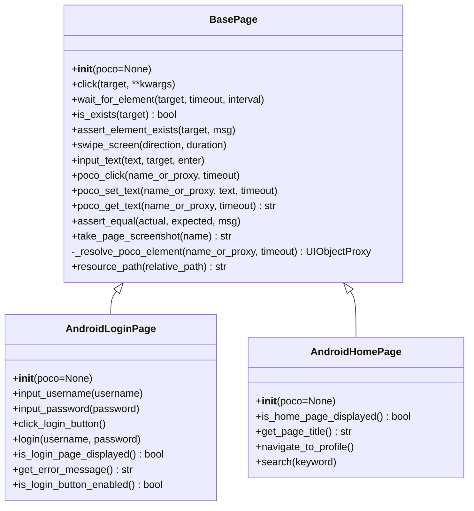

**图表来源**
- [base_page.py:30-320](file://base/base_page.py#L30-L320)
- [login_page.py:14-107](file://pages/android/login_page.py#L14-L107)
- [home_page.py:14-58](file://pages/android/home_page.py#L14-L58)

**章节来源**
- [base_page.py:30-320](file://base/base_page.py#L30-L320)

## 架构概览

AirTestUI 采用分层架构，确保了良好的可扩展性和维护性：

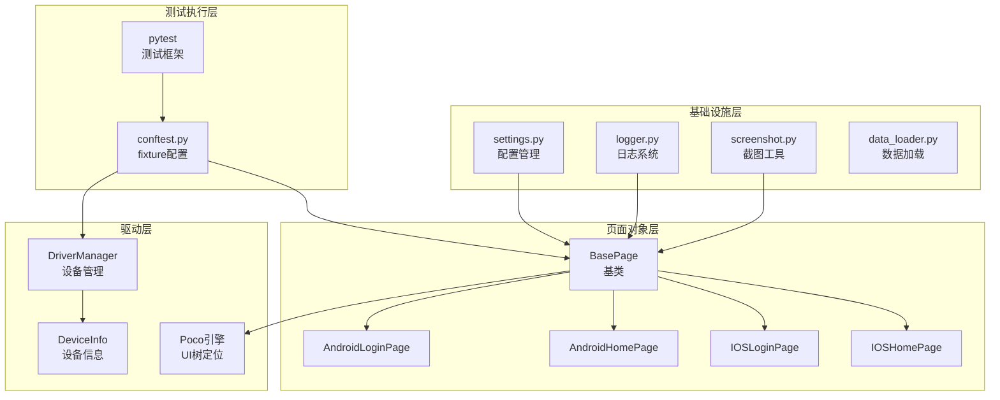

**图表来源**
- [conftest.py:1-255](file://conftest.py#L1-L255)
- [driver_manager.py:51-188](file://base/driver_manager.py#L51-L188)
- [settings.py:51-112](file://config/settings.py#L51-L112)

## 详细组件分析

### BasePage 类详解

BasePage 提供了完整的页面对象开发框架，支持多种定位策略和操作模式。

#### 初始化方法

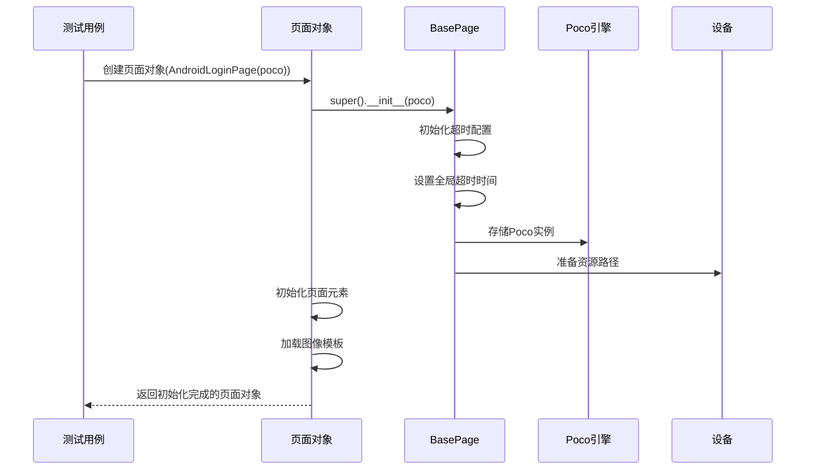

**图表来源**
- [base_page.py:49-57](file://base/base_page.py#L49-L57)
- [login_page.py:23-28](file://pages/android/login_page.py#L23-L28)

#### 图像识别操作

BasePage 提供了完整的图像识别操作接口：

| 方法 | 功能 | 参数 | 返回值 |
|------|------|------|--------|
| `click(target, **kwargs)` | 点击目标元素 | Template对象或坐标元组 | 无 |
| `wait_for_element(target, timeout, interval)` | 等待元素出现 | Template对象 | 元素坐标 |
| `is_exists(target)` | 判断元素是否存在 | Template对象 | bool |
| `assert_element_exists(target, msg)` | 断言元素存在 | Template对象 | 无 |
| `swipe_screen(direction, duration)` | 屏幕滑动 | 方向, 持续时间 | 无 |
| `input_text(text, target, enter)` | 输入文本 | 文本, 目标, 是否回车 | 无 |

#### Poco UI树操作

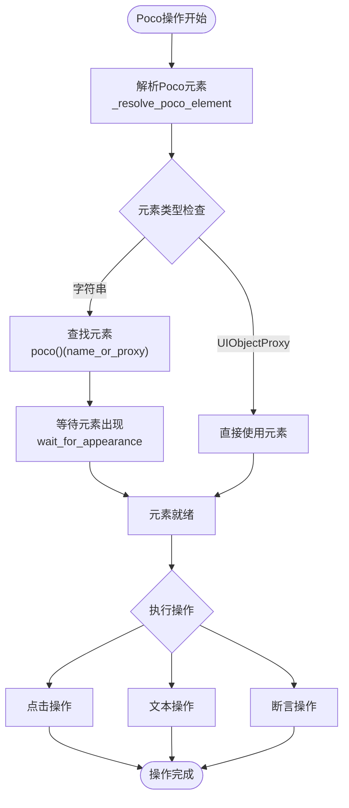

**图表来源**
- [base_page.py:287-306](file://base/base_page.py#L287-L306)
- [base_page.py:192-204](file://base/base_page.py#L192-L204)

**章节来源**
- [base_page.py:59-320](file://base/base_page.py#L59-L320)

### Android 页面对象示例

#### AndroidLoginPage 实现

AndroidLoginPage 展示了如何结合图像识别和 Poco 定位：

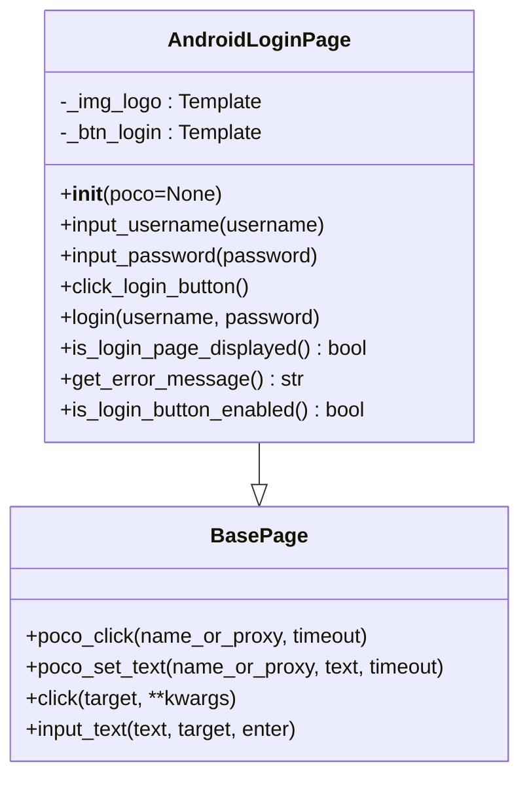

**图表来源**
- [login_page.py:14-107](file://pages/android/login_page.py#L14-L107)
- [base_page.py:30-320](file://base/base_page.py#L30-L320)

#### AndroidHomePage 实现

AndroidHomePage 展示了更复杂的页面操作：

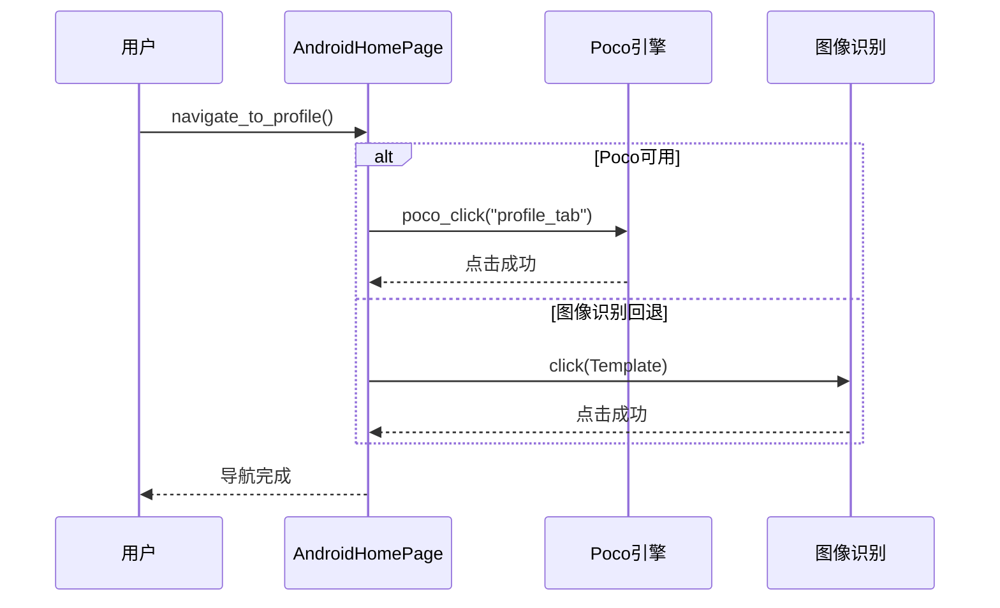

**图表来源**
- [home_page.py:41-47](file://pages/android/home_page.py#L41-L47)

**章节来源**
- [login_page.py:14-107](file://pages/android/login_page.py#L14-L107)
- [home_page.py:14-58](file://pages/android/home_page.py#L14-L58)

### iOS 页面对象示例

#### iOS 页面对象特点

iOS 页面对象主要使用 Poco UI 树定位，提供更稳定的元素识别：

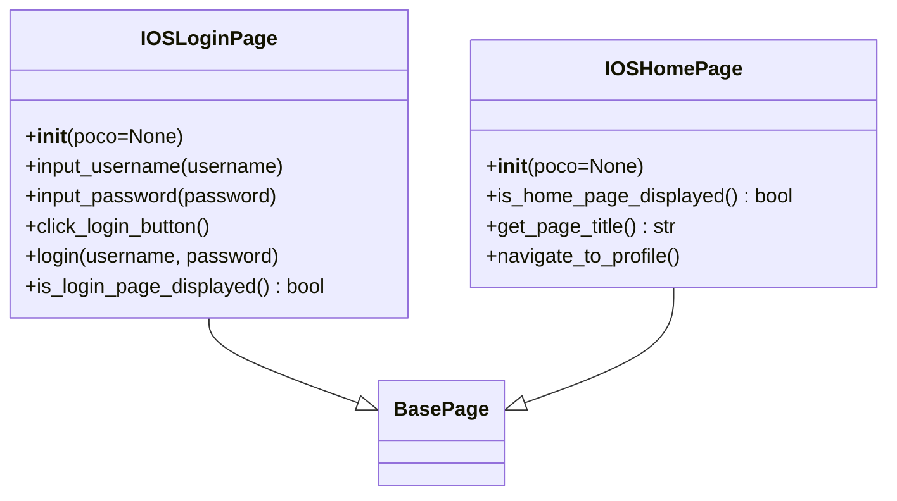

**图表来源**
- [login_page.py:13-65](file://pages/ios/login_page.py#L13-L65)
- [home_page.py:12-43](file://pages/ios/home_page.py#L12-L43)

**章节来源**
- [login_page.py:13-65](file://pages/ios/login_page.py#L13-L65)
- [home_page.py:12-43](file://pages/ios/home_page.py#L12-L43)

## 依赖关系分析

### 设备管理器

DriverManager 实现了设备池管理，支持多设备并发测试：

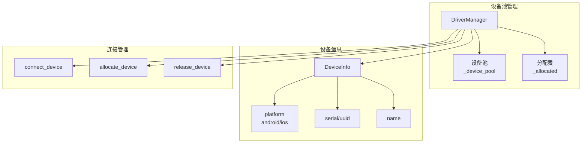

**图表来源**
- [driver_manager.py:51-188](file://base/driver_manager.py#L51-L188)

### 配置管理系统

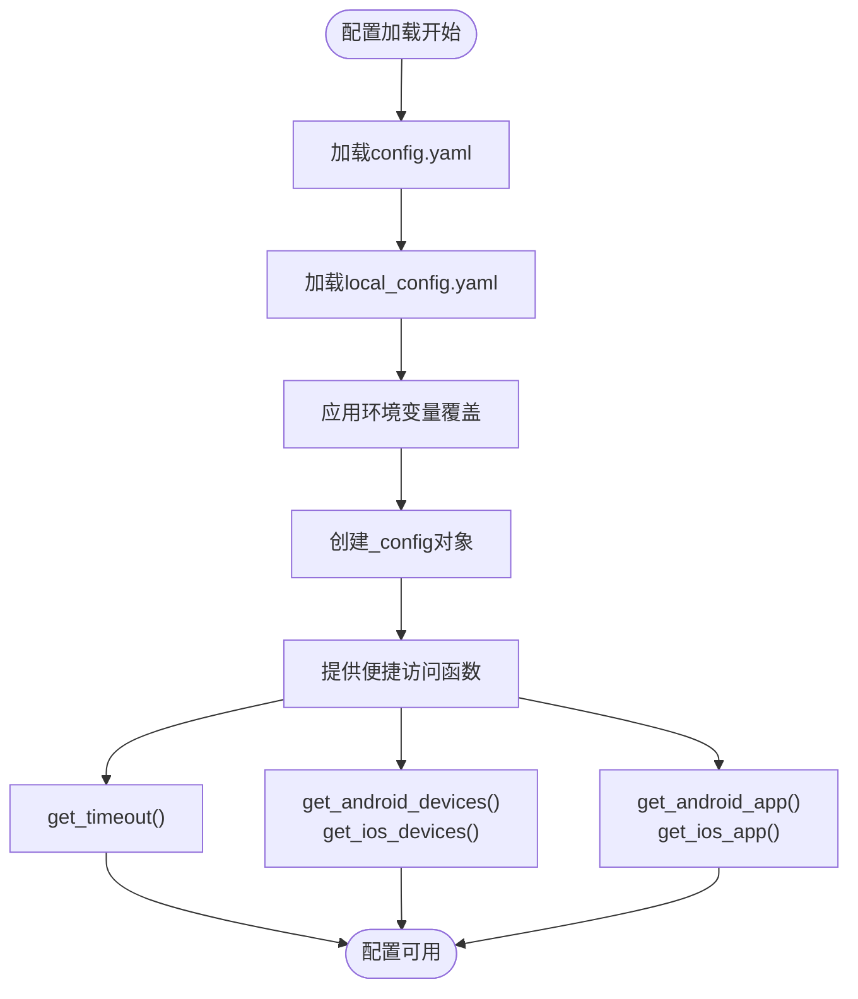

**图表来源**
- [settings.py:14-112](file://config/settings.py#L14-L112)

**章节来源**
- [driver_manager.py:51-188](file://base/driver_manager.py#L51-L188)
- [settings.py:14-112](file://config/settings.py#L14-L112)

## 性能考虑

### 超时配置优化

系统提供了灵活的超时配置机制：

| 配置项 | 默认值 | 用途 | 优化建议 |
|--------|--------|------|----------|
| element_wait | 10秒 | 元素等待超时 | 根据页面复杂度调整 |
| page_load | 30秒 | 页面加载超时 | 复杂页面适当增加 |
| app_launch | 60秒 | APP启动超时 | 真机测试时增加 |

### 设备并发策略

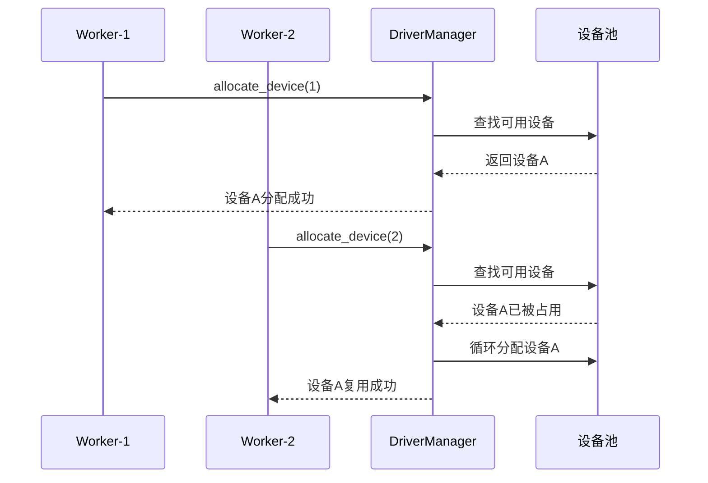

**图表来源**
- [driver_manager.py:119-150](file://base/driver_manager.py#L119-L150)

## 故障排除指南

### 常见问题及解决方案

#### Poco 初始化失败

当 Poco 引擎初始化失败时，系统会自动降级到图像识别模式：

```python
# 在 conftest.py 中的处理逻辑
try:
    # Poco初始化代码
except Exception as e:
    log.warning(f"Poco 初始化失败: {e}，将仅使用图像识别模式")
    return None
```

#### 元素定位失败

BasePage 提供了完善的错误处理机制：

1. **超时处理**：等待元素超时时自动截图并抛出异常
2. **断言失败**：断言失败时自动截图并记录详细信息
3. **异常恢复**：所有操作都有完整的异常捕获和日志记录

#### 截图和日志

系统提供了完整的故障诊断能力：

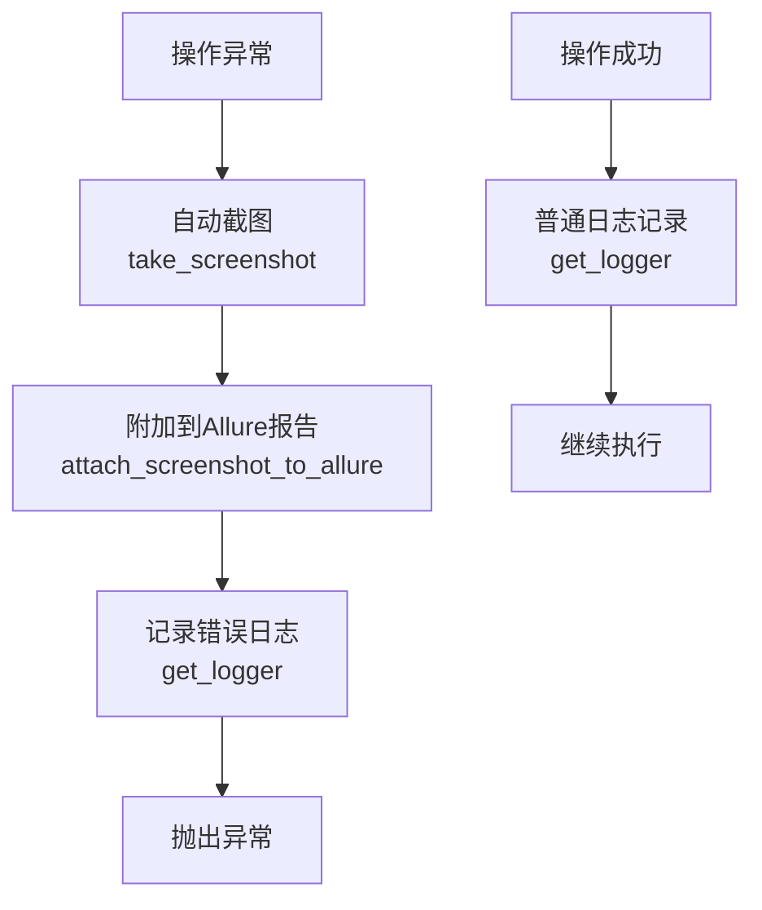

**图表来源**
- [base_page.py:68-74](file://base/base_page.py#L68-L74)
- [screenshot.py:76-89](file://utils/screenshot.py#L76-L89)

**章节来源**
- [base_page.py:68-127](file://base/base_page.py#L68-L127)
- [screenshot.py:76-89](file://utils/screenshot.py#L76-L89)

## 结论

AirTestUI 的页面对象开发框架提供了完整的跨平台移动端自动化测试解决方案。通过 BasePage 基类，开发者可以轻松创建自定义页面对象，实现图像识别和 Poco 定位的无缝结合，支持复杂的业务流程抽象和平台特定功能的实现。

### 最佳实践总结

1. **继承策略**：所有页面对象都应继承 BasePage，充分利用其提供的统一接口
2. **定位策略**：优先使用 Poco 定位，图像识别作为回退方案
3. **错误处理**：利用 BasePage 的自动截图和日志功能进行故障诊断
4. **配置管理**：通过 settings.py 管理全局配置，支持环境变量覆盖
5. **设备管理**：使用 DriverManager 实现多设备并发测试

### 扩展建议

1. **页面对象层次化**：可以创建更高级别的页面对象基类，封装通用业务逻辑
2. **元素封装**：将常用的元素组合封装为复合控件
3. **数据驱动**：结合 data_loader 实现参数化测试
4. **报告增强**：利用 Allure 的丰富功能创建详细的测试报告

通过遵循这些指导原则和最佳实践，开发者可以快速构建稳定、可维护的页面对象体系，提高移动端自动化测试的效率和质量。