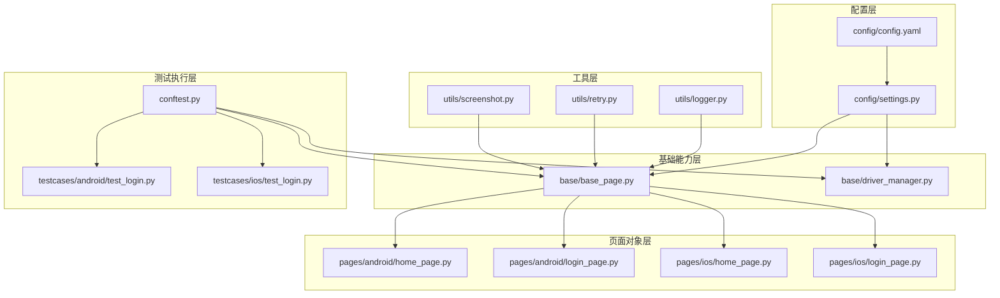
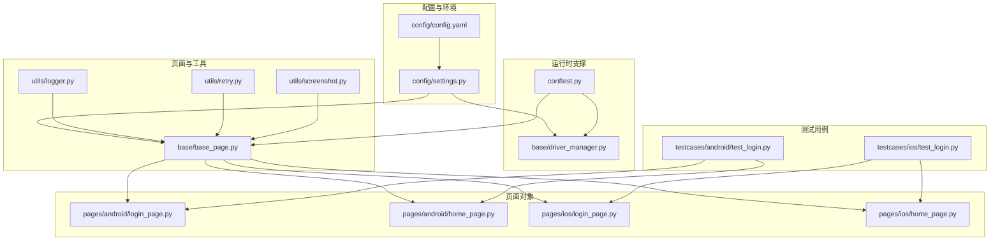
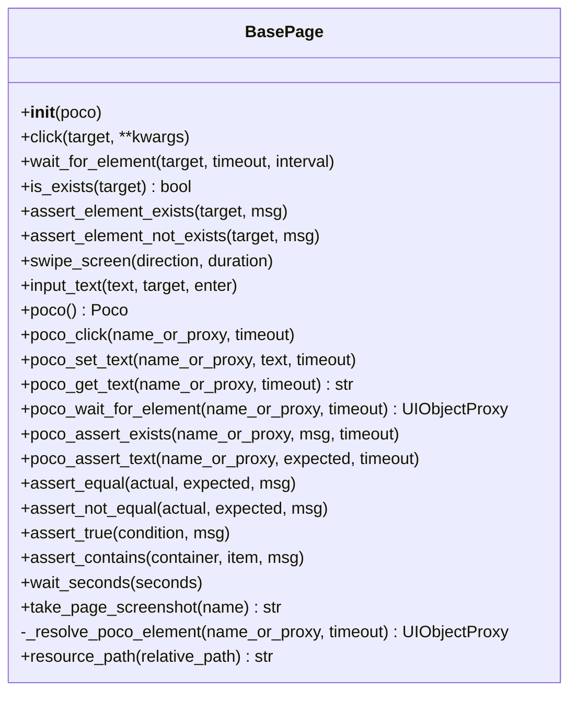
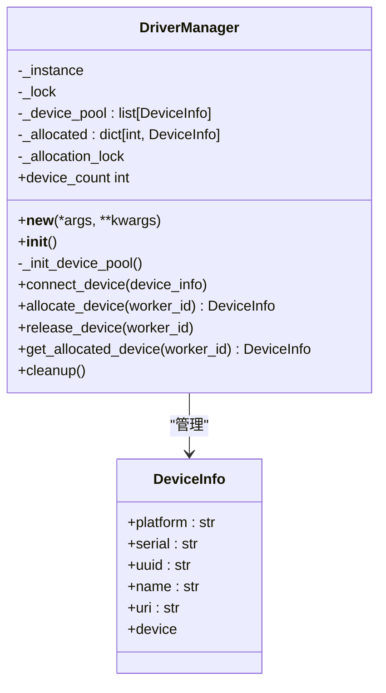
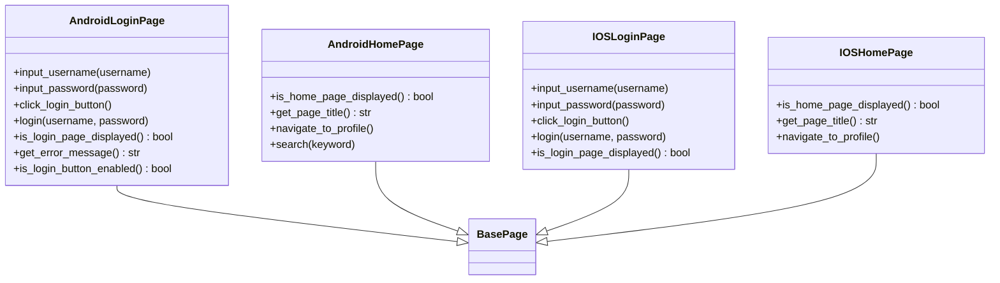
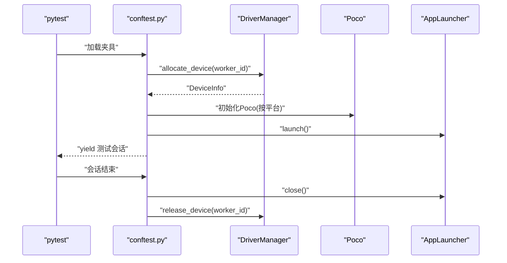
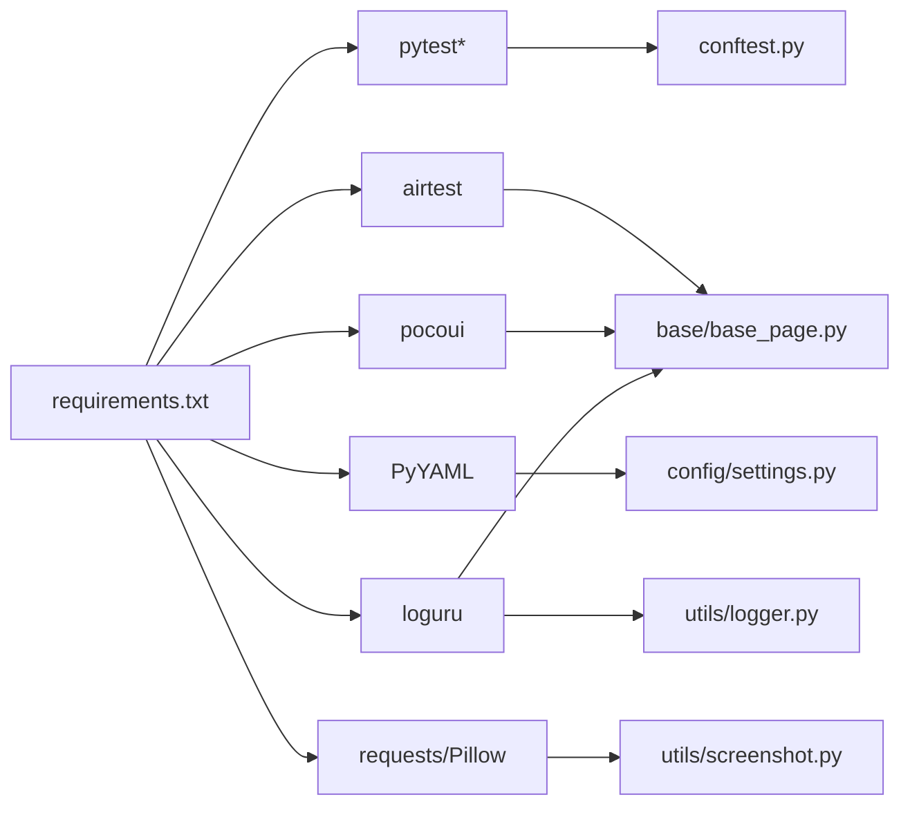

# 高级功能与扩展

<cite>
**本文引用的文件**
- [base/base_page.py](file://base/base_page.py)
- [base/driver_manager.py](file://base/driver_manager.py)
- [utils/logger.py](file://utils/logger.py)
- [utils/retry.py](file://utils/retry.py)
- [utils/screenshot.py](file://utils/screenshot.py)
- [pages/android/home_page.py](file://pages/android/home_page.py)
- [pages/android/login_page.py](file://pages/android/login_page.py)
- [pages/ios/home_page.py](file://pages/ios/home_page.py)
- [pages/ios/login_page.py](file://pages/ios/login_page.py)
- [config/settings.py](file://config/settings.py)
- [config/config.yaml](file://config/config.yaml)
- [testcases/android/test_login.py](file://testcases/android/test_login.py)
- [testcases/ios/test_login.py](file://testcases/ios/test_login.py)
- [conftest.py](file://conftest.py)
- [requirements.txt](file://requirements.txt)
</cite>

## 目录
1. [简介](#简介)
2. [项目结构](#项目结构)
3. [核心组件](#核心组件)
4. [架构总览](#架构总览)
5. [详细组件分析](#详细组件分析)
6. [依赖分析](#依赖分析)
7. [性能考虑](#性能考虑)
8. [故障排查指南](#故障排查指南)
9. [结论](#结论)
10. [附录](#附录)

## 简介
本文件面向AirTestUI的高级使用者与扩展开发者，系统讲解如何基于现有框架进行自定义页面对象开发、工具函数扩展、性能优化与故障排查，并总结框架扩展的最佳实践与注意事项。内容涵盖：
- 自定义页面对象的开发方法：复杂元素封装、业务流程抽象、平台差异处理
- 工具函数扩展机制：自定义日志、特殊重试策略、定制化截图
- 性能优化技巧：定位效率、执行速度、内存占用
- 故障排查方法：日志分析、设备问题诊断、网络环境检查
- 框架扩展最佳实践与注意事项

## 项目结构
AirTestUI采用分层+按平台组织的结构：基础能力在base与utils，页面对象在pages，测试用例在testcases，配置在config，入口与夹具在conftest.py。

**图表来源**
- [config/config.yaml:1-70](file://config/config.yaml#L1-L70)
- [config/settings.py:1-112](file://config/settings.py#L1-L112)
- [base/base_page.py:1-320](file://base/base_page.py#L1-L320)
- [base/driver_manager.py:1-188](file://base/driver_manager.py#L1-L188)
- [utils/logger.py:1-59](file://utils/logger.py#L1-L59)
- [utils/retry.py:1-102](file://utils/retry.py#L1-L102)
- [utils/screenshot.py:1-89](file://utils/screenshot.py#L1-L89)
- [pages/android/home_page.py:1-58](file://pages/android/home_page.py#L1-L58)
- [pages/android/login_page.py:1-107](file://pages/android/login_page.py#L1-L107)
- [pages/ios/home_page.py:1-43](file://pages/ios/home_page.py#L1-L43)
- [pages/ios/login_page.py:1-65](file://pages/ios/login_page.py#L1-L65)
- [testcases/android/test_login.py:1-71](file://testcases/android/test_login.py#L1-L71)
- [testcases/ios/test_login.py:1-43](file://testcases/ios/test_login.py#L1-L43)
- [conftest.py:1-255](file://conftest.py#L1-L255)

**章节来源**
- [config/config.yaml:1-70](file://config/config.yaml#L1-L70)
- [config/settings.py:1-112](file://config/settings.py#L1-L112)
- [base/base_page.py:1-320](file://base/base_page.py#L1-L320)
- [base/driver_manager.py:1-188](file://base/driver_manager.py#L1-L188)
- [utils/logger.py:1-59](file://utils/logger.py#L1-L59)
- [utils/retry.py:1-102](file://utils/retry.py#L1-L102)
- [utils/screenshot.py:1-89](file://utils/screenshot.py#L1-L89)
- [pages/android/home_page.py:1-58](file://pages/android/home_page.py#L1-L58)
- [pages/android/login_page.py:1-107](file://pages/android/login_page.py#L1-L107)
- [pages/ios/home_page.py:1-43](file://pages/ios/home_page.py#L1-L43)
- [pages/ios/login_page.py:1-65](file://pages/ios/login_page.py#L1-L65)
- [testcases/android/test_login.py:1-71](file://testcases/android/test_login.py#L1-L71)
- [testcases/ios/test_login.py:1-43](file://testcases/ios/test_login.py#L1-L43)
- [conftest.py:1-255](file://conftest.py#L1-L255)

## 核心组件
- 基础页面对象基类：提供图像识别与Poco双模式的统一交互接口，内置智能等待、自动截图、断言与Allure步骤记录。
- 设备驱动管理器：单例设备池，支持Android/iOS设备按worker分配与复用，管理连接生命周期。
- 工具模块：日志（loguru）、重试（装饰器）、截图（本地+Allure附件）。
- 页面对象：Android/iOS登录页与首页示例，展示Poco与图像识别混合策略。
- 配置系统：YAML配置+环境变量覆盖，统一超时、设备、APP、截图、重试、通知等参数。
- 测试夹具：多设备并发、Poco初始化、APP启停、Allure步骤与失败截图。

**章节来源**
- [base/base_page.py:30-320](file://base/base_page.py#L30-L320)
- [base/driver_manager.py:51-188](file://base/driver_manager.py#L51-L188)
- [utils/logger.py:1-59](file://utils/logger.py#L1-L59)
- [utils/retry.py:1-102](file://utils/retry.py#L1-L102)
- [utils/screenshot.py:1-89](file://utils/screenshot.py#L1-L89)
- [pages/android/login_page.py:14-107](file://pages/android/login_page.py#L14-L107)
- [pages/android/home_page.py:14-58](file://pages/android/home_page.py#L14-L58)
- [pages/ios/login_page.py:13-65](file://pages/ios/login_page.py#L13-L65)
- [pages/ios/home_page.py:12-43](file://pages/ios/home_page.py#L12-L43)
- [config/settings.py:51-112](file://config/settings.py#L51-L112)
- [config/config.yaml:1-70](file://config/config.yaml#L1-L70)
- [conftest.py:140-255](file://conftest.py#L140-L255)

## 架构总览
AirTestUI以“配置驱动 + 基础页面对象 + 工具函数 + 页面对象 + 测试夹具”的方式组织，形成可扩展、可维护、跨平台的自动化测试体系。

**图表来源**
- [config/config.yaml:1-70](file://config/config.yaml#L1-L70)
- [config/settings.py:1-112](file://config/settings.py#L1-L112)
- [base/driver_manager.py:1-188](file://base/driver_manager.py#L1-L188)
- [conftest.py:1-255](file://conftest.py#L1-L255)
- [base/base_page.py:1-320](file://base/base_page.py#L1-L320)
- [utils/logger.py:1-59](file://utils/logger.py#L1-L59)
- [utils/retry.py:1-102](file://utils/retry.py#L1-L102)
- [utils/screenshot.py:1-89](file://utils/screenshot.py#L1-L89)
- [pages/android/login_page.py:1-107](file://pages/android/login_page.py#L1-L107)
- [pages/android/home_page.py:1-58](file://pages/android/home_page.py#L1-L58)
- [pages/ios/login_page.py:1-65](file://pages/ios/login_page.py#L1-L65)
- [pages/ios/home_page.py:1-43](file://pages/ios/home_page.py#L1-L43)
- [testcases/android/test_login.py:1-71](file://testcases/android/test_login.py#L1-L71)
- [testcases/ios/test_login.py:1-43](file://testcases/ios/test_login.py#L1-L43)

## 详细组件分析

### 基础页面对象基类（BasePage）
- 双模式定位：图像识别（Template）与Poco UI树定位并存，自动降级与兼容。
- 统一交互：点击、等待、断言、输入、滑动、截图、显式等待等。
- 智能等待与异常处理：统一超时、失败截图、Allure步骤记录。
- Poco解析：支持字符串节点名与UIObjectProxy实例，自动等待出现。
- 资源路径：提供resource_path辅助拼接资源文件路径。

**图表来源**
- [base/base_page.py:30-320](file://base/base_page.py#L30-L320)

**章节来源**
- [base/base_page.py:30-320](file://base/base_page.py#L30-L320)

### 设备驱动管理器（DriverManager）
- 单例模式，线程安全分配设备，支持Android/iOS设备池。
- 支持多worker共享设备复用，连接失败记录与异常抛出。
- 提供设备URI生成、连接、分配、释放、清理等能力。

**图表来源**
- [base/driver_manager.py:20-188](file://base/driver_manager.py#L20-L188)

**章节来源**
- [base/driver_manager.py:51-188](file://base/driver_manager.py#L51-L188)

### 日志模块（Logger）
- 基于loguru，控制台彩色输出与文件轮转（DEBUG全量日志、ERROR错误日志）。
- 支持结构化绑定模块名，便于追踪来源。

**章节来源**
- [utils/logger.py:1-59](file://utils/logger.py#L1-L59)

### 重试模块（Retry）
- 通用重试装饰器：支持最大次数、等待间隔、触发异常类型、重试回调。
- 条件重试装饰器：持续检查直到返回True，适合等待页面状态。

**章节来源**
- [utils/retry.py:1-102](file://utils/retry.py#L1-L102)

### 截图模块（Screenshot）
- 统一截图保存目录与命名规则，支持设备指定截图。
- Allure附件集成，失败自动截图与附加。
- 方法级失败截图装饰器。

**章节来源**
- [utils/screenshot.py:1-89](file://utils/screenshot.py#L1-L89)

### 页面对象示例（Android/iOS）
- 登录页：演示Poco与图像识别混合策略；封装输入、点击、登录流程与验证。
- 首页：演示导航、标题获取、存在性验证等。

**图表来源**
- [pages/android/login_page.py:14-107](file://pages/android/login_page.py#L14-L107)
- [pages/android/home_page.py:14-58](file://pages/android/home_page.py#L14-L58)
- [pages/ios/login_page.py:13-65](file://pages/ios/login_page.py#L13-L65)
- [pages/ios/home_page.py:12-43](file://pages/ios/home_page.py#L12-L43)
- [base/base_page.py:30-320](file://base/base_page.py#L30-L320)

**章节来源**
- [pages/android/login_page.py:14-107](file://pages/android/login_page.py#L14-L107)
- [pages/android/home_page.py:14-58](file://pages/android/home_page.py#L14-L58)
- [pages/ios/login_page.py:13-65](file://pages/ios/login_page.py#L13-L65)
- [pages/ios/home_page.py:12-43](file://pages/ios/home_page.py#L12-L43)

### 测试夹具与配置（conftest + settings）
- 多设备并发：worker_id → 设备池分配 → Poco初始化 → APP启停。
- Allure环境注入、失败自动截图与报告统计。
- 配置加载：YAML + 本地覆盖 + 环境变量覆盖，统一超时、设备、APP、截图、重试、通知等。

**图表来源**
- [conftest.py:151-227](file://conftest.py#L151-L227)
- [base/driver_manager.py:119-167](file://base/driver_manager.py#L119-L167)

**章节来源**
- [conftest.py:140-255](file://conftest.py#L140-L255)
- [config/settings.py:51-112](file://config/settings.py#L51-L112)
- [config/config.yaml:1-70](file://config/config.yaml#L1-L70)

## 依赖分析
- 外部依赖：pytest系列、airtest/pocoui、PyYAML、loguru、requests/Pillow等。
- 内部耦合：BasePage依赖配置与工具模块；页面对象依赖BasePage；夹具依赖DriverManager与AppLauncher；测试用例依赖页面对象。

**图表来源**
- [requirements.txt:1-21](file://requirements.txt#L1-L21)
- [conftest.py:1-255](file://conftest.py#L1-L255)
- [base/base_page.py:1-320](file://base/base_page.py#L1-L320)
- [config/settings.py:1-112](file://config/settings.py#L1-L112)
- [utils/logger.py:1-59](file://utils/logger.py#L1-L59)
- [utils/screenshot.py:1-89](file://utils/screenshot.py#L1-L89)

**章节来源**
- [requirements.txt:1-21](file://requirements.txt#L1-L21)
- [conftest.py:1-255](file://conftest.py#L1-L255)
- [base/base_page.py:1-320](file://base/base_page.py#L1-L320)
- [config/settings.py:1-112](file://config/settings.py#L1-L112)
- [utils/logger.py:1-59](file://utils/logger.py#L1-L59)
- [utils/screenshot.py:1-89](file://utils/screenshot.py#L1-L89)

## 性能考虑
- 定位效率
  - 优先使用Poco UI树定位，避免频繁图像识别；在Poco不可用时再回落到图像识别。
  - 合理设置超时：元素等待与页面加载超时由配置统一管理，避免过长或过短。
  - 资源路径复用：使用BasePage.resource_path减少路径拼接成本。
- 执行速度
  - 关闭Poco每步截图（默认screenshot_each_action=False），降低I/O与通信开销。
  - 合理使用显式等待：尽量结合断言与条件重试，减少无效轮询。
  - 多设备并发：利用xdist与DriverManager按worker分配设备，提高吞吐。
- 内存占用
  - 控制截图数量：仅在必要时截图，关闭on_step开关。
  - 合理释放设备：测试会话结束后及时释放，避免句柄泄漏。
  - 日志级别：生产环境使用INFO及以上级别，避免过多DEBUG日志。

[本节为通用指导，无需具体文件分析]

## 故障排查指南
- 日志分析
  - 查看logs目录下全量与错误日志，结合模块名定位来源。
  - 关注失败截图命名与Allure附件，快速定位问题界面。
- 设备问题诊断
  - 检查设备池配置与URI格式，确认Android序列号或iOS UUID正确。
  - 多worker场景下确认设备分配与复用逻辑，避免冲突。
- 网络环境检查
  - Poco连接失败时回退到图像识别模式，关注初始化失败日志。
  - APP启停失败时检查包名/Bundle ID与安装路径配置。
- 常见问题
  - 元素未出现：调高元素等待超时或使用条件重试装饰器。
  - 断言失败：开启失败截图并查看Allure报告，结合日志定位原因。

**章节来源**
- [utils/logger.py:1-59](file://utils/logger.py#L1-L59)
- [utils/screenshot.py:1-89](file://utils/screenshot.py#L1-L89)
- [base/driver_manager.py:103-150](file://base/driver_manager.py#L103-L150)
- [conftest.py:185-208](file://conftest.py#L185-L208)
- [config/config.yaml:47-70](file://config/config.yaml#L47-L70)

## 结论
AirTestUI通过“配置驱动 + 基础页面对象 + 工具函数 + 页面对象 + 测试夹具”的架构，提供了跨平台、可扩展、易维护的移动端自动化测试能力。开发者可在BasePage之上进行页面对象扩展，在工具模块上实现自定义日志、重试与截图策略，并结合配置系统与夹具完成多设备并发与APP生命周期管理。建议在生产环境中严格控制截图与日志规模，合理设置超时与重试策略，确保稳定性与性能的平衡。

[本节为总结性内容，无需具体文件分析]

## 附录

### 自定义页面对象开发要点
- 复杂元素封装
  - 将常用元素封装为属性，统一命名与资源路径。
  - 在Poco不可用时提供图像识别兜底方案。
- 业务流程抽象
  - 将多个页面操作组合为业务步骤，如登录流程、搜索流程。
  - 在页面对象内进行断言与状态校验，保证流程完整性。
- 平台特定功能
  - Android/iOS分别适配Poco节点名与图像模板，注意命名一致性。
  - 使用BasePage.resource_path统一资源路径，避免硬编码。

**章节来源**
- [pages/android/login_page.py:23-74](file://pages/android/login_page.py#L23-L74)
- [pages/android/home_page.py:17-58](file://pages/android/home_page.py#L17-L58)
- [pages/ios/login_page.py:21-54](file://pages/ios/login_page.py#L21-L54)
- [pages/ios/home_page.py:15-43](file://pages/ios/home_page.py#L15-L43)
- [base/base_page.py:309-320](file://base/base_page.py#L309-L320)

### 工具函数扩展机制
- 自定义日志记录
  - 使用get_logger绑定模块名，按需输出DEBUG/INFO/WARNING/ERROR。
- 特殊重试策略
  - 使用retry装饰器配置最大次数与等待间隔；使用retry_until_true等待条件满足。
- 定制化截图功能
  - 自定义截图目录与命名规则；在失败时自动截图并附加到Allure。

**章节来源**
- [utils/logger.py:50-59](file://utils/logger.py#L50-L59)
- [utils/retry.py:13-65](file://utils/retry.py#L13-L65)
- [utils/retry.py:67-102](file://utils/retry.py#L67-L102)
- [utils/screenshot.py:17-53](file://utils/screenshot.py#L17-L53)
- [utils/screenshot.py:55-89](file://utils/screenshot.py#L55-L89)

### 框架扩展最佳实践
- 配置优先：将可变参数集中到config.yaml，支持环境变量覆盖。
- 低耦合高内聚：页面对象只负责业务语义，基础能力下沉至BasePage与工具模块。
- 可观测性：Allure步骤、失败截图、结构化日志三者结合，快速定位问题。
- 并发安全：DriverManager使用锁与单例，确保多worker场景下的设备分配安全。
- 可靠性：结合重试装饰器与断言，提升测试鲁棒性。

**章节来源**
- [config/config.yaml:1-70](file://config/config.yaml#L1-L70)
- [config/settings.py:20-31](file://config/settings.py#L20-L31)
- [base/driver_manager.py:61-71](file://base/driver_manager.py#L61-L71)
- [conftest.py:230-236](file://conftest.py#L230-L236)